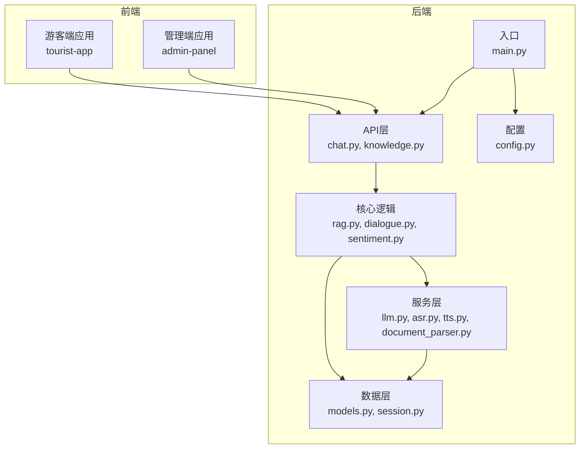
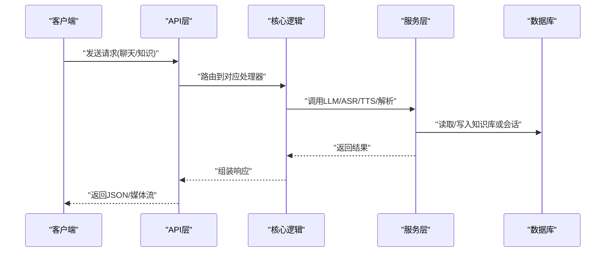
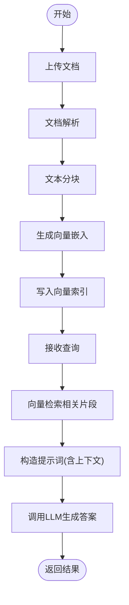
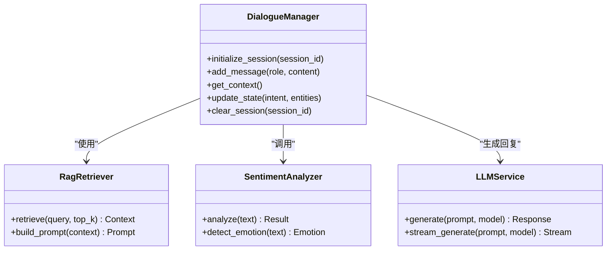
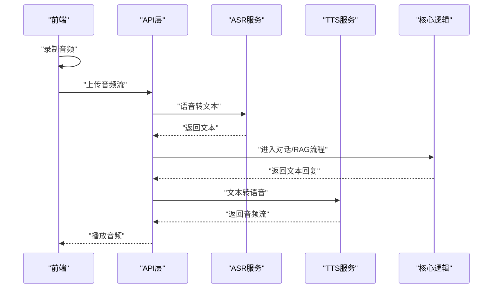
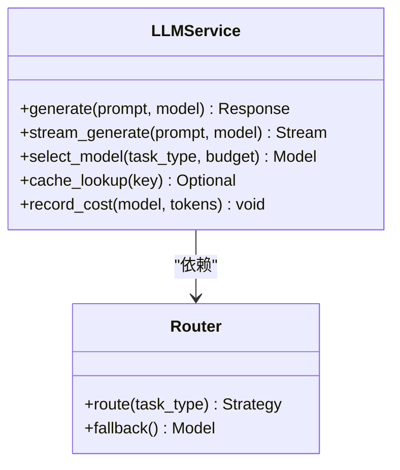
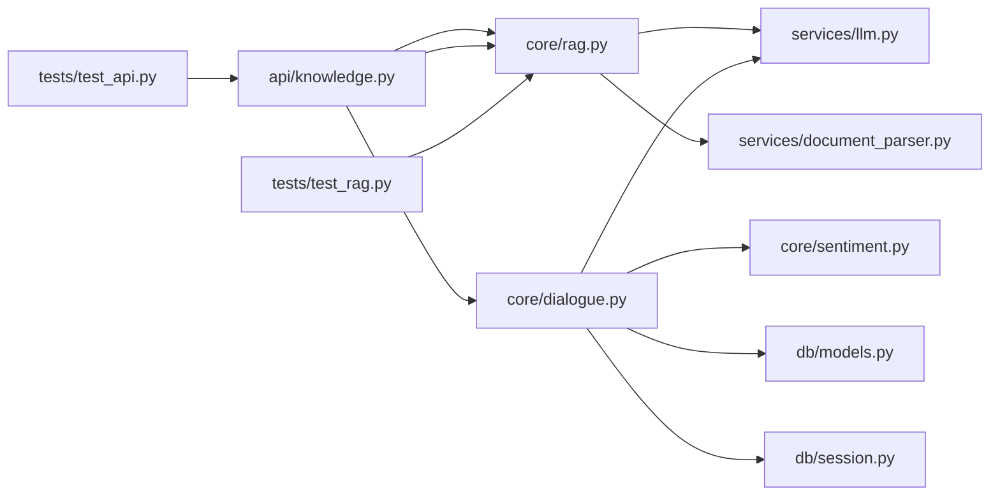

# AI与机器学习组件

<cite>
**本文引用的文件**   
- [backend/app/main.py](file://backend/app/main.py)
- [backend/app/config.py](file://backend/app/config.py)
- [backend/app/core/rag.py](file://backend/app/core/rag.py)
- [backend/app/core/dialogue.py](file://backend/app/core/dialogue.py)
- [backend/app/core/sentiment.py](file://backend/app/core/sentiment.py)
- [backend/app/services/llm.py](file://backend/app/services/llm.py)
- [backend/app/services/asr.py](file://backend/app/services/asr.py)
- [backend/app/services/tts.py](file://backend/app/services/tts.py)
- [backend/app/services/document_parser.py](file://backend/app/services/document_parser.py)
- [backend/app/api/chat.py](file://backend/app/api/chat.py)
- [backend/app/api/knowledge.py](file://backend/app/api/knowledge.py)
- [backend/app/models/schemas.py](file://backend/app/models/schemas.py)
- [backend/app/db/models.py](file://backend/app/db/models.py)
- [backend/app/db/session.py](file://backend/app/db/session.py)
- [backend/tests/test_rag.py](file://backend/tests/test_rag.py)
- [backend/tests/test_api.py](file://backend/tests/test_api.py)
- [backend/pyproject.toml](file://backend/pyproject.toml)
- [frontend/tourist-app/src/services/speech.ts](file://frontend/tourist-app/src/services/speech.ts)
- [frontend/tourist-app/src/components/VoiceInput/VoiceInput.vue](file://frontend/tourist-app/src/components/VoiceInput/VoiceInput.vue)
</cite>

## 目录
1. [简介](#简介)
2. [项目结构](#项目结构)
3. [核心组件](#核心组件)
4. [架构总览](#架构总览)
5. [详细组件分析](#详细组件分析)
6. [依赖关系分析](#依赖关系分析)
7. [性能考量](#性能考量)
8. [故障排查指南](#故障排查指南)
9. [结论](#结论)
10. [附录](#附录)

## 简介
本技术文档聚焦SmartTour项目的AI与机器学习组件，覆盖以下关键能力：
- RAG检索增强生成系统：知识库构建、向量检索、提示词工程策略
- 智能对话系统：对话状态管理、上下文理解、多轮对话处理、情感分析
- 语音交互系统：ASR语音识别集成、TTS语音合成实现、语音情感分析
- LLM服务集成：模型选择策略、性能优化与成本控制方案

目标是为AI功能的开发与优化提供深入的技术指导，帮助读者快速理解并扩展系统能力。

## 项目结构
后端采用分层架构：API层暴露REST接口，核心逻辑位于core模块（RAG、对话、情感），服务层封装LLM、ASR、TTS、文档解析等外部能力，数据访问通过db层进行持久化。前端包含游客端与管理端，游客端提供聊天、数字人展示与语音输入能力。

图表来源
- [backend/app/main.py](file://backend/app/main.py)
- [backend/app/api/chat.py](file://backend/app/api/chat.py)
- [backend/app/api/knowledge.py](file://backend/app/api/knowledge.py)
- [backend/app/core/rag.py](file://backend/app/core/rag.py)
- [backend/app/core/dialogue.py](file://backend/app/core/dialogue.py)
- [backend/app/core/sentiment.py](file://backend/app/core/sentiment.py)
- [backend/app/services/llm.py](file://backend/app/services/llm.py)
- [backend/app/services/asr.py](file://backend/app/services/asr.py)
- [backend/app/services/tts.py](file://backend/app/services/tts.py)
- [backend/app/services/document_parser.py](file://backend/app/services/document_parser.py)
- [backend/app/db/models.py](file://backend/app/db/models.py)
- [backend/app/db/session.py](file://backend/app/db/session.py)
- [backend/app/config.py](file://backend/app/config.py)

章节来源
- [backend/app/main.py](file://backend/app/main.py)
- [backend/app/config.py](file://backend/app/config.py)
- [backend/app/api/chat.py](file://backend/app/api/chat.py)
- [backend/app/api/knowledge.py](file://backend/app/api/knowledge.py)
- [backend/app/core/rag.py](file://backend/app/core/rag.py)
- [backend/app/core/dialogue.py](file://backend/app/core/dialogue.py)
- [backend/app/core/sentiment.py](file://backend/app/core/sentiment.py)
- [backend/app/services/llm.py](file://backend/app/services/llm.py)
- [backend/app/services/asr.py](file://backend/app/services/asr.py)
- [backend/app/services/tts.py](file://backend/app/services/tts.py)
- [backend/app/services/document_parser.py](file://backend/app/services/document_parser.py)
- [backend/app/db/models.py](file://backend/app/db/models.py)
- [backend/app/db/session.py](file://backend/app/db/session.py)

## 核心组件
- RAG检索增强生成：负责将文档解析为片段、向量化入库、按查询检索相关片段并构造提示词，最终调用LLM生成答案。
- 智能对话：维护会话状态与上下文，支持多轮对话与意图识别，结合情感分析提升回复质量。
- 语音交互：前端采集音频流，后端ASR转文本，TTS将文本转为语音；同时可进行语音情感分析。
- LLM服务：统一封装大模型调用，支持模型路由、缓存、重试与成本统计。
- 知识库管理：提供文档上传、解析、分块、索引与更新接口。

章节来源
- [backend/app/core/rag.py](file://backend/app/core/rag.py)
- [backend/app/core/dialogue.py](file://backend/app/core/dialogue.py)
- [backend/app/core/sentiment.py](file://backend/app/core/sentiment.py)
- [backend/app/services/llm.py](file://backend/app/services/llm.py)
- [backend/app/services/asr.py](file://backend/app/services/asr.py)
- [backend/app/services/tts.py](file://backend/app/services/tts.py)
- [backend/app/services/document_parser.py](file://backend/app/services/document_parser.py)
- [backend/app/api/knowledge.py](file://backend/app/api/knowledge.py)

## 架构总览
整体流程从前端发起请求开始，经API路由到核心逻辑，再调用服务层完成具体任务，必要时读写数据库，最后返回结构化响应。

图表来源
- [backend/app/api/chat.py](file://backend/app/api/chat.py)
- [backend/app/api/knowledge.py](file://backend/app/api/knowledge.py)
- [backend/app/core/rag.py](file://backend/app/core/rag.py)
- [backend/app/core/dialogue.py](file://backend/app/core/dialogue.py)
- [backend/app/services/llm.py](file://backend/app/services/llm.py)
- [backend/app/services/asr.py](file://backend/app/services/asr.py)
- [backend/app/services/tts.py](file://backend/app/services/tts.py)
- [backend/app/db/models.py](file://backend/app/db/models.py)

## 详细组件分析

### RAG检索增强生成系统
RAG由“文档解析→分块→向量化→索引→检索→提示词构造→LLM生成”构成。知识库构建流程包括文档上传、格式解析、切分策略、嵌入生成与存储；检索阶段根据用户问题召回相关片段，结合提示词工程生成高质量回答。

图表来源
- [backend/app/api/knowledge.py](file://backend/app/api/knowledge.py)
- [backend/app/services/document_parser.py](file://backend/app/services/document_parser.py)
- [backend/app/core/rag.py](file://backend/app/core/rag.py)
- [backend/app/services/llm.py](file://backend/app/services/llm.py)

章节来源
- [backend/app/api/knowledge.py](file://backend/app/api/knowledge.py)
- [backend/app/services/document_parser.py](file://backend/app/services/document_parser.py)
- [backend/app/core/rag.py](file://backend/app/core/rag.py)
- [backend/app/services/llm.py](file://backend/app/services/llm.py)
- [backend/tests/test_rag.py](file://backend/tests/test_rag.py)

#### 知识库构建流程
- 文档解析：支持多种格式，提取纯文本与元信息。
- 文本分块：按语义或固定长度切分，保留必要上下文。
- 向量化：使用嵌入模型生成向量，写入向量库。
- 索引管理：支持增量更新与版本控制。

章节来源
- [backend/app/services/document_parser.py](file://backend/app/services/document_parser.py)
- [backend/app/core/rag.py](file://backend/app/core/rag.py)

#### 向量检索算法
- 相似度度量：余弦相似度或内积。
- 召回策略：Top-K检索，可结合重排序。
- 过滤条件：基于元数据进行筛选。

章节来源
- [backend/app/core/rag.py](file://backend/app/core/rag.py)

#### 提示词工程策略
- 角色设定与任务描述：明确助手身份与输出要求。
- 上下文注入：仅注入高相关片段，避免噪声。
- 约束与格式：规定输出结构与引用来源。
- 安全与合规：屏蔽敏感信息与不当内容。

章节来源
- [backend/app/core/rag.py](file://backend/app/core/rag.py)

### 智能对话系统
对话系统负责会话状态管理、上下文理解、多轮对话处理与情感分析。通过会话ID维护历史消息，结合RAG获取领域知识，利用情感分析调整语气与策略。

图表来源
- [backend/app/core/dialogue.py](file://backend/app/core/dialogue.py)
- [backend/app/core/sentiment.py](file://backend/app/core/sentiment.py)
- [backend/app/core/rag.py](file://backend/app/core/rag.py)
- [backend/app/services/llm.py](file://backend/app/services/llm.py)

章节来源
- [backend/app/core/dialogue.py](file://backend/app/core/dialogue.py)
- [backend/app/core/sentiment.py](file://backend/app/core/sentiment.py)
- [backend/app/core/rag.py](file://backend/app/core/rag.py)
- [backend/app/services/llm.py](file://backend/app/services/llm.py)

#### 对话状态管理与上下文理解
- 会话生命周期：创建、更新、清理。
- 上下文窗口：限制历史消息数量与长度，保证效率。
- 意图识别：抽取用户意图与实体，辅助决策。

章节来源
- [backend/app/core/dialogue.py](file://backend/app/core/dialogue.py)

#### 多轮对话处理
- 记忆机制：保存关键事实与偏好。
- 指代消解：处理代词与省略表达。
- 策略切换：根据场景切换RAG或通用对话模式。

章节来源
- [backend/app/core/dialogue.py](file://backend/app/core/dialogue.py)

#### 情感分析功能
- 情绪分类：正面、中性、负面。
- 强度评估：用于调整语气与推荐策略。
- 融合策略：在提示词中注入情感标签。

章节来源
- [backend/app/core/sentiment.py](file://backend/app/core/sentiment.py)

### 语音交互系统
语音交互涵盖前端录音、ASR转写、TTS合成与语音情感分析。前端通过Web Audio API采集音频，后端ASR服务将音频转为文本，TTS服务将文本转为音频流返回。

图表来源
- [backend/app/api/chat.py](file://backend/app/api/chat.py)
- [backend/app/services/asr.py](file://backend/app/services/asr.py)
- [backend/app/services/tts.py](file://backend/app/services/tts.py)
- [frontend/tourist-app/src/services/speech.ts](file://frontend/tourist-app/src/services/speech.ts)
- [frontend/tourist-app/src/components/VoiceInput/VoiceInput.vue](file://frontend/tourist-app/src/components/VoiceInput/VoiceInput.vue)

章节来源
- [backend/app/api/chat.py](file://backend/app/api/chat.py)
- [backend/app/services/asr.py](file://backend/app/services/asr.py)
- [backend/app/services/tts.py](file://backend/app/services/tts.py)
- [frontend/tourist-app/src/services/speech.ts](file://frontend/tourist-app/src/services/speech.ts)
- [frontend/tourist-app/src/components/VoiceInput/VoiceInput.vue](file://frontend/tourist-app/src/components/VoiceInput/VoiceInput.vue)

#### ASR语音识别集成
- 音频格式：支持常见编码与采样率。
- 实时转写：流式传输降低延迟。
- 错误处理：网络异常与超时重试。

章节来源
- [backend/app/services/asr.py](file://backend/app/services/asr.py)

#### TTS语音合成实现
- 音色选择：多音色与语速调节。
- 流式播放：边生成边播放减少等待。
- 资源管理：并发与队列控制。

章节来源
- [backend/app/services/tts.py](file://backend/app/services/tts.py)

#### 语音情感分析
- 声学特征：音调、语速、能量。
- 文本情感：结合NLP模型判断情绪。
- 融合输出：综合声学与自然语言信号。

章节来源
- [backend/app/core/sentiment.py](file://backend/app/core/sentiment.py)

### LLM服务集成与模型选择
LLM服务统一封装模型调用，支持多模型路由、缓存、重试与成本统计。模型选择策略基于任务类型、延迟预算与成本上限动态决定。

图表来源
- [backend/app/services/llm.py](file://backend/app/services/llm.py)

章节来源
- [backend/app/services/llm.py](file://backend/app/services/llm.py)

#### 模型选择策略
- 任务分类：问答、创意、代码、摘要。
- 预算控制：按token计费与最大花费阈值。
- 降级策略：主模型不可用时回退至轻量模型。

章节来源
- [backend/app/services/llm.py](file://backend/app/services/llm.py)

#### 性能优化与成本控制
- 缓存命中：对相似提示词进行缓存。
- 批处理：合并小请求提高吞吐。
- 流式输出：降低首字节延迟。
- 监控指标：延迟、成功率、成本。

章节来源
- [backend/app/services/llm.py](file://backend/app/services/llm.py)

## 依赖关系分析
后端模块间依赖清晰，API层依赖核心逻辑，核心逻辑依赖服务层与数据层。测试用例覆盖RAG与API行为，确保稳定性。

图表来源
- [backend/app/api/chat.py](file://backend/app/api/chat.py)
- [backend/app/api/knowledge.py](file://backend/app/api/knowledge.py)
- [backend/app/core/rag.py](file://backend/app/core/rag.py)
- [backend/app/core/dialogue.py](file://backend/app/core/dialogue.py)
- [backend/app/core/sentiment.py](file://backend/app/core/sentiment.py)
- [backend/app/services/llm.py](file://backend/app/services/llm.py)
- [backend/app/services/document_parser.py](file://backend/app/services/document_parser.py)
- [backend/app/db/models.py](file://backend/app/db/models.py)
- [backend/app/db/session.py](file://backend/app/db/session.py)
- [backend/tests/test_rag.py](file://backend/tests/test_rag.py)
- [backend/tests/test_api.py](file://backend/tests/test_api.py)

章节来源
- [backend/app/api/chat.py](file://backend/app/api/chat.py)
- [backend/app/api/knowledge.py](file://backend/app/api/knowledge.py)
- [backend/app/core/rag.py](file://backend/app/core/rag.py)
- [backend/app/core/dialogue.py](file://backend/app/core/dialogue.py)
- [backend/app/core/sentiment.py](file://backend/app/core/sentiment.py)
- [backend/app/services/llm.py](file://backend/app/services/llm.py)
- [backend/app/services/document_parser.py](file://backend/app/services/document_parser.py)
- [backend/app/db/models.py](file://backend/app/db/models.py)
- [backend/app/db/session.py](file://backend/app/db/session.py)
- [backend/tests/test_rag.py](file://backend/tests/test_rag.py)
- [backend/tests/test_api.py](file://backend/tests/test_api.py)

## 性能考量
- 向量检索：合理设置Top-K与重排序阈值，平衡准确率与延迟。
- 提示词长度：控制上下文大小，避免超出模型上下文窗口。
- 并发与队列：限制并发请求数，防止过载。
- 缓存策略：对高频查询与稳定提示词进行缓存。
- 流式传输：ASR与TTS采用流式以降低端到端延迟。
- 监控告警：记录关键指标，设置阈值触发告警。

[本节为通用指导，不直接分析具体文件]

## 故障排查指南
- 日志定位：检查API与服务层日志，确认请求链路。
- 错误码映射：统一错误码与消息，便于前端处理。
- 重试与熔断：对不稳定服务增加重试与熔断保护。
- 数据一致性：知识库更新后验证索引完整性。
- 单元测试：运行测试用例定位回归问题。

章节来源
- [backend/tests/test_rag.py](file://backend/tests/test_rag.py)
- [backend/tests/test_api.py](file://backend/tests/test_api.py)

## 结论
SmartTour的AI与机器学习组件以RAG为核心，结合智能对话与语音交互，形成完整的旅游助手解决方案。通过清晰的模块化设计与完善的测试覆盖，系统在可扩展性、性能与成本方面具备良好基础。建议持续优化提示词工程、向量检索策略与模型路由，以提升用户体验与运营效率。

[本节为总结性内容，不直接分析具体文件]

## 附录
- 配置项：环境变量与配置文件路径参考。
- 部署说明：容器化与编排建议。
- 前端集成：语音采集与播放示例路径。

章节来源
- [backend/app/config.py](file://backend/app/config.py)
- [backend/pyproject.toml](file://backend/pyproject.toml)
- [frontend/tourist-app/src/services/speech.ts](file://frontend/tourist-app/src/services/speech.ts)
- [frontend/tourist-app/src/components/VoiceInput/VoiceInput.vue](file://frontend/tourist-app/src/components/VoiceInput/VoiceInput.vue)