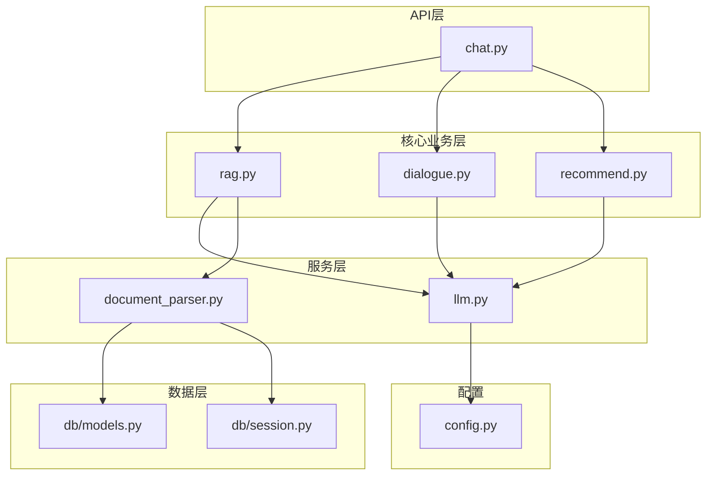
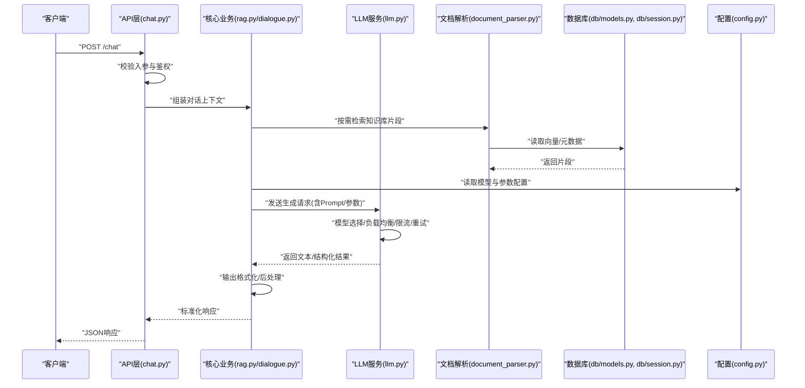
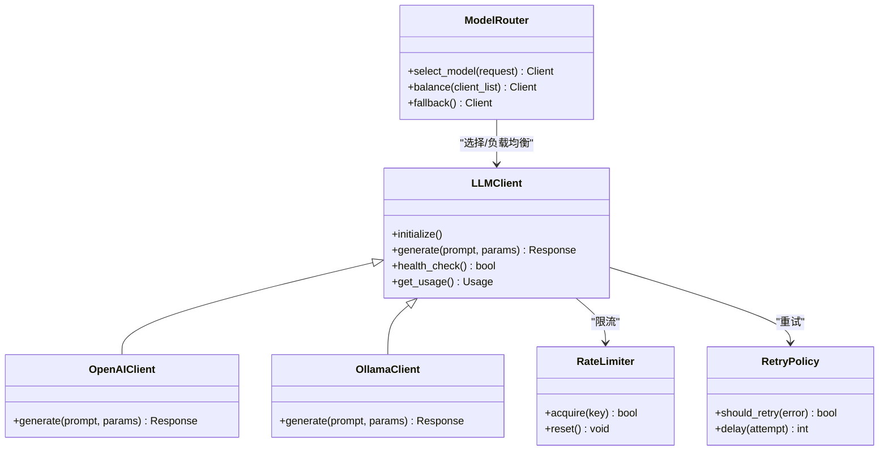
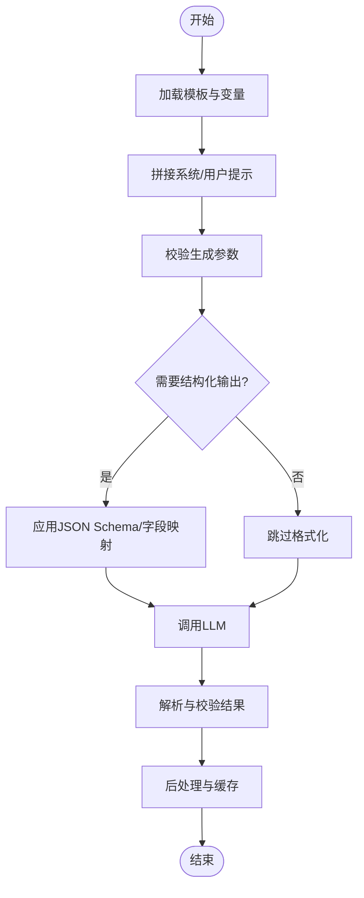
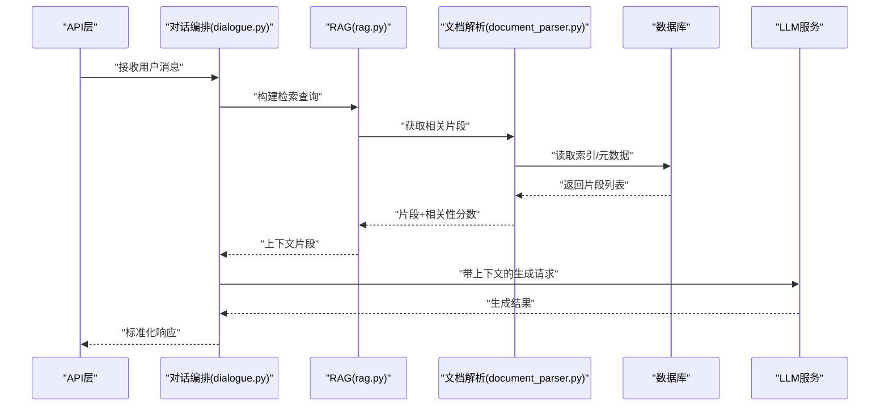
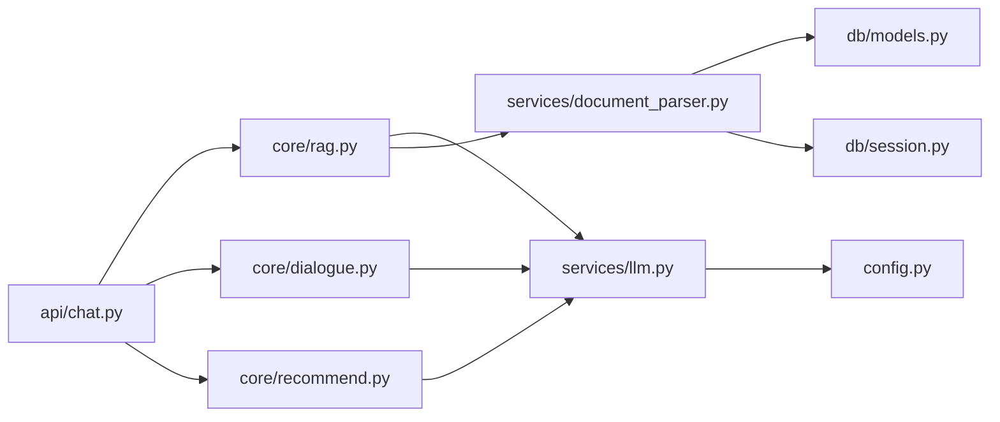

# LLM服务集成

<cite>
**本文引用的文件**   
- [backend/app/services/llm.py](file://backend/app/services/llm.py)
- [backend/app/config.py](file://backend/app/config.py)
- [backend/app/api/chat.py](file://backend/app/api/chat.py)
- [backend/app/core/rag.py](file://backend/app/core/rag.py)
- [backend/app/core/dialogue.py](file://backend/app/core/dialogue.py)
- [backend/app/models/schemas.py](file://backend/app/models/schemas.py)
- [backend/app/core/recommend.py](file://backend/app/core/recommend.py)
- [backend/app/services/document_parser.py](file://backend/app/services/document_parser.py)
- [backend/app/db/models.py](file://backend/app/db/models.py)
- [backend/app/db/session.py](file://backend/app/db/session.py)
- [backend/tests/test_api.py](file://backend/tests/test_api.py)
</cite>

## 目录
1. [简介](#简介)
2. [项目结构](#项目结构)
3. [核心组件](#核心组件)
4. [架构总览](#架构总览)
5. [详细组件分析](#详细组件分析)
6. [依赖关系分析](#依赖关系分析)
7. [性能与成本优化](#性能与成本优化)
8. [故障诊断指南](#故障诊断指南)
9. [结论](#结论)
10. [附录：配置与接入示例](#附录配置与接入示例)

## 简介
本技术文档围绕大语言模型（LLM）服务集成，系统性阐述接入方案、API封装、请求响应处理、多模型支持与负载均衡、提示词模板管理、参数配置与输出格式化、成本控制、限流与重试机制、监控指标收集以及最佳实践与排障方法。文档以代码仓库中的后端实现为依据，结合架构图与流程图帮助开发者快速理解并落地生产级LLM集成。

## 项目结构
本项目采用分层与按功能域组织相结合的结构：
- API层：对外暴露REST接口，负责路由、鉴权、入参校验与响应包装
- 核心业务层：对话编排、RAG检索增强、推荐逻辑等
- 服务层：LLM调用、ASR/TTS、数字人、文档解析、持久化等
- 数据层：数据库模型与会话管理
- 配置与环境：统一配置入口
- 前端：游客端与管理后台（与本主题相关度较低）

图表来源
- [backend/app/api/chat.py](file://backend/app/api/chat.py)
- [backend/app/core/rag.py](file://backend/app/core/rag.py)
- [backend/app/core/dialogue.py](file://backend/app/core/dialogue.py)
- [backend/app/core/recommend.py](file://backend/app/core/recommend.py)
- [backend/app/services/llm.py](file://backend/app/services/llm.py)
- [backend/app/services/document_parser.py](file://backend/app/services/document_parser.py)
- [backend/app/db/models.py](file://backend/app/db/models.py)
- [backend/app/db/session.py](file://backend/app/db/session.py)
- [backend/app/config.py](file://backend/app/config.py)

章节来源
- [backend/app/api/chat.py](file://backend/app/api/chat.py)
- [backend/app/core/rag.py](file://backend/app/core/rag.py)
- [backend/app/core/dialogue.py](file://backend/app/core/dialogue.py)
- [backend/app/core/recommend.py](file://backend/app/core/recommend.py)
- [backend/app/services/llm.py](file://backend/app/services/llm.py)
- [backend/app/services/document_parser.py](file://backend/app/services/document_parser.py)
- [backend/app/db/models.py](file://backend/app/db/models.py)
- [backend/app/db/session.py](file://backend/app/db/session.py)
- [backend/app/config.py](file://backend/app/config.py)

## 核心组件
- LLM服务抽象与适配：提供统一的LLM客户端接口，屏蔽不同提供商差异，支持多模型选择与策略扩展
- 提示词模板与参数管理：集中管理Prompt模板、系统提示、温度、最大长度等生成参数
- RAG与对话编排：将检索增强与对话上下文整合到LLM调用流程中
- 文档解析与入库：对上传文档进行解析、分块、向量化与索引构建
- 配置中心：集中加载环境变量与默认值，为各模块提供一致的配置访问方式

章节来源
- [backend/app/services/llm.py](file://backend/app/services/llm.py)
- [backend/app/core/rag.py](file://backend/app/core/rag.py)
- [backend/app/core/dialogue.py](file://backend/app/core/dialogue.py)
- [backend/app/services/document_parser.py](file://backend/app/services/document_parser.py)
- [backend/app/config.py](file://backend/app/config.py)

## 架构总览
下图展示了从API到LLM的端到端调用链路，包括请求校验、上下文组装、RAG检索、模型选择与负载均衡、重试与限流、结果后处理与缓存等关键环节。

图表来源
- [backend/app/api/chat.py](file://backend/app/api/chat.py)
- [backend/app/core/rag.py](file://backend/app/core/rag.py)
- [backend/app/core/dialogue.py](file://backend/app/core/dialogue.py)
- [backend/app/services/llm.py](file://backend/app/services/llm.py)
- [backend/app/services/document_parser.py](file://backend/app/services/document_parser.py)
- [backend/app/db/models.py](file://backend/app/db/models.py)
- [backend/app/db/session.py](file://backend/app/db/session.py)
- [backend/app/config.py](file://backend/app/config.py)

## 详细组件分析

### LLM服务抽象与多模型支持
- 设计要点
  - 统一抽象：定义通用接口，屏蔽OpenAI、本地Ollama、其他兼容API的差异
  - 多模型注册：通过配置或工厂模式动态选择模型实例
  - 负载均衡：基于权重、健康检查与回退策略在多实例间分发
  - 限流与重试：令牌桶/滑动窗口限流；指数退避重试；熔断降级
  - 可观测性：记录耗时、Token用量、错误码与采样日志
- 关键流程
  - 初始化阶段：加载配置、注册模型、预热连接
  - 请求阶段：参数校验、上下文拼装、选择模型、调用、重试与限流
  - 响应阶段：格式校验、结构化提取、缓存写入、指标上报

图表来源
- [backend/app/services/llm.py](file://backend/app/services/llm.py)
- [backend/app/config.py](file://backend/app/config.py)

章节来源
- [backend/app/services/llm.py](file://backend/app/services/llm.py)
- [backend/app/config.py](file://backend/app/config.py)

### 提示词模板管理与参数配置
- 模板管理
  - 集中存放系统提示、任务提示、Few-shot示例
  - 支持变量替换、条件分支与版本控制
- 参数配置
  - 全局默认与模型级覆盖
  - 安全边界：最大长度、温度范围、Top-P、停止符
- 输出格式化
  - JSON Schema约束、字段抽取、容错补全
  - 结构化结果校验与降级策略

图表来源
- [backend/app/services/llm.py](file://backend/app/services/llm.py)
- [backend/app/config.py](file://backend/app/config.py)

章节来源
- [backend/app/services/llm.py](file://backend/app/services/llm.py)
- [backend/app/config.py](file://backend/app/config.py)

### RAG检索增强与对话编排
- 检索流程
  - 查询重写与意图识别
  - 向量检索与重排序
  - 片段裁剪与上下文压缩
- 对话编排
  - 历史消息摘要与滚动窗口
  - 多轮一致性维护与冲突消解
- 与LLM集成
  - 将检索片段注入Prompt
  - 根据领域知识调整生成参数

图表来源
- [backend/app/core/dialogue.py](file://backend/app/core/dialogue.py)
- [backend/app/core/rag.py](file://backend/app/core/rag.py)
- [backend/app/services/document_parser.py](file://backend/app/services/document_parser.py)
- [backend/app/db/models.py](file://backend/app/db/models.py)
- [backend/app/db/session.py](file://backend/app/db/session.py)
- [backend/app/services/llm.py](file://backend/app/services/llm.py)

章节来源
- [backend/app/core/rag.py](file://backend/app/core/rag.py)
- [backend/app/core/dialogue.py](file://backend/app/core/dialogue.py)
- [backend/app/services/document_parser.py](file://backend/app/services/document_parser.py)
- [backend/app/db/models.py](file://backend/app/db/models.py)
- [backend/app/db/session.py](file://backend/app/db/session.py)
- [backend/app/services/llm.py](file://backend/app/services/llm.py)

### 推荐与个性化
- 基于用户画像与历史交互的推荐策略
- 与LLM协作：将偏好与约束注入Prompt，提升回答相关性
- 冷启动与多样性控制

章节来源
- [backend/app/core/recommend.py](file://backend/app/core/recommend.py)
- [backend/app/services/llm.py](file://backend/app/services/llm.py)

### 数据模型与会话
- 文档、片段、索引与元数据的持久化
- 会话状态与消息存储
- 读写路径与事务边界

章节来源
- [backend/app/db/models.py](file://backend/app/db/models.py)
- [backend/app/db/session.py](file://backend/app/db/session.py)

## 依赖关系分析
- 模块耦合
  - API层依赖核心业务与服务层，职责清晰
  - 服务层通过配置中心获取模型与运行时参数
  - RAG与文档解析共享数据层
- 外部依赖
  - LLM提供商SDK/HTTP客户端
  - 向量数据库/搜索引擎（由文档解析与RAG间接使用）
  - 缓存与指标采集（建议引入Redis与Prometheus）

图表来源
- [backend/app/api/chat.py](file://backend/app/api/chat.py)
- [backend/app/core/rag.py](file://backend/app/core/rag.py)
- [backend/app/core/dialogue.py](file://backend/app/core/dialogue.py)
- [backend/app/core/recommend.py](file://backend/app/core/recommend.py)
- [backend/app/services/llm.py](file://backend/app/services/llm.py)
- [backend/app/services/document_parser.py](file://backend/app/services/document_parser.py)
- [backend/app/db/models.py](file://backend/app/db/models.py)
- [backend/app/db/session.py](file://backend/app/db/session.py)
- [backend/app/config.py](file://backend/app/config.py)

章节来源
- [backend/app/api/chat.py](file://backend/app/api/chat.py)
- [backend/app/core/rag.py](file://backend/app/core/rag.py)
- [backend/app/core/dialogue.py](file://backend/app/core/dialogue.py)
- [backend/app/core/recommend.py](file://backend/app/core/recommend.py)
- [backend/app/services/llm.py](file://backend/app/services/llm.py)
- [backend/app/services/document_parser.py](file://backend/app/services/document_parser.py)
- [backend/app/db/models.py](file://backend/app/db/models.py)
- [backend/app/db/session.py](file://backend/app/db/session.py)
- [backend/app/config.py](file://backend/app/config.py)

## 性能与成本优化
- 模型选择与负载均衡
  - 按场景路由：简单问答走轻量模型，复杂推理走强模型
  - 多实例加权轮询与失败自动剔除
- 请求限流与队列
  - 令牌桶/漏桶限流，热点Key隔离
  - 异步队列削峰填谷
- 重试与熔断
  - 指数退避、抖动、幂等键
  - 熔断器与快速失败，避免雪崩
- 缓存策略
  - 语义相似缓存：对相近问题复用答案
  - 片段级缓存：RAG片段命中即直接返回
- 输出优化
  - 结构化输出减少二次解析
  - 增量生成与流式返回降低首字延迟
- 成本控制
  - Token用量统计与配额告警
  - 低价值请求降级至小模型或规则引擎
- 监控指标
  - QPS、P95/P99延迟、错误率、重试率、熔断次数
  - 模型维度：Token消耗、成功率、平均响应时间

[本节为通用指导，不直接分析具体文件]

## 故障诊断指南
- 常见问题定位
  - 超时与限流：检查限流阈值、上游延迟与重试策略
  - 模型不可用：健康检查失败、证书/密钥错误、网络连通性
  - 输出异常：JSON Schema不匹配、字段缺失、截断
- 排查步骤
  - 查看请求ID与采样日志，关联上下游追踪
  - 核对配置项：模型名、密钥、超时、重试次数
  - 验证输入：Prompt长度、敏感信息过滤、编码问题
- 恢复策略
  - 切换备用模型或回退到规则引擎
  - 临时放宽限流或扩容实例
  - 清理无效缓存与重建索引

章节来源
- [backend/tests/test_api.py](file://backend/tests/test_api.py)
- [backend/app/services/llm.py](file://backend/app/services/llm.py)
- [backend/app/config.py](file://backend/app/config.py)

## 结论
通过统一的LLM抽象、完善的模板与参数管理、RAG与对话编排、负载均衡与限流重试、以及可观测性与成本控制手段，本项目构建了高可用、可扩展且可控成本的LLM服务集成方案。建议在后续迭代中持续完善缓存、指标采集与自动化测试，进一步提升稳定性与效率。

[本节为总结性内容，不直接分析具体文件]

## 附录：配置与接入示例
- 配置项建议
  - 模型清单：名称、提供商、基地址、密钥、并发上限、超时、重试次数
  - 全局参数：默认温度、最大长度、Top-P、停止符、是否启用结构化输出
  - 限流与熔断：QPS限制、令牌桶容量、熔断阈值与恢复时间
  - 缓存：TTL、相似度阈值、最大条目数
- 接入不同提供商
  - OpenAI兼容API：设置基地址与密钥，启用流式输出
  - 本地Ollama：指定模型名与端口，关闭外部认证
  - 自定义模型：实现统一接口，注册到模型路由器
- 最小可用示例（描述性）
  - 在配置中声明两个模型实例，一个轻量用于快答，一个强模型用于复杂推理
  - 在API层传入场景标签，由模型路由器选择合适实例
  - 开启限流与重试，失败时自动切换到轻量模型
  - 对高频问题进行语义缓存，命中率超过阈值则直接返回

章节来源
- [backend/app/config.py](file://backend/app/config.py)
- [backend/app/services/llm.py](file://backend/app/services/llm.py)
- [backend/app/api/chat.py](file://backend/app/api/chat.py)