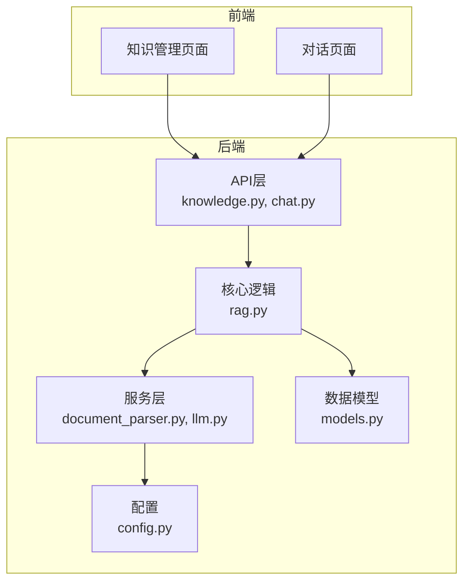
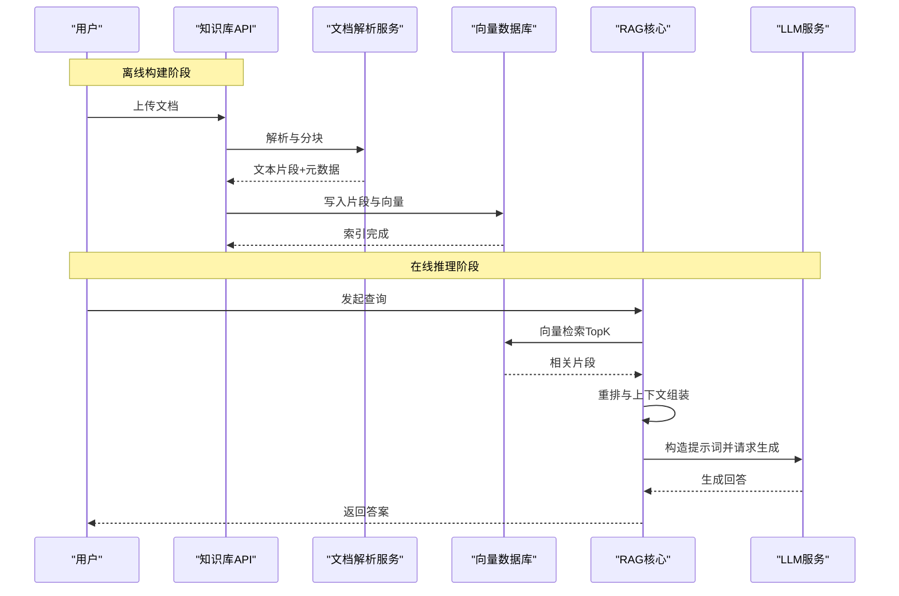
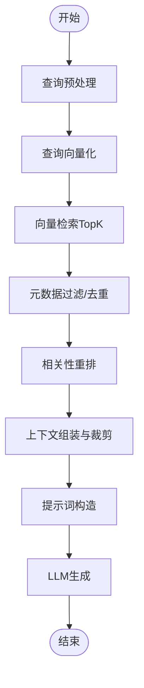
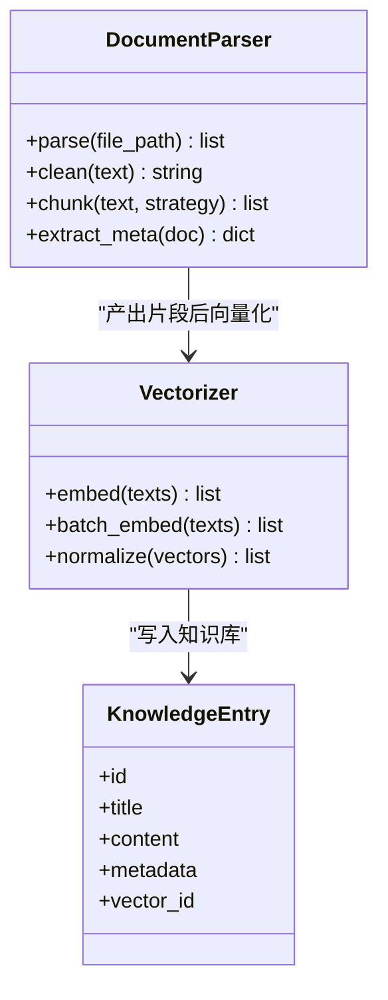
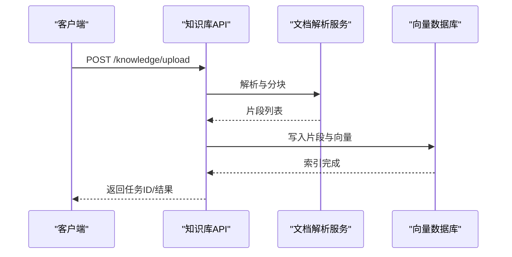
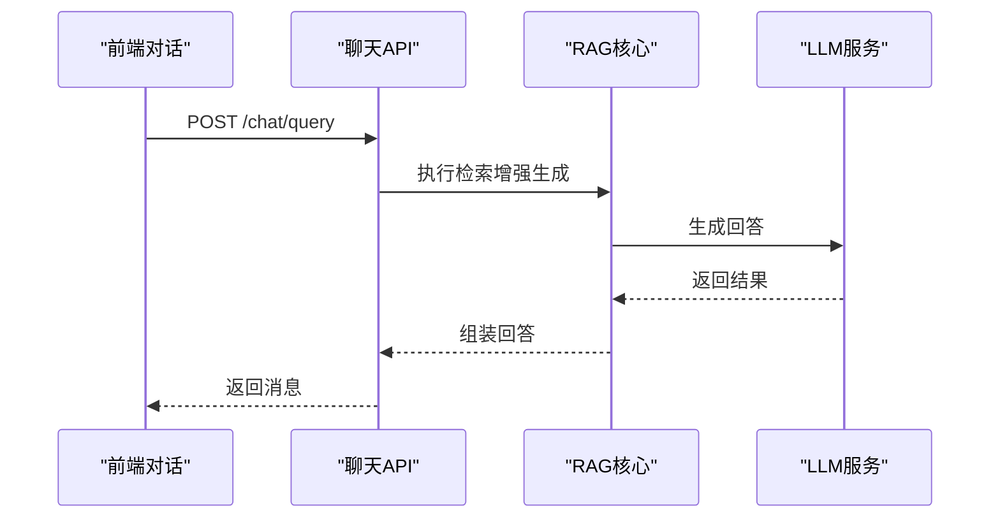
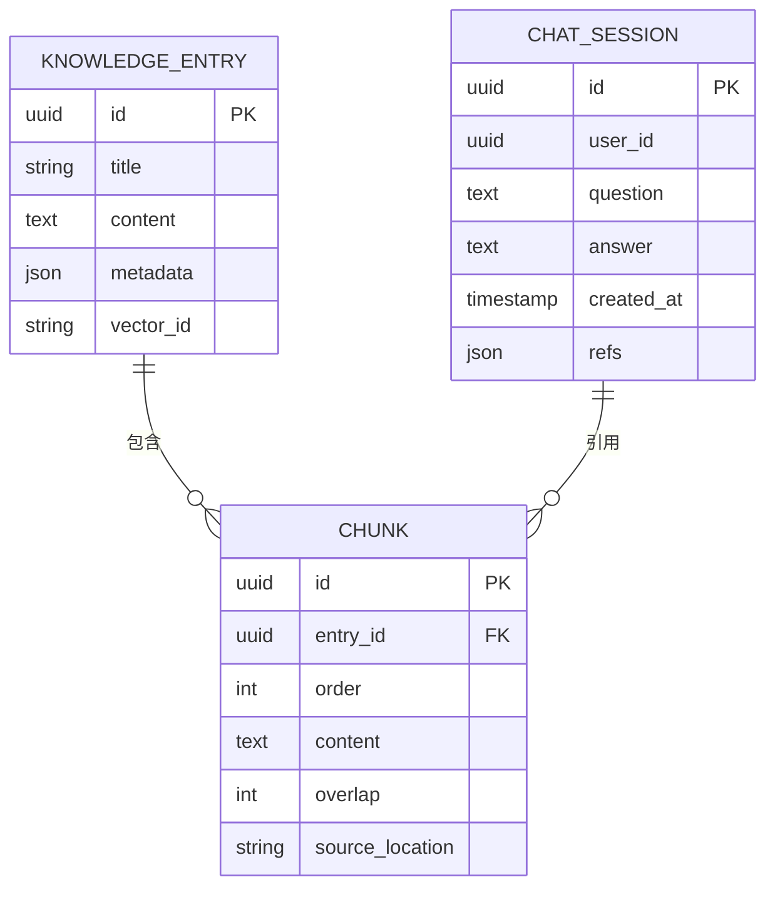
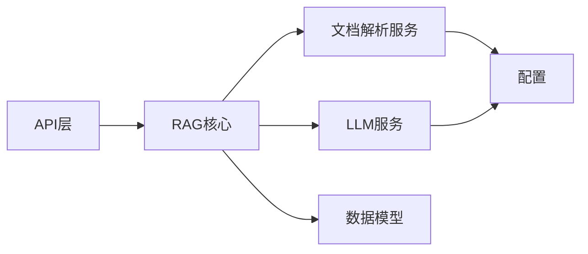

# RAG检索增强生成系统

<cite>
**本文引用的文件**   
- [backend/app/core/rag.py](file://backend/app/core/rag.py)
- [backend/app/services/document_parser.py](file://backend/app/services/document_parser.py)
- [backend/app/api/knowledge.py](file://backend/app/api/knowledge.py)
- [backend/app/api/chat.py](file://backend/app/api/chat.py)
- [backend/app/services/llm.py](file://backend/app/services/llm.py)
- [backend/app/db/models.py](file://backend/app/db/models.py)
- [backend/app/config.py](file://backend/app/config.py)
- [backend/tests/test_rag.py](file://backend/tests/test_rag.py)
</cite>

## 目录
1. [简介](#简介)
2. [项目结构](#项目结构)
3. [核心组件](#核心组件)
4. [架构总览](#架构总览)
5. [详细组件分析](#详细组件分析)
6. [依赖关系分析](#依赖关系分析)
7. [性能考虑](#性能考虑)
8. [故障排查指南](#故障排查指南)
9. [结论](#结论)
10. [附录](#附录)

## 简介
本技术文档面向开发者与集成人员，系统性阐述RAG（检索增强生成）系统的架构原理、知识库构建流程、文档解析与向量化处理、向量检索算法与相似度策略、检索优化技术、提示词工程最佳实践、上下文窗口管理、响应质量优化、知识库管理API使用示例、性能调优、缓存机制与错误处理方案。目标是帮助读者快速理解并高效集成该RAG系统，完成从文档入库到在线问答的端到端链路。

## 项目结构
后端采用分层设计：API层暴露REST接口；核心逻辑位于core模块；服务层封装LLM调用、文档解析、持久化等能力；数据模型与配置独立管理。前端提供知识管理与对话界面，通过HTTP与后端交互。

图表来源
- [backend/app/api/knowledge.py](file://backend/app/api/knowledge.py)
- [backend/app/api/chat.py](file://backend/app/api/chat.py)
- [backend/app/core/rag.py](file://backend/app/core/rag.py)
- [backend/app/services/document_parser.py](file://backend/app/services/document_parser.py)
- [backend/app/services/llm.py](file://backend/app/services/llm.py)
- [backend/app/db/models.py](file://backend/app/db/models.py)
- [backend/app/config.py](file://backend/app/config.py)

章节来源
- [backend/app/api/knowledge.py](file://backend/app/api/knowledge.py)
- [backend/app/api/chat.py](file://backend/app/api/chat.py)
- [backend/app/core/rag.py](file://backend/app/core/rag.py)
- [backend/app/services/document_parser.py](file://backend/app/services/document_parser.py)
- [backend/app/services/llm.py](file://backend/app/services/llm.py)
- [backend/app/db/models.py](file://backend/app/db/models.py)
- [backend/app/config.py](file://backend/app/config.py)

## 核心组件
- RAG核心编排器：负责将用户查询进行分块检索、召回排序、上下文组装与提示词构造，最终驱动大模型生成回答。
- 文档解析服务：支持多种格式文档读取、清洗、分块与元数据提取，为向量化准备结构化片段。
- LLM服务：封装大模型调用、流式输出、重试与超时控制，统一返回标准化结果。
- 知识库API：提供文档上传、索引构建、批量导入、检索查询等管理能力。
- 数据模型：定义知识库条目、分块、向量索引、会话记录等实体。
- 配置中心：集中管理嵌入模型、向量库、LLM、分块策略等参数。

章节来源
- [backend/app/core/rag.py](file://backend/app/core/rag.py)
- [backend/app/services/document_parser.py](file://backend/app/services/document_parser.py)
- [backend/app/services/llm.py](file://backend/app/services/llm.py)
- [backend/app/api/knowledge.py](file://backend/app/api/knowledge.py)
- [backend/app/db/models.py](file://backend/app/db/models.py)
- [backend/app/config.py](file://backend/app/config.py)

## 架构总览
RAG整体流程分为离线构建与在线推理两条路径：
- 离线构建：文档上传→解析清洗→分块→向量化→写入向量库→建立倒排或元数据索引。
- 在线推理：用户提问→查询向量化→向量检索→候选重排→上下文拼接→提示词构造→LLM生成→返回结果。

图表来源
- [backend/app/api/knowledge.py](file://backend/app/api/knowledge.py)
- [backend/app/services/document_parser.py](file://backend/app/services/document_parser.py)
- [backend/app/core/rag.py](file://backend/app/core/rag.py)
- [backend/app/services/llm.py](file://backend/app/services/llm.py)

## 详细组件分析

### RAG核心编排器
职责与要点：
- 查询预处理：去噪、语言检测、关键词提取（可选）。
- 检索策略：向量相似度检索（如余弦相似度），结合元数据过滤与时间衰减。
- 候选重排：基于相关性打分、重复度抑制、多样性选择。
- 上下文窗口管理：按token预算裁剪片段，保留关键段落与引用信息。
- 提示词工程：模板化指令、角色设定、约束条件、引用标注。
- 生成控制：温度、最大长度、停止符、流式输出。

图表来源
- [backend/app/core/rag.py](file://backend/app/core/rag.py)

章节来源
- [backend/app/core/rag.py](file://backend/app/core/rag.py)

### 文档解析与向量化
职责与要点：
- 多格式支持：PDF、Word、Markdown、HTML、TXT等。
- 内容清洗：去除页眉页脚、广告、空行、特殊符号。
- 分块策略：固定长度、语义边界、重叠窗口、层级保留（标题/段落）。
- 元数据抽取：来源、作者、时间、标签、章节路径。
- 向量化：统一嵌入模型，批量提交，失败重试与幂等写入。

图表来源
- [backend/app/services/document_parser.py](file://backend/app/services/document_parser.py)
- [backend/app/db/models.py](file://backend/app/db/models.py)

章节来源
- [backend/app/services/document_parser.py](file://backend/app/services/document_parser.py)
- [backend/app/db/models.py](file://backend/app/db/models.py)

### 知识库管理API
功能清单：
- 文档上传：单文件/批量上传，校验格式与大小。
- 索引构建：触发解析、分块、向量化与入库。
- 检索查询：按问题或关键词检索相关片段，支持分页与过滤。
- 元数据管理：更新标签、来源、有效期等。
- 健康检查：向量库连通性、索引状态、统计信息。

典型调用序列（上传与索引）：

图表来源
- [backend/app/api/knowledge.py](file://backend/app/api/knowledge.py)
- [backend/app/services/document_parser.py](file://backend/app/services/document_parser.py)

章节来源
- [backend/app/api/knowledge.py](file://backend/app/api/knowledge.py)

### 对话与RAG集成
对话API在收到用户问题时，调用RAG核心进行检索增强生成，并将结果返回给前端展示。可结合会话历史进行上下文延续。

图表来源
- [backend/app/api/chat.py](file://backend/app/api/chat.py)
- [backend/app/core/rag.py](file://backend/app/core/rag.py)
- [backend/app/services/llm.py](file://backend/app/services/llm.py)

章节来源
- [backend/app/api/chat.py](file://backend/app/api/chat.py)
- [backend/app/core/rag.py](file://backend/app/core/rag.py)
- [backend/app/services/llm.py](file://backend/app/services/llm.py)

### 数据模型
主要实体：
- 知识库条目：包含标题、正文、元数据、向量标识。
- 分块片段：关联条目ID、顺序、重叠范围、来源位置。
- 会话记录：用户ID、问题、答案、时间戳、引用片段ID集合。

图表来源
- [backend/app/db/models.py](file://backend/app/db/models.py)

章节来源
- [backend/app/db/models.py](file://backend/app/db/models.py)

### 配置项
建议配置维度：
- 嵌入模型：模型名称、维度、批大小、归一化开关。
- 向量库：连接地址、索引类型、相似度度量、分区策略。
- 分块策略：块大小、重叠比例、分割标记。
- LLM：提供商、模型名、温度、最大长度、超时、重试次数。
- 检索：TopK、阈值、重排权重、元数据过滤字段。

章节来源
- [backend/app/config.py](file://backend/app/config.py)

## 依赖关系分析
组件耦合与内聚：
- API层仅依赖核心与服务层，保持薄控制器风格。
- RAG核心聚合解析、向量检索、LLM调用，承担编排职责。
- 服务层对配置与外部依赖（向量库、LLM）解耦，便于替换实现。
- 数据模型独立，避免循环依赖。

图表来源
- [backend/app/api/knowledge.py](file://backend/app/api/knowledge.py)
- [backend/app/api/chat.py](file://backend/app/api/chat.py)
- [backend/app/core/rag.py](file://backend/app/core/rag.py)
- [backend/app/services/document_parser.py](file://backend/app/services/document_parser.py)
- [backend/app/services/llm.py](file://backend/app/services/llm.py)
- [backend/app/db/models.py](file://backend/app/db/models.py)
- [backend/app/config.py](file://backend/app/config.py)

章节来源
- [backend/app/api/knowledge.py](file://backend/app/api/knowledge.py)
- [backend/app/api/chat.py](file://backend/app/api/chat.py)
- [backend/app/core/rag.py](file://backend/app/core/rag.py)
- [backend/app/services/document_parser.py](file://backend/app/services/document_parser.py)
- [backend/app/services/llm.py](file://backend/app/services/llm.py)
- [backend/app/db/models.py](file://backend/app/db/models.py)
- [backend/app/config.py](file://backend/app/config.py)

## 性能考虑
- 向量化批处理：提高吞吐，降低网络往返。
- 检索优化：TopK与阈值联合控制，减少无效上下文；引入元数据预过滤缩小搜索空间。
- 重排策略：基于相关性、新颖性与多样性加权，提升最终质量。
- 上下文裁剪：按token预算动态裁剪，优先保留高信息密度段落。
- 缓存机制：对高频查询与稳定知识片段做短期缓存，命中直接返回。
- 并发与限流：异步解析与检索，限制并发度避免资源争用。
- 监控指标：检索延迟、命中率、生成时延、错误率、Token消耗。

[本节为通用指导，不直接分析具体文件]

## 故障排查指南
常见问题与定位步骤：
- 文档解析失败：检查文件格式、编码、大小限制；查看解析日志与异常堆栈。
- 向量化失败：确认嵌入模型可用、输入文本非空、批次大小合理；重试与降级策略是否生效。
- 检索无结果：检查向量库连通性、索引状态、相似度阈值是否过高；验证查询预处理是否正确。
- 生成质量差：调整提示词模板、增加上下文片段数量、降低温度、增加停止符。
- 超时与重试：增大LLM超时时间，设置指数退避重试；关注上游服务健康状态。

章节来源
- [backend/tests/test_rag.py](file://backend/tests/test_rag.py)

## 结论
本RAG系统以清晰的层次化架构与模块化设计，实现了从文档入库到在线问答的完整闭环。通过合理的分块与向量化策略、高效的检索与重排、完善的提示词工程与上下文管理，系统在准确性与效率之间取得良好平衡。配合缓存、监控与错误处理机制，可在生产环境中稳定运行并持续优化。

[本节为总结性内容，不直接分析具体文件]

## 附录

### 知识库管理API使用示例（概念性说明）
- 上传文档：POST /knowledge/upload，携带文件与元数据，返回任务ID。
- 构建索引：POST /knowledge/build_index，传入任务ID或文档ID，返回进度与结果。
- 检索查询：POST /knowledge/search，传入问题、TopK、过滤条件，返回片段列表与得分。
- 删除与更新：DELETE/PUT /knowledge/{id}，用于维护知识库生命周期。

[本节为概念性说明，不直接分析具体文件]