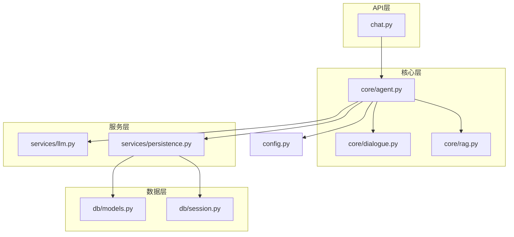
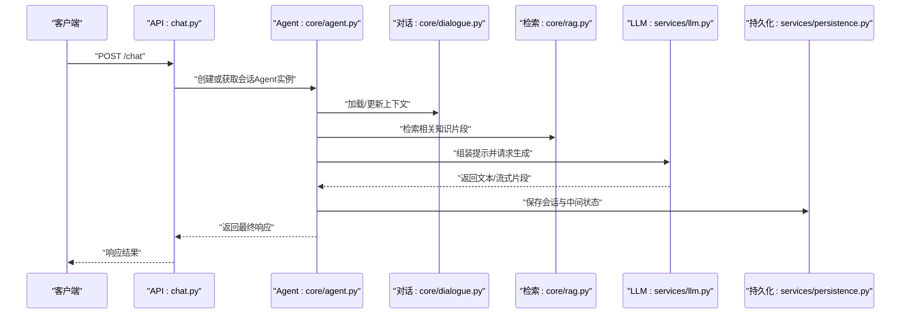
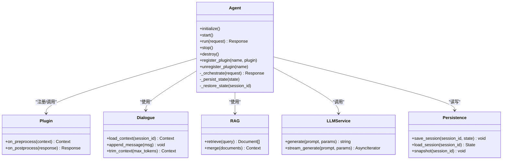
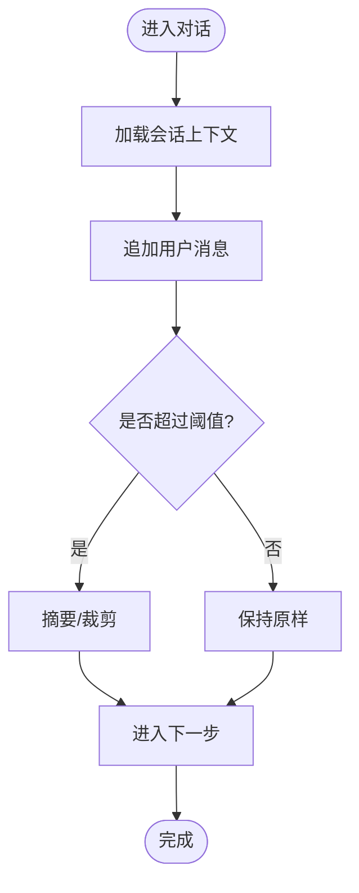
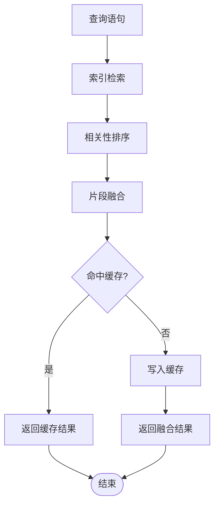
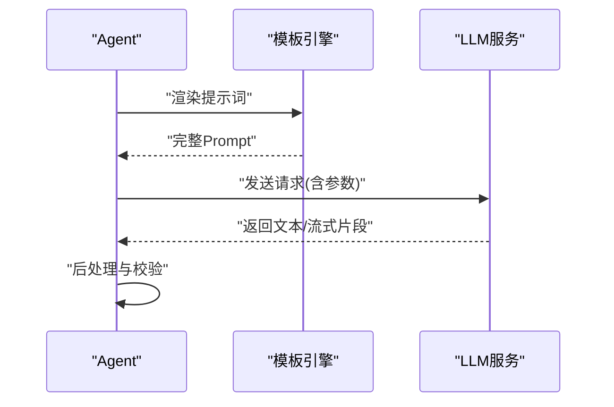
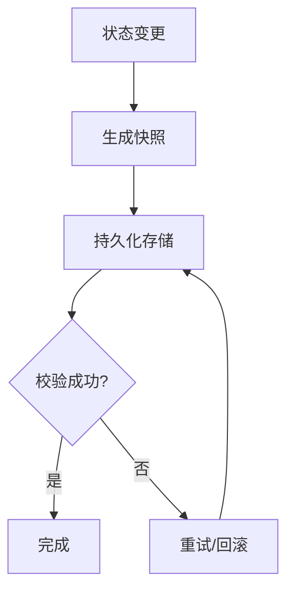
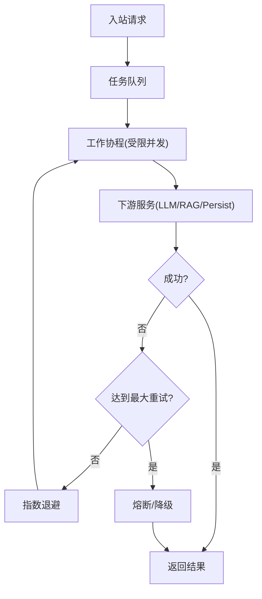
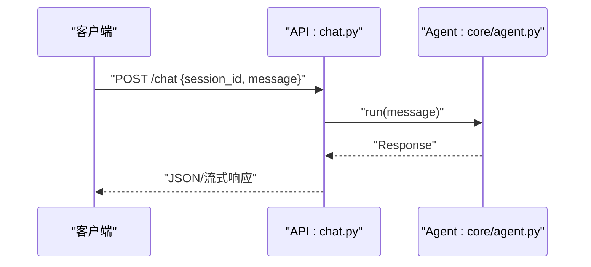
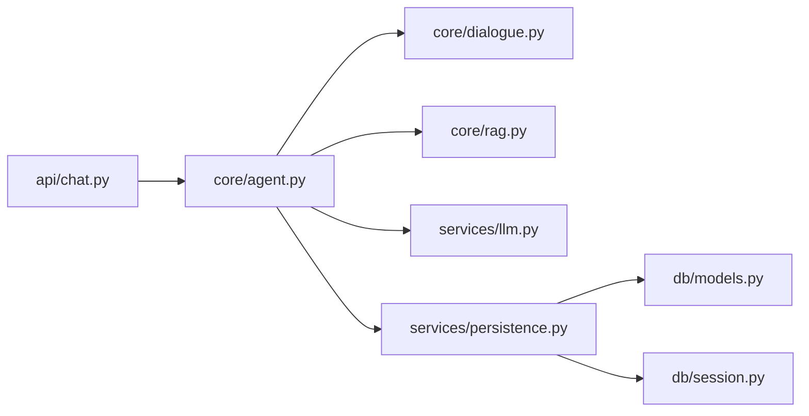

# Agent智能代理核心

<cite>
**本文引用的文件**   
- [backend/app/core/agent.py](file://backend/app/core/agent.py)
- [backend/app/core/dialogue.py](file://backend/app/core/dialogue.py)
- [backend/app/core/rag.py](file://backend/app/core/rag.py)
- [backend/app/services/llm.py](file://backend/app/services/llm.py)
- [backend/app/services/persistence.py](file://backend/app/services/persistence.py)
- [backend/app/api/chat.py](file://backend/app/api/chat.py)
- [backend/app/config.py](file://backend/app/config.py)
- [backend/app/db/models.py](file://backend/app/db/models.py)
- [backend/app/db/session.py](file://backend/app/db/session.py)
- [backend/tests/test_agent.py](file://backend/tests/test_agent.py)
</cite>

## 目录
1. [简介](#简介)
2. [项目结构](#项目结构)
3. [核心组件](#核心组件)
4. [架构总览](#架构总览)
5. [详细组件分析](#详细组件分析)
6. [依赖关系分析](#依赖关系分析)
7. [性能考虑](#性能考虑)
8. [故障排查指南](#故障排查指南)
9. [结论](#结论)
10. [附录](#附录)

## 简介
本技术文档聚焦于“Agent智能代理核心”，围绕以下目标展开：
- 解释Agent架构设计模式、插件化机制与扩展点设计
- 说明智能代理的生命周期管理、任务调度与并发处理策略
- 阐述配置管理、状态持久化与错误恢复机制
- 提供Agent开发指南，包括自定义Agent实现方法、接口规范与最佳实践
- 解释Agent与LLM服务的集成方式、提示词模板管理与响应优化策略
- 给出性能监控、日志记录与调试工具的使用建议

## 项目结构
后端采用分层组织：API层暴露HTTP接口；核心层包含Agent、对话、RAG等能力；服务层封装LLM、持久化等外部依赖；数据层负责模型与数据库会话。

图表来源
- [backend/app/api/chat.py](file://backend/app/api/chat.py)
- [backend/app/core/agent.py](file://backend/app/core/agent.py)
- [backend/app/core/dialogue.py](file://backend/app/core/dialogue.py)
- [backend/app/core/rag.py](file://backend/app/core/rag.py)
- [backend/app/services/llm.py](file://backend/app/services/llm.py)
- [backend/app/services/persistence.py](file://backend/app/services/persistence.py)
- [backend/app/db/models.py](file://backend/app/db/models.py)
- [backend/app/db/session.py](file://backend/app/db/session.py)
- [backend/app/config.py](file://backend/app/config.py)

章节来源
- [backend/app/api/chat.py](file://backend/app/api/chat.py)
- [backend/app/core/agent.py](file://backend/app/core/agent.py)
- [backend/app/core/dialogue.py](file://backend/app/core/dialogue.py)
- [backend/app/core/rag.py](file://backend/app/core/rag.py)
- [backend/app/services/llm.py](file://backend/app/services/llm.py)
- [backend/app/services/persistence.py](file://backend/app/services/persistence.py)
- [backend/app/db/models.py](file://backend/app/db/models.py)
- [backend/app/db/session.py](file://backend/app/db/session.py)
- [backend/app/config.py](file://backend/app/config.py)

## 核心组件
- Agent核心（core/agent.py）：定义Agent的抽象与默认实现，负责生命周期、编排调用链（对话上下文、RAG检索、LLM生成）、插件注册与扩展点、并发控制与重试/熔断策略、状态持久化与恢复。
- 对话上下文（core/dialogue.py）：维护会话历史、消息格式、上下文裁剪与摘要策略。
- RAG检索（core/rag.py）：负责知识检索、召回排序、片段融合与缓存。
- LLM服务（services/llm.py）：统一封装大模型调用、流式输出、超时与重试、温度/TopP等参数控制。
- 持久化服务（services/persistence.py）：封装会话与中间状态的存储、快照与恢复。
- 配置（config.py）：集中管理环境变量、模型参数、检索与持久化开关。
- 数据模型与会话（db/models.py, db/session.py）：定义持久化实体与数据库连接池。

章节来源
- [backend/app/core/agent.py](file://backend/app/core/agent.py)
- [backend/app/core/dialogue.py](file://backend/app/core/dialogue.py)
- [backend/app/core/rag.py](file://backend/app/core/rag.py)
- [backend/app/services/llm.py](file://backend/app/services/llm.py)
- [backend/app/services/persistence.py](file://backend/app/services/persistence.py)
- [backend/app/config.py](file://backend/app/config.py)
- [backend/app/db/models.py](file://backend/app/db/models.py)
- [backend/app/db/session.py](file://backend/app/db/session.py)

## 架构总览
Agent以“编排器”角色协调多个子能力：对话上下文管理、RAG检索、LLM生成、持久化与监控。对外通过API层暴露REST接口，内部通过服务层解耦外部依赖。

图表来源
- [backend/app/api/chat.py](file://backend/app/api/chat.py)
- [backend/app/core/agent.py](file://backend/app/core/agent.py)
- [backend/app/core/dialogue.py](file://backend/app/core/dialogue.py)
- [backend/app/core/rag.py](file://backend/app/core/rag.py)
- [backend/app/services/llm.py](file://backend/app/services/llm.py)
- [backend/app/services/persistence.py](file://backend/app/services/persistence.py)

## 详细组件分析

### Agent核心类与扩展点
Agent作为编排中心，承担如下职责：
- 生命周期：初始化、启动、运行、停止、销毁
- 插件化：注册/卸载插件、按阶段钩子执行（如预处理、后处理）
- 任务编排：顺序/并行调用对话、检索、LLM、持久化
- 并发与容错：限流、超时、重试、熔断、降级
- 状态管理：会话快照、增量持久化、断点恢复

图表来源
- [backend/app/core/agent.py](file://backend/app/core/agent.py)
- [backend/app/core/dialogue.py](file://backend/app/core/dialogue.py)
- [backend/app/core/rag.py](file://backend/app/core/rag.py)
- [backend/app/services/llm.py](file://backend/app/services/llm.py)
- [backend/app/services/persistence.py](file://backend/app/services/persistence.py)

章节来源
- [backend/app/core/agent.py](file://backend/app/core/agent.py)

#### 插件化与扩展点
- 扩展点类型：预处理钩子、后处理钩子、路由决策钩子、指标上报钩子
- 注册机制：按名称注册，支持优先级与条件启用
- 隔离性：插件异常不影响主流程，采用熔断与降级策略
- 可观测性：每个插件执行耗时与错误率上报

章节来源
- [backend/app/core/agent.py](file://backend/app/core/agent.py)

### 对话上下文管理
- 会话ID映射到内存上下文，支持跨进程持久化
- 消息格式标准化，支持多轮对话与系统提示注入
- 上下文裁剪：基于token上限进行滑动窗口或摘要压缩
- 并发安全：读写锁保护会话状态

图表来源
- [backend/app/core/dialogue.py](file://backend/app/core/dialogue.py)

章节来源
- [backend/app/core/dialogue.py](file://backend/app/core/dialogue.py)

### RAG检索与融合
- 检索策略：关键词+向量混合检索，支持过滤与权重调整
- 召回排序：相关性打分、去重、时间衰减
- 片段融合：合并相似片段，控制总长度与冗余度
- 缓存：热点查询缓存，降低重复检索开销

图表来源
- [backend/app/core/rag.py](file://backend/app/core/rag.py)

章节来源
- [backend/app/core/rag.py](file://backend/app/core/rag.py)

### LLM服务集成与提示词模板
- 统一接口：同步/异步生成、流式输出、参数控制（温度、TopP、最大长度等）
- 提示词模板：结构化模板引擎，支持变量替换、条件分支、多语言
- 响应优化：分段拼接、截断修复、JSON解析容错
- 错误处理：网络重试、超时回退、降级为本地规则

图表来源
- [backend/app/services/llm.py](file://backend/app/services/llm.py)
- [backend/app/core/agent.py](file://backend/app/core/agent.py)

章节来源
- [backend/app/services/llm.py](file://backend/app/services/llm.py)
- [backend/app/core/agent.py](file://backend/app/core/agent.py)

### 状态持久化与恢复
- 会话快照：定时/事件触发保存当前状态
- 增量持久化：仅保存变更部分，减少IO压力
- 恢复策略：启动时加载最近快照，缺失则重建上下文
- 一致性：事务提交与幂等写入

图表来源
- [backend/app/services/persistence.py](file://backend/app/services/persistence.py)
- [backend/app/db/models.py](file://backend/app/db/models.py)
- [backend/app/db/session.py](file://backend/app/db/session.py)

章节来源
- [backend/app/services/persistence.py](file://backend/app/services/persistence.py)
- [backend/app/db/models.py](file://backend/app/db/models.py)
- [backend/app/db/session.py](file://backend/app/db/session.py)

### 任务调度与并发处理
- 并发模型：基于异步I/O的任务队列，限制并发度避免过载
- 限流与背压：令牌桶/漏桶算法，防止下游服务雪崩
- 重试与退避：指数退避、抖动、最大重试次数
- 熔断与降级：失败率阈值触发熔断，切换降级逻辑

图表来源
- [backend/app/core/agent.py](file://backend/app/core/agent.py)
- [backend/app/services/llm.py](file://backend/app/services/llm.py)
- [backend/app/services/persistence.py](file://backend/app/services/persistence.py)

章节来源
- [backend/app/core/agent.py](file://backend/app/core/agent.py)
- [backend/app/services/llm.py](file://backend/app/services/llm.py)
- [backend/app/services/persistence.py](file://backend/app/services/persistence.py)

### API接入与端到端流程
- 入口：/chat接口接收用户输入，创建或复用会话
- 编排：调用Agent.run执行完整流程
- 响应：返回结构化结果，支持流式传输

图表来源
- [backend/app/api/chat.py](file://backend/app/api/chat.py)
- [backend/app/core/agent.py](file://backend/app/core/agent.py)

章节来源
- [backend/app/api/chat.py](file://backend/app/api/chat.py)
- [backend/app/core/agent.py](file://backend/app/core/agent.py)

### 配置管理
- 集中配置：模型URL、密钥、超时、重试次数、RAG开关、持久化路径
- 环境覆盖：支持环境变量覆盖默认值
- 热更新：运行时读取最新配置项（需重启关键组件）

章节来源
- [backend/app/config.py](file://backend/app/config.py)

## 依赖关系分析
- 低耦合：API层仅依赖Agent核心；Agent通过服务层访问LLM与持久化
- 内聚性：对话、检索、LLM、持久化各自独立，便于测试与替换
- 外部依赖：数据库会话、LLM服务、文件系统/对象存储（持久化）

图表来源
- [backend/app/api/chat.py](file://backend/app/api/chat.py)
- [backend/app/core/agent.py](file://backend/app/core/agent.py)
- [backend/app/core/dialogue.py](file://backend/app/core/dialogue.py)
- [backend/app/core/rag.py](file://backend/app/core/rag.py)
- [backend/app/services/llm.py](file://backend/app/services/llm.py)
- [backend/app/services/persistence.py](file://backend/app/services/persistence.py)
- [backend/app/db/models.py](file://backend/app/db/models.py)
- [backend/app/db/session.py](file://backend/app/db/session.py)

章节来源
- [backend/app/api/chat.py](file://backend/app/api/chat.py)
- [backend/app/core/agent.py](file://backend/app/core/agent.py)
- [backend/app/services/llm.py](file://backend/app/services/llm.py)
- [backend/app/services/persistence.py](file://backend/app/services/persistence.py)
- [backend/app/db/models.py](file://backend/app/db/models.py)
- [backend/app/db/session.py](file://backend/app/db/session.py)

## 性能考虑
- 并发控制：限制工作协程数量，避免资源争用
- 缓存策略：RAG检索结果与热点会话状态缓存
- 流式输出：降低首字节延迟，提升用户体验
- 批处理：批量持久化与批量索引更新
- 资源监控：CPU/内存/GC/IO指标采集与告警

[本节为通用指导，不直接分析具体文件]

## 故障排查指南
- 常见问题定位
  - LLM调用失败：检查超时、重试次数、鉴权配置
  - 检索为空：确认索引构建、过滤条件、相似度阈值
  - 持久化失败：检查数据库连接、权限、磁盘空间
- 日志与追踪
  - 关键节点打点：请求ID、会话ID、步骤耗时
  - 错误堆栈与上下文：保留必要字段，脱敏敏感信息
- 调试工具
  - 单元测试：参考测试用例结构与断言方式
  - 模拟服务：Mock LLM与持久化，验证边界条件

章节来源
- [backend/tests/test_agent.py](file://backend/tests/test_agent.py)

## 结论
本方案以Agent为核心编排器，结合对话上下文、RAG检索、LLM服务与持久化能力，形成高内聚、低耦合的智能代理体系。通过插件化与扩展点设计，系统具备良好的可扩展性与可维护性；通过并发控制、重试与熔断策略，保障稳定性与可用性；通过配置管理与监控日志，提升可观测性与可运维性。

[本节为总结性内容，不直接分析具体文件]

## 附录

### Agent开发指南
- 自定义Agent实现
  - 继承Agent基类，重写关键方法（如预处理、后处理、编排逻辑）
  - 注册插件钩子，实现特定业务逻辑
  - 遵循接口契约，确保参数与返回值一致
- 接口规范
  - 统一错误码与异常类型
  - 明确必填字段与可选字段
  - 提供流式与非流式两种响应模式
- 最佳实践
  - 小步快跑：将复杂流程拆分为可测试的小单元
  - 幂等设计：保证重试不会导致副作用
  - 可观测性：埋点与日志贯穿全链路

[本节为通用指导，不直接分析具体文件]

### 提示词模板管理
- 模板版本化：支持多版本并存与灰度发布
- 变量注入：从上下文、配置与外部服务注入变量
- 校验与回退：模板渲染失败时回退至默认模板

[本节为通用指导，不直接分析具体文件]

### 响应优化策略
- 分段生成与拼接：降低单次生成压力
- 后处理校验：正则/JSON Schema校验，自动修复常见错误
- 降级策略：当LLM不可用时，返回预置答案或引导语

[本节为通用指导，不直接分析具体文件]