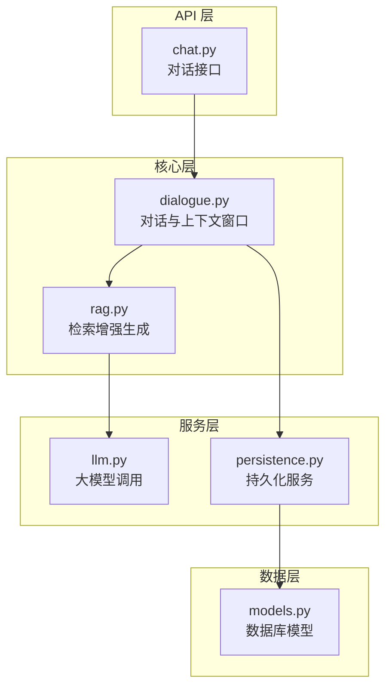
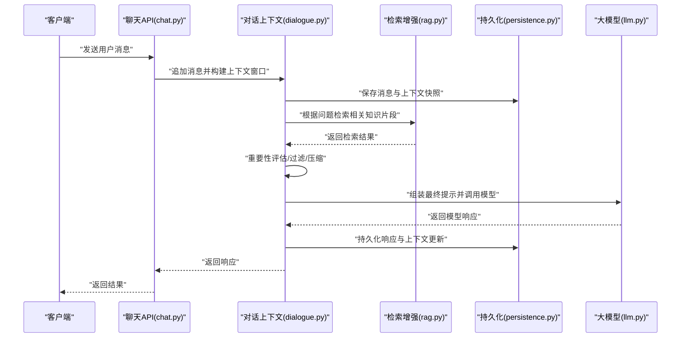
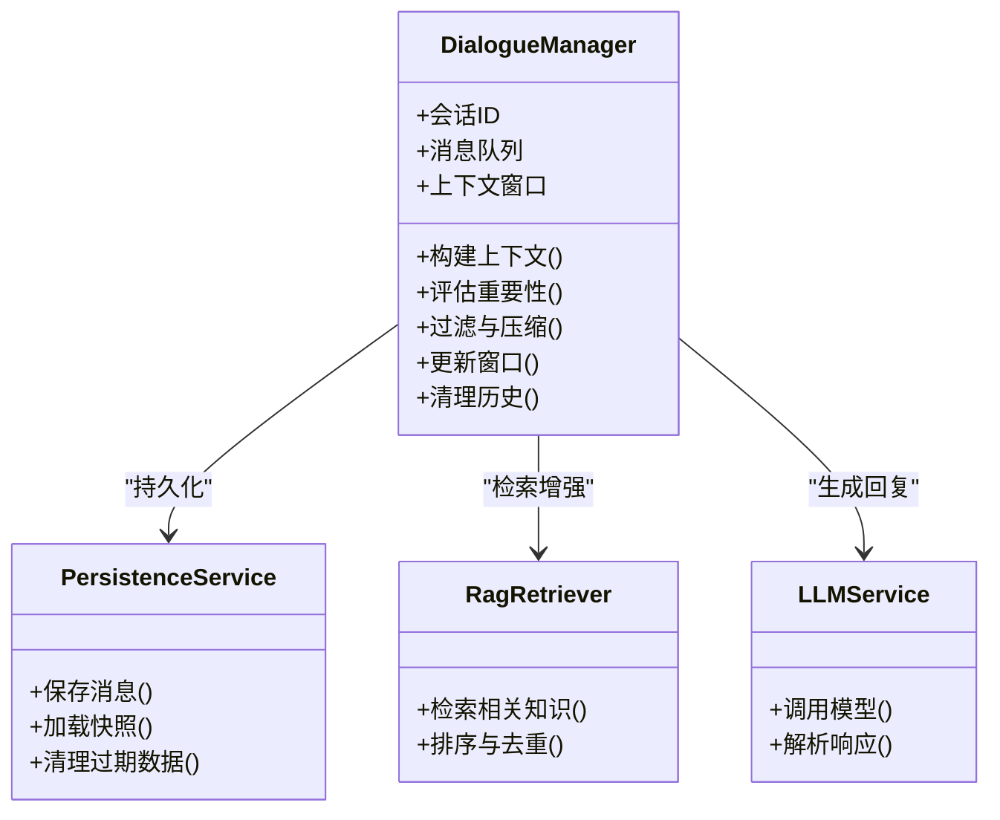
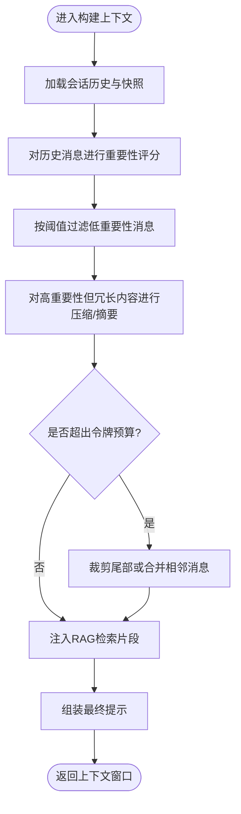
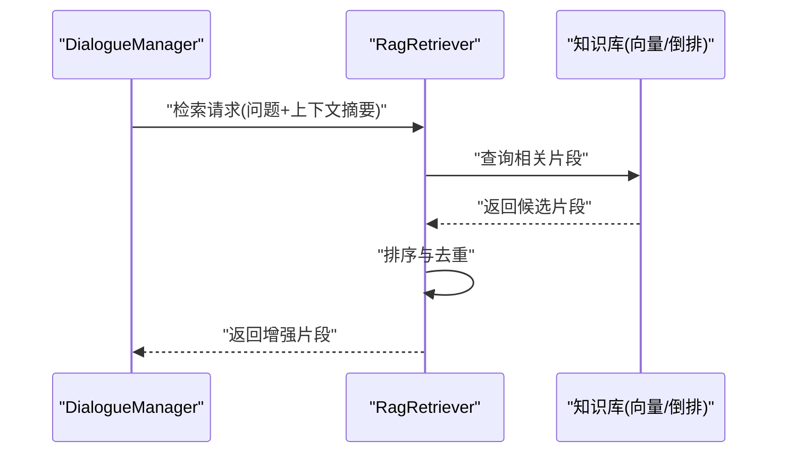
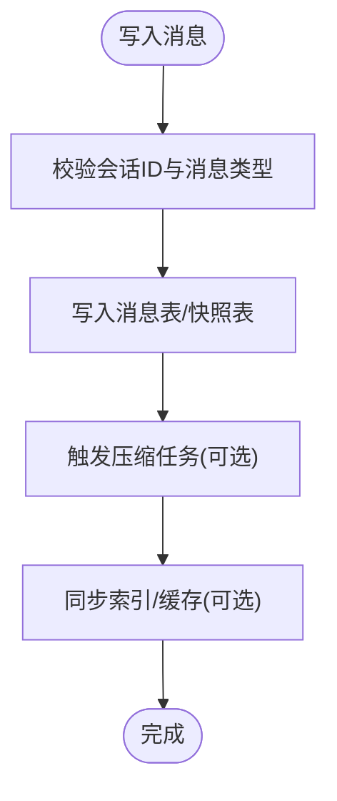
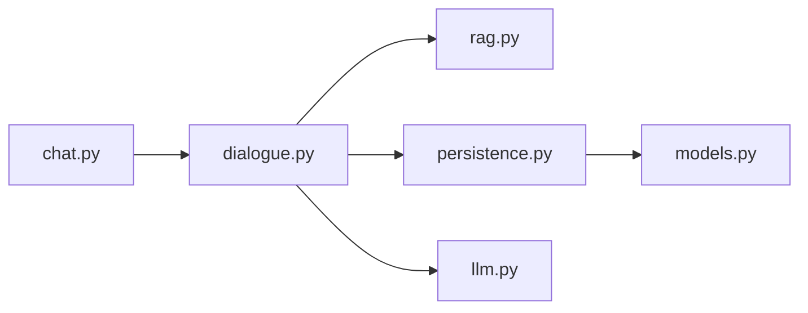

# 上下文窗口管理

<cite>
**本文引用的文件**   
- [backend/app/core/dialogue.py](file://backend/app/core/dialogue.py)
- [backend/app/core/rag.py](file://backend/app/core/rag.py)
- [backend/app/api/chat.py](file://backend/app/api/chat.py)
- [backend/app/services/persistence.py](file://backend/app/services/persistence.py)
- [backend/app/db/models.py](file://backend/app/db/models.py)
- [backend/app/services/llm.py](file://backend/app/services/llm.py)
</cite>

## 目录
1. [简介](#简介)
2. [项目结构](#项目结构)
3. [核心组件](#核心组件)
4. [架构总览](#架构总览)
5. [详细组件分析](#详细组件分析)
6. [依赖关系分析](#依赖关系分析)
7. [性能考量](#性能考量)
8. [故障排查指南](#故障排查指南)
9. [结论](#结论)
10. [附录：API 使用示例与最佳实践](#附录api-使用示例与最佳实践)

## 简介
本技术文档聚焦于“上下文窗口管理”，围绕对话上下文的构建策略、窗口大小控制与内存优化展开，系统阐述上下文信息的提取算法、重要性评估与过滤机制，并给出长对话的上下文压缩方案、关键信息保留策略以及性能优化技巧。同时提供上下文 API 的使用示例（获取、更新、清理），并说明上下文与 RAG 系统的集成方式与数据同步策略。

## 项目结构
本项目采用分层架构：API 层暴露接口，核心逻辑位于 core 层，服务层封装外部能力（LLM、持久化等），数据库模型定义在 db 层。与上下文窗口管理直接相关的模块包括对话状态管理、RAG 检索增强、消息持久化与 LLM 调用。

图表来源
- [backend/app/api/chat.py](file://backend/app/api/chat.py)
- [backend/app/core/dialogue.py](file://backend/app/core/dialogue.py)
- [backend/app/core/rag.py](file://backend/app/core/rag.py)
- [backend/app/services/llm.py](file://backend/app/services/llm.py)
- [backend/app/services/persistence.py](file://backend/app/services/persistence.py)
- [backend/app/db/models.py](file://backend/app/db/models.py)

章节来源
- [backend/app/api/chat.py](file://backend/app/api/chat.py)
- [backend/app/core/dialogue.py](file://backend/app/core/dialogue.py)
- [backend/app/core/rag.py](file://backend/app/core/rag.py)
- [backend/app/services/llm.py](file://backend/app/services/llm.py)
- [backend/app/services/persistence.py](file://backend/app/services/persistence.py)
- [backend/app/db/models.py](file://backend/app/db/models.py)

## 核心组件
- 对话与上下文窗口管理器：负责会话生命周期、消息序列维护、上下文窗口裁剪与滑动、摘要合并与历史归档。
- RAG 检索增强：基于用户问题与当前上下文，从知识库中检索相关片段，拼接为增强提示。
- 持久化服务：将对话历史、上下文快照与元数据落盘，支持按会话维度查询与清理。
- LLM 服务：封装模型调用，接收由上下文窗口组装的最终提示。

章节来源
- [backend/app/core/dialogue.py](file://backend/app/core/dialogue.py)
- [backend/app/core/rag.py](file://backend/app/core/rag.py)
- [backend/app/services/persistence.py](file://backend/app/services/persistence.py)
- [backend/app/services/llm.py](file://backend/app/services/llm.py)

## 架构总览
下图展示了从用户请求到返回响应的端到端流程，重点体现上下文窗口的构建、RAG 增强与最终提示组装。

图表来源
- [backend/app/api/chat.py](file://backend/app/api/chat.py)
- [backend/app/core/dialogue.py](file://backend/app/core/dialogue.py)
- [backend/app/core/rag.py](file://backend/app/core/rag.py)
- [backend/app/services/persistence.py](file://backend/app/services/persistence.py)
- [backend/app/services/llm.py](file://backend/app/services/llm.py)

## 详细组件分析

### 对话与上下文窗口管理器（dialogue.py）
职责与要点
- 会话管理：按会话 ID 维护消息队列与上下文窗口。
- 窗口构建：以时间滑窗或令牌预算为约束，动态裁剪历史消息。
- 重要性评估：对历史消息进行评分（如最近性、主题相关性、实体密度等），决定保留优先级。
- 过滤与压缩：去除冗余、合并相似段落、生成摘要以节省空间。
- 与 RAG 集成：将检索到的知识片段注入上下文窗口，形成增强提示。
- 持久化：定期保存上下文快照与关键元数据，支持恢复与清理。

图表来源
- [backend/app/core/dialogue.py](file://backend/app/core/dialogue.py)
- [backend/app/services/persistence.py](file://backend/app/services/persistence.py)
- [backend/app/core/rag.py](file://backend/app/core/rag.py)
- [backend/app/services/llm.py](file://backend/app/services/llm.py)

上下文窗口构建流程（算法级）

图表来源
- [backend/app/core/dialogue.py](file://backend/app/core/dialogue.py)
- [backend/app/core/rag.py](file://backend/app/core/rag.py)

章节来源
- [backend/app/core/dialogue.py](file://backend/app/core/dialogue.py)

### RAG 检索增强（rag.py）
职责与要点
- 检索策略：基于用户问题与当前上下文关键词，检索知识库片段。
- 相关性排序：结合语义相似度与上下文匹配度进行排序。
- 去重与融合：合并重复片段，避免上下文膨胀。
- 注入格式：将检索结果以结构化形式注入上下文窗口，便于后续处理。

图表来源
- [backend/app/core/rag.py](file://backend/app/core/rag.py)

章节来源
- [backend/app/core/rag.py](file://backend/app/core/rag.py)

### 持久化服务（persistence.py）
职责与要点
- 消息落盘：将用户与助手消息、系统提示与检索片段持久化。
- 快照管理：周期性保存上下文快照，支持快速恢复。
- 清理策略：按会话维度清理过期消息与中间态数据，释放内存。

图表来源
- [backend/app/services/persistence.py](file://backend/app/services/persistence.py)
- [backend/app/db/models.py](file://backend/app/db/models.py)

章节来源
- [backend/app/services/persistence.py](file://backend/app/services/persistence.py)
- [backend/app/db/models.py](file://backend/app/db/models.py)

### LLM 服务（llm.py）
职责与要点
- 提示组装：接收由上下文窗口生成的最终提示。
- 调用与重试：封装模型调用、超时与重试逻辑。
- 响应解析：解析模型输出，提取结构化字段（如答案、引用）。

章节来源
- [backend/app/services/llm.py](file://backend/app/services/llm.py)

### API 层（chat.py）
职责与要点
- 接口定义：提供获取上下文、更新上下文、清理上下文等 REST 接口。
- 参数校验：校验会话 ID、消息内容与窗口参数。
- 错误处理：统一异常包装与返回码。

章节来源
- [backend/app/api/chat.py](file://backend/app/api/chat.py)

## 依赖关系分析
- 耦合关系
  - API 层仅依赖对话上下文管理器，保持薄控制器风格。
  - 对话上下文管理器依赖 RAG 与持久化服务，解耦外部能力。
  - 持久化服务依赖数据库模型，屏蔽存储细节。
- 潜在循环依赖
  - 通过服务层与接口抽象避免循环导入。
- 外部依赖
  - 向量数据库或搜索引擎用于 RAG 检索。
  - 大模型服务用于文本生成。

图表来源
- [backend/app/api/chat.py](file://backend/app/api/chat.py)
- [backend/app/core/dialogue.py](file://backend/app/core/dialogue.py)
- [backend/app/core/rag.py](file://backend/app/core/rag.py)
- [backend/app/services/persistence.py](file://backend/app/services/persistence.py)
- [backend/app/db/models.py](file://backend/app/db/models.py)
- [backend/app/services/llm.py](file://backend/app/services/llm.py)

章节来源
- [backend/app/api/chat.py](file://backend/app/api/chat.py)
- [backend/app/core/dialogue.py](file://backend/app/core/dialogue.py)
- [backend/app/core/rag.py](file://backend/app/core/rag.py)
- [backend/app/services/persistence.py](file://backend/app/services/persistence.py)
- [backend/app/db/models.py](file://backend/app/db/models.py)
- [backend/app/services/llm.py](file://backend/app/services/llm.py)

## 性能考量
- 令牌预算控制
  - 设定最大令牌数，优先保留最近与高重要性消息；超长时裁剪尾部或合并相邻消息。
- 增量更新
  - 仅对新增消息进行评分与压缩，避免全量重建。
- 异步与批处理
  - 持久化与压缩任务异步执行，降低主路径延迟。
- 缓存与快照
  - 热点会话上下文缓存，减少磁盘 I/O；快照支持快速恢复。
- 检索优化
  - RAG 检索结果去重与限流，避免注入过多无关片段。
- 内存管理
  - 及时释放不再需要的中间对象；限制单次上下文窗口大小上限。

[本节为通用指导，不直接分析具体文件]

## 故障排查指南
- 常见问题
  - 上下文过大导致超时：检查令牌预算与压缩策略是否生效。
  - 检索噪声过多：调整 RAG 相关性阈值与去重策略。
  - 持久化失败：确认会话 ID 有效性与数据库连接状态。
- 定位步骤
  - 查看对话上下文快照与日志，确认窗口构建阶段。
  - 检查 RAG 检索结果数量与质量。
  - 验证持久化写入与清理任务执行情况。
- 恢复建议
  - 使用最近快照恢复会话上下文。
  - 重置窗口参数并重新构建上下文。

章节来源
- [backend/app/core/dialogue.py](file://backend/app/core/dialogue.py)
- [backend/app/core/rag.py](file://backend/app/core/rag.py)
- [backend/app/services/persistence.py](file://backend/app/services/persistence.py)

## 结论
通过对话上下文窗口管理器、RAG 检索增强与持久化服务的协同，系统在长对话场景下实现了可控的上下文大小、稳定的性能与良好的可恢复性。重要性评估与压缩策略确保关键信息保留，而 API 层的清晰边界提升了可维护性与扩展性。

[本节为总结性内容，不直接分析具体文件]

## 附录：API 使用示例与最佳实践
以下示例展示如何调用上下文相关接口（获取、更新、清理），并提供最佳实践建议。为避免泄露实现细节，仅提供调用路径与参数说明。

- 获取上下文
  - 接口：GET /api/chat/context
  - 参数：session_id, window_size, include_rag
  - 行为：返回当前会话的上下文窗口摘要与可选的 RAG 片段。
  - 参考实现位置：[backend/app/api/chat.py](file://backend/app/api/chat.py)

- 更新上下文
  - 接口：POST /api/chat/update
  - 参数：session_id, messages[], options{compress, filter, budget}
  - 行为：追加新消息，执行重要性评估、过滤与压缩，更新上下文窗口并持久化。
  - 参考实现位置：[backend/app/api/chat.py](file://backend/app/api/chat.py), [backend/app/core/dialogue.py](file://backend/app/core/dialogue.py), [backend/app/services/persistence.py](file://backend/app/services/persistence.py)

- 清理上下文
  - 接口：DELETE /api/chat/cleanup
  - 参数：session_id, retention_days
  - 行为：清理过期消息与中间快照，释放内存与存储空间。
  - 参考实现位置：[backend/app/api/chat.py](file://backend/app/api/chat.py), [backend/app/services/persistence.py](file://backend/app/services/persistence.py)

- 最佳实践
  - 设置合理的令牌预算与窗口大小，避免频繁压缩。
  - 启用增量更新与异步持久化，提升吞吐。
  - 针对长对话开启摘要压缩，保留关键实体与决策点。
  - 监控 RAG 检索质量，必要时调整阈值与去重策略。

章节来源
- [backend/app/api/chat.py](file://backend/app/api/chat.py)
- [backend/app/core/dialogue.py](file://backend/app/core/dialogue.py)
- [backend/app/services/persistence.py](file://backend/app/services/persistence.py)