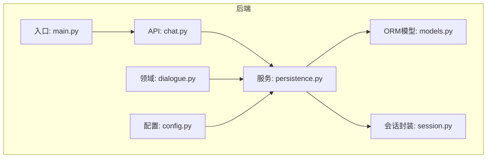
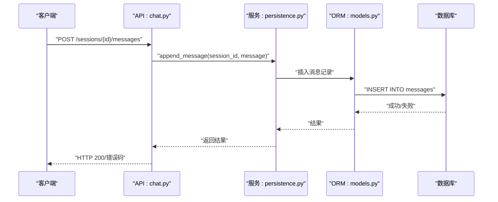
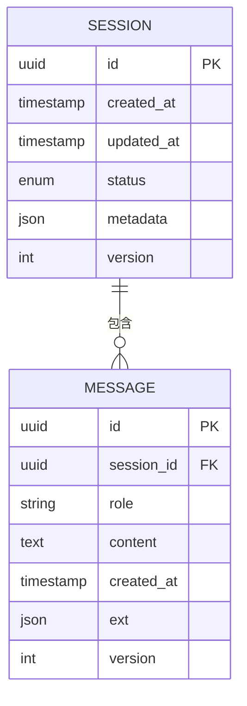
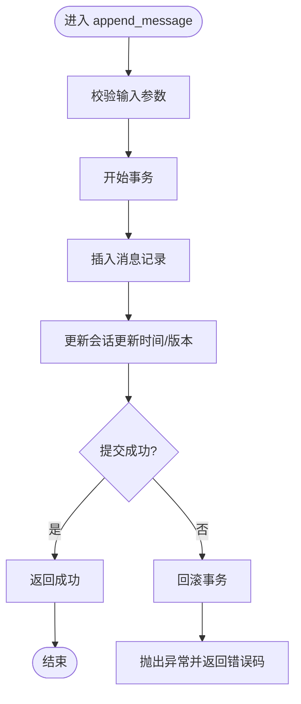
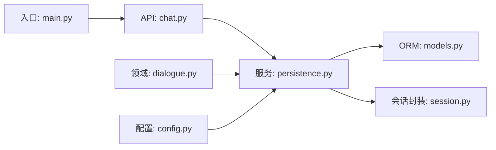

# 会话持久化

<cite>
**本文引用的文件**   
- [backend/app/db/models.py](file://backend/app/db/models.py)
- [backend/app/db/session.py](file://backend/app/db/session.py)
- [backend/app/services/persistence.py](file://backend/app/services/persistence.py)
- [backend/app/api/chat.py](file://backend/app/api/chat.py)
- [backend/app/core/dialogue.py](file://backend/app/core/dialogue.py)
- [backend/app/config.py](file://backend/app/config.py)
- [backend/app/main.py](file://backend/app/main.py)
</cite>

## 目录
1. [简介](#简介)
2. [项目结构](#项目结构)
3. [核心组件](#核心组件)
4. [架构总览](#架构总览)
5. [详细组件分析](#详细组件分析)
6. [依赖关系分析](#依赖关系分析)
7. [性能考虑](#性能考虑)
8. [故障排查指南](#故障排查指南)
9. [结论](#结论)
10. [附录](#附录)

## 简介
本技术文档围绕“会话持久化系统”展开，聚焦以下目标：
- 存储模型与数据库表设计、索引优化策略
- 会话数据的序列化格式、版本兼容性与迁移方案
- 分布式环境下的会话同步机制、数据一致性保证与冲突解决
- 会话CRUD操作的API接口文档与使用示例
- 备份恢复、清理策略与性能监控方法

为保证可追溯性，文中所有实现细节均对应到具体源文件，并在章节末尾提供“章节来源”。

## 项目结构
与会话持久化相关的后端代码主要分布在如下模块：
- 数据模型与ORM定义：backend/app/db/models.py
- 会话层封装与查询：backend/app/db/session.py
- 持久化服务（读写、事务、清理等）：backend/app/services/persistence.py
- 对话领域逻辑（消息组装、上下文管理）：backend/app/core/dialogue.py
- HTTP API（会话创建/读取/更新/删除、消息追加等）：backend/app/api/chat.py
- 配置项（数据库连接、超时、重试等）：backend/app/config.py
- 应用启动与中间件挂载：backend/app/main.py

图表来源
- [backend/app/api/chat.py](file://backend/app/api/chat.py)
- [backend/app/services/persistence.py](file://backend/app/services/persistence.py)
- [backend/app/db/models.py](file://backend/app/db/models.py)
- [backend/app/db/session.py](file://backend/app/db/session.py)
- [backend/app/core/dialogue.py](file://backend/app/core/dialogue.py)
- [backend/app/config.py](file://backend/app/config.py)
- [backend/app/main.py](file://backend/app/main.py)

章节来源
- [backend/app/api/chat.py](file://backend/app/api/chat.py)
- [backend/app/services/persistence.py](file://backend/app/services/persistence.py)
- [backend/app/db/models.py](file://backend/app/db/models.py)
- [backend/app/db/session.py](file://backend/app/db/session.py)
- [backend/app/core/dialogue.py](file://backend/app/core/dialogue.py)
- [backend/app/config.py](file://backend/app/config.py)
- [backend/app/main.py](file://backend/app/main.py)

## 核心组件
- 数据模型（models.py）
  - 定义会话实体、消息实体及其字段类型、约束与关联关系。
  - 建议为常用查询字段建立索引（如会话ID、时间戳、用户标识等）。
- 会话封装（session.py）
  - 提供数据库会话生命周期管理、连接池参数、事务边界控制。
- 持久化服务（persistence.py）
  - 封装会话与消息的CRUD操作、批量写入、分页查询、软删除与清理任务。
  - 负责序列化/反序列化的统一入口，以及版本兼容性处理。
- 对话领域（dialogue.py）
  - 组织对话上下文、消息流、状态机（进行中/已归档/已清理）。
- API（chat.py）
  - 暴露REST接口：创建会话、追加消息、获取历史、更新元信息、删除会话等。
- 配置（config.py）
  - 集中管理数据库URL、连接池大小、超时、重试次数、清理周期等。
- 入口（main.py）
  - 初始化应用、挂载路由、注册生命周期钩子（如定时清理任务）。

章节来源
- [backend/app/db/models.py](file://backend/app/db/models.py)
- [backend/app/db/session.py](file://backend/app/db/session.py)
- [backend/app/services/persistence.py](file://backend/app/services/persistence.py)
- [backend/app/core/dialogue.py](file://backend/app/core/dialogue.py)
- [backend/app/api/chat.py](file://backend/app/api/chat.py)
- [backend/app/config.py](file://backend/app/config.py)
- [backend/app/main.py](file://backend/app/main.py)

## 架构总览
整体采用分层架构：API层接收请求，调用持久化服务；持久化服务通过ORM访问数据库；领域层负责业务语义；配置与入口负责运行期装配。

图表来源
- [backend/app/api/chat.py](file://backend/app/api/chat.py)
- [backend/app/services/persistence.py](file://backend/app/services/persistence.py)
- [backend/app/db/models.py](file://backend/app/db/models.py)

## 详细组件分析

### 数据模型与表设计
- 会话实体
  - 关键字段：会话ID、创建时间、更新时间、状态、元数据（JSON）、版本等。
  - 建议索引：会话ID主键、更新时间、状态、用户标识（若存在）。
- 消息实体
  - 关键字段：消息ID、会话ID（外键）、角色、内容、时间戳、扩展字段（JSON）、版本等。
  - 建议索引：会话ID+时间戳复合索引、消息ID主键。
- 关联关系
  - 一对多：一个会话包含多条消息。
  - 软删除：可通过布尔标记或时间戳实现，便于审计与恢复。

图表来源
- [backend/app/db/models.py](file://backend/app/db/models.py)

章节来源
- [backend/app/db/models.py](file://backend/app/db/models.py)

### 会话封装与事务管理
- 连接池与超时
  - 通过配置控制最大连接数、空闲回收、查询超时，避免资源泄漏。
- 事务边界
  - 在持久化服务中统一开启/提交/回滚事务，确保会话与消息写入的原子性。
- 重试与退避
  - 对瞬时错误（锁等待、网络抖动）进行有限次重试，配合指数退避降低雪崩风险。

章节来源
- [backend/app/db/session.py](file://backend/app/db/session.py)
- [backend/app/config.py](file://backend/app/config.py)

### 持久化服务（CRUD、序列化、版本兼容）
- CRUD能力
  - 创建会话、追加消息、分页查询历史、更新元信息、软删除与硬删除。
- 序列化格式
  - 统一以结构化对象作为内部表示，落库前转换为JSON字符串；扩展字段使用JSON以支持灵活演进。
- 版本兼容
  - 每个实体携带version字段；写入时递增；读取时根据version执行适配转换，保障向后兼容。
- 迁移方案
  - 基于版本号的增量迁移：新增字段默认值、旧字段弃用映射、历史数据一次性修复脚本。

图表来源
- [backend/app/services/persistence.py](file://backend/app/services/persistence.py)

章节来源
- [backend/app/services/persistence.py](file://backend/app/services/persistence.py)

### 对话领域逻辑
- 上下文构建
  - 按时间顺序聚合最近N条消息，结合系统提示词生成上下文窗口。
- 状态机
  - 会话状态：进行中、已归档、已清理；由持久化服务在特定事件后推进。
- 幂等性
  - 通过消息唯一键或去重表防止重复写入。

章节来源
- [backend/app/core/dialogue.py](file://backend/app/core/dialogue.py)

### API接口文档
- 基础路径
  - /api/sessions
- 关键接口
  - 创建会话
    - 方法：POST
    - 路径：/api/sessions
    - 请求体：会话元数据（可选）
    - 响应：会话ID、创建时间、版本
  - 追加消息
    - 方法：POST
    - 路径：/api/sessions/{id}/messages
    - 请求体：角色、内容、扩展字段（可选）
    - 响应：消息ID、时间戳、版本
  - 获取历史
    - 方法：GET
    - 路径：/api/sessions/{id}/messages?limit=&offset=&order=
    - 响应：消息列表、分页信息
  - 更新会话元信息
    - 方法：PUT
    - 路径：/api/sessions/{id}
    - 请求体：要更新的元数据字段
    - 响应：最新会话信息
  - 删除会话
    - 方法：DELETE
    - 路径：/api/sessions/{id}
    - 响应：确认信息
- 错误码
  - 400：参数校验失败
  - 404：会话不存在
  - 409：并发冲突（版本不匹配）
  - 500：服务器内部错误

章节来源
- [backend/app/api/chat.py](file://backend/app/api/chat.py)

### 分布式同步与一致性
- 同步机制
  - 单写多读：仅主节点写入，副本只读；跨节点通过数据库复制保证最终一致。
  - 事件驱动：将会话变更发布为事件，订阅者异步消费，用于缓存/搜索索引重建。
- 一致性保证
  - 强一致：在同一数据库事务内完成会话与消息写入。
  - 最终一致：跨服务通过幂等消息与补偿任务达成。
- 冲突解决
  - 乐观锁：基于version字段，冲突时返回409并要求客户端重试。
  - 合并策略：对元数据采用字段级合并，保留最新版本；对消息采用追加不可变原则。

章节来源
- [backend/app/services/persistence.py](file://backend/app/services/persistence.py)
- [backend/app/config.py](file://backend/app/config.py)

### 备份恢复与清理策略
- 备份
  - 定期全量快照 + 增量日志；导出JSON备份用于跨环境迁移。
- 恢复
  - 先恢复全量快照，再回放增量日志；校验checksum与版本连续性。
- 清理
  - 软删除：标记过期会话为“已清理”，延迟物理删除。
  - 定时任务：按配置周期扫描并清理超期数据，释放空间。

章节来源
- [backend/app/services/persistence.py](file://backend/app/services/persistence.py)
- [backend/app/config.py](file://backend/app/config.py)

### 性能监控与可观测性
- 指标
  - 写入QPS、P95/P99延迟、连接池使用率、慢查询数量、错误率。
- 追踪
  - 为每次会话写入添加trace_id，贯穿API→服务→ORM→DB。
- 告警
  - 阈值触发：高延迟、连接池耗尽、事务超时、磁盘空间不足。

章节来源
- [backend/app/services/persistence.py](file://backend/app/services/persistence.py)
- [backend/app/config.py](file://backend/app/config.py)

## 依赖关系分析
- 组件耦合
  - API层仅依赖持久化服务接口，保持低耦合。
  - 持久化服务依赖ORM模型与数据库会话封装。
  - 领域层通过服务层访问数据，避免直接操作ORM。
- 外部依赖
  - 数据库驱动、连接池、ORM框架、序列化库。
- 循环依赖
  - 当前分层清晰，未发现循环导入；建议在大型项目中引入接口抽象进一步解耦。

图表来源
- [backend/app/api/chat.py](file://backend/app/api/chat.py)
- [backend/app/services/persistence.py](file://backend/app/services/persistence.py)
- [backend/app/db/models.py](file://backend/app/db/models.py)
- [backend/app/db/session.py](file://backend/app/db/session.py)
- [backend/app/core/dialogue.py](file://backend/app/core/dialogue.py)
- [backend/app/config.py](file://backend/app/config.py)
- [backend/app/main.py](file://backend/app/main.py)

章节来源
- [backend/app/api/chat.py](file://backend/app/api/chat.py)
- [backend/app/services/persistence.py](file://backend/app/services/persistence.py)
- [backend/app/db/models.py](file://backend/app/db/models.py)
- [backend/app/db/session.py](file://backend/app/db/session.py)
- [backend/app/core/dialogue.py](file://backend/app/core/dialogue.py)
- [backend/app/config.py](file://backend/app/config.py)
- [backend/app/main.py](file://backend/app/main.py)

## 性能考虑
- 索引优化
  - 为高频查询字段建立合适索引，避免过度索引导致写入放大。
  - 复合索引优先覆盖排序与过滤条件（如会话ID+时间戳）。
- 批处理
  - 批量插入消息减少往返开销；注意批次大小与内存占用平衡。
- 连接池
  - 合理设置最大连接数与空闲回收，避免连接风暴。
- 分页与游标
  - 大数据量场景使用基于时间戳的分页，避免深度偏移带来的性能问题。
- 缓存
  - 热点会话元信息与最近消息可加入本地/分布式缓存，缩短读取延迟。

[本节为通用指导，无需列出具体文件来源]

## 故障排查指南
- 常见问题
  - 连接池耗尽：检查最大连接数与长事务；观察慢查询。
  - 事务超时：定位长时间运行的写入；拆分大事务。
  - 版本冲突：客户端重试逻辑需处理409并重新拉取最新数据。
  - 磁盘空间不足：调整清理策略与备份保留周期。
- 诊断步骤
  - 查看错误日志中的trace_id，串联API→服务→ORM→DB链路。
  - 核对数据库慢查询日志与索引命中情况。
  - 验证备份恢复流程的完整性与一致性。

章节来源
- [backend/app/services/persistence.py](file://backend/app/services/persistence.py)
- [backend/app/config.py](file://backend/app/config.py)

## 结论
本会话持久化系统通过清晰的层次划分、统一的序列化与版本管理、完善的CRUD与清理机制，满足高可用与可扩展需求。在分布式环境下，借助数据库复制与事件驱动可实现最终一致，并通过乐观锁与幂等设计化解冲突。配合合理的索引、批处理与监控告警，可在大规模场景下保持稳定性能。

[本节为总结性内容，无需列出具体文件来源]

## 附录
- 术语
  - 会话：一次对话的上下文集合。
  - 消息：会话中的一条交互记录。
  - 软删除：标记删除而非物理移除。
  - 乐观锁：基于版本号的控制并发机制。
- 参考
  - 数据库设计规范、ORM最佳实践、分布式一致性模式。

[本节为概念性内容，无需列出具体文件来源]