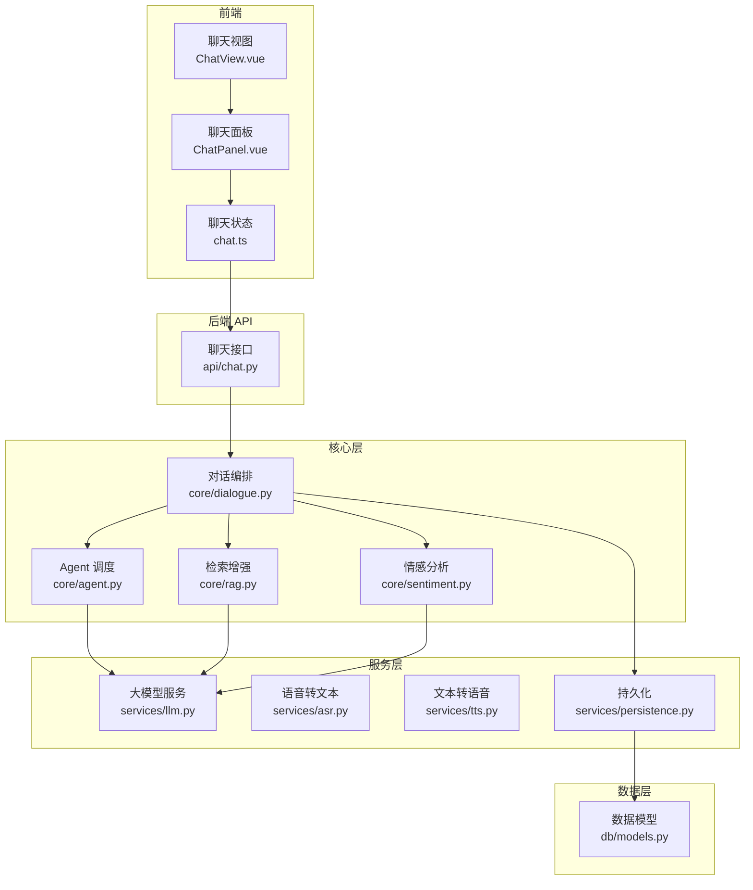
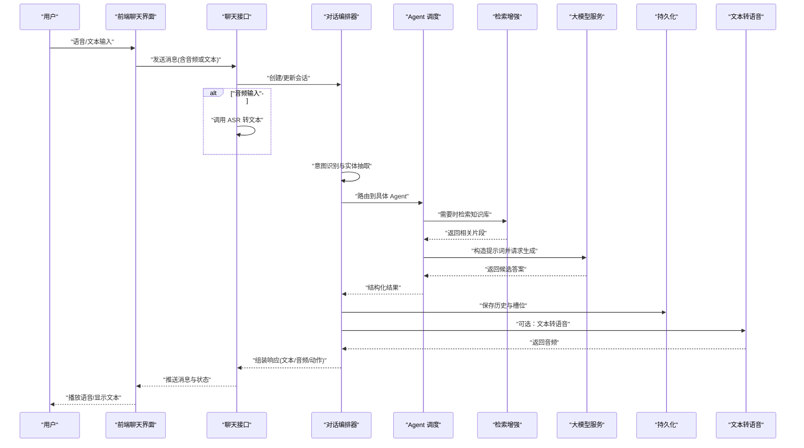
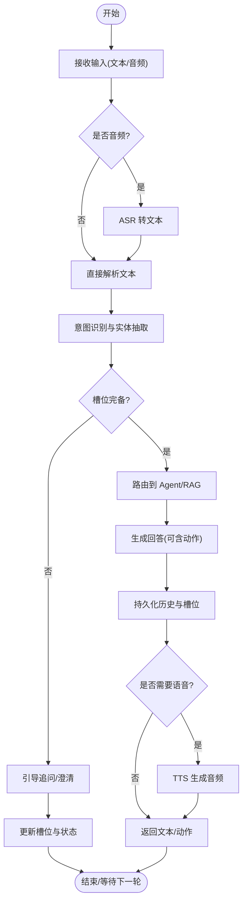
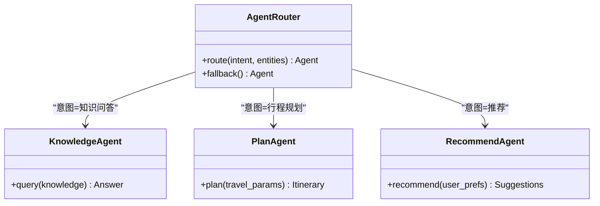
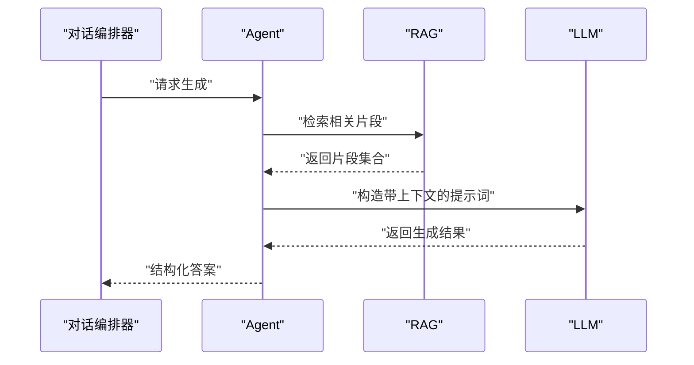
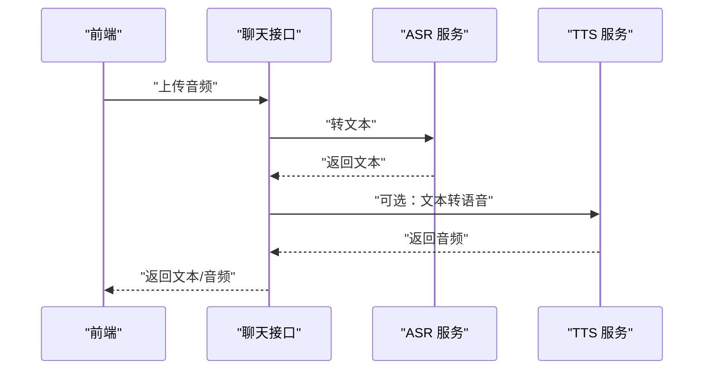
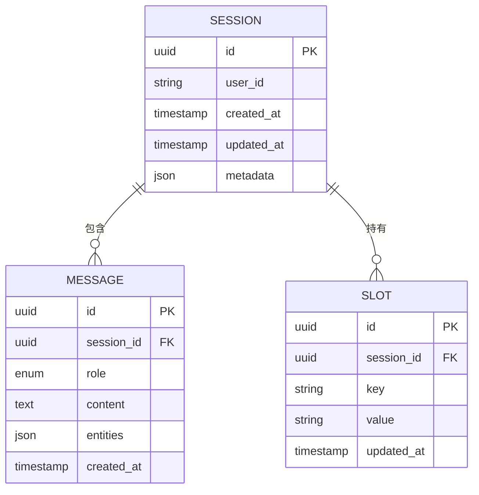
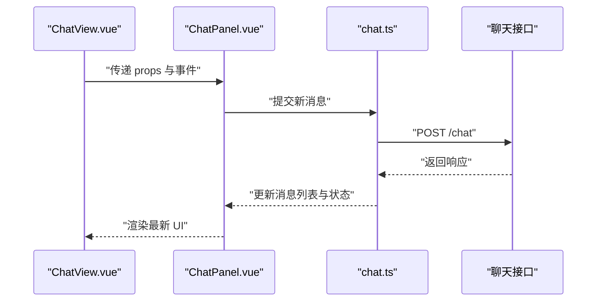
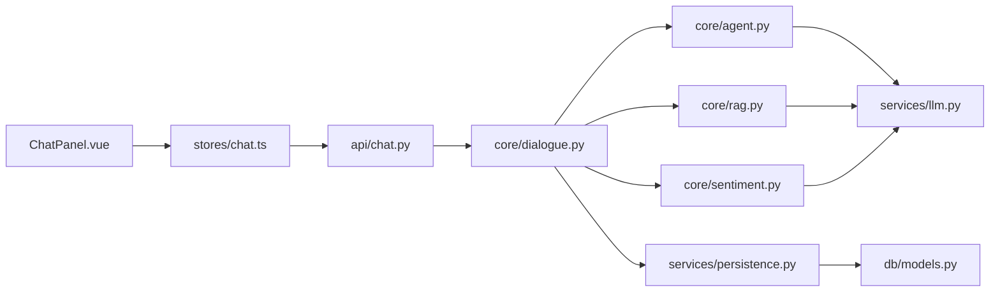

# 对话流控制

<cite>
**本文引用的文件**   
- [backend/app/core/dialogue.py](file://backend/app/core/dialogue.py)
- [backend/app/core/agent.py](file://backend/app/core/agent.py)
- [backend/app/api/chat.py](file://backend/app/api/chat.py)
- [backend/app/services/llm.py](file://backend/app/services/llm.py)
- [backend/app/services/asr.py](file://backend/app/services/asr.py)
- [backend/app/services/tts.py](file://backend/app/services/tts.py)
- [backend/app/services/persistence.py](file://backend/app/services/persistence.py)
- [backend/app/db/models.py](file://backend/app/db/models.py)
- [backend/app/config.py](file://backend/app/config.py)
- [frontend/tourist-app/src/stores/chat.ts](file://frontend/tourist-app/src/stores/chat.ts)
- [frontend/tourist-app/src/components/ChatPanel/ChatPanel.vue](file://frontend/tourist-app/src/components/ChatPanel/ChatPanel.vue)
- [frontend/tourist-app/src/views/ChatView.vue](file://frontend/tourist-app/src/views/ChatView.vue)
</cite>

## 目录
1. [简介](#简介)
2. [项目结构](#项目结构)
3. [核心组件](#核心组件)
4. [架构总览](#架构总览)
5. [详细组件分析](#详细组件分析)
6. [依赖关系分析](#依赖关系分析)
7. [性能考量](#性能考量)
8. [故障排查指南](#故障排查指南)
9. [结论](#结论)
10. [附录](#附录)

## 简介
本技术文档围绕“对话流控制系统”展开，聚焦于智能旅游场景下的多轮对话编排、意图识别与实体抽取、语义理解与检索增强生成（RAG）、语音输入输出链路、持久化与状态管理、错误处理与用户反馈机制。文档同时提供配置方法、自定义流程与扩展开发指南，并结合复杂场景给出最佳实践建议。

## 项目结构
后端采用分层架构：API 层暴露 HTTP 接口；核心层负责对话编排、Agent 调度、RAG 与情感分析；服务层封装 LLM、ASR、TTS、持久化等外部能力；数据层通过模型定义与数据库会话进行存储。前端包含游客端应用与管理后台，游客端负责聊天界面、数字人展示与语音交互，管理后台用于知识库与数据分析。

图表来源
- [backend/app/api/chat.py](file://backend/app/api/chat.py)
- [backend/app/core/dialogue.py](file://backend/app/core/dialogue.py)
- [backend/app/core/agent.py](file://backend/app/core/agent.py)
- [backend/app/core/rag.py](file://backend/app/core/rag.py)
- [backend/app/core/sentiment.py](file://backend/app/core/sentiment.py)
- [backend/app/services/llm.py](file://backend/app/services/llm.py)
- [backend/app/services/asr.py](file://backend/app/services/asr.py)
- [backend/app/services/tts.py](file://backend/app/services/tts.py)
- [backend/app/services/persistence.py](file://backend/app/services/persistence.py)
- [backend/app/db/models.py](file://backend/app/db/models.py)
- [frontend/tourist-app/src/views/ChatView.vue](file://frontend/tourist-app/src/views/ChatView.vue)
- [frontend/tourist-app/src/components/ChatPanel/ChatPanel.vue](file://frontend/tourist-app/src/components/ChatPanel/ChatPanel.vue)
- [frontend/tourist-app/src/stores/chat.ts](file://frontend/tourist-app/src/stores/chat.ts)

章节来源
- [backend/app/api/chat.py](file://backend/app/api/chat.py)
- [backend/app/core/dialogue.py](file://backend/app/core/dialogue.py)
- [backend/app/core/agent.py](file://backend/app/core/agent.py)
- [backend/app/core/rag.py](file://backend/app/core/rag.py)
- [backend/app/core/sentiment.py](file://backend/app/core/sentiment.py)
- [backend/app/services/llm.py](file://backend/app/services/llm.py)
- [backend/app/services/asr.py](file://backend/app/services/asr.py)
- [backend/app/services/tts.py](file://backend/app/services/tts.py)
- [backend/app/services/persistence.py](file://backend/app/services/persistence.py)
- [backend/app/db/models.py](file://backend/app/db/models.py)
- [frontend/tourist-app/src/views/ChatView.vue](file://frontend/tourist-app/src/views/ChatView.vue)
- [frontend/tourist-app/src/components/ChatPanel/ChatPanel.vue](file://frontend/tourist-app/src/components/ChatPanel/ChatPanel.vue)
- [frontend/tourist-app/src/stores/chat.ts](file://frontend/tourist-app/src/stores/chat.ts)

## 核心组件
- 对话编排器：维护会话上下文、历史消息、槽位与状态机，驱动分支逻辑与条件判断，协调 Agent 与 RAG 调用，并触发持久化与情感分析。
- Agent 调度：根据意图与策略选择具体执行路径，如知识问答、行程规划、推荐查询等，统一接入大模型服务。
- 检索增强（RAG）：对知识库进行检索与片段拼接，结合提示词模板生成更准确的回答。
- 情感分析：评估用户情绪，指导引导策略与回复语气。
- 语音链路：ASR 将音频转为文本，TTS 将文本转为音频，支持端到端语音对话。
- 持久化：保存对话历史、槽位、状态与元数据，支持断线续聊与审计。
- 前端状态与 UI：Vue 状态管理维护消息列表、加载态与错误信息，组件渲染聊天面板与数字人。

章节来源
- [backend/app/core/dialogue.py](file://backend/app/core/dialogue.py)
- [backend/app/core/agent.py](file://backend/app/core/agent.py)
- [backend/app/core/rag.py](file://backend/app/core/rag.py)
- [backend/app/core/sentiment.py](file://backend/app/core/sentiment.py)
- [backend/app/services/llm.py](file://backend/app/services/llm.py)
- [backend/app/services/asr.py](file://backend/app/services/asr.py)
- [backend/app/services/tts.py](file://backend/app/services/tts.py)
- [backend/app/services/persistence.py](file://backend/app/services/persistence.py)
- [frontend/tourist-app/src/stores/chat.ts](file://frontend/tourist-app/src/stores/chat.ts)
- [frontend/tourist-app/src/components/ChatPanel/ChatPanel.vue](file://frontend/tourist-app/src/components/ChatPanel/ChatPanel.vue)

## 架构总览
下图展示了从用户输入到系统响应的完整调用链，包括语音输入、文本处理、意图识别、实体抽取、RAG 检索、LLM 生成、情感分析与持久化。

图表来源
- [backend/app/api/chat.py](file://backend/app/api/chat.py)
- [backend/app/core/dialogue.py](file://backend/app/core/dialogue.py)
- [backend/app/core/agent.py](file://backend/app/core/agent.py)
- [backend/app/core/rag.py](file://backend/app/core/rag.py)
- [backend/app/services/llm.py](file://backend/app/services/llm.py)
- [backend/app/services/asr.py](file://backend/app/services/asr.py)
- [backend/app/services/tts.py](file://backend/app/services/tts.py)
- [backend/app/services/persistence.py](file://backend/app/services/persistence.py)

## 详细组件分析

### 对话编排器（核心流程与状态机）
- 职责
  - 维护会话上下文：历史消息、槽位、当前节点与状态。
  - 驱动分支逻辑：基于意图、实体与规则决定下一步动作。
  - 协调子组件：Agent、RAG、情感分析、持久化与 TTS。
  - 错误恢复：超时、重试、降级与回退策略。
- 关键流程
  - 接收输入（文本/音频），必要时调用 ASR。
  - 意图识别与实体抽取：解析用户目标与关键参数。
  - 条件判断与分支：根据槽位完备性、业务规则与情感信号选择路径。
  - 调用 Agent 与 RAG：获取领域知识与生成内容。
  - 持久化与反馈：保存状态，必要时触发 TTS。
- 设计模式
  - 状态机：以节点表示对话阶段，边由条件与动作组成。
  - 策略模式：不同意图对应不同处理策略。
  - 观察者：事件驱动记录日志与分析指标。

图表来源
- [backend/app/core/dialogue.py](file://backend/app/core/dialogue.py)
- [backend/app/services/asr.py](file://backend/app/services/asr.py)
- [backend/app/services/tts.py](file://backend/app/services/tts.py)
- [backend/app/services/persistence.py](file://backend/app/services/persistence.py)

章节来源
- [backend/app/core/dialogue.py](file://backend/app/core/dialogue.py)
- [backend/app/services/asr.py](file://backend/app/services/asr.py)
- [backend/app/services/tts.py](file://backend/app/services/tts.py)
- [backend/app/services/persistence.py](file://backend/app/services/persistence.py)

### Agent 调度与意图路由
- 职责
  - 根据意图类型选择具体 Agent（如知识问答、行程规划、推荐）。
  - 组合 RAG 与 LLM 的调用顺序与提示词模板。
  - 返回结构化结果供编排器决策。
- 关键实现要点
  - 意图分类：基于关键词、规则或轻量模型进行分类。
  - 实体抽取：正则、词典或 NER 模型提取时间、地点、偏好等。
  - 策略选择：按优先级与置信度选择最优路径。
  - 容错：当某 Agent 失败时回退到通用问答或人工引导。

图表来源
- [backend/app/core/agent.py](file://backend/app/core/agent.py)
- [backend/app/core/rag.py](file://backend/app/core/rag.py)
- [backend/app/services/llm.py](file://backend/app/services/llm.py)

章节来源
- [backend/app/core/agent.py](file://backend/app/core/agent.py)
- [backend/app/core/rag.py](file://backend/app/core/rag.py)
- [backend/app/services/llm.py](file://backend/app/services/llm.py)

### 检索增强（RAG）与语义理解
- 职责
  - 对用户问题构建检索查询，召回相关知识片段。
  - 拼接上下文与提示词，提升生成质量与准确性。
- 关键点
  - 检索策略：关键词匹配、向量相似度、混合检索。
  - 片段重排：按相关性与时效性排序。
  - 提示工程：约束生成范围，减少幻觉。

图表来源
- [backend/app/core/rag.py](file://backend/app/core/rag.py)
- [backend/app/services/llm.py](file://backend/app/services/llm.py)

章节来源
- [backend/app/core/rag.py](file://backend/app/core/rag.py)
- [backend/app/services/llm.py](file://backend/app/services/llm.py)

### 语音链路（ASR/TTS）
- 职责
  - ASR：将音频流或文件转换为文本，供后续处理。
  - TTS：将文本转换为音频，提升用户体验。
- 关键点
  - 采样率与格式适配。
  - 超时与重试策略。
  - 缓存热门回复以降低延迟。

图表来源
- [backend/app/services/asr.py](file://backend/app/services/asr.py)
- [backend/app/services/tts.py](file://backend/app/services/tts.py)

章节来源
- [backend/app/services/asr.py](file://backend/app/services/asr.py)
- [backend/app/services/tts.py](file://backend/app/services/tts.py)

### 持久化与数据模型
- 职责
  - 保存对话历史、槽位、状态与元数据。
  - 支持会话恢复、审计与数据分析。
- 关键点
  - 幂等写入与去重。
  - 索引优化以提升查询效率。
  - 敏感信息脱敏。

图表来源
- [backend/app/db/models.py](file://backend/app/db/models.py)
- [backend/app/services/persistence.py](file://backend/app/services/persistence.py)

章节来源
- [backend/app/db/models.py](file://backend/app/db/models.py)
- [backend/app/services/persistence.py](file://backend/app/services/persistence.py)

### 前端状态与 UI 集成
- 职责
  - 维护聊天消息列表、加载态与错误信息。
  - 渲染聊天面板与数字人，支持语音播放。
- 关键点
  - 实时消息推送与乐观更新。
  - 错误边界与重试按钮。
  - 语音输入控件与播放控制。

图表来源
- [frontend/tourist-app/src/views/ChatView.vue](file://frontend/tourist-app/src/views/ChatView.vue)
- [frontend/tourist-app/src/components/ChatPanel/ChatPanel.vue](file://frontend/tourist-app/src/components/ChatPanel/ChatPanel.vue)
- [frontend/tourist-app/src/stores/chat.ts](file://frontend/tourist-app/src/stores/chat.ts)
- [backend/app/api/chat.py](file://backend/app/api/chat.py)

章节来源
- [frontend/tourist-app/src/views/ChatView.vue](file://frontend/tourist-app/src/views/ChatView.vue)
- [frontend/tourist-app/src/components/ChatPanel/ChatPanel.vue](file://frontend/tourist-app/src/components/ChatPanel/ChatPanel.vue)
- [frontend/tourist-app/src/stores/chat.ts](file://frontend/tourist-app/src/stores/chat.ts)
- [backend/app/api/chat.py](file://backend/app/api/chat.py)

## 依赖关系分析
- 模块耦合
  - API 层仅依赖核心层与服务层，保持薄控制器。
  - 核心层依赖服务层与数据层，避免跨层调用。
  - 前端通过 REST/WebSocket 与后端交互，状态集中管理。
- 外部依赖
  - LLM 服务：生成式回答与意图分类。
  - ASR/TTS：语音输入输出。
  - 数据库：会话与消息持久化。
- 潜在循环依赖
  - 核心层不应反向依赖 API 层或服务层的具体实现，应通过接口抽象。

图表来源
- [backend/app/api/chat.py](file://backend/app/api/chat.py)
- [backend/app/core/dialogue.py](file://backend/app/core/dialogue.py)
- [backend/app/core/agent.py](file://backend/app/core/agent.py)
- [backend/app/core/rag.py](file://backend/app/core/rag.py)
- [backend/app/core/sentiment.py](file://backend/app/core/sentiment.py)
- [backend/app/services/llm.py](file://backend/app/services/llm.py)
- [backend/app/services/persistence.py](file://backend/app/services/persistence.py)
- [backend/app/db/models.py](file://backend/app/db/models.py)
- [frontend/tourist-app/src/stores/chat.ts](file://frontend/tourist-app/src/stores/chat.ts)
- [frontend/tourist-app/src/components/ChatPanel/ChatPanel.vue](file://frontend/tourist-app/src/components/ChatPanel/ChatPanel.vue)

章节来源
- [backend/app/api/chat.py](file://backend/app/api/chat.py)
- [backend/app/core/dialogue.py](file://backend/app/core/dialogue.py)
- [backend/app/core/agent.py](file://backend/app/core/agent.py)
- [backend/app/core/rag.py](file://backend/app/core/rag.py)
- [backend/app/core/sentiment.py](file://backend/app/core/sentiment.py)
- [backend/app/services/llm.py](file://backend/app/services/llm.py)
- [backend/app/services/persistence.py](file://backend/app/services/persistence.py)
- [backend/app/db/models.py](file://backend/app/db/models.py)
- [frontend/tourist-app/src/stores/chat.ts](file://frontend/tourist-app/src/stores/chat.ts)
- [frontend/tourist-app/src/components/ChatPanel/ChatPanel.vue](file://frontend/tourist-app/src/components/ChatPanel/ChatPanel.vue)

## 性能考量
- 并发与异步
  - 使用异步 I/O 处理 LLM、ASR、TTS 与数据库操作，提高吞吐。
- 缓存
  - 热点回复与检索片段缓存，降低重复计算与网络开销。
- 批处理与流式输出
  - 对批量请求进行合并；LLM 支持流式返回以减少首字延迟。
- 资源限制
  - 设置超时、重试上限与熔断，防止雪崩。
- 前端优化
  - 消息分页与虚拟滚动，减少 DOM 压力。
  - 语音分段播放与预加载。

[本节为通用性能建议，不直接分析具体文件]

## 故障排查指南
- 常见问题
  - 意图识别不准：检查实体抽取规则与提示词模板，增加样本与阈值。
  - 检索结果不相关：调整检索权重与片段长度，引入重排策略。
  - 语音链路异常：确认采样率、编码格式与网络带宽，增加重试与降级。
  - 持久化失败：检查数据库连接与事务，启用幂等写入与补偿任务。
- 诊断手段
  - 全链路日志：在关键节点记录输入、中间结果与耗时。
  - 指标监控：QPS、P95/P99 延迟、错误率与重试次数。
  - 回放测试：录制典型对话轨迹进行回归验证。

章节来源
- [backend/app/core/dialogue.py](file://backend/app/core/dialogue.py)
- [backend/app/services/llm.py](file://backend/app/services/llm.py)
- [backend/app/services/asr.py](file://backend/app/services/asr.py)
- [backend/app/services/tts.py](file://backend/app/services/tts.py)
- [backend/app/services/persistence.py](file://backend/app/services/persistence.py)

## 结论
本对话流控制系统以编排器为核心，结合 Agent 路由、RAG 检索、情感分析与语音链路，形成高可用、可扩展的智能旅游对话平台。通过清晰的状态机与策略模式，系统能够灵活应对复杂场景，并提供完善的错误处理与用户反馈机制。建议在持续迭代中完善意图库、实体词典与提示工程，强化监控与自动化测试，以提升稳定性与用户体验。

[本节为总结性内容，不直接分析具体文件]

## 附录

### 配置方法与自定义流程
- 全局配置
  - 服务地址、超时、重试与缓存策略可通过配置文件集中管理。
- 对话流程配置
  - 定义节点、条件与动作，支持热更新与灰度发布。
  - 槽位模板与校验规则集中维护，便于复用与版本管理。
- 自定义扩展
  - 新增 Agent：实现标准接口并在路由表中注册。
  - 新增 RAG 源：实现检索适配器，支持多种数据源。
  - 新增情感策略：根据情感分数调整引导话术与语气。

章节来源
- [backend/app/config.py](file://backend/app/config.py)
- [backend/app/core/dialogue.py](file://backend/app/core/dialogue.py)
- [backend/app/core/agent.py](file://backend/app/core/agent.py)
- [backend/app/core/rag.py](file://backend/app/core/rag.py)

### 复杂场景最佳实践
- 多轮行程规划
  - 分步收集出发地、目的地、时间与预算，逐步校验并生成计划。
  - 结合 RAG 获取景点与交通信息，确保建议的可操作性。
- 个性化推荐
  - 基于用户偏好与历史行为，动态调整推荐权重。
  - 引入情感分析，针对负面情绪提供更温和的引导与替代方案。
- 语音优先体验
  - 默认开启语音输入，自动转文本；对长回复提供摘要与详情切换。
  - 关键步骤提供语音确认与纠错入口。

[本节为概念性指导，不直接分析具体文件]