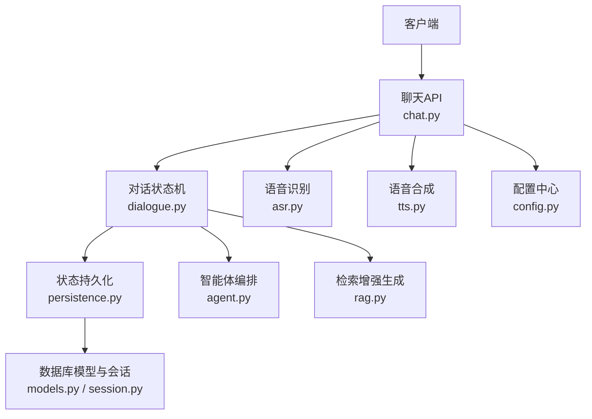
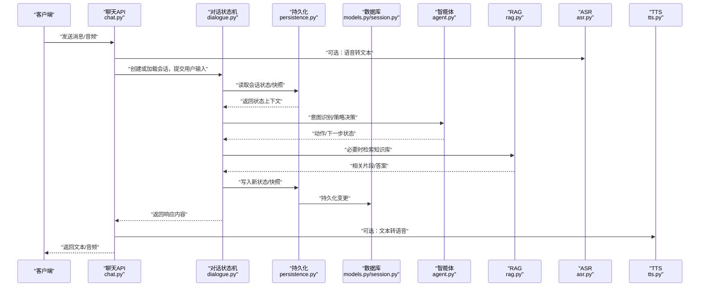
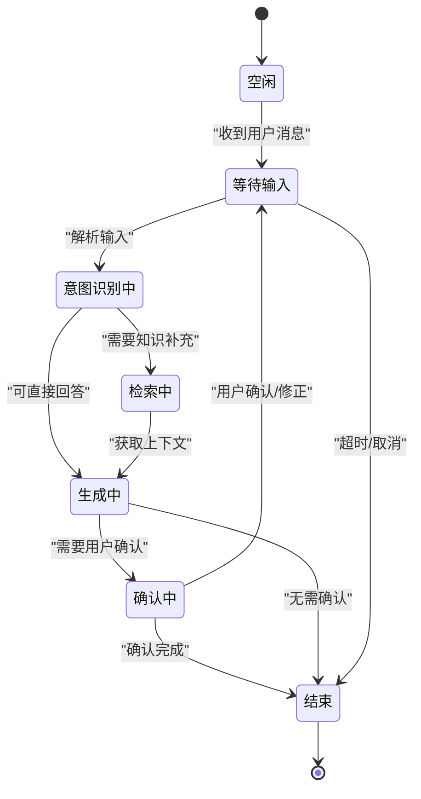
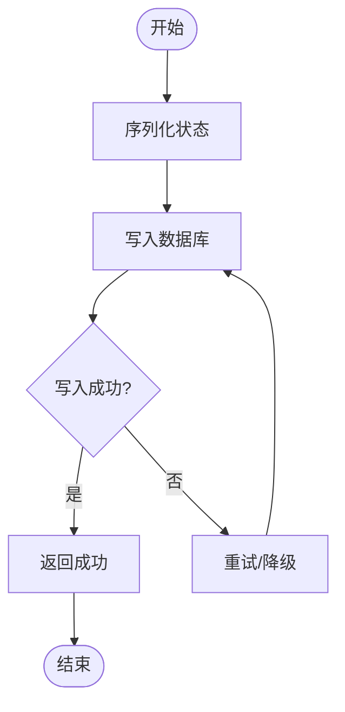
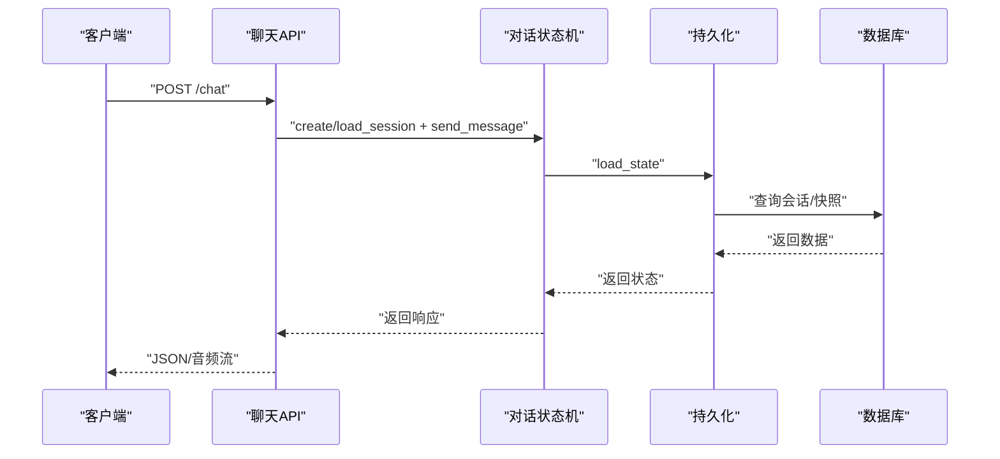
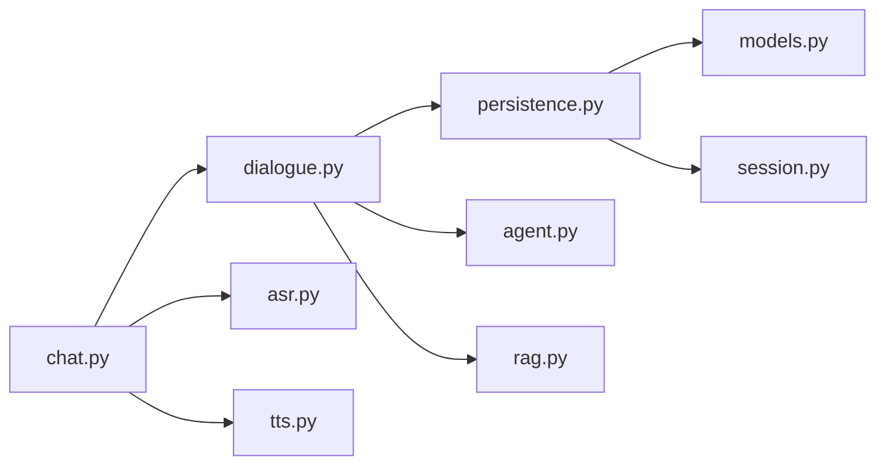

# 对话状态机设计

<cite>
**本文引用的文件**   
- [backend/app/core/dialogue.py](file://backend/app/core/dialogue.py)
- [backend/app/services/persistence.py](file://backend/app/services/persistence.py)
- [backend/app/api/chat.py](file://backend/app/api/chat.py)
- [backend/app/db/models.py](file://backend/app/db/models.py)
- [backend/app/db/session.py](file://backend/app/db/session.py)
- [backend/app/config.py](file://backend/app/config.py)
- [backend/app/core/agent.py](file://backend/app/core/agent.py)
- [backend/app/core/rag.py](file://backend/app/core/rag.py)
- [backend/app/services/asr.py](file://backend/app/services/asr.py)
- [backend/app/services/tts.py](file://backend/app/services/tts.py)
</cite>

## 目录
1. [简介](#简介)
2. [项目结构](#项目结构)
3. [核心组件](#核心组件)
4. [架构总览](#架构总览)
5. [详细组件分析](#详细组件分析)
6. [依赖分析](#依赖分析)
7. [性能考虑](#性能考虑)
8. [故障排查指南](#故障排查指南)
9. [结论](#结论)
10. [附录](#附录)

## 简介
本技术文档围绕“对话状态机”的设计与实现，系统化阐述多轮对话的状态转换模型、状态定义与转移规则；覆盖会话生命周期管理（初始化、更新、终止）、状态持久化与恢复、异常处理流程；并提供配置项、扩展接口与自定义状态开发指南。文档结合后端代码中的对话服务、持久化、数据库模型与API层进行说明，帮助读者快速理解并扩展该状态机。

## 项目结构
本项目采用分层架构：API层暴露HTTP接口，核心业务逻辑位于core与服务层services，数据访问通过db模块完成，配置集中于config。对话状态机主要分布在以下位置：
- 对话状态机与生命周期：backend/app/core/dialogue.py
- 状态持久化：backend/app/services/persistence.py
- 数据库模型与会话存储：backend/app/db/models.py、backend/app/db/session.py
- API入口与路由：backend/app/api/chat.py
- 外部能力集成（ASR/TTS/RAG/Agent）：backend/app/services/asr.py、tts.py、rag.py、agent.py
- 配置项：backend/app/config.py

图表来源
- [backend/app/api/chat.py](file://backend/app/api/chat.py)
- [backend/app/core/dialogue.py](file://backend/app/core/dialogue.py)
- [backend/app/services/persistence.py](file://backend/app/services/persistence.py)
- [backend/app/db/models.py](file://backend/app/db/models.py)
- [backend/app/db/session.py](file://backend/app/db/session.py)
- [backend/app/core/agent.py](file://backend/app/core/agent.py)
- [backend/app/core/rag.py](file://backend/app/core/rag.py)
- [backend/app/services/asr.py](file://backend/app/services/asr.py)
- [backend/app/services/tts.py](file://backend/app/services/tts.py)
- [backend/app/config.py](file://backend/app/config.py)

章节来源
- [backend/app/api/chat.py](file://backend/app/api/chat.py)
- [backend/app/core/dialogue.py](file://backend/app/core/dialogue.py)
- [backend/app/services/persistence.py](file://backend/app/services/persistence.py)
- [backend/app/db/models.py](file://backend/app/db/models.py)
- [backend/app/db/session.py](file://backend/app/db/session.py)
- [backend/app/config.py](file://backend/app/config.py)

## 核心组件
- 对话状态机（Dialogue State Machine）
  - 负责会话生命周期管理、状态定义与转移、上下文维护、事件驱动处理。
  - 关键职责：会话创建/加载、消息入队与处理、状态更新与校验、终止条件判定、错误恢复。
- 状态持久化（Persistence）
  - 提供状态的序列化/反序列化、落库与恢复、增量快照与一致性保障。
- 数据库模型与会话存储（DB Models & Session）
  - 定义会话、消息、状态快照等实体，封装CRUD操作。
- API层（Chat API）
  - 暴露REST接口，协调ASR/TTS、调用状态机、返回结果。
- 外部能力集成（Agent/RAG/ASR/TTS）
  - 为状态机提供意图识别、知识检索、语音输入输出等能力。

章节来源
- [backend/app/core/dialogue.py](file://backend/app/core/dialogue.py)
- [backend/app/services/persistence.py](file://backend/app/services/persistence.py)
- [backend/app/db/models.py](file://backend/app/db/models.py)
- [backend/app/db/session.py](file://backend/app/db/session.py)
- [backend/app/api/chat.py](file://backend/app/api/chat.py)
- [backend/app/core/agent.py](file://backend/app/core/agent.py)
- [backend/app/core/rag.py](file://backend/app/core/rag.py)
- [backend/app/services/asr.py](file://backend/app/services/asr.py)
- [backend/app/services/tts.py](file://backend/app/services/tts.py)

## 架构总览
下图展示从客户端到状态机的完整请求链路，以及状态机在内部如何调度外部能力与持久化。

图表来源
- [backend/app/api/chat.py](file://backend/app/api/chat.py)
- [backend/app/core/dialogue.py](file://backend/app/core/dialogue.py)
- [backend/app/services/persistence.py](file://backend/app/services/persistence.py)
- [backend/app/db/models.py](file://backend/app/db/models.py)
- [backend/app/db/session.py](file://backend/app/db/session.py)
- [backend/app/core/agent.py](file://backend/app/core/agent.py)
- [backend/app/core/rag.py](file://backend/app/core/rag.py)
- [backend/app/services/asr.py](file://backend/app/services/asr.py)
- [backend/app/services/tts.py](file://backend/app/services/tts.py)

## 详细组件分析

### 对话状态机（Dialogue State Machine）
- 状态定义
  - 典型状态包括：空闲、等待输入、意图识别中、检索中、生成中、确认中、结束等。
  - 每个状态包含：进入/退出钩子、可接受的事件集合、转移目标与前置条件。
- 事件与转移
  - 事件类型：用户输入、系统提示、超时、外部回调（ASR/TTS完成）、错误信号。
  - 转移规则：基于当前状态+事件+上下文决定下一状态；支持分支与合并。
- 生命周期管理
  - 初始化：创建会话、加载默认状态、预热必要资源。
  - 运行期：接收事件、执行状态转移、更新上下文、触发副作用（如调用RAG/Agent）。
  - 终止：满足结束条件（任务完成、超时、用户主动结束）后清理资源并落库。
- 上下文与记忆
  - 维护短期上下文（最近N轮）、长期记忆（偏好/历史摘要），用于提升连贯性与个性化。
- 错误与恢复
  - 捕获异常、回滚未提交状态、降级策略（如跳过RAG直接回答）、重试机制。

图表来源
- [backend/app/core/dialogue.py](file://backend/app/core/dialogue.py)

章节来源
- [backend/app/core/dialogue.py](file://backend/app/core/dialogue.py)

### 状态持久化（Persistence）
- 功能要点
  - 序列化：将状态机上下文、快照、元数据序列化为可存储格式。
  - 落库：原子写入会话与快照，保证一致性。
  - 恢复：按会话ID加载最新状态，支持断点续聊。
  - 版本控制：兼容不同状态机版本的迁移策略。
- 一致性策略
  - 使用事务或幂等写入，避免重复/丢失。
  - 增量快照减少IO压力，定期全量备份。
- 失败处理
  - 写失败时记录日志并告警，提供重试与降级路径。

图表来源
- [backend/app/services/persistence.py](file://backend/app/services/persistence.py)
- [backend/app/db/models.py](file://backend/app/db/models.py)
- [backend/app/db/session.py](file://backend/app/db/session.py)

章节来源
- [backend/app/services/persistence.py](file://backend/app/services/persistence.py)
- [backend/app/db/models.py](file://backend/app/db/models.py)
- [backend/app/db/session.py](file://backend/app/db/session.py)

### API层（聊天API）
- 职责
  - 接收客户端请求，参数校验，选择ASR/TTS路径。
  - 调用状态机进行会话处理，返回结构化响应。
- 关键点
  - 会话标识：确保跨请求的会话一致性。
  - 流式响应：对长文本或语音合成场景优化体验。
  - 鉴权与限流：保护后端资源。

图表来源
- [backend/app/api/chat.py](file://backend/app/api/chat.py)
- [backend/app/core/dialogue.py](file://backend/app/core/dialogue.py)
- [backend/app/services/persistence.py](file://backend/app/services/persistence.py)
- [backend/app/db/models.py](file://backend/app/db/models.py)
- [backend/app/db/session.py](file://backend/app/db/session.py)

章节来源
- [backend/app/api/chat.py](file://backend/app/api/chat.py)

### 外部能力集成（Agent/RAG/ASR/TTS）
- 智能体（Agent）
  - 负责意图识别、策略规划、动作编排，为状态机提供决策依据。
- 检索增强生成（RAG）
  - 根据上下文检索相关知识片段，提升回答准确性与时效性。
- 语音识别（ASR）与语音合成（TTS）
  - 提供端到端语音交互能力，状态机需感知其异步回调与错误码。

章节来源
- [backend/app/core/agent.py](file://backend/app/core/agent.py)
- [backend/app/core/rag.py](file://backend/app/core/rag.py)
- [backend/app/services/asr.py](file://backend/app/services/asr.py)
- [backend/app/services/tts.py](file://backend/app/services/tts.py)

## 依赖分析
- 耦合关系
  - API层依赖状态机与持久化；状态机依赖Agent/RAG与持久化；持久化依赖数据库模型与会话封装。
- 潜在循环依赖
  - 应避免状态机与持久化相互强引用，建议通过接口抽象解耦。
- 外部依赖
  - ASR/TTS为可选能力，状态机应支持开关与降级。

图表来源
- [backend/app/api/chat.py](file://backend/app/api/chat.py)
- [backend/app/core/dialogue.py](file://backend/app/core/dialogue.py)
- [backend/app/services/persistence.py](file://backend/app/services/persistence.py)
- [backend/app/db/models.py](file://backend/app/db/models.py)
- [backend/app/db/session.py](file://backend/app/db/session.py)
- [backend/app/core/agent.py](file://backend/app/core/agent.py)
- [backend/app/core/rag.py](file://backend/app/core/rag.py)
- [backend/app/services/asr.py](file://backend/app/services/asr.py)
- [backend/app/services/tts.py](file://backend/app/services/tts.py)

章节来源
- [backend/app/api/chat.py](file://backend/app/api/chat.py)
- [backend/app/core/dialogue.py](file://backend/app/core/dialogue.py)
- [backend/app/services/persistence.py](file://backend/app/services/persistence.py)
- [backend/app/db/models.py](file://backend/app/db/models.py)
- [backend/app/db/session.py](file://backend/app/db/session.py)
- [backend/app/core/agent.py](file://backend/app/core/agent.py)
- [backend/app/core/rag.py](file://backend/app/core/rag.py)
- [backend/app/services/asr.py](file://backend/app/services/asr.py)
- [backend/app/services/tts.py](file://backend/app/services/tts.py)

## 性能考虑
- 状态快照粒度
  - 合理设置快照频率，平衡一致性与IO开销。
- 并发与会话隔离
  - 单会话串行处理，多会话并行；避免全局锁。
- 缓存与预取
  - 热点知识片段缓存，减少RAG延迟。
- 流式传输
  - 对大响应采用流式返回，降低首字节延迟。
- 资源限制
  - 对ASR/TTS与LLM调用设置超时与重试上限，防止雪崩。

[本节为通用指导，不直接分析具体文件]

## 故障排查指南
- 常见问题定位
  - 会话无法恢复：检查持久化写入是否成功、会话ID是否正确、快照版本是否兼容。
  - 状态卡死：查看状态转移日志，确认事件是否到达、转移条件是否满足。
  - 外部服务异常：ASR/TTS/RAG/Agent的错误码与重试策略是否生效。
- 诊断手段
  - 启用详细日志，记录状态变化、事件、外部调用耗时。
  - 监控指标：会话数、平均响应时间、错误率、持久化失败次数。
- 恢复策略
  - 自动重试与退避、降级模式（关闭RAG/ASR）、人工介入与状态修复工具。

章节来源
- [backend/app/services/persistence.py](file://backend/app/services/persistence.py)
- [backend/app/core/dialogue.py](file://backend/app/core/dialogue.py)
- [backend/app/api/chat.py](file://backend/app/api/chat.py)

## 结论
本状态机以事件驱动为核心，结合清晰的状态定义与转移规则，实现了多轮对话的可控与可扩展。通过持久化与恢复机制，保障了会话的连续性与可靠性；借助Agent与RAG，提升了回答质量与个性化水平。建议在后续迭代中完善配置化状态机、可视化调试与更细粒度的监控指标。

[本节为总结，不直接分析具体文件]

## 附录

### 配置选项（示例字段）
- 会话超时：单位秒，超过则自动结束。
- 快照间隔：每N条消息或时间间隔触发一次快照。
- 最大上下文长度：限制短期记忆大小。
- 外部能力开关：ASR/TTS/RAG/Agent启用标志。
- 重试与超时：各外部服务的重试次数与超时阈值。

章节来源
- [backend/app/config.py](file://backend/app/config.py)

### 扩展接口与自定义状态开发指南
- 新增状态
  - 定义状态常量与转移表；实现进入/退出钩子；注册事件处理器。
- 自定义事件
  - 定义事件类型与载荷；在状态机中分发与路由。
- 插件化外部能力
  - 通过适配器接入新的ASR/TTS/RAG/Agent实现；保持统一错误码与超时语义。
- 测试与验证
  - 编写单元测试覆盖关键转移路径；使用回放脚本验证状态机行为。

章节来源
- [backend/app/core/dialogue.py](file://backend/app/core/dialogue.py)
- [backend/app/services/persistence.py](file://backend/app/services/persistence.py)
- [backend/app/core/agent.py](file://backend/app/core/agent.py)
- [backend/app/core/rag.py](file://backend/app/core/rag.py)
- [backend/app/services/asr.py](file://backend/app/services/asr.py)
- [backend/app/services/tts.py](file://backend/app/services/tts.py)