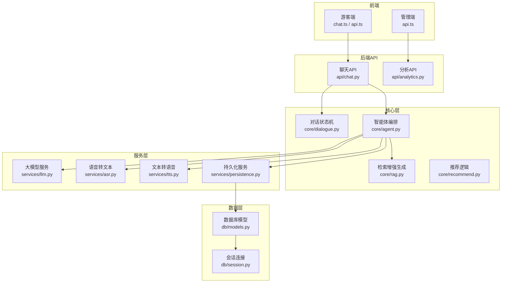
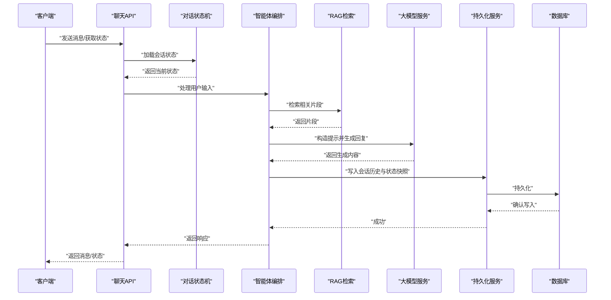
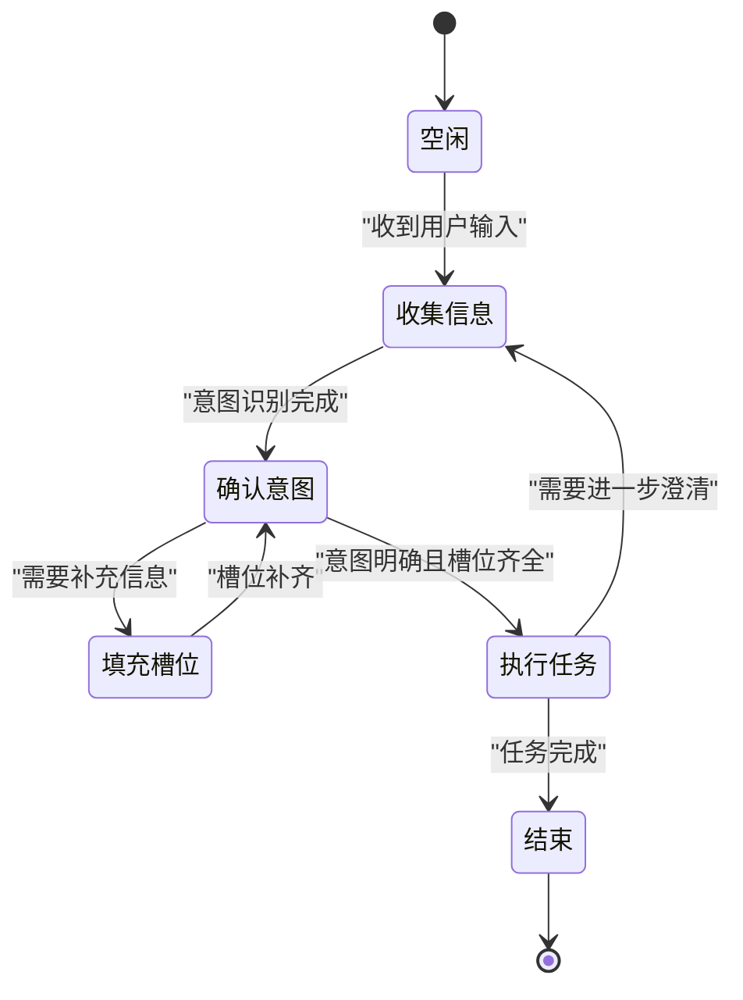
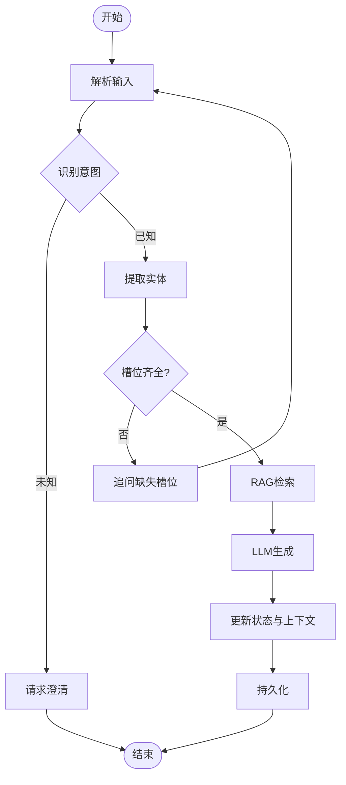
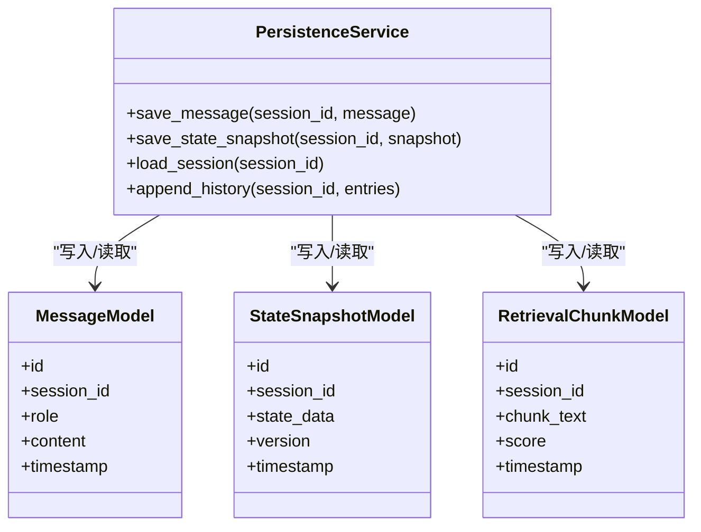
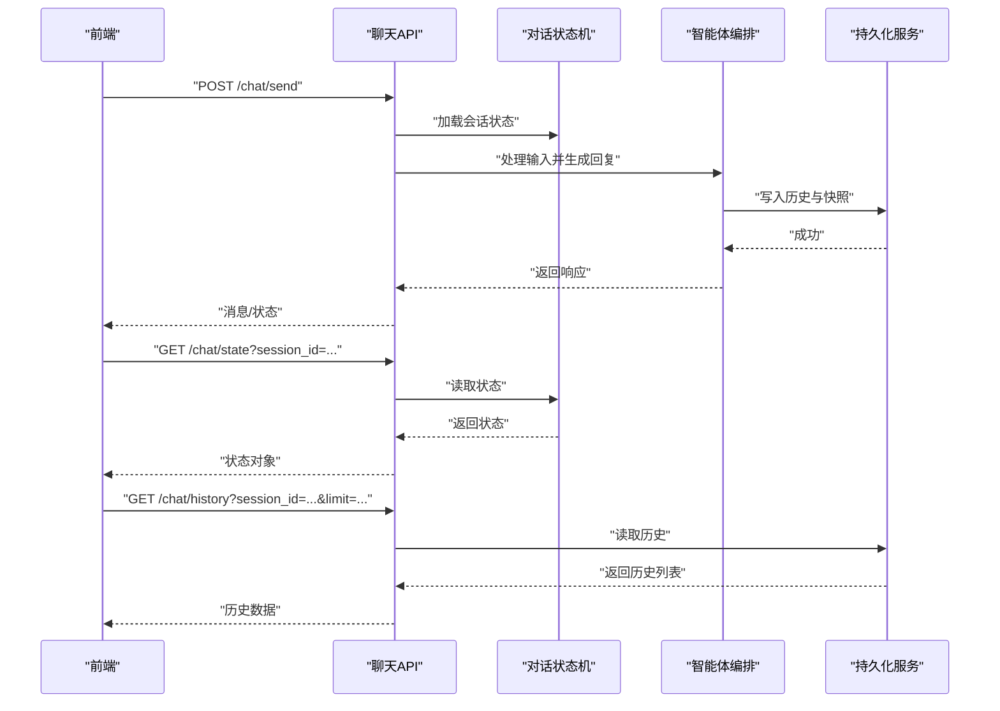
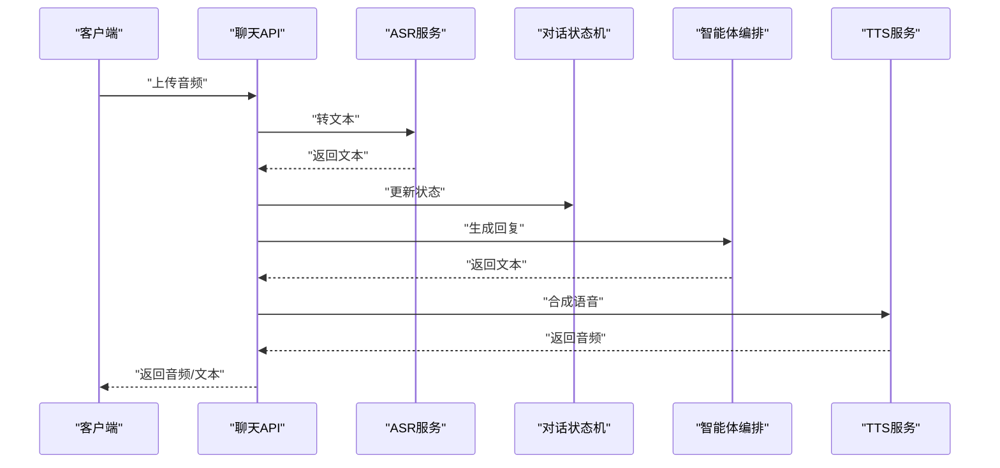
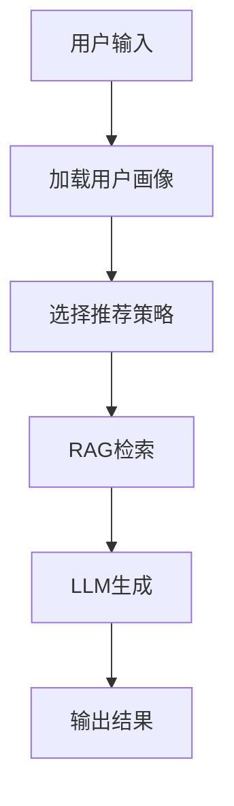
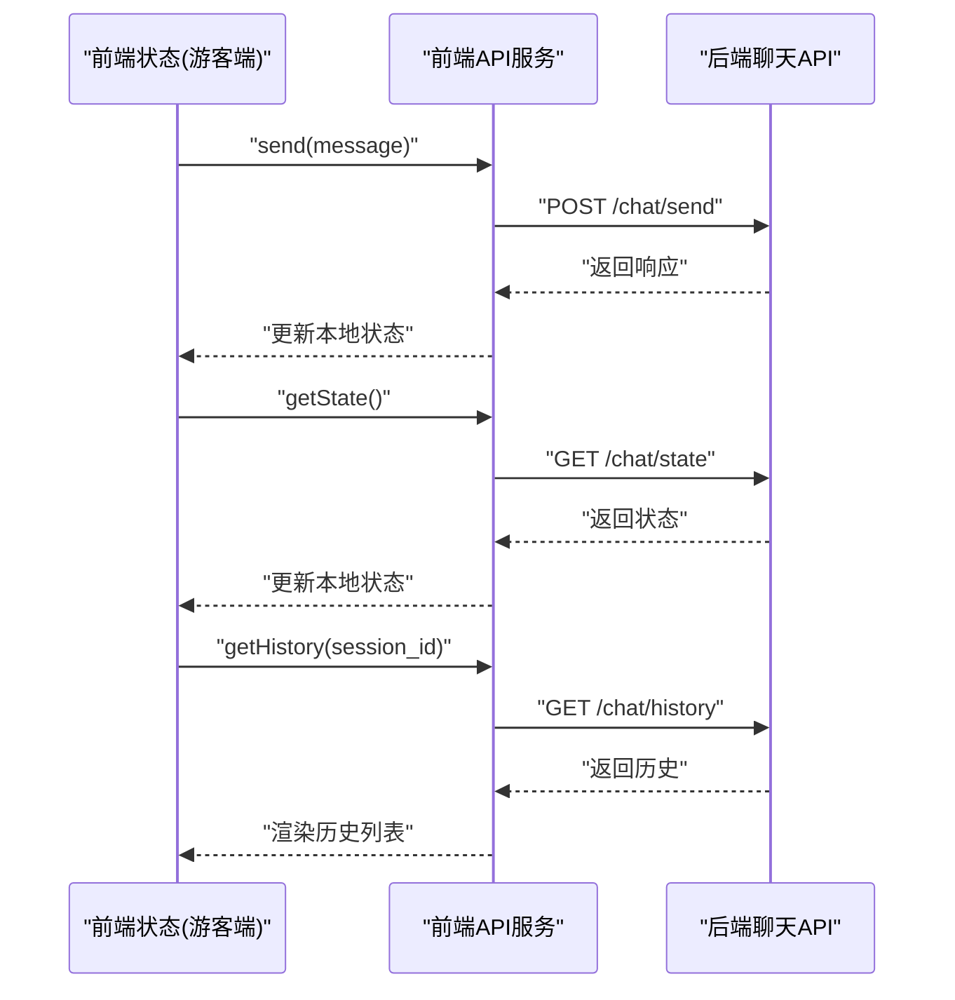
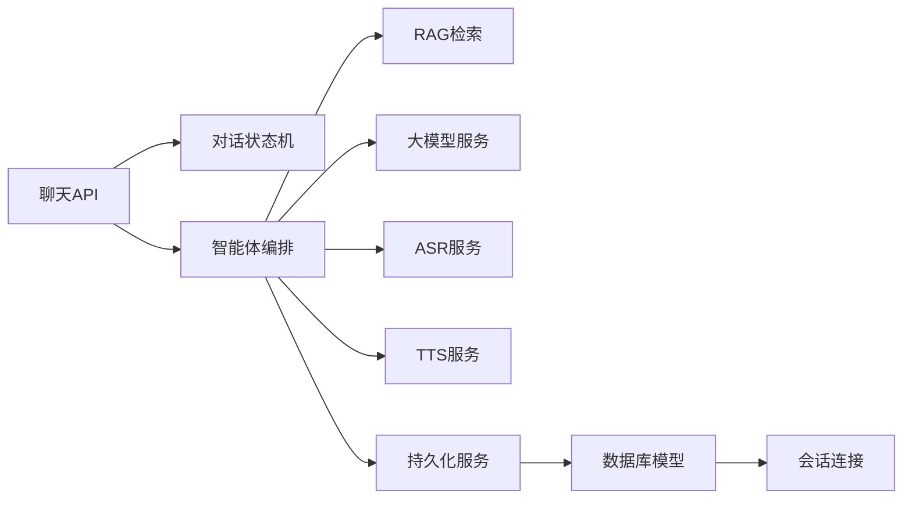

# 对话状态管理

<cite>
**本文引用的文件**   
- [backend/app/main.py](file://backend/app/main.py)
- [backend/app/api/chat.py](file://backend/app/api/chat.py)
- [backend/app/core/dialogue.py](file://backend/app/core/dialogue.py)
- [backend/app/core/agent.py](file://backend/app/core/agent.py)
- [backend/app/services/persistence.py](file://backend/app/services/persistence.py)
- [backend/app/db/models.py](file://backend/app/db/models.py)
- [backend/app/db/session.py](file://backend/app/db/session.py)
- [backend/app/core/rag.py](file://backend/app/core/rag.py)
- [backend/app/services/llm.py](file://backend/app/services/llm.py)
- [backend/app/services/asr.py](file://backend/app/services/asr.py)
- [backend/app/services/tts.py](file://backend/app/services/tts.py)
- [backend/app/core/recommend.py](file://backend/app/core/recommend.py)
- [backend/app/api/analytics.py](file://backend/app/api/analytics.py)
- [frontend/tourist-app/src/stores/chat.ts](file://frontend/tourist-app/src/stores/chat.ts)
- [frontend/tourist-app/src/services/api.ts](file://frontend/tourist-app/src/services/api.ts)
- [frontend/admin-panel/src/services/api.ts](file://frontend/admin-panel/src/services/api.ts)
</cite>

## 目录
1. [简介](#简介)
2. [项目结构](#项目结构)
3. [核心组件](#核心组件)
4. [架构总览](#架构总览)
5. [详细组件分析](#详细组件分析)
6. [依赖关系分析](#依赖关系分析)
7. [性能考虑](#性能考虑)
8. [故障排查指南](#故障排查指南)
9. [结论](#结论)
10. [附录](#附录)

## 简介
本技术文档聚焦于“对话状态管理系统”，围绕多轮对话的状态机设计、上下文窗口管理、会话历史存储策略展开，并覆盖意图识别与实体提取、语义理解模型、对话流控制与分支处理、条件判断机制、会话持久化与数据同步、异常恢复流程。同时提供对话API的完整使用示例（消息发送、状态查询、历史记录），以及对话质量评估指标、性能优化技巧与扩展开发指南。

## 项目结构
后端采用分层架构：API层暴露REST接口，核心层实现对话状态机与业务编排，服务层封装LLM、ASR/TTS、RAG检索增强生成等能力，数据层负责持久化与会话模型定义。前端包含游客端与管理端，分别通过HTTP API与后端交互。

**图表来源**
- [backend/app/api/chat.py](file://backend/app/api/chat.py)
- [backend/app/core/dialogue.py](file://backend/app/core/dialogue.py)
- [backend/app/core/agent.py](file://backend/app/core/agent.py)
- [backend/app/core/rag.py](file://backend/app/core/rag.py)
- [backend/app/services/llm.py](file://backend/app/services/llm.py)
- [backend/app/services/asr.py](file://backend/app/services/asr.py)
- [backend/app/services/tts.py](file://backend/app/services/tts.py)
- [backend/app/services/persistence.py](file://backend/app/services/persistence.py)
- [backend/app/db/models.py](file://backend/app/db/models.py)
- [backend/app/db/session.py](file://backend/app/db/session.py)
- [frontend/tourist-app/src/stores/chat.ts](file://frontend/tourist-app/src/stores/chat.ts)
- [frontend/tourist-app/src/services/api.ts](file://frontend/tourist-app/src/services/api.ts)
- [frontend/admin-panel/src/services/api.ts](file://frontend/admin-panel/src/services/api.ts)

**章节来源**
- [backend/app/main.py](file://backend/app/main.py)
- [backend/app/api/chat.py](file://backend/app/api/chat.py)
- [backend/app/core/dialogue.py](file://backend/app/core/dialogue.py)
- [backend/app/core/agent.py](file://backend/app/core/agent.py)
- [backend/app/services/persistence.py](file://backend/app/services/persistence.py)
- [backend/app/db/models.py](file://backend/app/db/models.py)
- [backend/app/db/session.py](file://backend/app/db/session.py)
- [backend/app/core/rag.py](file://backend/app/core/rag.py)
- [backend/app/services/llm.py](file://backend/app/services/llm.py)
- [backend/app/services/asr.py](file://backend/app/services/asr.py)
- [backend/app/services/tts.py](file://backend/app/services/tts.py)
- [backend/app/core/recommend.py](file://backend/app/core/recommend.py)
- [backend/app/api/analytics.py](file://backend/app/api/analytics.py)
- [frontend/tourist-app/src/stores/chat.ts](file://frontend/tourist-app/src/stores/chat.ts)
- [frontend/tourist-app/src/services/api.ts](file://frontend/tourist-app/src/services/api.ts)
- [frontend/admin-panel/src/services/api.ts](file://frontend/admin-panel/src/services/api.ts)

## 核心组件
- 对话状态机：维护会话上下文、槽位、当前状态与转移规则，支持多轮对话推进与回溯。
- 智能体编排：协调意图识别、实体抽取、RAG检索、LLM生成、推荐与记忆写入。
- 持久化服务：统一会话历史、状态快照与中间结果的落盘与读取，保证可恢复性。
- 数据模型：定义会话、消息、状态快照、检索片段等表结构与约束。
- 前端状态与API：游客端维护本地聊天状态，调用后端API完成消息收发与状态查询；管理端用于分析与配置。

**章节来源**
- [backend/app/core/dialogue.py](file://backend/app/core/dialogue.py)
- [backend/app/core/agent.py](file://backend/app/core/agent.py)
- [backend/app/services/persistence.py](file://backend/app/services/persistence.py)
- [backend/app/db/models.py](file://backend/app/db/models.py)
- [frontend/tourist-app/src/stores/chat.ts](file://frontend/tourist-app/src/stores/chat.ts)
- [frontend/tourist-app/src/services/api.ts](file://frontend/tourist-app/src/services/api.ts)

## 架构总览
系统以“请求进入—状态更新—决策编排—外部服务—结果返回—持久化”为主线。对话状态机作为中枢，驱动意图识别与实体抽取，结合RAG与LLM进行语义理解与回答生成，最终将结果写回持久化层并返回给前端。

**图表来源**
- [backend/app/api/chat.py](file://backend/app/api/chat.py)
- [backend/app/core/dialogue.py](file://backend/app/core/dialogue.py)
- [backend/app/core/agent.py](file://backend/app/core/agent.py)
- [backend/app/core/rag.py](file://backend/app/core/rag.py)
- [backend/app/services/llm.py](file://backend/app/services/llm.py)
- [backend/app/services/persistence.py](file://backend/app/services/persistence.py)
- [backend/app/db/models.py](file://backend/app/db/models.py)
- [backend/app/db/session.py](file://backend/app/db/session.py)

## 详细组件分析

### 对话状态机（多轮对话状态机）
- 职责：维护会话ID、上下文窗口、槽位集合、当前状态、转移规则与边界条件。
- 上下文窗口管理：按时间或长度限制裁剪历史，保留关键信息（如最近N条消息、关键槽位）。
- 状态转移：基于意图与实体触发状态迁移，支持条件分支与回退。
- 错误处理：对非法输入、缺失槽位、超时等进行拦截与提示。

**图表来源**
- [backend/app/core/dialogue.py](file://backend/app/core/dialogue.py)

**章节来源**
- [backend/app/core/dialogue.py](file://backend/app/core/dialogue.py)

### 智能体编排（意图识别、实体提取、语义理解）
- 意图识别：从用户输入中判定目标意图（如查询景点、规划路线、评价反馈）。
- 实体提取：抽取关键实体（地点、时间、偏好、数量等），注入到状态机的槽位。
- 语义理解：结合RAG检索到的知识片段与大模型生成，提升回答准确性与连贯性。
- 分支处理：根据条件（槽位是否齐全、用户偏好、知识库匹配度）决定下一步动作。

**图表来源**
- [backend/app/core/agent.py](file://backend/app/core/agent.py)
- [backend/app/core/rag.py](file://backend/app/core/rag.py)
- [backend/app/services/llm.py](file://backend/app/services/llm.py)
- [backend/app/core/dialogue.py](file://backend/app/core/dialogue.py)

**章节来源**
- [backend/app/core/agent.py](file://backend/app/core/agent.py)
- [backend/app/core/rag.py](file://backend/app/core/rag.py)
- [backend/app/services/llm.py](file://backend/app/services/llm.py)
- [backend/app/core/dialogue.py](file://backend/app/core/dialogue.py)

### 持久化与数据同步
- 会话历史：每条消息、状态快照、检索片段与生成结果均持久化，便于回放与审计。
- 数据同步：读写分离与事务保障，确保状态一致性与幂等性。
- 异常恢复：失败重试、断点续传、补偿写入与回滚策略。

**图表来源**
- [backend/app/services/persistence.py](file://backend/app/services/persistence.py)
- [backend/app/db/models.py](file://backend/app/db/models.py)
- [backend/app/db/session.py](file://backend/app/db/session.py)

**章节来源**
- [backend/app/services/persistence.py](file://backend/app/services/persistence.py)
- [backend/app/db/models.py](file://backend/app/db/models.py)
- [backend/app/db/session.py](file://backend/app/db/session.py)

### 对话API接口
- 消息发送：提交用户输入，返回系统回复与状态变更。
- 状态查询：获取当前会话状态、上下文窗口与槽位信息。
- 历史记录：拉取指定会话的历史消息与状态快照。

**图表来源**
- [backend/app/api/chat.py](file://backend/app/api/chat.py)
- [backend/app/core/dialogue.py](file://backend/app/core/dialogue.py)
- [backend/app/core/agent.py](file://backend/app/core/agent.py)
- [backend/app/services/persistence.py](file://backend/app/services/persistence.py)

**章节来源**
- [backend/app/api/chat.py](file://backend/app/api/chat.py)
- [backend/app/core/dialogue.py](file://backend/app/core/dialogue.py)
- [backend/app/core/agent.py](file://backend/app/core/agent.py)
- [backend/app/services/persistence.py](file://backend/app/services/persistence.py)

### 语音与多媒体集成（可选）
- ASR：将语音输入转为文本，接入对话流程。
- TTS：将文本回复转为语音输出，增强交互体验。
- 数字人：结合图像或VR形象展示，提升沉浸感。

**图表来源**
- [backend/app/services/asr.py](file://backend/app/services/asr.py)
- [backend/app/services/tts.py](file://backend/app/services/tts.py)
- [backend/app/api/chat.py](file://backend/app/api/chat.py)
- [backend/app/core/dialogue.py](file://backend/app/core/dialogue.py)
- [backend/app/core/agent.py](file://backend/app/core/agent.py)

**章节来源**
- [backend/app/services/asr.py](file://backend/app/services/asr.py)
- [backend/app/services/tts.py](file://backend/app/services/tts.py)
- [backend/app/api/chat.py](file://backend/app/api/chat.py)
- [backend/app/core/dialogue.py](file://backend/app/core/dialogue.py)
- [backend/app/core/agent.py](file://backend/app/core/agent.py)

### 推荐与个性化（可选）
- 基于用户偏好与历史行为，动态调整推荐内容与对话策略。
- 与RAG结合，优先检索与用户兴趣相关的知识片段。

**图表来源**
- [backend/app/core/recommend.py](file://backend/app/core/recommend.py)
- [backend/app/core/rag.py](file://backend/app/core/rag.py)
- [backend/app/services/llm.py](file://backend/app/services/llm.py)

**章节来源**
- [backend/app/core/recommend.py](file://backend/app/core/recommend.py)
- [backend/app/core/rag.py](file://backend/app/core/rag.py)
- [backend/app/services/llm.py](file://backend/app/services/llm.py)

### 前端状态与API调用
- 游客端：维护本地聊天状态，调用后端API完成消息发送、状态查询与历史记录拉取。
- 管理端：访问分析接口，查看对话质量与性能指标。

**图表来源**
- [frontend/tourist-app/src/stores/chat.ts](file://frontend/tourist-app/src/stores/chat.ts)
- [frontend/tourist-app/src/services/api.ts](file://frontend/tourist-app/src/services/api.ts)
- [backend/app/api/chat.py](file://backend/app/api/chat.py)

**章节来源**
- [frontend/tourist-app/src/stores/chat.ts](file://frontend/tourist-app/src/stores/chat.ts)
- [frontend/tourist-app/src/services/api.ts](file://frontend/tourist-app/src/services/api.ts)
- [backend/app/api/chat.py](file://backend/app/api/chat.py)

## 依赖关系分析
- 低耦合高内聚：API层仅负责路由与参数校验，核心逻辑下沉至状态机与智能体编排。
- 服务解耦：LLM、ASR、TTS、RAG、持久化均为独立服务，便于替换与扩展。
- 数据一致性：通过持久化服务与数据库模型保证会话状态与历史的强一致性。

**图表来源**
- [backend/app/api/chat.py](file://backend/app/api/chat.py)
- [backend/app/core/dialogue.py](file://backend/app/core/dialogue.py)
- [backend/app/core/agent.py](file://backend/app/core/agent.py)
- [backend/app/core/rag.py](file://backend/app/core/rag.py)
- [backend/app/services/llm.py](file://backend/app/services/llm.py)
- [backend/app/services/asr.py](file://backend/app/services/asr.py)
- [backend/app/services/tts.py](file://backend/app/services/tts.py)
- [backend/app/services/persistence.py](file://backend/app/services/persistence.py)
- [backend/app/db/models.py](file://backend/app/db/models.py)
- [backend/app/db/session.py](file://backend/app/db/session.py)

**章节来源**
- [backend/app/api/chat.py](file://backend/app/api/chat.py)
- [backend/app/core/dialogue.py](file://backend/app/core/dialogue.py)
- [backend/app/core/agent.py](file://backend/app/core/agent.py)
- [backend/app/core/rag.py](file://backend/app/core/rag.py)
- [backend/app/services/llm.py](file://backend/app/services/llm.py)
- [backend/app/services/asr.py](file://backend/app/services/asr.py)
- [backend/app/services/tts.py](file://backend/app/services/tts.py)
- [backend/app/services/persistence.py](file://backend/app/services/persistence.py)
- [backend/app/db/models.py](file://backend/app/db/models.py)
- [backend/app/db/session.py](file://backend/app/db/session.py)

## 性能考虑
- 上下文窗口裁剪：按时间或长度限制历史，减少LLM输入规模，降低延迟与成本。
- 并发与缓存：热点问答结果缓存，减少重复计算；异步处理长耗时操作（如ASR/TTS）。
- 批处理与分页：历史记录拉取采用分页与增量同步，避免一次性加载大量数据。
- 资源隔离：为不同服务设置超时与熔断策略，防止级联故障。

[本节为通用指导，不直接分析具体文件]

## 故障排查指南
- 常见问题：
  - 会话状态不一致：检查持久化写入顺序与事务边界。
  - 意图识别失败：核对槽位完整性与提示词模板。
  - 生成质量差：优化RAG检索片段与LLM提示词。
  - 语音链路异常：验证ASR/TTS服务可用性与网络连通性。
- 诊断手段：
  - 启用详细日志，记录状态转移、检索片段与生成过程。
  - 使用分析接口查看对话质量与性能指标。
  - 回放历史消息与状态快照定位问题根因。

**章节来源**
- [backend/app/api/analytics.py](file://backend/app/api/analytics.py)
- [backend/app/services/persistence.py](file://backend/app/services/persistence.py)
- [backend/app/core/dialogue.py](file://backend/app/core/dialogue.py)
- [backend/app/core/agent.py](file://backend/app/core/agent.py)

## 结论
本系统通过清晰的分层架构与模块化设计，实现了稳健的多轮对话状态管理。状态机驱动意图识别与实体抽取，结合RAG与LLM提升语义理解与回答质量；持久化服务确保会话可恢复与可审计。前端通过简洁API完成消息收发与状态管理，整体具备良好的可扩展性与可维护性。

[本节为总结性内容，不直接分析具体文件]

## 附录

### 对话API使用示例（路径参考）
- 消息发送
  - 前端调用路径：[frontend/tourist-app/src/stores/chat.ts](file://frontend/tourist-app/src/stores/chat.ts)
  - 前端API封装：[frontend/tourist-app/src/services/api.ts](file://frontend/tourist-app/src/services/api.ts)
  - 后端接口：[backend/app/api/chat.py](file://backend/app/api/chat.py)
- 状态查询
  - 前端调用路径：[frontend/tourist-app/src/stores/chat.ts](file://frontend/tourist-app/src/stores/chat.ts)
  - 前端API封装：[frontend/tourist-app/src/services/api.ts](file://frontend/tourist-app/src/services/api.ts)
  - 后端接口：[backend/app/api/chat.py](file://backend/app/api/chat.py)
- 历史记录
  - 前端调用路径：[frontend/tourist-app/src/stores/chat.ts](file://frontend/tourist-app/src/stores/chat.ts)
  - 前端API封装：[frontend/tourist-app/src/services/api.ts](file://frontend/tourist-app/src/services/api.ts)
  - 后端接口：[backend/app/api/chat.py](file://backend/app/api/chat.py)

**章节来源**
- [frontend/tourist-app/src/stores/chat.ts](file://frontend/tourist-app/src/stores/chat.ts)
- [frontend/tourist-app/src/services/api.ts](file://frontend/tourist-app/src/services/api.ts)
- [backend/app/api/chat.py](file://backend/app/api/chat.py)

### 对话质量评估指标
- 相关性：回答与用户意图的相关程度。
- 准确性：事实正确性与知识引用准确度。
- 流畅性：语言自然度与连贯性。
- 满意度：用户主观评分与复访率。
- 性能指标：首字延迟、端到端延迟、吞吐与资源占用。

[本节为通用指导，不直接分析具体文件]

### 扩展开发指南
- 新增意图与槽位：在状态机中定义新状态与转移规则，在智能体编排中注册识别与抽取逻辑。
- 替换或升级模型：在服务层更换LLM/ASR/TTS实现，保持接口契约不变。
- 增强RAG检索：优化索引策略与检索算法，提升召回与排序质量。
- 增加监控与分析：接入分析接口，采集关键指标并可视化。

[本节为通用指导，不直接分析具体文件]