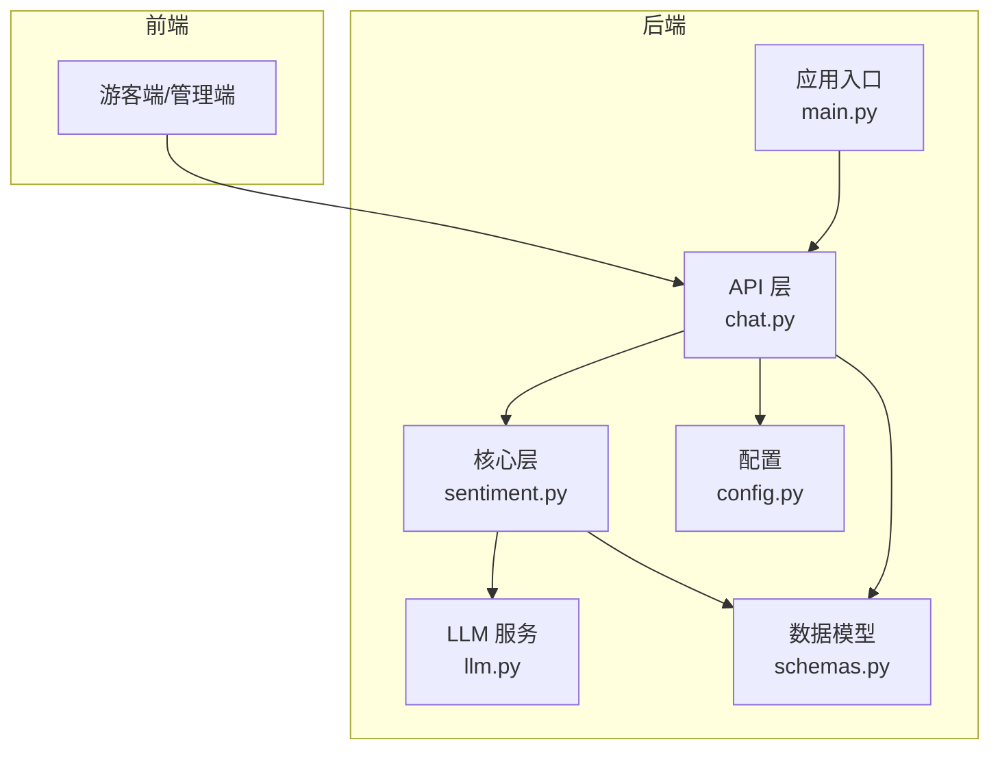
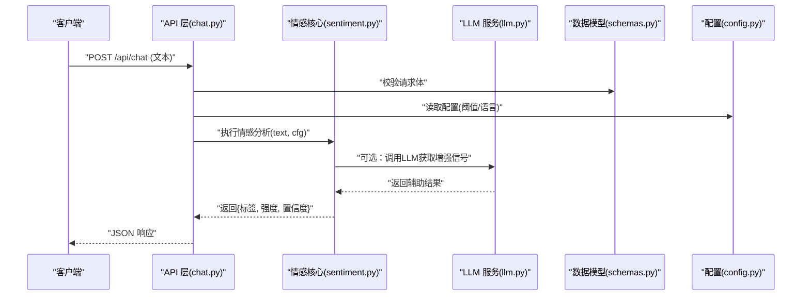
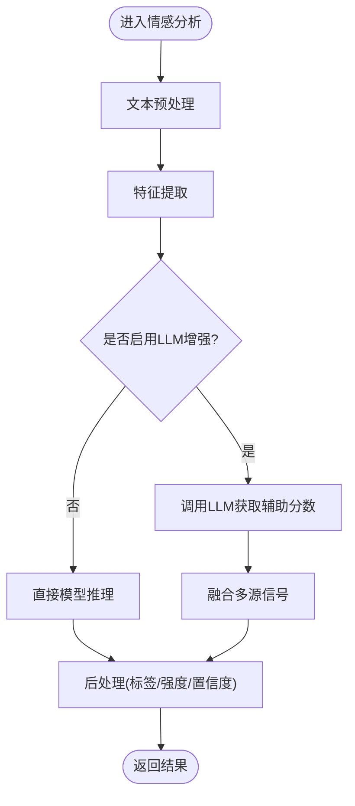
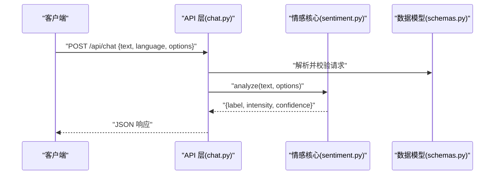
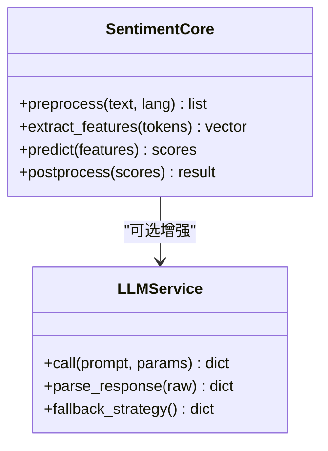
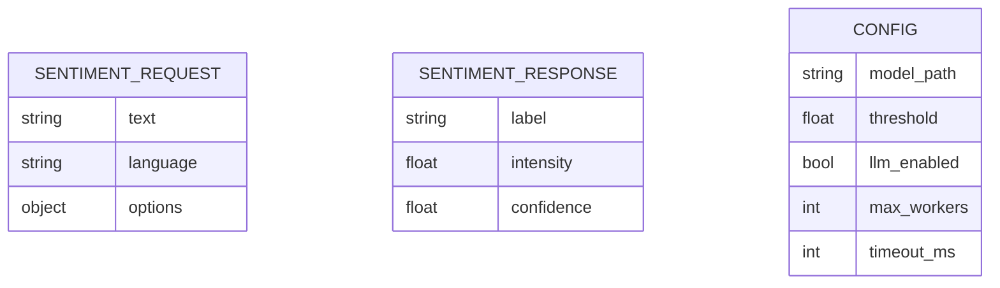
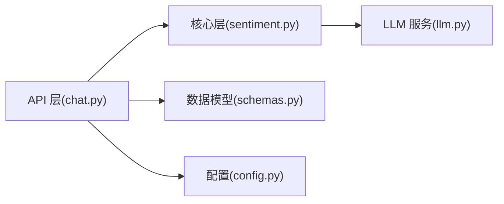

# 情感分析引擎

<cite>
**本文引用的文件**   
- [backend/app/core/sentiment.py](file://backend/app/core/sentiment.py)
- [backend/app/api/chat.py](file://backend/app/api/chat.py)
- [backend/app/services/llm.py](file://backend/app/services/llm.py)
- [backend/app/models/schemas.py](file://backend/app/models/schemas.py)
- [backend/app/config.py](file://backend/app/config.py)
- [backend/app/main.py](file://backend/app/main.py)
- [backend/tests/test_api.py](file://backend/tests/test_api.py)
</cite>

## 目录
1. [简介](#简介)
2. [项目结构](#项目结构)
3. [核心组件](#核心组件)
4. [架构总览](#架构总览)
5. [详细组件分析](#详细组件分析)
6. [依赖关系分析](#依赖关系分析)
7. [性能考虑](#性能考虑)
8. [故障排查指南](#故障排查指南)
9. [结论](#结论)
10. [附录](#附录)

## 简介
本技术文档围绕“情感分析引擎”展开，聚焦于以下目标：
- 解释情感分类模型的架构设计与推理流程
- 说明训练数据与标注规范（概念性指导）
- 详述情绪检测算法、情感强度量化与置信度计算方法（概念性设计）
- 提供多语言支持、领域适配与个性化调优策略（方法论）
- 阐述特征提取、文本预处理与模型推理优化（工程实践）
- 给出情感分析API的使用示例（输入、输出与可视化思路）
- 建立模型版本管理、性能监控与持续改进的工作流（运维与MLOps）

## 项目结构
后端采用分层架构：API层暴露REST接口，服务层封装业务逻辑，核心层实现具体算法能力（如情感分析），配置与模型定义位于独立模块。前端通过HTTP调用后端API进行交互。

图表来源
- [backend/app/api/chat.py](file://backend/app/api/chat.py)
- [backend/app/core/sentiment.py](file://backend/app/core/sentiment.py)
- [backend/app/services/llm.py](file://backend/app/services/llm.py)
- [backend/app/models/schemas.py](file://backend/app/models/schemas.py)
- [backend/app/config.py](file://backend/app/config.py)
- [backend/app/main.py](file://backend/app/main.py)

章节来源
- [backend/app/main.py](file://backend/app/main.py)
- [backend/app/api/chat.py](file://backend/app/api/chat.py)
- [backend/app/core/sentiment.py](file://backend/app/core/sentiment.py)
- [backend/app/services/llm.py](file://backend/app/services/llm.py)
- [backend/app/models/schemas.py](file://backend/app/models/schemas.py)
- [backend/app/config.py](file://backend/app/config.py)

## 核心组件
- 情感分析核心（Core/Sentiment）
  - 负责文本预处理、特征抽取、模型推理、结果后处理（标签映射、强度计算、置信度聚合）。
  - 可集成外部LLM或本地模型，统一抽象为“情感推断器”。
- API 层（API/Chat）
  - 暴露REST接口，接收文本输入，返回情感标签、强度与置信度等结构化结果。
- 模型与配置（Models/Config）
  - 定义请求/响应Schema与全局配置项（如模型路径、阈值、语言开关）。
- LLM 服务（Services/LLM）
  - 封装大模型调用，用于零样本/少样本情感分析或增强推理。

章节来源
- [backend/app/core/sentiment.py](file://backend/app/core/sentiment.py)
- [backend/app/api/chat.py](file://backend/app/api/chat.py)
- [backend/app/models/schemas.py](file://backend/app/models/schemas.py)
- [backend/app/services/llm.py](file://backend/app/services/llm.py)
- [backend/app/config.py](file://backend/app/config.py)

## 架构总览
整体采用“API -> 核心 -> 服务/模型”的分层调用链，结合配置与Schema约束，保证可扩展性与可观测性。

图表来源
- [backend/app/api/chat.py](file://backend/app/api/chat.py)
- [backend/app/core/sentiment.py](file://backend/app/core/sentiment.py)
- [backend/app/services/llm.py](file://backend/app/services/llm.py)
- [backend/app/models/schemas.py](file://backend/app/models/schemas.py)
- [backend/app/config.py](file://backend/app/config.py)

## 详细组件分析

### 情感分析核心（Core/Sentiment）
职责与流程
- 文本预处理：清洗、分词、去停用词、规范化（大小写、全半角、标点）、多语言切分。
- 特征提取：基于词典/规则的特征（极性词、程度副词、否定词）、上下文窗口统计；可选嵌入向量（若接入Embedding服务）。
- 模型推理：轻量分类器或LLM零样本提示；融合多源信号（词典+模型）。
- 结果后处理：标签映射、强度归一化、置信度聚合（如加权平均或贝叶斯平滑）。

关键方法（示意）
- preprocess(text, lang): 文本清洗与标准化
- extract_features(text, tokens): 构建特征向量
- predict(features, model): 分类与概率输出
- postprocess(scores, labels): 生成最终标签、强度与置信度

图表来源
- [backend/app/core/sentiment.py](file://backend/app/core/sentiment.py)

章节来源
- [backend/app/core/sentiment.py](file://backend/app/core/sentiment.py)

### API 层（API/Chat）
职责与流程
- 接收并校验请求体（文本、语言、参数）。
- 调用情感核心，组装响应（包含标签、强度、置信度）。
- 错误处理与日志记录。

图表来源
- [backend/app/api/chat.py](file://backend/app/api/chat.py)
- [backend/app/models/schemas.py](file://backend/app/models/schemas.py)
- [backend/app/core/sentiment.py](file://backend/app/core/sentiment.py)

章节来源
- [backend/app/api/chat.py](file://backend/app/api/chat.py)
- [backend/app/models/schemas.py](file://backend/app/models/schemas.py)

### LLM 服务（Services/LLM）
职责与流程
- 封装对外部大模型的调用（如零样本情感判断、提示词模板）。
- 将LLM输出转换为结构化分数，供核心层融合。

图表来源
- [backend/app/services/llm.py](file://backend/app/services/llm.py)
- [backend/app/core/sentiment.py](file://backend/app/core/sentiment.py)

章节来源
- [backend/app/services/llm.py](file://backend/app/services/llm.py)
- [backend/app/core/sentiment.py](file://backend/app/core/sentiment.py)

### 数据模型与配置（Models/Config）
- 数据模型：定义请求/响应字段（文本、语言、选项、标签、强度、置信度）。
- 配置：模型路径、阈值、语言开关、并发限制、超时等。

图表来源
- [backend/app/models/schemas.py](file://backend/app/models/schemas.py)
- [backend/app/config.py](file://backend/app/config.py)

章节来源
- [backend/app/models/schemas.py](file://backend/app/models/schemas.py)
- [backend/app/config.py](file://backend/app/config.py)

### 应用入口（Main）
- 启动Web服务，挂载路由，加载配置，初始化核心与服务。

章节来源
- [backend/app/main.py](file://backend/app/main.py)

## 依赖关系分析
- 耦合关系
  - API 层依赖核心层与数据模型，间接依赖配置。
  - 核心层可选依赖LLM服务，保持松耦合。
- 外部依赖
  - 外部LLM服务（网络调用）
  - 可能的本地模型库（若使用）

图表来源
- [backend/app/api/chat.py](file://backend/app/api/chat.py)
- [backend/app/core/sentiment.py](file://backend/app/core/sentiment.py)
- [backend/app/services/llm.py](file://backend/app/services/llm.py)
- [backend/app/models/schemas.py](file://backend/app/models/schemas.py)
- [backend/app/config.py](file://backend/app/config.py)

章节来源
- [backend/app/api/chat.py](file://backend/app/api/chat.py)
- [backend/app/core/sentiment.py](file://backend/app/core/sentiment.py)
- [backend/app/services/llm.py](file://backend/app/services/llm.py)
- [backend/app/models/schemas.py](file://backend/app/models/schemas.py)
- [backend/app/config.py](file://backend/app/config.py)

## 性能考虑
- 批处理与缓存
  - 对相似文本进行指纹哈希，命中则直接返回缓存结果。
  - 批量推理减少模型加载与I/O开销。
- 并发与限流
  - 控制并发数与队列长度，避免OOM与雪崩。
- 模型选择与量化
  - 优先使用轻量模型或蒸馏模型；必要时开启INT8/FP16推理。
- 异步与流水线
  - 预处理与推理并行；LLM增强走异步通道，失败回退到本地模型。
- 监控与告警
  - 记录P95/P99延迟、吞吐、错误率；异常阈值触发告警。

[本节为通用性能建议，不直接分析具体文件]

## 故障排查指南
常见问题与定位步骤
- 请求校验失败
  - 检查请求体字段是否符合Schema定义。
  - 参考测试用例验证最小可用请求。
- 模型加载失败
  - 核对配置中的模型路径与权限。
  - 查看启动日志中初始化阶段报错。
- LLM调用超时/失败
  - 检查网络连通性与鉴权配置。
  - 确认降级策略已生效（回退至本地模型）。
- 结果异常
  - 调整阈值与置信度过滤策略。
  - 增加日志粒度，追踪特征与中间分数。

章节来源
- [backend/tests/test_api.py](file://backend/tests/test_api.py)
- [backend/app/models/schemas.py](file://backend/app/models/schemas.py)
- [backend/app/config.py](file://backend/app/config.py)

## 结论
本情感分析引擎以分层架构为核心，结合可插拔的LLM增强与严格的Schema/配置管理，实现了高内聚、低耦合的情感分析能力。通过完善的预处理、特征工程与后处理流程，系统可在多语言与不同领域场景下稳定运行，并提供强度与置信度指标支撑上层决策与可视化展示。配合版本管理与监控体系，可实现持续改进与快速迭代。

[本节为总结性内容，不直接分析具体文件]

## 附录

### 训练数据与标注规范（概念性指导）
- 数据来源
  - 用户对话、评论、客服工单、社交媒体帖子等。
- 标注维度
  - 情感标签：正面/中性/负面（可扩展为细粒度情绪类别）。
  - 强度等级：连续值或离散等级（如1-5）。
  - 置信度：标注者一致性或交叉验证得分。
- 标注规范
  - 明确歧义句处理原则（如反讽、条件句）。
  - 制定跨语言对齐策略（翻译一致性、文化差异）。
- 质量控制
  - 多人标注与仲裁机制；定期抽检与校准。
  - 数据版本化管理，保留标注元数据与变更日志。

[本节为概念性指导，不直接分析具体文件]

### 情绪检测算法与量化（概念性设计）
- 算法组合
  - 词典法：极性词、程度副词、否定词、感叹号权重。
  - 机器学习/深度学习：序列模型或Transformer编码器。
  - LLM零样本/少样本：提示词模板与Few-shot示例。
- 强度量化
  - 基于概率分布的期望值或加权评分。
  - 引入上下文窗口与相邻句子的影响因子。
- 置信度计算
  - 模型自身概率（softmax最大值或熵）。
  - 多源融合的不确定性估计（如BMA或MC Dropout）。

[本节为概念性设计，不直接分析具体文件]

### 多语言支持与领域适配（方法论）
- 多语言
  - 语言识别与分词器切换；同义词/停用词表按语言维护。
  - 跨语言迁移学习或共享表示空间。
- 领域适配
  - 领域词典扩展与微调语料注入。
  - Prompt模板针对行业术语优化。
- 个性化调优
  - 用户画像与历史偏好反馈闭环。
  - A/B测试评估不同策略的效果差异。

[本节为方法论，不直接分析具体文件]

### 文本预处理与特征提取（工程实践）
- 预处理
  - 清洗HTML/Markdown、去除噪声字符、统一编码。
  - 分词与子词切分（NLP库或LLM tokenizer）。
- 特征
  - 传统特征：词频、TF-IDF、n-gram、情感词典匹配。
  - 语义特征：句子/段落级嵌入向量。
- 优化
  - 增量更新词典与索引；向量化缓存。

[本节为工程实践，不直接分析具体文件]

### 模型推理优化（工程实践）
- 批处理与动态批
  - 根据负载自适应合并请求。
- 模型加速
  - 量化、图优化、算子融合。
- 服务化
  - 进程池/线程池、连接池、超时与重试。

[本节为工程实践，不直接分析具体文件]

### 情感分析API使用示例（端到端流程）
- 请求
  - 方法：POST
  - 路径：/api/chat
  - 请求体字段：文本、语言、选项（如是否启用LLM增强）
- 响应
  - 字段：情感标签、强度、置信度
- 前端可视化
  - 仪表盘展示情感分布、趋势与热力图
  - 交互式筛选（时间、渠道、主题）

章节来源
- [backend/app/api/chat.py](file://backend/app/api/chat.py)
- [backend/app/models/schemas.py](file://backend/app/models/schemas.py)

### 模型版本管理、性能监控与持续改进（工作流）
- 版本管理
  - 模型与配置Git化，发布打标签；灰度发布与回滚策略。
- 性能监控
  - 指标：QPS、延迟分位、错误率、资源占用。
  - 日志：请求ID、耗时分解、关键中间状态。
- 持续改进
  - 在线反馈收集与主动采样难例。
  - 定期重训与回归测试；A/B实验驱动优化。

[本节为工作流建议，不直接分析具体文件]