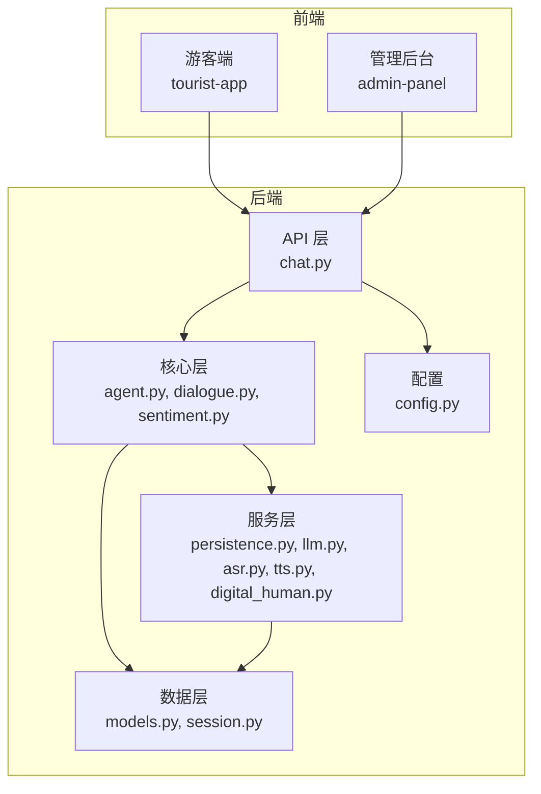
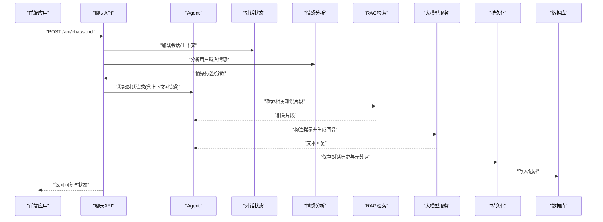
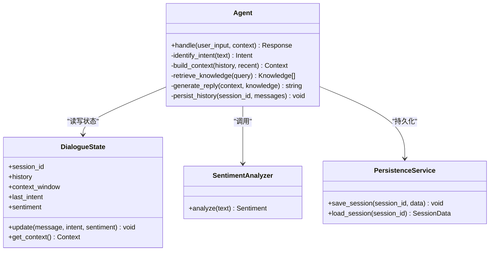
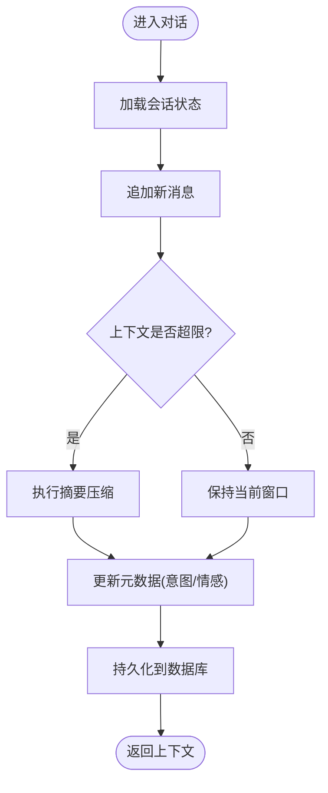
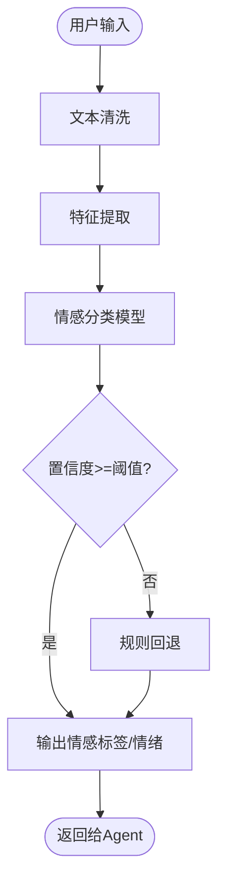
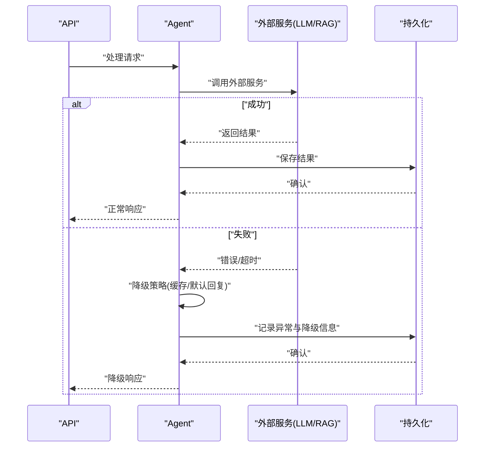
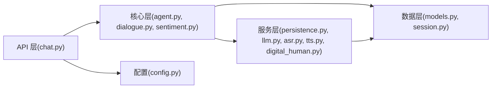

# 智能对话系统

<cite>
**本文引用的文件**   
- [backend/app/main.py](file://backend/app/main.py)
- [backend/app/api/chat.py](file://backend/app/api/chat.py)
- [backend/app/core/agent.py](file://backend/app/core/agent.py)
- [backend/app/core/dialogue.py](file://backend/app/core/dialogue.py)
- [backend/app/core/sentiment.py](file://backend/app/core/sentiment.py)
- [backend/app/services/persistence.py](file://backend/app/services/persistence.py)
- [backend/app/db/models.py](file://backend/app/db/models.py)
- [backend/app/db/session.py](file://backend/app/db/session.py)
- [backend/app/config.py](file://backend/app/config.py)
- [frontend/tourist-app/src/services/api.ts](file://frontend/tourist-app/src/services/api.ts)
- [frontend/admin-panel/src/services/api.ts](file://frontend/admin-panel/src/services/api.ts)
</cite>

## 目录
1. [简介](#简介)
2. [项目结构](#项目结构)
3. [核心组件](#核心组件)
4. [架构总览](#架构总览)
5. [详细组件分析](#详细组件分析)
6. [依赖关系分析](#依赖关系分析)
7. [性能考虑](#性能考虑)
8. [故障排查指南](#故障排查指南)
9. [结论](#结论)
10. [附录](#附录)

## 简介
本技术文档面向“智能对话系统”的后端与前端集成，围绕以下目标展开：
- Agent 智能代理的设计模式、对话状态管理与多轮对话处理逻辑
- 上下文理解算法、意图识别技术与对话历史管理策略
- 情感分析功能实现原理、情感分类模型与情绪检测算法
- 对话流控制、会话持久化与异常恢复机制
- 对话 API 接口的完整使用示例（消息发送、状态查询、会话管理）
- 对话质量评估、性能优化与扩展开发指南

## 项目结构
后端采用分层架构：API 层暴露 REST 接口；核心层包含 Agent、对话状态、RAG 检索与情感分析；服务层封装外部能力（LLM、ASR/TTS、数字人等）；数据层负责数据库模型与会话持久化。前端提供游客端与管理后台，分别通过各自的 API 客户端调用后端服务。

图表来源
- [backend/app/api/chat.py](file://backend/app/api/chat.py)
- [backend/app/core/agent.py](file://backend/app/core/agent.py)
- [backend/app/core/dialogue.py](file://backend/app/core/dialogue.py)
- [backend/app/core/sentiment.py](file://backend/app/core/sentiment.py)
- [backend/app/services/persistence.py](file://backend/app/services/persistence.py)
- [backend/app/db/models.py](file://backend/app/db/models.py)
- [backend/app/db/session.py](file://backend/app/db/session.py)
- [backend/app/config.py](file://backend/app/config.py)

章节来源
- [backend/app/main.py](file://backend/app/main.py)
- [backend/app/api/chat.py](file://backend/app/api/chat.py)
- [backend/app/core/agent.py](file://backend/app/core/agent.py)
- [backend/app/core/dialogue.py](file://backend/app/core/dialogue.py)
- [backend/app/core/sentiment.py](file://backend/app/core/sentiment.py)
- [backend/app/services/persistence.py](file://backend/app/services/persistence.py)
- [backend/app/db/models.py](file://backend/app/db/models.py)
- [backend/app/db/session.py](file://backend/app/db/session.py)
- [backend/app/config.py](file://backend/app/config.py)
- [frontend/tourist-app/src/services/api.ts](file://frontend/tourist-app/src/services/api.ts)
- [frontend/admin-panel/src/services/api.ts](file://frontend/admin-panel/src/services/api.ts)

## 核心组件
- Agent 智能代理：封装意图识别、上下文理解、策略选择与回复生成流程，协调 RAG 检索与 LLM 调用，输出结构化响应。
- 对话状态管理：维护会话 ID、历史消息、上下文窗口、最近意图与情感标签，支持滑动窗口与摘要压缩。
- 情感分析：对用户输入进行情感极性判断与细粒度情绪检测，为对话策略与个性化推荐提供信号。
- 会话持久化：将对话历史、元数据与中间结果落盘，支持断线续聊与审计回溯。
- 对话流控制：定义路由与分支条件，结合规则与模型决策，保证多轮对话的连贯性与可解释性。

章节来源
- [backend/app/core/agent.py](file://backend/app/core/agent.py)
- [backend/app/core/dialogue.py](file://backend/app/core/dialogue.py)
- [backend/app/core/sentiment.py](file://backend/app/core/sentiment.py)
- [backend/app/services/persistence.py](file://backend/app/services/persistence.py)
- [backend/app/db/models.py](file://backend/app/db/models.py)

## 架构总览
整体采用“API 层 -> 核心层 -> 服务层 -> 数据层”的分层设计，前后端通过 HTTP 交互。Agent 作为编排中心，串联对话状态、情感分析与外部服务（LLM、ASR/TTS、数字人）。

图表来源
- [backend/app/api/chat.py](file://backend/app/api/chat.py)
- [backend/app/core/agent.py](file://backend/app/core/agent.py)
- [backend/app/core/dialogue.py](file://backend/app/core/dialogue.py)
- [backend/app/core/sentiment.py](file://backend/app/core/sentiment.py)
- [backend/app/services/persistence.py](file://backend/app/services/persistence.py)
- [backend/app/db/models.py](file://backend/app/db/models.py)

## 详细组件分析

### Agent 智能代理
- 设计模式
  - 策略模式：根据意图与上下文选择不同处理策略（如问答、转人工、引导追问）。
  - 模板方法：统一对话流程骨架（解析输入 -> 检索 -> 推理 -> 生成 -> 持久化），子类或配置可扩展具体步骤。
  - 观察者：在关键节点触发日志、指标埋点与告警。
- 多轮对话处理
  - 上下文窗口：维护固定长度的历史消息序列，必要时进行摘要压缩以保留关键信息。
  - 意图识别：基于关键词、规则与轻量模型的组合，输出意图类别与置信度。
  - 槽位填充：从上下文中抽取实体与参数，驱动后续动作（如查询景点、规划路线）。
- 与外部服务协作
  - RAG：检索知识库片段，增强回答准确性与时效性。
  - LLM：接收结构化提示，生成自然语言回复。
  - 数字人与语音：可选地合成语音播报或驱动虚拟人形象。

图表来源
- [backend/app/core/agent.py](file://backend/app/core/agent.py)
- [backend/app/core/dialogue.py](file://backend/app/core/dialogue.py)
- [backend/app/core/sentiment.py](file://backend/app/core/sentiment.py)
- [backend/app/services/persistence.py](file://backend/app/services/persistence.py)

章节来源
- [backend/app/core/agent.py](file://backend/app/core/agent.py)
- [backend/app/core/dialogue.py](file://backend/app/core/dialogue.py)
- [backend/app/core/sentiment.py](file://backend/app/core/sentiment.py)
- [backend/app/services/persistence.py](file://backend/app/services/persistence.py)

### 对话状态管理
- 数据结构
  - 会话标识：唯一会话 ID，用于关联历史与上下文。
  - 历史消息：按时间顺序存储的用户与系统消息。
  - 上下文窗口：最近 N 条消息或摘要，供 Agent 快速读取。
  - 元数据：最近意图、情感标签、用户偏好等。
- 更新策略
  - 增量更新：每次对话追加新消息，滚动移除旧消息。
  - 摘要压缩：当上下文过长时，对早期内容进行摘要，保留关键语义。
- 并发与一致性
  - 会话锁：避免同一会话并发写冲突。
  - 幂等写入：确保重复请求不会导致历史重复。

图表来源
- [backend/app/core/dialogue.py](file://backend/app/core/dialogue.py)
- [backend/app/services/persistence.py](file://backend/app/services/persistence.py)
- [backend/app/db/models.py](file://backend/app/db/models.py)

章节来源
- [backend/app/core/dialogue.py](file://backend/app/core/dialogue.py)
- [backend/app/services/persistence.py](file://backend/app/services/persistence.py)
- [backend/app/db/models.py](file://backend/app/db/models.py)

### 情感分析模块
- 实现原理
  - 输入预处理：清洗、分词、去停用词。
  - 特征提取：基于词典与轻量模型的特征向量。
  - 分类器：输出情感极性（正面/中性/负面）与细粒度情绪（如喜悦、愤怒、悲伤、惊讶）。
- 集成方式
  - 在对话入口阶段调用，将情感标签注入上下文，影响 Agent 的策略选择与语气风格。
  - 支持阈值与回退策略，当模型置信度不足时降级为规则判定。

图表来源
- [backend/app/core/sentiment.py](file://backend/app/core/sentiment.py)

章节来源
- [backend/app/core/sentiment.py](file://backend/app/core/sentiment.py)

### 对话流控制与异常恢复
- 流控策略
  - 路由表：基于意图与上下文决定下一步动作（继续对话、转人工、结束会话）。
  - 超时与重试：对 LLM/RAG 调用设置超时与重试次数，失败时降级为缓存或默认回复。
  - 熔断与限流：保护后端资源，防止突发流量导致雪崩。
- 异常恢复
  - 会话快照：定期保存会话快照，崩溃后可恢复到最近一致状态。
  - 幂等键：为每条消息分配幂等键，避免重复提交造成状态不一致。
  - 错误码与重试：对外暴露明确错误码，前端据此决定是否重试或提示用户。

图表来源
- [backend/app/api/chat.py](file://backend/app/api/chat.py)
- [backend/app/core/agent.py](file://backend/app/core/agent.py)
- [backend/app/services/persistence.py](file://backend/app/services/persistence.py)

章节来源
- [backend/app/api/chat.py](file://backend/app/api/chat.py)
- [backend/app/core/agent.py](file://backend/app/core/agent.py)
- [backend/app/services/persistence.py](file://backend/app/services/persistence.py)

### 对话 API 接口与前端集成
- 消息发送
  - 路径与方法：POST /api/chat/send
  - 请求体：包含会话 ID、用户消息、可选上下文与情感标签
  - 响应体：系统回复、会话状态、建议动作
- 状态查询
  - 路径与方法：GET /api/chat/status?session_id=...
  - 响应体：会话历史长度、最近意图、情感分布、上下文窗口大小
- 会话管理
  - 创建会话：POST /api/chat/session/create
  - 关闭会话：POST /api/chat/session/close
  - 历史导出：GET /api/chat/history?session_id=...

前端调用示例（游客端）
- 初始化与发送消息：参考 [frontend/tourist-app/src/services/api.ts](file://frontend/tourist-app/src/services/api.ts)
- 管理后台操作：参考 [frontend/admin-panel/src/services/api.ts](file://frontend/admin-panel/src/services/api.ts)

章节来源
- [backend/app/api/chat.py](file://backend/app/api/chat.py)
- [frontend/tourist-app/src/services/api.ts](file://frontend/tourist-app/src/services/api.ts)
- [frontend/admin-panel/src/services/api.ts](file://frontend/admin-panel/src/services/api.ts)

## 依赖关系分析
- 组件耦合
  - API 层仅依赖核心层与服务层，不直接访问数据库，降低耦合度。
  - Agent 依赖对话状态、情感分析与持久化服务，形成松耦合的编排中心。
- 外部依赖
  - LLM/RAG 服务：通过服务层抽象，便于替换与扩展。
  - 数据库：通过模型与会话管理，屏蔽底层差异。
- 潜在循环依赖
  - 核心层与服务层之间通过接口契约解耦，避免直接相互导入。

图表来源
- [backend/app/api/chat.py](file://backend/app/api/chat.py)
- [backend/app/core/agent.py](file://backend/app/core/agent.py)
- [backend/app/core/dialogue.py](file://backend/app/core/dialogue.py)
- [backend/app/core/sentiment.py](file://backend/app/core/sentiment.py)
- [backend/app/services/persistence.py](file://backend/app/services/persistence.py)
- [backend/app/db/models.py](file://backend/app/db/models.py)
- [backend/app/db/session.py](file://backend/app/db/session.py)
- [backend/app/config.py](file://backend/app/config.py)

章节来源
- [backend/app/api/chat.py](file://backend/app/api/chat.py)
- [backend/app/core/agent.py](file://backend/app/core/agent.py)
- [backend/app/core/dialogue.py](file://backend/app/core/dialogue.py)
- [backend/app/core/sentiment.py](file://backend/app/core/sentiment.py)
- [backend/app/services/persistence.py](file://backend/app/services/persistence.py)
- [backend/app/db/models.py](file://backend/app/db/models.py)
- [backend/app/db/session.py](file://backend/app/db/session.py)
- [backend/app/config.py](file://backend/app/config.py)

## 性能考虑
- 上下文窗口优化
  - 动态调整窗口大小，平衡记忆与延迟。
  - 引入摘要压缩，减少 LLM 输入长度。
- 并发与缓存
  - 会话级锁避免写竞争。
  - 热点知识片段缓存，降低 RAG 检索开销。
- 异步与批处理
  - 非关键路径（如日志、指标上报）异步执行。
  - 批量持久化减少数据库往返。
- 监控与调优
  - 关键路径埋点：意图识别耗时、RAG 检索耗时、LLM 生成耗时。
  - 慢查询与超时告警，定位瓶颈。

[本节为通用指导，无需特定文件引用]

## 故障排查指南
- 常见问题
  - 会话丢失：检查持久化写入是否成功，确认会话快照是否定期保存。
  - 回复异常：查看意图识别与情感分析日志，确认上下文窗口是否过短或过长。
  - 外部服务超时：检查 LLM/RAG 服务健康状态与重试策略。
- 诊断工具
  - 启用调试日志，记录请求 ID、会话 ID、关键步骤耗时。
  - 导出会话历史与中间结果，复现问题场景。
- 恢复策略
  - 使用幂等键重放失败请求。
  - 切换到降级回复或缓存答案，保障用户体验。

章节来源
- [backend/app/services/persistence.py](file://backend/app/services/persistence.py)
- [backend/app/db/models.py](file://backend/app/db/models.py)
- [backend/app/core/agent.py](file://backend/app/core/agent.py)

## 结论
本系统通过清晰的层次划分与模块化设计，实现了高内聚、低耦合的智能对话能力。Agent 作为编排中心，结合对话状态管理、情感分析与 RAG/LLM 服务，提供了稳定且可扩展的多轮对话体验。配合完善的持久化与异常恢复机制，系统在可用性、可观测性与可维护性方面具备良好基础。未来可在意图识别精度、上下文压缩效率与多模态交互方面持续优化。

[本节为总结性内容，无需特定文件引用]

## 附录
- 配置项说明
  - 会话窗口大小、情感阈值、重试次数、超时时间等可通过配置文件集中管理。
- 扩展开发指南
  - 新增意图：在意图识别模块注册新类别与规则。
  - 新增策略：在 Agent 中扩展策略分支，结合上下文与情感标签进行决策。
  - 接入新服务：在服务层实现适配器，遵循统一接口契约。

章节来源
- [backend/app/config.py](file://backend/app/config.py)
- [backend/app/core/agent.py](file://backend/app/core/agent.py)
- [backend/app/core/sentiment.py](file://backend/app/core/sentiment.py)