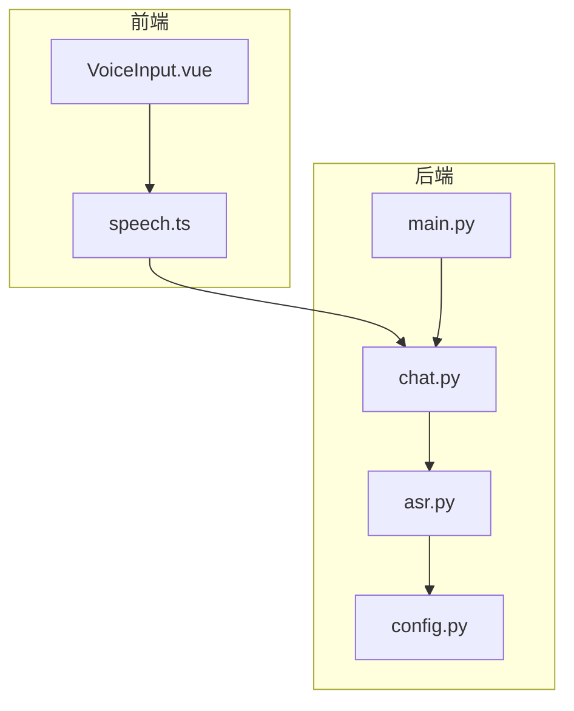
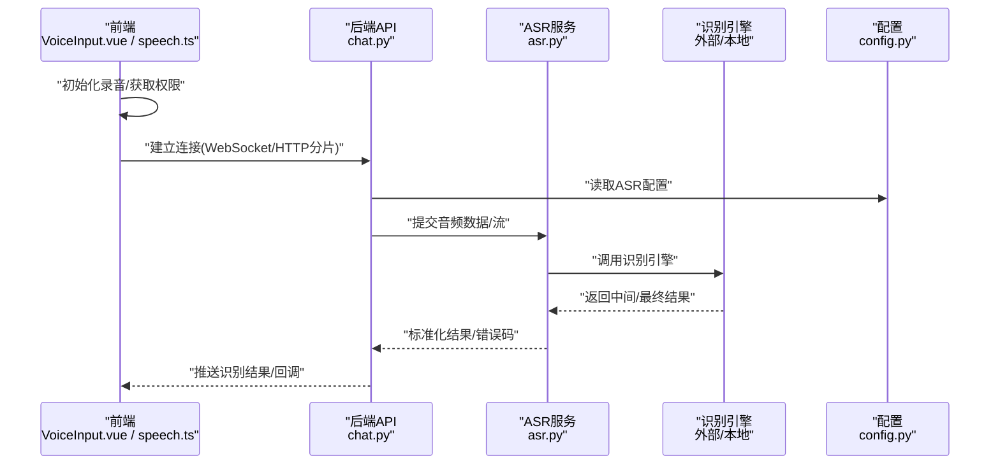
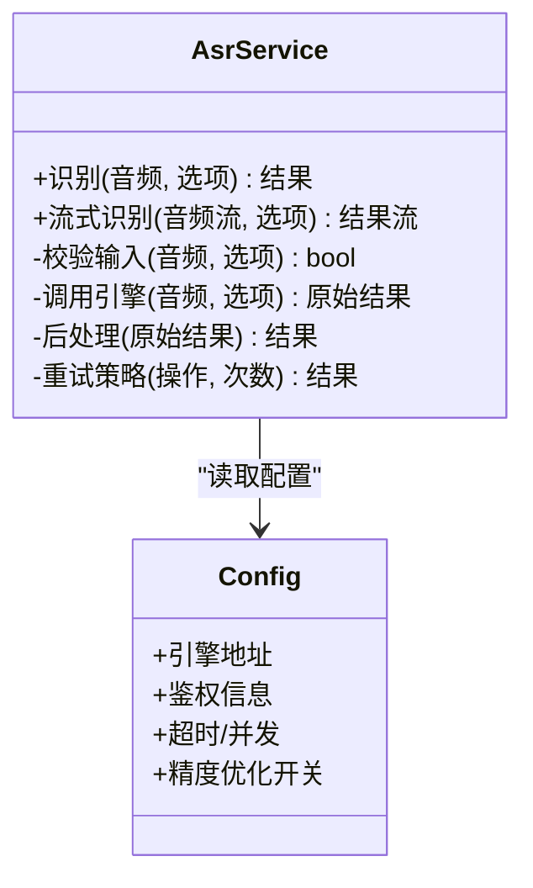
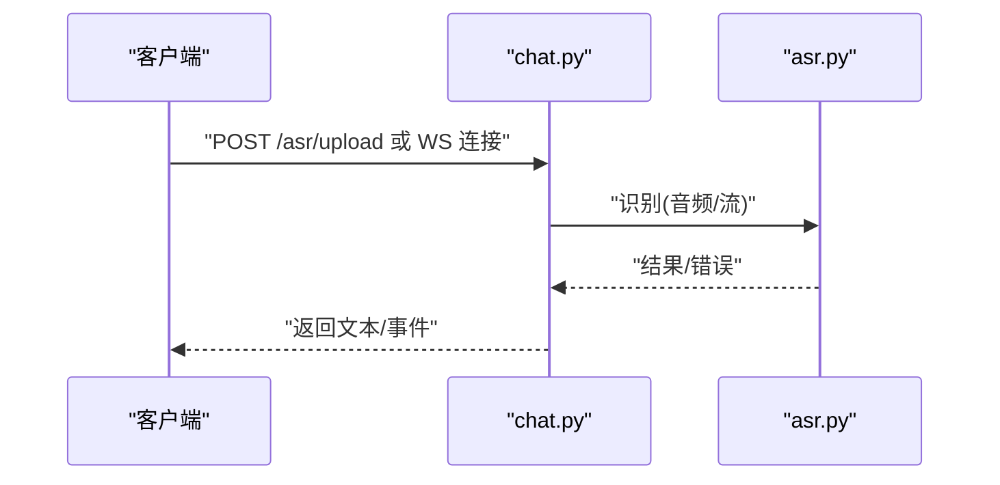
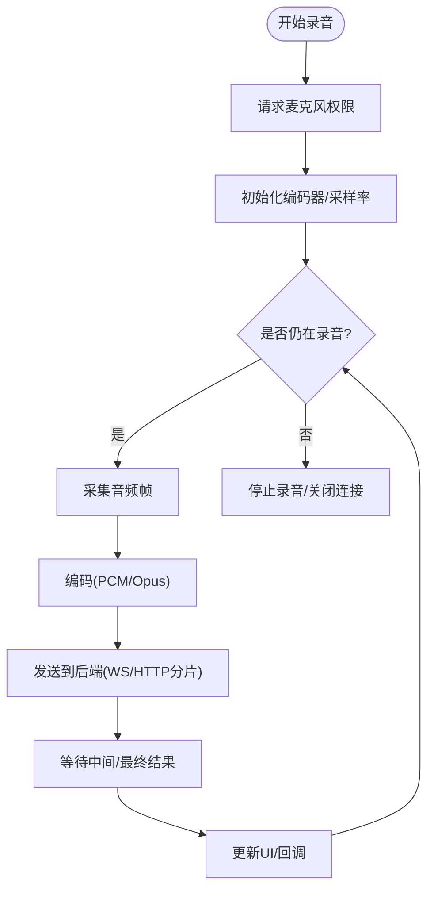
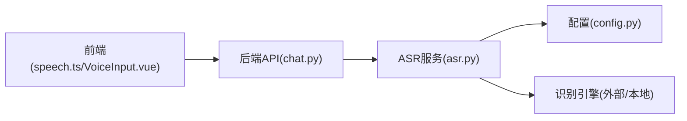

# ASR语音识别服务

<cite>
**本文引用的文件**   
- [backend/app/services/asr.py](file://backend/app/services/asr.py)
- [backend/app/api/chat.py](file://backend/app/api/chat.py)
- [frontend/tourist-app/src/services/speech.ts](file://frontend/tourist-app/src/services/speech.ts)
- [frontend/tourist-app/src/components/VoiceInput/VoiceInput.vue](file://frontend/tourist-app/src/components/VoiceInput/VoiceInput.vue)
- [backend/app/config.py](file://backend/app/config.py)
- [backend/app/main.py](file://backend/app/main.py)
</cite>

## 目录
1. [简介](#简介)
2. [项目结构](#项目结构)
3. [核心组件](#核心组件)
4. [架构总览](#架构总览)
5. [详细组件分析](#详细组件分析)
6. [依赖关系分析](#依赖关系分析)
7. [性能考虑](#性能考虑)
8. [故障排查指南](#故障排查指南)
9. [结论](#结论)
10. [附录](#附录)

## 简介
本技术文档围绕后端ASR语音识别服务与前端录音/流式识别能力，系统阐述以下主题：
- 语音识别引擎集成方案（本地或第三方API）
- 音频格式支持与采样率、编码规范
- 识别精度优化策略（预处理、噪声抑制、回声消除）
- 实时语音流处理、断句检测与语义理解衔接
- 多语言支持、方言识别与个性化模型训练配置
- API使用示例（音频上传、流式识别、结果回调）
- 性能调优参数、并发处理与错误重试机制

## 项目结构
本项目采用前后端分离架构。后端提供ASR服务接口，前端负责采集音频并发起识别请求。关键路径如下：
- 前端录音与流式发送：VoiceInput.vue → speech.ts
- 后端路由与业务编排：chat.py → asr.py
- 配置与启动入口：config.py、main.py

图表来源
- [frontend/tourist-app/src/components/VoiceInput/VoiceInput.vue](file://frontend/tourist-app/src/components/VoiceInput/VoiceInput.vue)
- [frontend/tourist-app/src/services/speech.ts](file://frontend/tourist-app/src/services/speech.ts)
- [backend/app/api/chat.py](file://backend/app/api/chat.py)
- [backend/app/services/asr.py](file://backend/app/services/asr.py)
- [backend/app/config.py](file://backend/app/config.py)
- [backend/app/main.py](file://backend/app/main.py)

章节来源
- [backend/app/services/asr.py](file://backend/app/services/asr.py)
- [backend/app/api/chat.py](file://backend/app/api/chat.py)
- [frontend/tourist-app/src/services/speech.ts](file://frontend/tourist-app/src/services/speech.ts)
- [frontend/tourist-app/src/components/VoiceInput/VoiceInput.vue](file://frontend/tourist-app/src/components/VoiceInput/VoiceInput.vue)
- [backend/app/config.py](file://backend/app/config.py)
- [backend/app/main.py](file://backend/app/main.py)

## 核心组件
- ASR服务模块：封装识别调用、参数校验、结果解析与错误处理
- 聊天API层：暴露REST/WebSocket接口，协调ASR与其他业务逻辑
- 前端录音与流式客户端：管理麦克风权限、分片上传、断句与回调
- 配置中心：集中管理ASR引擎地址、鉴权、超时与并发等参数
- 应用入口：注册路由、加载配置、启动服务

章节来源
- [backend/app/services/asr.py](file://backend/app/services/asr.py)
- [backend/app/api/chat.py](file://backend/app/api/chat.py)
- [frontend/tourist-app/src/services/speech.ts](file://frontend/tourist-app/src/services/speech.ts)
- [frontend/tourist-app/src/components/VoiceInput/VoiceInput.vue](file://frontend/tourist-app/src/components/VoiceInput/VoiceInput.vue)
- [backend/app/config.py](file://backend/app/config.py)
- [backend/app/main.py](file://backend/app/main.py)

## 架构总览
整体流程包括前端采集音频、按帧/片段推送至后端、后端调用ASR引擎、返回中间/最终文本，并在必要时触发下游语义理解。

图表来源
- [backend/app/api/chat.py](file://backend/app/api/chat.py)
- [backend/app/services/asr.py](file://backend/app/services/asr.py)
- [backend/app/config.py](file://backend/app/config.py)
- [frontend/tourist-app/src/services/speech.ts](file://frontend/tourist-app/src/services/speech.ts)
- [frontend/tourist-app/src/components/VoiceInput/VoiceInput.vue](file://frontend/tourist-app/src/components/VoiceInput/VoiceInput.vue)

## 详细组件分析

### ASR服务模块（后端）
职责
- 统一封装识别引擎调用，屏蔽差异
- 输入校验（采样率、编码、时长、大小限制）
- 结果归一化（时间戳、置信度、说话人分离标记）
- 错误分类与重试策略（网络抖动、限流、超时）

关键设计点
- 可插拔引擎适配：通过配置切换不同引擎实现
- 流式处理：支持分片增量识别与最终结果合并
- 精度优化开关：降噪、去混响、VAD、标点恢复等

图表来源
- [backend/app/services/asr.py](file://backend/app/services/asr.py)
- [backend/app/config.py](file://backend/app/config.py)

章节来源
- [backend/app/services/asr.py](file://backend/app/services/asr.py)
- [backend/app/config.py](file://backend/app/config.py)

### 聊天API层（后端）
职责
- 暴露REST/WebSocket接口，接收音频或流
- 编排ASR调用与后续语义处理
- 统一响应结构与错误码

典型流程
- REST：上传音频文件 → 调用ASR → 返回文本
- WebSocket：建立长连接 → 持续推送音频块 → 逐步返回中间结果与最终结果

图表来源
- [backend/app/api/chat.py](file://backend/app/api/chat.py)
- [backend/app/services/asr.py](file://backend/app/services/asr.py)

章节来源
- [backend/app/api/chat.py](file://backend/app/api/chat.py)
- [backend/app/services/asr.py](file://backend/app/services/asr.py)

### 前端录音与流式客户端
职责
- 管理麦克风权限、采样率与编码格式
- 将PCM/Opus等音频切片为帧/包，按协议推送
- 维护断句与结果回调，展示中间/最终文本

图表来源
- [frontend/tourist-app/src/components/VoiceInput/VoiceInput.vue](file://frontend/tourist-app/src/components/VoiceInput/VoiceInput.vue)
- [frontend/tourist-app/src/services/speech.ts](file://frontend/tourist-app/src/services/speech.ts)

章节来源
- [frontend/tourist-app/src/components/VoiceInput/VoiceInput.vue](file://frontend/tourist-app/src/components/VoiceInput/VoiceInput.vue)
- [frontend/tourist-app/src/services/speech.ts](file://frontend/tourist-app/src/services/speech.ts)

### 配置与启动
- 配置项：ASR引擎地址、鉴权、超时、并发、精度优化开关、日志级别
- 启动：应用入口加载配置、注册路由、启动服务

章节来源
- [backend/app/config.py](file://backend/app/config.py)
- [backend/app/main.py](file://backend/app/main.py)

## 依赖关系分析
- 前端依赖浏览器媒体API与WebSockets/HTTP
- 后端API依赖ASR服务与配置中心
- ASR服务依赖具体识别引擎（外部API或本地模型）

图表来源
- [frontend/tourist-app/src/services/speech.ts](file://frontend/tourist-app/src/services/speech.ts)
- [frontend/tourist-app/src/components/VoiceInput/VoiceInput.vue](file://frontend/tourist-app/src/components/VoiceInput/VoiceInput.vue)
- [backend/app/api/chat.py](file://backend/app/api/chat.py)
- [backend/app/services/asr.py](file://backend/app/services/asr.py)
- [backend/app/config.py](file://backend/app/config.py)

章节来源
- [backend/app/api/chat.py](file://backend/app/api/chat.py)
- [backend/app/services/asr.py](file://backend/app/services/asr.py)
- [frontend/tourist-app/src/services/speech.ts](file://frontend/tourist-app/src/services/speech.ts)
- [frontend/tourist-app/src/components/VoiceInput/VoiceInput.vue](file://frontend/tourist-app/src/components/VoiceInput/VoiceInput.vue)
- [backend/app/config.py](file://backend/app/config.py)

## 性能考虑
- 音频格式与采样率
  - 推荐采样率：16kHz/48kHz（根据引擎要求）
  - 编码：PCM无损、Opus低延迟高压缩
- 流式分片大小与频率
  - 小分片降低首字延迟，但增加开销；建议20–50ms分片
- 并发与队列
  - 控制并发识别任务数，避免OOM
  - 对上游限流与背压，防止雪崩
- 超时与重试
  - 合理设置单次识别超时与最大重试次数
  - 指数退避与熔断保护
- 资源隔离
  - 将ASR进程/容器独立部署，便于扩缩容
- 缓存与复用
  - 会话级上下文缓存，减少重复计算

[本节为通用指导，不直接分析具体文件]

## 故障排查指南
常见问题与定位要点
- 无法获取麦克风权限
  - 检查HTTPS环境与用户授权
  - 确认前端未拦截媒体访问
- 音频格式不支持
  - 核对采样率、声道数、编码类型
  - 在ASR服务层做输入校验并返回明确错误码
- 识别结果为空或乱码
  - 检查音频质量（静音段、爆音）
  - 开启VAD与降噪，调整阈值
- 延迟过高
  - 减小分片大小，启用流式识别
  - 提升后端并发与引擎实例
- 频繁超时/失败
  - 调整超时与重试策略
  - 观察引擎健康状态与限流提示

章节来源
- [backend/app/services/asr.py](file://backend/app/services/asr.py)
- [backend/app/api/chat.py](file://backend/app/api/chat.py)
- [frontend/tourist-app/src/services/speech.ts](file://frontend/tourist-app/src/services/speech.ts)

## 结论
本ASR服务以“前端采集+后端编排+可插拔引擎”为核心，兼顾低延迟与可扩展性。通过合理的音频预处理、流式传输与重试策略，可在复杂环境中稳定输出高质量识别结果。后续可结合领域语料进行个性化微调，进一步提升准确率与鲁棒性。

[本节为总结性内容，不直接分析具体文件]

## 附录

### API使用示例（说明性）
- 音频上传（REST）
  - 方法：POST
  - 路径：/api/asr/upload
  - 请求体：multipart/form-data，字段包含音频文件与可选参数（语言、采样率、是否标点恢复）
  - 响应：{text, confidence, duration}
- 流式识别（WebSocket）
  - 连接：ws://host/ws/asr
  - 消息：二进制音频帧（PCM/Opus），附带会话ID与语言
  - 事件：中间结果、最终结果、错误事件
- 结果回调（HTTP回调）
  - 注册回调URL，服务端在识别完成后异步推送结果

章节来源
- [backend/app/api/chat.py](file://backend/app/api/chat.py)
- [backend/app/services/asr.py](file://backend/app/services/asr.py)
- [frontend/tourist-app/src/services/speech.ts](file://frontend/tourist-app/src/services/speech.ts)

### 音频格式与预处理
- 支持格式：PCM、WAV、OGG(Opus)、MP3（视引擎能力）
- 预处理流程
  - 重采样到目标采样率
  - 单声道转换
  - VAD静音裁剪
  - 频谱降噪与去混响（可选）
- 噪声抑制与回声消除
  - 前端AEC/NS（浏览器原生或插件）
  - 后端二次降噪（可选）

章节来源
- [backend/app/services/asr.py](file://backend/app/services/asr.py)
- [frontend/tourist-app/src/services/speech.ts](file://frontend/tourist-app/src/services/speech.ts)

### 实时流处理与断句检测
- 流式处理
  - 前端按固定间隔推送音频块
  - 后端增量识别并返回中间结果
- 断句检测
  - 基于能量阈值与VAD的静音段判定
  - 结合语义停顿（可选）
- 语义理解衔接
  - 将最终文本送入NLU/对话系统，形成闭环

章节来源
- [backend/app/api/chat.py](file://backend/app/api/chat.py)
- [backend/app/services/asr.py](file://backend/app/services/asr.py)
- [frontend/tourist-app/src/components/VoiceInput/VoiceInput.vue](file://frontend/tourist-app/src/components/VoiceInput/VoiceInput.vue)

### 多语言与方言支持
- 多语言
  - 通过请求参数指定语言代码
  - 引擎侧选择对应声学/语言模型
- 方言识别
  - 选择方言模型或混合模型
  - 针对口音与词汇进行词表扩展
- 个性化模型训练
  - 收集领域语料并进行微调
  - 评估指标：WER/CER、延迟、吞吐

章节来源
- [backend/app/services/asr.py](file://backend/app/services/asr.py)
- [backend/app/config.py](file://backend/app/config.py)

### 性能调优参数与并发
- 关键参数
  - 分片大小、超时时间、最大重试次数
  - 并发识别任务上限、队列长度
  - 降噪强度、VAD阈值
- 监控与告警
  - 记录QPS、P95/P99延迟、错误率
  - 引擎健康探针与自动重启

章节来源
- [backend/app/config.py](file://backend/app/config.py)
- [backend/app/services/asr.py](file://backend/app/services/asr.py)