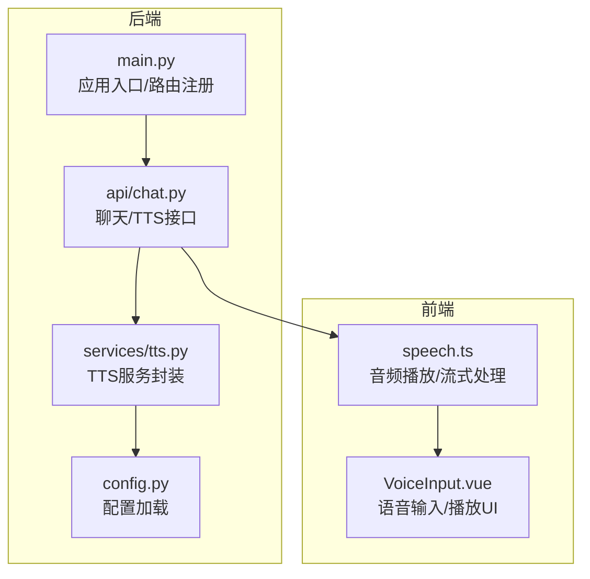
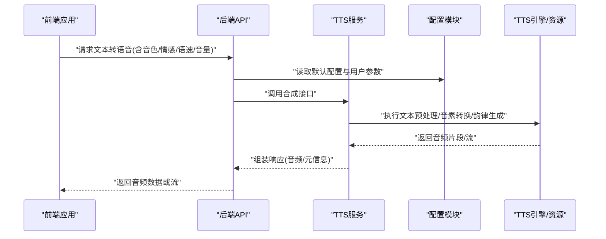
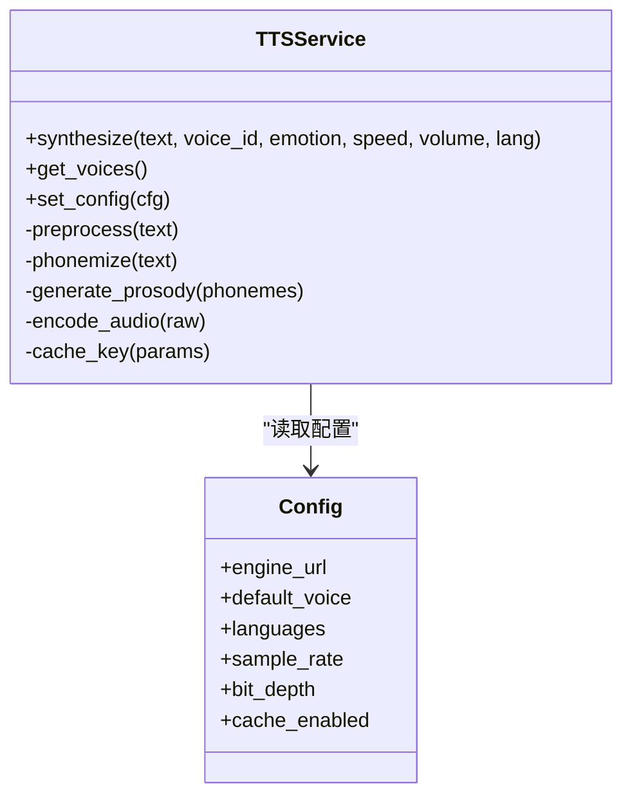
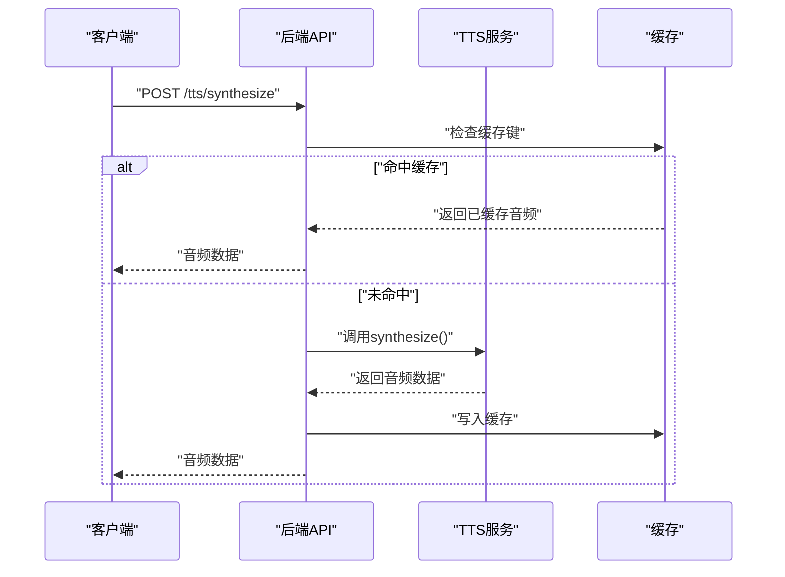
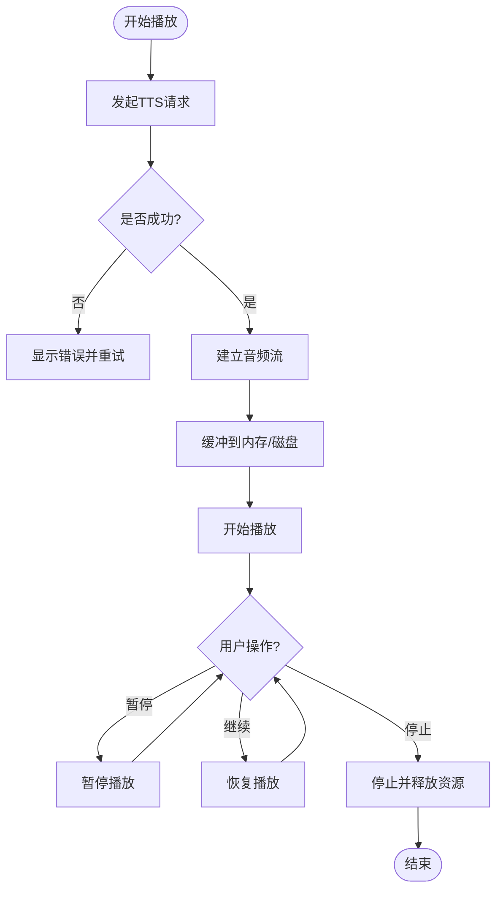
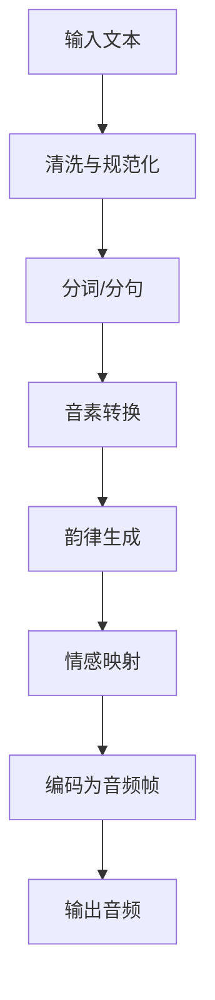
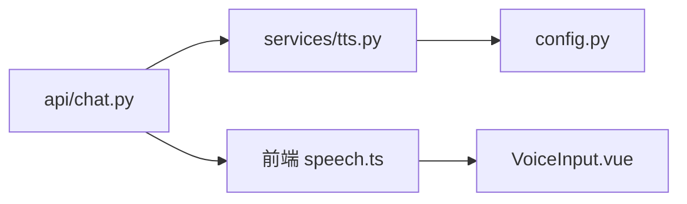

# TTS语音合成服务

<cite>
**本文引用的文件**   
- [backend/app/services/tts.py](file://backend/app/services/tts.py)
- [backend/app/api/chat.py](file://backend/app/api/chat.py)
- [backend/app/config.py](file://backend/app/config.py)
- [backend/app/main.py](file://backend/app/main.py)
- [frontend/tourist-app/src/services/speech.ts](file://frontend/tourist-app/src/services/speech.ts)
- [frontend/tourist-app/src/components/VoiceInput/VoiceInput.vue](file://frontend/tourist-app/src/components/VoiceInput/VoiceInput.vue)
</cite>

## 目录
1. [简介](#简介)
2. [项目结构](#项目结构)
3. [核心组件](#核心组件)
4. [架构总览](#架构总览)
5. [详细组件分析](#详细组件分析)
6. [依赖关系分析](#依赖关系分析)
7. [性能与资源管理](#性能与资源管理)
8. [故障排查指南](#故障排查指南)
9. [结论](#结论)
10. [附录：API使用示例](#附录api使用示例)

## 简介
本技术文档聚焦于智能旅游系统中的TTS（文本转语音）语音合成服务，涵盖以下主题：
- 语音合成引擎集成方案与后端服务实现
- 音色库管理与个性化音色定制
- 情感表达控制与自然度优化
- 文本预处理、音素转换与韵律生成流程
- 多语种支持、语速调节与音量控制
- API使用示例：文本转语音、批量合成与流式播放
- 音质配置参数、缓存策略与资源管理方案

## 项目结构
TTS相关代码主要分布在后端服务与前端播放器中：
- 后端服务层：提供TTS能力封装、配置加载与接口暴露
- 前端应用：负责音频流播放、用户交互与错误提示

**图示来源**
- [backend/app/main.py](file://backend/app/main.py)
- [backend/app/api/chat.py](file://backend/app/api/chat.py)
- [backend/app/services/tts.py](file://backend/app/services/tts.py)
- [backend/app/config.py](file://backend/app/config.py)
- [frontend/tourist-app/src/services/speech.ts](file://frontend/tourist-app/src/services/speech.ts)
- [frontend/tourist-app/src/components/VoiceInput/VoiceInput.vue](file://frontend/tourist-app/src/components/VoiceInput/VoiceInput.vue)

**章节来源**
- [backend/app/main.py](file://backend/app/main.py)
- [backend/app/api/chat.py](file://backend/app/api/chat.py)
- [backend/app/services/tts.py](file://backend/app/services/tts.py)
- [backend/app/config.py](file://backend/app/config.py)
- [frontend/tourist-app/src/services/speech.ts](file://frontend/tourist-app/src/services/speech.ts)
- [frontend/tourist-app/src/components/VoiceInput/VoiceInput.vue](file://frontend/tourist-app/src/components/VoiceInput/VoiceInput.vue)

## 核心组件
- TTS服务封装：统一调用外部或本地TTS引擎，提供音色选择、情感控制、语速与音量等参数化接口
- 配置模块：集中管理TTS引擎地址、模型路径、默认音色、语言包、并发与缓存策略
- 接口层：将TTS能力以HTTP API暴露给前端，支持同步返回音频数据与流式传输
- 前端播放：基于Web Audio或媒体元素进行音频流播放，支持实时缓冲与断点续播

**章节来源**
- [backend/app/services/tts.py](file://backend/app/services/tts.py)
- [backend/app/config.py](file://backend/app/config.py)
- [backend/app/api/chat.py](file://backend/app/api/chat.py)
- [frontend/tourist-app/src/services/speech.ts](file://frontend/tourist-app/src/services/speech.ts)

## 架构总览
整体采用“前端请求—后端路由—TTS服务—引擎/资源”的分层架构。后端通过配置驱动TTS行为，前端负责播放与用户体验。

**图示来源**
- [backend/app/api/chat.py](file://backend/app/api/chat.py)
- [backend/app/services/tts.py](file://backend/app/services/tts.py)
- [backend/app/config.py](file://backend/app/config.py)

## 详细组件分析

### TTS服务封装（后端）
职责与要点：
- 统一封装TTS引擎调用，屏蔽底层差异
- 支持音色库查询与切换、情感标签映射、语速与音量参数校验
- 提供文本预处理（分词、标点规范化）、音素转换与韵律生成的编排逻辑
- 输出格式可配置（PCM/WAV/OGG），采样率与位深可调
- 可选缓存键生成与命中返回，减少重复计算

**图示来源**
- [backend/app/services/tts.py](file://backend/app/services/tts.py)
- [backend/app/config.py](file://backend/app/config.py)

**章节来源**
- [backend/app/services/tts.py](file://backend/app/services/tts.py)
- [backend/app/config.py](file://backend/app/config.py)

### 接口层（后端API）
职责与要点：
- 定义文本转语音的REST接口，接收文本与参数（音色、情感、语速、音量、语言）
- 支持同步返回音频二进制或流式传输（分块/事件流）
- 对请求参数进行校验与默认值填充，异常时返回标准错误码与消息
- 记录关键指标（耗时、大小、状态码）便于监控

**图示来源**
- [backend/app/api/chat.py](file://backend/app/api/chat.py)
- [backend/app/services/tts.py](file://backend/app/services/tts.py)

**章节来源**
- [backend/app/api/chat.py](file://backend/app/api/chat.py)
- [backend/app/services/tts.py](file://backend/app/services/tts.py)

### 前端播放（前端）
职责与要点：
- 发起TTS请求并处理响应（二进制/流）
- 使用媒体元素或Web Audio API进行播放，支持实时缓冲与低延迟
- 提供播放控制（开始/暂停/停止）、音量调节与错误重试
- 在UI中展示播放状态与错误提示

**图示来源**
- [frontend/tourist-app/src/services/speech.ts](file://frontend/tourist-app/src/services/speech.ts)
- [frontend/tourist-app/src/components/VoiceInput/VoiceInput.vue](file://frontend/tourist-app/src/components/VoiceInput/VoiceInput.vue)

**章节来源**
- [frontend/tourist-app/src/services/speech.ts](file://frontend/tourist-app/src/services/speech.ts)
- [frontend/tourist-app/src/components/VoiceInput/VoiceInput.vue](file://frontend/tourist-app/src/components/VoiceInput/VoiceInput.vue)

### 文本预处理、音素转换与韵律生成算法
- 文本预处理：清洗噪声、标准化数字与单位、分句与分词、标点与语气符号归一化
- 音素转换：根据语言规则或词典将文本映射为音素序列，处理多音字与上下文消歧
- 韵律生成：基于语义与语法结构预测停顿、重音与语调轮廓，提升自然度
- 情感控制：将情感标签映射到声学特征（基频、能量、时长分布），实现情感化合成
- 多语种支持：按语言选择对应规则/模型，动态加载语言包与发音词典

[本节为概念性说明，不直接分析具体文件]

## 依赖关系分析
- 后端API依赖TTS服务与配置模块
- TTS服务依赖配置与外部引擎/资源（模型、词典、声音样本）
- 前端依赖后端API与浏览器媒体能力

**图示来源**
- [backend/app/api/chat.py](file://backend/app/api/chat.py)
- [backend/app/services/tts.py](file://backend/app/services/tts.py)
- [backend/app/config.py](file://backend/app/config.py)
- [frontend/tourist-app/src/services/speech.ts](file://frontend/tourist-app/src/services/speech.ts)
- [frontend/tourist-app/src/components/VoiceInput/VoiceInput.vue](file://frontend/tourist-app/src/components/VoiceInput/VoiceInput.vue)

**章节来源**
- [backend/app/api/chat.py](file://backend/app/api/chat.py)
- [backend/app/services/tts.py](file://backend/app/services/tts.py)
- [backend/app/config.py](file://backend/app/config.py)
- [frontend/tourist-app/src/services/speech.ts](file://frontend/tourist-app/src/services/speech.ts)
- [frontend/tourist-app/src/components/VoiceInput/VoiceInput.vue](file://frontend/tourist-app/src/components/VoiceInput/VoiceInput.vue)

## 性能与资源管理
- 并发与队列：对高并发请求采用任务队列与限流，避免引擎过载
- 缓存策略：基于文本+参数生成缓存键，命中直接返回；设置过期时间与容量上限
- 流式传输：优先使用流式响应降低首字节延迟，适合长文本与实时播报
- 音频编码：按需选择压缩格式（如OGG/MP3）平衡带宽与CPU占用
- 资源回收：及时释放临时文件与内存缓冲区，防止内存泄漏
- 监控与告警：记录合成耗时、失败率与资源使用，触发阈值告警

[本节为通用指导，不直接分析具体文件]

## 故障排查指南
常见问题与定位步骤：
- 请求超时：检查网络连通性与引擎负载，查看接口日志中的耗时统计
- 音频无声或杂音：确认采样率与位深配置一致，验证编码器输出格式
- 音色不可用：核对音色ID是否存在，检查音色库索引与权限
- 情感异常：检查情感标签映射表与声学参数范围
- 缓存失效：清理缓存目录或重置缓存键生成逻辑，观察命中率变化

**章节来源**
- [backend/app/api/chat.py](file://backend/app/api/chat.py)
- [backend/app/services/tts.py](file://backend/app/services/tts.py)
- [backend/app/config.py](file://backend/app/config.py)

## 结论
本TTS服务通过分层架构与配置驱动，实现了灵活的音色管理、情感控制与多语种支持。结合流式传输与缓存策略，可在保证自然度的同时提升性能与用户体验。后续可进一步引入自适应韵律建模与在线微调，持续优化自然度与稳定性。

[本节为总结性内容，不直接分析具体文件]

## 附录：API使用示例
以下为常见用法的路径指引（不包含具体代码内容）：
- 文本转语音（同步）
  - 参考路径：[backend/app/api/chat.py](file://backend/app/api/chat.py)
  - 前端调用：[frontend/tourist-app/src/services/speech.ts](file://frontend/tourist-app/src/services/speech.ts)
- 批量合成
  - 参考路径：[backend/app/api/chat.py](file://backend/app/api/chat.py)
  - 建议：使用任务队列与异步回调通知完成
- 流式播放
  - 参考路径：[backend/app/api/chat.py](file://backend/app/api/chat.py)
  - 前端播放：[frontend/tourist-app/src/services/speech.ts](file://frontend/tourist-app/src/services/speech.ts)
  - UI交互：[frontend/tourist-app/src/components/VoiceInput/VoiceInput.vue](file://frontend/tourist-app/src/components/VoiceInput/VoiceInput.vue)

**章节来源**
- [backend/app/api/chat.py](file://backend/app/api/chat.py)
- [frontend/tourist-app/src/services/speech.ts](file://frontend/tourist-app/src/services/speech.ts)
- [frontend/tourist-app/src/components/VoiceInput/VoiceInput.vue](file://frontend/tourist-app/src/components/VoiceInput/VoiceInput.vue)