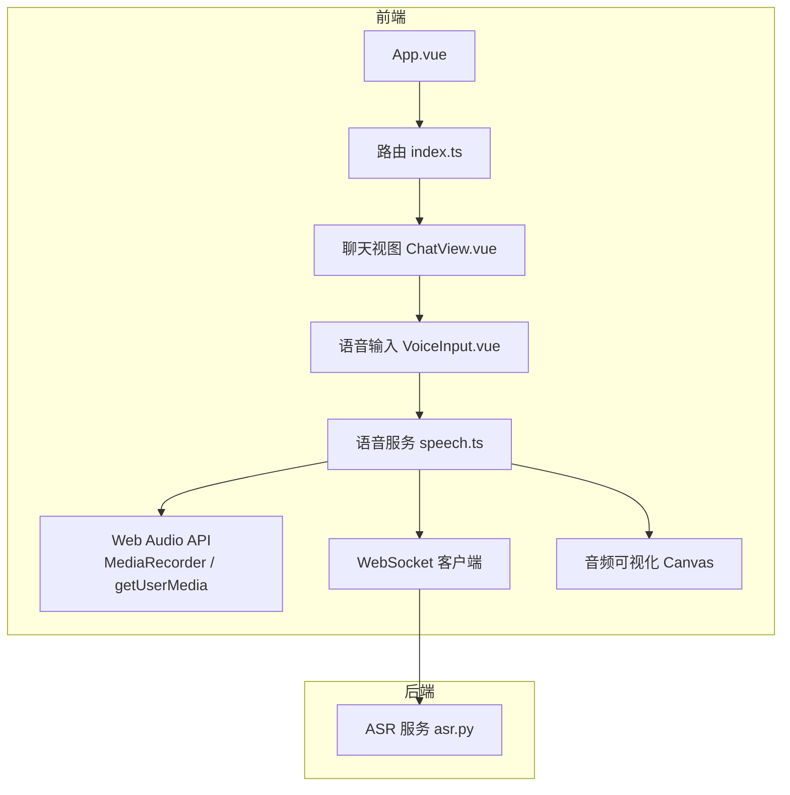
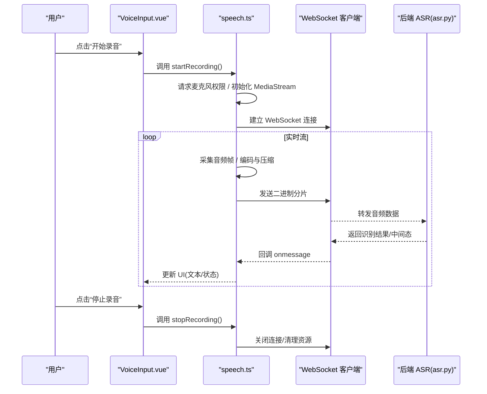
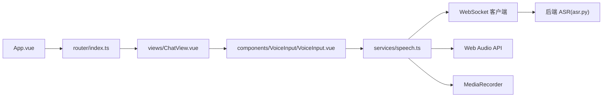
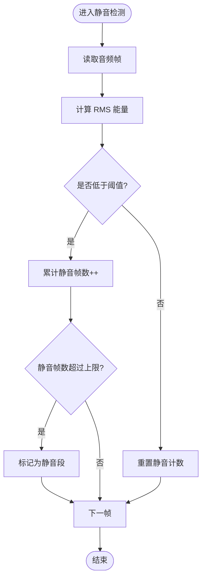

# 前端语音处理

<cite>
**本文引用的文件**   
- [frontend/tourist-app/src/components/VoiceInput/VoiceInput.vue](file://frontend/tourist-app/src/components/VoiceInput/VoiceInput.vue)
- [frontend/tourist-app/src/services/speech.ts](file://frontend/tourist-app/src/services/speech.ts)
- [frontend/tourist-app/src/views/ChatView.vue](file://frontend/tourist-app/src/views/ChatView.vue)
- [frontend/tourist-app/src/router/index.ts](file://frontend/tourist-app/src/router/index.ts)
- [frontend/tourist-app/src/App.vue](file://frontend/tourist-app/src/App.vue)
- [frontend/tourist-app/package.json](file://frontend/tourist-app/package.json)
- [backend/app/services/asr.py](file://backend/app/services/asr.py)
</cite>

## 目录
1. [简介](#简介)
2. [项目结构](#项目结构)
3. [核心组件](#核心组件)
4. [架构总览](#架构总览)
5. [详细组件分析](#详细组件分析)
6. [依赖关系分析](#依赖关系分析)
7. [性能考虑](#性能考虑)
8. [故障排查指南](#故障排查指南)
9. [结论](#结论)
10. [附录](#附录)

## 简介
本技术文档聚焦于前端语音处理，围绕浏览器 Web Audio API、麦克风权限管理、音频录制与编码、压缩传输与实时流处理、波形可视化、音量与静音检测、跨浏览器兼容性与移动端适配、性能优化策略展开。同时提供完整的前端语音交互示例（录音控制、播放与错误处理），并解释 WebSocket 连接管理、断线重连与状态同步机制。文档以仓库中的前端实现为依据，结合后端 ASR 服务接口进行端到端说明。

## 项目结构
本项目采用前后端分离架构。前端位于 frontend/tourist-app，包含语音输入组件、聊天视图与服务层；后端位于 backend/app，提供 ASR 等能力。

图表来源
- [frontend/tourist-app/src/App.vue](file://frontend/tourist-app/src/App.vue)
- [frontend/tourist-app/src/router/index.ts](file://frontend/tourist-app/src/router/index.ts)
- [frontend/tourist-app/src/views/ChatView.vue](file://frontend/tourist-app/src/views/ChatView.vue)
- [frontend/tourist-app/src/components/VoiceInput/VoiceInput.vue](file://frontend/tourist-app/src/components/VoiceInput/VoiceInput.vue)
- [frontend/tourist-app/src/services/speech.ts](file://frontend/tourist-app/src/services/speech.ts)
- [backend/app/services/asr.py](file://backend/app/services/asr.py)

章节来源
- [frontend/tourist-app/src/App.vue](file://frontend/tourist-app/src/App.vue)
- [frontend/tourist-app/src/router/index.ts](file://frontend/tourist-app/src/router/index.ts)
- [frontend/tourist-app/src/views/ChatView.vue](file://frontend/tourist-app/src/views/ChatView.vue)
- [frontend/tourist-app/src/components/VoiceInput/VoiceInput.vue](file://frontend/tourist-app/src/components/VoiceInput/VoiceInput.vue)
- [frontend/tourist-app/src/services/speech.ts](file://frontend/tourist-app/src/services/speech.ts)
- [backend/app/services/asr.py](file://backend/app/services/asr.py)

## 核心组件
- 语音输入组件：封装录音控制、权限请求、可视化与事件分发。
- 语音服务：统一调度 Web Audio API、媒体录制、网络传输与状态管理。
- 聊天视图：集成语音输入与消息展示，驱动用户交互流程。
- 路由与应用入口：组织页面与组件挂载。

章节来源
- [frontend/tourist-app/src/components/VoiceInput/VoiceInput.vue](file://frontend/tourist-app/src/components/VoiceInput/VoiceInput.vue)
- [frontend/tourist-app/src/services/speech.ts](file://frontend/tourist-app/src/services/speech.ts)
- [frontend/tourist-app/src/views/ChatView.vue](file://frontend/tourist-app/src/views/ChatView.vue)
- [frontend/tourist-app/src/router/index.ts](file://frontend/tourist-app/src/router/index.ts)
- [frontend/tourist-app/src/App.vue](file://frontend/tourist-app/src/App.vue)

## 架构总览
前端通过语音输入组件触发录音，语音服务负责采集、编码、压缩与发送；后端 ASR 服务接收音频流或分片，执行识别并将结果回传。

图表来源
- [frontend/tourist-app/src/components/VoiceInput/VoiceInput.vue](file://frontend/tourist-app/src/components/VoiceInput/VoiceInput.vue)
- [frontend/tourist-app/src/services/speech.ts](file://frontend/tourist-app/src/services/speech.ts)
- [backend/app/services/asr.py](file://backend/app/services/asr.py)

## 详细组件分析

### 语音输入组件 VoiceInput.vue
职责
- 暴露录音控制方法（开始、暂停、停止）。
- 监听并转发语音服务事件（开始、结束、错误、进度、结果）。
- 渲染波形可视化与状态提示。

关键流程
- 初始化：在组件挂载时注册事件监听器，准备可视化画布。
- 开始录音：调用语音服务的开始方法，显示“录音中”，启动波形绘制。
- 停止录音：调用语音服务的停止方法，隐藏波形，清空临时状态。
- 错误处理：捕获权限拒绝、设备不可用、网络异常等，给出友好提示。

章节来源
- [frontend/tourist-app/src/components/VoiceInput/VoiceInput.vue](file://frontend/tourist-app/src/components/VoiceInput/VoiceInput.vue)

### 语音服务 speech.ts
职责
- 统一管理 Web Audio API、MediaRecorder、WebSocket 与可视化。
- 提供 startRecording、stopRecording、playAudio 等对外接口。
- 维护连接状态、重试策略与错误码映射。

关键实现要点
- 权限与设备
  - 使用 navigator.mediaDevices.getUserMedia 获取麦克风权限。
  - 对 iOS Safari 与旧版浏览器做兼容性判断与降级提示。
- 音频采集与编码
  - 使用 AudioContext + ScriptProcessorNode/AudioWorklet 进行采样。
  - 根据浏览器支持选择最佳编码格式（如 PCM、Opus、AAC），必要时转码为通用格式。
- 压缩与传输
  - 对音频分片进行轻量压缩（如 gzip 或基于协议的分块二进制）。
  - 通过 WebSocket 发送二进制帧，减少体积与延迟。
- 实时流处理
  - 设置合适的缓冲区大小与帧长，平衡延迟与稳定性。
  - 在 onmessage 中解析后端返回的中间结果与最终结果。
- 可视化
  - 使用 AnalyserNode 获取频域/时域数据，Canvas 绘制波形与音量指示。
- 音量与静音检测
  - 计算 RMS 能量阈值，结合滑动窗口判定静音段，用于自动停止或降噪。
- 错误处理与重试
  - 区分权限错误、设备错误、网络错误与服务器错误。
  - 实现指数退避重连与最大重试次数限制。

章节来源
- [frontend/tourist-app/src/services/speech.ts](file://frontend/tourist-app/src/services/speech.ts)

### 聊天视图 ChatView.vue
职责
- 集成语音输入组件，展示对话历史与语音结果。
- 将语音服务的事件与聊天状态联动。

关键流程
- 加载页面：初始化聊天状态，挂载语音输入组件。
- 收到语音结果：追加到聊天记录，滚动到底部。
- 播放反馈：可选播放 TTS 或系统提示音。

章节来源
- [frontend/tourist-app/src/views/ChatView.vue](file://frontend/tourist-app/src/views/ChatView.vue)

### 路由与应用入口
- App.vue：应用根组件，挂载全局样式与基础布局。
- router/index.ts：定义页面路由，确保语音相关页面可访问。

章节来源
- [frontend/tourist-app/src/App.vue](file://frontend/tourist-app/src/App.vue)
- [frontend/tourist-app/src/router/index.ts](file://frontend/tourist-app/src/router/index.ts)

### 后端 ASR 服务 asr.py
职责
- 接收前端上传的音频流或分片。
- 执行语音识别，返回中间结果与最终结果。
- 处理并发与超时，保证低延迟体验。

章节来源
- [backend/app/services/asr.py](file://backend/app/services/asr.py)

## 依赖关系分析
前端模块间的依赖关系如下：

图表来源
- [frontend/tourist-app/src/App.vue](file://frontend/tourist-app/src/App.vue)
- [frontend/tourist-app/src/router/index.ts](file://frontend/tourist-app/src/router/index.ts)
- [frontend/tourist-app/src/views/ChatView.vue](file://frontend/tourist-app/src/views/ChatView.vue)
- [frontend/tourist-app/src/components/VoiceInput/VoiceInput.vue](file://frontend/tourist-app/src/components/VoiceInput/VoiceInput.vue)
- [frontend/tourist-app/src/services/speech.ts](file://frontend/tourist-app/src/services/speech.ts)
- [backend/app/services/asr.py](file://backend/app/services/asr.py)

章节来源
- [frontend/tourist-app/package.json](file://frontend/tourist-app/package.json)
- [frontend/tourist-app/src/services/speech.ts](file://frontend/tourist-app/src/services/speech.ts)

## 性能考虑
- 音频采样率与位深
  - 合理设置采样率（如 16kHz）与位深，降低带宽占用与 CPU 压力。
- 分片大小与缓冲
  - 调整分片大小（如 20–40ms）与缓冲区长度，平衡延迟与丢包容忍度。
- 编码与压缩
  - 优先使用浏览器原生支持的编码（如 Opus），必要时在服务端转码。
- 可视化开销
  - 使用 requestAnimationFrame 节流绘制，避免主线程阻塞。
- 内存管理
  - 及时释放 MediaStream、AudioContext 与 ArrayBuffer 引用，防止内存泄漏。
- 移动端适配
  - 针对 iOS Safari 的自动播放与权限策略做特殊处理；在横竖屏切换时重建上下文。
- 网络优化
  - 启用 WebSocket 心跳保活，失败快速回退到 HTTP 轮询或短连接上传。

[本节为通用指导，不直接分析具体文件]

## 故障排查指南
常见问题与定位步骤
- 麦克风权限被拒绝
  - 检查浏览器地址栏权限提示与 HTTPS 要求。
  - 在语音服务中捕获 PermissionDenied 错误并引导用户重新授权。
- 设备不可用或无输入
  - 枚举可用设备，提示用户选择正确输入源。
- 浏览器不支持
  - 检测 Web Audio API、MediaRecorder、WebSocket 支持情况，提供降级方案或提示升级浏览器。
- 连接不稳定或频繁断开
  - 查看 WebSocket 心跳与重连日志，调整重连间隔与最大重试次数。
- 识别结果不准确或延迟高
  - 检查音频质量（噪声环境）、编码格式与分片大小；评估服务端负载与网络状况。

章节来源
- [frontend/tourist-app/src/services/speech.ts](file://frontend/tourist-app/src/services/speech.ts)
- [frontend/tourist-app/src/components/VoiceInput/VoiceInput.vue](file://frontend/tourist-app/src/components/VoiceInput/VoiceInput.vue)

## 结论
本方案以前端 Web Audio API 为核心，结合 MediaRecorder 与 WebSocket 实现了低延迟的语音采集、编码、压缩与实时传输；通过可视化与静音检测提升用户体验；在跨浏览器与移动端场景下做了兼容与优化。配合后端 ASR 服务，形成完整的语音交互闭环。建议在生产环境中持续监控网络与性能指标，并根据实际业务需求调优编码参数与重连策略。

[本节为总结性内容，不直接分析具体文件]

## 附录

### 前端语音交互示例（代码片段路径）
- 录音控制
  - 开始录音：[startRecording](file://frontend/tourist-app/src/services/speech.ts)
  - 停止录音：[stopRecording](file://frontend/tourist-app/src/services/speech.ts)
  - 播放音频：[playAudio](file://frontend/tourist-app/src/services/speech.ts)
- 权限与设备
  - 获取麦克风权限：[getUserMedia](file://frontend/tourist-app/src/services/speech.ts)
  - 设备枚举与选择：[enumerateDevices](file://frontend/tourist-app/src/services/speech.ts)
- 可视化与检测
  - 波形绘制：[drawWaveform](file://frontend/tourist-app/src/services/speech.ts)
  - 音量与静音检测：[detectSilence](file://frontend/tourist-app/src/services/speech.ts)
- 网络与重连
  - WebSocket 连接与心跳：[connectWS](file://frontend/tourist-app/src/services/speech.ts)
  - 断线重连策略：[reconnectWithBackoff](file://frontend/tourist-app/src/services/speech.ts)
- 组件集成
  - 组件方法与事件绑定：[VoiceInput.vue](file://frontend/tourist-app/src/components/VoiceInput/VoiceInput.vue)
  - 聊天视图集成：[ChatView.vue](file://frontend/tourist-app/src/views/ChatView.vue)

### 算法流程图（静音检测）

图表来源
- [frontend/tourist-app/src/services/speech.ts](file://frontend/tourist-app/src/services/speech.ts)