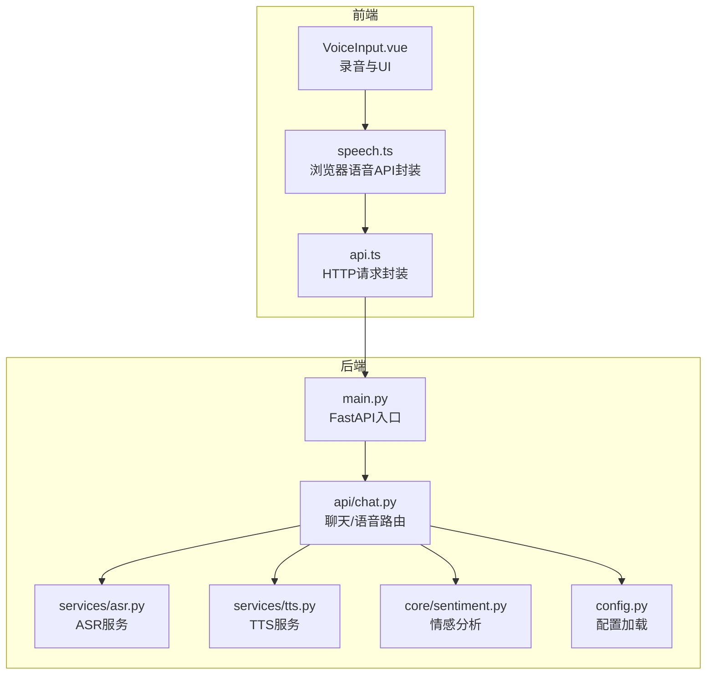
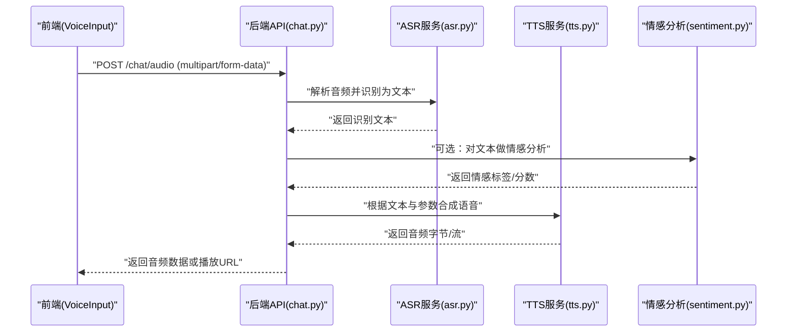
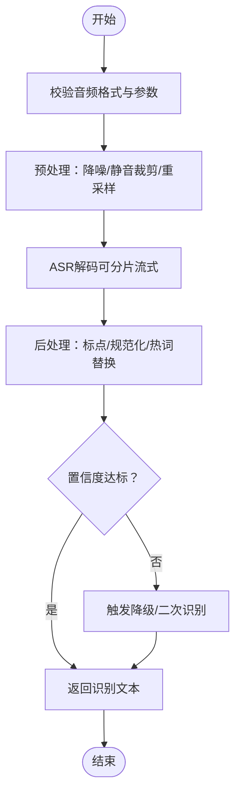
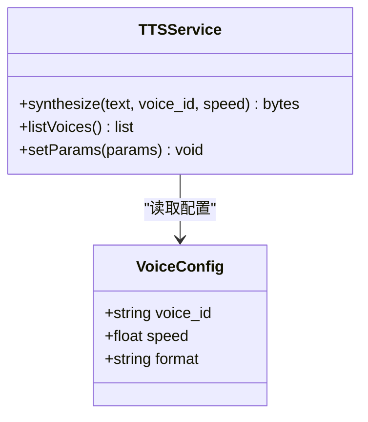
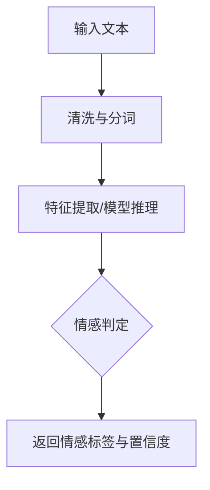
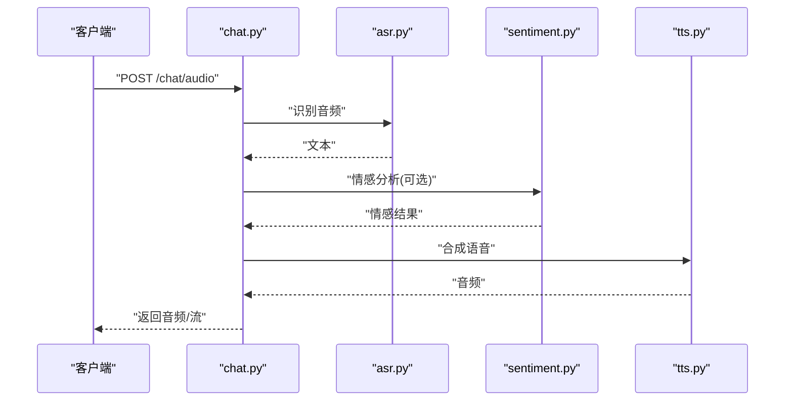
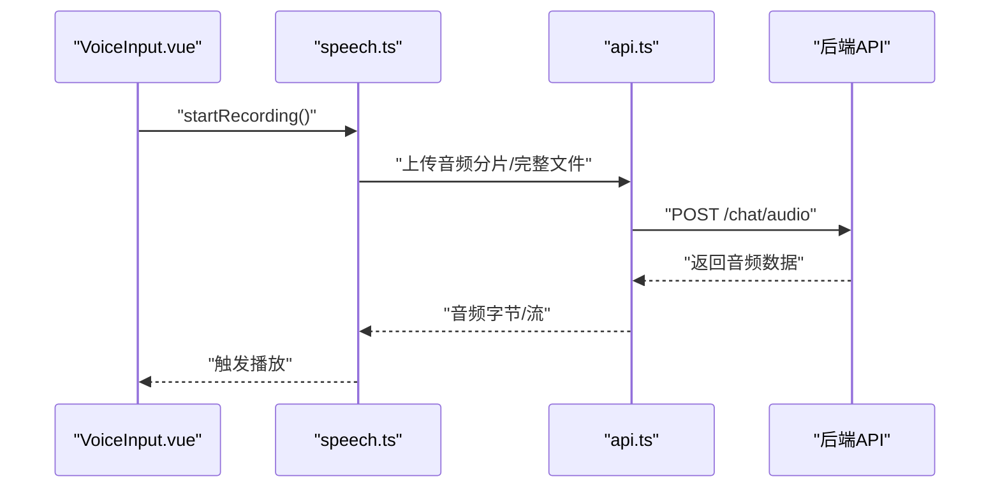
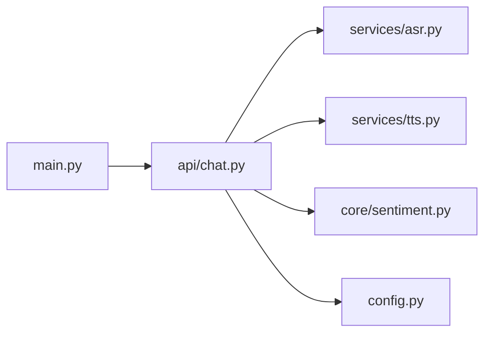

# 语音交互系统

<cite>
**本文引用的文件**   
- [backend/app/services/asr.py](file://backend/app/services/asr.py)
- [backend/app/services/tts.py](file://backend/app/services/tts.py)
- [backend/app/core/sentiment.py](file://backend/app/core/sentiment.py)
- [backend/app/api/chat.py](file://backend/app/api/chat.py)
- [frontend/tourist-app/src/components/VoiceInput/VoiceInput.vue](file://frontend/tourist-app/src/components/VoiceInput/VoiceInput.vue)
- [frontend/tourist-app/src/services/speech.ts](file://frontend/tourist-app/src/services/speech.ts)
- [frontend/tourist-app/src/services/api.ts](file://frontend/tourist-app/src/services/api.ts)
- [backend/app/config.py](file://backend/app/config.py)
- [backend/app/main.py](file://backend/app/main.py)
</cite>

## 目录
1. [简介](#简介)
2. [项目结构](#项目结构)
3. [核心组件](#核心组件)
4. [架构总览](#架构总览)
5. [详细组件分析](#详细组件分析)
6. [依赖分析](#依赖分析)
7. [性能考虑](#性能考虑)
8. [故障排除指南](#故障排除指南)
9. [结论](#结论)
10. [附录](#附录) 

## 简介
本技术文档围绕“语音交互系统”的端到端实现，覆盖以下关键主题：
- ASR（自动语音识别）服务集成方案、音频格式处理与识别精度优化策略
- TTS（文本转语音）服务实现原理、音色配置与语速调节
- 前后端语音通信协议、实时音频流处理与延迟优化
- 语音情感分析、噪声抑制与音质增强算法思路
- 语音交互API使用示例（录音上传、文本转语音、语音播放）
- 语音服务配置、性能监控与故障排除

## 项目结构
本项目采用前后端分离架构。后端提供ASR/TTS/对话/情感分析等能力；前端包含游客应用与管理后台，其中游客应用负责采集麦克风音频、调用后端接口并播放合成语音。

图表来源
- [backend/app/main.py](file://backend/app/main.py)
- [backend/app/api/chat.py](file://backend/app/api/chat.py)
- [backend/app/services/asr.py](file://backend/app/services/asr.py)
- [backend/app/services/tts.py](file://backend/app/services/tts.py)
- [backend/app/core/sentiment.py](file://backend/app/core/sentiment.py)
- [backend/app/config.py](file://backend/app/config.py)
- [frontend/tourist-app/src/components/VoiceInput/VoiceInput.vue](file://frontend/tourist-app/src/components/VoiceInput/VoiceInput.vue)
- [frontend/tourist-app/src/services/speech.ts](file://frontend/tourist-app/src/services/speech.ts)
- [frontend/tourist-app/src/services/api.ts](file://frontend/tourist-app/src/services/api.ts)

章节来源
- [backend/app/main.py](file://backend/app/main.py)
- [backend/app/api/chat.py](file://backend/app/api/chat.py)
- [backend/app/services/asr.py](file://backend/app/services/asr.py)
- [backend/app/services/tts.py](file://backend/app/services/tts.py)
- [backend/app/core/sentiment.py](file://backend/app/core/sentiment.py)
- [backend/app/config.py](file://backend/app/config.py)
- [frontend/tourist-app/src/components/VoiceInput/VoiceInput.vue](file://frontend/tourist-app/src/components/VoiceInput/VoiceInput.vue)
- [frontend/tourist-app/src/services/speech.ts](file://frontend/tourist-app/src/services/speech.ts)
- [frontend/tourist-app/src/services/api.ts](file://frontend/tourist-app/src/services/api.ts)

## 核心组件
- ASR服务：负责接收音频数据，进行解码与文本识别，支持不同采样率与编码格式的适配与校验。
- TTS服务：将文本转换为音频，支持音色选择、语速控制与输出格式配置。
- 情感分析：对识别结果或对话上下文进行情感倾向判断，用于后续个性化回复或体验优化。
- 聊天路由：统一编排ASR、LLM、TTS与情感分析流程，暴露REST/WebSocket接口供前端调用。
- 前端语音模块：封装浏览器录音、流式传输与播放逻辑，对接后端语音API。

章节来源
- [backend/app/services/asr.py](file://backend/app/services/asr.py)
- [backend/app/services/tts.py](file://backend/app/services/tts.py)
- [backend/app/core/sentiment.py](file://backend/app/core/sentiment.py)
- [backend/app/api/chat.py](file://backend/app/api/chat.py)
- [frontend/tourist-app/src/services/speech.ts](file://frontend/tourist-app/src/services/speech.ts)
- [frontend/tourist-app/src/components/VoiceInput/VoiceInput.vue](file://frontend/tourist-app/src/components/VoiceInput/VoiceInput.vue)

## 架构总览
整体流程包括：前端采集音频→上传至后端→ASR识别→可选情感分析→生成回复→TTS合成→返回音频流或文件→前端播放。

图表来源
- [backend/app/api/chat.py](file://backend/app/api/chat.py)
- [backend/app/services/asr.py](file://backend/app/services/asr.py)
- [backend/app/services/tts.py](file://backend/app/services/tts.py)
- [backend/app/core/sentiment.py](file://backend/app/core/sentiment.py)

## 详细组件分析

### ASR服务（自动语音识别）
- 输入与格式
  - 支持常见音频容器与编码（如WAV/MP3/OGG），需校验采样率、声道数与时长阈值。
  - 建议统一重采样到模型推荐采样率（如16kHz），单声道，PCM编码以提升识别稳定性。
- 识别流程
  - 预处理：降噪、静音裁剪、增益归一化。
  - 解码：调用本地或云端ASR引擎，分片流式识别以降低首字延迟。
  - 后处理：标点恢复、数字规范化、领域词表替换。
- 精度优化策略
  - 热词/领域词典注入，提升专有名词识别率。
  - 说话人分离与VAD（语音活动检测）剔除无效片段。
  - 多模型融合与置信度过滤，低置信度片段触发二次确认。
- 错误处理
  - 超时重试、降级回退（短文本优先）、异常码映射与日志上报。

图表来源
- [backend/app/services/asr.py](file://backend/app/services/asr.py)

章节来源
- [backend/app/services/asr.py](file://backend/app/services/asr.py)

### TTS服务（文本转语音）
- 合成原理
  - 基于声学模型与声码器，将文本特征映射为频谱再重建波形。
  - 支持流式合成以缩短首包延迟。
- 音色与语速
  - 音色：通过speaker embedding或音色ID切换风格。
  - 语速：通过韵律参数或时间拉伸控制，保持自然度。
- 输出格式
  - 支持PCM/WAV/Opus等，便于网络传输与播放器兼容。
- 质量保障
  - 断句与停顿控制、SSML标记（可选）、音量归一化与响度匹配。

图表来源
- [backend/app/services/tts.py](file://backend/app/services/tts.py)

章节来源
- [backend/app/services/tts.py](file://backend/app/services/tts.py)

### 情感分析
- 功能定位
  - 对识别文本或对话上下文进行情感极性判断，辅助个性化回复与用户体验优化。
- 实现要点
  - 轻量级分类模型或规则+词典组合，保证低延迟。
  - 输出情感标签与置信度，供上层决策。

图表来源
- [backend/app/core/sentiment.py](file://backend/app/core/sentiment.py)

章节来源
- [backend/app/core/sentiment.py](file://backend/app/core/sentiment.py)

### 聊天路由与编排（API层）
- 职责
  - 接收前端音频或文本请求，编排ASR→情感分析→TTS流程。
  - 管理会话状态、鉴权与限流。
- 协议
  - REST：表单上传音频、返回音频文件或流。
  - WebSocket：可选，用于实时双向流式交互。
- 错误与重试
  - 统一错误码、幂等键、超时与熔断策略。

图表来源
- [backend/app/api/chat.py](file://backend/app/api/chat.py)
- [backend/app/services/asr.py](file://backend/app/services/asr.py)
- [backend/app/services/tts.py](file://backend/app/services/tts.py)
- [backend/app/core/sentiment.py](file://backend/app/core/sentiment.py)

章节来源
- [backend/app/api/chat.py](file://backend/app/api/chat.py)

### 前端语音模块
- 录音与上传
  - 使用浏览器MediaRecorder或AudioContext采集音频，按块上传或一次性提交。
  - 支持进度回调与取消操作。
- 播放与缓冲
  - 使用Web Audio API或HTML5 Audio播放，结合预缓冲降低卡顿。
- 与后端交互
  - 通过统一的HTTP封装发送请求，处理响应头与错误码。

图表来源
- [frontend/tourist-app/src/components/VoiceInput/VoiceInput.vue](file://frontend/tourist-app/src/components/VoiceInput/VoiceInput.vue)
- [frontend/tourist-app/src/services/speech.ts](file://frontend/tourist-app/src/services/speech.ts)
- [frontend/tourist-app/src/services/api.ts](file://frontend/tourist-app/src/services/api.ts)

章节来源
- [frontend/tourist-app/src/components/VoiceInput/VoiceInput.vue](file://frontend/tourist-app/src/components/VoiceInput/VoiceInput.vue)
- [frontend/tourist-app/src/services/speech.ts](file://frontend/tourist-app/src/services/speech.ts)
- [frontend/tourist-app/src/services/api.ts](file://frontend/tourist-app/src/services/api.ts)

## 依赖分析
- 模块耦合
  - chat.py作为编排中心，依赖asr.py、tts.py、sentiment.py与config.py。
  - main.py注册路由与中间件，对外暴露API。
- 外部依赖
  - ASR/TTS可能依赖第三方SDK或本地模型库。
  - 前端依赖浏览器媒体API与HTTP客户端。

图表来源
- [backend/app/main.py](file://backend/app/main.py)
- [backend/app/api/chat.py](file://backend/app/api/chat.py)
- [backend/app/services/asr.py](file://backend/app/services/asr.py)
- [backend/app/services/tts.py](file://backend/app/services/tts.py)
- [backend/app/core/sentiment.py](file://backend/app/core/sentiment.py)
- [backend/app/config.py](file://backend/app/config.py)

章节来源
- [backend/app/main.py](file://backend/app/main.py)
- [backend/app/api/chat.py](file://backend/app/api/chat.py)
- [backend/app/services/asr.py](file://backend/app/services/asr.py)
- [backend/app/services/tts.py](file://backend/app/services/tts.py)
- [backend/app/core/sentiment.py](file://backend/app/core/sentiment.py)
- [backend/app/config.py](file://backend/app/config.py)

## 性能考虑
- 首字延迟优化
  - ASR/TTS均采用流式处理，减少端到端等待。
  - 前端边录边传，服务端边识边合。
- 资源与并发
  - 合理设置线程池/进程池，避免阻塞I/O。
  - 音频缓存与复用，减少重复计算。
- 网络与传输
  - 压缩传输（如Opus），启用连接复用与CDN缓存静态资源。
- 监控与指标
  - 记录P50/P95延迟、错误率、CPU/内存占用与队列长度。

[本节为通用指导，不直接分析具体文件]

## 故障排除指南
- 常见问题
  - 音频格式不支持：检查采样率、声道与编码，必要时在预处理阶段转换。
  - 识别失败或乱码：检查热词配置、置信度阈值与VAD参数。
  - 合成无声或爆音：检查TTS参数、响度归一化与输出格式。
  - 前端无法播放：检查MIME类型、跨域与浏览器权限。
- 诊断步骤
  - 查看后端日志与错误码，定位ASR/TTS调用链。
  - 抓包验证请求体大小与头部字段是否符合约定。
  - 回放测试音频，隔离环境差异。
- 恢复策略
  - 超时重试与降级路径（短文本优先、默认音色）。
  - 熔断与快速失败，避免雪崩。

章节来源
- [backend/app/api/chat.py](file://backend/app/api/chat.py)
- [backend/app/services/asr.py](file://backend/app/services/asr.py)
- [backend/app/services/tts.py](file://backend/app/services/tts.py)

## 结论
本系统通过模块化设计将ASR、TTS与情感分析解耦，配合前后端协作的流式处理与合理的工程实践，实现了低延迟、高可用的语音交互体验。后续可在热词库、领域模型与监控告警方面持续优化，进一步提升识别准确率与服务稳定性。

[本节为总结性内容，不直接分析具体文件]

## 附录

### 语音交互API使用示例（说明）
- 录音上传
  - 前端使用录音组件采集音频，调用上传接口，携带必要元数据（采样率、时长、语言）。
  - 后端校验音频格式，进入ASR识别流程。
- 文本转语音
  - 前端传入文本与参数（音色、语速、格式），后端调用TTS合成并返回音频。
- 语音播放
  - 前端接收音频数据后，使用浏览器播放组件进行播放，支持暂停/继续与音量控制。

章节来源
- [frontend/tourist-app/src/components/VoiceInput/VoiceInput.vue](file://frontend/tourist-app/src/components/VoiceInput/VoiceInput.vue)
- [frontend/tourist-app/src/services/speech.ts](file://frontend/tourist-app/src/services/speech.ts)
- [frontend/tourist-app/src/services/api.ts](file://frontend/tourist-app/src/services/api.ts)
- [backend/app/api/chat.py](file://backend/app/api/chat.py)

### 语音服务配置项（说明）
- ASR相关
  - 采样率、降噪开关、热词路径、超时与重试次数。
- TTS相关
  - 默认音色、语速范围、输出格式、流式开关。
- 通用
  - 日志级别、监控上报、限流阈值。

章节来源
- [backend/app/config.py](file://backend/app/config.py)