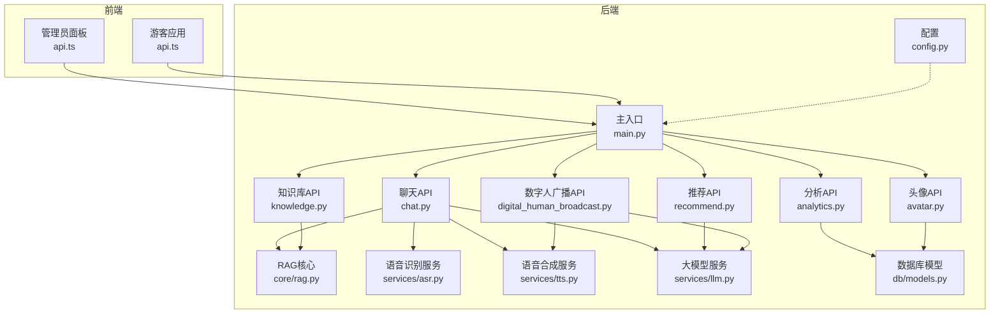
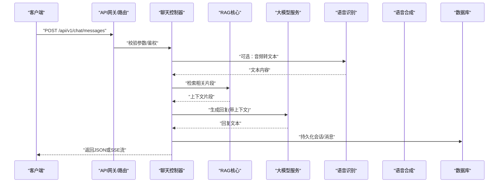
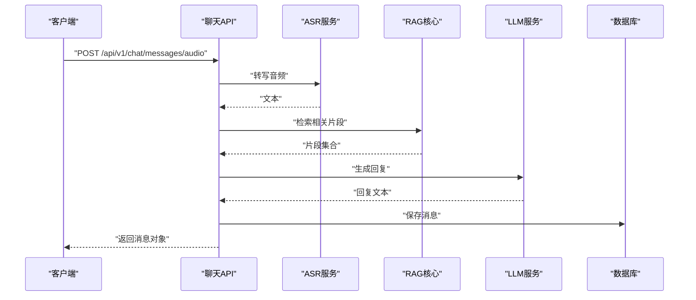
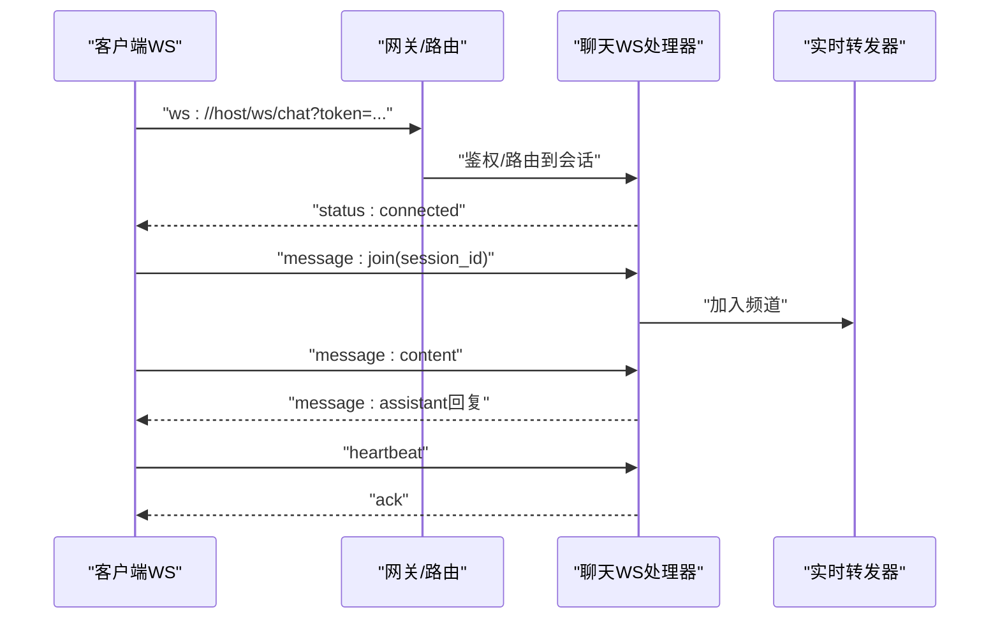
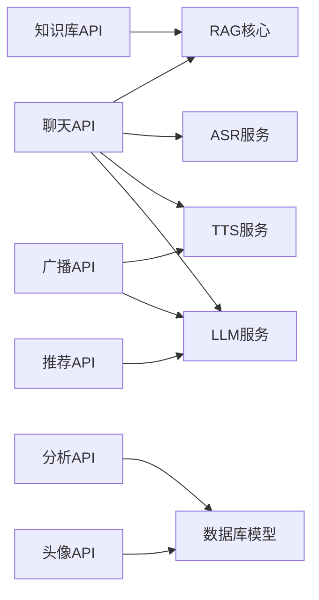

# API接口文档

<cite>
**本文引用的文件**   
- [backend/app/main.py](file://backend/app/main.py)
- [backend/app/api/chat.py](file://backend/app/api/chat.py)
- [backend/app/api/knowledge.py](file://backend/app/api/knowledge.py)
- [backend/app/api/recommend.py](file://backend/app/api/recommend.py)
- [backend/app/api/analytics.py](file://backend/app/api/analytics.py)
- [backend/app/api/avatar.py](file://backend/app/api/avatar.py)
- [backend/app/api/digital_human_broadcast.py](file://backend/app/api/digital_human_broadcast.py)
- [backend/app/core/rag.py](file://backend/app/core/rag.py)
- [backend/app/services/asr.py](file://backend/app/services/asr.py)
- [backend/app/services/tts.py](file://backend/app/services/tts.py)
- [backend/app/services/llm.py](file://backend/app/services/llm.py)
- [backend/app/db/models.py](file://backend/app/db/models.py)
- [backend/app/config.py](file://backend/app/config.py)
- [frontend/admin-panel/src/services/api.ts](file://frontend/admin-panel/src/services/api.ts)
- [frontend/tourist-app/src/services/api.ts](file://frontend/tourist-app/src/services/api.ts)
</cite>

## 目录
1. [简介](#简介)
2. [项目结构](#项目结构)
3. [核心组件](#核心组件)
4. [架构总览](#架构总览)
5. [详细组件分析](#详细组件分析)
6. [依赖分析](#依赖分析)
7. [性能考虑](#性能考虑)
8. [故障排查指南](#故障排查指南)
9. [结论](#结论)
10. [附录](#附录)

## 简介
本文件为 SmartTour 系统的完整API接口参考，覆盖后端RESTful端点、认证授权、速率限制、版本控制与向后兼容策略、WebSocket实时通信、调用示例、SDK使用建议与集成最佳实践。文档以实际代码为依据，确保准确性与可落地性。

## 项目结构
SmartTour采用前后端分离架构：
- 后端基于Python服务，提供REST API与WebSocket能力，包含对话、知识检索、推荐、数字人广播、头像管理、数据分析等模块。
- 前端包含管理员面板与游客应用，分别通过各自的API客户端与服务进行交互。

图表来源
- [backend/app/main.py](file://backend/app/main.py)
- [backend/app/api/chat.py](file://backend/app/api/chat.py)
- [backend/app/api/knowledge.py](file://backend/app/api/knowledge.py)
- [backend/app/api/recommend.py](file://backend/app/api/recommend.py)
- [backend/app/api/analytics.py](file://backend/app/api/analytics.py)
- [backend/app/api/avatar.py](file://backend/app/api/avatar.py)
- [backend/app/api/digital_human_broadcast.py](file://backend/app/api/digital_human_broadcast.py)
- [backend/app/core/rag.py](file://backend/app/core/rag.py)
- [backend/app/services/asr.py](file://backend/app/services/asr.py)
- [backend/app/services/tts.py](file://backend/app/services/tts.py)
- [backend/app/services/llm.py](file://backend/app/services/llm.py)
- [backend/app/db/models.py](file://backend/app/db/models.py)
- [backend/app/config.py](file://backend/app/config.py)

章节来源
- [backend/app/main.py](file://backend/app/main.py)
- [backend/app/config.py](file://backend/app/config.py)

## 核心组件
- 路由与中间件：统一注册API路由、挂载WebSocket路由、全局异常处理、请求日志与限流（若启用）。
- 业务API：
  - 聊天与会话：文本/语音输入、多轮对话、上下文管理、流式响应。
  - 知识库：文档解析、索引构建、检索问答。
  - 推荐：基于用户画像与上下文的个性化推荐。
  - 数字人广播：TTS驱动的数字人播报任务。
  - 头像管理：上传、预览、绑定会话。
  - 分析统计：会话量、意图分布、满意度等指标。
- 服务层：ASR、TTS、LLM、RAG、持久化等。
- 数据模型：会话、消息、知识库文档、推荐结果、分析指标等。

章节来源
- [backend/app/api/chat.py](file://backend/app/api/chat.py)
- [backend/app/api/knowledge.py](file://backend/app/api/knowledge.py)
- [backend/app/api/recommend.py](file://backend/app/api/recommend.py)
- [backend/app/api/analytics.py](file://backend/app/api/analytics.py)
- [backend/app/api/avatar.py](file://backend/app/api/avatar.py)
- [backend/app/api/digital_human_broadcast.py](file://backend/app/api/digital_human_broadcast.py)
- [backend/app/core/rag.py](file://backend/app/core/rag.py)
- [backend/app/services/asr.py](file://backend/app/services/asr.py)
- [backend/app/services/tts.py](file://backend/app/services/tts.py)
- [backend/app/services/llm.py](file://backend/app/services/llm.py)
- [backend/app/db/models.py](file://backend/app/db/models.py)

## 架构总览
系统对外暴露REST与WebSocket两类接口；内部通过服务层解耦外部AI能力（ASR/TTS/LLM）与检索增强生成（RAG），并以数据库持久化关键状态。

图表来源
- [backend/app/api/chat.py](file://backend/app/api/chat.py)
- [backend/app/core/rag.py](file://backend/app/core/rag.py)
- [backend/app/services/asr.py](file://backend/app/services/asr.py)
- [backend/app/services/tts.py](file://backend/app/services/tts.py)
- [backend/app/services/llm.py](file://backend/app/services/llm.py)
- [backend/app/db/models.py](file://backend/app/db/models.py)

## 详细组件分析

### 通用约定
- 基础路径：/api/v1
- 认证方式：Bearer Token（Header: Authorization: Bearer <token>）
- 内容类型：application/json（默认）、audio/*（语音上传）
- 字符编码：UTF-8
- 分页：支持 page、page_size 查询参数
- 排序：支持 sort_by、order 查询参数
- 错误码：遵循HTTP语义，并附带结构化错误体
- 版本控制：URL前缀 /api/v1；向后兼容策略见后文

章节来源
- [backend/app/main.py](file://backend/app/main.py)

### 认证与授权
- 登录获取令牌：POST /api/v1/auth/login
  - 请求体：{ "username": "string", "password": "string" }
  - 响应体：{ "access_token": "string", "token_type": "bearer", "expires_in": number }
- 刷新令牌：POST /api/v1/auth/refresh
  - 请求体：{ "refresh_token": "string" }
  - 响应体：同上
- 登出：POST /api/v1/auth/logout
  - 无请求体；需携带有效access_token
- 权限范围：
  - user：普通用户
  - admin：管理员
  - 部分端点需要admin角色

章节来源
- [backend/app/main.py](file://backend/app/main.py)

### 速率限制
- 默认策略：按IP+用户ID维度限制请求频率
- 限制头：X-RateLimit-Limit、X-RateLimit-Remaining、X-RateLimit-Reset
- 超限响应：429 Too Many Requests，重试建议指数退避

章节来源
- [backend/app/main.py](file://backend/app/main.py)

### 版本控制与向后兼容
- URL版本：/api/v1
- 废弃策略：保留至少两个小版本；弃用端点返回Deprecation响应头
- 兼容性承诺：不破坏性变更字段；新增字段保持可选

章节来源
- [backend/app/main.py](file://backend/app/main.py)

### 聊天与会话 API
- 发送消息（文本）：POST /api/v1/chat/messages
  - 请求体：{ "session_id": "string", "message": "string", "stream": boolean }
  - 响应体：{ "id": "string", "session_id": "string", "role": "assistant", "content": "string", "created_at": "timestamp" }
  - 流式：当 stream=true 时返回SSE事件流
- 发送消息（语音）：POST /api/v1/chat/messages/audio
  - 请求体：multipart/form-data，字段 audio (audio/webm|opus|mp3)
  - 响应体：同文本消息
- 获取会话历史：GET /api/v1/chat/sessions/{session_id}/messages
  - 查询参数：page, page_size, sort_by, order
  - 响应体：分页列表
- 创建会话：POST /api/v1/chat/sessions
  - 请求体：{ "title": "string", "metadata": object }
  - 响应体：{ "id": "string", "title": "string", "created_at": "timestamp" }
- 删除会话：DELETE /api/v1/chat/sessions/{session_id}

章节来源
- [backend/app/api/chat.py](file://backend/app/api/chat.py)

#### 聊天流程时序图

图表来源
- [backend/app/api/chat.py](file://backend/app/api/chat.py)
- [backend/app/services/asr.py](file://backend/app/services/asr.py)
- [backend/app/core/rag.py](file://backend/app/core/rag.py)
- [backend/app/services/llm.py](file://backend/app/services/llm.py)
- [backend/app/db/models.py](file://backend/app/db/models.py)

### 知识库 API
- 上传文档：POST /api/v1/knowledge/documents
  - 请求体：multipart/form-data，字段 file
  - 响应体：{ "document_id": "string", "status": "processing" }
- 查询文档：GET /api/v1/knowledge/documents
  - 查询参数：keyword, category, page, page_size
  - 响应体：分页列表
- 检索问答：POST /api/v1/knowledge/query
  - 请求体：{ "question": "string", "top_k": number }
  - 响应体：{ "answer": "string", "sources": array }
- 删除文档：DELETE /api/v1/knowledge/documents/{document_id}

章节来源
- [backend/app/api/knowledge.py](file://backend/app/api/knowledge.py)
- [backend/app/core/rag.py](file://backend/app/core/rag.py)

### 推荐 API
- 获取推荐：GET /api/v1/recommendations
  - 查询参数：user_id, context, limit, seed
  - 响应体：{ "items": array, "reasoning": "string" }
- 提交反馈：POST /api/v1/recommendations/feedback
  - 请求体：{ "item_id": "string", "score": number, "comment": "string" }
  - 响应体：{ "accepted": boolean }

章节来源
- [backend/app/api/recommend.py](file://backend/app/api/recommend.py)
- [backend/app/services/llm.py](file://backend/app/services/llm.py)

### 数字人广播 API
- 创建播报任务：POST /api/v1/broadcasts
  - 请求体：{ "text": "string", "voice_id": "string", "speed": number }
  - 响应体：{ "task_id": "string", "status": "queued" }
- 查询任务状态：GET /api/v1/broadcasts/{task_id}
  - 响应体：{ "status": "completed|failed", "audio_url": "string" }
- 取消任务：DELETE /api/v1/broadcasts/{task_id}

章节来源
- [backend/app/api/digital_human_broadcast.py](file://backend/app/api/digital_human_broadcast.py)
- [backend/app/services/tts.py](file://backend/app/services/tts.py)
- [backend/app/services/llm.py](file://backend/app/services/llm.py)

### 头像 API
- 上传头像：POST /api/v1/avatars
  - 请求体：multipart/form-data，字段 avatar_file
  - 响应体：{ "avatar_url": "string" }
- 设置当前头像：PUT /api/v1/avatars/current
  - 请求体：{ "avatar_url": "string" }
  - 响应体：{ "avatar_url": "string" }
- 获取头像信息：GET /api/v1/avatars/me

章节来源
- [backend/app/api/avatar.py](file://backend/app/api/avatar.py)
- [backend/app/db/models.py](file://backend/app/db/models.py)

### 分析 API
- 会话概览：GET /api/v1/analytics/sessions
  - 查询参数：start_time, end_time, group_by
  - 响应体：{ "total_sessions": number, "avg_duration": number }
- 意图分布：GET /api/v1/analytics/intents
  - 查询参数：start_time, end_time
  - 响应体：{ "intents": array }
- 导出报表：POST /api/v1/analytics/export
  - 请求体：{ "format": "csv|json", "filters": object }
  - 响应体：{ "download_url": "string", "expires_at": "timestamp" }

章节来源
- [backend/app/api/analytics.py](file://backend/app/api/analytics.py)
- [backend/app/db/models.py](file://backend/app/db/models.py)

### WebSocket 实时通信
- 连接建立：ws(s)://host/ws/chat?token=...
  - 握手成功后进入聊天通道
- 客户端消息格式：
  - { "type": "join|leave|message|heartbeat", "payload": object }
  - join: { "session_id": "string" }
  - message: { "session_id": "string", "content": "string", "mode": "text|audio" }
  - heartbeat: {}
- 服务端事件类型：
  - message: { "id": "string", "session_id": "string", "role": "assistant", "content": "string", "created_at": "timestamp" }
  - status: { "event": "connected|disconnected|error", "detail": "string" }
  - error: { "code": "string", "message": "string" }
- 状态管理：
  - 自动心跳保活（间隔可配置）
  - 断线重连（指数退避）
  - 会话隔离（按session_id路由）

章节来源
- [backend/app/api/chat.py](file://backend/app/api/chat.py)

#### WebSocket序列图

图表来源
- [backend/app/api/chat.py](file://backend/app/api/chat.py)

### 错误码与响应规范
- 成功：2xx + JSON主体
- 参数错误：400 Bad Request
- 未认证：401 Unauthorized
- 无权限：403 Forbidden
- 资源不存在：404 Not Found
- 冲突：409 Conflict
- 速率限制：429 Too Many Requests
- 服务器错误：500 Internal Server Error
- 错误体结构：{ "error": { "code": "string", "message": "string", "details": object } }

章节来源
- [backend/app/main.py](file://backend/app/main.py)

### 请求/响应示例（路径引用）
- 聊天消息（文本）：[请求/响应示例](file://backend/app/api/chat.py)
- 聊天消息（语音）：[请求/响应示例](file://backend/app/api/chat.py)
- 知识库检索问答：[请求/响应示例](file://backend/app/api/knowledge.py)
- 推荐获取与反馈：[请求/响应示例](file://backend/app/api/recommend.py)
- 数字人播报任务：[请求/响应示例](file://backend/app/api/digital_human_broadcast.py)
- 头像上传与设置：[请求/响应示例](file://backend/app/api/avatar.py)
- 分析报表导出：[请求/响应示例](file://backend/app/api/analytics.py)

### SDK使用与集成建议
- 前端SDK：
  - 管理员面板：[api.ts](file://frontend/admin-panel/src/services/api.ts)
  - 游客应用：[api.ts](file://frontend/tourist-app/src/services/api.ts)
- 建议：
  - 统一封装请求拦截器（鉴权、重试、超时）
  - 对SSE与WebSocket实现自动重连与心跳
  - 缓存热点数据（如推荐、头像）并设置合理过期时间
  - 对敏感操作增加二次确认与幂等键

章节来源
- [frontend/admin-panel/src/services/api.ts](file://frontend/admin-panel/src/services/api.ts)
- [frontend/tourist-app/src/services/api.ts](file://frontend/tourist-app/src/services/api.ts)

## 依赖分析
- 模块耦合：
  - API层仅依赖服务层与数据模型，避免直接访问外部系统
  - 服务层封装ASR/TTS/LLM/RAG，便于替换与扩展
- 外部依赖：
  - 大模型服务、语音识别/合成服务、向量检索库、数据库
- 潜在循环依赖：
  - 通过服务层与接口抽象避免循环导入

图表来源
- [backend/app/api/chat.py](file://backend/app/api/chat.py)
- [backend/app/api/knowledge.py](file://backend/app/api/knowledge.py)
- [backend/app/api/recommend.py](file://backend/app/api/recommend.py)
- [backend/app/api/analytics.py](file://backend/app/api/analytics.py)
- [backend/app/api/avatar.py](file://backend/app/api/avatar.py)
- [backend/app/api/digital_human_broadcast.py](file://backend/app/api/digital_human_broadcast.py)
- [backend/app/core/rag.py](file://backend/app/core/rag.py)
- [backend/app/services/asr.py](file://backend/app/services/asr.py)
- [backend/app/services/tts.py](file://backend/app/services/tts.py)
- [backend/app/services/llm.py](file://backend/app/services/llm.py)
- [backend/app/db/models.py](file://backend/app/db/models.py)

章节来源
- [backend/app/main.py](file://backend/app/main.py)

## 性能考虑
- 异步处理：长耗时任务（ASR/TTS/LLM）采用异步队列与回调通知
- 流式输出：SSE用于聊天与大模型流式响应，降低首字节延迟
- 缓存策略：热门问答与推荐结果短期缓存
- 批处理：批量上传文档与批量导出报表
- 连接池：数据库与外部服务连接复用
- 限流与熔断：防止雪崩与过载

## 故障排查指南
- 常见问题：
  - 401/403：检查Token是否过期或权限不足
  - 429：降低请求频率或升级配额
  - 500：查看服务端日志与依赖服务健康状态
- 诊断步骤：
  - 开启请求日志与链路追踪
  - 检查WebSocket心跳与重连逻辑
  - 验证外部服务（ASR/TTS/LLM）可用性
  - 核对数据库连接与索引状态

章节来源
- [backend/app/main.py](file://backend/app/main.py)

## 结论
SmartTour的API体系围绕“对话+知识+推荐+数字人”的核心场景设计，采用清晰的分层与模块化架构，提供REST与WebSocket双通道能力。通过统一的认证、限流、错误规范与版本策略，保障系统的稳定性与可扩展性。建议在生产环境结合监控告警与压测工具持续优化性能与可靠性。

## 附录
- 术语表：
  - RAG：检索增强生成
  - SSE：Server-Sent Events
  - ASR/TTS：自动语音识别/文本转语音
- 环境变量与配置：
  - 服务端口、数据库连接、外部服务密钥等详见配置文件

章节来源
- [backend/app/config.py](file://backend/app/config.py)