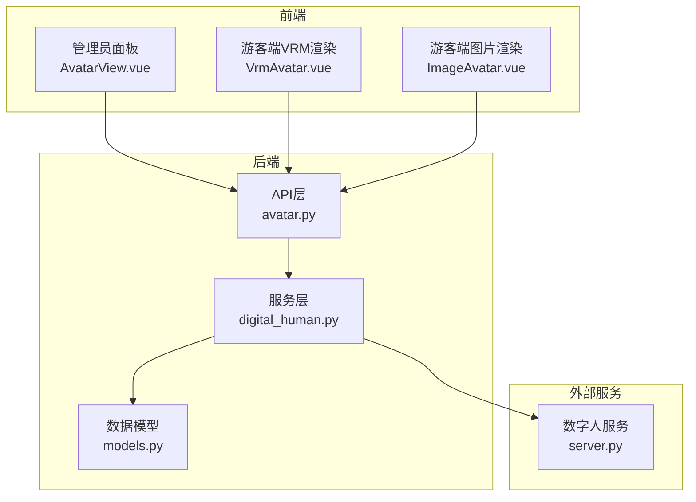
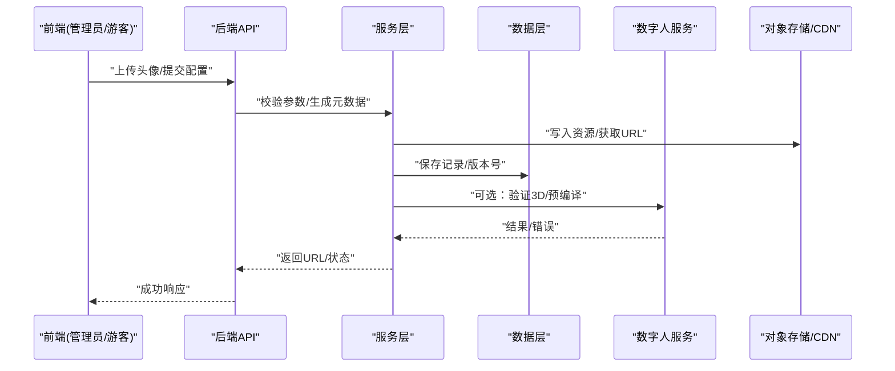
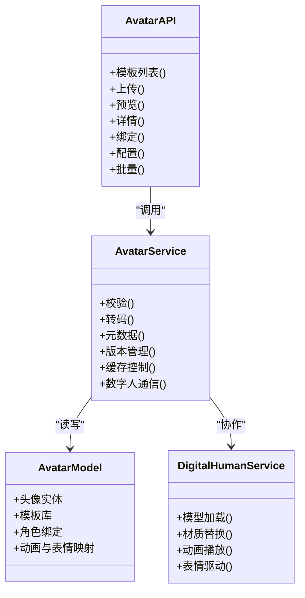

# 头像管理API

<cite>
**本文引用的文件**   
- [backend/app/api/avatar.py](file://backend/app/api/avatar.py)
- [backend/app/db/models.py](file://backend/app/db/models.py)
- [backend/app/services/digital_human.py](file://backend/app/services/digital_human.py)
- [frontend/admin-panel/src/views/AvatarConfig/AvatarView.vue](file://frontend/admin-panel/src/views/AvatarConfig/AvatarView.vue)
- [frontend/tourist-app/src/components/DigitalHuman/VrmAvatar.vue](file://frontend/tourist-app/src/components/DigitalHuman/VrmAvatar.vue)
- [frontend/tourist-app/src/components/DigitalHuman/ImageAvatar.vue](file://frontend/tourist-app/src/components/DigitalHuman/ImageAvatar.vue)
- [digital_human/server.py](file://digital_human/server.py)
</cite>

## 目录
1. [简介](#简介)
2. [项目结构](#项目结构)
3. [核心组件](#核心组件)
4. [架构总览](#架构总览)
5. [详细接口说明](#详细接口说明)
6. [依赖关系分析](#依赖关系分析)
7. [性能与存储策略](#性能与存储策略)
8. [故障排查指南](#故障排查指南)
9. [结论](#结论)
10. [附录](#附录)

## 简介
本文件面向数字人头像管理API，覆盖头像上传、预览、配置与管理的全流程接口。文档包含：
- 支持的头像格式（图片、3D模型等）、文件大小限制、分辨率要求与存储策略
- 头像模板库浏览接口、自定义头像上传流程与批量管理
- 头像与数字人角色的绑定关系、动画配置与表情映射的技术细节
- 头像资源的CDN分发、缓存策略与版本管理机制

## 项目结构
后端采用分层设计：API层暴露REST接口，服务层封装业务逻辑，数据层负责持久化；前端提供管理员面板与游客端渲染能力；独立的数字人服务用于3D资源加载与运行时交互。

图表来源
- [backend/app/api/avatar.py](file://backend/app/api/avatar.py)
- [backend/app/services/digital_human.py](file://backend/app/services/digital_human.py)
- [backend/app/db/models.py](file://backend/app/db/models.py)
- [frontend/admin-panel/src/views/AvatarConfig/AvatarView.vue](file://frontend/admin-panel/src/views/AvatarConfig/AvatarView.vue)
- [frontend/tourist-app/src/components/DigitalHuman/VrmAvatar.vue](file://frontend/tourist-app/src/components/DigitalHuman/VrmAvatar.vue)
- [frontend/tourist-app/src/components/DigitalHuman/ImageAvatar.vue](file://frontend/tourist-app/src/components/DigitalHuman/ImageAvatar.vue)
- [digital_human/server.py](file://digital_human/server.py)

章节来源
- [backend/app/api/avatar.py](file://backend/app/api/avatar.py)
- [backend/app/services/digital_human.py](file://backend/app/services/digital_human.py)
- [backend/app/db/models.py](file://backend/app/db/models.py)
- [frontend/admin-panel/src/views/AvatarConfig/AvatarView.vue](file://frontend/admin-panel/src/views/AvatarConfig/AvatarView.vue)
- [frontend/tourist-app/src/components/DigitalHuman/VrmAvatar.vue](file://frontend/tourist-app/src/components/DigitalHuman/VrmAvatar.vue)
- [frontend/tourist-app/src/components/DigitalHuman/ImageAvatar.vue](file://frontend/tourist-app/src/components/DigitalHuman/ImageAvatar.vue)
- [digital_human/server.py](file://digital_human/server.py)

## 核心组件
- API层：定义头像相关REST接口，包括上传、预览、模板列表、角色绑定、动画与表情配置、批量管理等。
- 服务层：实现头像校验、转码/压缩、元数据生成、与数字人服务通信、版本管理与缓存控制。
- 数据层：定义头像实体、模板库、角色绑定、动画与表情映射的数据库模型。
- 前端：管理员面板提供上传与配置界面；游客端根据类型选择VRM或图片渲染器。
- 数字人服务：提供3D模型加载、材质替换、动画播放与表情驱动能力。

章节来源
- [backend/app/api/avatar.py](file://backend/app/api/avatar.py)
- [backend/app/services/digital_human.py](file://backend/app/services/digital_human.py)
- [backend/app/db/models.py](file://backend/app/db/models.py)
- [frontend/admin-panel/src/views/AvatarConfig/AvatarView.vue](file://frontend/admin-panel/src/views/AvatarConfig/AvatarView.vue)
- [frontend/tourist-app/src/components/DigitalHuman/VrmAvatar.vue](file://frontend/tourist-app/src/components/DigitalHuman/VrmAvatar.vue)
- [frontend/tourist-app/src/components/DigitalHuman/ImageAvatar.vue](file://frontend/tourist-app/src/components/DigitalHuman/ImageAvatar.vue)
- [digital_human/server.py](file://digital_human/server.py)

## 架构总览
头像管理API的整体调用链如下：前端发起请求至后端API，服务层进行参数校验与资源处理，必要时与数字人服务协作完成3D资源解析与运行时配置，最终通过对象存储与CDN返回资源URL并更新缓存与版本信息。

图表来源
- [backend/app/api/avatar.py](file://backend/app/api/avatar.py)
- [backend/app/services/digital_human.py](file://backend/app/services/digital_human.py)
- [backend/app/db/models.py](file://backend/app/db/models.py)
- [digital_human/server.py](file://digital_human/server.py)

## 详细接口说明

### 通用约定
- 基础路径：/api/v1/avatar
- 认证方式：按系统统一鉴权机制（由网关或中间件处理）
- 内容类型：multipart/form-data（上传）、application/json（配置）
- 返回结构：统一JSON包裹，含code、message、data字段

### 头像模板库
- 接口：GET /api/v1/avatar/templates
- 功能：分页查询可用头像模板，支持按类型、标签、分辨率筛选
- 请求参数：page、size、type、tag、min_width、min_height
- 响应字段：id、name、type、thumbnail_url、tags、resolution、size_bytes、version、created_at

章节来源
- [backend/app/api/avatar.py](file://backend/app/api/avatar.py)
- [backend/app/db/models.py](file://backend/app/db/models.py)

### 自定义头像上传
- 接口：POST /api/v1/avatar/upload
- 功能：上传自定义头像，支持图片与3D模型；服务端进行格式校验、尺寸检查、大小限制与转码/压缩；生成唯一ID与版本号，并返回可访问URL
- 请求体：multipart/form-data
  - file：二进制文件
  - type：枚举值 image|vrm|glb|gltf
  - tags：可选，逗号分隔标签
- 响应字段：id、url、type、size_bytes、width、height、version、status

章节来源
- [backend/app/api/avatar.py](file://backend/app/api/avatar.py)
- [backend/app/services/digital_human.py](file://backend/app/services/digital_human.py)
- [backend/app/db/models.py](file://backend/app/db/models.py)

### 头像预览
- 接口：GET /api/v1/avatar/{id}/preview
- 功能：返回头像预览图或缩略图URL；对3D模型返回首帧截图或占位图
- 路径参数：id
- 响应字段：preview_url、type、version

章节来源
- [backend/app/api/avatar.py](file://backend/app/api/avatar.py)
- [backend/app/services/digital_human.py](file://backend/app/services/digital_human.py)

### 头像详情与版本
- 接口：GET /api/v1/avatar/{id}
- 功能：获取头像完整元数据与历史版本列表
- 响应字段：id、name、type、url、preview_url、tags、resolution、size_bytes、versions[]、created_at、updated_at

章节来源
- [backend/app/api/avatar.py](file://backend/app/api/avatar.py)
- [backend/app/db/models.py](file://backend/app/db/models.py)

### 头像配置与绑定
- 接口：PUT /api/v1/avatar/{id}/bind
- 功能：将头像与数字人角色绑定，设置默认动画与表情映射
- 请求体：
  - role_id：目标角色标识
  - default_animation：默认动画名称
  - expressions：表情映射表，键为表情名，值为动作片段或关键帧索引
- 响应字段：role_id、default_animation、expressions、updated_at

章节来源
- [backend/app/api/avatar.py](file://backend/app/api/avatar.py)
- [backend/app/services/digital_human.py](file://backend/app/services/digital_human.py)
- [backend/app/db/models.py](file://backend/app/db/models.py)

### 动画与表情配置
- 接口：PATCH /api/v1/avatar/{id}/config
- 功能：更新头像的动画片段、表情映射、材质替换规则等运行时配置
- 请求体：
  - animations：动画片段列表，含name、duration、loop
  - expressions：表情映射表
  - materials：材质替换规则，含slot、texture_url
- 响应字段：animations、expressions、materials、updated_at

章节来源
- [backend/app/api/avatar.py](file://backend/app/api/avatar.py)
- [backend/app/services/digital_human.py](file://backend/app/services/digital_human.py)

### 批量管理
- 接口：POST /api/v1/avatar/batch
- 功能：批量操作，支持批量删除、批量打标签、批量切换状态
- 请求体：
  - action：delete|tag|status
  - ids：头像ID数组
  - payload：根据action不同携带附加参数（如tags、status）
- 响应字段：success_count、failed_count、errors[]

章节来源
- [backend/app/api/avatar.py](file://backend/app/api/avatar.py)

### 前端渲染集成
- VRM头像渲染：游客端使用VrmAvatar组件加载3D模型，读取绑定的动画与表情配置，向数字人服务请求运行时驱动
- 图片头像渲染：游客端使用ImageAvatar组件直接展示图片资源URL

章节来源
- [frontend/tourist-app/src/components/DigitalHuman/VrmAvatar.vue](file://frontend/tourist-app/src/components/DigitalHuman/VrmAvatar.vue)
- [frontend/tourist-app/src/components/DigitalHuman/ImageAvatar.vue](file://frontend/tourist-app/src/components/DigitalHuman/ImageAvatar.vue)
- [digital_human/server.py](file://digital_human/server.py)

## 依赖关系分析
- API层依赖服务层进行业务处理与资源校验
- 服务层依赖数据层进行持久化，依赖数字人服务进行3D资源解析与运行时配置
- 前端依赖API层获取资源与配置，并根据类型选择渲染组件

图表来源
- [backend/app/api/avatar.py](file://backend/app/api/avatar.py)
- [backend/app/services/digital_human.py](file://backend/app/services/digital_human.py)
- [backend/app/db/models.py](file://backend/app/db/models.py)
- [digital_human/server.py](file://digital_human/server.py)

章节来源
- [backend/app/api/avatar.py](file://backend/app/api/avatar.py)
- [backend/app/services/digital_human.py](file://backend/app/services/digital_human.py)
- [backend/app/db/models.py](file://backend/app/db/models.py)
- [digital_human/server.py](file://digital_human/server.py)

## 性能与存储策略
- 支持格式与限制
  - 图片：JPEG、PNG、WebP；建议最大边长不超过4096px；单文件上限约10MB
  - 3D模型：VRM、GLB、GLTF；单文件上限约50MB；需包含必要纹理与骨骼
- 分辨率要求
  - 图片：推荐1080p及以上；低于阈值将触发自动缩放与质量调整
  - 3D模型：面数建议控制在合理范围，避免运行时卡顿
- 存储策略
  - 原始资源与转码产物分离存储；缩略图与预览图按需生成
  - 对象存储命名规范：/avatars/{type}/{id}/{version}/{filename}
- CDN分发与缓存
  - 静态资源通过CDN加速；Cache-Control策略针对缩略图较长缓存，源文件较短缓存
  - 版本化URL确保变更即时生效
- 版本管理
  - 每次上传生成新版本号；保留历史版本以便回滚
  - 绑定与配置变更不改变资源版本，仅更新元数据

章节来源
- [backend/app/api/avatar.py](file://backend/app/api/avatar.py)
- [backend/app/services/digital_human.py](file://backend/app/services/digital_human.py)
- [backend/app/db/models.py](file://backend/app/db/models.py)

## 故障排查指南
- 上传失败
  - 检查文件格式与大小是否符合限制
  - 查看服务端日志中的校验错误与转码异常
- 预览异常
  - 确认缩略图是否生成成功
  - 检查CDN缓存命中与回源状态
- 3D渲染问题
  - 验证模型完整性与材质路径
  - 核对动画片段与表情映射配置是否与模型一致
- 绑定与配置未生效
  - 检查角色ID是否存在
  - 确认缓存策略导致的前端旧配置残留，强制刷新或清除缓存

章节来源
- [backend/app/api/avatar.py](file://backend/app/api/avatar.py)
- [backend/app/services/digital_human.py](file://backend/app/services/digital_human.py)
- [digital_human/server.py](file://digital_human/server.py)

## 结论
本API围绕头像全生命周期管理，提供从模板浏览、上传校验、预览到绑定与配置的完整能力，并通过版本化与CDN策略保障高效分发与稳定体验。结合数字人服务的3D渲染能力，可实现丰富的动画与表情驱动效果。

## 附录
- 管理员面板入口：AvatarView.vue提供上传与配置界面
- 游客端渲染：VrmAvatar.vue与ImageAvatar.vue分别处理3D与图片渲染

章节来源
- [frontend/admin-panel/src/views/AvatarConfig/AvatarView.vue](file://frontend/admin-panel/src/views/AvatarConfig/AvatarView.vue)
- [frontend/tourist-app/src/components/DigitalHuman/VrmAvatar.vue](file://frontend/tourist-app/src/components/DigitalHuman/VrmAvatar.vue)
- [frontend/tourist-app/src/components/DigitalHuman/ImageAvatar.vue](file://frontend/tourist-app/src/components/DigitalHuman/ImageAvatar.vue)