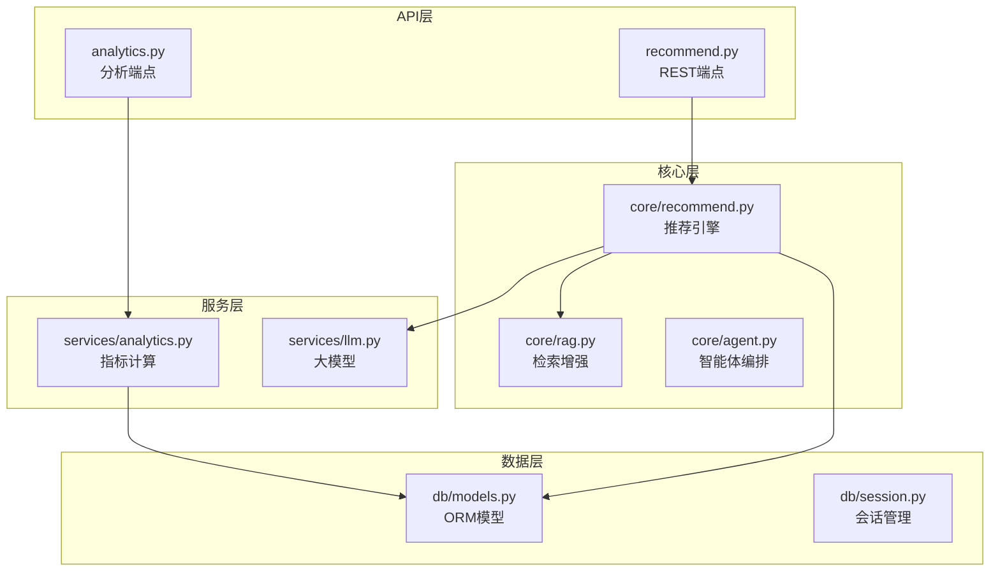
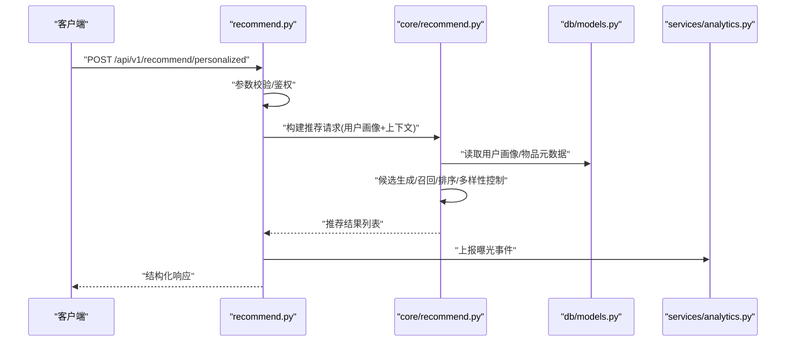
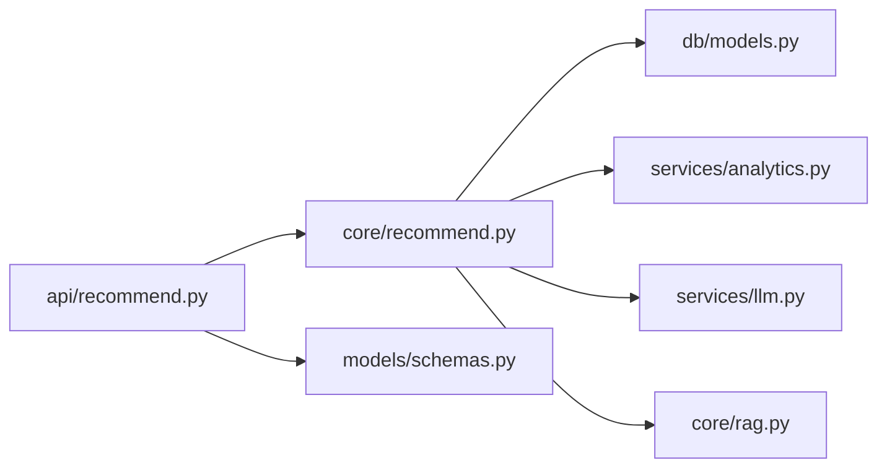

# 推荐系统API

<cite>
**本文引用的文件**   
- [backend/app/api/recommend.py](file://backend/app/api/recommend.py)
- [backend/app/core/recommend.py](file://backend/app/core/recommend.py)
- [backend/app/models/schemas.py](file://backend/app/models/schemas.py)
- [backend/app/db/models.py](file://backend/app/db/models.py)
- [backend/app/services/analytics.py](file://backend/app/services/analytics.py)
- [backend/app/api/analytics.py](file://backend/app/api/analytics.py)
</cite>

## 目录
1. [简介](#简介)
2. [项目结构](#项目结构)
3. [核心组件](#核心组件)
4. [架构总览](#架构总览)
5. [详细组件分析](#详细组件分析)
6. [依赖关系分析](#依赖关系分析)
7. [性能考虑](#性能考虑)
8. [故障排查指南](#故障排查指南)
9. [结论](#结论)
10. [附录](#附录)

## 简介
本文件为“推荐系统API”的详细接口文档，覆盖以下能力：
- 个性化推荐：基于用户画像与历史交互的个性化景点/路线推荐
- 热门景点推荐：基于全局热度、时间衰减与多样性控制的热点排序
- 路线规划推荐：结合用户偏好、时空约束与兴趣标签的多目标排序
- 算法参数配置：协同过滤、内容匹配与混合推荐的开关与权重
- 用户画像数据格式：统一的用户特征与行为事件定义
- 推荐结果结构：标准化响应体、字段语义与排序规则
- 调用示例：协同过滤、内容推荐、混合推荐的请求/响应样例路径
- 冷启动策略：新用户/新物品的处理流程
- 实时与离线差异：在线推理与离线批处理的边界与指标
- 效果评估接口：曝光、点击、转化等指标的查询与统计

## 项目结构
后端采用分层架构：API层暴露REST端点，核心逻辑在core层实现，模型与数据库访问通过db层，服务层提供外部能力（如LLM、ASR、TTS、分析）。推荐相关代码集中在api/recommend.py与core/recommend.py，数据结构由models/schemas.py定义，持久化模型在db/models.py中。

图表来源
- [backend/app/api/recommend.py](file://backend/app/api/recommend.py)
- [backend/app/core/recommend.py](file://backend/app/core/recommend.py)
- [backend/app/services/analytics.py](file://backend/app/services/analytics.py)
- [backend/app/db/models.py](file://backend/app/db/models.py)

章节来源
- [backend/app/api/recommend.py](file://backend/app/api/recommend.py)
- [backend/app/core/recommend.py](file://backend/app/core/recommend.py)
- [backend/app/models/schemas.py](file://backend/app/models/schemas.py)
- [backend/app/db/models.py](file://backend/app/db/models.py)

## 核心组件
- 推荐API控制器：负责接收请求、校验参数、路由到推荐引擎并返回结构化响应
- 推荐引擎：封装协同过滤、内容匹配、混合排序、热门榜、路线规划等策略
- 数据模型：用户画像、物品属性、交互事件、推荐结果的Pydantic Schema
- 分析服务：曝光/点击/转化等指标采集与聚合

章节来源
- [backend/app/api/recommend.py](file://backend/app/api/recommend.py)
- [backend/app/core/recommend.py](file://backend/app/core/recommend.py)
- [backend/app/models/schemas.py](file://backend/app/models/schemas.py)

## 架构总览
推荐系统整体流程：客户端发起推荐请求→API层校验与鉴权→核心层选择策略（协同过滤/内容/混合）→从数据库读取用户画像与候选集→执行排序与多样性控制→返回结果并记录曝光埋点。

图表来源
- [backend/app/api/recommend.py](file://backend/app/api/recommend.py)
- [backend/app/core/recommend.py](file://backend/app/core/recommend.py)
- [backend/app/services/analytics.py](file://backend/app/services/analytics.py)
- [backend/app/db/models.py](file://backend/app/db/models.py)

## 详细组件分析

### 个性化推荐接口
- 端点：POST /api/v1/recommend/personalized
- 功能：根据用户画像与上下文进行个性化排序
- 输入要点：
  - 用户ID、设备信息、地理位置、时间窗口
  - 用户画像：兴趣标签、历史交互、消费偏好
  - 算法参数：协同过滤权重、内容相似度阈值、多样性系数、TopN
- 输出结构：
  - 推荐项列表：包含物品ID、标题、摘要、评分、推荐理由、可操作链接
  - 元信息：策略版本、耗时、缓存命中标记
- 排序规则：
  - 综合得分=α×协同分+β×内容分+γ×热度分
  - 多样性惩罚：同类目/同供应商重复降权
  - 距离衰减：按地理距离加权
- 冷启动策略：
  - 新用户：回退至热门榜+内容探索
  - 新物品：基于属性相似与人工标注先验
- 调用示例路径：
  - 协同过滤为主：[backend/app/api/recommend.py](file://backend/app/api/recommend.py)
  - 内容匹配为主：[backend/app/api/recommend.py](file://backend/app/api/recommend.py)
  - 混合推荐：[backend/app/api/recommend.py](file://backend/app/api/recommend.py)

章节来源
- [backend/app/api/recommend.py](file://backend/app/api/recommend.py)
- [backend/app/core/recommend.py](file://backend/app/core/recommend.py)
- [backend/app/models/schemas.py](file://backend/app/models/schemas.py)

### 热门景点推荐接口
- 端点：GET /api/v1/recommend/hot
- 功能：返回当前时段内高热度景点
- 输入要点：
  - 时间窗口（小时/天）、地域过滤、类目过滤
  - 多样性上限、去重策略
- 输出结构：
  - 热门列表：含热度值、趋势方向、更新时间
- 排序规则：
  - 热度=近期点击/收藏/分享加权求和×时间衰减
  - 多样性控制：类目/供应商分布均衡
- 冷启动策略：
  - 无历史时直接按全局热度排序
- 调用示例路径：
  - [backend/app/api/recommend.py](file://backend/app/api/recommend.py)

章节来源
- [backend/app/api/recommend.py](file://backend/app/api/recommend.py)
- [backend/app/core/recommend.py](file://backend/app/core/recommend.py)

### 路线规划推荐接口
- 端点：POST /api/v1/recommend/route-plan
- 功能：基于用户偏好与时空约束生成多日行程建议
- 输入要点：
  - 起止时间、城市/区域、交通方式、预算范围
  - 兴趣标签、体力等级、必游/避游清单
  - 算法参数：停留时长、步行/驾车比例、POI密度
- 输出结构：
  - 日程表：每日节点序列、到达顺序、预计耗时
  - 备选方案：不同主题或强度的替代路线
- 排序规则：
  - 多目标优化：兴趣匹配度、可达性、拥挤度、体验多样性
- 冷启动策略：
  - 默认模板库+热门POI填充，逐步替换为用户偏好
- 调用示例路径：
  - [backend/app/api/recommend.py](file://backend/app/api/recommend.py)

章节来源
- [backend/app/api/recommend.py](file://backend/app/api/recommend.py)
- [backend/app/core/recommend.py](file://backend/app/core/recommend.py)

### 用户画像与数据格式
- 用户画像字段：
  - 基础信息：用户ID、注册时长、设备类型
  - 兴趣标签：类目偏好、价格敏感度、出行频率
  - 历史交互：浏览、收藏、下单、评价
- 物品属性：
  - 类目、标签、位置、价格区间、评分、图片/视频资源
- 交互事件：
  - 曝光、点击、收藏、购买、分享、停留时长
- Schema定义路径：
  - [backend/app/models/schemas.py](file://backend/app/models/schemas.py)
  - ORM模型路径：
    - [backend/app/db/models.py](file://backend/app/db/models.py)

章节来源
- [backend/app/models/schemas.py](file://backend/app/models/schemas.py)
- [backend/app/db/models.py](file://backend/app/db/models.py)

### 算法参数与策略说明
- 协同过滤：
  - 近邻数量、相似度度量、隐式反馈权重
- 内容推荐：
  - 文本/向量相似度阈值、类目权重、价格带匹配
- 混合推荐：
  - α/β/γ权重可调、A/B实验分组、动态调参
- 多样性控制：
  - 类目/供应商/距离分布约束、惩罚系数
- 冷启动：
  - 新用户：热门+探索；新物品：属性相似+人工先验
- 实现路径：
  - [backend/app/core/recommend.py](file://backend/app/core/recommend.py)

章节来源
- [backend/app/core/recommend.py](file://backend/app/core/recommend.py)

### 推荐结果结构与排序规则
- 结果字段：
  - 物品ID、标题、摘要、评分、推荐理由、距离、价格、图片
  - 元信息：策略版本、耗时、缓存命中、排序依据
- 排序规则：
  - 综合得分公式、多样性惩罚、距离衰减、时间衰减
- 响应规范：
  - 统一错误码、分页字段、trace_id用于追踪
- 定义路径：
  - [backend/app/models/schemas.py](file://backend/app/models/schemas.py)
  - [backend/app/api/recommend.py](file://backend/app/api/recommend.py)

章节来源
- [backend/app/models/schemas.py](file://backend/app/models/schemas.py)
- [backend/app/api/recommend.py](file://backend/app/api/recommend.py)

### 调用示例（路径引用）
- 协同过滤为主：
  - 请求构造与参数设置参考：[backend/app/api/recommend.py](file://backend/app/api/recommend.py)
  - 核心排序逻辑参考：[backend/app/core/recommend.py](file://backend/app/core/recommend.py)
- 内容匹配为主：
  - 请求构造与参数设置参考：[backend/app/api/recommend.py](file://backend/app/api/recommend.py)
  - 相似度计算参考：[backend/app/core/recommend.py](file://backend/app/core/recommend.py)
- 混合推荐：
  - 权重配置与融合策略参考：[backend/app/api/recommend.py](file://backend/app/api/recommend.py)
  - 多策略调度参考：[backend/app/core/recommend.py](file://backend/app/core/recommend.py)

章节来源
- [backend/app/api/recommend.py](file://backend/app/api/recommend.py)
- [backend/app/core/recommend.py](file://backend/app/core/recommend.py)

### 实时推荐与离线推荐差异
- 实时推荐：
  - 在线召回与排序，低延迟要求，增量更新用户画像
- 离线推荐：
  - 批量训练模型、全量召回、复杂特征工程、定时任务
- 切换策略：
  - 根据用户活跃度与数据新鲜度动态选择
- 实现参考：
  - [backend/app/core/recommend.py](file://backend/app/core/recommend.py)

章节来源
- [backend/app/core/recommend.py](file://backend/app/core/recommend.py)

### 推荐效果评估指标接口
- 指标维度：
  - 曝光、点击、收藏、购买、分享、停留时长、转化率
- 查询端点：
  - GET /api/v1/analytics/recommend/metrics
- 输入参数：
  - 时间范围、策略版本、渠道、地域、类目
- 输出结构：
  - 指标汇总、趋势图数据、细分维度对比
- 实现路径：
  - [backend/app/api/analytics.py](file://backend/app/api/analytics.py)
  - [backend/app/services/analytics.py](file://backend/app/services/analytics.py)

章节来源
- [backend/app/api/analytics.py](file://backend/app/api/analytics.py)
- [backend/app/services/analytics.py](file://backend/app/services/analytics.py)

## 依赖关系分析
推荐API依赖核心引擎、数据模型与分析服务；核心引擎依赖数据库与服务层（LLM、RAG）。

图表来源
- [backend/app/api/recommend.py](file://backend/app/api/recommend.py)
- [backend/app/core/recommend.py](file://backend/app/core/recommend.py)
- [backend/app/db/models.py](file://backend/app/db/models.py)
- [backend/app/services/analytics.py](file://backend/app/services/analytics.py)
- [backend/app/models/schemas.py](file://backend/app/models/schemas.py)

章节来源
- [backend/app/api/recommend.py](file://backend/app/api/recommend.py)
- [backend/app/core/recommend.py](file://backend/app/core/recommend.py)
- [backend/app/db/models.py](file://backend/app/db/models.py)
- [backend/app/services/analytics.py](file://backend/app/services/analytics.py)
- [backend/app/models/schemas.py](file://backend/app/models/schemas.py)

## 性能考虑
- 缓存策略：对热门与静态特征使用多级缓存（内存/Redis），降低DB压力
- 异步埋点：曝光/点击事件异步上报，避免阻塞主链路
- 索引优化：用户画像与物品属性建立合适索引，提升召回速度
- 限流与降级：高峰期限制TopN与复杂度，回退到简单策略
- 批处理：离线任务错峰执行，避免与在线服务争抢资源

## 故障排查指南
- 常见问题：
  - 参数缺失或类型错误：检查请求体Schema与必填字段
  - 用户画像为空：确认用户注册与首次行为埋点是否上报
  - 推荐结果为空：检查候选集生成与过滤条件
  - 指标不更新：确认埋点上报与分析任务是否正常
- 定位方法：
  - 查看trace_id与日志关键字
  - 核对策略版本与权重配置
  - 检查数据库连接与索引状态
- 参考实现：
  - 错误处理与响应结构：[backend/app/api/recommend.py](file://backend/app/api/recommend.py)
  - 指标采集与聚合：[backend/app/services/analytics.py](file://backend/app/services/analytics.py)

章节来源
- [backend/app/api/recommend.py](file://backend/app/api/recommend.py)
- [backend/app/services/analytics.py](file://backend/app/services/analytics.py)

## 结论
本推荐系统API以清晰的层次化架构与标准化的数据结构，提供个性化、热门与路线规划三类推荐能力。通过灵活的算法参数与多样性控制，兼顾准确性与用户体验；同时提供完善的评估指标接口，支持持续优化与A/B实验。

## 附录
- 术语表：
  - 协同过滤：基于用户/物品相似度的推荐
  - 内容推荐：基于物品属性与用户兴趣匹配的推荐
  - 混合推荐：多策略融合的综合排序
  - 冷启动：新用户/新物品的初始推荐策略
- 最佳实践：
  - 合理设置TopN与多样性系数，避免同质化
  - 定期校准权重与阈值，保持推荐质量
  - 完善埋点与监控，保障线上稳定性