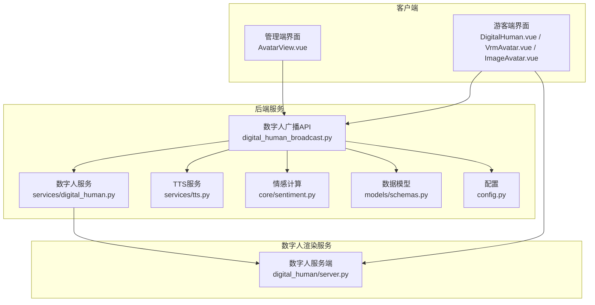
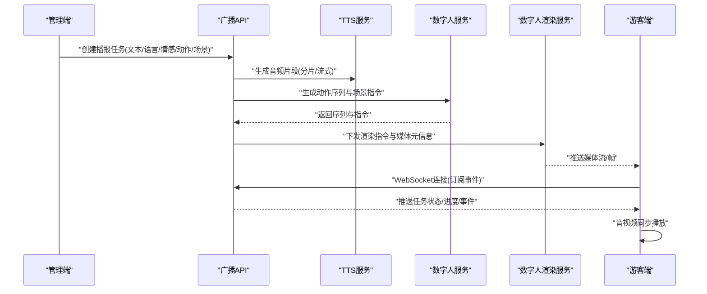
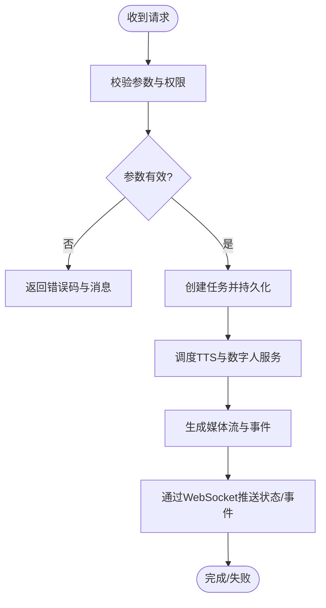
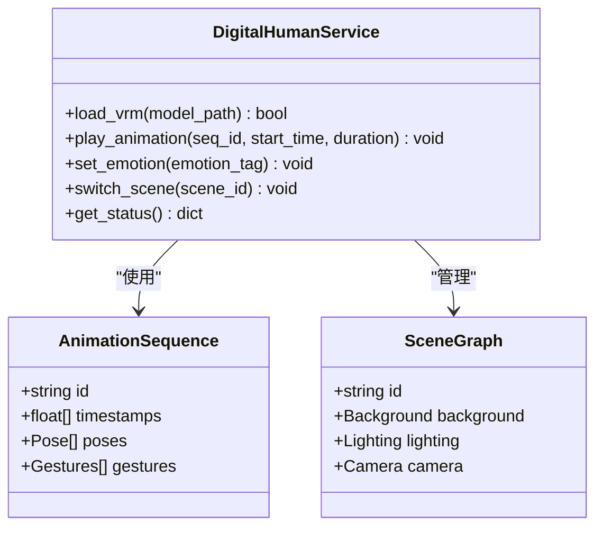
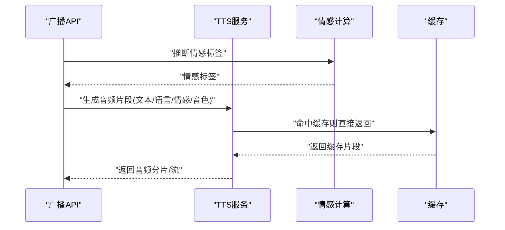
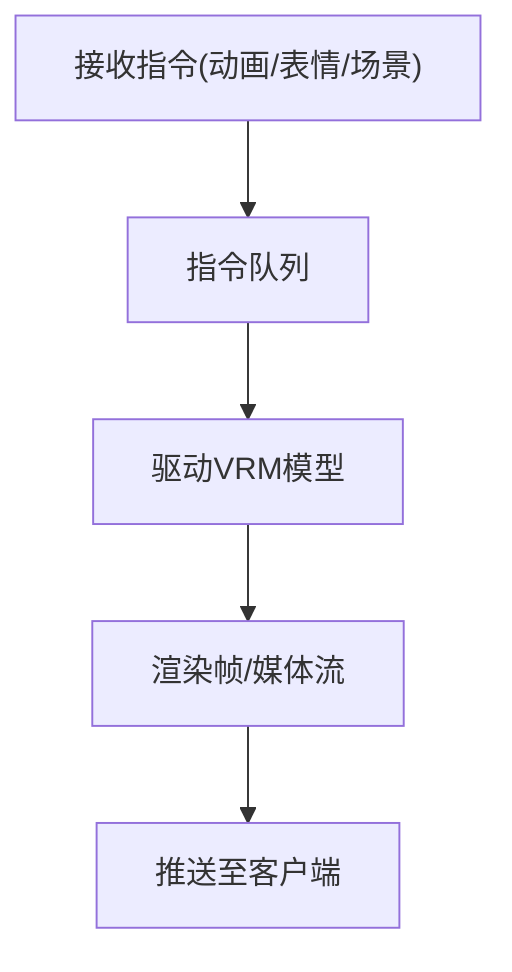
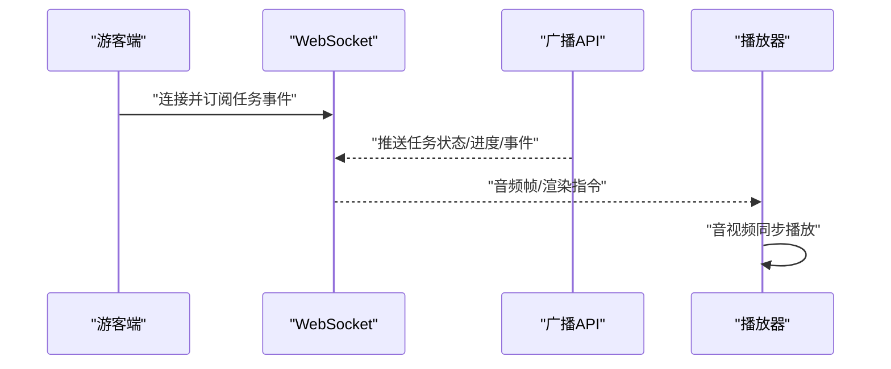
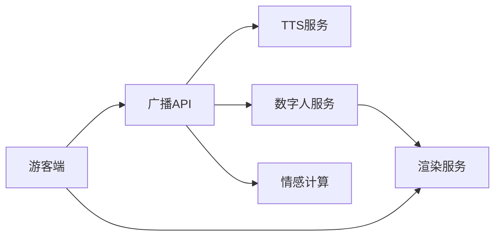

# 数字人广播API

<cite>
**本文引用的文件**   
- [backend/app/api/digital_human_broadcast.py](file://backend/app/api/digital_human_broadcast.py)
- [backend/app/services/digital_human.py](file://backend/app/services/digital_human.py)
- [backend/app/services/tts.py](file://backend/app/services/tts.py)
- [backend/app/core/sentiment.py](file://backend/app/core/sentiment.py)
- [backend/app/models/schemas.py](file://backend/app/models/schemas.py)
- [digital_human/server.py](file://digital_human/server.py)
- [frontend/tourist-app/src/components/DigitalHuman/VrmAvatar.vue](file://frontend/tourist-app/src/components/DigitalHuman/VrmAvatar.vue)
- [frontend/tourist-app/src/components/DigitalHuman/ImageAvatar.vue](file://frontend/tourist-app/src/components/DigitalHuman/ImageAvatar.vue)
- [frontend/tourist-app/src/components/DigitalHuman/DigitalHuman.vue](file://frontend/tourist-app/src/components/DigitalHuman/DigitalHuman.vue)
- [frontend/tourist-app/src/services/speech.ts](file://frontend/tourist-app/src/services/speech.ts)
- [frontend/admin-panel/src/views/AvatarConfig/AvatarView.vue](file://frontend/admin-panel/src/views/AvatarConfig/AvatarView.vue)
- [backend/app/config.py](file://backend/app/config.py)
</cite>

## 目录
1. [简介](#简介)
2. [项目结构](#项目结构)
3. [核心组件](#核心组件)
4. [架构总览](#架构总览)
5. [详细组件分析](#详细组件分析)
6. [依赖关系分析](#依赖关系分析)
7. [性能考虑](#性能考虑)
8. [故障排查指南](#故障排查指南)
9. [结论](#结论)
10. [附录：接口定义与参数说明](#附录接口定义与参数说明)

## 简介
本文件为“数字人广播服务”的完整接口文档，覆盖以下能力：
- 数字人形象展示（VRM模型、图片头像）
- 语音同步播放（TTS音频流、音视频同步）
- 动作控制（动画序列、手势、表情、场景切换）
- 播报任务生命周期管理（创建、状态查询、结果获取）
- 高级功能（多语言、情感表达、手势动作、场景切换）
- 实时通信（WebSocket协议）、音视频同步机制与性能优化策略

该服务由后端API网关、数字人渲染服务、前端播放器三部分组成，支持通过REST与WebSocket协同完成端到端的数字人播报。

## 项目结构
本项目采用前后端分离与微服务化组织方式：
- 后端API层：提供REST接口与WebSocket路由，编排业务逻辑
- 数字人服务：负责VRM加载、动画驱动、渲染输出
- 前端应用：游客端用于播放与交互，管理端用于配置与监控

图表来源
- [backend/app/api/digital_human_broadcast.py](file://backend/app/api/digital_human_broadcast.py)
- [backend/app/services/digital_human.py](file://backend/app/services/digital_human.py)
- [backend/app/services/tts.py](file://backend/app/services/tts.py)
- [backend/app/core/sentiment.py](file://backend/app/core/sentiment.py)
- [backend/app/models/schemas.py](file://backend/app/models/schemas.py)
- [backend/app/config.py](file://backend/app/config.py)
- [digital_human/server.py](file://digital_human/server.py)
- [frontend/tourist-app/src/components/DigitalHuman/DigitalHuman.vue](file://frontend/tourist-app/src/components/DigitalHuman/DigitalHuman.vue)
- [frontend/tourist-app/src/components/DigitalHuman/VrmAvatar.vue](file://frontend/tourist-app/src/components/DigitalHuman/VrmAvatar.vue)
- [frontend/tourist-app/src/components/DigitalHuman/ImageAvatar.vue](file://frontend/tourist-app/src/components/DigitalHuman/ImageAvatar.vue)
- [frontend/admin-panel/src/views/AvatarConfig/AvatarView.vue](file://frontend/admin-panel/src/views/AvatarConfig/AvatarView.vue)

章节来源
- [backend/app/api/digital_human_broadcast.py](file://backend/app/api/digital_human_broadcast.py)
- [backend/app/services/digital_human.py](file://backend/app/services/digital_human.py)
- [backend/app/services/tts.py](file://backend/app/services/tts.py)
- [backend/app/core/sentiment.py](file://backend/app/core/sentiment.py)
- [backend/app/models/schemas.py](file://backend/app/models/schemas.py)
- [backend/app/config.py](file://backend/app/config.py)
- [digital_human/server.py](file://digital_human/server.py)
- [frontend/tourist-app/src/components/DigitalHuman/DigitalHuman.vue](file://frontend/tourist-app/src/components/DigitalHuman/DigitalHuman.vue)
- [frontend/tourist-app/src/components/DigitalHuman/VrmAvatar.vue](file://frontend/tourist-app/src/components/DigitalHuman/VrmAvatar.vue)
- [frontend/tourist-app/src/components/DigitalHuman/ImageAvatar.vue](file://frontend/tourist-app/src/components/DigitalHuman/ImageAvatar.vue)
- [frontend/admin-panel/src/views/AvatarConfig/AvatarView.vue](file://frontend/admin-panel/src/views/AvatarConfig/AvatarView.vue)

## 核心组件
- 数字人广播API：对外暴露REST与WebSocket接口，负责任务编排、状态管理与事件分发
- 数字人服务：封装VRM加载、动画序列控制、手势与表情驱动、场景切换等能力
- TTS服务：文本转语音，生成可流式传输的音频片段
- 情感计算：根据输入文本或上下文推断情感标签，驱动表情与语气
- 数字人渲染服务：接收指令并驱动VRM模型渲染，输出视频帧或媒体流
- 前端播放器：游客端负责音视频同步播放、手势与表情呈现；管理端负责配置与监控

章节来源
- [backend/app/api/digital_human_broadcast.py](file://backend/app/api/digital_human_broadcast.py)
- [backend/app/services/digital_human.py](file://backend/app/services/digital_human.py)
- [backend/app/services/tts.py](file://backend/app/services/tts.py)
- [backend/app/core/sentiment.py](file://backend/app/core/sentiment.py)
- [digital_human/server.py](file://digital_human/server.py)
- [frontend/tourist-app/src/components/DigitalHuman/DigitalHuman.vue](file://frontend/tourist-app/src/components/DigitalHuman/DigitalHuman.vue)
- [frontend/tourist-app/src/components/DigitalHuman/VrmAvatar.vue](file://frontend/tourist-app/src/components/DigitalHuman/VrmAvatar.vue)
- [frontend/tourist-app/src/components/DigitalHuman/ImageAvatar.vue](file://frontend/tourist-app/src/components/DigitalHuman/ImageAvatar.vue)
- [frontend/admin-panel/src/views/AvatarConfig/AvatarView.vue](file://frontend/admin-panel/src/views/AvatarConfig/AvatarView.vue)

## 架构总览
数字人广播的整体流程如下：
- 管理端发起播报任务（文本、语言、情感、动作、场景等）
- 后端API调用TTS生成音频片段，调用数字人服务生成动作序列与场景指令
- 数字人渲染服务按时间轴驱动VRM模型，输出媒体流
- 游客端通过WebSocket订阅事件，拉取音频帧与渲染指令，实现音视频同步播放

图表来源
- [backend/app/api/digital_human_broadcast.py](file://backend/app/api/digital_human_broadcast.py)
- [backend/app/services/tts.py](file://backend/app/services/tts.py)
- [backend/app/services/digital_human.py](file://backend/app/services/digital_human.py)
- [digital_human/server.py](file://digital_human/server.py)
- [frontend/tourist-app/src/components/DigitalHuman/DigitalHuman.vue](file://frontend/tourist-app/src/components/DigitalHuman/DigitalHuman.vue)

## 详细组件分析

### 组件A：数字人广播API
职责：
- 提供REST接口：创建播报任务、查询任务状态、获取结果
- 提供WebSocket接口：实时推送任务状态、进度、事件与媒体元信息
- 编排TTS与数字人服务，协调时序与错误处理

关键流程：
- 创建任务：校验输入、生成任务ID、启动异步任务、返回初始状态
- 状态查询：读取任务状态机（待处理、进行中、完成、失败）
- 结果获取：返回媒体URL、字幕、动作日志、统计信息
- WebSocket：维护会话、推送事件、断线重连

图表来源
- [backend/app/api/digital_human_broadcast.py](file://backend/app/api/digital_human_broadcast.py)
- [backend/app/models/schemas.py](file://backend/app/models/schemas.py)

章节来源
- [backend/app/api/digital_human_broadcast.py](file://backend/app/api/digital_human_broadcast.py)
- [backend/app/models/schemas.py](file://backend/app/models/schemas.py)

### 组件B：数字人服务
职责：
- VRM模型加载与缓存
- 动画序列控制（行走、挥手、点头、手势等）
- 情感驱动（表情、语速、停顿）
- 场景切换（背景、灯光、相机角度）

数据结构与复杂度：
- 动画序列：基于时间戳的关键帧列表，O(n)遍历插值
- 情感映射：文本到情感标签的映射表，O(1)查找
- 场景图：节点树结构，切换时增量更新，避免全量重建

图表来源
- [backend/app/services/digital_human.py](file://backend/app/services/digital_human.py)

章节来源
- [backend/app/services/digital_human.py](file://backend/app/services/digital_human.py)

### 组件C：TTS服务
职责：
- 文本转语音，支持多语言与音色选择
- 分片生成与流式传输，降低首包延迟
- 与情感模块联动，调整语速、语调与停顿

图表来源
- [backend/app/services/tts.py](file://backend/app/services/tts.py)
- [backend/app/core/sentiment.py](file://backend/app/core/sentiment.py)

章节来源
- [backend/app/services/tts.py](file://backend/app/services/tts.py)
- [backend/app/core/sentiment.py](file://backend/app/core/sentiment.py)

### 组件D：数字人渲染服务
职责：
- 接收渲染指令（动画、表情、场景）
- 驱动VRM模型渲染，输出视频帧或媒体流
- 提供健康检查与资源监控

图表来源
- [digital_human/server.py](file://digital_human/server.py)

章节来源
- [digital_human/server.py](file://digital_human/server.py)

### 组件E：前端播放器与管理端
职责：
- 游客端：建立WebSocket连接、订阅事件、拉取音频帧与渲染指令、实现音视频同步
- 管理端：配置数字人形象、上传VRM模型、设置场景与动作库

图表来源
- [frontend/tourist-app/src/components/DigitalHuman/DigitalHuman.vue](file://frontend/tourist-app/src/components/DigitalHuman/DigitalHuman.vue)
- [frontend/tourist-app/src/components/DigitalHuman/VrmAvatar.vue](file://frontend/tourist-app/src/components/DigitalHuman/VrmAvatar.vue)
- [frontend/tourist-app/src/components/DigitalHuman/ImageAvatar.vue](file://frontend/tourist-app/src/components/DigitalHuman/ImageAvatar.vue)
- [frontend/tourist-app/src/services/speech.ts](file://frontend/tourist-app/src/services/speech.ts)
- [frontend/admin-panel/src/views/AvatarConfig/AvatarView.vue](file://frontend/admin-panel/src/views/AvatarConfig/AvatarView.vue)

章节来源
- [frontend/tourist-app/src/components/DigitalHuman/DigitalHuman.vue](file://frontend/tourist-app/src/components/DigitalHuman/DigitalHuman.vue)
- [frontend/tourist-app/src/components/DigitalHuman/VrmAvatar.vue](file://frontend/tourist-app/src/components/DigitalHuman/VrmAvatar.vue)
- [frontend/tourist-app/src/components/DigitalHuman/ImageAvatar.vue](file://frontend/tourist-app/src/components/DigitalHuman/ImageAvatar.vue)
- [frontend/tourist-app/src/services/speech.ts](file://frontend/tourist-app/src/services/speech.ts)
- [frontend/admin-panel/src/views/AvatarConfig/AvatarView.vue](file://frontend/admin-panel/src/views/AvatarConfig/AvatarView.vue)

## 依赖关系分析
- 耦合度：API层对服务层松耦合，通过接口契约协作；渲染服务独立部署，通过消息或HTTP/WebSocket通信
- 外部依赖：TTS引擎、VRM渲染器、WebSocket服务器、对象存储（媒体文件）
- 循环依赖：无直接循环依赖，服务间通过事件与回调解耦

图表来源
- [backend/app/api/digital_human_broadcast.py](file://backend/app/api/digital_human_broadcast.py)
- [backend/app/services/tts.py](file://backend/app/services/tts.py)
- [backend/app/services/digital_human.py](file://backend/app/services/digital_human.py)
- [backend/app/core/sentiment.py](file://backend/app/core/sentiment.py)
- [digital_human/server.py](file://digital_human/server.py)

章节来源
- [backend/app/api/digital_human_broadcast.py](file://backend/app/api/digital_human_broadcast.py)
- [backend/app/services/tts.py](file://backend/app/services/tts.py)
- [backend/app/services/digital_human.py](file://backend/app/services/digital_human.py)
- [backend/app/core/sentiment.py](file://backend/app/core/sentiment.py)
- [digital_human/server.py](file://digital_human/server.py)

## 性能考虑
- 首包延迟：TTS采用分片生成与流式传输，优先返回首个音频片段
- 渲染优化：VRM模型预加载与缓存，动画序列增量更新，减少CPU/GPU压力
- 网络优化：WebSocket复用连接，批量推送事件，压缩媒体元信息
- 同步机制：以音频时间为基准对齐动画与场景切换，避免漂移
- 容错与重试：任务失败自动重试，渲染服务心跳检测与健康检查
- 资源隔离：不同任务分配独立渲染实例，避免相互干扰

[本节为通用指导，不直接分析具体文件]

## 故障排查指南
常见问题与定位方法：
- 任务创建失败：检查参数校验与权限，查看API日志与错误码
- 音频不同步：确认时间戳与采样率一致，检查WebSocket推送顺序与丢包
- 渲染卡顿：观察渲染服务CPU/GPU占用，检查VRM模型大小与动画复杂度
- 情感异常：验证情感计算输入与映射表，检查TTS情感参数是否生效
- 断线重连：客户端实现指数退避重连，服务端保持会话状态

章节来源
- [backend/app/api/digital_human_broadcast.py](file://backend/app/api/digital_human_broadcast.py)
- [backend/app/services/digital_human.py](file://backend/app/services/digital_human.py)
- [backend/app/services/tts.py](file://backend/app/services/tts.py)
- [backend/app/core/sentiment.py](file://backend/app/core/sentiment.py)
- [digital_human/server.py](file://digital_human/server.py)

## 结论
数字人广播服务通过REST与WebSocket协同，实现了从任务创建到渲染播放的完整闭环。借助TTS与数字人服务的解耦设计，系统具备良好的扩展性与稳定性。建议在生产环境完善监控告警、限流熔断与灰度发布策略，进一步提升用户体验与系统可靠性。

[本节为总结性内容，不直接分析具体文件]

## 附录：接口定义与参数说明

### REST接口
- 创建播报任务
  - 路径：POST /api/broadcast/tasks
  - 请求体关键字段：文本、语言、情感、动作序列、场景、音色、质量等级
  - 响应：任务ID、初始状态、预计时长
- 查询任务状态
  - 路径：GET /api/broadcast/tasks/{task_id}
  - 响应：状态、进度、错误信息（如有）
- 获取任务结果
  - 路径：GET /api/broadcast/tasks/{task_id}/result
  - 响应：媒体URL、字幕、动作日志、统计信息

章节来源
- [backend/app/api/digital_human_broadcast.py](file://backend/app/api/digital_human_broadcast.py)
- [backend/app/models/schemas.py](file://backend/app/models/schemas.py)

### WebSocket事件
- 连接建立：客户端连接后订阅任务事件
- 事件类型：任务开始、进度更新、音频帧、渲染指令、任务完成、错误通知
- 消息格式：包含时间戳、序列号、负载数据（音频字节、动画关键帧、场景切换指令）

章节来源
- [backend/app/api/digital_human_broadcast.py](file://backend/app/api/digital_human_broadcast.py)
- [frontend/tourist-app/src/services/speech.ts](file://frontend/tourist-app/src/services/speech.ts)

### 配置参数
- VRM模型加载：模型路径、材质替换、LOD级别
- 音频流传输：采样率、编码格式、分片大小、缓冲策略
- 动画序列控制：关键帧精度、插值算法、手势权重
- 实时渲染：帧率、分辨率、GPU加速开关
- 多语言与情感：语言代码、情感标签映射、语速与语调参数
- 场景切换：场景ID、过渡动画、相机参数

章节来源
- [backend/app/config.py](file://backend/app/config.py)
- [backend/app/services/digital_human.py](file://backend/app/services/digital_human.py)
- [backend/app/services/tts.py](file://backend/app/services/tts.py)
- [digital_human/server.py](file://digital_human/server.py)
- [frontend/tourist-app/src/components/DigitalHuman/VrmAvatar.vue](file://frontend/tourist-app/src/components/DigitalHuman/VrmAvatar.vue)
- [frontend/tourist-app/src/components/DigitalHuman/ImageAvatar.vue](file://frontend/tourist-app/src/components/DigitalHuman/ImageAvatar.vue)
- [frontend/admin-panel/src/views/AvatarConfig/AvatarView.vue](file://frontend/admin-panel/src/views/AvatarConfig/AvatarView.vue)