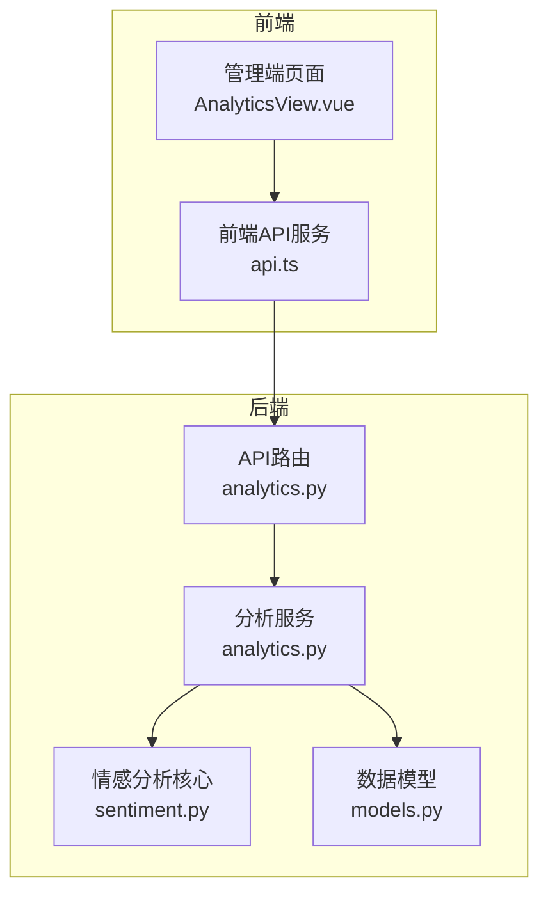
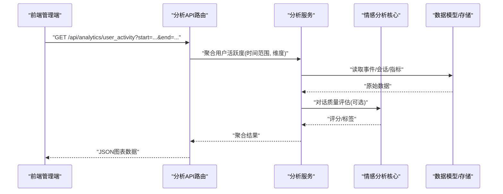
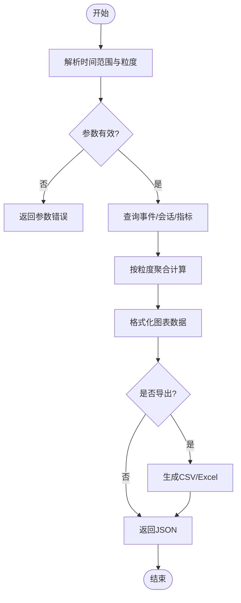
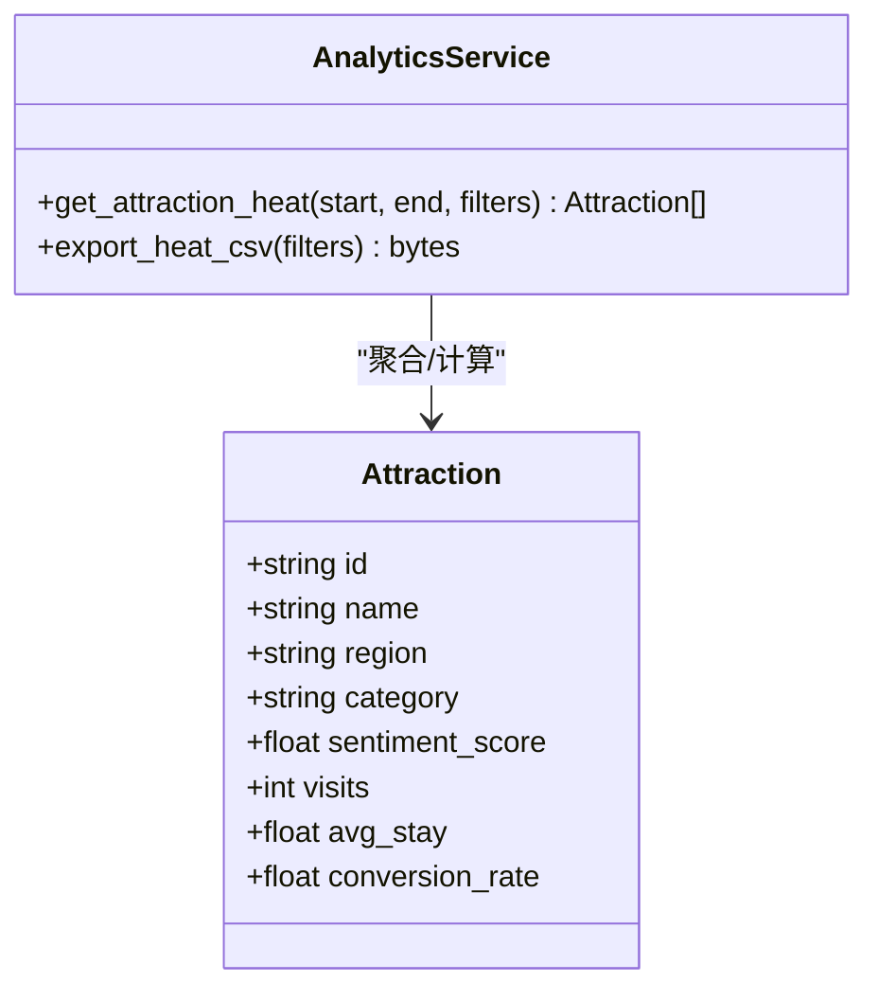
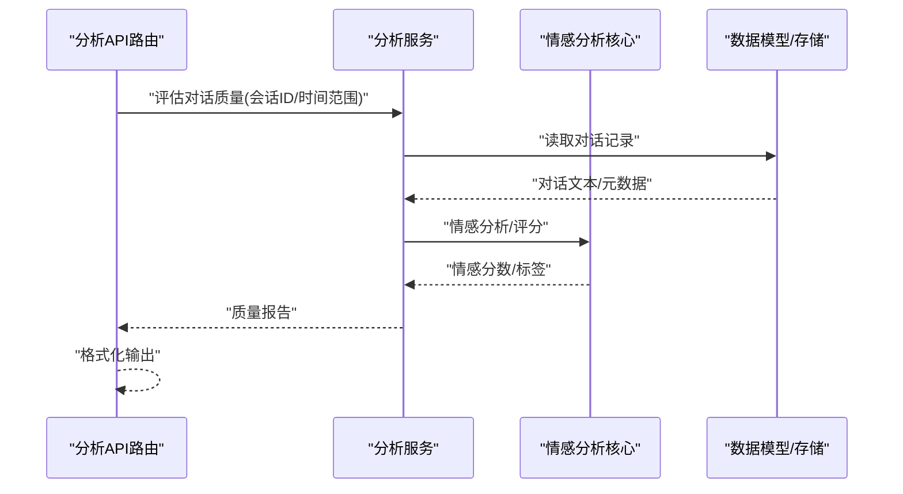
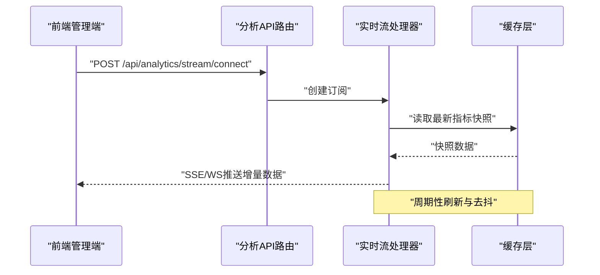
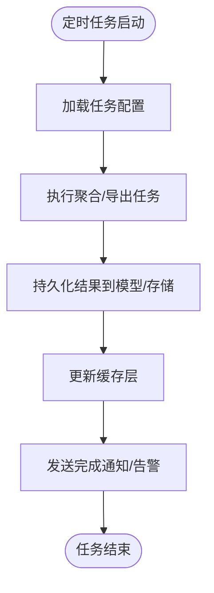
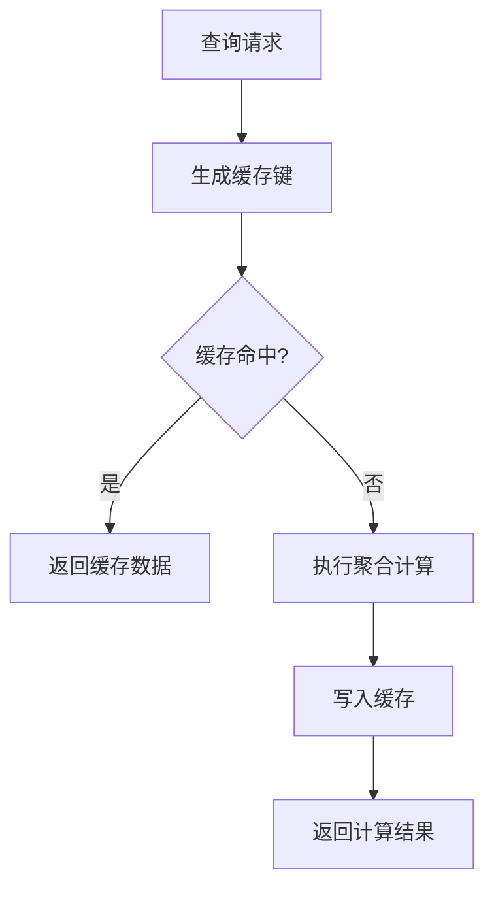
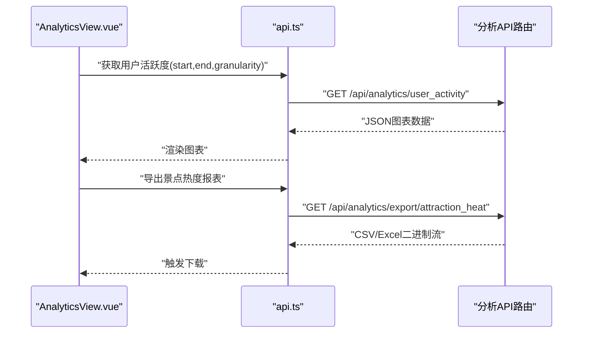
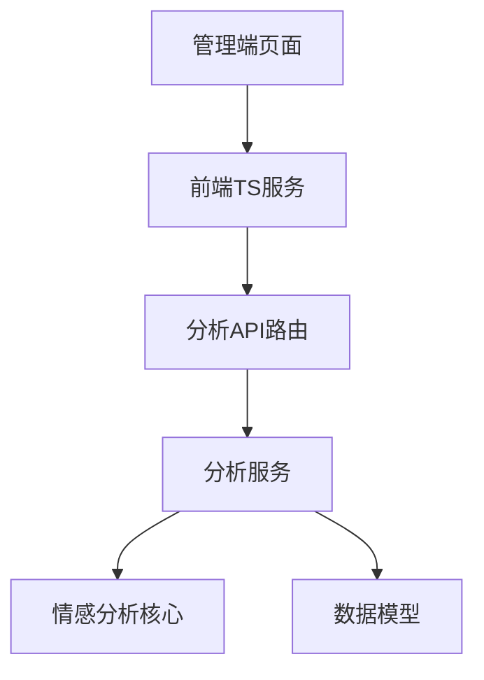

# 数据分析API

<cite>
**本文引用的文件**   
- [backend/app/api/analytics.py](file://backend/app/api/analytics.py)
- [backend/app/services/analytics.py](file://backend/app/services/analytics.py)
- [backend/app/db/models.py](file://backend/app/db/models.py)
- [backend/app/core/sentiment.py](file://backend/app/core/sentiment.py)
- [frontend/admin-panel/src/views/Analytics/AnalyticsView.vue](file://frontend/admin-panel/src/views/Analytics/AnalyticsView.vue)
- [frontend/admin-panel/src/services/api.ts](file://frontend/admin-panel/src/services/api.ts)
</cite>

## 目录
1. [简介](#简介)
2. [项目结构](#项目结构)
3. [核心组件](#核心组件)
4. [架构总览](#架构总览)
5. [详细组件分析](#详细组件分析)
6. [依赖分析](#依赖分析)
7. [性能考虑](#性能考虑)
8. [故障排查指南](#故障排查指南)
9. [结论](#结论)
10. [附录](#附录)

## 简介
本文件为“数据分析API”的完整接口文档，覆盖用户行为分析、系统使用统计、业务指标监控等数据的查询能力。文档重点说明：
- 时间范围筛选与数据聚合维度
- 图表数据格式与导出功能
- 典型场景调用示例（用户活跃度分析、景点热度统计、对话质量评估）
- 实时数据流接口、定时任务触发与数据缓存策略的技术实现
- 数据权限控制、隐私保护与性能优化方案

## 项目结构
后端采用分层设计：API层暴露REST接口，服务层封装分析与计算逻辑，数据模型层定义持久化结构；前端管理端提供可视化与分析页面，并通过TS服务调用后端API。

**图示来源**
- [backend/app/api/analytics.py](file://backend/app/api/analytics.py)
- [backend/app/services/analytics.py](file://backend/app/services/analytics.py)
- [backend/app/core/sentiment.py](file://backend/app/core/sentiment.py)
- [backend/app/db/models.py](file://backend/app/db/models.py)
- [frontend/admin-panel/src/views/Analytics/AnalyticsView.vue](file://frontend/admin-panel/src/views/Analytics/AnalyticsView.vue)
- [frontend/admin-panel/src/services/api.ts](file://frontend/admin-panel/src/services/api.ts)

**章节来源**
- [backend/app/api/analytics.py](file://backend/app/api/analytics.py)
- [backend/app/services/analytics.py](file://backend/app/services/analytics.py)
- [backend/app/core/sentiment.py](file://backend/app/core/sentiment.py)
- [backend/app/db/models.py](file://backend/app/db/models.py)
- [frontend/admin-panel/src/views/Analytics/AnalyticsView.vue](file://frontend/admin-panel/src/views/Analytics/AnalyticsView.vue)
- [frontend/admin-panel/src/services/api.ts](file://frontend/admin-panel/src/services/api.ts)

## 核心组件
- API路由层：负责接收请求参数、校验输入、调用服务层并返回统一响应格式。
- 分析服务层：封装用户活跃度、景点热度、对话质量等指标的计算与聚合逻辑。
- 情感分析核心：用于对话质量评估中的情绪倾向与满意度推断。
- 数据模型层：定义事件、会话、景点、指标等实体及关系，支撑查询与聚合。
- 前端管理端：提供分析视图与图表渲染，通过TS服务发起查询与导出。

**章节来源**
- [backend/app/api/analytics.py](file://backend/app/api/analytics.py)
- [backend/app/services/analytics.py](file://backend/app/services/analytics.py)
- [backend/app/core/sentiment.py](file://backend/app/core/sentiment.py)
- [backend/app/db/models.py](file://backend/app/db/models.py)
- [frontend/admin-panel/src/views/Analytics/AnalyticsView.vue](file://frontend/admin-panel/src/views/Analytics/AnalyticsView.vue)
- [frontend/admin-panel/src/services/api.ts](file://frontend/admin-panel/src/services/api.ts)

## 架构总览
整体流程：前端管理端通过TS服务调用后端分析API；API路由进行参数校验后委托分析服务执行聚合计算；必要时调用情感分析核心对对话内容进行评分；最终从数据模型层读取或写入指标结果，并以标准JSON返回给前端。

**图示来源**
- [backend/app/api/analytics.py](file://backend/app/api/analytics.py)
- [backend/app/services/analytics.py](file://backend/app/services/analytics.py)
- [backend/app/core/sentiment.py](file://backend/app/core/sentiment.py)
- [backend/app/db/models.py](file://backend/app/db/models.py)

## 详细组件分析

### 用户活跃度分析
- 目标：按日/周/月统计活跃用户数、会话数、平均时长、峰值时段等。
- 输入参数：
  - 时间范围：start、end（ISO 8601）
  - 聚合粒度：day、week、month
  - 过滤条件：渠道、设备类型、区域（可选）
- 输出字段（示例）：
  - time_bucket：时间桶
  - active_users：活跃用户数
  - sessions：会话数
  - avg_duration：平均时长（秒）
  - peak_hour：高峰小时
- 图表数据格式：数组对象列表，支持折线图、柱状图、热力图。
- 导出：支持CSV/Excel下载，包含明细与汇总。

**图示来源**
- [backend/app/api/analytics.py](file://backend/app/api/analytics.py)
- [backend/app/services/analytics.py](file://backend/app/services/analytics.py)
- [backend/app/db/models.py](file://backend/app/db/models.py)

**章节来源**
- [backend/app/api/analytics.py](file://backend/app/api/analytics.py)
- [backend/app/services/analytics.py](file://backend/app/services/analytics.py)
- [backend/app/db/models.py](file://backend/app/db/models.py)

### 景点热度统计
- 目标：统计各景点访问量、停留时长、转化率、口碑评分趋势。
- 输入参数：
  - 时间范围：start、end
  - 维度：region、category、attraction_id
  - 排序与分页：sort_by、page、page_size
- 输出字段（示例）：
  - attraction_id：景点ID
  - visits：访问次数
  - avg_stay：平均停留时长（秒）
  - conversion_rate：转化率
  - sentiment_score：情感评分
- 图表数据格式：支持排行表、地图热力、趋势线。
- 导出：支持按维度导出明细与汇总报表。

**图示来源**
- [backend/app/services/analytics.py](file://backend/app/services/analytics.py)
- [backend/app/db/models.py](file://backend/app/db/models.py)

**章节来源**
- [backend/app/api/analytics.py](file://backend/app/api/analytics.py)
- [backend/app/services/analytics.py](file://backend/app/services/analytics.py)
- [backend/app/db/models.py](file://backend/app/db/models.py)

### 对话质量评估
- 目标：基于对话内容的情感倾向、满意度、问题定位准确率等指标评估对话质量。
- 输入参数：
  - 会话ID或时间范围
  - 语言设置、阈值配置
- 处理流程：
  - 拉取对话记录
  - 调用情感分析核心进行评分
  - 生成质量报告与指标
- 输出字段（示例）：
  - conversation_id：会话ID
  - sentiment：情感分数
  - satisfaction：满意度等级
  - quality_score：综合质量分
  - tags：问题标签集合
- 图表数据格式：雷达图、分布直方图、趋势对比。

**图示来源**
- [backend/app/api/analytics.py](file://backend/app/api/analytics.py)
- [backend/app/services/analytics.py](file://backend/app/services/analytics.py)
- [backend/app/core/sentiment.py](file://backend/app/core/sentiment.py)
- [backend/app/db/models.py](file://backend/app/db/models.py)

**章节来源**
- [backend/app/api/analytics.py](file://backend/app/api/analytics.py)
- [backend/app/services/analytics.py](file://backend/app/services/analytics.py)
- [backend/app/core/sentiment.py](file://backend/app/core/sentiment.py)
- [backend/app/db/models.py](file://backend/app/db/models.py)

### 实时数据流接口
- 目标：提供近实时的指标推送，如在线人数、热点事件、告警信息。
- 技术实现：
  - 服务端事件（SSE）或WebSocket通道
  - 增量更新与去抖策略
  - 客户端重连与断线恢复
- 前端集成：
  - 建立连接、订阅主题、渲染动态图表
  - 错误处理与降级显示

**图示来源**
- [backend/app/api/analytics.py](file://backend/app/api/analytics.py)
- [backend/app/services/analytics.py](file://backend/app/services/analytics.py)

**章节来源**
- [backend/app/api/analytics.py](file://backend/app/api/analytics.py)
- [backend/app/services/analytics.py](file://backend/app/services/analytics.py)

### 定时任务触发
- 目标：定期执行指标预计算、报表生成、缓存预热。
- 常见任务：
  - 每小时聚合用户活跃度
  - 每日生成景点热度报表
  - 每周导出质量评估报告
- 实现要点：
  - 任务调度器（如Celery/APScheduler）
  - 幂等性与重试机制
  - 失败告警与日志追踪

**图示来源**
- [backend/app/services/analytics.py](file://backend/app/services/analytics.py)
- [backend/app/db/models.py](file://backend/app/db/models.py)

**章节来源**
- [backend/app/services/analytics.py](file://backend/app/services/analytics.py)
- [backend/app/db/models.py](file://backend/app/db/models.py)

### 数据缓存策略
- 目标：降低重复计算开销，提升查询响应速度。
- 策略：
  - 多级缓存：内存缓存+分布式缓存
  - 缓存键：按时间范围、聚合维度、过滤条件组合
  - 失效策略：TTL过期、写穿透更新、主动失效
  - 一致性：读写分离与版本戳
- 适用场景：
  - 热门指标（用户活跃度、景点热度）
  - 报表导出前的中间结果

**图示来源**
- [backend/app/services/analytics.py](file://backend/app/services/analytics.py)

**章节来源**
- [backend/app/services/analytics.py](file://backend/app/services/analytics.py)

### 数据权限控制与隐私保护
- 权限控制：
  - 角色与资源绑定（管理员、运营、访客）
  - 行级数据隔离（按区域/部门）
  - 审计日志与操作追溯
- 隐私保护：
  - 敏感字段脱敏（手机号、邮箱）
  - 最小化采集原则
  - 数据留存周期与删除策略
- 合规要求：
  - 同意与授权记录
  - 跨境数据传输限制

**章节来源**
- [backend/app/api/analytics.py](file://backend/app/api/analytics.py)
- [backend/app/services/analytics.py](file://backend/app/services/analytics.py)
- [backend/app/db/models.py](file://backend/app/db/models.py)

### 前端集成与调用示例
- 管理端页面：
  - 展示用户活跃度、景点热度、对话质量评估图表
  - 支持时间范围选择、维度切换、导出报表
- TS服务：
  - 封装HTTP请求、错误处理、分页与排序
  - 提供统一的查询与导出方法

**图示来源**
- [frontend/admin-panel/src/views/Analytics/AnalyticsView.vue](file://frontend/admin-panel/src/views/Analytics/AnalyticsView.vue)
- [frontend/admin-panel/src/services/api.ts](file://frontend/admin-panel/src/services/api.ts)
- [backend/app/api/analytics.py](file://backend/app/api/analytics.py)

**章节来源**
- [frontend/admin-panel/src/views/Analytics/AnalyticsView.vue](file://frontend/admin-panel/src/views/Analytics/AnalyticsView.vue)
- [frontend/admin-panel/src/services/api.ts](file://frontend/admin-panel/src/services/api.ts)
- [backend/app/api/analytics.py](file://backend/app/api/analytics.py)

## 依赖分析
- 模块耦合：
  - API路由依赖分析服务，分析服务依赖情感分析核心与数据模型
  - 前端TS服务依赖管理端页面与后端API
- 外部依赖：
  - 缓存层（内存/分布式）
  - 任务调度器（定时任务）
  - 实时通信（SSE/WebSocket）

**图示来源**
- [backend/app/api/analytics.py](file://backend/app/api/analytics.py)
- [backend/app/services/analytics.py](file://backend/app/services/analytics.py)
- [backend/app/core/sentiment.py](file://backend/app/core/sentiment.py)
- [backend/app/db/models.py](file://backend/app/db/models.py)
- [frontend/admin-panel/src/views/Analytics/AnalyticsView.vue](file://frontend/admin-panel/src/views/Analytics/AnalyticsView.vue)
- [frontend/admin-panel/src/services/api.ts](file://frontend/admin-panel/src/services/api.ts)

**章节来源**
- [backend/app/api/analytics.py](file://backend/app/api/analytics.py)
- [backend/app/services/analytics.py](file://backend/app/services/analytics.py)
- [backend/app/core/sentiment.py](file://backend/app/core/sentiment.py)
- [backend/app/db/models.py](file://backend/app/db/models.py)
- [frontend/admin-panel/src/views/Analytics/AnalyticsView.vue](file://frontend/admin-panel/src/views/Analytics/AnalyticsView.vue)
- [frontend/admin-panel/src/services/api.ts](file://frontend/admin-panel/src/services/api.ts)

## 性能考虑
- 查询优化：
  - 索引设计：时间戳、维度字段、关联键
  - 分页与游标：避免全表扫描
  - 预聚合：热点指标提前计算
- 缓存优化：
  - 合理TTL与失效策略
  - 缓存穿透防护（布隆过滤器）
- 并发与限流：
  - 请求限流与熔断
  - 异步任务队列
- 传输优化：
  - 压缩响应体
  - 增量更新与去抖

[本节为通用指导，不直接分析具体文件]

## 故障排查指南
- 常见问题：
  - 参数校验失败：检查时间范围、粒度、分页参数
  - 缓存未命中：确认缓存键生成规则与失效策略
  - 实时流断开：检查网络与重连逻辑
- 日志与监控：
  - 关键路径日志埋点
  - 指标看板与告警阈值
- 回滚与降级：
  - 缓存降级至数据库直查
  - 实时流降级为轮询

**章节来源**
- [backend/app/api/analytics.py](file://backend/app/api/analytics.py)
- [backend/app/services/analytics.py](file://backend/app/services/analytics.py)

## 结论
本数据分析API以清晰的分层架构与标准化接口，支撑用户活跃度、景点热度、对话质量等多维度的分析与可视化。通过实时流、定时任务与缓存策略，系统在性能与体验上达到平衡；同时结合权限控制与隐私保护措施，确保数据安全与合规。建议在生产环境完善监控与告警体系，持续优化查询与缓存策略，以提升整体稳定性与可维护性。

## 附录
- 术语说明：
  - 时间桶：按天/周/月划分的时间区间
  - 聚合维度：按渠道、设备、区域等分组统计
  - 情感评分：基于对话内容的满意度与倾向性量化
- 参考实现位置：
  - API路由与导出：见分析API路由文件
  - 服务层聚合与缓存：见分析服务文件
  - 情感分析核心：见情感分析核心文件
  - 数据模型与实体：见数据模型文件
  - 前端管理与调用：见管理端页面与TS服务文件

**章节来源**
- [backend/app/api/analytics.py](file://backend/app/api/analytics.py)
- [backend/app/services/analytics.py](file://backend/app/services/analytics.py)
- [backend/app/core/sentiment.py](file://backend/app/core/sentiment.py)
- [backend/app/db/models.py](file://backend/app/db/models.py)
- [frontend/admin-panel/src/views/Analytics/AnalyticsView.vue](file://frontend/admin-panel/src/views/Analytics/AnalyticsView.vue)
- [frontend/admin-panel/src/services/api.ts](file://frontend/admin-panel/src/services/api.ts)