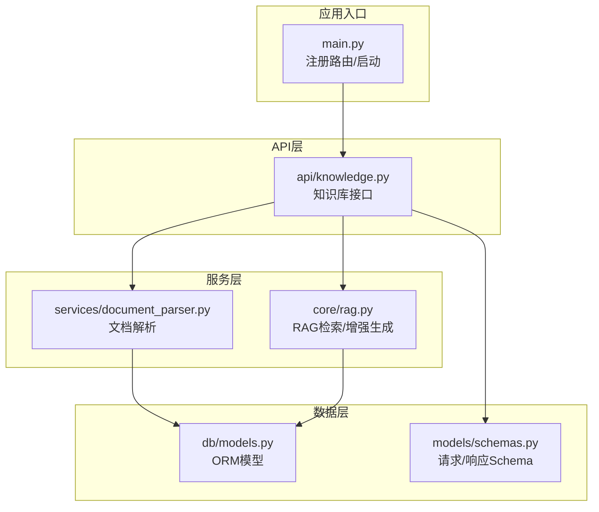
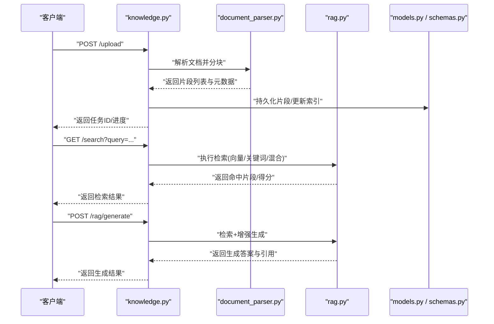
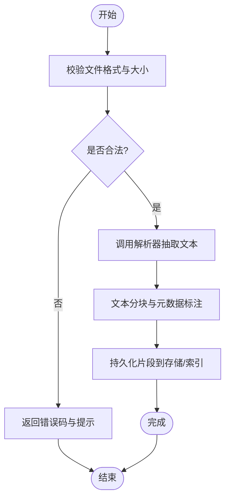
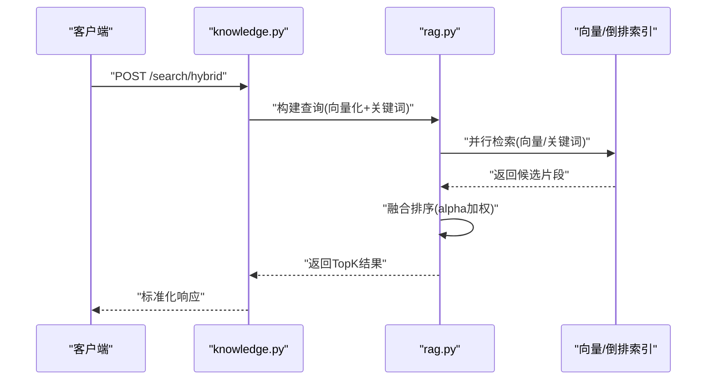
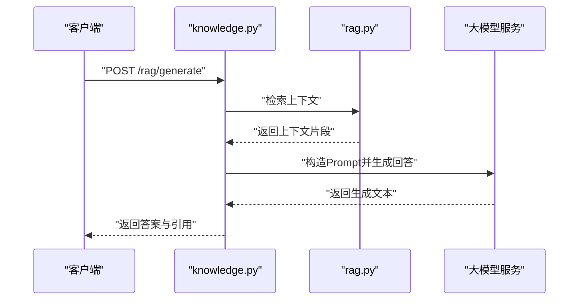
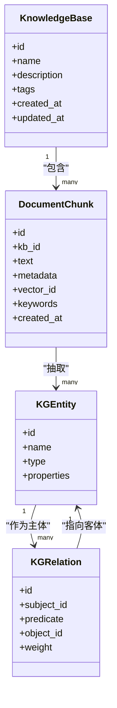
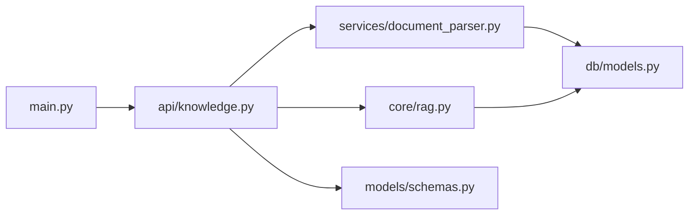

# 知识库管理API

<cite>
**本文引用的文件**   
- [backend/app/api/knowledge.py](file://backend/app/api/knowledge.py)
- [backend/app/services/document_parser.py](file://backend/app/services/document_parser.py)
- [backend/app/core/rag.py](file://backend/app/core/rag.py)
- [backend/app/db/models.py](file://backend/app/db/models.py)
- [backend/app/models/schemas.py](file://backend/app/models/schemas.py)
- [backend/app/main.py](file://backend/app/main.py)
</cite>

## 目录
1. [简介](#简介)
2. [项目结构](#项目结构)
3. [核心组件](#核心组件)
4. [架构总览](#架构总览)
5. [详细组件分析](#详细组件分析)
6. [依赖关系分析](#依赖关系分析)
7. [性能考虑](#性能考虑)
8. [故障排查指南](#故障排查指南)
9. [结论](#结论)
10. [附录](#附录)

## 简介
本文件为“知识库管理API”的完整接口文档，覆盖知识库的CRUD、文档上传与解析、索引构建、检索查询（向量检索、关键词搜索、混合检索）、RAG检索增强生成、知识图谱构建与实体关系提取等能力。同时提供批量处理与异步任务管理说明、错误处理策略、进度跟踪方法与性能优化建议，帮助开发者快速集成与高效使用。

## 项目结构
后端采用分层设计：API层暴露REST接口，服务层封装业务逻辑（文档解析、RAG检索），数据模型与数据库会话位于db层，请求/响应Schema定义在models层，应用入口在main.py中注册路由。

图表来源
- [backend/app/main.py](file://backend/app/main.py)
- [backend/app/api/knowledge.py](file://backend/app/api/knowledge.py)
- [backend/app/services/document_parser.py](file://backend/app/services/document_parser.py)
- [backend/app/core/rag.py](file://backend/app/core/rag.py)
- [backend/app/db/models.py](file://backend/app/db/models.py)
- [backend/app/models/schemas.py](file://backend/app/models/schemas.py)

章节来源
- [backend/app/main.py](file://backend/app/main.py)
- [backend/app/api/knowledge.py](file://backend/app/api/knowledge.py)
- [backend/app/services/document_parser.py](file://backend/app/services/document_parser.py)
- [backend/app/core/rag.py](file://backend/app/core/rag.py)
- [backend/app/db/models.py](file://backend/app/db/models.py)
- [backend/app/models/schemas.py](file://backend/app/models/schemas.py)

## 核心组件
- 知识库API控制器：负责接收请求、参数校验、调用服务层、返回统一响应格式。
- 文档解析服务：支持多格式文档读取、文本抽取、分块与元数据标注。
- RAG核心：实现向量检索、关键词检索、混合检索以及基于检索结果的增强生成。
- 数据模型与Schema：定义知识库条目、文档片段、检索结果、任务状态等数据结构。

章节来源
- [backend/app/api/knowledge.py](file://backend/app/api/knowledge.py)
- [backend/app/services/document_parser.py](file://backend/app/services/document_parser.py)
- [backend/app/core/rag.py](file://backend/app/core/rag.py)
- [backend/app/db/models.py](file://backend/app/db/models.py)
- [backend/app/models/schemas.py](file://backend/app/models/schemas.py)

## 架构总览
知识库管理API的整体流程如下：客户端通过HTTP调用API，API层进行参数校验并委托服务层执行；文档解析服务将文件转换为结构化片段并持久化；RAG核心根据查询条件进行检索或增强生成；所有操作均遵循统一的请求/响应Schema。

图表来源
- [backend/app/api/knowledge.py](file://backend/app/api/knowledge.py)
- [backend/app/services/document_parser.py](file://backend/app/services/document_parser.py)
- [backend/app/core/rag.py](file://backend/app/core/rag.py)
- [backend/app/db/models.py](file://backend/app/db/models.py)
- [backend/app/models/schemas.py](file://backend/app/models/schemas.py)

## 详细组件分析

### 知识库CRUD接口
- 创建知识库
  - 方法：POST
  - 路径：/knowledgebases
  - 请求体：名称、描述、标签等（参考schemas）
  - 响应：知识库对象（含id、创建时间等）
- 获取知识库详情
  - 方法：GET
  - 路径：/knowledgebases/{kb_id}
  - 响应：知识库对象
- 更新知识库
  - 方法：PATCH
  - 路径：/knowledgebases/{kb_id}
  - 请求体：可更新字段
  - 响应：更新后的知识库对象
- 删除知识库
  - 方法：DELETE
  - 路径：/knowledgebases/{kb_id}
  - 响应：成功状态码
- 列出知识库
  - 方法：GET
  - 路径：/knowledgebases
  - 查询参数：分页、过滤、排序
  - 响应：知识库列表

章节来源
- [backend/app/api/knowledge.py](file://backend/app/api/knowledge.py)
- [backend/app/models/schemas.py](file://backend/app/models/schemas.py)
- [backend/app/db/models.py](file://backend/app/db/models.py)

### 文档上传与解析
- 单文件上传
  - 方法：POST
  - 路径：/documents/upload
  - 内容类型：multipart/form-data
  - 表单字段：file、metadata（可选）
  - 支持格式：PDF、Word（doc/docx）、TXT、Markdown、HTML、CSV、JSON
  - 限制：最大文件大小、并发数、白名单扩展名
  - 响应：任务ID或解析结果摘要
- 批量上传
  - 方法：POST
  - 路径：/documents/batch_upload
  - 请求体：文件列表或URL列表（视实现而定）
  - 响应：批次ID与任务列表
- 解析任务状态
  - 方法：GET
  - 路径：/documents/tasks/{task_id}
  - 响应：任务状态、进度百分比、错误信息（如有）
- 解析回调/轮询
  - 支持事件回调或客户端轮询两种方式

图表来源
- [backend/app/api/knowledge.py](file://backend/app/api/knowledge.py)
- [backend/app/services/document_parser.py](file://backend/app/services/document_parser.py)

章节来源
- [backend/app/api/knowledge.py](file://backend/app/api/knowledge.py)
- [backend/app/services/document_parser.py](file://backend/app/services/document_parser.py)

### 索引构建与管理
- 触发索引重建
  - 方法：POST
  - 路径：/indexes/rebuild
  - 查询参数：kb_id（可选，指定知识库范围）
  - 响应：任务ID
- 查看索引状态
  - 方法：GET
  - 路径：/indexes/status
  - 响应：索引版本、统计信息、最近更新时间
- 增量更新
  - 方法：POST
  - 路径：/indexes/update
  - 请求体：变更的文件ID列表
  - 响应：任务ID

章节来源
- [backend/app/api/knowledge.py](file://backend/app/api/knowledge.py)

### 检索查询接口
- 向量检索
  - 方法：POST
  - 路径：/search/vector
  - 请求体：query、top_k、filters（kb_id、时间范围等）
  - 响应：片段列表、相似度分数、来源元数据
- 关键词检索
  - 方法：POST
  - 路径：/search/keyword
  - 请求体：query、top_k、filters
  - 响应：片段列表、相关度评分、高亮片段
- 混合检索
  - 方法：POST
  - 路径：/search/hybrid
  - 请求体：query、top_k、alpha（向量权重）、filters
  - 响应：融合排序后的片段列表与综合得分
- 分页与过滤
  - 通用查询参数：page、size、sort_by、order

图表来源
- [backend/app/api/knowledge.py](file://backend/app/api/knowledge.py)
- [backend/app/core/rag.py](file://backend/app/core/rag.py)

章节来源
- [backend/app/api/knowledge.py](file://backend/app/api/knowledge.py)
- [backend/app/core/rag.py](file://backend/app/core/rag.py)

### RAG检索增强生成
- 增强生成
  - 方法：POST
  - 路径：/rag/generate
  - 请求体：query、context_mode（retrieve_only/generate）、top_k、temperature、max_tokens、filters
  - 响应：生成答案、引用片段列表、置信度
- 流式输出（可选）
  - 方法：POST
  - 路径：/rag/generate/stream
  - 响应：SSE或WebSocket增量片段

图表来源
- [backend/app/api/knowledge.py](file://backend/app/api/knowledge.py)
- [backend/app/core/rag.py](file://backend/app/core/rag.py)

章节来源
- [backend/app/api/knowledge.py](file://backend/app/api/knowledge.py)
- [backend/app/core/rag.py](file://backend/app/core/rag.py)

### 知识图谱构建与实体关系提取
- 构建图谱
  - 方法：POST
  - 路径：/kg/build
  - 请求体：kb_id、strategy（full/incremental）、entity_types、relation_types
  - 响应：任务ID
- 查询图谱
  - 方法：GET
  - 路径：/kg/query
  - 查询参数：subject、predicate、object、limit
  - 响应：三元组列表
- 实体消歧与合并
  - 方法：POST
  - 路径：/kg/deduplicate
  - 请求体：entity_list、merge_strategy
  - 响应：合并结果与影响范围

图表来源
- [backend/app/db/models.py](file://backend/app/db/models.py)
- [backend/app/api/knowledge.py](file://backend/app/api/knowledge.py)

章节来源
- [backend/app/api/knowledge.py](file://backend/app/api/knowledge.py)
- [backend/app/db/models.py](file://backend/app/db/models.py)

### 异步任务管理与进度跟踪
- 任务提交
  - 方法：POST
  - 路径：/tasks
  - 请求体：type（parse/index/kg_build）、payload
  - 响应：task_id
- 查询任务状态
  - 方法：GET
  - 路径：/tasks/{task_id}
  - 响应：status、progress、result、error
- 取消任务
  - 方法：DELETE
  - 路径：/tasks/{task_id}
  - 响应：确认消息
- 批量任务
  - 方法：POST
  - 路径：/tasks/batch
  - 请求体：tasks数组
  - 响应：批次ID与子任务列表

章节来源
- [backend/app/api/knowledge.py](file://backend/app/api/knowledge.py)

### 错误处理规范
- 统一错误响应结构
  - code：错误码
  - message：人类可读消息
  - details：附加信息（如字段校验失败）
- 常见错误码
  - 400：参数校验失败
  - 404：资源不存在
  - 413：文件过大
  - 415：不支持的媒体类型
  - 429：限流
  - 500：服务器内部错误
- 重试与幂等
  - 对幂等接口建议使用client_id去重
  - 网络异常时客户端指数退避重试

章节来源
- [backend/app/api/knowledge.py](file://backend/app/api/knowledge.py)
- [backend/app/models/schemas.py](file://backend/app/models/schemas.py)

## 依赖关系分析
- API层依赖服务层与Schema层
- 服务层依赖数据模型与外部索引/向量库
- main.py负责路由注册与应用生命周期管理

图表来源
- [backend/app/main.py](file://backend/app/main.py)
- [backend/app/api/knowledge.py](file://backend/app/api/knowledge.py)
- [backend/app/services/document_parser.py](file://backend/app/services/document_parser.py)
- [backend/app/core/rag.py](file://backend/app/core/rag.py)
- [backend/app/db/models.py](file://backend/app/db/models.py)
- [backend/app/models/schemas.py](file://backend/app/models/schemas.py)

章节来源
- [backend/app/main.py](file://backend/app/main.py)
- [backend/app/api/knowledge.py](file://backend/app/api/knowledge.py)
- [backend/app/services/document_parser.py](file://backend/app/services/document_parser.py)
- [backend/app/core/rag.py](file://backend/app/core/rag.py)
- [backend/app/db/models.py](file://backend/app/db/models.py)
- [backend/app/models/schemas.py](file://backend/app/models/schemas.py)

## 性能考虑
- 文档解析
  - 启用并行解析与内存池复用
  - 合理设置分块大小与重叠比例，平衡召回与延迟
- 索引与检索
  - 向量索引采用近似最近邻算法，调优top_k与阈值
  - 关键词索引建立倒排表，支持前缀匹配与同义词扩展
  - 混合检索权重alpha按场景校准
- 缓存与预热
  - 热点查询结果短期缓存
  - 新入库文档完成后预计算向量与关键词
- 批处理与异步
  - 大批量任务拆分为子任务，避免长事务
  - 使用队列削峰填谷，控制并发度
- 资源监控
  - 记录解析耗时、检索延迟、生成token数
  - 告警阈值与自动扩缩容策略

[本节为通用指导，不直接分析具体文件]

## 故障排查指南
- 上传失败
  - 检查文件格式与大小限制
  - 查看任务状态与错误日志定位解析阶段问题
- 检索无结果
  - 确认索引已构建且最新
  - 调整top_k与alpha，扩大过滤范围
- 生成质量不佳
  - 调整temperature与max_tokens
  - 增加检索上下文长度或引入更多相关片段
- 任务卡住
  - 检查任务队列与消费者健康状态
  - 必要时取消并重试

章节来源
- [backend/app/api/knowledge.py](file://backend/app/api/knowledge.py)
- [backend/app/services/document_parser.py](file://backend/app/services/document_parser.py)
- [backend/app/core/rag.py](file://backend/app/core/rag.py)

## 结论
本API围绕知识库全生命周期提供端到端能力：从文档上传、解析、索引构建，到多维检索与RAG增强生成，再到知识图谱构建与实体关系提取。通过统一的Schema与异步任务机制，系统具备良好的可扩展性与稳定性。建议在生产环境结合监控与限流策略，持续优化检索质量与响应性能。

[本节为总结性内容，不直接分析具体文件]

## 附录
- 术语
  - 向量检索：基于语义相似度的检索
  - 关键词检索：基于词项匹配的检索
  - 混合检索：向量与关键词融合排序
  - RAG：检索增强生成
- 最佳实践
  - 为不同领域配置不同的分块策略与检索权重
  - 定期清理无效片段与低质量实体
  - 对高频查询实施缓存与预热

[本节为补充信息，不直接分析具体文件]