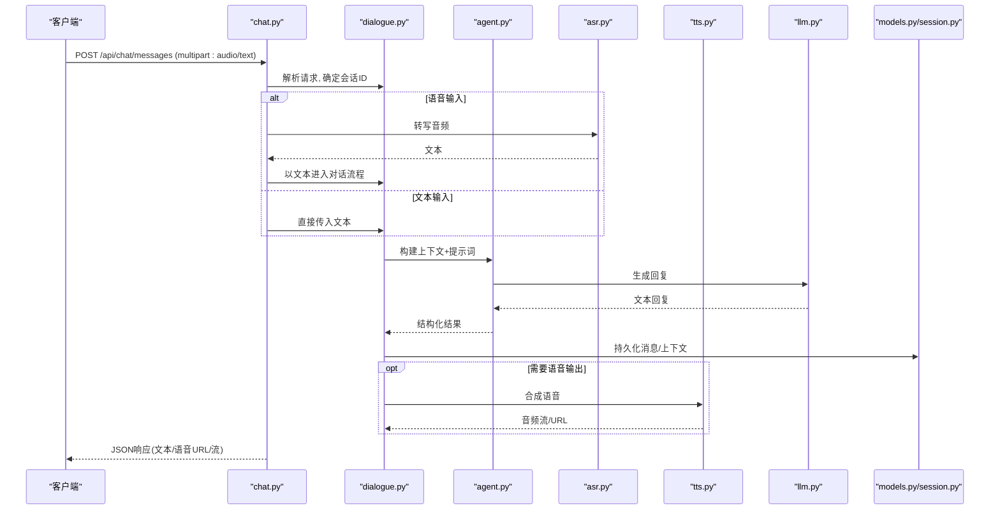
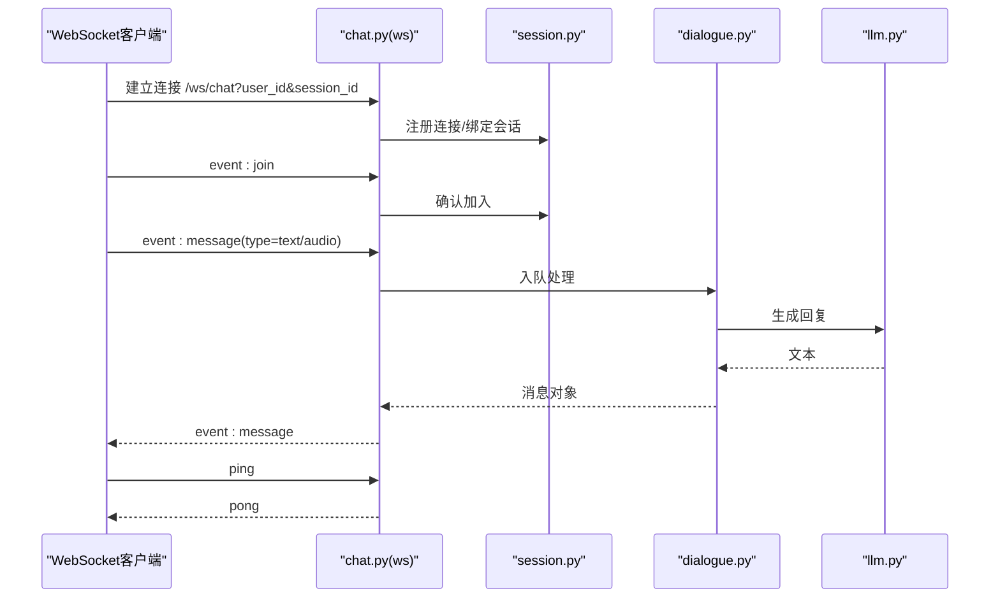
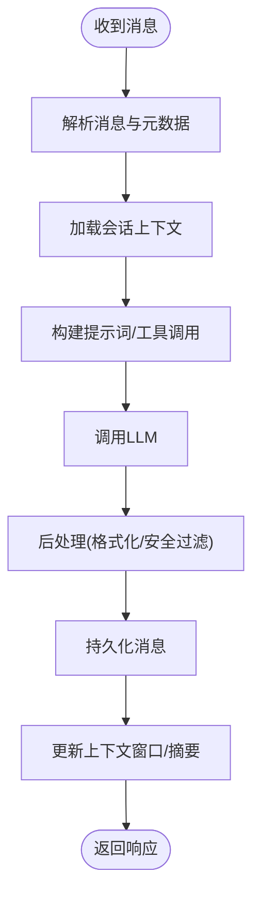
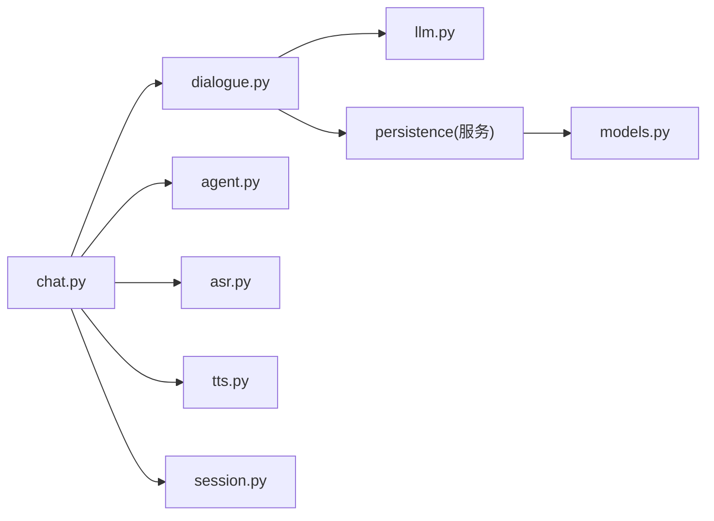

# 聊天对话API

<cite>
**本文引用的文件**   
- [backend/app/api/chat.py](file://backend/app/api/chat.py)
- [backend/app/core/dialogue.py](file://backend/app/core/dialogue.py)
- [backend/app/core/agent.py](file://backend/app/core/agent.py)
- [backend/app/services/asr.py](file://backend/app/services/asr.py)
- [backend/app/services/tts.py](file://backend/app/services/tts.py)
- [backend/app/services/llm.py](file://backend/app/services/llm.py)
- [backend/app/db/models.py](file://backend/app/db/models.py)
- [backend/app/db/session.py](file://backend/app/db/session.py)
- [backend/app/models/schemas.py](file://backend/app/models/schemas.py)
- [frontend/tourist-app/src/services/api.ts](file://frontend/tourist-app/src/services/api.ts)
- [frontend/tourist-app/src/stores/chat.ts](file://frontend/tourist-app/src/stores/chat.ts)
</cite>

## 目录
1. [简介](#简介)
2. [项目结构](#项目结构)
3. [核心组件](#核心组件)
4. [架构总览](#架构总览)
5. [详细组件分析](#详细组件分析)
6. [依赖分析](#依赖分析)
7. [性能考虑](#性能考虑)
8. [故障排查指南](#故障排查指南)
9. [结论](#结论)
10. [附录](#附录)

## 简介
本文件为SmartTour项目的“聊天对话API”技术文档，覆盖REST与WebSocket两类接口：
- REST API：发送消息、获取对话历史、管理会话状态（创建/切换/清理）、多模态输入（文本/语音）处理。
- WebSocket：实时连接建立、消息推送、事件类型定义、断线重连机制。
- 对话上下文管理：会话级上下文维护、多轮对话记忆、智能代理集成（LLM/RAG/ASR/TTS）。

## 项目结构
后端采用分层架构：
- API层：路由与请求校验（FastAPI）
- 核心逻辑：对话编排、Agent调度、RAG检索
- 服务层：ASR、TTS、LLM调用、持久化
- 数据层：数据库模型与会话管理
- 前端：游客端与服务端API交互、聊天状态管理

```mermaid
graph TB
subgraph "客户端"
FE["游客端前端<br/>api.ts / chat.ts"]
end
subgraph "后端API层"
APIChat["chat.py<br/>REST + WebSocket路由"]
end
subgraph "核心逻辑"
Dialogue["dialogue.py<br/>对话编排/上下文"]
Agent["agent.py<br/>智能代理调度"]
end
subgraph "服务层"
ASR["asr.py<br/>语音转文本"]
TTS["tts.py<br/>文本转语音"]
LLM["llm.py<br/>大模型调用"]
Persist["persistence(服务)<br/>持久化"]
end
subgraph "数据层"
Models["models.py<br/>DB模型"]
SessionDB["session.py<br/>会话/连接管理"]
end
FE --> APIChat
APIChat --> Dialogue
APIChat --> Agent
Dialogue --> LLM
Dialogue --> RAG["rag(核心)<br/>检索增强"]
APIChat --> ASR
APIChat --> TTS
Dialogue --> Persist
Persist --> Models
SessionDB --> APIChat
```

图表来源
- [backend/app/api/chat.py](file://backend/app/api/chat.py)
- [backend/app/core/dialogue.py](file://backend/app/core/dialogue.py)
- [backend/app/core/agent.py](file://backend/app/core/agent.py)
- [backend/app/services/asr.py](file://backend/app/services/asr.py)
- [backend/app/services/tts.py](file://backend/app/services/tts.py)
- [backend/app/services/llm.py](file://backend/app/services/llm.py)
- [backend/app/db/models.py](file://backend/app/db/models.py)
- [backend/app/db/session.py](file://backend/app/db/session.py)

章节来源
- [backend/app/api/chat.py](file://backend/app/api/chat.py)
- [backend/app/core/dialogue.py](file://backend/app/core/dialogue.py)
- [backend/app/core/agent.py](file://backend/app/core/agent.py)
- [backend/app/services/asr.py](file://backend/app/services/asr.py)
- [backend/app/services/tts.py](file://backend/app/services/tts.py)
- [backend/app/services/llm.py](file://backend/app/services/llm.py)
- [backend/app/db/models.py](file://backend/app/db/models.py)
- [backend/app/db/session.py](file://backend/app/db/session.py)
- [frontend/tourist-app/src/services/api.ts](file://frontend/tourist-app/src/services/api.ts)
- [frontend/tourist-app/src/stores/chat.ts](file://frontend/tourist-app/src/stores/chat.ts)

## 核心组件
- 聊天API控制器：提供REST与WebSocket入口，负责参数校验、会话路由、错误映射。
- 对话编排器：维护会话上下文、多轮对话记忆、调用Agent与RAG。
- 智能代理：封装LLM调用策略、工具链与提示词模板。
- 语音服务：ASR将音频流或文件转为文本；TTS将文本转为音频流。
- 持久化：会话、消息、上下文的落库与查询。
- 会话管理：内存/存储中的会话生命周期、连接映射、广播。

章节来源
- [backend/app/api/chat.py](file://backend/app/api/chat.py)
- [backend/app/core/dialogue.py](file://backend/app/core/dialogue.py)
- [backend/app/core/agent.py](file://backend/app/core/agent.py)
- [backend/app/services/asr.py](file://backend/app/services/asr.py)
- [backend/app/services/tts.py](file://backend/app/services/tts.py)
- [backend/app/services/llm.py](file://backend/app/services/llm.py)
- [backend/app/db/models.py](file://backend/app/db/models.py)
- [backend/app/db/session.py](file://backend/app/db/session.py)

## 架构总览
下图展示一次典型的多模态对话流程（用户发送语音→ASR→LLM→TTS→返回语音片段），以及REST获取历史的路径。

图表来源
- [backend/app/api/chat.py](file://backend/app/api/chat.py)
- [backend/app/core/dialogue.py](file://backend/app/core/dialogue.py)
- [backend/app/core/agent.py](file://backend/app/core/agent.py)
- [backend/app/services/asr.py](file://backend/app/services/asr.py)
- [backend/app/services/tts.py](file://backend/app/services/tts.py)
- [backend/app/services/llm.py](file://backend/app/services/llm.py)
- [backend/app/db/models.py](file://backend/app/db/models.py)
- [backend/app/db/session.py](file://backend/app/db/session.py)

## 详细组件分析

### REST API：聊天消息与历史
- 基础路径：/api/chat
- 认证：根据部署策略可启用鉴权中间件（如JWT），当前示例未强制，建议在生产环境启用。

#### 1) 发送消息（文本/语音/多模态）
- 方法：POST
- URL：/api/chat/messages
- 请求体（multipart/form-data）
  - user_id: string，必填
  - session_id: string，可选；不传则服务端自动创建新会话
  - content_type: enum，text|audio|mixed
  - text: string，当content_type=text或mixed时必填
  - audio_file: file，当content_type=audio或mixed时必填（支持常见音频格式）
  - metadata: object，可选（扩展字段，如设备信息、来源等）
- 响应（application/json）
  - message_id: string
  - session_id: string
  - reply_text: string
  - audio_url: string?（若开启TTS）
  - context_summary: string?（摘要，便于前端缓存）
  - timestamp: datetime
- 错误码
  - 400：参数缺失或格式错误（如缺少user_id、content_type不合法）
  - 422：表单校验失败
  - 500：内部服务异常（LLM/ASR/TTS/DB）

章节来源
- [backend/app/api/chat.py](file://backend/app/api/chat.py)
- [backend/app/services/asr.py](file://backend/app/services/asr.py)
- [backend/app/services/tts.py](file://backend/app/services/tts.py)
- [backend/app/core/dialogue.py](file://backend/app/core/dialogue.py)
- [backend/app/core/agent.py](file://backend/app/core/agent.py)
- [backend/app/services/llm.py](file://backend/app/services/llm.py)
- [backend/app/db/models.py](file://backend/app/db/models.py)

#### 2) 获取对话历史
- 方法：GET
- URL：/api/chat/history
- 查询参数
  - user_id: string，必填
  - session_id: string，可选；不传则返回该用户最近会话的历史
  - limit: int，默认20，最大100
  - after_id: string，可选，分页游标
- 响应（application/json）
  - messages: array[message]
    - id: string
    - role: enum(user|assistant|system)
    - content_type: enum(text|audio)
    - content: string（文本内容或音频URL）
    - timestamp: datetime
  - session_id: string
  - has_more: boolean
- 错误码
  - 400：缺少user_id
  - 404：未找到会话
  - 500：数据库异常

章节来源
- [backend/app/api/chat.py](file://backend/app/api/chat.py)
- [backend/app/db/models.py](file://backend/app/db/models.py)
- [backend/app/db/session.py](file://backend/app/db/session.py)

#### 3) 管理会话状态
- 创建/切换会话
  - 方法：POST
  - URL：/api/chat/sessions
  - 请求体：{ user_id: string, session_id?: string }
  - 响应：{ session_id, created_at }
- 关闭会话
  - 方法：DELETE
  - URL：/api/chat/sessions/{session_id}
  - 响应：{ ok: true }
- 列出用户会话
  - 方法：GET
  - URL：/api/chat/sessions
  - 查询参数：user_id
  - 响应：array[{ session_id, updated_at }]

章节来源
- [backend/app/api/chat.py](file://backend/app/api/chat.py)
- [backend/app/db/session.py](file://backend/app/db/session.py)

#### 4) 语音相关辅助接口
- 上传音频并转写
  - 方法：POST
  - URL：/api/chat/transcribe
  - 请求体：multipart(audio_file)
  - 响应：{ text: string }
- 文本转语音
  - 方法：POST
  - URL：/api/chat/tts
  - 请求体：{ text: string, voice?: string }
  - 响应：{ audio_url: string }

章节来源
- [backend/app/api/chat.py](file://backend/app/api/chat.py)
- [backend/app/services/asr.py](file://backend/app/services/asr.py)
- [backend/app/services/tts.py](file://backend/app/services/tts.py)

### WebSocket：实时通信
- 连接地址：ws(s)://host/ws/chat
- 握手参数（可选）
  - user_id: string
  - session_id: string
- 事件类型
  - client_to_server
    - join: { user_id, session_id? }
    - message: { type: text|audio, payload: string|base64 }
    - leave
  - server_to_client
    - history: { messages[], session_id }
    - message: { id, role, content_type, content, timestamp }
    - error: { code, message }
    - heartbeat_ack
- 心跳与保活
  - 客户端每N秒发送ping，服务端返回pong；超时则断开并重连。
- 断线重连
  - 指数退避重试，最大重试次数与间隔可配置。
- 错误处理
  - 4001：未授权或缺少user_id
  - 4002：会话不存在
  - 4003：消息过大或格式错误
  - 5001：上游服务不可用（LLM/ASR/TTS）

图表来源
- [backend/app/api/chat.py](file://backend/app/api/chat.py)
- [backend/app/db/session.py](file://backend/app/db/session.py)
- [backend/app/core/dialogue.py](file://backend/app/core/dialogue.py)
- [backend/app/services/llm.py](file://backend/app/services/llm.py)

章节来源
- [backend/app/api/chat.py](file://backend/app/api/chat.py)
- [backend/app/db/session.py](file://backend/app/db/session.py)
- [backend/app/core/dialogue.py](file://backend/app/core/dialogue.py)
- [backend/app/services/llm.py](file://backend/app/services/llm.py)

### 对话上下文管理与多轮对话
- 会话上下文
  - 会话级窗口记忆：保留最近N条消息作为上下文窗口，避免无限增长。
  - 摘要压缩：对长对话定期生成摘要，降低上下文长度。
- 多轮一致性
  - 通过session_id关联消息与上下文，确保跨轮次连贯性。
- 智能代理集成
  - Agent负责拼装系统提示词、选择工具、调用LLM，并将结果标准化为统一消息结构。
- 持久化
  - 消息与上下文写入数据库，支持按会话查询与回溯。

图表来源
- [backend/app/core/dialogue.py](file://backend/app/core/dialogue.py)
- [backend/app/core/agent.py](file://backend/app/core/agent.py)
- [backend/app/services/llm.py](file://backend/app/services/llm.py)
- [backend/app/db/models.py](file://backend/app/db/models.py)

章节来源
- [backend/app/core/dialogue.py](file://backend/app/core/dialogue.py)
- [backend/app/core/agent.py](file://backend/app/core/agent.py)
- [backend/app/services/llm.py](file://backend/app/services/llm.py)
- [backend/app/db/models.py](file://backend/app/db/models.py)

### 多模态消息处理
- 文本消息：直接走对话编排与LLM。
- 语音消息：先ASR转写，再走对话编排；可选择TTS回传音频。
- 混合消息：同时包含文本与音频，分别处理后合并上下文。

章节来源
- [backend/app/api/chat.py](file://backend/app/api/chat.py)
- [backend/app/services/asr.py](file://backend/app/services/asr.py)
- [backend/app/services/tts.py](file://backend/app/services/tts.py)
- [backend/app/core/dialogue.py](file://backend/app/core/dialogue.py)

### 前端对接要点
- REST调用：使用api.ts封装HTTP请求，统一处理错误与重试。
- 聊天状态：chat.ts维护本地消息列表、会话ID、加载状态。
- WebSocket：实现join/message/leave事件，处理心跳与断线重连。

章节来源
- [frontend/tourist-app/src/services/api.ts](file://frontend/tourist-app/src/services/api.ts)
- [frontend/tourist-app/src/stores/chat.ts](file://frontend/tourist-app/src/stores/chat.ts)

## 依赖分析
- 模块耦合
  - API层依赖核心对话与Agent，间接依赖ASR/TTS/LLM与数据库。
  - 对话编排与Agent解耦，便于替换LLM或增加工具。
- 外部依赖
  - LLM服务、ASR/TTS服务、数据库驱动。
- 潜在循环依赖
  - 通过服务层与接口抽象避免循环引用。

图表来源
- [backend/app/api/chat.py](file://backend/app/api/chat.py)
- [backend/app/core/dialogue.py](file://backend/app/core/dialogue.py)
- [backend/app/core/agent.py](file://backend/app/core/agent.py)
- [backend/app/services/asr.py](file://backend/app/services/asr.py)
- [backend/app/services/tts.py](file://backend/app/services/tts.py)
- [backend/app/services/llm.py](file://backend/app/services/llm.py)
- [backend/app/db/models.py](file://backend/app/db/models.py)
- [backend/app/db/session.py](file://backend/app/db/session.py)

章节来源
- [backend/app/api/chat.py](file://backend/app/api/chat.py)
- [backend/app/core/dialogue.py](file://backend/app/core/dialogue.py)
- [backend/app/core/agent.py](file://backend/app/core/agent.py)
- [backend/app/services/asr.py](file://backend/app/services/asr.py)
- [backend/app/services/tts.py](file://backend/app/services/tts.py)
- [backend/app/services/llm.py](file://backend/app/services/llm.py)
- [backend/app/db/models.py](file://backend/app/db/models.py)
- [backend/app/db/session.py](file://backend/app/db/session.py)

## 性能考虑
- 上下文窗口控制：限制消息数量与长度，必要时进行摘要压缩。
- 异步处理：LLM/ASR/TTS调用采用异步或队列，避免阻塞主线程。
- 流式传输：对长回复与语音输出采用流式返回，降低首字节延迟。
- 缓存与去重：对相似问题与短答案做缓存，减少重复计算。
- 资源限流：对并发连接与消息大小设置上限，防止滥用。

## 故障排查指南
- 常见问题
  - 400/422：检查user_id、session_id、content_type与必填字段。
  - 500：查看上游服务（LLM/ASR/TTS/DB）健康状态与日志。
  - WebSocket频繁断开：检查网络稳定性、心跳间隔与重连策略。
- 定位步骤
  - 核对请求参数与Content-Type。
  - 查看会话是否存在且活跃。
  - 检查ASR转写结果与TTS合成是否成功。
  - 验证数据库写入与查询是否正常。

章节来源
- [backend/app/api/chat.py](file://backend/app/api/chat.py)
- [backend/app/db/session.py](file://backend/app/db/session.py)

## 结论
本API围绕“文本/语音/多模态”的聊天场景，提供REST与WebSocket双通道能力，结合对话上下文管理与智能代理，形成完整的多轮对话闭环。生产环境建议启用鉴权、限流、监控与告警，以提升稳定性与可观测性。

## 附录

### 请求/响应示例（说明性）
- 发送文本消息
  - 请求：POST /api/chat/messages，multipart(user_id, session_id, content_type=text, text="你好")
  - 响应：{ message_id, session_id, reply_text, timestamp }
- 发送语音消息
  - 请求：POST /api/chat/messages，multipart(user_id, session_id, content_type=audio, audio_file=...)
  - 响应：{ message_id, session_id, reply_text, audio_url?, timestamp }
- 获取历史
  - 请求：GET /api/chat/history?user_id=&session_id=&limit=20
  - 响应：{ messages[], session_id, has_more }

章节来源
- [backend/app/api/chat.py](file://backend/app/api/chat.py)
- [backend/app/db/models.py](file://backend/app/db/models.py)