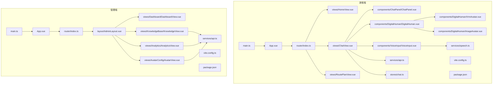
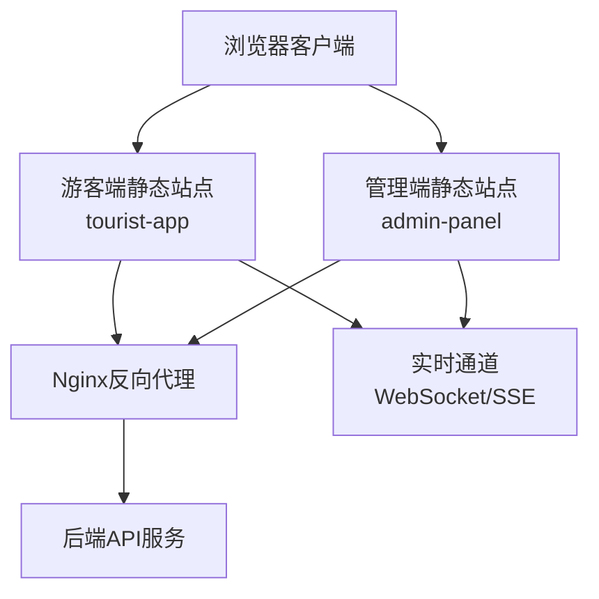
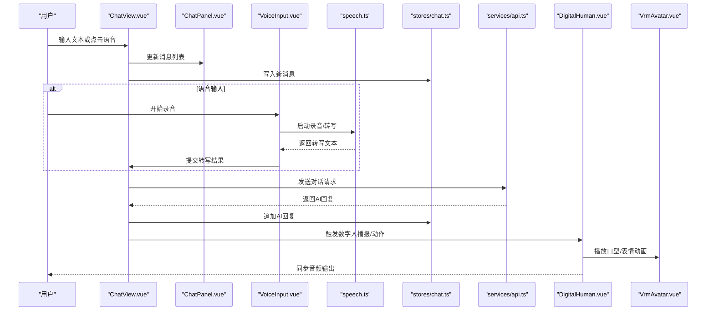
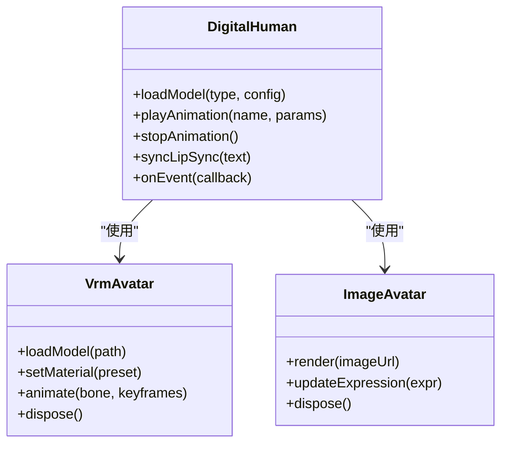
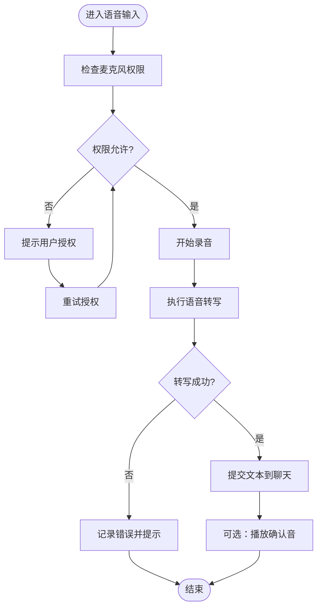
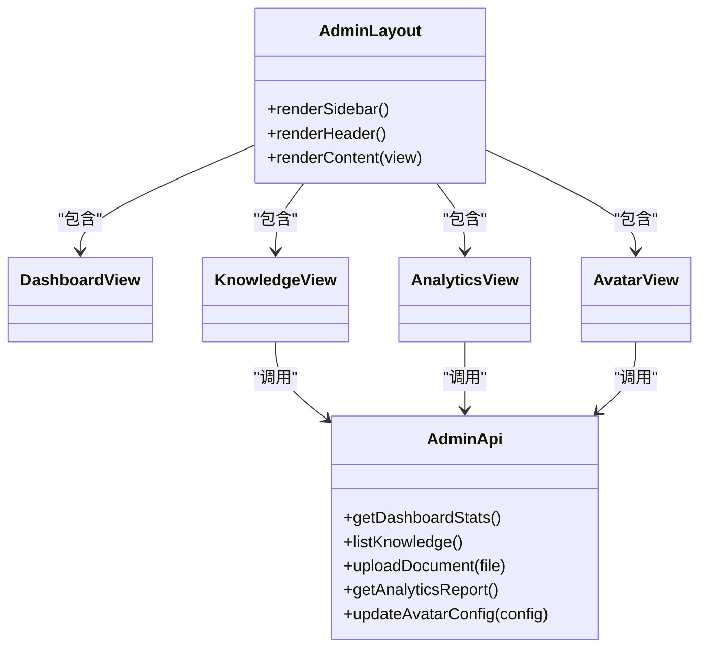
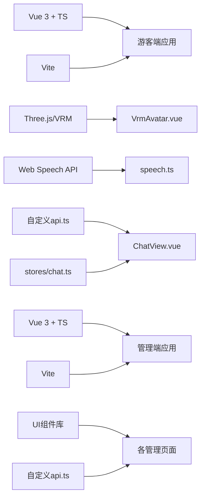

# 前端应用架构

<cite>
**本文引用的文件**   
- [frontend/tourist-app/src/main.ts](file://frontend/tourist-app/src/main.ts)
- [frontend/tourist-app/src/App.vue](file://frontend/tourist-app/src/App.vue)
- [frontend/tourist-app/src/router/index.ts](file://frontend/tourist-app/src/router/index.ts)
- [frontend/tourist-app/src/views/HomeView.vue](file://frontend/tourist-app/src/views/HomeView.vue)
- [frontend/tourist-app/src/views/ChatView.vue](file://frontend/tourist-app/src/views/ChatView.vue)
- [frontend/tourist-app/src/views/RoutePlanView.vue](file://frontend/tourist-app/src/views/RoutePlanView.vue)
- [frontend/tourist-app/src/components/DigitalHuman/DigitalHuman.vue](file://frontend/tourist-app/src/components/DigitalHuman/DigitalHuman.vue)
- [frontend/tourist-app/src/components/DigitalHuman/VrmAvatar.vue](file://frontend/tourist-app/src/components/DigitalHuman/VrmAvatar.vue)
- [frontend/tourist-app/src/components/DigitalHuman/ImageAvatar.vue](file://frontend/tourist-app/src/components/DigitalHuman/ImageAvatar.vue)
- [frontend/tourist-app/src/components/ChatPanel/ChatPanel.vue](file://frontend/tourist-app/src/components/ChatPanel/ChatPanel.vue)
- [frontend/tourist-app/src/components/VoiceInput/VoiceInput.vue](file://frontend/tourist-app/src/components/VoiceInput/VoiceInput.vue)
- [frontend/tourist-app/src/services/api.ts](file://frontend/tourist-app/src/services/api.ts)
- [frontend/tourist-app/src/services/speech.ts](file://frontend/tourist-app/src/services/speech.ts)
- [frontend/tourist-app/src/stores/chat.ts](file://frontend/tourist-app/src/stores/chat.ts)
- [frontend/tourist-app/vite.config.ts](file://frontend/tourist-app/vite.config.ts)
- [frontend/tourist-app/package.json](file://frontend/tourist-app/package.json)
- [frontend/admin-panel/src/main.ts](file://frontend/admin-panel/src/main.ts)
- [frontend/admin-panel/src/App.vue](file://frontend/admin-panel/src/App.vue)
- [frontend/admin-panel/src/router/index.ts](file://frontend/admin-panel/src/router/index.ts)
- [frontend/admin-panel/src/layout/AdminLayout.vue](file://frontend/admin-panel/src/layout/AdminLayout.vue)
- [frontend/admin-panel/src/views/Dashboard/DashboardView.vue](file://frontend/admin-panel/src/views/Dashboard/DashboardView.vue)
- [frontend/admin-panel/src/views/KnowledgeBase/KnowledgeView.vue](file://frontend/admin-panel/src/views/KnowledgeBase/KnowledgeView.vue)
- [frontend/admin-panel/src/views/Analytics/AnalyticsView.vue](file://frontend/admin-panel/src/views/Analytics/AnalyticsView.vue)
- [frontend/admin-panel/src/views/AvatarConfig/AvatarView.vue](file://frontend/admin-panel/src/views/AvatarConfig/AvatarView.vue)
- [frontend/admin-panel/src/services/api.ts](file://frontend/admin-panel/src/services/api.ts)
- [frontend/admin-panel/vite.config.ts](file://frontend/admin-panel/vite.config.ts)
- [frontend/admin-panel/package.json](file://frontend/admin-panel/package.json)
</cite>

## 目录
1. [简介](#简介)
2. [项目结构](#项目结构)
3. [核心组件](#核心组件)
4. [架构总览](#架构总览)
5. [详细组件分析](#详细组件分析)
6. [依赖分析](#依赖分析)
7. [性能考虑](#性能考虑)
8. [故障排查指南](#故障排查指南)
9. [结论](#结论)
10. [附录](#附录)

## 简介
本文件面向SmartTour前端应用的完整架构说明，覆盖基于Vue 3 + TypeScript的双应用架构（游客端与管理端）。文档重点阐述：
- 应用结构与路由设计
- 状态管理与组件化开发模式
- 前后端通信机制与实时通信实现
- 用户界面响应式设计
- 数字人交互组件、VRM模型渲染、动画控制系统与多模态输入处理
- 前端构建配置、性能优化策略、跨浏览器兼容性与用户体验优化方案

## 项目结构
SmartTour前端包含两个独立的前端应用，分别服务于不同角色：
- 游客端（tourist-app）：面向终端游客，提供聊天对话、数字人展示、语音输入与路线规划等能力。
- 管理端（admin-panel）：面向运营人员，提供仪表盘、知识库管理、数据分析与数字人形象配置等功能。

图表来源
- [frontend/tourist-app/src/main.ts](file://frontend/tourist-app/src/main.ts)
- [frontend/tourist-app/src/App.vue](file://frontend/tourist-app/src/App.vue)
- [frontend/tourist-app/src/router/index.ts](file://frontend/tourist-app/src/router/index.ts)
- [frontend/tourist-app/src/views/HomeView.vue](file://frontend/tourist-app/src/views/HomeView.vue)
- [frontend/tourist-app/src/views/ChatView.vue](file://frontend/tourist-app/src/views/ChatView.vue)
- [frontend/tourist-app/src/views/RoutePlanView.vue](file://frontend/tourist-app/src/views/RoutePlanView.vue)
- [frontend/tourist-app/src/components/DigitalHuman/DigitalHuman.vue](file://frontend/tourist-app/src/components/DigitalHuman/DigitalHuman.vue)
- [frontend/tourist-app/src/components/DigitalHuman/VrmAvatar.vue](file://frontend/tourist-app/src/components/DigitalHuman/VrmAvatar.vue)
- [frontend/tourist-app/src/components/DigitalHuman/ImageAvatar.vue](file://frontend/tourist-app/src/components/DigitalHuman/ImageAvatar.vue)
- [frontend/tourist-app/src/components/ChatPanel/ChatPanel.vue](file://frontend/tourist-app/src/components/ChatPanel/ChatPanel.vue)
- [frontend/tourist-app/src/components/VoiceInput/VoiceInput.vue](file://frontend/tourist-app/src/components/VoiceInput/VoiceInput.vue)
- [frontend/tourist-app/src/services/api.ts](file://frontend/tourist-app/src/services/api.ts)
- [frontend/tourist-app/src/services/speech.ts](file://frontend/tourist-app/src/services/speech.ts)
- [frontend/tourist-app/src/stores/chat.ts](file://frontend/tourist-app/src/stores/chat.ts)
- [frontend/tourist-app/vite.config.ts](file://frontend/tourist-app/vite.config.ts)
- [frontend/tourist-app/package.json](file://frontend/tourist-app/package.json)
- [frontend/admin-panel/src/main.ts](file://frontend/admin-panel/src/main.ts)
- [frontend/admin-panel/src/App.vue](file://frontend/admin-panel/src/App.vue)
- [frontend/admin-panel/src/router/index.ts](file://frontend/admin-panel/src/router/index.ts)
- [frontend/admin-panel/src/layout/AdminLayout.vue](file://frontend/admin-panel/src/layout/AdminLayout.vue)
- [frontend/admin-panel/src/views/Dashboard/DashboardView.vue](file://frontend/admin-panel/src/views/Dashboard/DashboardView.vue)
- [frontend/admin-panel/src/views/KnowledgeBase/KnowledgeView.vue](file://frontend/admin-panel/src/views/KnowledgeBase/KnowledgeView.vue)
- [frontend/admin-panel/src/views/Analytics/AnalyticsView.vue](file://frontend/admin-panel/src/views/Analytics/AnalyticsView.vue)
- [frontend/admin-panel/src/views/AvatarConfig/AvatarView.vue](file://frontend/admin-panel/src/views/AvatarConfig/AvatarView.vue)
- [frontend/admin-panel/src/services/api.ts](file://frontend/admin-panel/src/services/api.ts)
- [frontend/admin-panel/vite.config.ts](file://frontend/admin-panel/vite.config.ts)
- [frontend/admin-panel/package.json](file://frontend/admin-panel/package.json)

章节来源
- [frontend/tourist-app/src/main.ts](file://frontend/tourist-app/src/main.ts)
- [frontend/tourist-app/src/App.vue](file://frontend/tourist-app/src/App.vue)
- [frontend/tourist-app/src/router/index.ts](file://frontend/tourist-app/src/router/index.ts)
- [frontend/tourist-app/src/views/HomeView.vue](file://frontend/tourist-app/src/views/HomeView.vue)
- [frontend/tourist-app/src/views/ChatView.vue](file://frontend/tourist-app/src/views/ChatView.vue)
- [frontend/tourist-app/src/views/RoutePlanView.vue](file://frontend/tourist-app/src/views/RoutePlanView.vue)
- [frontend/tourist-app/src/components/DigitalHuman/DigitalHuman.vue](file://frontend/tourist-app/src/components/DigitalHuman/DigitalHuman.vue)
- [frontend/tourist-app/src/components/DigitalHuman/VrmAvatar.vue](file://frontend/tourist-app/src/components/DigitalHuman/VrmAvatar.vue)
- [frontend/tourist-app/src/components/DigitalHuman/ImageAvatar.vue](file://frontend/tourist-app/src/components/DigitalHuman/ImageAvatar.vue)
- [frontend/tourist-app/src/components/ChatPanel/ChatPanel.vue](file://frontend/tourist-app/src/components/ChatPanel/ChatPanel.vue)
- [frontend/tourist-app/src/components/VoiceInput/VoiceInput.vue](file://frontend/tourist-app/src/components/VoiceInput/VoiceInput.vue)
- [frontend/tourist-app/src/services/api.ts](file://frontend/tourist-app/src/services/api.ts)
- [frontend/tourist-app/src/services/speech.ts](file://frontend/tourist-app/src/services/speech.ts)
- [frontend/tourist-app/src/stores/chat.ts](file://frontend/tourist-app/src/stores/chat.ts)
- [frontend/tourist-app/vite.config.ts](file://frontend/tourist-app/vite.config.ts)
- [frontend/tourist-app/package.json](file://frontend/tourist-app/package.json)
- [frontend/admin-panel/src/main.ts](file://frontend/admin-panel/src/main.ts)
- [frontend/admin-panel/src/App.vue](file://frontend/admin-panel/src/App.vue)
- [frontend/admin-panel/src/router/index.ts](file://frontend/admin-panel/src/router/index.ts)
- [frontend/admin-panel/src/layout/AdminLayout.vue](file://frontend/admin-panel/src/layout/AdminLayout.vue)
- [frontend/admin-panel/src/views/Dashboard/DashboardView.vue](file://frontend/admin-panel/src/views/Dashboard/DashboardView.vue)
- [frontend/admin-panel/src/views/KnowledgeBase/KnowledgeView.vue](file://frontend/admin-panel/src/views/KnowledgeBase/KnowledgeView.vue)
- [frontend/admin-panel/src/views/Analytics/AnalyticsView.vue](file://frontend/admin-panel/src/views/Analytics/AnalyticsView.vue)
- [frontend/admin-panel/src/views/AvatarConfig/AvatarView.vue](file://frontend/admin-panel/src/views/AvatarConfig/AvatarView.vue)
- [frontend/admin-panel/src/services/api.ts](file://frontend/admin-panel/src/services/api.ts)
- [frontend/admin-panel/vite.config.ts](file://frontend/admin-panel/vite.config.ts)
- [frontend/admin-panel/package.json](file://frontend/admin-panel/package.json)

## 核心组件
本节聚焦游客端的核心业务组件与服务层，解释其职责与协作关系。

- 入口与根组件
  - main.ts：初始化Vue应用、挂载根组件、注册插件与全局配置。
  - App.vue：应用根容器，承载路由视图与全局布局。

- 路由与页面
  - router/index.ts：定义游客端路由表，包括首页、聊天页、路线规划页等。
  - HomeView.vue：游客端首页，提供导航入口与概览信息。
  - ChatView.vue：聊天主视图，集成聊天面板、数字人与语音输入。
  - RoutePlanView.vue：路线规划视图，用于展示与交互路线建议。

- 数字人交互
  - DigitalHuman.vue：数字人容器组件，负责加载与切换不同渲染器（VRM或图片），并协调动画与事件。
  - VrmAvatar.vue：VRM模型渲染器，基于WebGL/Three.js生态进行模型加载、材质与骨骼动画控制。
  - ImageAvatar.vue：图片型数字人渲染器，适用于轻量场景与低性能设备。

- 聊天与语音
  - ChatPanel.vue：消息列表与气泡渲染，支持滚动、自动定位与富文本展示。
  - VoiceInput.vue：语音输入控件，封装录音、转写与播放逻辑。
  - speech.ts：语音服务，封装浏览器API（如MediaRecorder、SpeechRecognition）与TTS调用。

- 数据与状态
  - stores/chat.ts：聊天状态集中管理，维护消息队列、会话上下文与UI状态。
  - services/api.ts：统一HTTP请求封装，处理鉴权、重试、错误码映射与超时控制。

章节来源
- [frontend/tourist-app/src/main.ts](file://frontend/tourist-app/src/main.ts)
- [frontend/tourist-app/src/App.vue](file://frontend/tourist-app/src/App.vue)
- [frontend/tourist-app/src/router/index.ts](file://frontend/tourist-app/src/router/index.ts)
- [frontend/tourist-app/src/views/HomeView.vue](file://frontend/tourist-app/src/views/HomeView.vue)
- [frontend/tourist-app/src/views/ChatView.vue](file://frontend/tourist-app/src/views/ChatView.vue)
- [frontend/tourist-app/src/views/RoutePlanView.vue](file://frontend/tourist-app/src/views/RoutePlanView.vue)
- [frontend/tourist-app/src/components/DigitalHuman/DigitalHuman.vue](file://frontend/tourist-app/src/components/DigitalHuman/DigitalHuman.vue)
- [frontend/tourist-app/src/components/DigitalHuman/VrmAvatar.vue](file://frontend/tourist-app/src/components/DigitalHuman/VrmAvatar.vue)
- [frontend/tourist-app/src/components/DigitalHuman/ImageAvatar.vue](file://frontend/tourist-app/src/components/DigitalHuman/ImageAvatar.vue)
- [frontend/tourist-app/src/components/ChatPanel/ChatPanel.vue](file://frontend/tourist-app/src/components/ChatPanel/ChatPanel.vue)
- [frontend/tourist-app/src/components/VoiceInput/VoiceInput.vue](file://frontend/tourist-app/src/components/VoiceInput/VoiceInput.vue)
- [frontend/tourist-app/src/services/speech.ts](file://frontend/tourist-app/src/services/speech.ts)
- [frontend/tourist-app/src/stores/chat.ts](file://frontend/tourist-app/src/stores/chat.ts)
- [frontend/tourist-app/src/services/api.ts](file://frontend/tourist-app/src/services/api.ts)

## 架构总览
双应用架构通过独立的Vite工程与包管理，分别部署为游客端与管理端静态站点，由Nginx反向代理到后端API。

图表来源
- [frontend/tourist-app/vite.config.ts](file://frontend/tourist-app/vite.config.ts)
- [frontend/admin-panel/vite.config.ts](file://frontend/admin-panel/vite.config.ts)
- [frontend/tourist-app/package.json](file://frontend/tourist-app/package.json)
- [frontend/admin-panel/package.json](file://frontend/admin-panel/package.json)

章节来源
- [frontend/tourist-app/vite.config.ts](file://frontend/tourist-app/vite.config.ts)
- [frontend/admin-panel/vite.config.ts](file://frontend/admin-panel/vite.config.ts)
- [frontend/tourist-app/package.json](file://frontend/tourist-app/package.json)
- [frontend/admin-panel/package.json](file://frontend/admin-panel/package.json)

## 详细组件分析

### 游客端聊天流程（序列图）
该流程展示从用户输入到消息渲染与数字人反馈的端到端路径。

图表来源
- [frontend/tourist-app/src/views/ChatView.vue](file://frontend/tourist-app/src/views/ChatView.vue)
- [frontend/tourist-app/src/components/ChatPanel/ChatPanel.vue](file://frontend/tourist-app/src/components/ChatPanel/ChatPanel.vue)
- [frontend/tourist-app/src/components/VoiceInput/VoiceInput.vue](file://frontend/tourist-app/src/components/VoiceInput/VoiceInput.vue)
- [frontend/tourist-app/src/services/speech.ts](file://frontend/tourist-app/src/services/speech.ts)
- [frontend/tourist-app/src/stores/chat.ts](file://frontend/tourist-app/src/stores/chat.ts)
- [frontend/tourist-app/src/services/api.ts](file://frontend/tourist-app/src/services/api.ts)
- [frontend/tourist-app/src/components/DigitalHuman/DigitalHuman.vue](file://frontend/tourist-app/src/components/DigitalHuman/DigitalHuman.vue)
- [frontend/tourist-app/src/components/DigitalHuman/VrmAvatar.vue](file://frontend/tourist-app/src/components/DigitalHuman/VrmAvatar.vue)

章节来源
- [frontend/tourist-app/src/views/ChatView.vue](file://frontend/tourist-app/src/views/ChatView.vue)
- [frontend/tourist-app/src/components/ChatPanel/ChatPanel.vue](file://frontend/tourist-app/src/components/ChatPanel/ChatPanel.vue)
- [frontend/tourist-app/src/components/VoiceInput/VoiceInput.vue](file://frontend/tourist-app/src/components/VoiceInput/VoiceInput.vue)
- [frontend/tourist-app/src/services/speech.ts](file://frontend/tourist-app/src/services/speech.ts)
- [frontend/tourist-app/src/stores/chat.ts](file://frontend/tourist-app/src/stores/chat.ts)
- [frontend/tourist-app/src/services/api.ts](file://frontend/tourist-app/src/services/api.ts)
- [frontend/tourist-app/src/components/DigitalHuman/DigitalHuman.vue](file://frontend/tourist-app/src/components/DigitalHuman/DigitalHuman.vue)
- [frontend/tourist-app/src/components/DigitalHuman/VrmAvatar.vue](file://frontend/tourist-app/src/components/DigitalHuman/VrmAvatar.vue)

### 数字人交互组件（类图）
数字人组件采用组合模式，将渲染器抽象为可插拔模块，便于在VRM与图片渲染之间切换。

图表来源
- [frontend/tourist-app/src/components/DigitalHuman/DigitalHuman.vue](file://frontend/tourist-app/src/components/DigitalHuman/DigitalHuman.vue)
- [frontend/tourist-app/src/components/DigitalHuman/VrmAvatar.vue](file://frontend/tourist-app/src/components/DigitalHuman/VrmAvatar.vue)
- [frontend/tourist-app/src/components/DigitalHuman/ImageAvatar.vue](file://frontend/tourist-app/src/components/DigitalHuman/ImageAvatar.vue)

章节来源
- [frontend/tourist-app/src/components/DigitalHuman/DigitalHuman.vue](file://frontend/tourist-app/src/components/DigitalHuman/DigitalHuman.vue)
- [frontend/tourist-app/src/components/DigitalHuman/VrmAvatar.vue](file://frontend/tourist-app/src/components/DigitalHuman/VrmAvatar.vue)
- [frontend/tourist-app/src/components/DigitalHuman/ImageAvatar.vue](file://frontend/tourist-app/src/components/DigitalHuman/ImageAvatar.vue)

### 语音输入处理（流程图）
语音输入涉及权限获取、录音、转写与回放，需处理浏览器差异与异常恢复。

图表来源
- [frontend/tourist-app/src/components/VoiceInput/VoiceInput.vue](file://frontend/tourist-app/src/components/VoiceInput/VoiceInput.vue)
- [frontend/tourist-app/src/services/speech.ts](file://frontend/tourist-app/src/services/speech.ts)

章节来源
- [frontend/tourist-app/src/components/VoiceInput/VoiceInput.vue](file://frontend/tourist-app/src/components/VoiceInput/VoiceInput.vue)
- [frontend/tourist-app/src/services/speech.ts](file://frontend/tourist-app/src/services/speech.ts)

### 管理端页面与布局（类图）
管理端以AdminLayout为骨架，各功能页面作为子视图挂载，服务层统一访问后端API。

图表来源
- [frontend/admin-panel/src/layout/AdminLayout.vue](file://frontend/admin-panel/src/layout/AdminLayout.vue)
- [frontend/admin-panel/src/views/Dashboard/DashboardView.vue](file://frontend/admin-panel/src/views/Dashboard/DashboardView.vue)
- [frontend/admin-panel/src/views/KnowledgeBase/KnowledgeView.vue](file://frontend/admin-panel/src/views/KnowledgeBase/KnowledgeView.vue)
- [frontend/admin-panel/src/views/Analytics/AnalyticsView.vue](file://frontend/admin-panel/src/views/Analytics/AnalyticsView.vue)
- [frontend/admin-panel/src/views/AvatarConfig/AvatarView.vue](file://frontend/admin-panel/src/views/AvatarConfig/AvatarView.vue)
- [frontend/admin-panel/src/services/api.ts](file://frontend/admin-panel/src/services/api.ts)

章节来源
- [frontend/admin-panel/src/layout/AdminLayout.vue](file://frontend/admin-panel/src/layout/AdminLayout.vue)
- [frontend/admin-panel/src/views/Dashboard/DashboardView.vue](file://frontend/admin-panel/src/views/Dashboard/DashboardView.vue)
- [frontend/admin-panel/src/views/KnowledgeBase/KnowledgeView.vue](file://frontend/admin-panel/src/views/KnowledgeBase/KnowledgeView.vue)
- [frontend/admin-panel/src/views/Analytics/AnalyticsView.vue](file://frontend/admin-panel/src/views/Analytics/AnalyticsView.vue)
- [frontend/admin-panel/src/views/AvatarConfig/AvatarView.vue](file://frontend/admin-panel/src/views/AvatarConfig/AvatarView.vue)
- [frontend/admin-panel/src/services/api.ts](file://frontend/admin-panel/src/services/api.ts)

## 依赖分析
- 游客端依赖
  - Vue 3 + TypeScript：应用框架与类型系统。
  - Vite：构建工具与开发服务器。
  - Three.js/VRM相关库：用于VRM模型加载与渲染（在VrmAvatar中引入）。
  - Web Speech API：语音识别与合成（在speech.ts中使用）。
  - 自定义服务层：api.ts与stores/chat.ts提供网络与状态管理能力。

- 管理端依赖
  - Vue 3 + TypeScript：应用框架与类型系统。
  - Vite：构建工具与开发服务器。
  - UI组件库（如Element Plus/Ant Design Vue，视具体实现而定）：用于表单、表格与图表。
  - 自定义服务层：api.ts提供统一的API访问。

图表来源
- [frontend/tourist-app/package.json](file://frontend/tourist-app/package.json)
- [frontend/tourist-app/vite.config.ts](file://frontend/tourist-app/vite.config.ts)
- [frontend/tourist-app/src/components/DigitalHuman/VrmAvatar.vue](file://frontend/tourist-app/src/components/DigitalHuman/VrmAvatar.vue)
- [frontend/tourist-app/src/services/speech.ts](file://frontend/tourist-app/src/services/speech.ts)
- [frontend/tourist-app/src/services/api.ts](file://frontend/tourist-app/src/services/api.ts)
- [frontend/tourist-app/src/stores/chat.ts](file://frontend/tourist-app/src/stores/chat.ts)
- [frontend/tourist-app/src/views/ChatView.vue](file://frontend/tourist-app/src/views/ChatView.vue)
- [frontend/admin-panel/package.json](file://frontend/admin-panel/package.json)
- [frontend/admin-panel/vite.config.ts](file://frontend/admin-panel/vite.config.ts)
- [frontend/admin-panel/src/services/api.ts](file://frontend/admin-panel/src/services/api.ts)

章节来源
- [frontend/tourist-app/package.json](file://frontend/tourist-app/package.json)
- [frontend/tourist-app/vite.config.ts](file://frontend/tourist-app/vite.config.ts)
- [frontend/tourist-app/src/components/DigitalHuman/VrmAvatar.vue](file://frontend/tourist-app/src/components/DigitalHuman/VrmAvatar.vue)
- [frontend/tourist-app/src/services/speech.ts](file://frontend/tourist-app/src/services/speech.ts)
- [frontend/tourist-app/src/services/api.ts](file://frontend/tourist-app/src/services/api.ts)
- [frontend/tourist-app/src/stores/chat.ts](file://frontend/tourist-app/src/stores/chat.ts)
- [frontend/tourist-app/src/views/ChatView.vue](file://frontend/tourist-app/src/views/ChatView.vue)
- [frontend/admin-panel/package.json](file://frontend/admin-panel/package.json)
- [frontend/admin-panel/vite.config.ts](file://frontend/admin-panel/vite.config.ts)
- [frontend/admin-panel/src/services/api.ts](file://frontend/admin-panel/src/services/api.ts)

## 性能考虑
- 资源加载与缓存
  - 对VRM模型与纹理进行分片加载与懒加载，避免首屏阻塞。
  - 启用HTTP缓存与CDN加速静态资源。
- 渲染优化
  - 在VrmAvatar中按需更新骨骼与材质，减少每帧计算量。
  - 使用离屏渲染与对象池复用几何体与材质。
- 网络与状态
  - 在api.ts中实现请求去重、重试与退避策略，降低抖动影响。
  - 在stores/chat.ts中对长列表进行虚拟滚动与分页加载。
- 构建与打包
  - 在vite.config.ts中开启代码分割与Tree Shaking，按路由拆分chunk。
  - 压缩与混淆生产构建产物，减小体积。
- 兼容性
  - 针对不支持Web Speech API的浏览器提供降级方案（如仅文本输入）。
  - 对WebGL/VRM渲染能力进行检测，必要时回退到ImageAvatar。

[本节为通用指导，不直接分析具体文件]

## 故障排查指南
- 语音输入失败
  - 检查浏览器权限与HTTPS环境；查看speech.ts中的错误分支与提示逻辑。
  - 验证MediaRecorder与SpeechRecognition可用性，必要时提供降级路径。
- 数字人渲染异常
  - 检查VRM模型路径与格式；确认VrmAvatar中模型加载与材质设置是否成功。
  - 监控GPU内存与帧率，避免过度绘制导致卡顿。
- 聊天消息丢失或重复
  - 核对stores/chat.ts的状态变更与副作用处理，确保消息追加幂等。
  - 检查api.ts的请求重试与去重逻辑，避免重复提交。
- 路由跳转异常
  - 校验router/index.ts的路由守卫与参数传递，确保页面状态正确初始化。

章节来源
- [frontend/tourist-app/src/services/speech.ts](file://frontend/tourist-app/src/services/speech.ts)
- [frontend/tourist-app/src/components/DigitalHuman/VrmAvatar.vue](file://frontend/tourist-app/src/components/DigitalHuman/VrmAvatar.vue)
- [frontend/tourist-app/src/stores/chat.ts](file://frontend/tourist-app/src/stores/chat.ts)
- [frontend/tourist-app/src/services/api.ts](file://frontend/tourist-app/src/services/api.ts)
- [frontend/tourist-app/src/router/index.ts](file://frontend/tourist-app/src/router/index.ts)

## 结论
SmartTour前端采用清晰的双应用架构，游客端聚焦于数字人交互与多模态输入，管理端聚焦于运营与配置能力。通过组件化与分层设计，实现了良好的可维护性与扩展性。结合Vite构建优化与Web技术栈，系统在性能与体验方面具备良好基础。后续可在实时通信、离线能力与无障碍访问方面持续增强。

[本节为总结性内容，不直接分析具体文件]

## 附录
- 关键文件路径参考
  - 游客端入口与根组件：[frontend/tourist-app/src/main.ts](file://frontend/tourist-app/src/main.ts)、[frontend/tourist-app/src/App.vue](file://frontend/tourist-app/src/App.vue)
  - 路由与页面：[frontend/tourist-app/src/router/index.ts](file://frontend/tourist-app/src/router/index.ts)、[frontend/tourist-app/src/views/HomeView.vue](file://frontend/tourist-app/src/views/HomeView.vue)、[frontend/tourist-app/src/views/ChatView.vue](file://frontend/tourist-app/src/views/ChatView.vue)、[frontend/tourist-app/src/views/RoutePlanView.vue](file://frontend/tourist-app/src/views/RoutePlanView.vue)
  - 数字人与语音：[frontend/tourist-app/src/components/DigitalHuman/DigitalHuman.vue](file://frontend/tourist-app/src/components/DigitalHuman/DigitalHuman.vue)、[frontend/tourist-app/src/components/DigitalHuman/VrmAvatar.vue](file://frontend/tourist-app/src/components/DigitalHuman/VrmAvatar.vue)、[frontend/tourist-app/src/components/DigitalHuman/ImageAvatar.vue](file://frontend/tourist-app/src/components/DigitalHuman/ImageAvatar.vue)、[frontend/tourist-app/src/components/VoiceInput/VoiceInput.vue](file://frontend/tourist-app/src/components/VoiceInput/VoiceInput.vue)、[frontend/tourist-app/src/services/speech.ts](file://frontend/tourist-app/src/services/speech.ts)
  - 状态与服务：[frontend/tourist-app/src/stores/chat.ts](file://frontend/tourist-app/src/stores/chat.ts)、[frontend/tourist-app/src/services/api.ts](file://frontend/tourist-app/src/services/api.ts)
  - 构建与依赖：[frontend/tourist-app/vite.config.ts](file://frontend/tourist-app/vite.config.ts)、[frontend/tourist-app/package.json](file://frontend/tourist-app/package.json)
  - 管理端入口与布局：[frontend/admin-panel/src/main.ts](file://frontend/admin-panel/src/main.ts)、[frontend/admin-panel/src/App.vue](file://frontend/admin-panel/src/App.vue)、[frontend/admin-panel/src/router/index.ts](file://frontend/admin-panel/src/router/index.ts)、[frontend/admin-panel/src/layout/AdminLayout.vue](file://frontend/admin-panel/src/layout/AdminLayout.vue)
  - 管理端页面与服务：[frontend/admin-panel/src/views/Dashboard/DashboardView.vue](file://frontend/admin-panel/src/views/Dashboard/DashboardView.vue)、[frontend/admin-panel/src/views/KnowledgeBase/KnowledgeView.vue](file://frontend/admin-panel/src/views/KnowledgeBase/KnowledgeView.vue)、[frontend/admin-panel/src/views/Analytics/AnalyticsView.vue](file://frontend/admin-panel/src/views/Analytics/AnalyticsView.vue)、[frontend/admin-panel/src/views/AvatarConfig/AvatarView.vue](file://frontend/admin-panel/src/views/AvatarConfig/AvatarView.vue)、[frontend/admin-panel/src/services/api.ts](file://frontend/admin-panel/src/services/api.ts)
  - 管理端构建与依赖：[frontend/admin-panel/vite.config.ts](file://frontend/admin-panel/vite.config.ts)、[frontend/admin-panel/package.json](file://frontend/admin-panel/package.json)