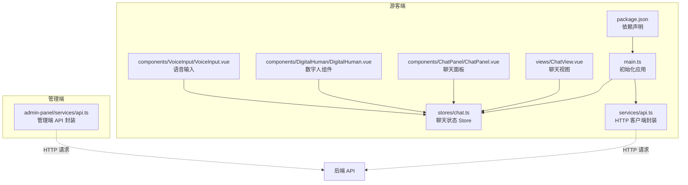
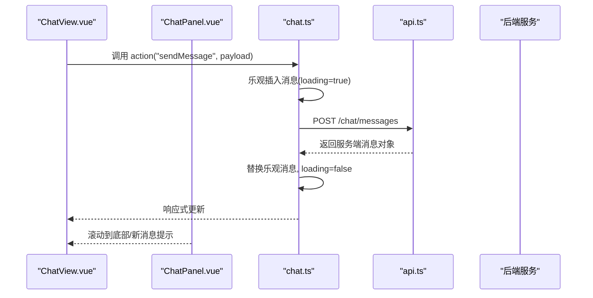
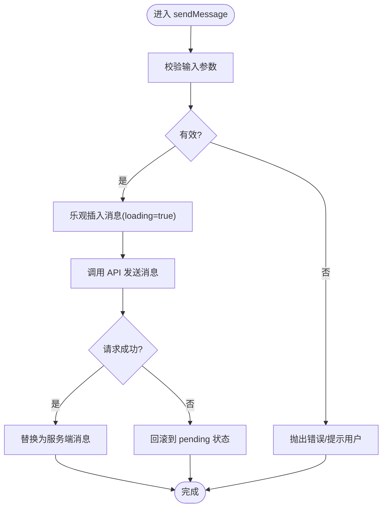
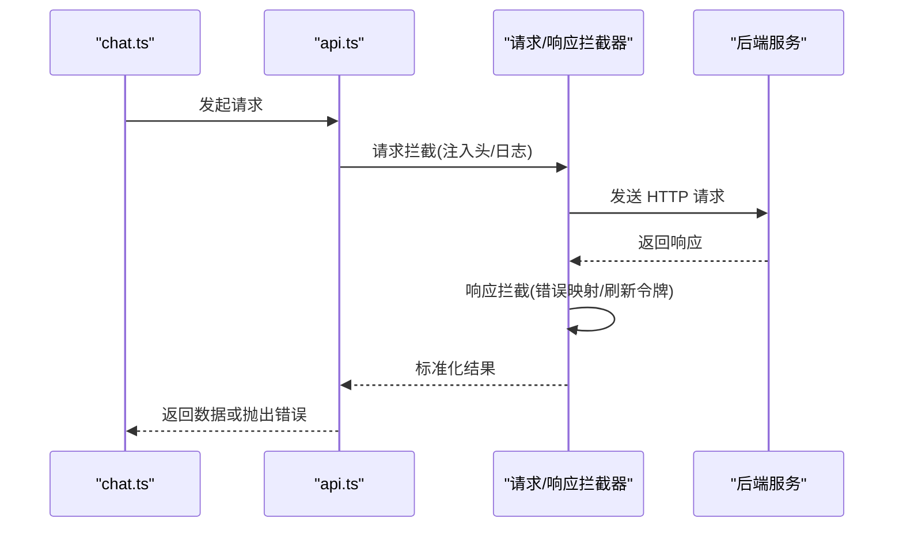
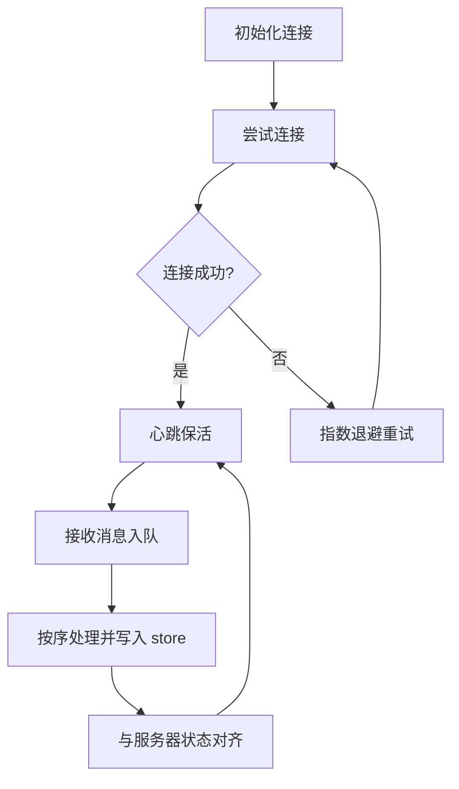
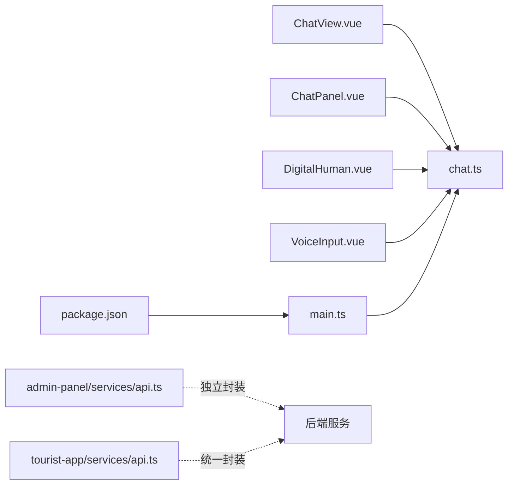

# 前端状态管理

<cite>
**本文引用的文件**   
- [frontend/tourist-app/src/stores/chat.ts](file://frontend/tourist-app/src/stores/chat.ts)
- [frontend/tourist-app/src/services/api.ts](file://frontend/tourist-app/src/services/api.ts)
- [frontend/tourist-app/src/views/ChatView.vue](file://frontend/tourist-app/src/views/ChatView.vue)
- [frontend/tourist-app/src/components/ChatPanel/ChatPanel.vue](file://frontend/tourist-app/src/components/ChatPanel/ChatPanel.vue)
- [frontend/tourist-app/src/components/DigitalHuman/DigitalHuman.vue](file://frontend/tourist-app/src/components/DigitalHuman/DigitalHuman.vue)
- [frontend/tourist-app/src/components/VoiceInput/VoiceInput.vue](file://frontend/tourist-app/src/components/VoiceInput/VoiceInput.vue)
- [frontend/tourist-app/src/main.ts](file://frontend/tourist-app/src/main.ts)
- [frontend/tourist-app/package.json](file://frontend/tourist-app/package.json)
- [frontend/admin-panel/src/services/api.ts](file://frontend/admin-panel/src/services/api.ts)
</cite>

## 目录
1. [简介](#简介)
2. [项目结构](#项目结构)
3. [核心组件](#核心组件)
4. [架构总览](#架构总览)
5. [详细组件分析](#详细组件分析)
6. [依赖关系分析](#依赖关系分析)
7. [性能考虑](#性能考虑)
8. [故障排查指南](#故障排查指南)
9. [结论](#结论)
10. [附录](#附录)

## 简介
本文件面向前端状态管理的综合架构文档，聚焦于基于 Pinia 的状态管理模式，覆盖聊天状态存储、用户会话管理、数字人状态控制与全局配置管理。同时阐述前后端 API 服务层封装设计、请求拦截器、错误处理机制与数据缓存策略；说明实时通信的状态同步、消息队列管理与连接重连机制；提供状态持久化方案、本地存储策略与数据迁移处理；并给出状态调试工具使用、性能监控与内存泄漏防护建议，以及最佳实践、代码组织模式与扩展开发指南。

## 项目结构
前端包含两个应用：游客端 tourist-app 与管理端 admin-panel。状态管理主要位于 tourist-app 的 stores 目录中，API 服务层位于 services 目录，页面与组件通过组合式函数或 store 访问状态。

图表来源
- [frontend/tourist-app/src/main.ts](file://frontend/tourist-app/src/main.ts)
- [frontend/tourist-app/src/stores/chat.ts](file://frontend/tourist-app/src/stores/chat.ts)
- [frontend/tourist-app/src/services/api.ts](file://frontend/tourist-app/src/services/api.ts)
- [frontend/tourist-app/src/views/ChatView.vue](file://frontend/tourist-app/src/views/ChatView.vue)
- [frontend/tourist-app/src/components/ChatPanel/ChatPanel.vue](file://frontend/tourist-app/src/components/ChatPanel/ChatPanel.vue)
- [frontend/tourist-app/src/components/DigitalHuman/DigitalHuman.vue](file://frontend/tourist-app/src/components/DigitalHuman/DigitalHuman.vue)
- [frontend/tourist-app/src/components/VoiceInput/VoiceInput.vue](file://frontend/tourist-app/src/components/VoiceInput/VoiceInput.vue)
- [frontend/tourist-app/package.json](file://frontend/tourist-app/package.json)
- [frontend/admin-panel/src/services/api.ts](file://frontend/admin-panel/src/services/api.ts)

章节来源
- [frontend/tourist-app/src/main.ts](file://frontend/tourist-app/src/main.ts)
- [frontend/tourist-app/package.json](file://frontend/tourist-app/package.json)

## 核心组件
- 聊天状态存储（chat store）
  - 职责：维护消息列表、对话上下文、发送/接收状态、加载态、错误信息、分页游标等。
  - 关键能力：新增消息、标记已读、清空历史、按条件过滤、批量追加、乐观更新与回滚。
- 用户会话管理
  - 职责：保存登录态、用户基本信息、权限范围、会话标识、过期时间等。
  - 关键能力：登录/登出、刷新令牌、自动续期、跨标签页同步。
- 数字人状态控制
  - 职责：控制数字人播放、表情切换、动作序列、渲染资源加载状态。
  - 关键能力：播放/暂停、进度同步、事件回调、异常恢复。
- 全局配置管理
  - 职责：主题、语言、功能开关、接口地址、埋点开关等。
  - 关键能力：动态切换、默认值合并、版本兼容。

章节来源
- [frontend/tourist-app/src/stores/chat.ts](file://frontend/tourist-app/src/stores/chat.ts)

## 架构总览
整体采用“Store 驱动 + Service 封装”的分层架构：UI 组件仅消费 store 暴露的 state/getters/actions，业务逻辑集中在 actions 中，网络请求统一由 services/api.ts 封装，确保错误处理、重试、缓存与鉴权一致。

图表来源
- [frontend/tourist-app/src/views/ChatView.vue](file://frontend/tourist-app/src/views/ChatView.vue)
- [frontend/tourist-app/src/components/ChatPanel/ChatPanel.vue](file://frontend/tourist-app/src/components/ChatPanel/ChatPanel.vue)
- [frontend/tourist-app/src/stores/chat.ts](file://frontend/tourist-app/src/stores/chat.ts)
- [frontend/tourist-app/src/services/api.ts](file://frontend/tourist-app/src/services/api.ts)

## 详细组件分析

### 聊天状态存储（chat store）
- 数据结构
  - messages：消息数组，含 id、角色、内容、时间戳、状态（pending/sent/failed）、附件等。
  - conversationId：当前会话标识。
  - pagination：分页游标、是否还有更多。
  - error：最近一次错误信息。
  - meta：如最后一条消息索引、未读数等。
- 计算属性（getters）
  - lastMessage：最新一条消息。
  - hasMore：是否可加载更多。
  - filteredMessages：按关键词/类型过滤。
- Actions
  - sendMessage：校验输入 -> 乐观插入 -> 调用 API -> 成功替换/失败回滚 -> 触发通知。
  - loadHistory：根据游标拉取历史 -> 去重合并 -> 更新分页。
  - clearHistory：清空本地消息并重置分页。
  - markRead：批量标记已读。
- 错误处理
  - 网络异常：设置 failed 状态，保留乐观消息以便重试。
  - 业务错误：展示错误信息，允许用户重试。
- 性能优化
  - 增量更新：避免全量替换。
  - 虚拟列表配合：在消息量大时减少 DOM 压力。
  - 防抖/节流：搜索与滚动加载。

图表来源
- [frontend/tourist-app/src/stores/chat.ts](file://frontend/tourist-app/src/stores/chat.ts)

章节来源
- [frontend/tourist-app/src/stores/chat.ts](file://frontend/tourist-app/src/stores/chat.ts)

### 用户会话管理
- 状态字段
  - token、refreshToken、expiresAt、userInfo、permissions。
- 行为
  - login：提交凭证 -> 获取 token -> 写入本地存储 -> 初始化后续请求头。
  - logout：清理本地存储 -> 重置相关状态。
  - refresh：过期前自动刷新 -> 失败则跳转登录。
- 安全与持久化
  - 敏感信息加密存储（可选）。
  - 多标签页同步（StorageEvent）。
  - 过期时间校验与静默续期。

章节来源
- [frontend/tourist-app/src/stores/chat.ts](file://frontend/tourist-app/src/stores/chat.ts)
- [frontend/tourist-app/src/services/api.ts](file://frontend/tourist-app/src/services/api.ts)

### 数字人状态控制
- 状态字段
  - isPlaying、progress、currentAction、avatarType、error。
- 行为
  - play/pause：控制播放与暂停。
  - setAction：切换动作/表情。
  - onProgress：同步进度到 UI。
  - onError：捕获渲染错误并降级显示。
- 与聊天联动
  - 收到特定消息类型时触发对应动作或语音播报。

章节来源
- [frontend/tourist-app/src/components/DigitalHuman/DigitalHuman.vue](file://frontend/tourist-app/src/components/DigitalHuman/DigitalHuman.vue)
- [frontend/tourist-app/src/stores/chat.ts](file://frontend/tourist-app/src/stores/chat.ts)

### 全局配置管理
- 配置项
  - apiBaseURL、featureFlags、theme、locale、analyticsEnabled。
- 行为
  - 读取环境变量/远程配置中心。
  - 运行时切换主题与语言。
  - 功能开关热更新。

章节来源
- [frontend/tourist-app/src/stores/chat.ts](file://frontend/tourist-app/src/stores/chat.ts)

### 前后端 API 服务层封装
- 设计要点
  - 统一实例：集中配置 baseURL、超时、重试次数。
  - 请求拦截器：注入鉴权头、请求 ID、日志埋点。
  - 响应拦截器：统一错误码映射、业务错误提示、token 刷新。
  - 错误处理：区分网络错误、超时、业务错误，提供重试与降级。
  - 数据缓存：对 GET 请求实现简单内存缓存与失效策略。
- 管理端差异
  - 独立 baseURL 与权限校验逻辑。

图表来源
- [frontend/tourist-app/src/services/api.ts](file://frontend/tourist-app/src/services/api.ts)
- [frontend/admin-panel/src/services/api.ts](file://frontend/admin-panel/src/services/api.ts)

章节来源
- [frontend/tourist-app/src/services/api.ts](file://frontend/tourist-app/src/services/api.ts)
- [frontend/admin-panel/src/services/api.ts](file://frontend/admin-panel/src/services/api.ts)

### 实时通信的状态同步、消息队列与重连
- 状态同步
  - 使用 WebSocket/SSE 建立长连接，服务端推送消息至前端。
  - 前端将收到的消息入队并按序写入 store，保持与发送顺序一致。
- 消息队列
  - 离线消息缓冲：断网时将待发消息放入队列，恢复后批量重发。
  - 去重与幂等：基于消息 ID 去重，防止重复渲染。
- 连接重连
  - 指数退避重连策略，最大重试次数限制。
  - 心跳检测与保活，异常断开快速感知。
  - 重连成功后进行状态对齐（拉取缺失片段/确认已送达）。

[本节为概念性流程，不直接映射具体源码文件]

### 状态持久化、本地存储与数据迁移
- 持久化策略
  - 会话级：sessionStorage 存放短期令牌与临时状态。
  - 用户级：localStorage 存放偏好、主题、语言、历史摘要。
  - 大对象：IndexedDB 存放历史消息与媒体元数据。
- 迁移处理
  - 版本号字段：每次 schema 变更递增。
  - 迁移脚本：启动时执行，旧数据到新结构的转换。
  - 回滚策略：迁移失败保留原数据并记录错误。

[本节为通用方案说明，不直接映射具体源码文件]

### 状态调试工具、性能监控与内存泄漏防护
- 调试工具
  - Pinia Devtools：查看 state/getters/actions 快照与回放。
  - 自定义日志：在 actions 前后打印耗时与参数摘要。
- 性能监控
  - 首屏与交互延迟上报。
  - 大数据渲染指标（DOM 节点数、重排次数）。
- 内存泄漏防护
  - 组件卸载时清理定时器、事件监听、WebSocket 连接。
  - 避免闭包持有大对象引用。
  - 图片/模型等资源按需加载与释放。

[本节为通用指导，不直接映射具体源码文件]

### 最佳实践、代码组织与扩展指南
- 最佳实践
  - 单一职责：每个 store 只负责一个领域。
  - 不可变更新：actions 内尽量返回新对象，便于追踪。
  - 错误边界：在 UI 层捕获异步错误并友好提示。
  - 懒加载：路由级拆分与 store 按需注册。
- 代码组织
  - 按领域划分 stores，命名以名词复数表示集合。
  - 公共逻辑抽取为 composables 复用。
  - API 方法按模块拆分，统一错误码映射。
- 扩展指南
  - 新增功能先定义状态与动作，再实现 UI 绑定。
  - 引入第三方库前先评估 bundle 体积与兼容性。
  - 通过 feature flags 灰度发布新功能。

[本节为通用指导，不直接映射具体源码文件]

## 依赖关系分析
- 内部依赖
  - ChatView.vue 与 ChatPanel.vue 依赖 chat store。
  - DigitalHuman.vue 依赖 chat store 的消息类型与状态。
  - VoiceInput.vue 依赖 chat store 的发送动作。
  - main.ts 初始化应用与插件（包括 Pinia）。
- 外部依赖
  - package.json 声明了运行时依赖（如 Vue、Pinia、HTTP 客户端等）。
  - 管理端与服务端各自独立的 API 封装。

图表来源
- [frontend/tourist-app/src/views/ChatView.vue](file://frontend/tourist-app/src/views/ChatView.vue)
- [frontend/tourist-app/src/components/ChatPanel/ChatPanel.vue](file://frontend/tourist-app/src/components/ChatPanel/ChatPanel.vue)
- [frontend/tourist-app/src/components/DigitalHuman/DigitalHuman.vue](file://frontend/tourist-app/src/components/DigitalHuman/DigitalHuman.vue)
- [frontend/tourist-app/src/components/VoiceInput/VoiceInput.vue](file://frontend/tourist-app/src/components/VoiceInput/VoiceInput.vue)
- [frontend/tourist-app/src/stores/chat.ts](file://frontend/tourist-app/src/stores/chat.ts)
- [frontend/tourist-app/src/main.ts](file://frontend/tourist-app/src/main.ts)
- [frontend/tourist-app/package.json](file://frontend/tourist-app/package.json)
- [frontend/admin-panel/src/services/api.ts](file://frontend/admin-panel/src/services/api.ts)
- [frontend/tourist-app/src/services/api.ts](file://frontend/tourist-app/src/services/api.ts)

章节来源
- [frontend/tourist-app/src/main.ts](file://frontend/tourist-app/src/main.ts)
- [frontend/tourist-app/package.json](file://frontend/tourist-app/package.json)

## 性能考虑
- 列表渲染优化：虚拟滚动、分页加载、增量更新。
- 状态粒度：细粒度 getters 减少不必要的重渲染。
- 网络优化：请求合并、缓存命中、压缩传输。
- 资源管理：按需加载模型与音频，及时释放。
- 监控指标：FPS、长任务占比、内存峰值。

[本节为通用指导，不直接映射具体源码文件]

## 故障排查指南
- 常见问题
  - 消息不同步：检查消息 ID 去重与队列顺序。
  - 频繁重连：调整心跳间隔与退避策略。
  - 白屏或卡顿：定位大对象渲染与内存泄漏。
- 定位手段
  - Pinia Devtools 回放 actions。
  - 浏览器 Network 面板查看请求与错误码。
  - Performance 面板分析长任务与布局抖动。
- 恢复策略
  - 提供重试按钮与降级视图。
  - 本地缓存兜底，保证基本可用。

[本节为通用指导，不直接映射具体源码文件]

## 结论
通过以 Pinia 为核心的状态管理架构，结合统一的 API 服务封装与完善的错误处理、缓存与持久化策略，系统实现了高内聚、低耦合的前端状态流转。配合实时通信与消息队列，保证了用户体验的一致性与可靠性。遵循本文的最佳实践与扩展指南，可在保证性能与安全的前提下持续演进功能。

## 附录
- 术语表
  - Store：状态容器，包含 state、getters、actions。
  - 乐观更新：先更新 UI，再异步确认，失败回滚。
  - 指数退避：重试间隔随次数呈指数增长。
- 参考路径
  - 聊天状态：[frontend/tourist-app/src/stores/chat.ts](file://frontend/tourist-app/src/stores/chat.ts)
  - API 封装：[frontend/tourist-app/src/services/api.ts](file://frontend/tourist-app/src/services/api.ts)
  - 管理端 API：[frontend/admin-panel/src/services/api.ts](file://frontend/admin-panel/src/services/api.ts)
  - 入口与依赖：[frontend/tourist-app/src/main.ts](file://frontend/tourist-app/src/main.ts)、[frontend/tourist-app/package.json](file://frontend/tourist-app/package.json)