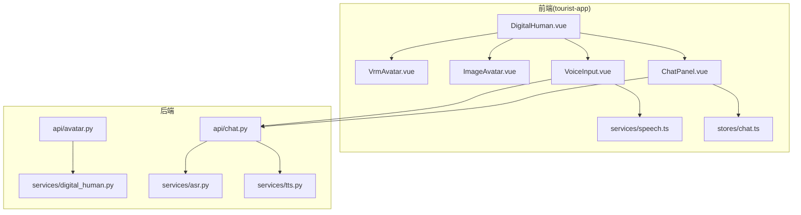
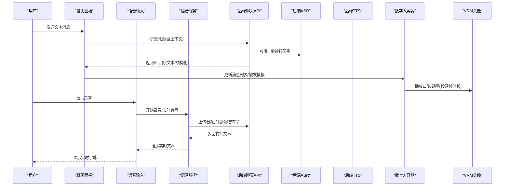
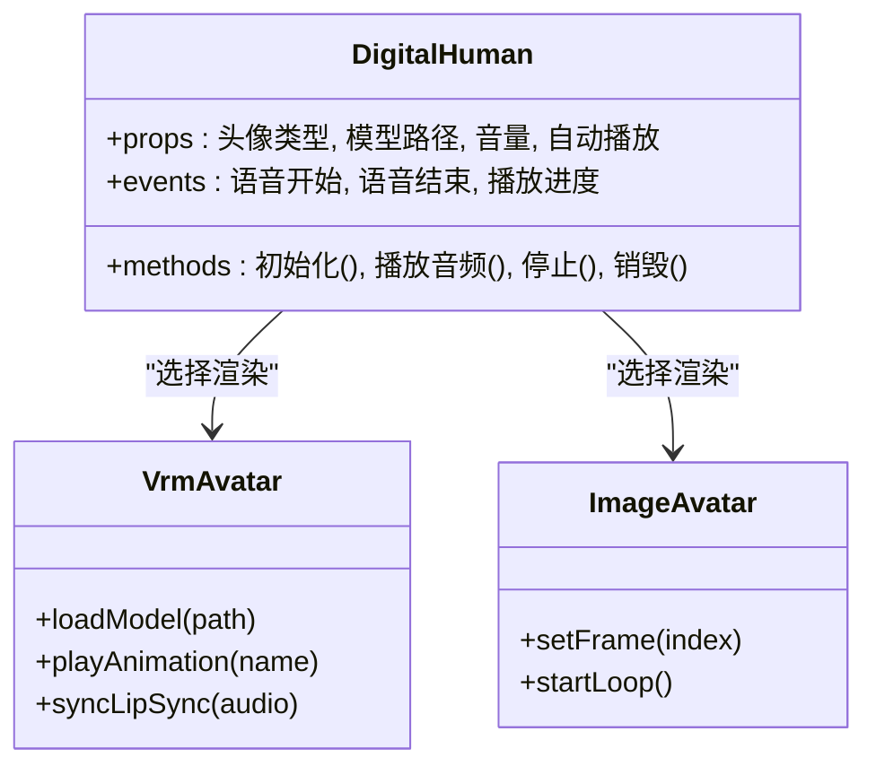
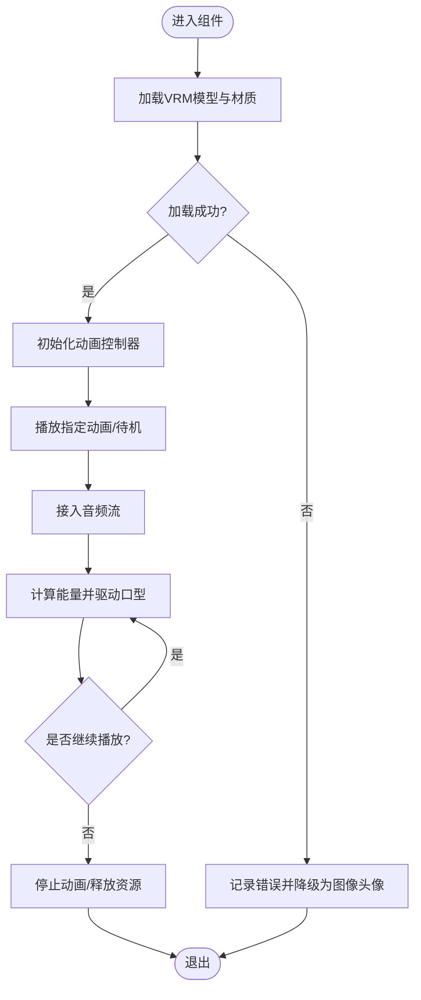
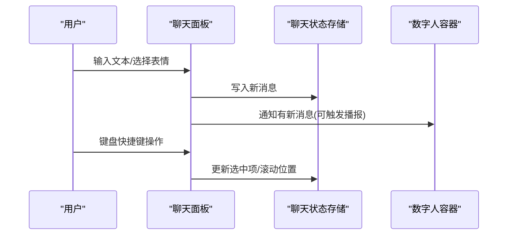
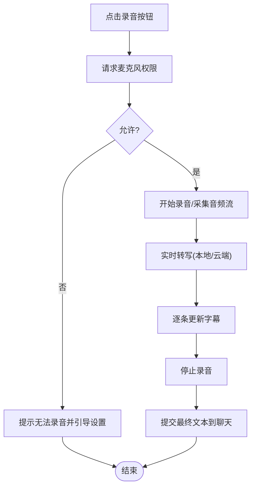
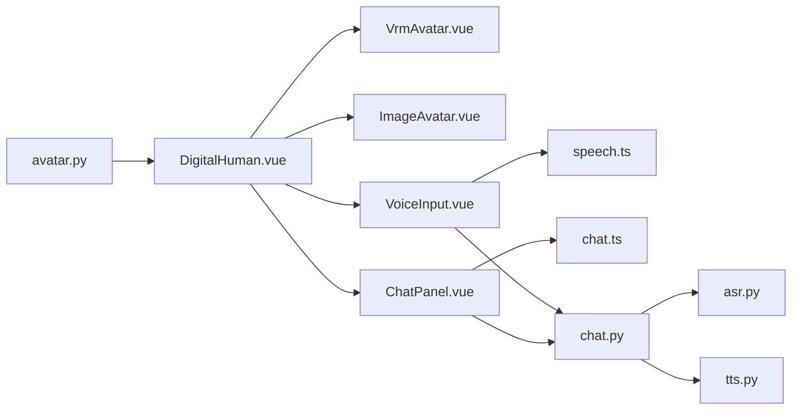

# 数字人交互组件

<cite>
**本文引用的文件**   
- [frontend/tourist-app/src/components/DigitalHuman/DigitalHuman.vue](file://frontend/tourist-app/src/components/DigitalHuman/DigitalHuman.vue)
- [frontend/tourist-app/src/components/DigitalHuman/VrmAvatar.vue](file://frontend/tourist-app/src/components/DigitalHuman/VrmAvatar.vue)
- [frontend/tourist-app/src/components/DigitalHuman/ImageAvatar.vue](file://frontend/tourist-app/src/components/DigitalHuman/ImageAvatar.vue)
- [frontend/tourist-app/src/components/ChatPanel/ChatPanel.vue](file://frontend/tourist-app/src/components/ChatPanel/ChatPanel.vue)
- [frontend/tourist-app/src/components/VoiceInput/VoiceInput.vue](file://frontend/tourist-app/src/components/VoiceInput/VoiceInput.vue)
- [frontend/tourist-app/src/services/speech.ts](file://frontend/tourist-app/src/services/speech.ts)
- [frontend/tourist-app/src/stores/chat.ts](file://frontend/tourist-app/src/stores/chat.ts)
- [backend/app/api/avatar.py](file://backend/app/api/avatar.py)
- [backend/app/api/chat.py](file://backend/app/api/chat.py)
- [backend/app/services/asr.py](file://backend/app/services/asr.py)
- [backend/app/services/tts.py](file://backend/app/services/tts.py)
- [backend/app/services/digital_human.py](file://backend/app/services/digital_human.py)
</cite>

## 目录
1. [简介](#简介)
2. [项目结构](#项目结构)
3. [核心组件](#核心组件)
4. [架构总览](#架构总览)
5. [详细组件分析](#详细组件分析)
6. [依赖关系分析](#依赖关系分析)
7. [性能考虑](#性能考虑)
8. [故障排查指南](#故障排查指南)
9. [结论](#结论)
10. [附录](#附录)

## 简介
本技术文档围绕“数字人交互组件系统”展开，聚焦以下目标：
- VRM模型渲染引擎集成与3D动画控制
- 多媒体播放管理与音频同步机制
- 数字人组件的架构设计、属性配置接口、事件处理与生命周期管理
- 图像头像与VRM头像的实现差异、性能优化策略与跨浏览器兼容性
- 聊天面板的消息渲染、表情支持、滚动管理与键盘快捷键
- 语音输入组件的麦克风权限、录音、实时转写与语音识别集成
- 使用示例、自定义配置方法与扩展开发指南

## 项目结构
前端采用Vue 3 + TypeScript组织，关键模块位于 tourist-app；后端提供头像、对话、ASR/TTS等能力。

图表来源
- [frontend/tourist-app/src/components/DigitalHuman/DigitalHuman.vue](file://frontend/tourist-app/src/components/DigitalHuman/DigitalHuman.vue)
- [frontend/tourist-app/src/components/DigitalHuman/VrmAvatar.vue](file://frontend/tourist-app/src/components/DigitalHuman/VrmAvatar.vue)
- [frontend/tourist-app/src/components/DigitalHuman/ImageAvatar.vue](file://frontend/tourist-app/src/components/DigitalHuman/ImageAvatar.vue)
- [frontend/tourist-app/src/components/ChatPanel/ChatPanel.vue](file://frontend/tourist-app/src/components/ChatPanel/ChatPanel.vue)
- [frontend/tourist-app/src/components/VoiceInput/VoiceInput.vue](file://frontend/tourist-app/src/components/VoiceInput/VoiceInput.vue)
- [frontend/tourist-app/src/services/speech.ts](file://frontend/tourist-app/src/services/speech.ts)
- [frontend/tourist-app/src/stores/chat.ts](file://frontend/tourist-app/src/stores/chat.ts)
- [backend/app/api/avatar.py](file://backend/app/api/avatar.py)
- [backend/app/api/chat.py](file://backend/app/api/chat.py)
- [backend/app/services/digital_human.py](file://backend/app/services/digital_human.py)
- [backend/app/services/asr.py](file://backend/app/services/asr.py)
- [backend/app/services/tts.py](file://backend/app/services/tts.py)

章节来源
- [frontend/tourist-app/src/components/DigitalHuman/DigitalHuman.vue](file://frontend/tourist-app/src/components/DigitalHuman/DigitalHuman.vue)
- [frontend/tourist-app/src/components/DigitalHuman/VrmAvatar.vue](file://frontend/tourist-app/src/components/DigitalHuman/VrmAvatar.vue)
- [frontend/tourist-app/src/components/DigitalHuman/ImageAvatar.vue](file://frontend/tourist-app/src/components/DigitalHuman/ImageAvatar.vue)
- [frontend/tourist-app/src/components/ChatPanel/ChatPanel.vue](file://frontend/tourist-app/src/components/ChatPanel/ChatPanel.vue)
- [frontend/tourist-app/src/components/VoiceInput/VoiceInput.vue](file://frontend/tourist-app/src/components/VoiceInput/VoiceInput.vue)
- [frontend/tourist-app/src/services/speech.ts](file://frontend/tourist-app/src/services/speech.ts)
- [frontend/tourist-app/src/stores/chat.ts](file://frontend/tourist-app/src/stores/chat.ts)
- [backend/app/api/avatar.py](file://backend/app/api/avatar.py)
- [backend/app/api/chat.py](file://backend/app/api/chat.py)
- [backend/app/services/digital_human.py](file://backend/app/services/digital_human.py)
- [backend/app/services/asr.py](file://backend/app/services/asr.py)
- [backend/app/services/tts.py](file://backend/app/services/tts.py)

## 核心组件
- 数字人容器组件：负责组合VRM/图像头像、聊天面板与语音输入，协调状态与事件。
- VRM头像组件：封装VRM模型加载、骨骼动画、口型驱动与媒体同步。
- 图像头像组件：以静态或动态图片形式展示，轻量且兼容性好。
- 聊天面板组件：消息列表、表情、自动滚动与键盘快捷键。
- 语音输入组件：麦克风权限、录音、实时转写与识别结果回传。
- 语音服务：封装Web Speech API或外部转写服务调用。
- 聊天状态存储：集中管理会话消息、选中项与UI状态。

章节来源
- [frontend/tourist-app/src/components/DigitalHuman/DigitalHuman.vue](file://frontend/tourist-app/src/components/DigitalHuman/DigitalHuman.vue)
- [frontend/tourist-app/src/components/DigitalHuman/VrmAvatar.vue](file://frontend/tourist-app/src/components/DigitalHuman/VrmAvatar.vue)
- [frontend/tourist-app/src/components/DigitalHuman/ImageAvatar.vue](file://frontend/tourist-app/src/components/DigitalHuman/ImageAvatar.vue)
- [frontend/tourist-app/src/components/ChatPanel/ChatPanel.vue](file://frontend/tourist-app/src/components/ChatPanel/ChatPanel.vue)
- [frontend/tourist-app/src/components/VoiceInput/VoiceInput.vue](file://frontend/tourist-app/src/components/VoiceInput/VoiceInput.vue)
- [frontend/tourist-app/src/services/speech.ts](file://frontend/tourist-app/src/services/speech.ts)
- [frontend/tourist-app/src/stores/chat.ts](file://frontend/tourist-app/src/stores/chat.ts)

## 架构总览
整体采用前后端分离：前端通过REST/WebSocket与后端交互，后端聚合LLM、RAG、ASR/TTS与数字人资源服务。

图表来源
- [frontend/tourist-app/src/components/ChatPanel/ChatPanel.vue](file://frontend/tourist-app/src/components/ChatPanel/ChatPanel.vue)
- [frontend/tourist-app/src/components/VoiceInput/VoiceInput.vue](file://frontend/tourist-app/src/components/VoiceInput/VoiceInput.vue)
- [frontend/tourist-app/src/services/speech.ts](file://frontend/tourist-app/src/services/speech.ts)
- [backend/app/api/chat.py](file://backend/app/api/chat.py)
- [backend/app/services/asr.py](file://backend/app/services/asr.py)
- [backend/app/services/tts.py](file://backend/app/services/tts.py)
- [frontend/tourist-app/src/components/DigitalHuman/DigitalHuman.vue](file://frontend/tourist-app/src/components/DigitalHuman/DigitalHuman.vue)
- [frontend/tourist-app/src/components/DigitalHuman/VrmAvatar.vue](file://frontend/tourist-app/src/components/DigitalHuman/VrmAvatar.vue)

## 详细组件分析

### 数字人容器组件(DigitalHuman)
职责
- 组合VRM/图像头像、聊天面板与语音输入
- 统一暴露配置属性（如头像类型、模型路径、音量、是否自动播放）
- 管理生命周期（挂载时初始化渲染器/资源，卸载时释放）
- 转发事件（如语音开始/结束、消息到达、播放进度）

关键流程
- 初始化：根据配置选择渲染后端（VRM或图像），加载模型/纹理，准备音频通道
- 播放：接收TTS音频流或本地音频，驱动VRM口型或切换图像帧
- 清理：停止动画循环、释放GPU资源、解绑事件

图表来源
- [frontend/tourist-app/src/components/DigitalHuman/DigitalHuman.vue](file://frontend/tourist-app/src/components/DigitalHuman/DigitalHuman.vue)
- [frontend/tourist-app/src/components/DigitalHuman/VrmAvatar.vue](file://frontend/tourist-app/src/components/DigitalHuman/VrmAvatar.vue)
- [frontend/tourist-app/src/components/DigitalHuman/ImageAvatar.vue](file://frontend/tourist-app/src/components/DigitalHuman/ImageAvatar.vue)

章节来源
- [frontend/tourist-app/src/components/DigitalHuman/DigitalHuman.vue](file://frontend/tourist-app/src/components/DigitalHuman/DigitalHuman.vue)

### VRM头像组件(VrmAvatar)
职责
- 加载VRM模型与材质
- 控制骨骼动画与表情混合
- 基于音频能量驱动口型（Lip Sync）
- 与媒体播放器时间轴对齐

实现要点
- 模型加载：异步加载GLTF/VRM资源，缓存并复用
- 动画系统：按名称播放/混合，支持循环与过渡
- 音频同步：将音频频谱能量映射到口型权重，保持音画同步
- 性能：按需实例化、纹理压缩、减少重绘

图表来源
- [frontend/tourist-app/src/components/DigitalHuman/VrmAvatar.vue](file://frontend/tourist-app/src/components/DigitalHuman/VrmAvatar.vue)

章节来源
- [frontend/tourist-app/src/components/DigitalHuman/VrmAvatar.vue](file://frontend/tourist-app/src/components/DigitalHuman/VrmAvatar.vue)

### 图像头像组件(ImageAvatar)
职责
- 以图片序列或GIF/视频形式呈现
- 提供简单帧切换与循环播放
- 作为VRM不可用时的降级方案

实现要点
- 预加载图片集，避免卡顿
- 控制播放速率与循环策略
- 低内存占用，适合低端设备

章节来源
- [frontend/tourist-app/src/components/DigitalHuman/ImageAvatar.vue](file://frontend/tourist-app/src/components/DigitalHuman/ImageAvatar.vue)

### 聊天面板组件(ChatPanel)
职责
- 渲染消息列表（用户/AI），支持富文本与表情
- 自动滚动到底部，支持手动上拉查看历史
- 键盘快捷键（回车发送、Esc取消、方向键导航）
- 与数字人容器联动，触发播报与动画

交互流程

图表来源
- [frontend/tourist-app/src/components/ChatPanel/ChatPanel.vue](file://frontend/tourist-app/src/components/ChatPanel/ChatPanel.vue)
- [frontend/tourist-app/src/stores/chat.ts](file://frontend/tourist-app/src/stores/chat.ts)
- [frontend/tourist-app/src/components/DigitalHuman/DigitalHuman.vue](file://frontend/tourist-app/src/components/DigitalHuman/DigitalHuman.vue)

章节来源
- [frontend/tourist-app/src/components/ChatPanel/ChatPanel.vue](file://frontend/tourist-app/src/components/ChatPanel/ChatPanel.vue)
- [frontend/tourist-app/src/stores/chat.ts](file://frontend/tourist-app/src/stores/chat.ts)

### 语音输入组件(VoiceInput)
职责
- 请求麦克风权限，开始/停止录音
- 实时转写（本地或云端），增量显示字幕
- 将最终文本提交给聊天面板

权限与录制流程

图表来源
- [frontend/tourist-app/src/components/VoiceInput/VoiceInput.vue](file://frontend/tourist-app/src/components/VoiceInput/VoiceInput.vue)
- [frontend/tourist-app/src/services/speech.ts](file://frontend/tourist-app/src/services/speech.ts)
- [backend/app/api/chat.py](file://backend/app/api/chat.py)
- [backend/app/services/asr.py](file://backend/app/services/asr.py)

章节来源
- [frontend/tourist-app/src/components/VoiceInput/VoiceInput.vue](file://frontend/tourist-app/src/components/VoiceInput/VoiceInput.vue)
- [frontend/tourist-app/src/services/speech.ts](file://frontend/tourist-app/src/services/speech.ts)

### 语音服务(speech.ts)
职责
- 封装Web Speech API或HTTP转写接口
- 管理会话、重试与错误恢复
- 提供统一的转写回调与中断机制

章节来源
- [frontend/tourist-app/src/services/speech.ts](file://frontend/tourist-app/src/services/speech.ts)

### 聊天状态存储(chat.ts)
职责
- 维护消息队列、已读状态、滚动锚点
- 提供订阅/发布式更新，供多组件消费

章节来源
- [frontend/tourist-app/src/stores/chat.ts](file://frontend/tourist-app/src/stores/chat.ts)

### 后端服务与API
- 头像API：提供VRM/图像资源清单与下载
- 聊天API：接收消息、调用LLM/RAG、返回回复与可选TTS音频
- ASR服务：音频转文本，支持流式
- TTS服务：文本转音频，输出PCM/MP3
- 数字人服务：整合资源与元数据

章节来源
- [backend/app/api/avatar.py](file://backend/app/api/avatar.py)
- [backend/app/api/chat.py](file://backend/app/api/chat.py)
- [backend/app/services/asr.py](file://backend/app/services/asr.py)
- [backend/app/services/tts.py](file://backend/app/services/tts.py)
- [backend/app/services/digital_human.py](file://backend/app/services/digital_human.py)

## 依赖关系分析

图表来源
- [frontend/tourist-app/src/components/DigitalHuman/DigitalHuman.vue](file://frontend/tourist-app/src/components/DigitalHuman/DigitalHuman.vue)
- [frontend/tourist-app/src/components/DigitalHuman/VrmAvatar.vue](file://frontend/tourist-app/src/components/DigitalHuman/VrmAvatar.vue)
- [frontend/tourist-app/src/components/DigitalHuman/ImageAvatar.vue](file://frontend/tourist-app/src/components/DigitalHuman/ImageAvatar.vue)
- [frontend/tourist-app/src/components/ChatPanel/ChatPanel.vue](file://frontend/tourist-app/src/components/ChatPanel/ChatPanel.vue)
- [frontend/tourist-app/src/components/VoiceInput/VoiceInput.vue](file://frontend/tourist-app/src/components/VoiceInput/VoiceInput.vue)
- [frontend/tourist-app/src/services/speech.ts](file://frontend/tourist-app/src/services/speech.ts)
- [frontend/tourist-app/src/stores/chat.ts](file://frontend/tourist-app/src/stores/chat.ts)
- [backend/app/api/avatar.py](file://backend/app/api/avatar.py)
- [backend/app/api/chat.py](file://backend/app/api/chat.py)
- [backend/app/services/asr.py](file://backend/app/services/asr.py)
- [backend/app/services/tts.py](file://backend/app/services/tts.py)

章节来源
- [frontend/tourist-app/src/components/DigitalHuman/DigitalHuman.vue](file://frontend/tourist-app/src/components/DigitalHuman/DigitalHuman.vue)
- [frontend/tourist-app/src/components/DigitalHuman/VrmAvatar.vue](file://frontend/tourist-app/src/components/DigitalHuman/VrmAvatar.vue)
- [frontend/tourist-app/src/components/DigitalHuman/ImageAvatar.vue](file://frontend/tourist-app/src/components/DigitalHuman/ImageAvatar.vue)
- [frontend/tourist-app/src/components/ChatPanel/ChatPanel.vue](file://frontend/tourist-app/src/components/ChatPanel/ChatPanel.vue)
- [frontend/tourist-app/src/components/VoiceInput/VoiceInput.vue](file://frontend/tourist-app/src/components/VoiceInput/VoiceInput.vue)
- [frontend/tourist-app/src/services/speech.ts](file://frontend/tourist-app/src/services/speech.ts)
- [frontend/tourist-app/src/stores/chat.ts](file://frontend/tourist-app/src/stores/chat.ts)
- [backend/app/api/avatar.py](file://backend/app/api/avatar.py)
- [backend/app/api/chat.py](file://backend/app/api/chat.py)
- [backend/app/services/asr.py](file://backend/app/services/asr.py)
- [backend/app/services/tts.py](file://backend/app/services/tts.py)

## 性能考虑
- VRM渲染
  - 模型与纹理压缩、按需加载、对象池复用
  - 限制骨骼更新频率，合并绘制批次
  - 在移动端降低分辨率与阴影质量
- 音频同步
  - 使用高精度时间戳对齐，避免漂移
  - 小段缓冲+增量解码，降低首帧延迟
- 聊天面板
  - 虚拟列表渲染长消息
  - 节流滚动与防抖输入
- 跨浏览器
  - Web Speech API降级策略（服务端转写）
  - 媒体权限提示与回退路径
  - 对不支持WebGL的环境自动切换到图像头像

[本节为通用指导，不直接分析具体文件]

## 故障排查指南
常见问题与定位
- 麦克风权限被拒
  - 检查浏览器地址栏权限提示与页面HTTPS要求
  - 确认语音服务未处于全局静音或后台限制
- 音频不同步
  - 核对音频采样率与播放时钟
  - 检查网络抖动导致的转写延迟
- VRM模型加载失败
  - 校验模型路径与格式，观察控制台错误
  - 启用图像头像降级
- 聊天消息不更新
  - 检查状态存储订阅是否生效
  - 确认后端返回结构与前端解析一致

章节来源
- [frontend/tourist-app/src/components/VoiceInput/VoiceInput.vue](file://frontend/tourist-app/src/components/VoiceInput/VoiceInput.vue)
- [frontend/tourist-app/src/services/speech.ts](file://frontend/tourist-app/src/services/speech.ts)
- [frontend/tourist-app/src/components/DigitalHuman/VrmAvatar.vue](file://frontend/tourist-app/src/components/DigitalHuman/VrmAvatar.vue)
- [frontend/tourist-app/src/stores/chat.ts](file://frontend/tourist-app/src/stores/chat.ts)

## 结论
本系统以模块化方式整合了VRM渲染、图像头像、聊天与语音输入，形成完整的数字人交互闭环。通过清晰的组件边界与事件总线，既保证了可扩展性，也兼顾了性能与兼容性。建议在生产环境完善监控与日志，持续优化模型与音频管线。

[本节为总结，不直接分析具体文件]

## 附录

### 组件使用示例（步骤说明）
- 引入数字人容器组件，传入头像类型与模型路径
- 在页面中放置聊天面板与语音输入组件
- 监听语音开始/结束事件，控制数字人播报开关
- 当收到AI回复时，触发TTS并驱动VRM口型

章节来源
- [frontend/tourist-app/src/components/DigitalHuman/DigitalHuman.vue](file://frontend/tourist-app/src/components/DigitalHuman/DigitalHuman.vue)
- [frontend/tourist-app/src/components/ChatPanel/ChatPanel.vue](file://frontend/tourist-app/src/components/ChatPanel/ChatPanel.vue)
- [frontend/tourist-app/src/components/VoiceInput/VoiceInput.vue](file://frontend/tourist-app/src/components/VoiceInput/VoiceInput.vue)

### 自定义配置方法
- 头像配置：在数字人容器中设置头像类型、模型URL、材质替换表
- 音频配置：设置音量、缓冲时长、是否自动播放
- 聊天配置：开启/关闭表情、默认滚动行为、快捷键映射
- 语音配置：选择本地或云端转写、语言与采样率

章节来源
- [frontend/tourist-app/src/components/DigitalHuman/DigitalHuman.vue](file://frontend/tourist-app/src/components/DigitalHuman/DigitalHuman.vue)
- [frontend/tourist-app/src/components/ChatPanel/ChatPanel.vue](file://frontend/tourist-app/src/components/ChatPanel/ChatPanel.vue)
- [frontend/tourist-app/src/components/VoiceInput/VoiceInput.vue](file://frontend/tourist-app/src/components/VoiceInput/VoiceInput.vue)
- [frontend/tourist-app/src/services/speech.ts](file://frontend/tourist-app/src/services/speech.ts)

### 扩展开发指南
- 新增头像类型：实现统一渲染接口（加载、播放、停止、销毁）
- 扩展表情系统：在聊天面板中注册表情包与渲染器
- 接入新的ASR/TTS：在语音服务中增加适配器，保持回调一致
- 事件扩展：在数字人容器中定义新事件，并在子组件中派发

章节来源
- [frontend/tourist-app/src/components/DigitalHuman/VrmAvatar.vue](file://frontend/tourist-app/src/components/DigitalHuman/VrmAvatar.vue)
- [frontend/tourist-app/src/components/DigitalHuman/ImageAvatar.vue](file://frontend/tourist-app/src/components/DigitalHuman/ImageAvatar.vue)
- [frontend/tourist-app/src/components/ChatPanel/ChatPanel.vue](file://frontend/tourist-app/src/components/ChatPanel/ChatPanel.vue)
- [frontend/tourist-app/src/services/speech.ts](file://frontend/tourist-app/src/services/speech.ts)
- [backend/app/services/asr.py](file://backend/app/services/asr.py)
- [backend/app/services/tts.py](file://backend/app/services/tts.py)