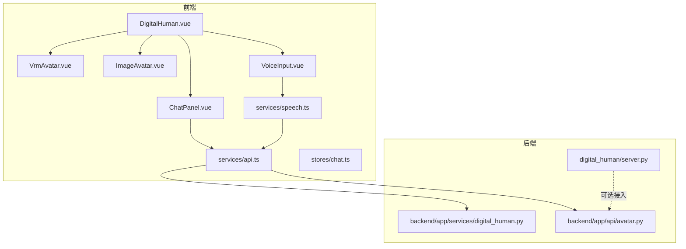
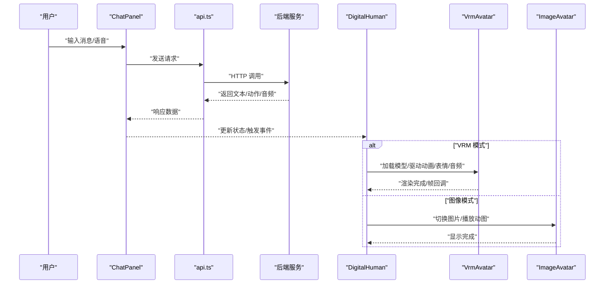
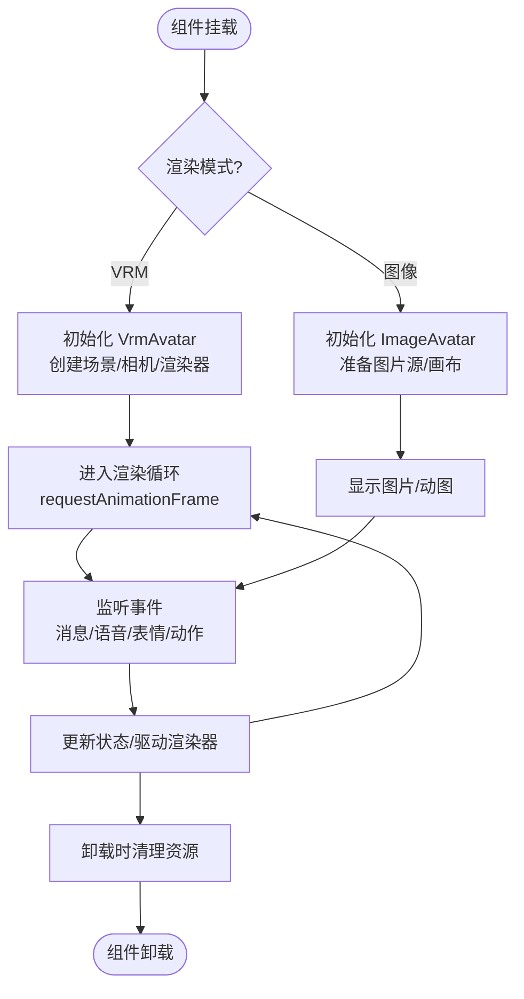
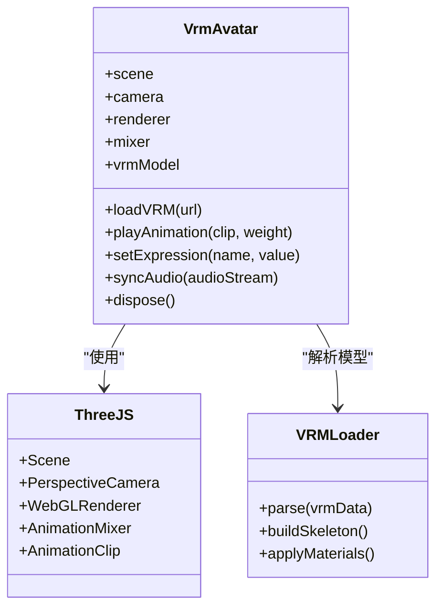
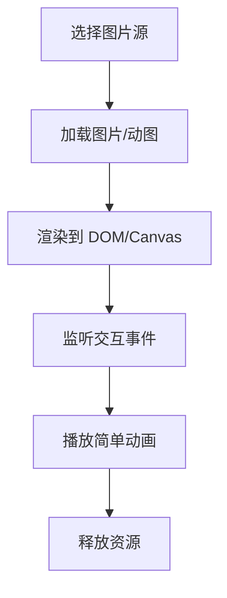
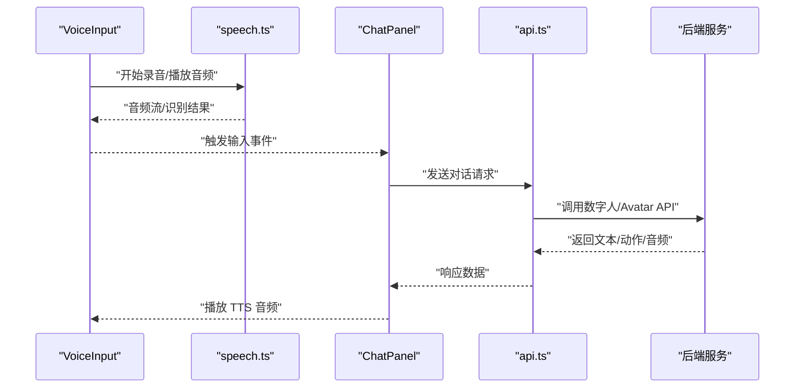
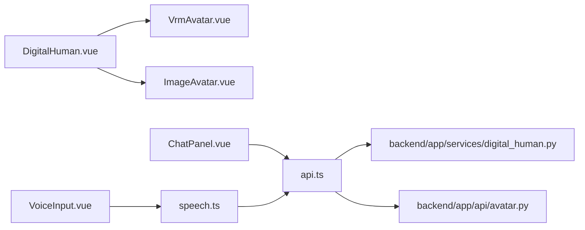

# 数字人渲染引擎

<cite>
**本文引用的文件**   
- [DigitalHuman.vue](file://frontend/tourist-app/src/components/DigitalHuman/DigitalHuman.vue)
- [VrmAvatar.vue](file://frontend/tourist-app/src/components/DigitalHuman/VrmAvatar.vue)
- [ImageAvatar.vue](file://frontend/tourist-app/src/components/DigitalHuman/ImageAvatar.vue)
- [ChatPanel.vue](file://frontend/tourist-app/src/components/ChatPanel/ChatPanel.vue)
- [VoiceInput.vue](file://frontend/tourist-app/src/components/VoiceInput/VoiceInput.vue)
- [speech.ts](file://frontend/tourist-app/src/services/speech.ts)
- [api.ts](file://frontend/tourist-app/src/services/api.ts)
- [chat.ts](file://frontend/tourist-app/src/stores/chat.ts)
- [server.py](file://digital_human/server.py)
- [digital_human.py](file://backend/app/services/digital_human.py)
- [avatar.py](file://backend/app/api/avatar.py)
</cite>

## 目录
1. [简介](#简介)
2. [项目结构](#项目结构)
3. [核心组件](#核心组件)
4. [架构总览](#架构总览)
5. [详细组件分析](#详细组件分析)
6. [依赖关系分析](#依赖关系分析)
7. [性能考虑](#性能考虑)
8. [故障排查指南](#故障排查指南)
9. [结论](#结论)
10. [附录](#附录)

## 简介
本技术文档围绕前端“数字人渲染引擎”展开，聚焦 VRM 模型加载与渲染、3D 场景管理、动画控制与材质优化。重点解析 DigitalHuman 主组件的架构设计（模型初始化、渲染循环、事件监听、生命周期），并深入说明 VrmAvatar 基于 Three.js 的集成实现（VRM 解析、骨骼动画、表情驱动、音频同步）。同时对比 ImageAvatar 图像头像方案，给出性能差异与适用场景建议。文末提供模型格式规范、纹理资源管理、内存优化策略、跨浏览器兼容性处理、组件配置参数与 API 接口定义，以及自定义扩展开发指南。

## 项目结构
本项目采用前后端分离：前端使用 Vue 3 + TypeScript + Vite，Three.js 用于 3D 渲染；后端提供数字人服务与 Avatar 相关 API。关键目录与职责如下：
- frontend/tourist-app/src/components/DigitalHuman：数字人渲染核心组件（DigitalHuman、VrmAvatar、ImageAvatar）
- frontend/tourist-app/src/components/ChatPanel：对话面板，负责消息流与交互
- frontend/tourist-app/src/components/VoiceInput：语音输入，采集麦克风并触发 TTS
- frontend/tourist-app/src/services：网络与语音服务封装（API、Speech）
- frontend/tourist-app/src/stores：状态管理（聊天状态等）
- digital_human/server.py：数字人独立服务入口（可选）
- backend/app/services/digital_human.py：数字人业务逻辑
- backend/app/api/avatar.py：Avatar 相关 API 路由

图表来源
- [DigitalHuman.vue](file://frontend/tourist-app/src/components/DigitalHuman/DigitalHuman.vue)
- [VrmAvatar.vue](file://frontend/tourist-app/src/components/DigitalHuman/VrmAvatar.vue)
- [ImageAvatar.vue](file://frontend/tourist-app/src/components/DigitalHuman/ImageAvatar.vue)
- [ChatPanel.vue](file://frontend/tourist-app/src/components/ChatPanel/ChatPanel.vue)
- [VoiceInput.vue](file://frontend/tourist-app/src/components/VoiceInput/VoiceInput.vue)
- [speech.ts](file://frontend/tourist-app/src/services/speech.ts)
- [api.ts](file://frontend/tourist-app/src/services/api.ts)
- [digital_human.py](file://backend/app/services/digital_human.py)
- [avatar.py](file://backend/app/api/avatar.py)
- [server.py](file://digital_human/server.py)

章节来源
- [DigitalHuman.vue](file://frontend/tourist-app/src/components/DigitalHuman/DigitalHuman.vue)
- [VrmAvatar.vue](file://frontend/tourist-app/src/components/DigitalHuman/VrmAvatar.vue)
- [ImageAvatar.vue](file://frontend/tourist-app/src/components/DigitalHuman/ImageAvatar.vue)
- [ChatPanel.vue](file://frontend/tourist-app/src/components/ChatPanel/ChatPanel.vue)
- [VoiceInput.vue](file://frontend/tourist-app/src/components/VoiceInput/VoiceInput.vue)
- [speech.ts](file://frontend/tourist-app/src/services/speech.ts)
- [api.ts](file://frontend/tourist-app/src/services/api.ts)
- [chat.ts](file://frontend/tourist-app/src/stores/chat.ts)
- [digital_human.py](file://backend/app/services/digital_human.py)
- [avatar.py](file://backend/app/api/avatar.py)
- [server.py](file://digital_human/server.py)

## 核心组件
- DigitalHuman：数字人主容器，负责挂载子组件、协调模型加载、渲染循环、事件总线与生命周期管理。
- VrmAvatar：Three.js 集成层，负责 VRM 模型解析、场景构建、骨骼动画、表情系统、音频同步播放。
- ImageAvatar：轻量级图像头像，通过 HTML/CSS 或 Canvas 展示静态/动态图片，适用于低开销场景。
- ChatPanel：对话 UI，将用户输入与后端对话服务对接，驱动数字人行为。
- VoiceInput：语音采集与播放，结合 Web Speech API 或媒体流进行录音与播放。
- services/speech.ts：语音能力封装（识别/合成/播放）。
- services/api.ts：统一 HTTP 请求封装，调用后端 Avatar 与数字人服务。
- stores/chat.ts：聊天状态集中管理，驱动 UI 与渲染联动。

章节来源
- [DigitalHuman.vue](file://frontend/tourist-app/src/components/DigitalHuman/DigitalHuman.vue)
- [VrmAvatar.vue](file://frontend/tourist-app/src/components/DigitalHuman/VrmAvatar.vue)
- [ImageAvatar.vue](file://frontend/tourist-app/src/components/DigitalHuman/ImageAvatar.vue)
- [ChatPanel.vue](file://frontend/tourist-app/src/components/ChatPanel/ChatPanel.vue)
- [VoiceInput.vue](file://frontend/tourist-app/src/components/VoiceInput/VoiceInput.vue)
- [speech.ts](file://frontend/tourist-app/src/services/speech.ts)
- [api.ts](file://frontend/tourist-app/src/services/api.ts)
- [chat.ts](file://frontend/tourist-app/src/stores/chat.ts)

## 架构总览
整体数据与控制流：
- 用户在 ChatPanel 输入文本或语音，经 api.ts 调用后端服务生成回复与动作指令。
- DigitalHuman 根据当前模式选择 VrmAvatar 或 ImageAvatar 渲染。
- VrmAvatar 在 Three.js 场景中加载 VRM 模型，驱动骨骼与表情，并与音频同步。
- ImageAvatar 以图片形式快速呈现，适合低端设备或简单展示。

图表来源
- [ChatPanel.vue](file://frontend/tourist-app/src/components/ChatPanel/ChatPanel.vue)
- [api.ts](file://frontend/tourist-app/src/services/api.ts)
- [DigitalHuman.vue](file://frontend/tourist-app/src/components/DigitalHuman/DigitalHuman.vue)
- [VrmAvatar.vue](file://frontend/tourist-app/src/components/DigitalHuman/VrmAvatar.vue)
- [ImageAvatar.vue](file://frontend/tourist-app/src/components/DigitalHuman/ImageAvatar.vue)

## 详细组件分析

### DigitalHuman 主组件
职责与流程：
- 初始化：根据配置决定渲染模式（VRM 或图像），创建/销毁子组件实例，准备 Three.js 容器与事件监听。
- 渲染循环：在 VRM 模式下委托 VrmAvatar 维护 requestAnimationFrame 循环；在图像模式下仅做 DOM/Canvas 更新。
- 事件监听：接收来自 ChatPanel 与 VoiceInput 的事件，转发到对应渲染器。
- 生命周期：onMounted 启动，onBeforeUnmount 清理 Three.js 对象、纹理、动画控制器与事件绑定，避免内存泄漏。

图表来源
- [DigitalHuman.vue](file://frontend/tourist-app/src/components/DigitalHuman/DigitalHuman.vue)

章节来源
- [DigitalHuman.vue](file://frontend/tourist-app/src/components/DigitalHuman/DigitalHuman.vue)

### VrmAvatar 组件（Three.js 集成）
功能要点：
- 场景管理：创建 Scene、PerspectiveCamera、WebGLRenderer，设置光照与阴影，添加 OrbitControls（可选）。
- VRM 模型加载：使用 VRM 加载器解析 .vrm 模型，构建骨架与网格，应用材质与贴图。
- 骨骼动画：通过 AnimationMixer 与 AnimationClip 驱动行走、挥手、点头等动作；支持混合与权重控制。
- 表情系统：映射 BlendShape 到嘴型、眨眼、微笑等；可与音频波形或音素驱动口型同步。
- 音频同步：解码音频流，按时间戳驱动表情与微动作，确保唇形与语音一致。
- 性能优化：纹理压缩、LOD、几何体合并、按需加载、禁用不必要后处理。

图表来源
- [VrmAvatar.vue](file://frontend/tourist-app/src/components/DigitalHuman/VrmAvatar.vue)

章节来源
- [VrmAvatar.vue](file://frontend/tourist-app/src/components/DigitalHuman/VrmAvatar.vue)

### ImageAvatar 组件（图像头像）
功能要点：
- 展示静态图片或 GIF/视频片段，作为 VRM 的低成本替代。
- 支持基础交互（点击、悬停）与简单动画（CSS 动画或 Canvas 帧序列）。
- 适用于低端设备、弱网环境或仅需形象展示的页面。

图表来源
- [ImageAvatar.vue](file://frontend/tourist-app/src/components/DigitalHuman/ImageAvatar.vue)

章节来源
- [ImageAvatar.vue](file://frontend/tourist-app/src/components/DigitalHuman/ImageAvatar.vue)

### 语音与对话链路
- VoiceInput：捕获麦克风，调用 speech.ts 进行识别或播放 TTS 音频。
- ChatPanel：聚合用户输入与后端响应，更新 chat.ts 状态，触发 DigitalHuman 行为。
- api.ts：封装 HTTP 请求，调用后端 avatar 与数字人服务。

图表来源
- [VoiceInput.vue](file://frontend/tourist-app/src/components/VoiceInput/VoiceInput.vue)
- [speech.ts](file://frontend/tourist-app/src/services/speech.ts)
- [ChatPanel.vue](file://frontend/tourist-app/src/components/ChatPanel/ChatPanel.vue)
- [api.ts](file://frontend/tourist-app/src/services/api.ts)

章节来源
- [VoiceInput.vue](file://frontend/tourist-app/src/components/VoiceInput/VoiceInput.vue)
- [speech.ts](file://frontend/tourist-app/src/services/speech.ts)
- [ChatPanel.vue](file://frontend/tourist-app/src/components/ChatPanel/ChatPanel.vue)
- [api.ts](file://frontend/tourist-app/src/services/api.ts)
- [chat.ts](file://frontend/tourist-app/src/stores/chat.ts)

## 依赖关系分析
- 前端内部依赖：
  - DigitalHuman 依赖 VrmAvatar 与 ImageAvatar 两种渲染后端。
  - ChatPanel 与 VoiceInput 通过 api.ts 与 speech.ts 与后端交互。
  - stores/chat.ts 为全局状态中心，被多个组件订阅。
- 外部依赖：
  - Three.js 与 VRM 生态库（如 @pixiv/three-vrm）用于 3D 渲染与 VRM 解析。
  - Web Speech API 或第三方语音服务用于识别与合成。
  - 后端 Python 服务提供数字人与 Avatar 能力。

图表来源
- [DigitalHuman.vue](file://frontend/tourist-app/src/components/DigitalHuman/DigitalHuman.vue)
- [VrmAvatar.vue](file://frontend/tourist-app/src/components/DigitalHuman/VrmAvatar.vue)
- [ImageAvatar.vue](file://frontend/tourist-app/src/components/DigitalHuman/ImageAvatar.vue)
- [ChatPanel.vue](file://frontend/tourist-app/src/components/ChatPanel/ChatPanel.vue)
- [VoiceInput.vue](file://frontend/tourist-app/src/components/VoiceInput/VoiceInput.vue)
- [speech.ts](file://frontend/tourist-app/src/services/speech.ts)
- [api.ts](file://frontend/tourist-app/src/services/api.ts)
- [digital_human.py](file://backend/app/services/digital_human.py)
- [avatar.py](file://backend/app/api/avatar.py)

章节来源
- [DigitalHuman.vue](file://frontend/tourist-app/src/components/DigitalHuman/DigitalHuman.vue)
- [VrmAvatar.vue](file://frontend/tourist-app/src/components/DigitalHuman/VrmAvatar.vue)
- [ImageAvatar.vue](file://frontend/tourist-app/src/components/DigitalHuman/ImageAvatar.vue)
- [ChatPanel.vue](file://frontend/tourist-app/src/components/ChatPanel/ChatPanel.vue)
- [VoiceInput.vue](file://frontend/tourist-app/src/components/VoiceInput/VoiceInput.vue)
- [speech.ts](file://frontend/tourist-app/src/services/speech.ts)
- [api.ts](file://frontend/tourist-app/src/services/api.ts)
- [digital_human.py](file://backend/app/services/digital_human.py)
- [avatar.py](file://backend/app/api/avatar.py)

## 性能考虑
- VRM 渲染优化：
  - 纹理：使用压缩格式（如 KTX2/Basis），合理尺寸与 Mipmap，按需加载。
  - 几何体：合并静态网格，减少 Draw Call；启用 LOD。
  - 材质：复用材质实例，避免过多 PBR 计算；关闭不必要的反射/折射。
  - 动画：限制同时播放的动画数量，使用权重混合与采样率控制。
  - 渲染：开启抗锯齿与阴影按需开关；使用 OffscreenCanvas 降低主线程压力。
- 图像头像优化：
  - 使用 WebP/GIF 优化体积；懒加载与预加载策略。
  - 小屏设备降级为静态图，减少 CPU/GPU 负载。
- 音频同步：
  - 使用 AudioContext 与 Web Audio API 进行精确时间戳对齐。
  - 对长音频分片解码，避免阻塞主线程。
- 内存管理：
  - 及时释放 Texture、Geometry、Material 与 AnimationClip。
  - 组件卸载时销毁 Three.js 对象与事件监听器。
- 跨浏览器兼容：
  - WebGL 特性检测与降级策略；对不支持 VRM 的浏览器回退到图像模式。
  - Web Speech API 在不同浏览器的差异处理与提示。

[本节为通用性能指导，不直接分析具体文件]

## 故障排查指南
常见问题与定位方法：
- VRM 模型无法加载：
  - 检查 URL 与 CORS 配置；确认模型格式为 .vrm 且版本兼容。
  - 查看控制台错误日志，定位加载器异常。
- 动画不播放或卡顿：
  - 确认 AnimationClip 存在且权重正确；检查 mixer.update 是否在渲染循环中调用。
  - 评估 GPU/CPU 占用，适当降低分辨率或关闭阴影。
- 表情不同步：
  - 校验音频时间戳与 BlendShape 映射；调整延迟补偿。
- 图像头像不显示：
  - 检查图片路径与 MIME 类型；确认懒加载是否触发。
- 语音识别失败：
  - 检查麦克风权限与浏览器支持；确认 speech.ts 的错误分支处理。

章节来源
- [VrmAvatar.vue](file://frontend/tourist-app/src/components/DigitalHuman/VrmAvatar.vue)
- [ImageAvatar.vue](file://frontend/tourist-app/src/components/DigitalHuman/ImageAvatar.vue)
- [speech.ts](file://frontend/tourist-app/src/services/speech.ts)
- [api.ts](file://frontend/tourist-app/src/services/api.ts)

## 结论
DigitalHuman 主组件通过可插拔的渲染后端（VrmAvatar 与 ImageAvatar）实现了灵活的数字人展示方案。VrmAvatar 基于 Three.js 与 VRM 生态提供了高质量的 3D 渲染与动画控制，适合沉浸式体验；ImageAvatar 则以低成本满足基本展示需求。配合语音与对话链路，系统可在多终端与多场景下稳定运行。通过合理的资源管理与性能优化策略，可实现良好的用户体验与可扩展性。

[本节为总结性内容，不直接分析具体文件]

## 附录

### 模型格式规范
- VRM 模型：
  - 文件格式：.vrm（基于 glTF 扩展）
  - 必需信息：骨骼节点、材质贴图、BlendShape 定义
  - 推荐规范：贴图尺寸不超过 2048x2048，使用压缩纹理；动画 Clip 时长适中，避免过长导致内存峰值
- 图像头像：
  - 格式：PNG/JPEG/WebP/GIF
  - 尺寸：适配常见屏幕分辨率，优先使用矢量或高分辨率素材
  - 动图：GIF 或短视频片段，注意体积与帧率平衡

[本节为通用规范说明，不直接分析具体文件]

### 纹理资源管理
- 命名与组织：按角色/部位/材质分类，便于缓存与复用
- 加载策略：预加载关键纹理，懒加载次要资源；使用 CDN 与缓存头
- 压缩与转码：KTX2/Basis 转码，WebP 替代 PNG/JPEG
- 内存监控：记录纹理大小与引用计数，及时释放未使用资源

[本节为通用资源管理建议，不直接分析具体文件]

### 内存优化策略
- 对象池：复用 Geometry/Material 实例，减少 GC 压力
- 按需加载：分模块加载动画与表情，避免一次性载入全部资源
- 渲染降级：低端设备自动切换到图像模式或降低画质
- 卸载清理：组件销毁时显式 dispose 所有 Three.js 对象与事件监听

[本节为通用优化建议，不直接分析具体文件]

### 跨浏览器兼容性处理
- WebGL 检测：不支持时回退到图像模式
- Web Speech API：检测可用性并提供手动输入备选
- 音频上下文：确保在用户交互后恢复 AudioContext
- 样式与布局：使用 CSS 兼容前缀与 Flex/Grid 降级方案

[本节为通用兼容性建议，不直接分析具体文件]

### 组件配置参数（示例字段）
- DigitalHuman
  - mode: "vrm" | "image"
  - modelUrl: string（VRM 模型地址）
  - imageSrc: string（图像头像地址）
  - autoPlay: boolean（是否自动播放默认动画）
  - audioSync: boolean（是否启用音频同步）
- VrmAvatar
  - sceneOptions: object（光照、阴影、背景）
  - cameraOptions: object（FOV、近/远裁剪面）
  - animationClips: array（动画片段列表）
  - blendShapes: object（表情映射表）
- ImageAvatar
  - src: string
  - loop: boolean（是否循环播放动图）
  - fitMode: "cover" | "contain" | "fill"

[本节为概念性参数说明，不直接分析具体文件]

### API 接口定义（概念）
- 对话与动作
  - POST /api/chat
    - 请求：{ text: string, voice?: boolean }
    - 响应：{ reply: string, actions: array, audio_url?: string }
- Avatar 管理
  - GET /api/avatar/config
    - 响应：{ default_mode: string, supported_formats: array }
  - POST /api/avatar/upload
    - 请求：multipart/form-data（VRM 或图像）
    - 响应：{ url: string, status: string }

[本节为概念性接口说明，不直接分析具体文件]

### 自定义扩展开发指南
- 新增渲染后端：
  - 实现与 VrmAvatar 一致的接口（加载、动画、表情、音频同步、销毁）
  - 在 DigitalHuman 中注册新后端，并通过 mode 切换
- 扩展动画与表情：
  - 在 VRM 模型中补充 BlendShape 与 AnimationClip
  - 在前端映射新的动作名称与权重曲线
- 集成第三方语音：
  - 替换 speech.ts 中的识别/合成实现，保持事件与回调一致
- 性能监控：
  - 引入 FPS 与内存统计，提供调试面板与上报接口

[本节为通用扩展建议，不直接分析具体文件]