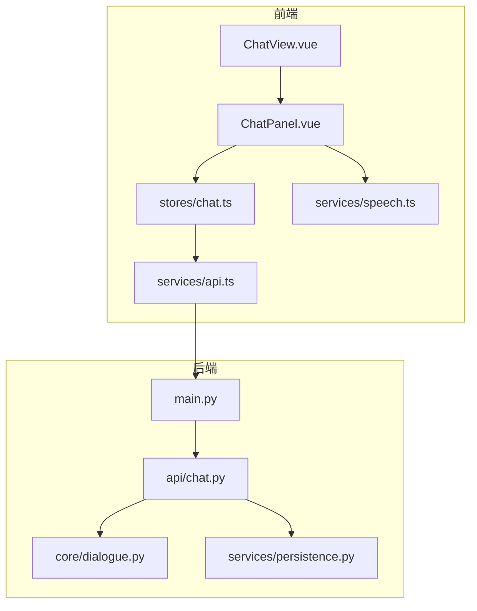
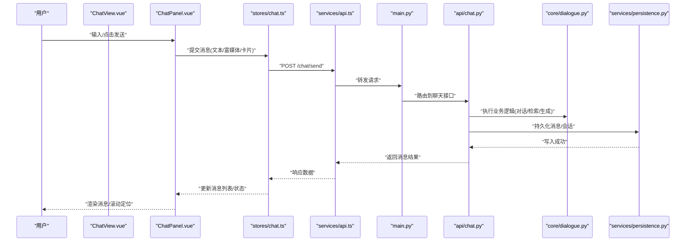
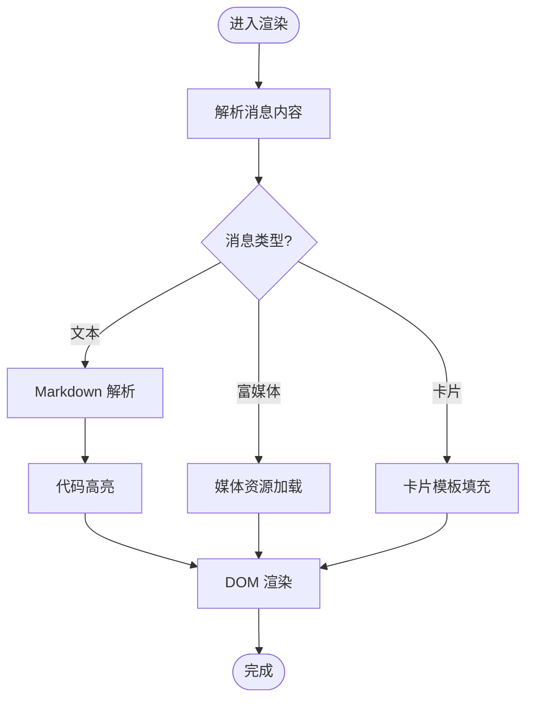
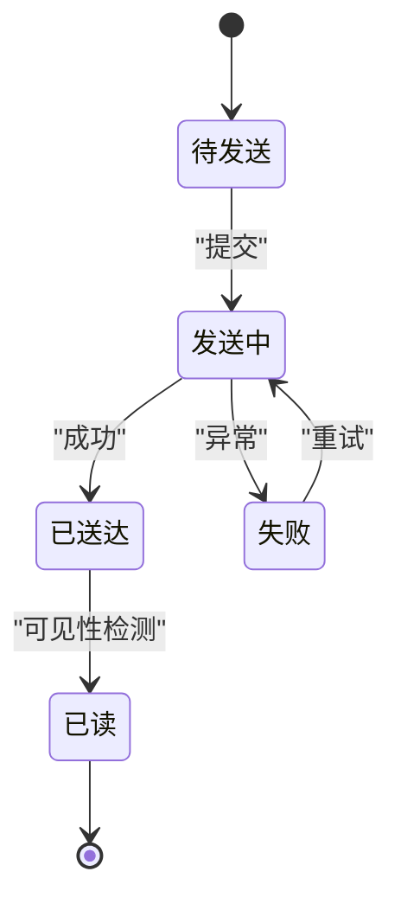
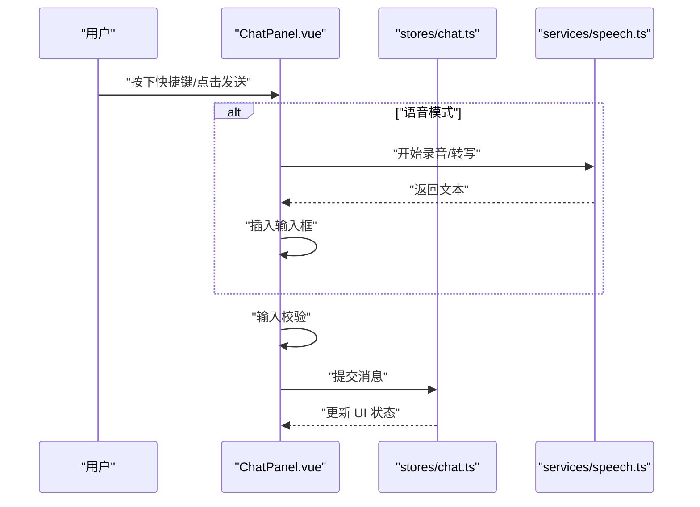
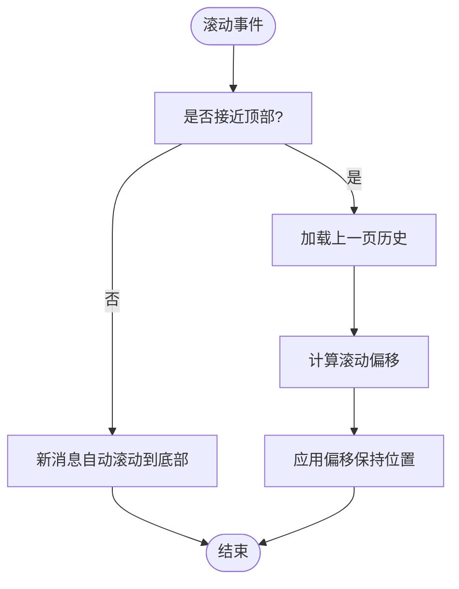
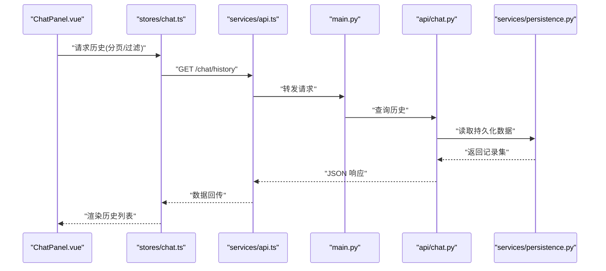
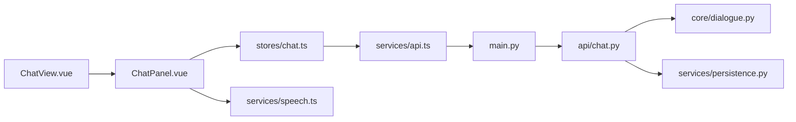

# 聊天面板组件

<cite>
**本文引用的文件**   
- [ChatPanel.vue](file://frontend/tourist-app/src/components/ChatPanel/ChatPanel.vue)
- [chat.ts](file://frontend/tourist-app/src/stores/chat.ts)
- [api.ts](file://frontend/tourist-app/src/services/api.ts)
- [speech.ts](file://frontend/tourist-app/src/services/speech.ts)
- [ChatView.vue](file://frontend/tourist-app/src/views/ChatView.vue)
- [app.py](file://backend/app/main.py)
- [chat_api.py](file://backend/app/api/chat.py)
- [dialogue.py](file://backend/app/core/dialogue.py)
- [persistence.py](file://backend/app/services/persistence.py)
</cite>

## 目录
1. [简介](#简介)
2. [项目结构](#项目结构)
3. [核心组件](#核心组件)
4. [架构总览](#架构总览)
5. [详细组件分析](#详细组件分析)
6. [依赖关系分析](#依赖关系分析)
7. [性能考虑](#性能考虑)
8. [故障排查指南](#故障排查指南)
9. [结论](#结论)
10. [附录](#附录)

## 简介
本技术文档围绕“聊天面板组件”展开，聚焦消息渲染引擎、对话流管理与用户交互逻辑。内容覆盖消息类型（文本、富媒体、卡片）、表情符号渲染、Markdown 解析与代码高亮、滚动管理（自动滚动、增量加载、虚拟列表优化）、键盘快捷键、输入校验、发送状态与错误重试、持久化存储、历史加载、搜索过滤与导出、样式定制与主题切换、响应式适配、多语言支持、属性配置、事件回调、插槽扩展以及第三方集成方案。

## 项目结构
前端采用 Vue 3 + TypeScript 单页应用，聊天面板位于 tourist-app 子应用中；后端基于 Python FastAPI，提供聊天 API、会话与持久化服务。

图表来源
- [ChatView.vue](file://frontend/tourist-app/src/views/ChatView.vue)
- [ChatPanel.vue](file://frontend/tourist-app/src/components/ChatPanel/ChatPanel.vue)
- [chat.ts](file://frontend/tourist-app/src/stores/chat.ts)
- [api.ts](file://frontend/tourist-app/src/services/api.ts)
- [speech.ts](file://frontend/tourist-app/src/services/speech.ts)
- [app.py](file://backend/app/main.py)
- [chat_api.py](file://backend/app/api/chat.py)
- [dialogue.py](file://backend/app/core/dialogue.py)
- [persistence.py](file://backend/app/services/persistence.py)

章节来源
- [ChatView.vue](file://frontend/tourist-app/src/views/ChatView.vue)
- [ChatPanel.vue](file://frontend/tourist-app/src/components/ChatPanel/ChatPanel.vue)
- [chat.ts](file://frontend/tourist-app/src/stores/chat.ts)
- [api.ts](file://frontend/tourist-app/src/services/api.ts)
- [speech.ts](file://frontend/tourist-app/src/services/speech.ts)
- [app.py](file://backend/app/main.py)
- [chat_api.py](file://backend/app/api/chat.py)
- [dialogue.py](file://backend/app/core/dialogue.py)
- [persistence.py](file://backend/app/services/persistence.py)

## 核心组件
- 聊天面板容器：负责消息列表展示、输入区、工具栏、滚动控制与交互事件分发。
- 状态管理：集中维护消息队列、会话上下文、加载状态、错误信息、分页游标等。
- 网络服务：封装 HTTP 请求、重试策略、错误映射与 SSE/WS 事件处理（如使用）。
- 语音服务：封装录音、转写与播放能力，与聊天流程联动。
- 后端 API：提供消息发送、历史加载、会话状态查询、持久化读写等接口。

章节来源
- [ChatPanel.vue](file://frontend/tourist-app/src/components/ChatPanel/ChatPanel.vue)
- [chat.ts](file://frontend/tourist-app/src/stores/chat.ts)
- [api.ts](file://frontend/tourist-app/src/services/api.ts)
- [speech.ts](file://frontend/tourist-app/src/services/speech.ts)
- [chat_api.py](file://backend/app/api/chat.py)
- [dialogue.py](file://backend/app/core/dialogue.py)
- [persistence.py](file://backend/app/services/persistence.py)

## 架构总览
聊天面板前后端协作流程如下：用户在面板输入消息，触发状态更新并调用 API 发送；后端路由到聊天控制器，执行业务逻辑（对话编排、RAG/LLM 调用等），并将结果写入持久化层；前端接收响应后渲染消息，必要时进行增量加载或滚动定位。

图表来源
- [ChatView.vue](file://frontend/tourist-app/src/views/ChatView.vue)
- [ChatPanel.vue](file://frontend/tourist-app/src/components/ChatPanel/ChatPanel.vue)
- [chat.ts](file://frontend/tourist-app/src/stores/chat.ts)
- [api.ts](file://frontend/tourist-app/src/services/api.ts)
- [app.py](file://backend/app/main.py)
- [chat_api.py](file://backend/app/api/chat.py)
- [dialogue.py](file://backend/app/core/dialogue.py)
- [persistence.py](file://backend/app/services/persistence.py)

## 详细组件分析

### 消息渲染引擎
- 消息类型支持
  - 文本：支持 Markdown 语法片段渲染。
  - 富媒体：图片、音频、视频等多媒体资源展示。
  - 卡片消息：结构化布局（标题、摘要、操作按钮）的卡片型消息。
- 表情符号渲染
  - 将 Unicode 表情序列转换为可视化图标，支持主题色适配。
- Markdown 解析与代码高亮
  - 对消息内容进行安全解析，启用行内与块级语法，代码块启用语法高亮与复制功能。
- 渲染管线
  - 原始内容 -> 安全清洗 -> 语法解析 -> 节点树构建 -> 模板渲染 -> 样式注入。

图表来源
- [ChatPanel.vue](file://frontend/tourist-app/src/components/ChatPanel/ChatPanel.vue)

章节来源
- [ChatPanel.vue](file://frontend/tourist-app/src/components/ChatPanel/ChatPanel.vue)

### 对话流管理
- 会话上下文
  - 维护当前会话 ID、消息索引、分页游标、加载状态、错误码等。
- 消息生命周期
  - 待发送 -> 发送中 -> 已送达 -> 已读/失败 -> 重试。
- 增量加载
  - 当用户向上滚动接近顶部时，按页拉取更早的历史消息，保持滚动位置稳定。
- 并发与幂等
  - 对重复发送做去重；失败消息具备重试队列与退避策略。

图表来源
- [chat.ts](file://frontend/tourist-app/src/stores/chat.ts)

章节来源
- [chat.ts](file://frontend/tourist-app/src/stores/chat.ts)

### 用户交互逻辑
- 输入验证
  - 非空校验、长度限制、敏感词过滤、富文本/链接白名单校验。
- 键盘快捷键
  - Enter 发送、Shift+Enter 换行、Ctrl/Cmd+K 打开搜索、Esc 清空输入。
- 焦点与可访问性
  - 自动聚焦输入框、ARIA 标签、屏幕阅读器友好提示。
- 语音输入
  - 通过语音服务实现录音、转写与插入输入框。

图表来源
- [ChatPanel.vue](file://frontend/tourist-app/src/components/ChatPanel/ChatPanel.vue)
- [chat.ts](file://frontend/tourist-app/src/stores/chat.ts)
- [speech.ts](file://frontend/tourist-app/src/services/speech.ts)

章节来源
- [ChatPanel.vue](file://frontend/tourist-app/src/components/ChatPanel/ChatPanel.vue)
- [chat.ts](file://frontend/tourist-app/src/stores/chat.ts)
- [speech.ts](file://frontend/tourist-app/src/services/speech.ts)

### 滚动管理机制
- 自动滚动
  - 新消息到达时平滑滚动到底部，避免打断阅读。
- 增量加载
  - 监听滚动事件，接近顶部阈值时触发历史加载，计算偏移量保持视觉位置不变。
- 虚拟列表优化
  - 仅渲染可视区域的消息项，减少 DOM 节点数量，提升长列表性能。
- 性能调优
  - 防抖/节流滚动监听、按需加载媒体、懒加载图片、骨架屏占位。

图表来源
- [ChatPanel.vue](file://frontend/tourist-app/src/components/ChatPanel/ChatPanel.vue)

章节来源
- [ChatPanel.vue](file://frontend/tourist-app/src/components/ChatPanel/ChatPanel.vue)

### 消息持久化存储、历史记录、搜索过滤与导出
- 持久化存储
  - 后端在收到消息后落库，保证会话与消息一致性。
- 历史记录加载
  - 前端按页拉取，支持时间范围与关键词筛选。
- 搜索过滤
  - 客户端模糊匹配与后端高级检索结合，支持正则与字段过滤。
- 导出功能
  - 支持 JSON/CSV/PDF 导出，包含元数据与附件下载链接。

图表来源
- [ChatPanel.vue](file://frontend/tourist-app/src/components/ChatPanel/ChatPanel.vue)
- [chat.ts](file://frontend/tourist-app/src/stores/chat.ts)
- [api.ts](file://frontend/tourist-app/src/services/api.ts)
- [app.py](file://backend/app/main.py)
- [chat_api.py](file://backend/app/api/chat.py)
- [persistence.py](file://backend/app/services/persistence.py)

章节来源
- [chat.ts](file://frontend/tourist-app/src/stores/chat.ts)
- [api.ts](file://frontend/tourist-app/src/services/api.ts)
- [chat_api.py](file://backend/app/api/chat.py)
- [persistence.py](file://backend/app/services/persistence.py)

### 样式定制、主题切换、响应式适配与多语言
- 样式定制
  - 通过 CSS 变量与主题类名覆盖默认样式，支持深色/浅色模式。
- 主题切换
  - 全局主题开关驱动组件重新渲染，确保颜色与图标一致。
- 响应式适配
  - 移动端优先布局，自适应输入区高度与消息气泡宽度。
- 多语言支持
  - 文案抽离为 i18n 字典，运行时切换语言包。

章节来源
- [ChatPanel.vue](file://frontend/tourist-app/src/components/ChatPanel/ChatPanel.vue)

### 组件属性配置、事件回调、插槽扩展与第三方集成
- 属性配置
  - 消息列表数据源、初始滚动行为、是否显示工具栏、是否启用虚拟列表、主题模式、语言包等。
- 事件回调
  - onSend、onHistoryLoad、onError、onMessageClick、onExport 等。
- 插槽扩展点
  - 自定义消息头部/尾部、工具栏右侧操作、空状态占位。
- 第三方集成
  - 接入 LLM/RAG 服务、ASR/TTS 服务、对象存储、监控与日志上报。

章节来源
- [ChatPanel.vue](file://frontend/tourist-app/src/components/ChatPanel/ChatPanel.vue)
- [chat.ts](file://frontend/tourist-app/src/stores/chat.ts)
- [api.ts](file://frontend/tourist-app/src/services/api.ts)
- [speech.ts](file://frontend/tourist-app/src/services/speech.ts)

## 依赖关系分析
前端模块间依赖清晰：视图层依赖状态层，状态层依赖网络与语音服务；后端路由统一由主应用挂载，聊天接口聚合对话与持久化服务。

图表来源
- [ChatView.vue](file://frontend/tourist-app/src/views/ChatView.vue)
- [ChatPanel.vue](file://frontend/tourist-app/src/components/ChatPanel/ChatPanel.vue)
- [chat.ts](file://frontend/tourist-app/src/stores/chat.ts)
- [api.ts](file://frontend/tourist-app/src/services/api.ts)
- [speech.ts](file://frontend/tourist-app/src/services/speech.ts)
- [app.py](file://backend/app/main.py)
- [chat_api.py](file://backend/app/api/chat.py)
- [dialogue.py](file://backend/app/core/dialogue.py)
- [persistence.py](file://backend/app/services/persistence.py)

章节来源
- [ChatView.vue](file://frontend/tourist-app/src/views/ChatView.vue)
- [ChatPanel.vue](file://frontend/tourist-app/src/components/ChatPanel/ChatPanel.vue)
- [chat.ts](file://frontend/tourist-app/src/stores/chat.ts)
- [api.ts](file://frontend/tourist-app/src/services/api.ts)
- [speech.ts](file://frontend/tourist-app/src/services/speech.ts)
- [app.py](file://backend/app/main.py)
- [chat_api.py](file://backend/app/api/chat.py)
- [dialogue.py](file://backend/app/core/dialogue.py)
- [persistence.py](file://backend/app/services/persistence.py)

## 性能考虑
- 渲染性能
  - 使用虚拟列表减少 DOM 节点；对大文本与富媒体进行懒加载与分片渲染。
- 网络性能
  - 请求合并与缓存、分页增量加载、断线重连与指数退避重试。
- 内存占用
  - 及时释放不再使用的媒体引用；清理定时器与事件监听器。
- 用户体验
  - 骨架屏与占位图；关键路径异步化，避免阻塞主线程。

[本节为通用指导，不直接分析具体文件]

## 故障排查指南
- 常见问题
  - 消息未渲染：检查消息类型与解析器配置；确认 Markdown 与安全策略。
  - 滚动错位：核对增量加载后的偏移计算；确认虚拟列表窗口大小变化。
  - 发送失败：查看网络错误码与重试次数；检查后端日志与持久化写入。
  - 语音异常：确认浏览器权限与编码格式；检查转写服务可用性。
- 调试建议
  - 开启前端控制台日志与网络面板；在后端启用请求追踪与慢查询日志。
  - 使用单元测试覆盖输入校验、重试策略与渲染分支。

章节来源
- [chat.ts](file://frontend/tourist-app/src/stores/chat.ts)
- [api.ts](file://frontend/tourist-app/src/services/api.ts)
- [speech.ts](file://frontend/tourist-app/src/services/speech.ts)
- [chat_api.py](file://backend/app/api/chat.py)
- [persistence.py](file://backend/app/services/persistence.py)

## 结论
聊天面板组件以清晰的职责划分与模块化设计实现了完整的消息渲染、对话流管理与用户交互能力。通过虚拟列表、增量加载与稳健的重试机制，兼顾了性能与稳定性。配合主题、响应式与多语言支持，组件具备良好的可扩展性与可定制性，适合在多场景下快速集成。

[本节为总结性内容，不直接分析具体文件]

## 附录
- 术语表
  - 虚拟列表：仅渲染可视区域的列表项以提升性能的技术。
  - 增量加载：根据滚动位置分批加载历史数据的策略。
  - 幂等：多次执行同一请求不会产生副作用。
- 参考实现路径
  - 消息渲染与交互：[ChatPanel.vue](file://frontend/tourist-app/src/components/ChatPanel/ChatPanel.vue)
  - 状态与事件：[chat.ts](file://frontend/tourist-app/src/stores/chat.ts)
  - 网络与服务：[api.ts](file://frontend/tourist-app/src/services/api.ts)、[speech.ts](file://frontend/tourist-app/src/services/speech.ts)
  - 后端接口与持久化：[app.py](file://backend/app/main.py)、[chat_api.py](file://backend/app/api/chat.py)、[dialogue.py](file://backend/app/core/dialogue.py)、[persistence.py](file://backend/app/services/persistence.py)