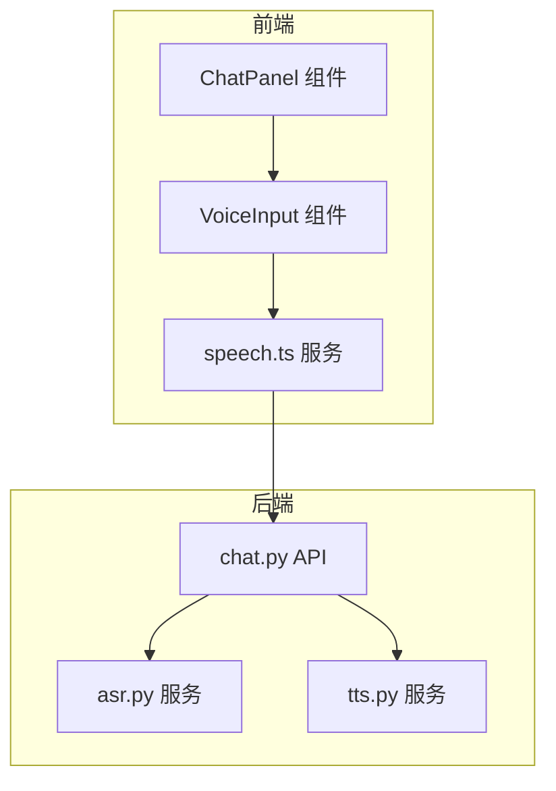
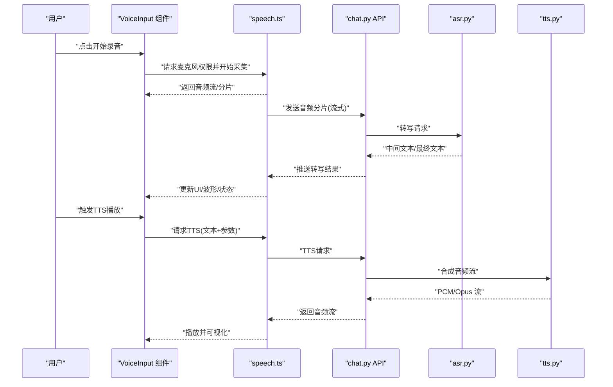
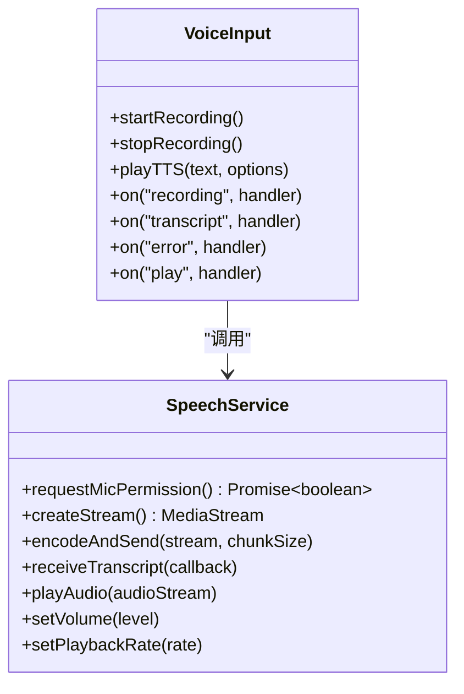
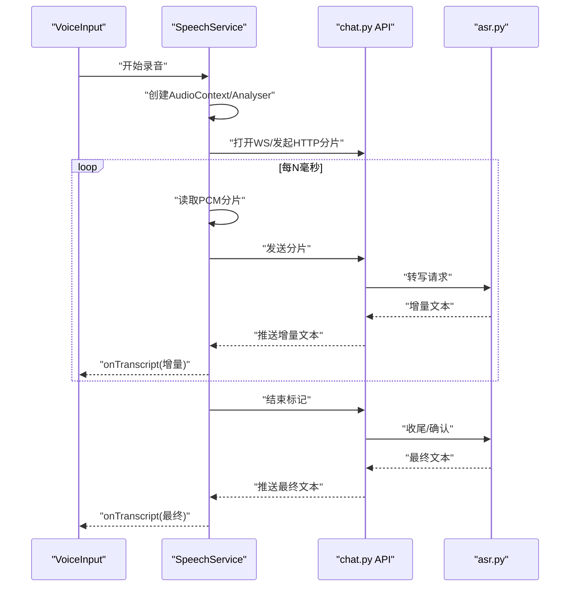
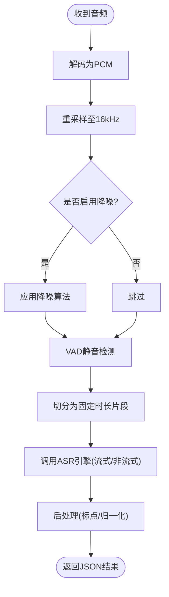
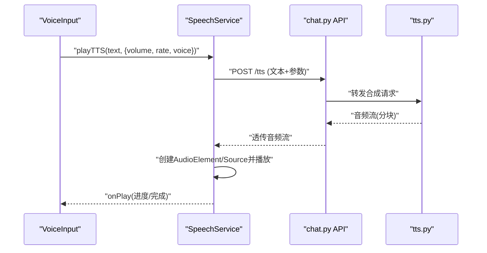
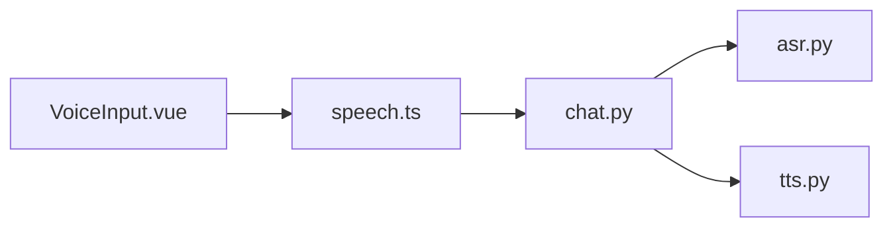

# 语音输入组件

<cite>
**本文引用的文件**   
- [frontend/tourist-app/src/components/VoiceInput/VoiceInput.vue](file://frontend/tourist-app/src/components/VoiceInput/VoiceInput.vue)
- [frontend/tourist-app/src/services/speech.ts](file://frontend/tourist-app/src/services/speech.ts)
- [backend/app/services/asr.py](file://backend/app/services/asr.py)
- [backend/app/services/tts.py](file://backend/app/services/tts.py)
- [backend/app/api/chat.py](file://backend/app/api/chat.py)
</cite>

## 目录
1. [简介](#简介)
2. [项目结构](#项目结构)
3. [核心组件](#核心组件)
4. [架构总览](#架构总览)
5. [详细组件分析](#详细组件分析)
6. [依赖关系分析](#依赖关系分析)
7. [性能考虑](#性能考虑)
8. [故障排查指南](#故障排查指南)
9. [结论](#结论)
10. [附录](#附录)

## 简介
本技术文档围绕“语音输入组件”展开，覆盖前端 Web Audio API 集成、麦克风权限处理、音频录制与实时转写机制；后端 ASR/TTS 服务对接、音频格式转换、采样率处理与降噪策略；以及 TTS 播放控制（音量、语速、情感音色）、波形可视化、录音状态指示、错误处理与异常恢复。同时给出指令识别、关键词检测、手势触发与自动化流程的设计建议，并提供多语言/方言支持、离线与云端混合方案、配置项、事件接口、性能优化与移动端适配指南。

## 项目结构
本项目采用前后端分离架构：
- 前端（tourist-app）提供语音输入组件与语音服务封装，负责采集、编码、上传与播放。
- 后端（app）提供 ASR 与 TTS 服务，并通过 API 暴露给前端。

图表来源
- [frontend/tourist-app/src/components/VoiceInput/VoiceInput.vue](file://frontend/tourist-app/src/components/VoiceInput/VoiceInput.vue)
- [frontend/tourist-app/src/services/speech.ts](file://frontend/tourist-app/src/services/speech.ts)
- [backend/app/api/chat.py](file://backend/app/api/chat.py)
- [backend/app/services/asr.py](file://backend/app/services/asr.py)
- [backend/app/services/tts.py](file://backend/app/services/tts.py)

章节来源
- [frontend/tourist-app/src/components/VoiceInput/VoiceInput.vue](file://frontend/tourist-app/src/components/VoiceInput/VoiceInput.vue)
- [frontend/tourist-app/src/services/speech.ts](file://frontend/tourist-app/src/services/speech.ts)
- [backend/app/api/chat.py](file://backend/app/api/chat.py)
- [backend/app/services/asr.py](file://backend/app/services/asr.py)
- [backend/app/services/tts.py](file://backend/app/services/tts.py)

## 核心组件
- 语音输入组件（VoiceInput.vue）
  - 职责：用户交互（开始/停止录音）、权限申请、波形可视化、状态提示、调用 speech.ts 完成上传与结果展示。
- 语音服务（speech.ts）
  - 职责：封装 Web Audio API、MediaRecorder、WebSocket/HTTP 流式传输、音频重采样与格式转换、TTS 播放控制。
- 后端 ASR 服务（asr.py）
  - 职责：接收音频流或分片，执行降噪、VAD、转码、调用 ASR 引擎并返回文本。
- 后端 TTS 服务（tts.py）
  - 职责：根据文本与参数生成音频流，支持音量、语速、音色选择。
- 聊天 API（chat.py）
  - 职责：聚合 ASR/TTS 能力，统一对外暴露 REST/WebSocket 接口。

章节来源
- [frontend/tourist-app/src/components/VoiceInput/VoiceInput.vue](file://frontend/tourist-app/src/components/VoiceInput/VoiceInput.vue)
- [frontend/tourist-app/src/services/speech.ts](file://frontend/tourist-app/src/services/speech.ts)
- [backend/app/services/asr.py](file://backend/app/services/asr.py)
- [backend/app/services/tts.py](file://backend/app/services/tts.py)
- [backend/app/api/chat.py](file://backend/app/api/chat.py)

## 架构总览
整体数据流：浏览器采集音频 → 前端预处理与编码 → 通过 HTTP/WebSocket 发送至后端 → ASR 转写 → 业务逻辑处理 → TTS 合成 → 前端播放与可视化。

图表来源
- [frontend/tourist-app/src/components/VoiceInput/VoiceInput.vue](file://frontend/tourist-app/src/components/VoiceInput/VoiceInput.vue)
- [frontend/tourist-app/src/services/speech.ts](file://frontend/tourist-app/src/services/speech.ts)
- [backend/app/api/chat.py](file://backend/app/api/chat.py)
- [backend/app/services/asr.py](file://backend/app/services/asr.py)
- [backend/app/services/tts.py](file://backend/app/services/tts.py)

## 详细组件分析

### 前端：VoiceInput 组件
- 功能要点
  - 录音控制：开始/暂停/停止，状态机管理（空闲、录音中、转写中、播放中）。
  - 权限处理：使用 navigator.mediaDevices.getUserMedia 申请麦克风权限，失败时引导用户授权。
  - 波形可视化：基于 AnalyserNode 获取频域/时域数据，驱动 Canvas/SVG 绘制。
  - 事件总线：对外暴露 onRecording/onTranscript/onError/onPlay 等事件，供父组件消费。
  - 错误处理：网络异常、权限拒绝、设备不可用、解码失败等场景的降级与提示。
- 关键实现路径
  - 组件入口与生命周期：[VoiceInput.vue](file://frontend/tourist-app/src/components/VoiceInput/VoiceInput.vue)
  - 与 speech.ts 的交互方法：[speech.ts](file://frontend/tourist-app/src/services/speech.ts)

章节来源
- [frontend/tourist-app/src/components/VoiceInput/VoiceInput.vue](file://frontend/tourist-app/src/components/VoiceInput/VoiceInput.vue)
- [frontend/tourist-app/src/services/speech.ts](file://frontend/tourist-app/src/services/speech.ts)

#### 类图（前端组件与服务）

图表来源
- [frontend/tourist-app/src/components/VoiceInput/VoiceInput.vue](file://frontend/tourist-app/src/components/VoiceInput/VoiceInput.vue)
- [frontend/tourist-app/src/services/speech.ts](file://frontend/tourist-app/src/services/speech.ts)

### 前端：speech.ts 服务
- 功能要点
  - Web Audio API：创建 AudioContext、AnalyserNode、MediaStreamSource，进行频谱/波形计算。
  - 录音与编码：MediaRecorder 捕获 PCM，按需转换为 Opus/MP3/AAC，支持分片上传。
  - 流式传输：优先 WebSocket 低延迟回传；退化为 HTTP 分段 POST。
  - 重采样与格式：在需要时将 48kHz 降采样至 16kHz，确保与 ASR 模型一致。
  - TTS 播放：将后端返回的音频流接入 AudioElement 或 Web Audio API 播放，支持音量与语速调节。
- 关键实现路径
  - 音频上下文与节点初始化：[speech.ts](file://frontend/tourist-app/src/services/speech.ts)
  - 录音与分片发送：[speech.ts](file://frontend/tourist-app/src/services/speech.ts)
  - 播放控制与可视化：[speech.ts](file://frontend/tourist-app/src/services/speech.ts)

章节来源
- [frontend/tourist-app/src/services/speech.ts](file://frontend/tourist-app/src/services/speech.ts)

#### 序列图（录音到转写）

图表来源
- [frontend/tourist-app/src/services/speech.ts](file://frontend/tourist-app/src/services/speech.ts)
- [backend/app/api/chat.py](file://backend/app/api/chat.py)
- [backend/app/services/asr.py](file://backend/app/services/asr.py)

### 后端：ASR 服务（asr.py）
- 功能要点
  - 输入兼容：接受 PCM/Opus/MP3/AAC，内部统一重采样至 16kHz。
  - 降噪与 VAD：可选前置降噪（谱减法/维纳滤波）与静音段剔除，减少无效帧。
  - 转写引擎：对接云端/本地 ASR 提供商，支持流式与非流式两种模式。
  - 输出格式：返回结构化 JSON（含时间戳、置信度、候选词），便于前端高亮与纠错。
- 关键实现路径
  - 服务入口与参数校验：[asr.py](file://backend/app/services/asr.py)
  - 音频预处理与转写调度：[asr.py](file://backend/app/services/asr.py)

章节来源
- [backend/app/services/asr.py](file://backend/app/services/asr.py)

#### 流程图（ASR 处理管线）

图表来源
- [backend/app/services/asr.py](file://backend/app/services/asr.py)

### 后端：TTS 服务（tts.py）
- 功能要点
  - 参数控制：支持音量、语速、音色（性别/风格/情感）选择。
  - 流式输出：以分块方式返回音频流，降低首包延迟。
  - 格式兼容：默认 PCM/Opus，前端可自适应解码。
- 关键实现路径
  - 合成入口与参数解析：[tts.py](file://backend/app/services/tts.py)
  - 音频流输出：[tts.py](file://backend/app/services/tts.py)

章节来源
- [backend/app/services/tts.py](file://backend/app/services/tts.py)

#### 序列图（TTS 播放）

图表来源
- [frontend/tourist-app/src/services/speech.ts](file://frontend/tourist-app/src/services/speech.ts)
- [backend/app/api/chat.py](file://backend/app/api/chat.py)
- [backend/app/services/tts.py](file://backend/app/services/tts.py)

### 后端：聊天 API（chat.py）
- 功能要点
  - 统一路由：/asr、/tts、/stream 等接口，屏蔽底层差异。
  - 鉴权与限流：对敏感接口增加鉴权与速率限制。
  - 错误映射：将上游错误转换为标准错误码与消息。
- 关键实现路径
  - 路由定义与中间件：[chat.py](file://backend/app/api/chat.py)

章节来源
- [backend/app/api/chat.py](file://backend/app/api/chat.py)

## 依赖关系分析
- 前端依赖
  - Web Audio API、MediaRecorder、WebSocket/HTTP 客户端。
  - 可选：WebAssembly 编解码器（如 opus.js）用于浏览器内转码。
- 后端依赖
  - ASR 提供商 SDK/REST API（云端）或本地推理框架（离线）。
  - 音频处理库（重采样、降噪、VAD）。
  - TTS 引擎（云端/本地）。

图表来源
- [frontend/tourist-app/src/components/VoiceInput/VoiceInput.vue](file://frontend/tourist-app/src/components/VoiceInput/VoiceInput.vue)
- [frontend/tourist-app/src/services/speech.ts](file://frontend/tourist-app/src/services/speech.ts)
- [backend/app/api/chat.py](file://backend/app/api/chat.py)
- [backend/app/services/asr.py](file://backend/app/services/asr.py)
- [backend/app/services/tts.py](file://backend/app/services/tts.py)

章节来源
- [frontend/tourist-app/src/components/VoiceInput/VoiceInput.vue](file://frontend/tourist-app/src/components/VoiceInput/VoiceInput.vue)
- [frontend/tourist-app/src/services/speech.ts](file://frontend/tourist-app/src/services/speech.ts)
- [backend/app/api/chat.py](file://backend/app/api/chat.py)
- [backend/app/services/asr.py](file://backend/app/services/asr.py)
- [backend/app/services/tts.py](file://backend/app/services/tts.py)

## 性能考虑
- 前端
  - 使用 OffscreenCanvas 或 requestAnimationFrame 节流波形绘制，避免主线程阻塞。
  - 合理设置分片大小（如 20–50ms），平衡延迟与带宽。
  - 仅在录音期间开启 Analyser，播放结束后释放资源。
- 后端
  - 流式处理：ASR/TTS 均按分块处理，降低端到端延迟。
  - 预分配缓冲区与零拷贝路径，减少 GC 压力。
  - 并发控制：对 ASR/TTS 队列做背压与超时熔断。

## 故障排查指南
- 常见问题
  - 麦克风权限被拒：检查 HTTPS 环境与安全上下文，引导用户重新授权。
  - 无声/静音：确认设备选择、系统音量与浏览器权限。
  - 转写乱码/空白：检查采样率与编码格式是否与 ASR 要求一致。
  - 播放卡顿：检查网络抖动与缓冲策略，必要时切换为 HTTP 分段。
- 定位手段
  - 前端：打印 AudioContext 状态、Analyser 数据范围、分片大小与频率。
  - 后端：记录 ASR/TTS 耗时、错误码与重试次数。
- 恢复策略
  - 自动重试与指数退避，失败回退到非流式模式。
  - 断线重连与状态同步，保证 UI 一致性。

章节来源
- [frontend/tourist-app/src/services/speech.ts](file://frontend/tourist-app/src/services/speech.ts)
- [backend/app/api/chat.py](file://backend/app/api/chat.py)

## 结论
本组件以 Web Audio API 为核心，结合流式 ASR/TTS 服务，实现了低延迟、可扩展的语音输入体验。通过模块化设计与清晰的错误恢复策略，可在多端与多环境下稳定运行。后续可进一步增强离线能力、方言支持与个性化音色生态。

## 附录

### 配置选项（示例）
- 通用
  - sampleRate: 目标采样率（默认 16000）
  - codec: 编码格式（pcm/opus/mp3/aac）
  - chunkMs: 分片时长（毫秒）
- ASR
  - provider: 提供商标识（cloud/local）
  - language: 语言代码（zh-CN/en-US 等）
  - vadThreshold: 静音阈值
  - denoise: 是否启用降噪
- TTS
  - voice: 音色ID
  - rate: 语速倍率
  - volume: 音量（0–1）

### 事件监听接口（示例）
- onRecording(state): 录音状态变化
- onTranscript(text, isFinal): 转写结果（增量/最终）
- onError(code, message): 错误回调
- onPlay(progress, duration): 播放进度与总时长

### 多语言与方言
- 前端传递 language 与 region 参数，后端根据 provider 路由到对应模型。
- 方言可通过 provider 的方言 ID 或自定义词典增强识别效果。

### 离线与云端混合
- 在线优先：低延迟、高质量；离线兜底：本地轻量模型仅做热词与短指令。
- 自动切换：网络质量低于阈值时切换到离线模式，并在恢复后同步历史。

### 移动端适配
- iOS Safari 需用户手势触发 AudioContext 与录音。
- 横竖屏切换时重建 AudioContext，避免状态丢失。
- 后台运行时暂停录音与播放，前台恢复。

### 指令识别与关键词检测
- 前端热词表：在本地进行快速匹配，命中后触发自动化流程。
- 后端语义层：对完整句子进行意图识别与槽位填充，驱动业务流程。