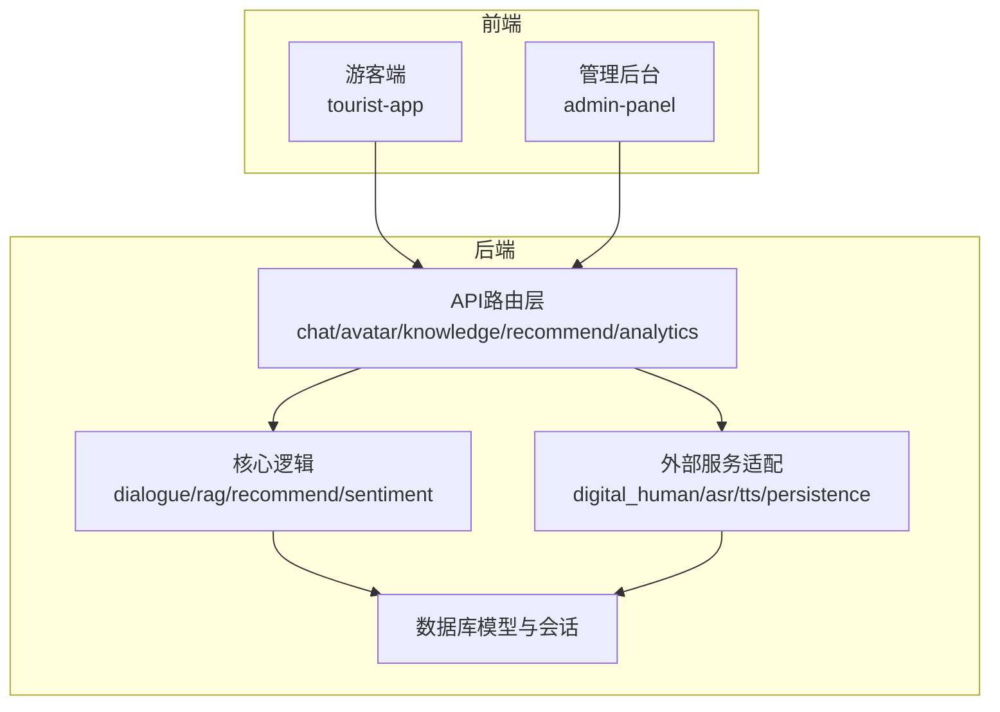
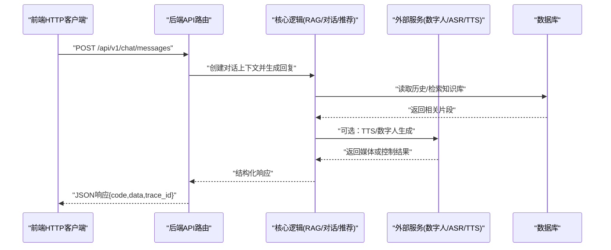
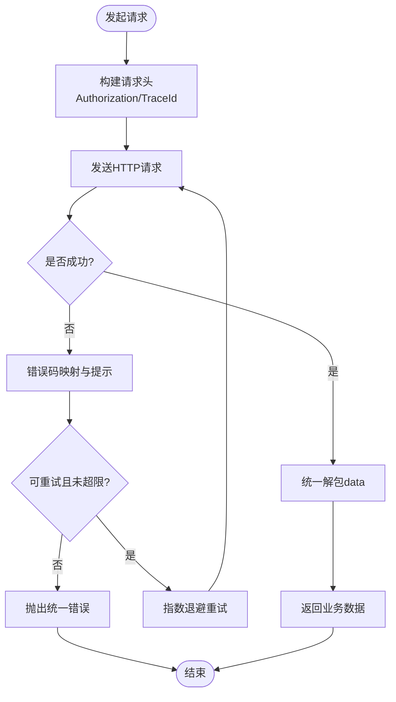
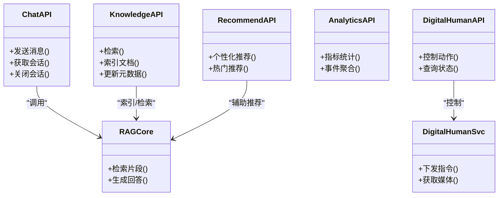
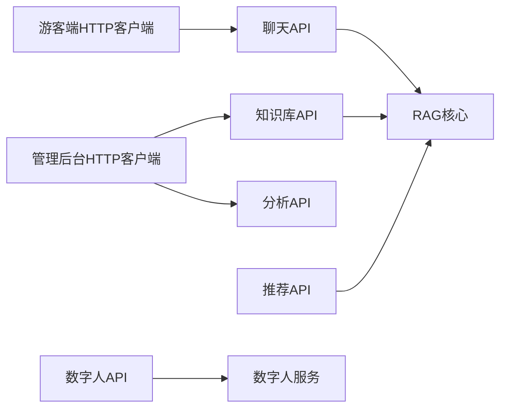

# 前后端API集成

<cite>
**本文引用的文件**   
- [backend/app/main.py](file://backend/app/main.py)
- [backend/app/config.py](file://backend/app/config.py)
- [backend/app/api/chat.py](file://backend/app/api/chat.py)
- [backend/app/api/avatar.py](file://backend/app/api/avatar.py)
- [backend/app/api/digital_human_broadcast.py](file://backend/app/api/digital_human_broadcast.py)
- [backend/app/api/knowledge.py](file://backend/app/api/knowledge.py)
- [backend/app/api/recommend.py](file://backend/app/api/recommend.py)
- [backend/app/api/analytics.py](file://backend/app/api/analytics.py)
- [backend/app/core/rag.py](file://backend/app/core/rag.py)
- [backend/app/services/digital_human.py](file://backend/app/services/digital_human.py)
- [frontend/tourist-app/src/services/api.ts](file://frontend/tourist-app/src/services/api.ts)
- [frontend/admin-panel/src/services/api.ts](file://frontend/admin-panel/src/services/api.ts)
</cite>

## 目录
1. [简介](#简介)
2. [项目结构](#项目结构)
3. [核心组件](#核心组件)
4. [架构总览](#架构总览)
5. [详细组件分析](#详细组件分析)
6. [依赖分析](#依赖分析)
7. [性能考虑](#性能考虑)
8. [故障排查指南](#故障排查指南)
9. [结论](#结论)
10. [附录](#附录)

## 简介
本文件面向前后端开发者，系统化梳理智能旅游项目的API集成方案。内容覆盖后端服务层架构、HTTP客户端配置、请求拦截器与响应处理器、统一错误处理、认证授权与Token管理、重试与超时策略、版本化接口设计、Mock数据支持、调试工具与性能监控，并提供聊天对话、数字人控制、知识库查询、推荐服务、数据分析等关键接口的调用示例与最佳实践。

## 项目结构
本项目采用前后端分离的模块化架构：
- 后端（FastAPI）：按功能域划分API路由与服务层，核心能力包括对话、RAG检索增强生成、数字人控制、知识检索、推荐与分析。
- 前端（Vue + Vite）：游客端与管理后台分别封装HTTP客户端，提供统一的API调用入口。

图表来源
- [backend/app/main.py](file://backend/app/main.py)
- [backend/app/api/chat.py](file://backend/app/api/chat.py)
- [backend/app/api/knowledge.py](file://backend/app/api/knowledge.py)
- [backend/app/api/recommend.py](file://backend/app/api/recommend.py)
- [backend/app/api/analytics.py](file://backend/app/api/analytics.py)
- [backend/app/api/avatar.py](file://backend/app/api/avatar.py)
- [backend/app/api/digital_human_broadcast.py](file://backend/app/api/digital_human_broadcast.py)
- [backend/app/core/rag.py](file://backend/app/core/rag.py)
- [backend/app/services/digital_human.py](file://backend/app/services/digital_human.py)

章节来源
- [backend/app/main.py](file://backend/app/main.py)
- [backend/app/config.py](file://backend/app/config.py)

## 核心组件
- HTTP客户端封装（前端）
  - 统一实例初始化、基础URL、默认头、超时与重试配置
  - 请求拦截器：注入鉴权头、追踪ID、日志埋点
  - 响应拦截器：统一解包业务数据、错误码映射、幂等处理
- 后端API路由层
  - 路由组织：按领域拆分模块，集中注册到应用入口
  - 参数校验与返回模型：使用Pydantic进行输入输出约束
  - 中间件：CORS、请求日志、异常捕获与标准化错误响应
- 服务层与核心逻辑
  - RAG检索增强生成、对话状态管理、推荐算法、情感分析
  - 外部服务适配：数字人控制、ASR/TTS、持久化存储
- 配置与环境
  - 环境变量加载、跨域与安全开关、第三方服务密钥与端点

章节来源
- [frontend/tourist-app/src/services/api.ts](file://frontend/tourist-app/src/services/api.ts)
- [frontend/admin-panel/src/services/api.ts](file://frontend/admin-panel/src/services/api.ts)
- [backend/app/main.py](file://backend/app/main.py)
- [backend/app/config.py](file://backend/app/config.py)

## 架构总览
前后端通过RESTful API交互，前端在浏览器或Node环境中发起HTTP请求，后端由FastAPI提供服务，内部再调用核心逻辑与外部服务。

图表来源
- [backend/app/api/chat.py](file://backend/app/api/chat.py)
- [backend/app/core/rag.py](file://backend/app/core/rag.py)
- [backend/app/services/digital_human.py](file://backend/app/services/digital_human.py)

## 详细组件分析

### 前端HTTP客户端封装（游客端）
职责
- 初始化Axios实例，设置基础URL、超时、重试次数
- 请求拦截器：自动附加Authorization、X-Trace-Id、X-Request-Id
- 响应拦截器：统一解析data字段、错误码转换、网络异常兜底
- 业务方法封装：聊天、数字人控制、知识库、推荐、分析等

章节来源
- [frontend/tourist-app/src/services/api.ts](file://frontend/tourist-app/src/services/api.ts)

### 前端HTTP客户端封装（管理后台）
差异点
- 可能启用不同的基础URL与超时策略
- 额外携带管理员权限标识或租户信息
- 针对批量操作与文件上传做特殊处理

章节来源
- [frontend/admin-panel/src/services/api.ts](file://frontend/admin-panel/src/services/api.ts)

### 后端API路由层
- 路由组织
  - 聊天对话：消息发送、流式响应、会话管理
  - 数字人控制：动作指令、状态查询、媒体资源
  - 知识库：文档索引、检索、更新
  - 推荐：基于用户画像与上下文的推荐列表
  - 分析：指标统计、趋势、事件聚合
- 中间件
  - CORS、请求日志、全局异常捕获、统一错误格式
- 版本管理
  - 路径前缀 /api/v1，便于后续演进与兼容

章节来源
- [backend/app/main.py](file://backend/app/main.py)
- [backend/app/api/chat.py](file://backend/app/api/chat.py)
- [backend/app/api/avatar.py](file://backend/app/api/avatar.py)
- [backend/app/api/digital_human_broadcast.py](file://backend/app/api/digital_human_broadcast.py)
- [backend/app/api/knowledge.py](file://backend/app/api/knowledge.py)
- [backend/app/api/recommend.py](file://backend/app/api/recommend.py)
- [backend/app/api/analytics.py](file://backend/app/api/analytics.py)

### 核心逻辑与服务层
- RAG检索增强生成
  - 将用户问题转换为向量，检索知识库片段，结合上下文生成回答
- 对话管理
  - 维护会话状态、历史摘要、意图识别
- 推荐服务
  - 基于用户行为与偏好生成个性化推荐
- 外部服务适配
  - 数字人控制：播放、暂停、表情切换、语音合成
  - ASR/TTS：语音转文本、文本转语音
  - 持久化：会话、日志、指标落库

图表来源
- [backend/app/api/chat.py](file://backend/app/api/chat.py)
- [backend/app/api/knowledge.py](file://backend/app/api/knowledge.py)
- [backend/app/api/recommend.py](file://backend/app/api/recommend.py)
- [backend/app/api/analytics.py](file://backend/app/api/analytics.py)
- [backend/app/api/digital_human_broadcast.py](file://backend/app/api/digital_human_broadcast.py)
- [backend/app/core/rag.py](file://backend/app/core/rag.py)
- [backend/app/services/digital_human.py](file://backend/app/services/digital_human.py)

章节来源
- [backend/app/core/rag.py](file://backend/app/core/rag.py)
- [backend/app/services/digital_human.py](file://backend/app/services/digital_human.py)

### 认证授权机制与Token管理
- 认证流程
  - 登录成功后颁发JWT，前端保存至本地存储
  - 请求拦截器自动注入Authorization头
- Token刷新
  - 过期前主动刷新或收到401时触发刷新流程
  - 刷新失败则跳转登录页并清理敏感信息
- 权限控制
  - 基于角色的访问控制（RBAC），区分游客与管理员
  - 管理后台接口增加额外校验

章节来源
- [frontend/tourist-app/src/services/api.ts](file://frontend/tourist-app/src/services/api.ts)
- [frontend/admin-panel/src/services/api.ts](file://frontend/admin-panel/src/services/api.ts)

### 请求重试与超时处理策略
- 重试条件
  - 仅对幂等请求（GET/HEAD/OPTIONS）或明确标记为可重试的请求
  - 网络错误、5xx服务端错误、限流429
- 退避策略
  - 指数退避+抖动，避免雪崩
  - 最大重试次数限制，防止无限循环
- 超时配置
  - 短连接接口：较短超时
  - 长任务或流式接口：较长超时或分片超时

章节来源
- [frontend/tourist-app/src/services/api.ts](file://frontend/tourist-app/src/services/api.ts)
- [frontend/admin-panel/src/services/api.ts](file://frontend/admin-panel/src/services/api.ts)

### 统一错误处理
- 错误模型
  - 统一响应体包含code、message、trace_id、details
- 错误分类
  - 客户端错误（参数校验失败、权限不足）
  - 服务端错误（业务异常、系统异常）
  - 网络错误（超时、DNS、连接中断）
- 前端处理
  - 拦截器统一映射错误码为用户可读提示
  - 记录trace_id以便定位问题

章节来源
- [backend/app/main.py](file://backend/app/main.py)
- [frontend/tourist-app/src/services/api.ts](file://frontend/tourist-app/src/services/api.ts)

### API版本管理
- 路径前缀
  - 所有接口以/api/v1开头，便于后续升级至v2
- 兼容性策略
  - 新增字段保持向后兼容
  - 废弃字段保留一段时间并给出迁移指引

章节来源
- [backend/app/main.py](file://backend/app/main.py)

### Mock数据支持与调试工具
- 开发环境
  - 前端可通过代理或本地Mock Server模拟后端响应
  - 使用浏览器开发者工具查看请求/响应与网络耗时
- 联调建议
  - 固定trace_id便于端到端追踪
  - 开启详细日志与采样率可控的埋点

章节来源
- [frontend/tourist-app/src/services/api.ts](file://frontend/tourist-app/src/services/api.ts)
- [frontend/admin-panel/src/services/api.ts](file://frontend/admin-panel/src/services/api.ts)

### 性能监控
- 前端埋点
  - 首包时间、TTI、错误率、重试次数
- 后端指标
  - QPS、P95/P99延迟、错误率、缓存命中率
- 链路追踪
  - 基于trace_id贯穿前后端，定位瓶颈

章节来源
- [backend/app/main.py](file://backend/app/main.py)
- [frontend/tourist-app/src/services/api.ts](file://frontend/tourist-app/src/services/api.ts)

## 依赖分析
前后端通过HTTP协议耦合，关键依赖关系如下：

图表来源
- [frontend/tourist-app/src/services/api.ts](file://frontend/tourist-app/src/services/api.ts)
- [frontend/admin-panel/src/services/api.ts](file://frontend/admin-panel/src/services/api.ts)
- [backend/app/api/chat.py](file://backend/app/api/chat.py)
- [backend/app/api/knowledge.py](file://backend/app/api/knowledge.py)
- [backend/app/api/recommend.py](file://backend/app/api/recommend.py)
- [backend/app/api/analytics.py](file://backend/app/api/analytics.py)
- [backend/app/api/digital_human_broadcast.py](file://backend/app/api/digital_human_broadcast.py)
- [backend/app/core/rag.py](file://backend/app/core/rag.py)
- [backend/app/services/digital_human.py](file://backend/app/services/digital_human.py)

章节来源
- [backend/app/main.py](file://backend/app/main.py)
- [backend/app/config.py](file://backend/app/config.py)

## 性能考虑
- 前端
  - 合理设置超时与重试，避免阻塞主线程
  - 对大列表分页加载，减少单次负载
- 后端
  - 缓存热点数据，降低数据库压力
  - 异步处理耗时任务，缩短响应时间
  - 流式返回长任务进度，提升用户体验

## 故障排查指南
- 常见问题
  - 401未授权：检查Token是否存在、是否过期、是否被刷新
  - 403权限不足：确认当前角色是否具备所需权限
  - 429限流：降低请求频率或申请配额
  - 5xx错误：查看后端日志与trace_id定位根因
- 排查步骤
  - 前端：打开网络面板，复制trace_id
  - 后端：根据trace_id检索日志，定位异常堆栈
  - 链路：核对上下游服务健康状态与依赖配置

章节来源
- [backend/app/main.py](file://backend/app/main.py)
- [frontend/tourist-app/src/services/api.ts](file://frontend/tourist-app/src/services/api.ts)

## 结论
通过统一的前端HTTP客户端与后端API路由层，配合RAG核心与外部服务适配，本项目实现了高内聚、低耦合的API集成体系。借助认证授权、重试与超时策略、统一错误处理与版本化管理，开发者可以高效、稳定地集成各类业务接口。建议在上线前完善监控与告警，持续优化性能与可靠性。

## 附录

### 典型API调用示例（路径参考）
- 聊天对话
  - 发送消息：POST /api/v1/chat/messages
  - 获取会话：GET /api/v1/chat/sessions/{id}
  - 关闭会话：DELETE /api/v1/chat/sessions/{id}
- 数字人控制
  - 控制动作：POST /api/v1/digital-human/actions
  - 查询状态：GET /api/v1/digital-human/status
- 知识库查询
  - 检索：POST /api/v1/knowledge/query
  - 索引文档：POST /api/v1/knowledge/index
- 推荐服务
  - 个性化推荐：GET /api/v1/recommend/personalized
  - 热门推荐：GET /api/v1/recommend/hot
- 数据分析
  - 指标统计：GET /api/v1/analytics/metrics
  - 事件聚合：POST /api/v1/analytics/events

章节来源
- [backend/app/api/chat.py](file://backend/app/api/chat.py)
- [backend/app/api/digital_human_broadcast.py](file://backend/app/api/digital_human_broadcast.py)
- [backend/app/api/knowledge.py](file://backend/app/api/knowledge.py)
- [backend/app/api/recommend.py](file://backend/app/api/recommend.py)
- [backend/app/api/analytics.py](file://backend/app/api/analytics.py)