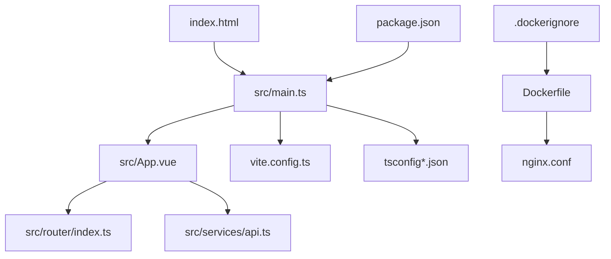
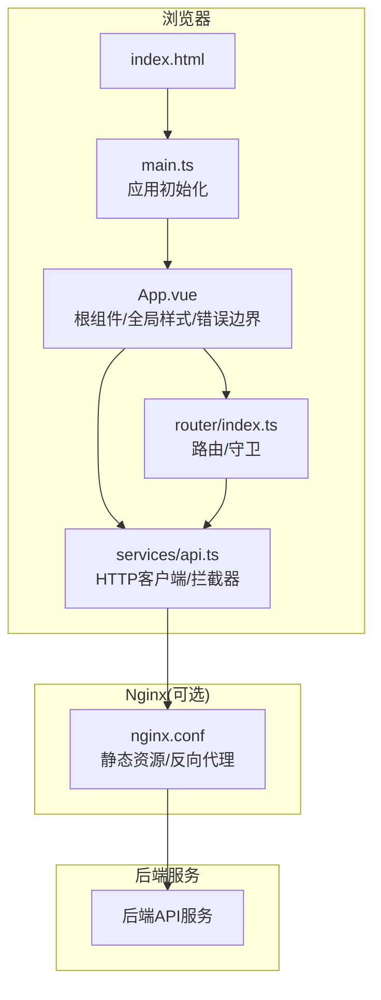
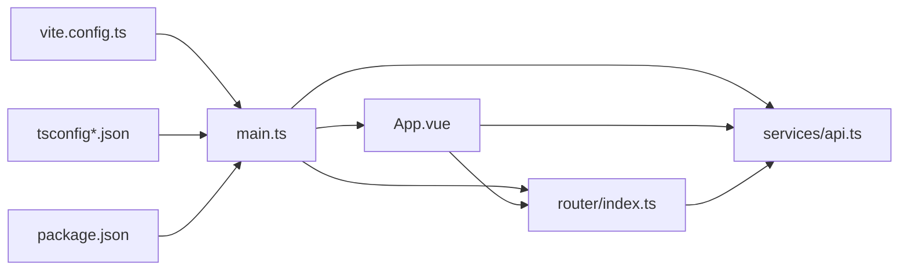

# 应用初始化与配置

<cite>
**本文引用的文件**   
- [frontend/tourist-app/src/main.ts](file://frontend/tourist-app/src/main.ts)
- [frontend/tourist-app/src/App.vue](file://frontend/tourist-app/src/App.vue)
- [frontend/tourist-app/src/router/index.ts](file://frontend/tourist-app/src/router/index.ts)
- [frontend/tourist-app/src/services/api.ts](file://frontend/tourist-app/src/services/api.ts)
- [frontend/tourist-app/vite.config.ts](file://frontend/tourist-app/vite.config.ts)
- [frontend/tourist-app/tsconfig.json](file://frontend/tourist-app/tsconfig.json)
- [frontend/tourist-app/tsconfig.app.json](file://frontend/tourist-app/tsconfig.app.json)
- [frontend/tourist-app/tsconfig.node.json](file://frontend/tourist-app/tsconfig.node.json)
- [frontend/tourist-app/package.json](file://frontend/tourist-app/package.json)
- [frontend/tourist-app/Dockerfile](file://frontend/tourist-app/Dockerfile)
- [frontend/tourist-app/nginx.conf](file://frontend/tourist-app/nginx.conf)
- [frontend/tourist-app/.dockerignore](file://frontend/tourist-app/.dockerignore)
- [frontend/tourist-app/index.html](file://frontend/tourist-app/index.html)
</cite>

## 目录
1. [简介](#简介)
2. [项目结构](#项目结构)
3. [核心组件](#核心组件)
4. [架构总览](#架构总览)
5. [详细组件分析](#详细组件分析)
6. [依赖分析](#依赖分析)
7. [性能考虑](#性能考虑)
8. [故障排查指南](#故障排查指南)
9. [结论](#结论)
10. [附录](#附录)

## 简介
本文件聚焦游客端应用的启动与配置，覆盖以下主题：
- Vue 3 应用启动流程与入口初始化
- TypeScript 配置与类型检查策略
- Vite 构建工具与环境变量
- 全局插件注册、API 基础配置与错误边界
- App.vue 根组件结构与路由集成
- 开发/生产环境差异、Docker 容器化与部署要点
- 配置文件示例与最佳实践（以路径引用为主）

## 项目结构
游客端位于 frontend/tourist-app 目录，采用典型的前端工程化结构：
- src：源码目录，包含入口 main.ts、根组件 App.vue、路由、服务层、视图与状态等
- public：静态资源（如模型、头像等）
- 构建与运行：vite.config.ts、tsconfig.*、package.json、Dockerfile、nginx.conf、index.html

图表来源
- [frontend/tourist-app/index.html](file://frontend/tourist-app/index.html)
- [frontend/tourist-app/src/main.ts](file://frontend/tourist-app/src/main.ts)
- [frontend/tourist-app/src/App.vue](file://frontend/tourist-app/src/App.vue)
- [frontend/tourist-app/src/router/index.ts](file://frontend/tourist-app/src/router/index.ts)
- [frontend/tourist-app/src/services/api.ts](file://frontend/tourist-app/src/services/api.ts)
- [frontend/tourist-app/vite.config.ts](file://frontend/tourist-app/vite.config.ts)
- [frontend/tourist-app/tsconfig.json](file://frontend/tourist-app/tsconfig.json)
- [frontend/tourist-app/package.json](file://frontend/tourist-app/package.json)
- [frontend/tourist-app/Dockerfile](file://frontend/tourist-app/Dockerfile)
- [frontend/tourist-app/nginx.conf](file://frontend/tourist-app/nginx.conf)
- [frontend/tourist-app/.dockerignore](file://frontend/tourist-app/.dockerignore)

章节来源
- [frontend/tourist-app/src/main.ts](file://frontend/tourist-app/src/main.ts)
- [frontend/tourist-app/src/App.vue](file://frontend/tourist-app/src/App.vue)
- [frontend/tourist-app/src/router/index.ts](file://frontend/tourist-app/src/router/index.ts)
- [frontend/tourist-app/src/services/api.ts](file://frontend/tourist-app/src/services/api.ts)
- [frontend/tourist-app/vite.config.ts](file://frontend/tourist-app/vite.config.ts)
- [frontend/tourist-app/tsconfig.json](file://frontend/tourist-app/tsconfig.json)
- [frontend/tourist-app/package.json](file://frontend/tourist-app/package.json)
- [frontend/tourist-app/Dockerfile](file://frontend/tourist-app/Dockerfile)
- [frontend/tourist-app/nginx.conf](file://frontend/tourist-app/nginx.conf)
- [frontend/tourist-app/.dockerignore](file://frontend/tourist-app/.dockerignore)
- [frontend/tourist-app/index.html](file://frontend/tourist-app/index.html)

## 核心组件
本节概述应用初始化与配置的关键点，并给出对应源码位置以便深入阅读。

- 应用入口与初始化
  - 入口文件负责创建 Vue 应用实例、挂载根组件、注册全局插件、注入环境变量与 API 基础配置、设置错误处理与路由。
  - 参考路径：[frontend/tourist-app/src/main.ts](file://frontend/tourist-app/src/main.ts)

- 根组件与全局样式
  - 根组件组织页面布局、引入全局样式、集成路由出口与错误边界。
  - 参考路径：[frontend/tourist-app/src/App.vue](file://frontend/tourist-app/src/App.vue)

- 路由集成
  - 定义页面路由、导航守卫与懒加载策略。
  - 参考路径：[frontend/tourist-app/src/router/index.ts](file://frontend/tourist-app/src/router/index.ts)

- API 基础配置
  - 封装请求库、设置基础地址、拦截器（鉴权、重试、错误统一处理）。
  - 参考路径：[frontend/tourist-app/src/services/api.ts](file://frontend/tourist-app/src/services/api.ts)

- 构建与类型配置
  - Vite 配置（代理、别名、优化）、TypeScript 多配置拆分（app/node）、包管理与脚本。
  - 参考路径：
    - [frontend/tourist-app/vite.config.ts](file://frontend/tourist-app/vite.config.ts)
    - [frontend/tourist-app/tsconfig.json](file://frontend/tourist-app/tsconfig.json)
    - [frontend/tourist-app/tsconfig.app.json](file://frontend/tourist-app/tsconfig.app.json)
    - [frontend/tourist-app/tsconfig.node.json](file://frontend/tourist-app/tsconfig.node.json)
    - [frontend/tourist-app/package.json](file://frontend/tourist-app/package.json)

章节来源
- [frontend/tourist-app/src/main.ts](file://frontend/tourist-app/src/main.ts)
- [frontend/tourist-app/src/App.vue](file://frontend/tourist-app/src/App.vue)
- [frontend/tourist-app/src/router/index.ts](file://frontend/tourist-app/src/router/index.ts)
- [frontend/tourist-app/src/services/api.ts](file://frontend/tourist-app/src/services/api.ts)
- [frontend/tourist-app/vite.config.ts](file://frontend/tourist-app/vite.config.ts)
- [frontend/tourist-app/tsconfig.json](file://frontend/tourist-app/tsconfig.json)
- [frontend/tourist-app/tsconfig.app.json](file://frontend/tourist-app/tsconfig.app.json)
- [frontend/tourist-app/tsconfig.node.json](file://frontend/tourist-app/tsconfig.node.json)
- [frontend/tourist-app/package.json](file://frontend/tourist-app/package.json)

## 架构总览
下图展示从浏览器到后端服务的整体调用链，以及前端内部模块的协作关系。

图表来源
- [frontend/tourist-app/index.html](file://frontend/tourist-app/index.html)
- [frontend/tourist-app/src/main.ts](file://frontend/tourist-app/src/main.ts)
- [frontend/tourist-app/src/App.vue](file://frontend/tourist-app/src/App.vue)
- [frontend/tourist-app/src/router/index.ts](file://frontend/tourist-app/src/router/index.ts)
- [frontend/tourist-app/src/services/api.ts](file://frontend/tourist-app/src/services/api.ts)
- [frontend/tourist-app/nginx.conf](file://frontend/tourist-app/nginx.conf)

## 详细组件分析

### 应用入口 main.ts 初始化逻辑
- 职责
  - 创建 Vue 应用实例
  - 注册全局插件（如 UI 框架、状态管理、路由等）
  - 注入环境变量与 API 基础配置
  - 挂载根组件与错误处理
- 关键流程
  - 读取环境变量（如 API 基础地址、功能开关）
  - 配置 HTTP 客户端基础地址与默认头
  - 注册路由与全局样式
  - 挂载到 DOM
- 建议
  - 将敏感信息通过环境变量注入，避免硬编码
  - 在开发环境启用调试日志，在生产关闭冗余输出
  - 对第三方插件进行最小化注册，按需引入

章节来源
- [frontend/tourist-app/src/main.ts](file://frontend/tourist-app/src/main.ts)

### 根组件 App.vue 结构设计
- 职责
  - 组织全局布局与样式
  - 集成路由出口
  - 提供全局错误边界与兜底页面
- 关键点
  - 引入全局样式（字体、重置、主题变量等）
  - 使用路由占位符渲染页面
  - 捕获未匹配路由或异常状态，展示友好提示
- 建议
  - 将通用布局抽离为布局组件，保持 App.vue 简洁
  - 错误边界应覆盖网络错误、业务错误与未知异常

章节来源
- [frontend/tourist-app/src/App.vue](file://frontend/tourist-app/src/App.vue)

### 路由集成 router/index.ts
- 职责
  - 定义页面路由表
  - 实现导航守卫（权限校验、登录态、埋点）
  - 配置懒加载与预取策略
- 关键点
  - 基于文件系统或集中式路由表维护
  - 结合 API 动态菜单（如需）
  - 路由级代码分割与错误边界
- 建议
  - 对敏感路由增加守卫与二次确认
  - 使用路由元信息承载权限与标题

章节来源
- [frontend/tourist-app/src/router/index.ts](file://frontend/tourist-app/src/router/index.ts)

### API 基础配置 services/api.ts
- 职责
  - 封装 HTTP 客户端（如 axios/fetch）
  - 设置基础地址、超时、重试、缓存策略
  - 统一拦截器：请求头注入、响应码处理、错误提示
- 关键点
  - 根据环境变量切换 API 基础地址
  - 统一错误码映射与用户提示
  - 支持取消重复请求与防抖节流
- 建议
  - 将业务接口按模块拆分，保持 api.ts 仅做基础设施
  - 对长连接或流式接口单独处理

章节来源
- [frontend/tourist-app/src/services/api.ts](file://frontend/tourist-app/src/services/api.ts)

### 环境变量与构建配置 vite.config.ts
- 职责
  - 配置开发服务器、代理、别名、插件
  - 配置生产构建优化（压缩、分包、Tree Shaking）
  - 暴露环境变量前缀与注入方式
- 关键点
  - 开发代理转发至后端，解决跨域
  - 生产构建开启 gzip/brotli、图片优化
  - 使用 .env 系列文件区分环境
- 建议
  - 严格区分开发与生产环境变量
  - 对第三方库按需引入，减少打包体积

章节来源
- [frontend/tourist-app/vite.config.ts](file://frontend/tourist-app/vite.config.ts)

### TypeScript 配置 tsconfig*.json
- 职责
  - 定义编译选项、路径别名、模块解析策略
  - 拆分 app 与 node 配置，分别约束运行时与构建期类型
- 关键点
  - 启用严格模式与增量编译
  - 配置 @ 路径别名指向 src
  - 针对 Vite 与测试工具的类型声明
- 建议
  - 为第三方库补充类型声明或使用 d.ts
  - 使用 ESLint + Prettier 保证风格一致

章节来源
- [frontend/tourist-app/tsconfig.json](file://frontend/tourist-app/tsconfig.json)
- [frontend/tourist-app/tsconfig.app.json](file://frontend/tourist-app/tsconfig.app.json)
- [frontend/tourist-app/tsconfig.node.json](file://frontend/tourist-app/tsconfig.node.json)

### 依赖管理与脚本 package.json
- 职责
  - 声明运行时与开发依赖
  - 定义本地开发、构建、预览、类型检查脚本
- 关键点
  - 使用锁定文件确保可重现构建
  - 脚本命令与 CI/CD 保持一致
- 建议
  - 定期更新依赖与安全补丁
  - 将大体积依赖改为按需引入或 CDN

章节来源
- [frontend/tourist-app/package.json](file://frontend/tourist-app/package.json)

### Docker 容器化与部署
- 职责
  - 构建镜像、运行 Nginx 提供静态资源与反向代理
  - 通过 .dockerignore 排除无关文件，减小镜像体积
- 关键点
  - 多阶段构建：先构建产物，再拷贝到 Nginx 镜像
  - 通过环境变量注入 API 基础地址
  - Nginx 配置静态资源缓存与路由回退
- 建议
  - 使用非 root 用户运行容器
  - 分离构建与运行镜像，提升安全性与复用性

章节来源
- [frontend/tourist-app/Dockerfile](file://frontend/tourist-app/Dockerfile)
- [frontend/tourist-app/nginx.conf](file://frontend/tourist-app/nginx.conf)
- [frontend/tourist-app/.dockerignore](file://frontend/tourist-app/.dockerignore)

### 入口 HTML index.html
- 职责
  - 提供应用挂载点与基础 meta
  - 引入 favicon、PWA 相关资源（可选）
- 关键点
  - 确保挂载节点 ID 与 main.ts 一致
  - 合理设置 CSP、安全头（由 Nginx 或网关控制）

章节来源
- [frontend/tourist-app/index.html](file://frontend/tourist-app/index.html)

## 依赖分析
下图展示主要模块之间的依赖关系与调用方向。

图表来源
- [frontend/tourist-app/src/main.ts](file://frontend/tourist-app/src/main.ts)
- [frontend/tourist-app/src/App.vue](file://frontend/tourist-app/src/App.vue)
- [frontend/tourist-app/src/router/index.ts](file://frontend/tourist-app/src/router/index.ts)
- [frontend/tourist-app/src/services/api.ts](file://frontend/tourist-app/src/services/api.ts)
- [frontend/tourist-app/vite.config.ts](file://frontend/tourist-app/vite.config.ts)
- [frontend/tourist-app/tsconfig.json](file://frontend/tourist-app/tsconfig.json)
- [frontend/tourist-app/package.json](file://frontend/tourist-app/package.json)

章节来源
- [frontend/tourist-app/src/main.ts](file://frontend/tourist-app/src/main.ts)
- [frontend/tourist-app/src/App.vue](file://frontend/tourist-app/src/App.vue)
- [frontend/tourist-app/src/router/index.ts](file://frontend/tourist-app/src/router/index.ts)
- [frontend/tourist-app/src/services/api.ts](file://frontend/tourist-app/src/services/api.ts)
- [frontend/tourist-app/vite.config.ts](file://frontend/tourist-app/vite.config.ts)
- [frontend/tourist-app/tsconfig.json](file://frontend/tourist-app/tsconfig.json)
- [frontend/tourist-app/package.json](file://frontend/tourist-app/package.json)

## 性能考虑
- 构建优化
  - 开启代码分割与 Tree Shaking，按需引入第三方库
  - 图片与字体资源压缩，启用缓存策略
- 运行时优化
  - 路由懒加载与组件级错误边界
  - 列表虚拟滚动、图片懒加载与骨架屏
- 网络优化
  - 请求去重、重试与降级策略
  - 合理设置缓存与断点续传（如媒体资源）
- 监控与诊断
  - 接入性能指标上报与错误追踪
  - 使用 Lighthouse 与 WebPageTest 持续评估

## 故障排查指南
- 常见问题定位
  - 环境变量未生效：检查 .env 文件命名与前缀、Vite 注入方式
  - 跨域问题：确认开发代理与生产反向代理配置
  - 路由 404：检查 Nginx 路由回退与 SPA 模式
  - 类型报错：核对 tsconfig 路径别名与模块解析
- 快速自检清单
  - 本地 dev 与 prod 构建是否通过
  - 容器镜像是否能正常启动并访问静态资源
  - API 基础地址是否正确指向目标环境
  - 错误边界是否捕获并展示友好提示

章节来源
- [frontend/tourist-app/vite.config.ts](file://frontend/tourist-app/vite.config.ts)
- [frontend/tourist-app/nginx.conf](file://frontend/tourist-app/nginx.conf)
- [frontend/tourist-app/tsconfig.json](file://frontend/tourist-app/tsconfig.json)
- [frontend/tourist-app/src/services/api.ts](file://frontend/tourist-app/src/services/api.ts)
- [frontend/tourist-app/src/App.vue](file://frontend/tourist-app/src/App.vue)

## 结论
通过合理的入口初始化、清晰的根组件结构、完善的路由与 API 配置、严格的 TypeScript 与 Vite 构建策略，以及容器化部署方案，游客端应用能够在开发与生产环境中获得一致的体验与稳定的表现。建议团队遵循本文的最佳实践，逐步完善监控、性能与可观测性能力。

## 附录
- 配置文件示例与最佳实践（以路径引用为主）
  - 环境变量与注入：参见 [frontend/tourist-app/vite.config.ts](file://frontend/tourist-app/vite.config.ts)
  - 应用初始化与插件注册：参见 [frontend/tourist-app/src/main.ts](file://frontend/tourist-app/src/main.ts)
  - 根组件与全局样式：参见 [frontend/tourist-app/src/App.vue](file://frontend/tourist-app/src/App.vue)
  - 路由与守卫：参见 [frontend/tourist-app/src/router/index.ts](file://frontend/tourist-app/src/router/index.ts)
  - API 客户端与拦截器：参见 [frontend/tourist-app/src/services/api.ts](file://frontend/tourist-app/src/services/api.ts)
  - TypeScript 配置：参见 [frontend/tourist-app/tsconfig.json](file://frontend/tourist-app/tsconfig.json)、[frontend/tourist-app/tsconfig.app.json](file://frontend/tourist-app/tsconfig.app.json)、[frontend/tourist-app/tsconfig.node.json](file://frontend/tourist-app/tsconfig.node.json)
  - 依赖与脚本：参见 [frontend/tourist-app/package.json](file://frontend/tourist-app/package.json)
  - Docker 与 Nginx：参见 [frontend/tourist-app/Dockerfile](file://frontend/tourist-app/Dockerfile)、[frontend/tourist-app/nginx.conf](file://frontend/tourist-app/nginx.conf)、[frontend/tourist-app/.dockerignore](file://frontend/tourist-app/.dockerignore)
  - 入口 HTML：参见 [frontend/tourist-app/index.html](file://frontend/tourist-app/index.html)