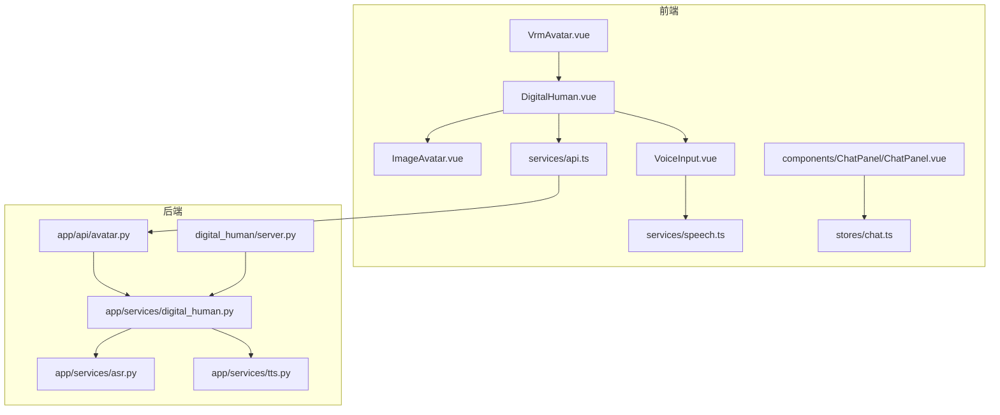
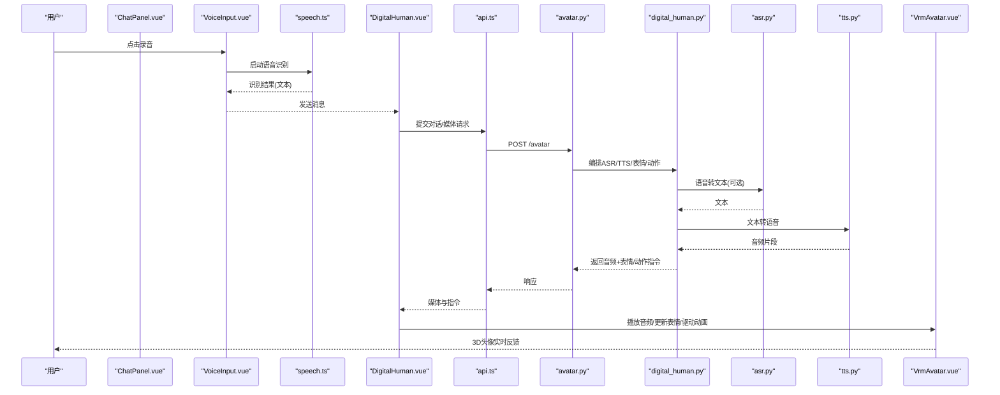
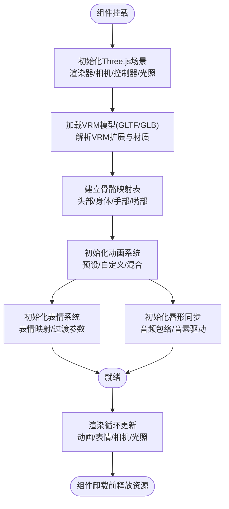
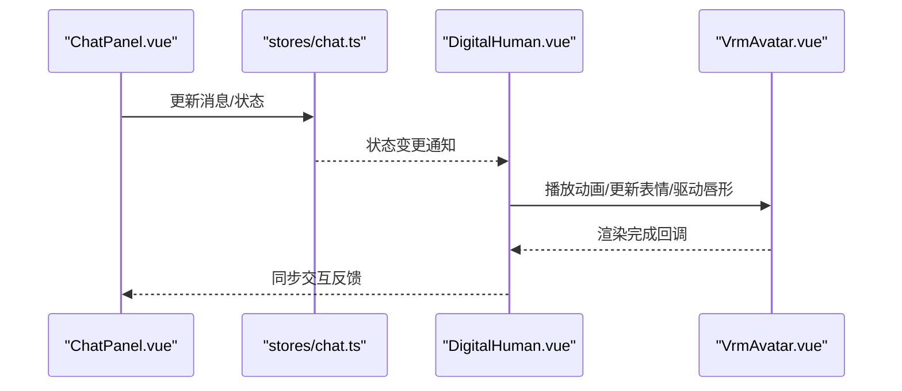
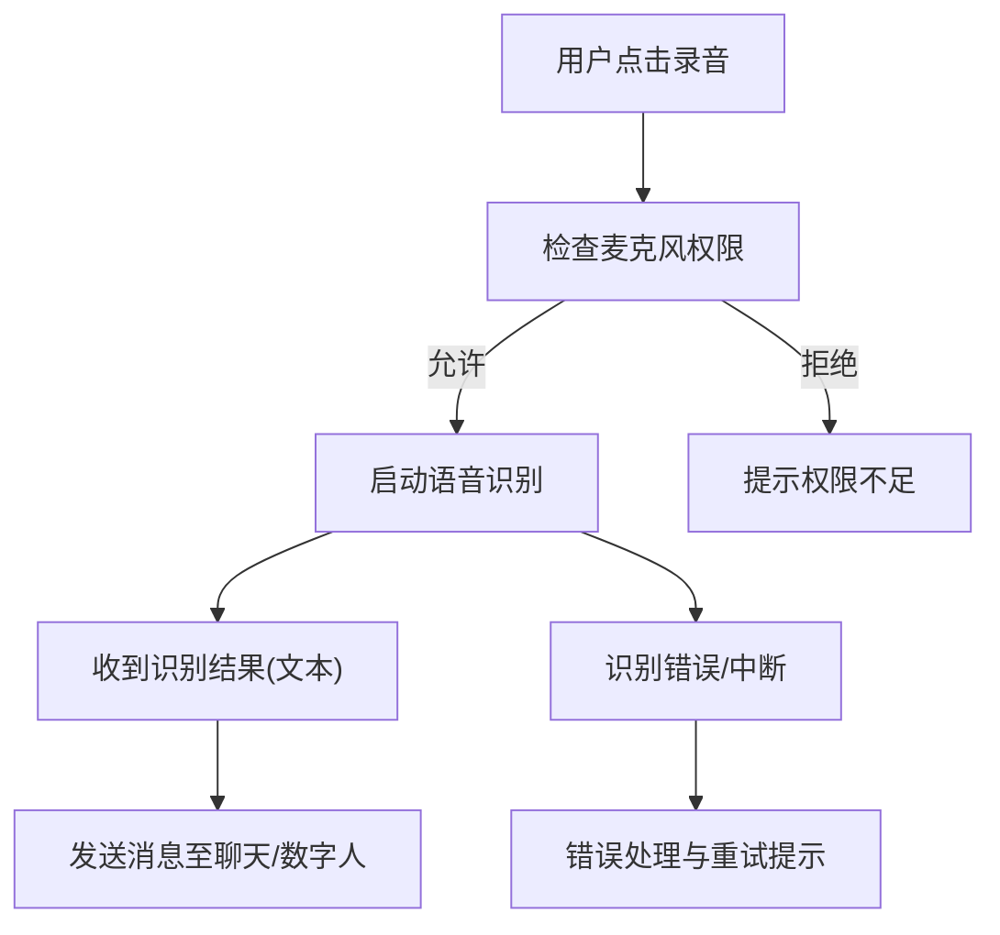
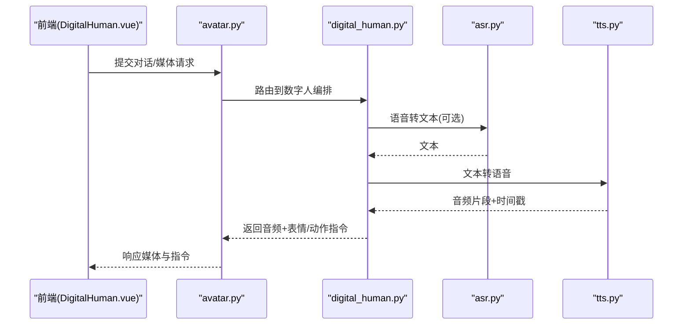
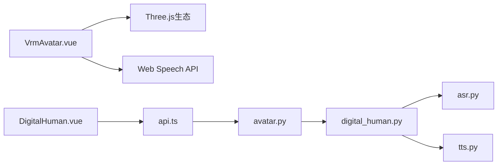

# VRM 3D头像组件

<cite>
**本文引用的文件**   
- [VrmAvatar.vue](file://frontend/tourist-app/src/components/DigitalHuman/VrmAvatar.vue)
- [DigitalHuman.vue](file://frontend/tourist-app/src/components/DigitalHuman/DigitalHuman.vue)
- [ImageAvatar.vue](file://frontend/tourist-app/src/components/DigitalHuman/ImageAvatar.vue)
- [VoiceInput.vue](file://frontend/tourist-app/src/components/VoiceInput/VoiceInput.vue)
- [speech.ts](file://frontend/tourist-app/src/services/speech.ts)
- [api.ts](file://frontend/tourist-app/src/services/api.ts)
- [ChatPanel.vue](file://frontend/tourist-app/src/components/ChatPanel/ChatPanel.vue)
- [chat.ts](file://frontend/tourist-app/src/stores/chat.ts)
- [server.py](file://digital_human/server.py)
- [avatar.py](file://backend/app/api/avatar.py)
- [digital_human.py](file://backend/app/services/digital_human.py)
- [asr.py](file://backend/app/services/asr.py)
- [tts.py](file://backend/app/services/tts.py)
</cite>

## 目录
1. [简介](#简介)
2. [项目结构](#项目结构)
3. [核心组件](#核心组件)
4. [架构总览](#架构总览)
5. [详细组件分析](#详细组件分析)
6. [依赖分析](#依赖分析)
7. [性能考虑](#性能考虑)
8. [故障排查指南](#故障排查指南)
9. [结论](#结论)
10. [附录](#附录)

## 简介
本文件面向VRM 3D头像组件（VrmAvatar）的开发者与集成者，系统性阐述VRM模型的加载与渲染、骨骼动画系统、表情控制、手势识别与响应、语音驱动的唇形同步、实时交互反馈、3D场景配置、光照设置、相机控制与性能调优策略。文档同时提供VRM模型制作规范、动画绑定指南以及常见问题解决方案，帮助读者快速上手并稳定落地生产环境。

## 项目结构
前端采用Vue 3 + TypeScript组织，VRM相关逻辑集中在数字人组件模块中；后端提供数字人服务接口，负责ASR/TTS与媒体流处理。关键路径如下：
- 前端
  - 数字人展示与交互：components/DigitalHuman/*
  - 语音输入与Web Speech API封装：components/VoiceInput, services/speech.ts
  - 聊天面板与状态管理：components/ChatPanel, stores/chat.ts
  - 资源目录：public/models, public/avatars
- 后端
  - 数字人API与服务：app/api/avatar.py, app/services/digital_human.py
  - ASR/TTS服务：app/services/asr.py, app/services/tts.py
  - 独立数字人服务入口：digital_human/server.py

图表来源
- [VrmAvatar.vue](file://frontend/tourist-app/src/components/DigitalHuman/VrmAvatar.vue)
- [DigitalHuman.vue](file://frontend/tourist-app/src/components/DigitalHuman/DigitalHuman.vue)
- [ImageAvatar.vue](file://frontend/tourist-app/src/components/DigitalHuman/ImageAvatar.vue)
- [VoiceInput.vue](file://frontend/tourist-app/src/components/VoiceInput/VoiceInput.vue)
- [speech.ts](file://frontend/tourist-app/src/services/speech.ts)
- [api.ts](file://frontend/tourist-app/src/services/api.ts)
- [chat.ts](file://frontend/tourist-app/src/stores/chat.ts)
- [ChatPanel.vue](file://frontend/tourist-app/src/components/ChatPanel/ChatPanel.vue)
- [avatar.py](file://backend/app/api/avatar.py)
- [digital_human.py](file://backend/app/services/digital_human.py)
- [asr.py](file://backend/app/services/asr.py)
- [tts.py](file://backend/app/services/tts.py)
- [server.py](file://digital_human/server.py)

章节来源
- [VrmAvatar.vue](file://frontend/tourist-app/src/components/DigitalHuman/VrmAvatar.vue)
- [DigitalHuman.vue](file://frontend/tourist-app/src/components/DigitalHuman/DigitalHuman.vue)
- [ImageAvatar.vue](file://frontend/tourist-app/src/components/DigitalHuman/ImageAvatar.vue)
- [VoiceInput.vue](file://frontend/tourist-app/src/components/VoiceInput/VoiceInput.vue)
- [speech.ts](file://frontend/tourist-app/src/services/speech.ts)
- [api.ts](file://frontend/tourist-app/src/services/api.ts)
- [chat.ts](file://frontend/tourist-app/src/stores/chat.ts)
- [ChatPanel.vue](file://frontend/tourist-app/src/components/ChatPanel/ChatPanel.vue)
- [avatar.py](file://backend/app/api/avatar.py)
- [digital_human.py](file://backend/app/services/digital_human.py)
- [asr.py](file://backend/app/services/asr.py)
- [tts.py](file://backend/app/services/tts.py)
- [server.py](file://digital_human/server.py)

## 核心组件
- VrmAvatar.vue：VRM 3D头像渲染容器，负责Three.js场景初始化、VRM模型加载、骨骼动画播放、表情控制、相机与光照配置、事件监听与生命周期管理。
- DigitalHuman.vue：数字人编排器，统一切换图像/VRM模式，协调语音输入、聊天状态与渲染组件。
- ImageAvatar.vue：图像头像降级方案，用于无VRM资源或设备不支持时的回退显示。
- VoiceInput.vue：语音采集与UI控件，调用Web Speech API进行语音识别。
- speech.ts：语音识别封装，提供开始/停止识别、结果回调、错误处理等能力。
- api.ts：通用HTTP客户端，封装对后端数字人服务的请求。
- chat.ts：聊天状态存储，维护对话历史、当前消息与交互状态。
- ChatPanel.vue：聊天面板UI，触发用户输入、展示对话与驱动数字人行为。
- 后端服务：avatar.py暴露数字人API；digital_human.py编排ASR/TTS与媒体流；asr.py/tts.py分别实现语音转文本与文本转语音；server.py为独立服务入口。

章节来源
- [VrmAvatar.vue](file://frontend/tourist-app/src/components/DigitalHuman/VrmAvatar.vue)
- [DigitalHuman.vue](file://frontend/tourist-app/src/components/DigitalHuman/DigitalHuman.vue)
- [ImageAvatar.vue](file://frontend/tourist-app/src/components/DigitalHuman/ImageAvatar.vue)
- [VoiceInput.vue](file://frontend/tourist-app/src/components/VoiceInput/VoiceInput.vue)
- [speech.ts](file://frontend/tourist-app/src/services/speech.ts)
- [api.ts](file://frontend/tourist-app/src/services/api.ts)
- [chat.ts](file://frontend/tourist-app/src/stores/chat.ts)
- [ChatPanel.vue](file://frontend/tourist-app/src/components/ChatPanel/ChatPanel.vue)
- [avatar.py](file://backend/app/api/avatar.py)
- [digital_human.py](file://backend/app/services/digital_human.py)
- [asr.py](file://backend/app/services/asr.py)
- [tts.py](file://backend/app/services/tts.py)
- [server.py](file://digital_human/server.py)

## 架构总览
整体流程：用户在聊天面板输入或说话，前端通过语音识别将音频转为文本，调用后端数字人服务生成回复与媒体数据（如TTS音频、表情/动作指令），前端根据指令更新VRM表情与动画，并通过唇形同步驱动口型。

图表来源
- [ChatPanel.vue](file://frontend/tourist-app/src/components/ChatPanel/ChatPanel.vue)
- [VoiceInput.vue](file://frontend/tourist-app/src/components/VoiceInput/VoiceInput.vue)
- [speech.ts](file://frontend/tourist-app/src/services/speech.ts)
- [DigitalHuman.vue](file://frontend/tourist-app/src/components/DigitalHuman/DigitalHuman.vue)
- [api.ts](file://frontend/tourist-app/src/services/api.ts)
- [avatar.py](file://backend/app/api/avatar.py)
- [digital_human.py](file://backend/app/services/digital_human.py)
- [asr.py](file://backend/app/services/asr.py)
- [tts.py](file://backend/app/services/tts.py)
- [VrmAvatar.vue](file://frontend/tourist-app/src/components/DigitalHuman/VrmAvatar.vue)

## 详细组件分析

### VrmAvatar.vue：VRM渲染与交互核心
职责
- Three.js场景初始化：创建渲染器、场景、相机、控制器、光照与环境贴图。
- VRM模型加载：解析GLTF/GLB中的VRM扩展，挂载到场景，建立骨骼映射。
- 动画系统：预设动画播放、自定义动画序列、动画混合与权重控制。
- 表情控制：面部表情映射、表情过渡插值、情感表达组合。
- 手势识别与响应：基于骨架关键点或外部信号驱动手部姿态。
- 唇形同步：依据TTS音频包络/音素驱动嘴部形状键。
- 生命周期管理：挂载/卸载时创建/销毁资源，避免内存泄漏。

关键流程（加载与渲染）

图表来源
- [VrmAvatar.vue](file://frontend/tourist-app/src/components/DigitalHuman/VrmAvatar.vue)

章节来源
- [VrmAvatar.vue](file://frontend/tourist-app/src/components/DigitalHuman/VrmAvatar.vue)

### DigitalHuman.vue：数字人编排器
职责
- 模式切换：在图像头像与VRM头像之间切换。
- 事件协调：接收聊天消息、语音输入、媒体指令，转发给对应渲染组件。
- 状态同步：与聊天状态存储保持一致，确保UI与3D表现一致。

交互时序（与VrmAvatar协作）

图表来源
- [DigitalHuman.vue](file://frontend/tourist-app/src/components/DigitalHuman/DigitalHuman.vue)
- [chat.ts](file://frontend/tourist-app/src/stores/chat.ts)
- [ChatPanel.vue](file://frontend/tourist-app/src/components/ChatPanel/ChatPanel.vue)
- [VrmAvatar.vue](file://frontend/tourist-app/src/components/DigitalHuman/VrmAvatar.vue)

章节来源
- [DigitalHuman.vue](file://frontend/tourist-app/src/components/DigitalHuman/DigitalHuman.vue)
- [chat.ts](file://frontend/tourist-app/src/stores/chat.ts)
- [ChatPanel.vue](file://frontend/tourist-app/src/components/ChatPanel/ChatPanel.vue)
- [VrmAvatar.vue](file://frontend/tourist-app/src/components/DigitalHuman/VrmAvatar.vue)

### ImageAvatar.vue：图像头像降级方案
职责
- 当VRM不可用或性能受限情况下，显示静态/动态图像作为替代。
- 保持与DigitalHuman一致的接口，便于无缝切换。

章节来源
- [ImageAvatar.vue](file://frontend/tourist-app/src/components/DigitalHuman/ImageAvatar.vue)
- [DigitalHuman.vue](file://frontend/tourist-app/src/components/DigitalHuman/DigitalHuman.vue)

### VoiceInput.vue 与 speech.ts：语音输入与识别
职责
- VoiceInput.vue：提供录音按钮、状态指示与错误提示。
- speech.ts：封装Web Speech API，提供开始/停止识别、结果回调、错误处理与权限检测。

语音识别流程

图表来源
- [VoiceInput.vue](file://frontend/tourist-app/src/components/VoiceInput/VoiceInput.vue)
- [speech.ts](file://frontend/tourist-app/src/services/speech.ts)

章节来源
- [VoiceInput.vue](file://frontend/tourist-app/src/components/VoiceInput/VoiceInput.vue)
- [speech.ts](file://frontend/tourist-app/src/services/speech.ts)

### 后端服务：avatar.py、digital_human.py、asr.py、tts.py、server.py
职责
- avatar.py：对外暴露数字人API，接收前端请求，返回音频与表情/动作指令。
- digital_human.py：编排ASR/TTS、表情/动作生成与媒体流处理。
- asr.py：语音转文本。
- tts.py：文本转语音，输出音频片段与时间戳信息。
- server.py：独立数字人服务入口，承载上述服务。

端到端时序（含后端）

图表来源
- [avatar.py](file://backend/app/api/avatar.py)
- [digital_human.py](file://backend/app/services/digital_human.py)
- [asr.py](file://backend/app/services/asr.py)
- [tts.py](file://backend/app/services/tts.py)
- [server.py](file://digital_human/server.py)
- [DigitalHuman.vue](file://frontend/tourist-app/src/components/DigitalHuman/DigitalHuman.vue)

章节来源
- [avatar.py](file://backend/app/api/avatar.py)
- [digital_human.py](file://backend/app/services/digital_human.py)
- [asr.py](file://backend/app/services/asr.py)
- [tts.py](file://backend/app/services/tts.py)
- [server.py](file://digital_human/server.py)
- [DigitalHuman.vue](file://frontend/tourist-app/src/components/DigitalHuman/DigitalHuman.vue)

## 依赖分析
- 前端依赖
  - Vue 3 + TypeScript：组件化与类型安全。
  - Three.js生态：场景渲染、VRM解析、动画与材质。
  - Web Speech API：浏览器内语音识别。
  - HTTP客户端：与后端数字人服务通信。
- 后端依赖
  - Python服务：FastAPI/Flask（以实际实现为准）提供REST接口。
  - ASR/TTS引擎：语音转文本与文本转语音。
  - 媒体流处理：音频分片、时间戳对齐、表情/动作指令序列化。

图表来源
- [VrmAvatar.vue](file://frontend/tourist-app/src/components/DigitalHuman/VrmAvatar.vue)
- [DigitalHuman.vue](file://frontend/tourist-app/src/components/DigitalHuman/DigitalHuman.vue)
- [api.ts](file://frontend/tourist-app/src/services/api.ts)
- [avatar.py](file://backend/app/api/avatar.py)
- [digital_human.py](file://backend/app/services/digital_human.py)
- [asr.py](file://backend/app/services/asr.py)
- [tts.py](file://backend/app/services/tts.py)

章节来源
- [VrmAvatar.vue](file://frontend/tourist-app/src/components/DigitalHuman/VrmAvatar.vue)
- [DigitalHuman.vue](file://frontend/tourist-app/src/components/DigitalHuman/DigitalHuman.vue)
- [api.ts](file://frontend/tourist-app/src/services/api.ts)
- [avatar.py](file://backend/app/api/avatar.py)
- [digital_human.py](file://backend/app/services/digital_human.py)
- [asr.py](file://backend/app/services/asr.py)
- [tts.py](file://backend/app/services/tts.py)

## 性能考虑
- 模型资源管理
  - 使用GLB压缩与纹理图集，减少网络传输与GPU内存占用。
  - 按需加载VRM资源，延迟初始化非关键材质与贴图。
  - 及时释放不再使用的BufferGeometry与Texture，避免内存泄漏。
- 渲染优化
  - 合理设置渲染分辨率与像素比，移动端降低像素比。
  - 启用阴影质量开关与距离裁剪，减少过远对象渲染。
  - 使用实例化渲染批量绘制重复元素。
- 动画与表情
  - 合并相近动画片段，减少动画轨道数量。
  - 使用线性插值与平滑过渡，避免突变导致的抖动。
  - 限制高频率表情更新，按固定步长刷新。
- 音频与唇形同步
  - 分片播放TTS音频，结合时间戳精确驱动嘴部形状键。
  - 使用低延迟音频上下文，减少首帧延迟。
- 相机与光照
  - 使用环境贴图与烘焙光照减少实时计算。
  - 限制光源数量与阴影采样，使用级联阴影优化。
- 设备适配
  - 检测WebGL能力与VRM支持，自动降级到图像头像。
  - 根据设备性能动态调整画质与特效开关。

[本节为通用性能建议，不直接分析具体文件]

## 故障排查指南
- 无法加载VRM模型
  - 检查模型格式是否为GLB且包含VRM扩展。
  - 确认跨域与资源路径正确，查看控制台报错。
  - 验证材质与贴图是否完整，缺失贴图会导致黑模。
- 动画不播放或卡顿
  - 检查动画轨道数量与复杂度，必要时合并或降采样。
  - 确认渲染循环未被阻塞，避免在主线程执行重任务。
- 表情不生效或过渡异常
  - 核对表情映射名称与VRM BlendShape定义一致。
  - 调整过渡时间与权重范围，避免过度插值导致抖动。
- 唇形不同步
  - 校验TTS音频时间戳与驱动频率匹配。
  - 降低音频缓冲大小，提升同步精度。
- 语音识别失败
  - 检查浏览器权限与HTTPS环境。
  - 捕获识别错误并提示用户重试或改用键盘输入。
- 后端服务异常
  - 检查ASR/TTS服务可用性，确认音频编码与采样率兼容。
  - 查看日志定位超时或内存溢出问题。

章节来源
- [VrmAvatar.vue](file://frontend/tourist-app/src/components/DigitalHuman/VrmAvatar.vue)
- [speech.ts](file://frontend/tourist-app/src/services/speech.ts)
- [avatar.py](file://backend/app/api/avatar.py)
- [digital_human.py](file://backend/app/services/digital_human.py)
- [asr.py](file://backend/app/services/asr.py)
- [tts.py](file://backend/app/services/tts.py)

## 结论
VrmAvatar组件通过Three.js与VRM生态实现了高质量的3D头像渲染与交互。配合后端数字人服务，可实现语音驱动的唇形同步、表情与动作联动，形成完整的虚拟数字人体验。遵循本文档的模型规范、动画绑定指南与性能调优策略，可在多设备上获得稳定流畅的表现。

[本节为总结性内容，不直接分析具体文件]

## 附录

### VRM模型制作规范
- 文件格式：导出为GLB，确保包含VRM扩展。
- 拓扑与面数：控制面数与骨骼数量，优先使用LOD或简化模型。
- 材质与贴图：使用PBR材质，贴图尺寸适中，尽量合并图集。
- 命名约定：骨骼与BlendShape命名清晰，便于前端映射。
- 动画与表情：预置常用动作与表情，标注时长与权重。

[本节为通用规范说明，不直接分析具体文件]

### 动画绑定指南
- 骨骼映射：头部、躯干、四肢、手部、嘴部需明确映射。
- 动画片段：区分待机、行走、挥手、点头等基础动作。
- 混合策略：使用权重叠加与过渡曲线，保证动作衔接自然。
- 测试方法：在不同设备上验证帧率与同步效果。

[本节为通用操作指南，不直接分析具体文件]

### 常见问题解决方案
- 模型加载慢：启用CDN与缓存，压缩模型与贴图。
- 低端设备卡顿：降低分辨率、关闭阴影、减少光源。
- 表情抖动：调整过渡时间与权重范围，增加平滑滤波。
- 唇形延迟：优化音频缓冲与时间戳对齐，减少网络往返。
- 权限问题：引导用户授予麦克风权限，提供备选输入方式。

[本节为通用排障建议，不直接分析具体文件]