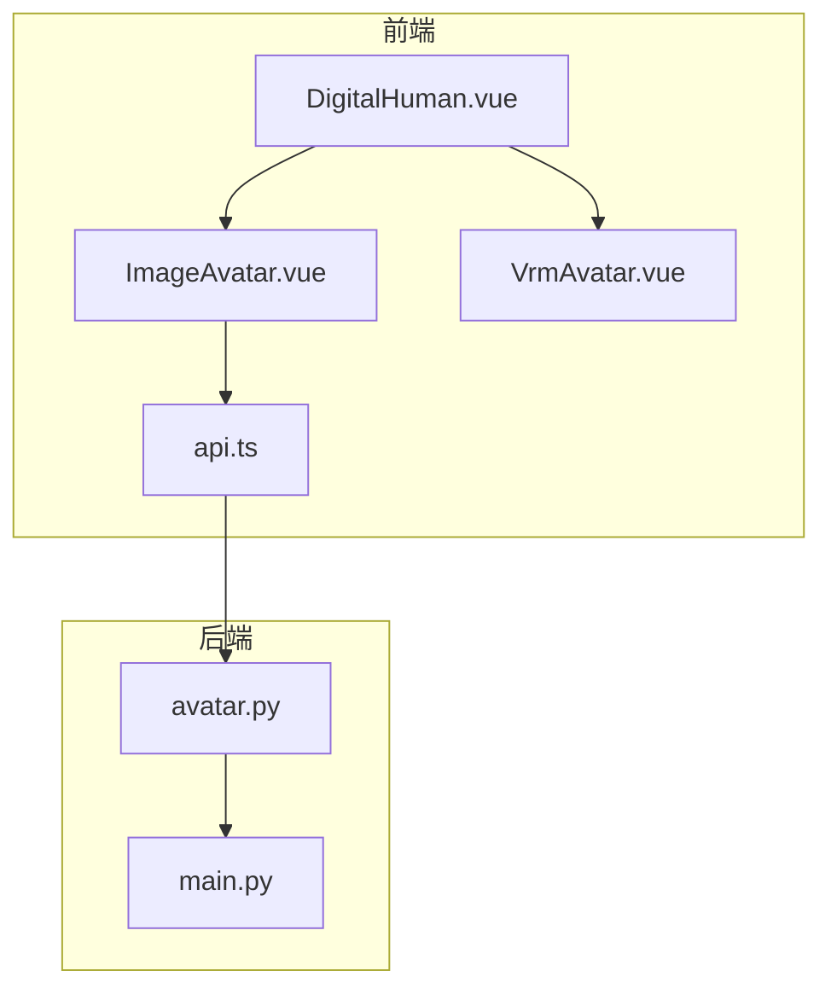
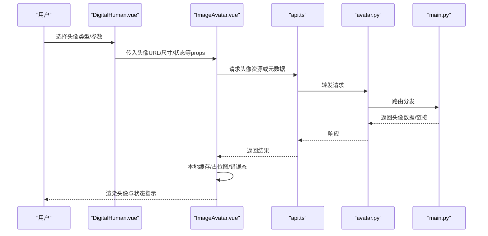
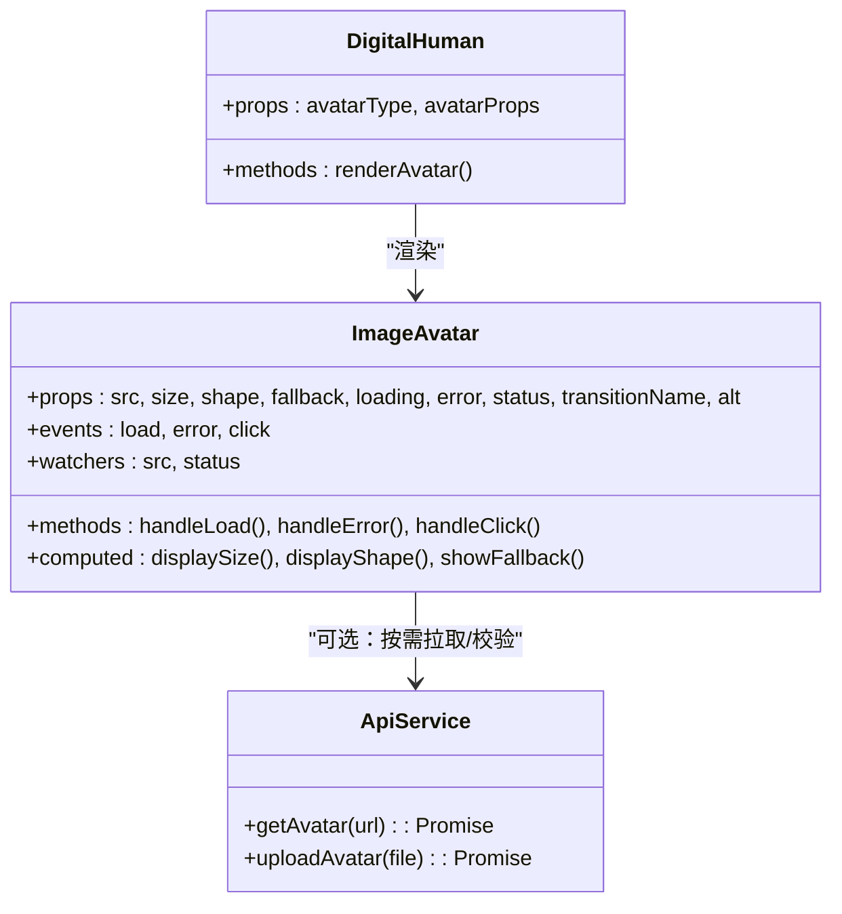
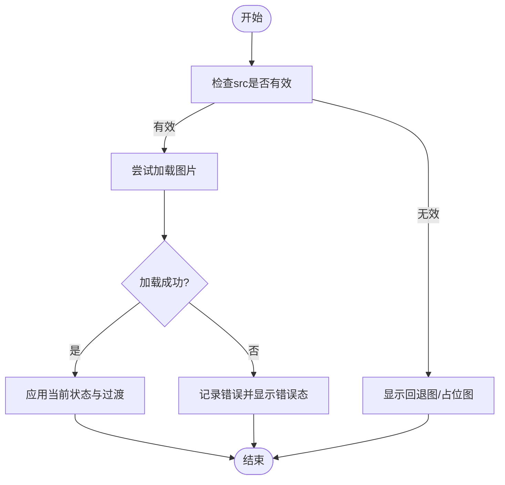
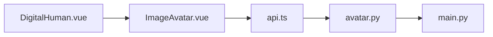

# 图片头像组件

<cite>
**本文引用的文件**   
- [ImageAvatar.vue](file://frontend/tourist-app/src/components/DigitalHuman/ImageAvatar.vue)
- [DigitalHuman.vue](file://frontend/tourist-app/src/components/DigitalHuman/DigitalHuman.vue)
- [VrmAvatar.vue](file://frontend/tourist-app/src/components/DigitalHuman/VrmAvatar.vue)
- [api.ts](file://frontend/tourist-app/src/services/api.ts)
- [avatar.py](file://backend/app/api/avatar.py)
- [main.py](file://backend/app/main.py)
</cite>

## 目录
1. [简介](#简介)
2. [项目结构](#项目结构)
3. [核心组件](#核心组件)
4. [架构总览](#架构总览)
5. [详细组件分析](#详细组件分析)
6. [依赖关系分析](#依赖关系分析)
7. [性能考虑](#性能考虑)
8. [故障排查指南](#故障排查指南)
9. [结论](#结论)
10. [附录](#附录)

## 简介
本文件围绕前端“图片头像组件”（ImageAvatar）进行系统化文档化，重点覆盖：
- 图片加载机制与缓存策略
- 响应式适配方案
- 状态管理系统（静态状态、动态状态、过渡效果）
- 图片资源优化（懒加载、格式转换、尺寸适配）
- 头像切换动画、状态指示器与用户交互反馈
- 图片资源管理规范、错误处理与降级方案
- 素材制作标准、性能优化技巧与集成示例路径

## 项目结构
该组件位于游客端应用的前端模块中，并与后端头像服务协同工作。关键位置如下：
- 前端组件：ImageAvatar.vue
- 组合入口：DigitalHuman.vue（负责选择并渲染具体头像类型）
- 其他头像实现：VrmAvatar.vue（VRM 3D 头像，用于对比/扩展）
- 前端 API 封装：api.ts（调用后端头像相关接口）
- 后端头像接口：avatar.py（提供头像资源或元数据）
- 路由挂载：main.py（注册后端路由）

图表来源
- [ImageAvatar.vue](file://frontend/tourist-app/src/components/DigitalHuman/ImageAvatar.vue)
- [DigitalHuman.vue](file://frontend/tourist-app/src/components/DigitalHuman/DigitalHuman.vue)
- [VrmAvatar.vue](file://frontend/tourist-app/src/components/DigitalHuman/VrmAvatar.vue)
- [api.ts](file://frontend/tourist-app/src/services/api.ts)
- [avatar.py](file://backend/app/api/avatar.py)
- [main.py](file://backend/app/main.py)

章节来源
- [ImageAvatar.vue](file://frontend/tourist-app/src/components/DigitalHuman/ImageAvatar.vue)
- [DigitalHuman.vue](file://frontend/tourist-app/src/components/DigitalHuman/DigitalHuman.vue)
- [VrmAvatar.vue](file://frontend/tourist-app/src/components/DigitalHuman/VrmAvatar.vue)
- [api.ts](file://frontend/tourist-app/src/services/api.ts)
- [avatar.py](file://backend/app/api/avatar.py)
- [main.py](file://backend/app/main.py)

## 核心组件
- ImageAvatar.vue：图片头像的核心展示组件，负责图片加载、占位与错误态、尺寸与圆角样式、过渡动画、状态指示器等。
- DigitalHuman.vue：根据配置或用户选择，决定渲染 ImageAvatar 或 VrmAvatar，并传递 props（如头像 URL、尺寸、状态等）。
- api.ts：封装对后端头像服务的请求，包括获取头像列表、头像详情、上传/更新等能力（由后端定义）。
- avatar.py：后端头像 API 实现，提供头像资源访问、元数据查询、可能的裁剪/转码逻辑。
- main.py：将 avatar.py 中的路由挂载到应用根路由下，使前端可访问。

章节来源
- [ImageAvatar.vue](file://frontend/tourist-app/src/components/DigitalHuman/ImageAvatar.vue)
- [DigitalHuman.vue](file://frontend/tourist-app/src/components/DigitalHuman/DigitalHuman.vue)
- [api.ts](file://frontend/tourist-app/src/services/api.ts)
- [avatar.py](file://backend/app/api/avatar.py)
- [main.py](file://backend/app/main.py)

## 架构总览
下图展示了从用户交互到图片渲染的端到端流程，包含前后端协作、缓存与错误处理的关键节点。

图表来源
- [DigitalHuman.vue](file://frontend/tourist-app/src/components/DigitalHuman/DigitalHuman.vue)
- [ImageAvatar.vue](file://frontend/tourist-app/src/components/DigitalHuman/ImageAvatar.vue)
- [api.ts](file://frontend/tourist-app/src/services/api.ts)
- [avatar.py](file://backend/app/api/avatar.py)
- [main.py](file://backend/app/main.py)

## 详细组件分析

### 组件职责与属性契约
- 输入属性（建议）
  - src：头像图片地址（支持相对/绝对路径、CDN 地址）
  - size：显示尺寸（px 或 rem），默认值需合理
  - shape：形状（圆形/方形/圆角），默认圆形
  - fallback：失败时回退图地址
  - loading：是否处于加载中
  - error：是否处于错误态
  - status：业务状态（在线/离线/忙碌/隐身等）
  - transitionName：过渡类名（用于切换动画）
  - alt：无障碍描述文本
- 输出事件（建议）
  - load：图片成功加载完成
  - error：图片加载失败
  - click：点击头像触发回调（常用于打开菜单或查看详情）

章节来源
- [ImageAvatar.vue](file://frontend/tourist-app/src/components/DigitalHuman/ImageAvatar.vue)
- [DigitalHuman.vue](file://frontend/tourist-app/src/components/DigitalHuman/DigitalHuman.vue)

#### 类图（组件内部结构与依赖）

图表来源
- [ImageAvatar.vue](file://frontend/tourist-app/src/components/DigitalHuman/ImageAvatar.vue)
- [DigitalHuman.vue](file://frontend/tourist-app/src/components/DigitalHuman/DigitalHuman.vue)
- [api.ts](file://frontend/tourist-app/src/services/api.ts)

### 加载机制与缓存策略
- 加载时机
  - 首次进入：优先使用本地缓存（内存/磁盘），若命中则直接渲染；未命中则发起网络请求。
  - 懒加载：在可视区域再加载，减少首屏压力。
- 缓存策略
  - 浏览器原生缓存：通过合理的 Cache-Control/ETag 配合服务端控制。
  - 前端内存缓存：以 src 为键，保存已加载的 Image 对象或 Blob URL，避免重复下载。
  - 本地持久化：可选 IndexedDB 存储小尺寸缩略图，提升二次打开速度。
- 失效与更新
  - 当 src 变化时，清理旧缓存并重新加载。
  - 支持强制刷新参数（如时间戳或版本号）绕过缓存。

章节来源
- [ImageAvatar.vue](file://frontend/tourist-app/src/components/DigitalHuman/ImageAvatar.vue)
- [api.ts](file://frontend/tourist-app/src/services/api.ts)

### 响应式适配方案
- 尺寸适配
  - 基于 CSS 变量或计算属性，按容器大小与设备像素比动态设置 width/height。
  - 使用 object-fit 控制裁剪模式（cover/contain/fill）。
- 形状适配
  - 圆形/方形/圆角通过 border-radius 与 aspect-ratio 统一控制。
- 多分辨率
  - 结合 srcset/picture 或后端动态尺寸参数，按 DPR 与屏幕宽度返回合适分辨率。

章节来源
- [ImageAvatar.vue](file://frontend/tourist-app/src/components/DigitalHuman/ImageAvatar.vue)

### 状态管理系统（静态、动态、过渡）
- 静态状态
  - 加载中：显示骨架屏或占位图。
  - 错误态：显示错误图标或回退图。
  - 正常态：显示真实图片。
- 动态状态
  - 业务状态（在线/离线/忙碌/隐身）通过状态指示器叠加显示。
  - 状态变更时触发过渡动画（淡入淡出、缩放、位移等）。
- 过渡效果
  - 使用 Vue 过渡系统或 CSS transitions，确保切换平滑且可配置。

图表来源
- [ImageAvatar.vue](file://frontend/tourist-app/src/components/DigitalHuman/ImageAvatar.vue)

章节来源
- [ImageAvatar.vue](file://frontend/tourist-app/src/components/DigitalHuman/ImageAvatar.vue)

### 图片资源优化策略
- 懒加载
  - IntersectionObserver 检测可见性后再加载，降低首屏开销。
- 格式转换
  - 优先 WebP/AVIF，兼容回退至 JPEG/PNG。
  - 后端按需转码与压缩，前端仅做必要展示。
- 尺寸适配
  - 根据容器尺寸与 DPR 请求合适分辨率，避免大图浪费带宽。
  - 使用缩略图+高清图的渐进加载策略。

章节来源
- [ImageAvatar.vue](file://frontend/tourist-app/src/components/DigitalHuman/ImageAvatar.vue)
- [avatar.py](file://backend/app/api/avatar.py)

### 头像切换动画、状态指示器与交互反馈
- 切换动画
  - 使用过渡类名控制淡入/缩放/滑动等效果，避免闪烁。
- 状态指示器
  - 在头像右下角或底部叠加小圆点/徽章，颜色与文案表达状态。
- 交互反馈
  - hover 高亮、点击涟漪或弹出菜单，提供明确的用户反馈。

章节来源
- [ImageAvatar.vue](file://frontend/tourist-app/src/components/DigitalHuman/ImageAvatar.vue)

### 图片资源管理规范
- 命名规范
  - 使用语义化文件名与版本后缀，便于缓存与追踪。
- 目录组织
  - 按角色/场景分类存放，区分原图与缩略图。
- CDN 与缓存
  - 启用 CDN 加速，合理设置缓存头，长缓存+短文件名哈希。
- 质量与体积
  - 限制最大宽高与文件大小，自动压缩与去重。

章节来源
- [avatar.py](file://backend/app/api/avatar.py)
- [api.ts](file://frontend/tourist-app/src/services/api.ts)

### 错误处理与降级方案
- 网络错误
  - 超时重试、指数退避、熔断保护。
- 资源不可用
  - 自动切换到回退图或默认头像。
- 用户体验
  - 错误态提示清晰，允许手动重试或上报日志。

章节来源
- [ImageAvatar.vue](file://frontend/tourist-app/src/components/DigitalHuman/ImageAvatar.vue)
- [api.ts](file://frontend/tourist-app/src/services/api.ts)

### 素材制作标准
- 尺寸与比例
  - 推荐正方形源图，最小边不低于 512px，常用展示尺寸 128/256/512。
- 格式与色彩
  - 首选 WebP，必要时保留 PNG/JPEG；注意 sRGB 色彩空间。
- 内容规范
  - 主体居中、背景简洁、避免过曝/欠曝；人脸占比适中。
- 命名与元数据
  - 包含作者、日期、用途标签；保留必要 EXIF 信息。

[本节为通用规范说明，不直接分析具体文件]

### 性能优化技巧
- 预加载关键头像
- 使用 HTTP/2 与连接复用
- 合并小图标为雪碧图或 SVG
- 减少不必要的重绘与回流

[本节为通用优化建议，不直接分析具体文件]

### 集成示例代码路径
- 在父组件中引入并传入 props：
  - 参考路径：[DigitalHuman.vue](file://frontend/tourist-app/src/components/DigitalHuman/DigitalHuman.vue)
- 调用后端头像接口：
  - 参考路径：[api.ts](file://frontend/tourist-app/src/services/api.ts)
- 后端头像服务：
  - 参考路径：[avatar.py](file://backend/app/api/avatar.py)、[main.py](file://backend/app/main.py)

章节来源
- [DigitalHuman.vue](file://frontend/tourist-app/src/components/DigitalHuman/DigitalHuman.vue)
- [api.ts](file://frontend/tourist-app/src/services/api.ts)
- [avatar.py](file://backend/app/api/avatar.py)
- [main.py](file://backend/app/main.py)

## 依赖关系分析
- 组件耦合
  - ImageAvatar 与 DigitalHuman 松耦合，通过 props/events 通信。
  - 与 api.ts 解耦，可通过适配器替换数据源。
- 外部依赖
  - 浏览器缓存、CDN、后端头像服务。
- 潜在循环依赖
  - 组件间单向依赖，无循环引用风险。

图表来源
- [ImageAvatar.vue](file://frontend/tourist-app/src/components/DigitalHuman/ImageAvatar.vue)
- [DigitalHuman.vue](file://frontend/tourist-app/src/components/DigitalHuman/DigitalHuman.vue)
- [api.ts](file://frontend/tourist-app/src/services/api.ts)
- [avatar.py](file://backend/app/api/avatar.py)
- [main.py](file://backend/app/main.py)

章节来源
- [ImageAvatar.vue](file://frontend/tourist-app/src/components/DigitalHuman/ImageAvatar.vue)
- [DigitalHuman.vue](file://frontend/tourist-app/src/components/DigitalHuman/DigitalHuman.vue)
- [api.ts](file://frontend/tourist-app/src/services/api.ts)
- [avatar.py](file://backend/app/api/avatar.py)
- [main.py](file://backend/app/main.py)

## 性能考虑
- 首屏优化：懒加载、预加载关键头像、使用缩略图。
- 传输优化：启用 Gzip/Brotli、HTTP/2、CDN。
- 渲染优化：避免频繁重排，合理使用 will-change 与 transform。
- 缓存优化：合理设置缓存头，利用浏览器与内存缓存。

[本节为通用指导，不直接分析具体文件]

## 故障排查指南
- 常见问题
  - 图片不显示：检查 src 有效性、跨域、CDN 权限。
  - 加载缓慢：检查网络、缓存命中率、图片体积。
  - 状态指示异常：确认状态 prop 与样式类名映射。
- 定位步骤
  - 查看控制台错误与网络面板。
  - 打印组件生命周期与事件触发顺序。
  - 验证后端接口返回与缓存头。
- 恢复策略
  - 自动重试与回退图切换。
  - 用户可操作的重试按钮与反馈提示。

章节来源
- [ImageAvatar.vue](file://frontend/tourist-app/src/components/DigitalHuman/ImageAvatar.vue)
- [api.ts](file://frontend/tourist-app/src/services/api.ts)

## 结论
ImageAvatar 组件通过清晰的职责划分、完善的加载与缓存策略、灵活的响应式适配以及健壮的错误处理，提供了高性能、易用的图片头像展示能力。结合后端的头像服务与资源管理，可实现从素材到展示的完整闭环。建议在项目中遵循本文的资源规范与性能优化建议，以获得一致的用户体验与稳定的运行表现。

[本节为总结性内容，不直接分析具体文件]

## 附录
- 术语表
  - DPR：设备像素比
  - CDN：内容分发网络
  - WebP/AVIF：现代图像格式
- 参考路径
  - 组件实现：[ImageAvatar.vue](file://frontend/tourist-app/src/components/DigitalHuman/ImageAvatar.vue)
  - 组合入口：[DigitalHuman.vue](file://frontend/tourist-app/src/components/DigitalHuman/DigitalHuman.vue)
  - 前端 API：[api.ts](file://frontend/tourist-app/src/services/api.ts)
  - 后端服务：[avatar.py](file://backend/app/api/avatar.py)、[main.py](file://backend/app/main.py)

[本节为补充信息，不直接分析具体文件]