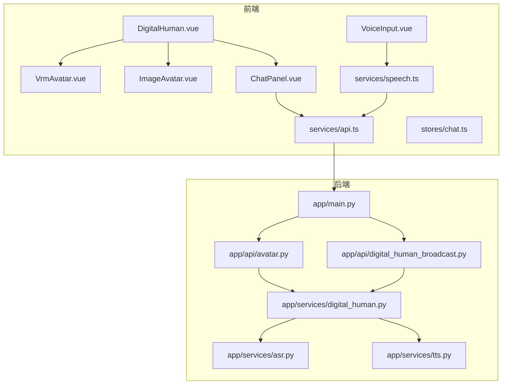
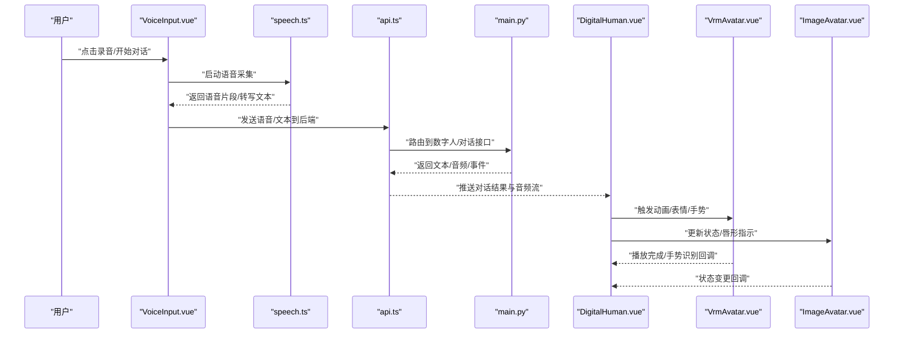
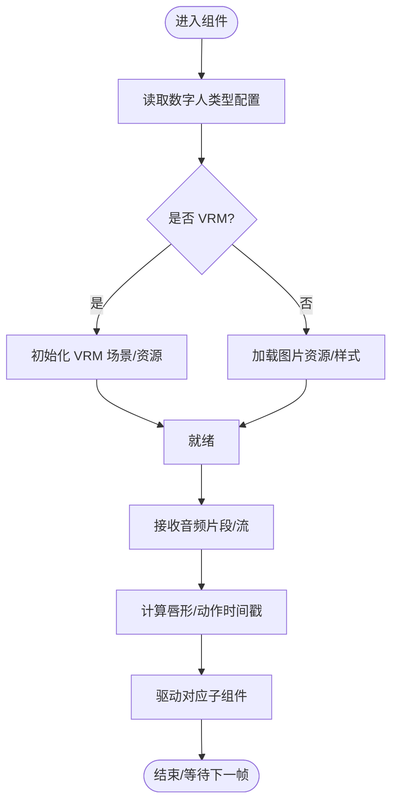
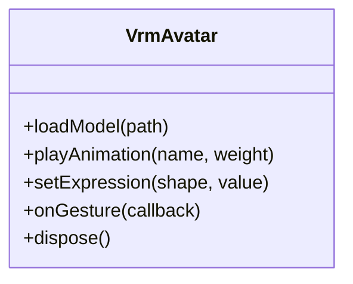
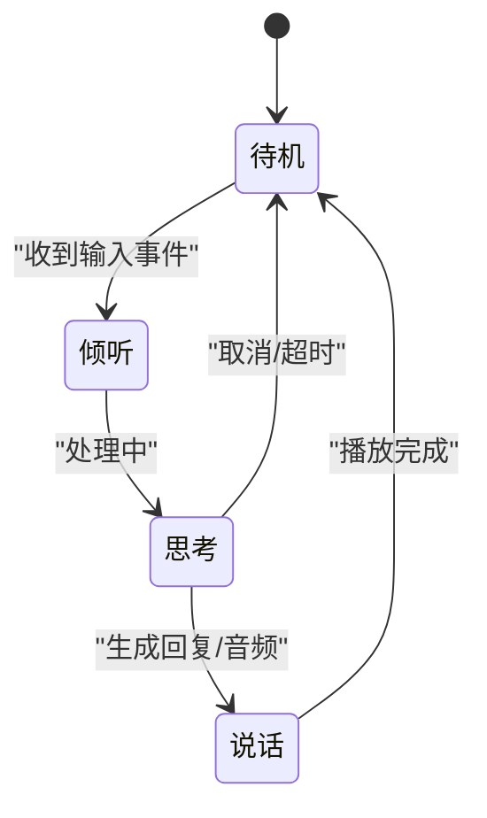
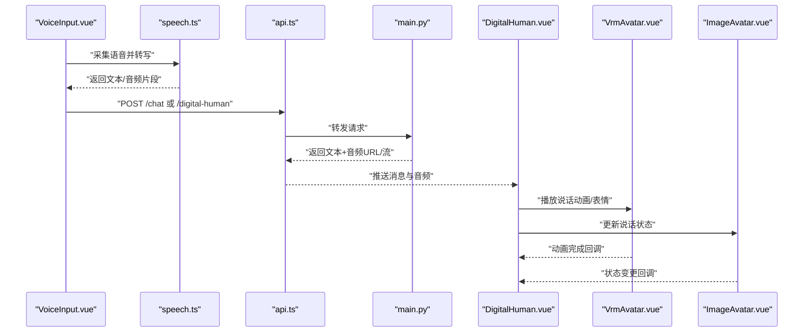
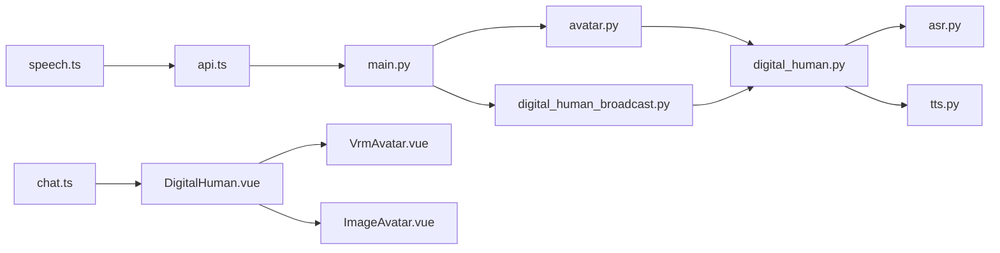

# 数字人交互系统

<cite>
**本文引用的文件**   
- [DigitalHuman.vue](file://frontend/tourist-app/src/components/DigitalHuman/DigitalHuman.vue)
- [VrmAvatar.vue](file://frontend/tourist-app/src/components/DigitalHuman/VrmAvatar.vue)
- [ImageAvatar.vue](file://frontend/tourist-app/src/components/DigitalHuman/ImageAvatar.vue)
- [ChatPanel.vue](file://frontend/tourist-app/src/components/ChatPanel/ChatPanel.vue)
- [VoiceInput.vue](file://frontend/tourist-app/src/components/VoiceInput/VoiceInput.vue)
- [speech.ts](file://frontend/tourist-app/src/services/speech.ts)
- [api.ts](file://frontend/tourist-app/src/services/api.ts)
- [chat.ts](file://frontend/tourist-app/src/stores/chat.ts)
- [avatar.py](file://backend/app/api/avatar.py)
- [digital_human_broadcast.py](file://backend/app/api/digital_human_broadcast.py)
- [digital_human.py](file://backend/app/services/digital_human.py)
- [asr.py](file://backend/app/services/asr.py)
- [tts.py](file://backend/app/services/tts.py)
- [main.py](file://backend/app/main.py)
</cite>

## 目录
1. [简介](#简介)
2. [项目结构](#项目结构)
3. [核心组件](#核心组件)
4. [架构总览](#架构总览)
5. [详细组件分析](#详细组件分析)
6. [依赖关系分析](#依赖关系分析)
7. [性能考虑](#性能考虑)
8. [故障排查指南](#故障排查指南)
9. [结论](#结论)
10. [附录](#附录)

## 简介
本文件面向开发者与实施人员，系统化阐述“数字人交互系统”的前后端设计与实现。重点覆盖：
- DigitalHuman 主组件：数字人类型切换、动画控制与音频同步机制
- VrmAvatar 组件：VRM 3D 模型渲染、骨骼动画播放、表情控制与手势识别
- ImageAvatar 组件：图片头像展示、状态切换与响应式适配
- 与对话系统的集成：语音驱动动画、唇形同步与性能优化策略
- 配置示例与扩展方法：帮助快速接入与二次开发

## 项目结构
前端采用 Vue 3 + TypeScript，核心数字人相关组件位于 tourist-app 的 components/DigitalHuman 目录；后端提供数字人与语音服务 API，并通过 FastAPI 暴露接口。前后端通过 REST/WebSocket 进行交互，语音输入由浏览器 Web Speech API 或后端 ASR 完成，TTS 输出用于驱动数字人唇形与动作。

图表来源
- [DigitalHuman.vue](file://frontend/tourist-app/src/components/DigitalHuman/DigitalHuman.vue)
- [VrmAvatar.vue](file://frontend/tourist-app/src/components/DigitalHuman/VrmAvatar.vue)
- [ImageAvatar.vue](file://frontend/tourist-app/src/components/DigitalHuman/ImageAvatar.vue)
- [ChatPanel.vue](file://frontend/tourist-app/src/components/ChatPanel/ChatPanel.vue)
- [VoiceInput.vue](file://frontend/tourist-app/src/components/VoiceInput/VoiceInput.vue)
- [speech.ts](file://frontend/tourist-app/src/services/speech.ts)
- [api.ts](file://frontend/tourist-app/src/services/api.ts)
- [avatar.py](file://backend/app/api/avatar.py)
- [digital_human_broadcast.py](file://backend/app/api/digital_human_broadcast.py)
- [digital_human.py](file://backend/app/services/digital_human.py)
- [asr.py](file://backend/app/services/asr.py)
- [tts.py](file://backend/app/services/tts.py)
- [main.py](file://backend/app/main.py)

章节来源
- [DigitalHuman.vue](file://frontend/tourist-app/src/components/DigitalHuman/DigitalHuman.vue)
- [VrmAvatar.vue](file://frontend/tourist-app/src/components/DigitalHuman/VrmAvatar.vue)
- [ImageAvatar.vue](file://frontend/tourist-app/src/components/DigitalHuman/ImageAvatar.vue)
- [ChatPanel.vue](file://frontend/tourist-app/src/components/ChatPanel/ChatPanel.vue)
- [VoiceInput.vue](file://frontend/tourist-app/src/components/VoiceInput/VoiceInput.vue)
- [speech.ts](file://frontend/tourist-app/src/services/speech.ts)
- [api.ts](file://frontend/tourist-app/src/services/api.ts)
- [avatar.py](file://backend/app/api/avatar.py)
- [digital_human_broadcast.py](file://backend/app/api/digital_human_broadcast.py)
- [digital_human.py](file://backend/app/services/digital_human.py)
- [asr.py](file://backend/app/services/asr.py)
- [tts.py](file://backend/app/services/tts.py)
- [main.py](file://backend/app/main.py)

## 核心组件
本节聚焦三大核心组件的职责与协作方式：
- DigitalHuman：统一编排器，负责数字人类型（VRM/图片）切换、动画生命周期管理、音频流与唇形/动作同步、事件总线对接
- VrmAvatar：基于 VRM 模型的 3D 渲染与动画控制器，支持骨骼动画、表情混合、手势识别回调
- ImageAvatar：轻量级图片头像组件，支持多态状态（待机/说话/倾听/思考），具备响应式尺寸与无障碍属性

章节来源
- [DigitalHuman.vue](file://frontend/tourist-app/src/components/DigitalHuman/DigitalHuman.vue)
- [VrmAvatar.vue](file://frontend/tourist-app/src/components/DigitalHuman/VrmAvatar.vue)
- [ImageAvatar.vue](file://frontend/tourist-app/src/components/DigitalHuman/ImageAvatar.vue)

## 架构总览
数字人交互系统采用“前端编排 + 后端服务”的分层架构：
- 前端编排层：DigitalHuman 协调子组件与对话/语音服务，维护状态机与媒体管线
- 对话与语音层：Web Speech API 或后端 ASR/TTS 协同，生成文本与音频片段
- 后端服务层：数字人生成、广播、ASR/TTS 能力封装，对外暴露 API
- 数据与状态：Pinia store 集中管理会话、消息与数字人状态

图表来源
- [VoiceInput.vue](file://frontend/tourist-app/src/components/VoiceInput/VoiceInput.vue)
- [speech.ts](file://frontend/tourist-app/src/services/speech.ts)
- [api.ts](file://frontend/tourist-app/src/services/api.ts)
- [main.py](file://backend/app/main.py)
- [DigitalHuman.vue](file://frontend/tourist-app/src/components/DigitalHuman/DigitalHuman.vue)
- [VrmAvatar.vue](file://frontend/tourist-app/src/components/DigitalHuman/VrmAvatar.vue)
- [ImageAvatar.vue](file://frontend/tourist-app/src/components/DigitalHuman/ImageAvatar.vue)

## 详细组件分析

### DigitalHuman 主组件
职责与特性：
- 数字人类型切换：根据配置或运行时状态在 VRM 与图片模式间切换
- 动画控制：统一管理“待机/说话/倾听/思考”等状态，驱动子组件行为
- 音频同步：接收后端音频流或本地 TTS 音频，按时间轴驱动唇形与微动
- 事件总线：与 ChatPanel、VoiceInput 及后端广播事件联动

关键流程（类型切换与音频同步）：

图表来源
- [DigitalHuman.vue](file://frontend/tourist-app/src/components/DigitalHuman/DigitalHuman.vue)

章节来源
- [DigitalHuman.vue](file://frontend/tourist-app/src/components/DigitalHuman/DigitalHuman.vue)

### VrmAvatar 组件（VRM 3D 渲染与动画）
功能要点：
- 3D 渲染：加载 VRM 模型、材质与贴图，管理场景与相机
- 骨骼动画：播放预设动画（待机、问候、挥手等），支持混合与权重控制
- 表情控制：通过 BlendShape 或等效接口驱动面部表情
- 手势识别：监听手部关键点或外部识别结果，映射为动画或状态

类与方法示意（概念性）：

图表来源
- [VrmAvatar.vue](file://frontend/tourist-app/src/components/DigitalHuman/VrmAvatar.vue)

章节来源
- [VrmAvatar.vue](file://frontend/tourist-app/src/components/DigitalHuman/VrmAvatar.vue)

### ImageAvatar 组件（图片头像展示）
功能要点：
- 图片展示：支持多种分辨率与占位图，懒加载与错误回退
- 状态切换：根据“说话/倾听/思考/离线”等状态切换视觉反馈（如波纹、高亮）
- 响应式适配：在不同屏幕尺寸下自适应布局与字体大小
- 可访问性：提供 aria-label、role 等语义化属性

状态流转示意：

图表来源
- [ImageAvatar.vue](file://frontend/tourist-app/src/components/DigitalHuman/ImageAvatar.vue)

章节来源
- [ImageAvatar.vue](file://frontend/tourist-app/src/components/DigitalHuman/ImageAvatar.vue)

### 对话系统与语音驱动
端到端调用序列（从语音到数字人表现）：

图表来源
- [VoiceInput.vue](file://frontend/tourist-app/src/components/VoiceInput/VoiceInput.vue)
- [speech.ts](file://frontend/tourist-app/src/services/speech.ts)
- [api.ts](file://frontend/tourist-app/src/services/api.ts)
- [main.py](file://backend/app/main.py)
- [DigitalHuman.vue](file://frontend/tourist-app/src/components/DigitalHuman/DigitalHuman.vue)
- [VrmAvatar.vue](file://frontend/tourist-app/src/components/DigitalHuman/VrmAvatar.vue)
- [ImageAvatar.vue](file://frontend/tourist-app/src/components/DigitalHuman/ImageAvatar.vue)

章节来源
- [VoiceInput.vue](file://frontend/tourist-app/src/components/VoiceInput/VoiceInput.vue)
- [speech.ts](file://frontend/tourist-app/src/services/speech.ts)
- [api.ts](file://frontend/tourist-app/src/services/api.ts)
- [main.py](file://backend/app/main.py)
- [DigitalHuman.vue](file://frontend/tourist-app/src/components/DigitalHuman/DigitalHuman.vue)
- [VrmAvatar.vue](file://frontend/tourist-app/src/components/DigitalHuman/VrmAvatar.vue)
- [ImageAvatar.vue](file://frontend/tourist-app/src/components/DigitalHuman/ImageAvatar.vue)

## 依赖关系分析
前后端模块耦合点与职责边界：
- 前端 api.ts 作为 HTTP 客户端，聚合所有后端接口调用
- speech.ts 封装语音采集与转写逻辑，屏蔽浏览器差异
- stores/chat.ts 集中管理会话与数字人状态，供各组件订阅
- 后端 main.py 注册路由，将请求分发至 avatar.py、digital_human_broadcast.py 等
- digital_human.py 整合 ASR/TTS 与数字人业务逻辑

图表来源
- [api.ts](file://frontend/tourist-app/src/services/api.ts)
- [speech.ts](file://frontend/tourist-app/src/services/speech.ts)
- [chat.ts](file://frontend/tourist-app/src/stores/chat.ts)
- [DigitalHuman.vue](file://frontend/tourist-app/src/components/DigitalHuman/DigitalHuman.vue)
- [VrmAvatar.vue](file://frontend/tourist-app/src/components/DigitalHuman/VrmAvatar.vue)
- [ImageAvatar.vue](file://frontend/tourist-app/src/components/DigitalHuman/ImageAvatar.vue)
- [main.py](file://backend/app/main.py)
- [avatar.py](file://backend/app/api/avatar.py)
- [digital_human_broadcast.py](file://backend/app/api/digital_human_broadcast.py)
- [digital_human.py](file://backend/app/services/digital_human.py)
- [asr.py](file://backend/app/services/asr.py)
- [tts.py](file://backend/app/services/tts.py)

章节来源
- [api.ts](file://frontend/tourist-app/src/services/api.ts)
- [speech.ts](file://frontend/tourist-app/src/services/speech.ts)
- [chat.ts](file://frontend/tourist-app/src/stores/chat.ts)
- [DigitalHuman.vue](file://frontend/tourist-app/src/components/DigitalHuman/DigitalHuman.vue)
- [VrmAvatar.vue](file://frontend/tourist-app/src/components/DigitalHuman/VrmAvatar.vue)
- [ImageAvatar.vue](file://frontend/tourist-app/src/components/DigitalHuman/ImageAvatar.vue)
- [main.py](file://backend/app/main.py)
- [avatar.py](file://backend/app/api/avatar.py)
- [digital_human_broadcast.py](file://backend/app/api/digital_human_broadcast.py)
- [digital_human.py](file://backend/app/services/digital_human.py)
- [asr.py](file://backend/app/services/asr.py)
- [tts.py](file://backend/app/services/tts.py)

## 性能考虑
- 资源加载与缓存
  - VRM 模型与贴图按需加载，使用 CDN 与版本化路径，启用浏览器缓存
  - 图片头像采用懒加载与缩略图策略，避免首屏阻塞
- 动画与渲染
  - VRM 动画合并与权重平滑，减少频繁切换导致的抖动
  - 在低配设备上降级为图片模式或简化表情
- 音频与同步
  - 分片音频流式传输，降低延迟；对长音频进行分段播放
  - 唇形与动作的时间戳对齐，必要时引入缓冲与插值
- 网络与并发
  - 请求去抖与重试策略，失败快速回退
  - WebSocket 广播优先于轮询，减少无效请求
- 内存与销毁
  - 组件卸载时释放 3D 场景与音频上下文，避免内存泄漏

[本节为通用指导，不直接分析具体文件]

## 故障排查指南
常见问题与定位步骤：
- 语音无法采集
  - 检查浏览器权限与麦克风可用性
  - 确认 speech.ts 的错误分支与提示
- 音频不同步
  - 核对后端返回的音频时长与时间戳
  - 调整前端缓冲阈值与插值参数
- VRM 模型加载失败
  - 检查模型路径与跨域设置
  - 查看控制台资源加载日志与 MIME 类型
- 图片头像不显示
  - 验证图片 URL 可达性与格式
  - 检查占位图与错误回退逻辑
- 后端接口异常
  - 查看 main.py 路由与中间件日志
  - 校验 avatar.py 与 digital_human.py 的参数与返回值

章节来源
- [speech.ts](file://frontend/tourist-app/src/services/speech.ts)
- [api.ts](file://frontend/tourist-app/src/services/api.ts)
- [main.py](file://backend/app/main.py)
- [avatar.py](file://backend/app/api/avatar.py)
- [digital_human.py](file://backend/app/services/digital_human.py)

## 结论
本系统以 DigitalHuman 为核心编排器，结合 VrmAvatar 与 ImageAvatar 两种呈现模式，实现了从语音输入到数字人表现的完整链路。通过清晰的职责划分与模块化设计，系统在易用性、可扩展性与性能之间取得平衡。建议在生产环境完善监控与埋点，持续优化资源加载与同步精度。

[本节为总结性内容，不直接分析具体文件]

## 附录

### 组件配置示例（路径参考）
- 数字人类型与默认状态
  - 参考：[DigitalHuman.vue](file://frontend/tourist-app/src/components/DigitalHuman/DigitalHuman.vue)
- VRM 模型与动画清单
  - 参考：[VrmAvatar.vue](file://frontend/tourist-app/src/components/DigitalHuman/VrmAvatar.vue)
- 图片头像资源与状态映射
  - 参考：[ImageAvatar.vue](file://frontend/tourist-app/src/components/DigitalHuman/ImageAvatar.vue)
- 对话与语音服务调用
  - 参考：[api.ts](file://frontend/tourist-app/src/services/api.ts)、[speech.ts](file://frontend/tourist-app/src/services/speech.ts)
- 会话状态管理
  - 参考：[chat.ts](file://frontend/tourist-app/src/stores/chat.ts)

### 自定义与扩展方法
- 新增数字人类型
  - 在 DigitalHuman 中扩展类型判断与初始化分支
  - 为新类型实现最小可用 UI 与状态机
- 扩展 VRM 动画与表情
  - 在 VrmAvatar 中注册新动画名称与权重曲线
  - 增加新的 BlendShape 映射表
- 自定义手势识别
  - 在 VrmAvatar 中接入第三方手势库或摄像头关键点
  - 将识别结果映射为动画或状态事件
- 扩展后端能力
  - 在 digital_human.py 中新增技能节点（如知识库检索、推荐）
  - 在 avatar.py 与 digital_human_broadcast.py 中暴露新接口
  - 在 main.py 中注册路由与鉴权中间件

章节来源
- [DigitalHuman.vue](file://frontend/tourist-app/src/components/DigitalHuman/DigitalHuman.vue)
- [VrmAvatar.vue](file://frontend/tourist-app/src/components/DigitalHuman/VrmAvatar.vue)
- [ImageAvatar.vue](file://frontend/tourist-app/src/components/DigitalHuman/ImageAvatar.vue)
- [api.ts](file://frontend/tourist-app/src/services/api.ts)
- [speech.ts](file://frontend/tourist-app/src/services/speech.ts)
- [chat.ts](file://frontend/tourist-app/src/stores/chat.ts)
- [digital_human.py](file://backend/app/services/digital_human.py)
- [avatar.py](file://backend/app/api/avatar.py)
- [digital_human_broadcast.py](file://backend/app/api/digital_human_broadcast.py)
- [main.py](file://backend/app/main.py)