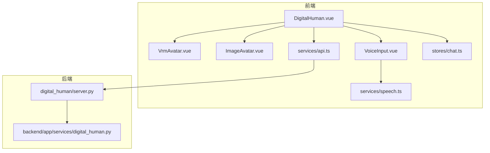
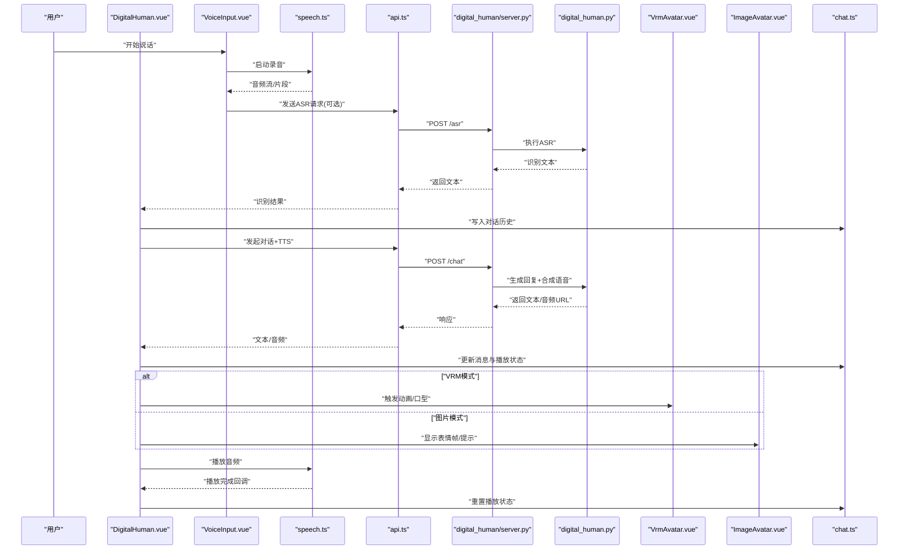
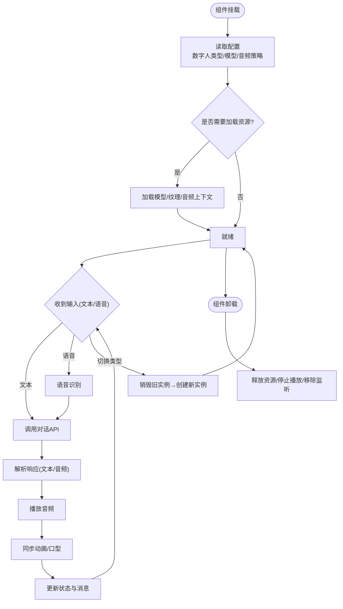
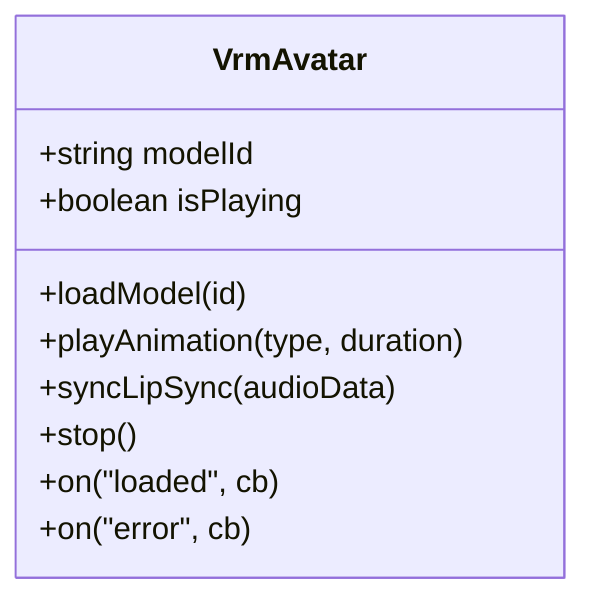
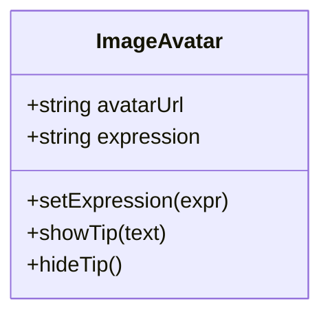
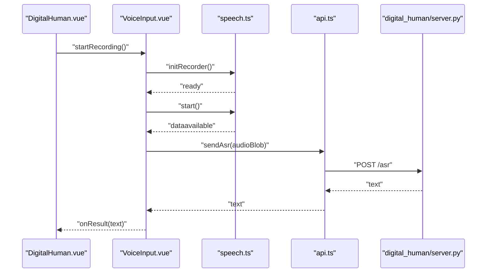
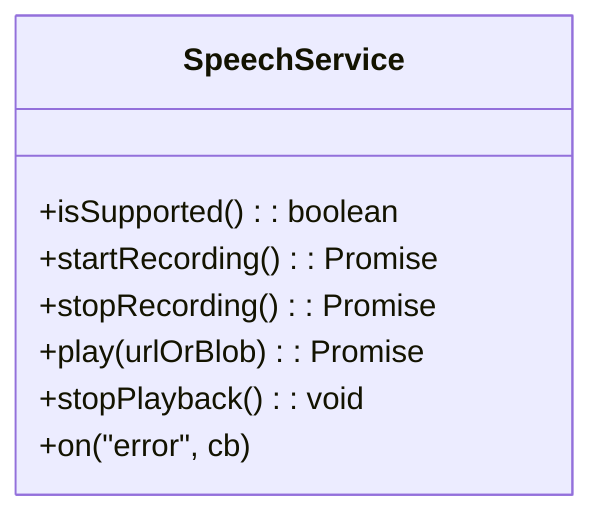
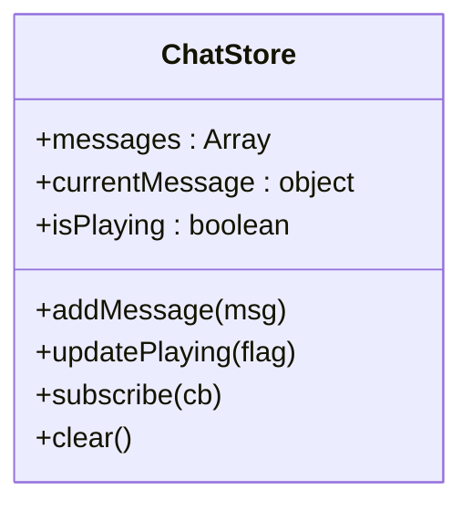
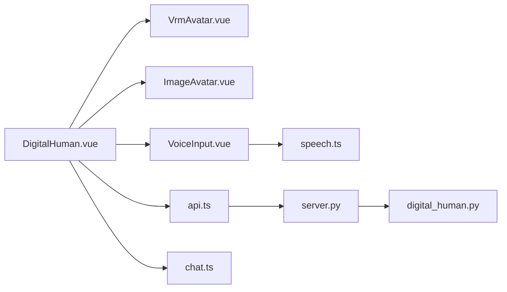

# 数字人核心组件

<cite>
**本文引用的文件**   
- [DigitalHuman.vue](file://frontend/tourist-app/src/components/DigitalHuman/DigitalHuman.vue)
- [VrmAvatar.vue](file://frontend/tourist-app/src/components/DigitalHuman/VrmAvatar.vue)
- [ImageAvatar.vue](file://frontend/tourist-app/src/components/DigitalHuman/ImageAvatar.vue)
- [VoiceInput.vue](file://frontend/tourist-app/src/components/VoiceInput/VoiceInput.vue)
- [speech.ts](file://frontend/tourist-app/src/services/speech.ts)
- [api.ts](file://frontend/tourist-app/src/services/api.ts)
- [chat.ts](file://frontend/tourist-app/src/stores/chat.ts)
- [server.py](file://digital_human/server.py)
- [digital_human.py](file://backend/app/services/digital_human.py)
</cite>

## 目录
1. [简介](#简介)
2. [项目结构](#项目结构)
3. [核心组件](#核心组件)
4. [架构总览](#架构总览)
5. [详细组件分析](#详细组件分析)
6. [依赖分析](#依赖分析)
7. [性能考虑](#性能考虑)
8. [故障排查指南](#故障排查指南)
9. [结论](#结论)
10. [附录](#附录)

## 简介
本文件聚焦于“数字人”前端核心组件，系统性阐述其架构设计、类型管理、状态控制与生命周期管理；详述初始化流程、配置参数、事件处理机制；解释与对话系统的集成方式（音频播放控制、动画同步、状态更新）；并给出数字人切换逻辑、错误处理与性能优化策略。同时提供使用示例与自定义扩展方法，帮助开发者快速理解与二次开发。

## 项目结构
数字人相关的前端代码位于 tourist-app 的 components 与 services 目录，后端服务在 digital_human 与 backend 中提供能力支撑。整体关系如下：



图表来源
- [DigitalHuman.vue](file://frontend/tourist-app/src/components/DigitalHuman/DigitalHuman.vue)
- [VrmAvatar.vue](file://frontend/tourist-app/src/components/DigitalHuman/VrmAvatar.vue)
- [ImageAvatar.vue](file://frontend/tourist-app/src/components/DigitalHuman/ImageAvatar.vue)
- [VoiceInput.vue](file://frontend/tourist-app/src/components/VoiceInput/VoiceInput.vue)
- [speech.ts](file://frontend/tourist-app/src/services/speech.ts)
- [api.ts](file://frontend/tourist-app/src/services/api.ts)
- [chat.ts](file://frontend/tourist-app/src/stores/chat.ts)
- [server.py](file://digital_human/server.py)
- [digital_human.py](file://backend/app/services/digital_human.py)

章节来源
- [DigitalHuman.vue](file://frontend/tourist-app/src/components/DigitalHuman/DigitalHuman.vue)
- [VrmAvatar.vue](file://frontend/tourist-app/src/components/DigitalHuman/VrmAvatar.vue)
- [ImageAvatar.vue](file://frontend/tourist-app/src/components/DigitalHuman/ImageAvatar.vue)
- [VoiceInput.vue](file://frontend/tourist-app/src/components/VoiceInput/VoiceInput.vue)
- [speech.ts](file://frontend/tourist-app/src/services/speech.ts)
- [api.ts](file://frontend/tourist-app/src/services/api.ts)
- [chat.ts](file://frontend/tourist-app/src/stores/chat.ts)
- [server.py](file://digital_human/server.py)
- [digital_human.py](file://backend/app/services/digital_human.py)

## 核心组件
- 数字人主组件 DigitalHuman.vue：负责数字人类型选择、渲染容器、生命周期管理、事件分发、与对话系统对接（文本/语音）、以及音频播放与动画同步。
- 虚拟人渲染器 VrmAvatar.vue：基于VRM模型的3D数字人实现，负责模型加载、骨骼动画、口型驱动等。
- 图片数字人 ImageAvatar.vue：轻量级图片展示模式，适合低资源场景或占位。
- 语音输入 VoiceInput.vue：采集麦克风音频、触发ASR、将识别结果回传至对话流程。
- 语音服务 speech.ts：封装浏览器语音能力（如Web Speech API），提供录音、播放、中断等接口。
- 对话API api.ts：封装与后端数字人服务的HTTP交互（文本对话、TTS、广播等）。
- 聊天状态 chat.ts：集中管理对话历史、当前消息、播放状态等全局状态。
- 后端服务 server.py 与 digital_human.py：提供数字人对话、TTS、广播等能力。

章节来源
- [DigitalHuman.vue](file://frontend/tourist-app/src/components/DigitalHuman/DigitalHuman.vue)
- [VrmAvatar.vue](file://frontend/tourist-app/src/components/DigitalHuman/VrmAvatar.vue)
- [ImageAvatar.vue](file://frontend/tourist-app/src/components/DigitalHuman/ImageAvatar.vue)
- [VoiceInput.vue](file://frontend/tourist-app/src/components/VoiceInput/VoiceInput.vue)
- [speech.ts](file://frontend/tourist-app/src/services/speech.ts)
- [api.ts](file://frontend/tourist-app/src/services/api.ts)
- [chat.ts](file://frontend/tourist-app/src/stores/chat.ts)
- [server.py](file://digital_human/server.py)
- [digital_human.py](file://backend/app/services/digital_human.py)

## 架构总览
数字人主组件作为“编排者”，协调渲染子组件、语音输入、对话API与全局状态，形成“输入—处理—输出”的闭环：用户语音/文本输入 → 调用后端对话/TTS → 返回音频与动作指令 → 主组件调度音频播放与动画同步 → 更新UI状态。



图表来源
- [DigitalHuman.vue](file://frontend/tourist-app/src/components/DigitalHuman/DigitalHuman.vue)
- [VoiceInput.vue](file://frontend/tourist-app/src/components/VoiceInput/VoiceInput.vue)
- [speech.ts](file://frontend/tourist-app/src/services/speech.ts)
- [api.ts](file://frontend/tourist-app/src/services/api.ts)
- [server.py](file://digital_human/server.py)
- [digital_human.py](file://backend/app/services/digital_human.py)
- [VrmAvatar.vue](file://frontend/tourist-app/src/components/DigitalHuman/VrmAvatar.vue)
- [ImageAvatar.vue](file://frontend/tourist-app/src/components/DigitalHuman/ImageAvatar.vue)
- [chat.ts](file://frontend/tourist-app/src/stores/chat.ts)

## 详细组件分析

### 数字人主组件 DigitalHuman.vue
职责与特性
- 数字人类型管理：支持 VRM 与图片两种渲染模式，通过属性或配置项切换。
- 状态控制：维护“空闲/说话/思考/错误”等状态，避免并发冲突。
- 生命周期管理：挂载时初始化资源，卸载时释放音频、停止动画、清理监听。
- 事件处理：接收来自语音输入、渲染子组件、API 回调的事件，统一派发。
- 与对话系统集成：调用 api.ts 进行文本对话与TTS，结合 chat.ts 更新全局状态。
- 音频与动画同步：根据音频播放进度驱动口型/表情，确保视听一致。

关键流程
- 初始化：读取配置（数字人类型、模型路径、音频策略等），按需加载资源。
- 对话流程：接收用户输入 → 调用后端 → 解析响应 → 播放音频并驱动动画 → 更新状态。
- 切换逻辑：在运行时安全切换数字人类型，销毁旧实例并创建新实例。
- 错误处理：网络异常、权限拒绝、媒体失败等均有兜底与提示。



图表来源
- [DigitalHuman.vue](file://frontend/tourist-app/src/components/DigitalHuman/DigitalHuman.vue)
- [api.ts](file://frontend/tourist-app/src/services/api.ts)
- [chat.ts](file://frontend/tourist-app/src/stores/chat.ts)
- [VrmAvatar.vue](file://frontend/tourist-app/src/components/DigitalHuman/VrmAvatar.vue)
- [ImageAvatar.vue](file://frontend/tourist-app/src/components/DigitalHuman/ImageAvatar.vue)

章节来源
- [DigitalHuman.vue](file://frontend/tourist-app/src/components/DigitalHuman/DigitalHuman.vue)
- [api.ts](file://frontend/tourist-app/src/services/api.ts)
- [chat.ts](file://frontend/tourist-app/src/stores/chat.ts)
- [VrmAvatar.vue](file://frontend/tourist-app/src/components/DigitalHuman/VrmAvatar.vue)
- [ImageAvatar.vue](file://frontend/tourist-app/src/components/DigitalHuman/ImageAvatar.vue)

### 虚拟人渲染器 VrmAvatar.vue
职责与特性
- 模型加载与缓存：按类型与标识加载VRM模型，避免重复下载。
- 动画与口型驱动：根据音频数据或外部指令驱动骨骼与面部表情。
- 性能优化：按需启用高精度材质、延迟加载纹理、节流动画更新。
- 事件上报：向父组件上报“加载完成/播放开始/播放结束/错误”。



图表来源
- [VrmAvatar.vue](file://frontend/tourist-app/src/components/DigitalHuman/VrmAvatar.vue)

章节来源
- [VrmAvatar.vue](file://frontend/tourist-app/src/components/DigitalHuman/VrmAvatar.vue)

### 图片数字人 ImageAvatar.vue
职责与特性
- 轻量展示：以图片序列或静态图呈现数字人外观。
- 简单动画：根据状态切换表情帧或叠加提示层。
- 低资源占用：适合低端设备或弱网环境。



图表来源
- [ImageAvatar.vue](file://frontend/tourist-app/src/components/DigitalHuman/ImageAvatar.vue)

章节来源
- [ImageAvatar.vue](file://frontend/tourist-app/src/components/DigitalHuman/ImageAvatar.vue)

### 语音输入 VoiceInput.vue
职责与特性
- 录音控制：开始/停止录音，处理权限与浏览器兼容性。
- 音频上传：将音频片段发送至后端ASR或直接交由 speech.ts 本地识别。
- 事件透传：将识别结果与错误信息上抛给父组件。



图表来源
- [VoiceInput.vue](file://frontend/tourist-app/src/components/VoiceInput/VoiceInput.vue)
- [speech.ts](file://frontend/tourist-app/src/services/speech.ts)
- [api.ts](file://frontend/tourist-app/src/services/api.ts)
- [server.py](file://digital_human/server.py)

章节来源
- [VoiceInput.vue](file://frontend/tourist-app/src/components/VoiceInput/VoiceInput.vue)
- [speech.ts](file://frontend/tourist-app/src/services/speech.ts)
- [api.ts](file://frontend/tourist-app/src/services/api.ts)
- [server.py](file://digital_human/server.py)

### 语音服务 speech.ts
职责与特性
- 录音与播放：封装 Web Speech API 或 MediaRecorder，提供统一的 start/stop/play/stop 接口。
- 中断与队列：支持打断当前播放、排队播放多段音频。
- 错误处理：捕获权限拒绝、格式不支持、网络异常等，向上抛出可诊断的错误码。



图表来源
- [speech.ts](file://frontend/tourist-app/src/services/speech.ts)

章节来源
- [speech.ts](file://frontend/tourist-app/src/services/speech.ts)

### 对话API api.ts
职责与特性
- 封装HTTP请求：与后端数字人服务交互，包括文本对话、TTS、广播等。
- 重试与超时：对不稳定网络进行指数退避重试与超时控制。
- 错误映射：将后端错误码映射为前端友好提示。

```mermaid
classDiagram
class ApiClient {
+chat(text) : Promise<{text, audioUrl}>
+asr(blob) : Promise<string>
+broadcast(payload) : Promise<void>
-retry(fn, times, delay)
-mapError(code, msg)
}
```

图表来源
- [api.ts](file://frontend/tourist-app/src/services/api.ts)
- [server.py](file://digital_human/server.py)
- [digital_human.py](file://backend/app/services/digital_human.py)

章节来源
- [api.ts](file://frontend/tourist-app/src/services/api.ts)
- [server.py](file://digital_human/server.py)
- [digital_human.py](file://backend/app/services/digital_human.py)

### 聊天状态 chat.ts
职责与特性
- 集中管理对话历史、当前消息、播放状态、错误信息等。
- 提供订阅/发布机制，供各组件观察状态变化。
- 持久化：可选地将对话记录保存到本地存储。



图表来源
- [chat.ts](file://frontend/tourist-app/src/stores/chat.ts)

章节来源
- [chat.ts](file://frontend/tourist-app/src/stores/chat.ts)

## 依赖分析
- 组件耦合
  - DigitalHuman.vue 与 VrmAvatar.vue/ImageAvatar.vue 松耦合，通过事件与属性通信。
  - VoiceInput.vue 与 speech.ts 强耦合，对外暴露稳定接口。
  - api.ts 与后端 server.py/digital_human.py 通过REST契约解耦。
- 外部依赖
  - 浏览器媒体能力（MediaRecorder/Web Speech API）。
  - 3D渲染库（由 VrmAvatar.vue 内部引入）。
- 潜在循环依赖
  - 通过事件总线与状态中心（chat.ts）避免直接双向引用。



图表来源
- [DigitalHuman.vue](file://frontend/tourist-app/src/components/DigitalHuman/DigitalHuman.vue)
- [VrmAvatar.vue](file://frontend/tourist-app/src/components/DigitalHuman/VrmAvatar.vue)
- [ImageAvatar.vue](file://frontend/tourist-app/src/components/DigitalHuman/ImageAvatar.vue)
- [VoiceInput.vue](file://frontend/tourist-app/src/components/VoiceInput/VoiceInput.vue)
- [speech.ts](file://frontend/tourist-app/src/services/speech.ts)
- [api.ts](file://frontend/tourist-app/src/services/api.ts)
- [server.py](file://digital_human/server.py)
- [digital_human.py](file://backend/app/services/digital_human.py)
- [chat.ts](file://frontend/tourist-app/src/stores/chat.ts)

章节来源
- [DigitalHuman.vue](file://frontend/tourist-app/src/components/DigitalHuman/DigitalHuman.vue)
- [VrmAvatar.vue](file://frontend/tourist-app/src/components/DigitalHuman/VrmAvatar.vue)
- [ImageAvatar.vue](file://frontend/tourist-app/src/components/DigitalHuman/ImageAvatar.vue)
- [VoiceInput.vue](file://frontend/tourist-app/src/components/VoiceInput/VoiceInput.vue)
- [speech.ts](file://frontend/tourist-app/src/services/speech.ts)
- [api.ts](file://frontend/tourist-app/src/services/api.ts)
- [server.py](file://digital_human/server.py)
- [digital_human.py](file://backend/app/services/digital_human.py)
- [chat.ts](file://frontend/tourist-app/src/stores/chat.ts)

## 性能考虑
- 资源懒加载：仅在需要时加载VRM模型与纹理，首次进入页面不预加载所有资源。
- 音频策略：优先使用短音频片段与流式播放，减少首帧等待；必要时降级为静音+字幕。
- 动画节流：在低端设备上降低动画更新频率，避免掉帧。
- 并发控制：同一时间仅允许一个音频播放任务，避免竞争与卡顿。
- 错误恢复：网络抖动自动重试，失败后回退到文本播报或图片模式。

[本节为通用指导，无需源码引用]

## 故障排查指南
常见问题与定位步骤
- 无法录音
  - 检查浏览器权限是否授予；确认 speech.ts 的 isSupported 返回值。
  - 查看控制台错误码，区分“权限拒绝/格式不支持/设备不可用”。
- 无声音或不同步
  - 确认音频URL可达且格式受支持；检查播放队列是否被中断。
  - 验证动画驱动是否与音频时长匹配。
- 模型加载失败
  - 检查CDN/本地路径是否正确；确认跨域与MIME类型。
  - 查看 VrmAvatar.vue 的加载事件与错误回调。
- 对话无响应
  - 检查 api.ts 的重试与超时配置；核对后端 server.py 路由与健康状态。
  - 查看 chat.ts 的状态是否被正确更新。

章节来源
- [speech.ts](file://frontend/tourist-app/src/services/speech.ts)
- [VrmAvatar.vue](file://frontend/tourist-app/src/components/DigitalHuman/VrmAvatar.vue)
- [api.ts](file://frontend/tourist-app/src/services/api.ts)
- [server.py](file://digital_human/server.py)
- [chat.ts](file://frontend/tourist-app/src/stores/chat.ts)

## 结论
数字人核心组件以 DigitalHuman.vue 为中心，整合了渲染、语音、对话与状态管理，形成了可扩展、可插拔的数字人解决方案。通过清晰的类型管理与生命周期控制，配合稳健的错误处理与性能优化策略，能够在多种终端环境下提供一致的交互体验。

[本节为总结性内容，无需源码引用]

## 附录

### 使用示例
- 基础用法
  - 在页面中引入 DigitalHuman.vue，传入数字人类型与模型ID，即可启动。
  - 参考路径：[DigitalHuman.vue](file://frontend/tourist-app/src/components/DigitalHuman/DigitalHuman.vue)
- 接入语音输入
  - 组合 VoiceInput.vue 与 speech.ts，实现“说即答”。
  - 参考路径：[VoiceInput.vue](file://frontend/tourist-app/src/components/VoiceInput/VoiceInput.vue)、[speech.ts](file://frontend/tourist-app/src/services/speech.ts)
- 切换数字人类型
  - 动态修改类型属性，组件内部会销毁旧实例并创建新实例。
  - 参考路径：[DigitalHuman.vue](file://frontend/tourist-app/src/components/DigitalHuman/DigitalHuman.vue)

### 自定义扩展方法
- 新增数字人类型
  - 实现新的渲染组件（如 NewAvatar.vue），遵循与 VrmAvatar.vue 相同的接口约定（加载/播放/停止/事件上报）。
  - 在 DigitalHuman.vue 的类型注册处添加映射。
  - 参考路径：[VrmAvatar.vue](file://frontend/tourist-app/src/components/DigitalHuman/VrmAvatar.vue)、[DigitalHuman.vue](file://frontend/tourist-app/src/components/DigitalHuman/DigitalHuman.vue)
- 扩展对话能力
  - 在 api.ts 中新增方法，并在 DigitalHuman.vue 中调用。
  - 参考路径：[api.ts](file://frontend/tourist-app/src/services/api.ts)、[DigitalHuman.vue](file://frontend/tourist-app/src/components/DigitalHuman/DigitalHuman.vue)
- 自定义音频策略
  - 在 speech.ts 中替换播放器实现，或在 DigitalHuman.vue 中注入不同的音频上下文。
  - 参考路径：[speech.ts](file://frontend/tourist-app/src/services/speech.ts)、[DigitalHuman.vue](file://frontend/tourist-app/src/components/DigitalHuman/DigitalHuman.vue)