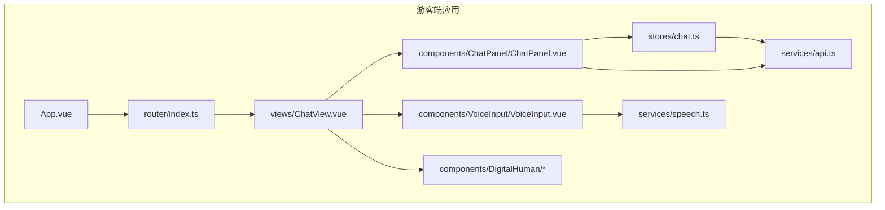
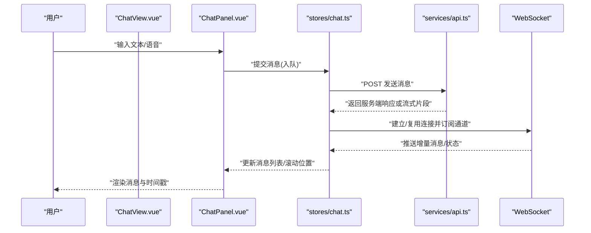
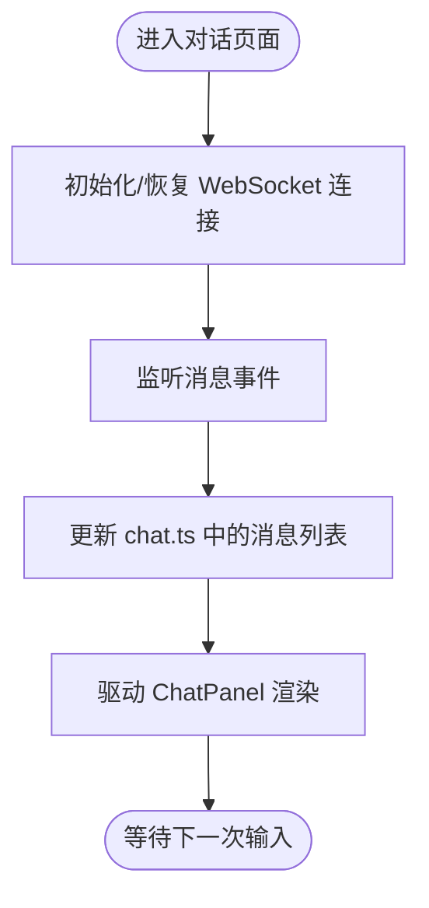
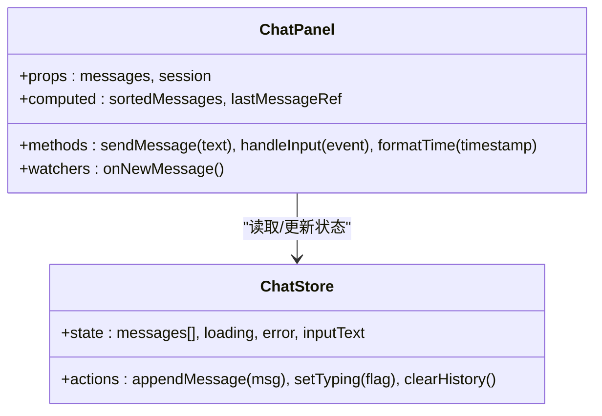
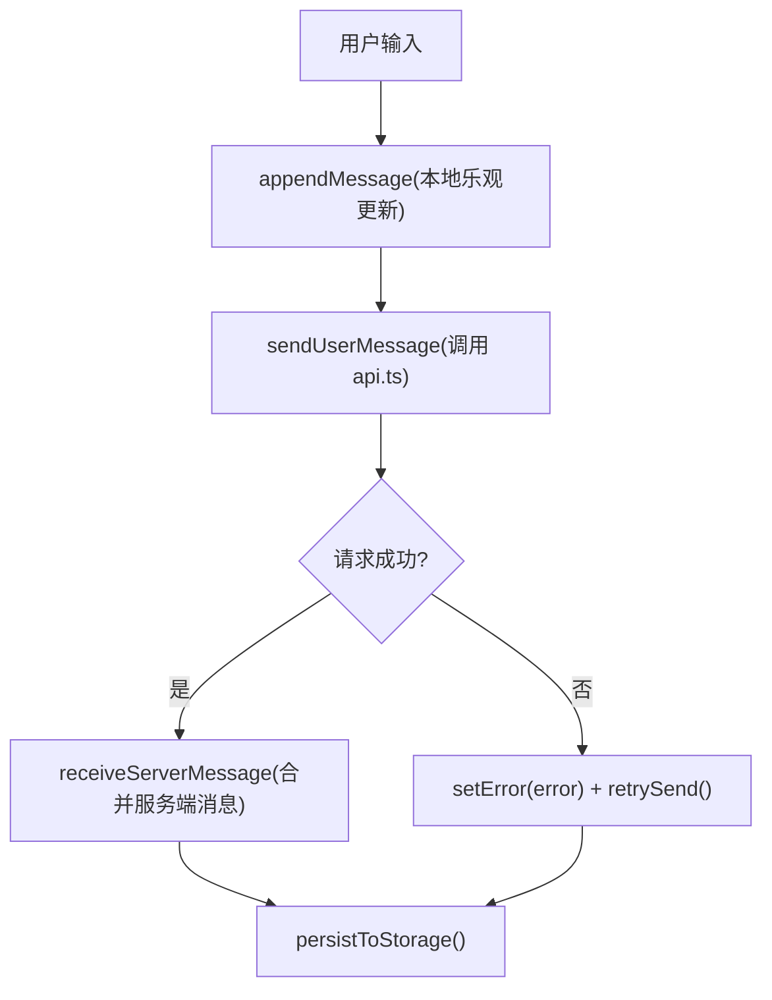
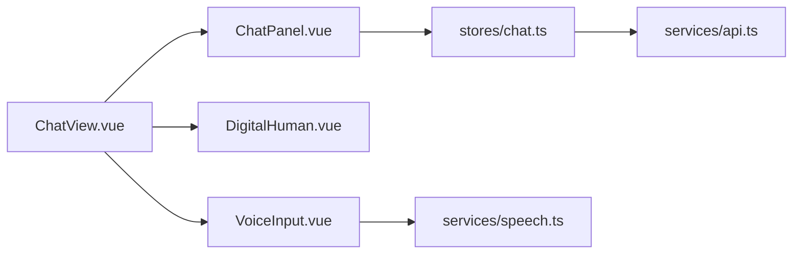

# 智能对话界面

<cite>
**本文引用的文件**   
- [ChatView.vue](file://frontend/tourist-app/src/views/ChatView.vue)
- [ChatPanel.vue](file://frontend/tourist-app/src/components/ChatPanel/ChatPanel.vue)
- [chat.ts](file://frontend/tourist-app/src/stores/chat.ts)
- [api.ts](file://frontend/tourist-app/src/services/api.ts)
- [speech.ts](file://frontend/tourist-app/src/services/speech.ts)
- [VoiceInput.vue](file://frontend/tourist-app/src/components/VoiceInput/VoiceInput.vue)
- [DigitalHuman.vue](file://frontend/tourist-app/src/components/DigitalHuman/DigitalHuman.vue)
- [ImageAvatar.vue](file://frontend/tourist-app/src/components/DigitalHuman/ImageAvatar.vue)
- [VrmAvatar.vue](file://frontend/tourist-app/src/components/DigitalHuman/VrmAvatar.vue)
- [main.ts](file://frontend/tourist-app/src/main.ts)
- [App.vue](file://frontend/tourist-app/src/App.vue)
- [index.ts](file://frontend/tourist-app/src/router/index.ts)
</cite>

## 目录
1. [简介](#简介)
2. [项目结构](#项目结构)
3. [核心组件](#核心组件)
4. [架构总览](#架构总览)
5. [详细组件分析](#详细组件分析)
6. [依赖关系分析](#依赖关系分析)
7. [性能与体验优化](#性能与体验优化)
8. [故障排查指南](#故障排查指南)
9. [结论](#结论)
10. [附录：使用示例与扩展建议](#附录使用示例与扩展建议)

## 简介
本文件面向开发者，系统化阐述智能对话界面的前端实现，重点覆盖以下方面：
- 聊天视图组件 ChatView.vue 的设计与实现：消息列表渲染、输入框交互、发送接收流程、实时通信机制。
- 聊天面板组件 ChatPanel.vue 的消息展示逻辑、用户输入处理、消息格式化与时间戳显示。
- 聊天状态管理 store（chat.ts）：消息存储、会话状态、加载状态、用户输入状态的管理。
- WebSocket 连接管理、消息持久化、错误重试机制与用户体验优化策略。
- 组件使用示例与状态管理模式，帮助扩展对话功能。

## 项目结构
前端采用 Vue 3 + TypeScript 的单页应用组织方式，围绕“游客端”应用 tourist-app 构建对话能力。关键目录与职责如下：
- views：页面级视图，包含 ChatView.vue 作为对话主入口。
- components：可复用 UI 组件，包括 ChatPanel.vue（聊天面板）、VoiceInput.vue（语音输入）、DigitalHuman 系列（数字人/头像）。
- stores：基于 Pinia 的状态管理，chat.ts 负责对话相关的全局状态。
- services：业务服务层，api.ts 封装 HTTP 请求，speech.ts 封装语音识别/合成等能力。
- router：路由配置，将 ChatView 挂载到对话路径。
- main.ts / App.vue：应用初始化与根组件装配。

图表来源
- [App.vue](file://frontend/tourist-app/src/App.vue)
- [index.ts](file://frontend/tourist-app/src/router/index.ts)
- [ChatView.vue](file://frontend/tourist-app/src/views/ChatView.vue)
- [ChatPanel.vue](file://frontend/tourist-app/src/components/ChatPanel/ChatPanel.vue)
- [VoiceInput.vue](file://frontend/tourist-app/src/components/VoiceInput/VoiceInput.vue)
- [DigitalHuman.vue](file://frontend/tourist-app/src/components/DigitalHuman/DigitalHuman.vue)
- [ImageAvatar.vue](file://frontend/tourist-app/src/components/DigitalHuman/ImageAvatar.vue)
- [VrmAvatar.vue](file://frontend/tourist-app/src/components/DigitalHuman/VrmAvatar.vue)
- [chat.ts](file://frontend/tourist-app/src/stores/chat.ts)
- [api.ts](file://frontend/tourist-app/src/services/api.ts)
- [speech.ts](file://frontend/tourist-app/src/services/speech.ts)

章节来源
- [main.ts](file://frontend/tourist-app/src/main.ts)
- [App.vue](file://frontend/tourist-app/src/App.vue)
- [index.ts](file://frontend/tourist-app/src/router/index.ts)

## 核心组件
本节聚焦三个核心模块：ChatView.vue、ChatPanel.vue、chat.ts。它们共同构成对话界面的“视图-面板-状态”三层协作。

- ChatView.vue：页面容器，负责布局、路由集成、全局事件监听、WebSocket 生命周期管理与子组件编排。
- ChatPanel.vue：消息展示与输入交互的核心组件，负责消息列表渲染、滚动定位、输入校验、发送触发、时间戳与格式化处理。
- chat.ts：Pinia Store，集中管理消息集合、会话上下文、加载态、错误态、用户输入态，并提供增删改查与副作用方法。

章节来源
- [ChatView.vue](file://frontend/tourist-app/src/views/ChatView.vue)
- [ChatPanel.vue](file://frontend/tourist-app/src/components/ChatPanel/ChatPanel.vue)
- [chat.ts](file://frontend/tourist-app/src/stores/chat.ts)

## 架构总览
下图展示了从用户输入到消息展示的关键调用链，以及 WebSocket 的收发路径。

图表来源
- [ChatView.vue](file://frontend/tourist-app/src/views/ChatView.vue)
- [ChatPanel.vue](file://frontend/tourist-app/src/components/ChatPanel/ChatPanel.vue)
- [chat.ts](file://frontend/tourist-app/src/stores/chat.ts)
- [api.ts](file://frontend/tourist-app/src/services/api.ts)

## 详细组件分析

### ChatView.vue 分析与实现要点
- 角色与职责
  - 作为对话页面的容器，负责引入并编排 ChatPanel、数字人组件、语音输入等子组件。
  - 维护 WebSocket 连接的生命周期（创建、重连、关闭），并在组件卸载时清理资源。
  - 提供全局键盘快捷键（如 Enter 发送）、焦点管理、窗口尺寸变化时的自适应行为。
- 消息发送与接收流程
  - 通过调用 chat.ts 的发送方法，将用户输入写入本地队列并触发网络请求。
  - 监听 WebSocket 事件，将服务端推送的消息合并到 store 中，确保 UI 即时刷新。
- 错误与异常处理
  - 对网络异常、WebSocket 断线进行捕获，触发重试与降级提示。
  - 在 UI 层展示失败原因与重试按钮，保障可用性。
- 与后端服务的集成点
  - 通过 api.ts 发起 REST 请求；通过 WebSocket 接收实时数据。
  - 可选地对接语音服务（speech.ts）完成语音转文本与文本转语音。

图表来源
- [ChatView.vue](file://frontend/tourist-app/src/views/ChatView.vue)
- [chat.ts](file://frontend/tourist-app/src/stores/chat.ts)
- [api.ts](file://frontend/tourist-app/src/services/api.ts)

章节来源
- [ChatView.vue](file://frontend/tourist-app/src/views/ChatView.vue)

### ChatPanel.vue 分析与实现要点
- 消息列表渲染
  - 根据 chat.ts 提供的消息数组渲染列表，区分用户与系统消息样式。
  - 支持长文本折叠、代码块高亮、图片预览等富文本展示能力（由具体实现决定）。
- 输入框交互
  - 绑定输入事件，限制长度、过滤非法字符、自动聚焦与失焦行为。
  - 支持回车发送、Shift+Enter 换行、粘贴图片/文件等增强交互。
- 消息格式化与时间戳
  - 统一时间格式（如相对时间/绝对时间切换），按会话分组显示。
  - 对 Markdown/HTML 内容进行安全渲染与脱敏处理。
- 滚动与性能
  - 新消息到达后自动滚动到底部，必要时节流滚动计算。
  - 对大量历史消息采用虚拟滚动或分页加载策略（视实现而定）。

图表来源
- [ChatPanel.vue](file://frontend/tourist-app/src/components/ChatPanel/ChatPanel.vue)
- [chat.ts](file://frontend/tourist-app/src/stores/chat.ts)

章节来源
- [ChatPanel.vue](file://frontend/tourist-app/src/components/ChatPanel/ChatPanel.vue)
- [chat.ts](file://frontend/tourist-app/src/stores/chat.ts)

### chat.ts 状态管理设计
- 状态字段
  - messages：消息数组，每条消息包含 id、role、content、timestamp、status 等。
  - session：当前会话标识与上下文信息。
  - loading：全局加载态，控制发送按钮禁用与骨架屏。
  - error：错误信息，用于 UI 提示与重试。
  - inputText：用户输入缓存，便于恢复与调试。
- 核心动作
  - appendMessage：追加消息并触发滚动定位。
  - sendUserMessage：组装请求体，调用 api.ts 发送，处理成功/失败分支。
  - receiveServerMessage：处理 WebSocket 推送，合并到消息列表。
  - retrySend：针对失败消息的重试逻辑，含退避策略。
- 副作用与持久化
  - 在合适时机将消息落盘（如 localStorage 或 IndexedDB），保证刷新不丢失。
  - 监听路由变化或会话切换，清理旧会话状态。

图表来源
- [chat.ts](file://frontend/tourist-app/src/stores/chat.ts)
- [api.ts](file://frontend/tourist-app/src/services/api.ts)

章节来源
- [chat.ts](file://frontend/tourist-app/src/stores/chat.ts)

### 语音输入与数字人组件集成
- VoiceInput.vue
  - 封装 speech.ts 的录音、识别与播放能力，提供开始/停止/试听按钮。
  - 将识别结果回写到 chat.ts 的输入态或直接触发发送。
- DigitalHuman 系列
  - DigitalHuman.vue 作为容器，ImageAvatar.vue 与 VrmAvatar.vue 为不同渲染模式。
  - 与聊天流程联动，例如收到回复后触发数字人口播或表情动画。

章节来源
- [VoiceInput.vue](file://frontend/tourist-app/src/components/VoiceInput/VoiceInput.vue)
- [speech.ts](file://frontend/tourist-app/src/services/speech.ts)
- [DigitalHuman.vue](file://frontend/tourist-app/src/components/DigitalHuman/DigitalHuman.vue)
- [ImageAvatar.vue](file://frontend/tourist-app/src/components/DigitalHuman/ImageAvatar.vue)
- [VrmAvatar.vue](file://frontend/tourist-app/src/components/DigitalHuman/VrmAvatar.vue)

## 依赖关系分析
- 组件耦合
  - ChatView.vue 依赖 ChatPanel.vue、数字人组件与语音输入组件，承担编排职责。
  - ChatPanel.vue 强依赖 chat.ts 的状态与 actions，弱依赖 api.ts 的错误码映射。
- 外部依赖
  - api.ts 封装 HTTP 客户端，可能基于 fetch/axios。
  - WebSocket 连接由 ChatView.vue 或 chat.ts 统一管理，避免多处重复创建。
- 潜在循环依赖
  - 应避免 ChatPanel.vue 直接导入 ChatView.vue，保持单向依赖：视图 -> 面板 -> 状态 -> 服务。

图表来源
- [ChatView.vue](file://frontend/tourist-app/src/views/ChatView.vue)
- [ChatPanel.vue](file://frontend/tourist-app/src/components/ChatPanel/ChatPanel.vue)
- [chat.ts](file://frontend/tourist-app/src/stores/chat.ts)
- [api.ts](file://frontend/tourist-app/src/services/api.ts)
- [VoiceInput.vue](file://frontend/tourist-app/src/components/VoiceInput/VoiceInput.vue)
- [speech.ts](file://frontend/tourist-app/src/services/speech.ts)
- [DigitalHuman.vue](file://frontend/tourist-app/src/components/DigitalHuman/DigitalHuman.vue)

章节来源
- [ChatView.vue](file://frontend/tourist-app/src/views/ChatView.vue)
- [ChatPanel.vue](file://frontend/tourist-app/src/components/ChatPanel/ChatPanel.vue)
- [chat.ts](file://frontend/tourist-app/src/stores/chat.ts)
- [api.ts](file://frontend/tourist-app/src/services/api.ts)
- [VoiceInput.vue](file://frontend/tourist-app/src/components/VoiceInput/VoiceInput.vue)
- [speech.ts](file://frontend/tourist-app/src/services/speech.ts)
- [DigitalHuman.vue](file://frontend/tourist-app/src/components/DigitalHuman/DigitalHuman.vue)

## 性能与体验优化
- 消息渲染
  - 大数据量场景下采用虚拟滚动或分页加载，减少 DOM 节点数量。
  - 对富文本内容做懒加载与防抖渲染，避免阻塞主线程。
- 滚动与定位
  - 新消息到来时使用 requestAnimationFrame 批量更新滚动位置。
  - 用户手动上滚查看历史时暂停自动滚动，离开顶部再恢复。
- 网络与重连
  - WebSocket 断线指数退避重连，记录最后心跳时间与超时阈值。
  - 发送失败的消息进入重试队列，结合抖动避免雪崩。
- 输入体验
  - 输入框防抖搜索/联想，限制最大长度与敏感词过滤。
  - 语音输入提供进度反馈与错误提示，支持取消与重试。
- 持久化
  - 消息落盘采用分片/压缩策略，定期清理过期会话。
  - 首次加载时优先展示本地缓存，后台静默同步最新数据。

[本节为通用指导，无需源码引用]

## 故障排查指南
- WebSocket 连接问题
  - 检查跨域与鉴权头是否正确传递。
  - 观察浏览器控制台的网络面板，确认握手与心跳是否正常。
  - 若频繁断线，调整重连间隔与最大重试次数。
- 消息未渲染或错乱
  - 核对 chat.ts 中消息 ID 的唯一性与顺序。
  - 检查是否重复追加或覆盖同一条消息。
- 发送失败与重试
  - 查看 api.ts 的错误码映射与重试策略。
  - 对于幂等接口，确保重试不会导致重复消息。
- 语音输入异常
  - 检查麦克风权限与浏览器兼容性。
  - 确认 speech.ts 的编码与采样率设置是否符合后端要求。

章节来源
- [chat.ts](file://frontend/tourist-app/src/stores/chat.ts)
- [api.ts](file://frontend/tourist-app/src/services/api.ts)
- [speech.ts](file://frontend/tourist-app/src/services/speech.ts)
- [VoiceInput.vue](file://frontend/tourist-app/src/components/VoiceInput/VoiceInput.vue)

## 结论
通过将 ChatView.vue、ChatPanel.vue 与 chat.ts 解耦分层，实现了清晰的职责边界与良好的可扩展性。配合 api.ts 与 WebSocket 的协同，既能满足实时对话需求，也能兼顾离线与容错。建议在后续迭代中完善虚拟滚动、消息去重、会话迁移与多端同步等能力，进一步提升稳定性与用户体验。

[本节为总结，无需源码引用]

## 附录：使用示例与扩展建议
- 基本用法
  - 在路由中挂载 ChatView.vue，即可进入对话页面。
  - 在 ChatPanel.vue 中通过 props 传入初始消息与会话信息。
- 扩展消息类型
  - 在 chat.ts 中定义新的 message.type，并在 ChatPanel.vue 中增加对应渲染器。
- 接入更多后端能力
  - 在 api.ts 中新增接口方法，在 chat.ts 的 actions 中调用并处理返回值。
- 自定义主题与交互
  - 通过 CSS 变量或主题插件统一配色与字体。
  - 在 ChatView.vue 中注入全局快捷键与手势事件。

章节来源
- [index.ts](file://frontend/tourist-app/src/router/index.ts)
- [ChatView.vue](file://frontend/tourist-app/src/views/ChatView.vue)
- [ChatPanel.vue](file://frontend/tourist-app/src/components/ChatPanel/ChatPanel.vue)
- [chat.ts](file://frontend/tourist-app/src/stores/chat.ts)
- [api.ts](file://frontend/tourist-app/src/services/api.ts)