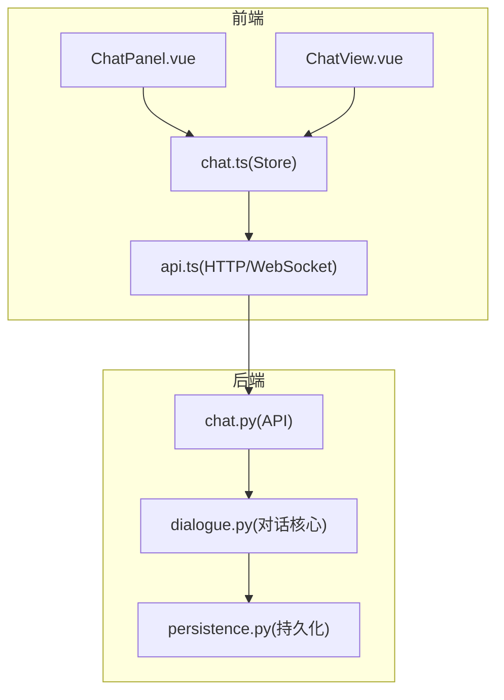
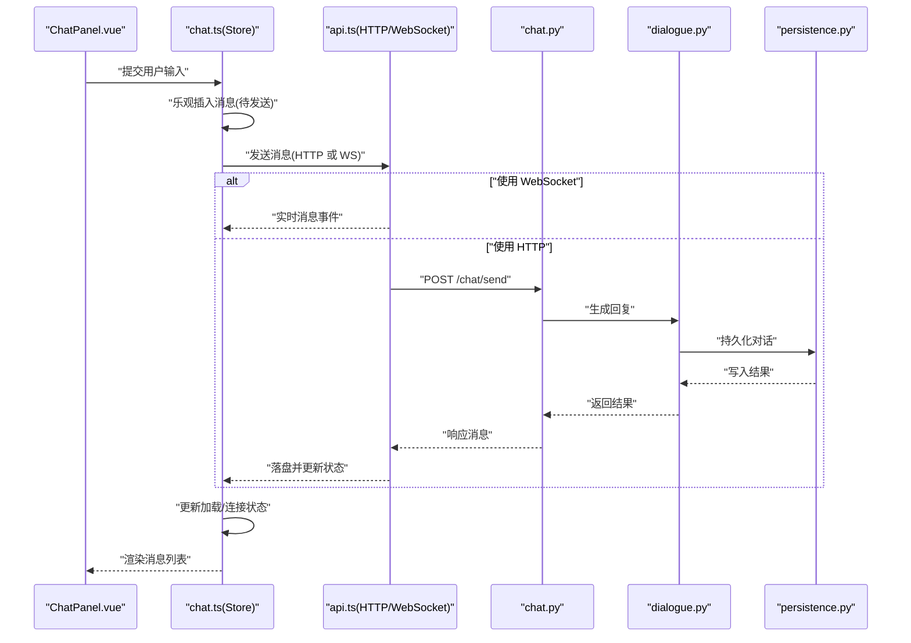
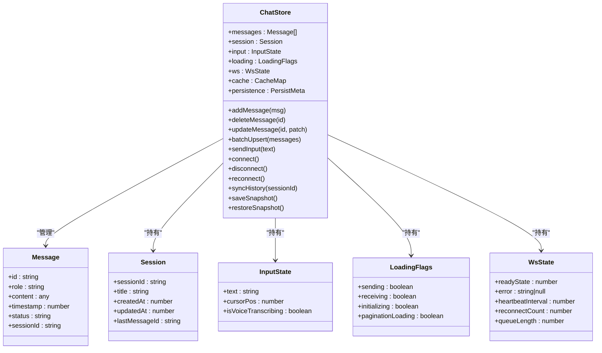
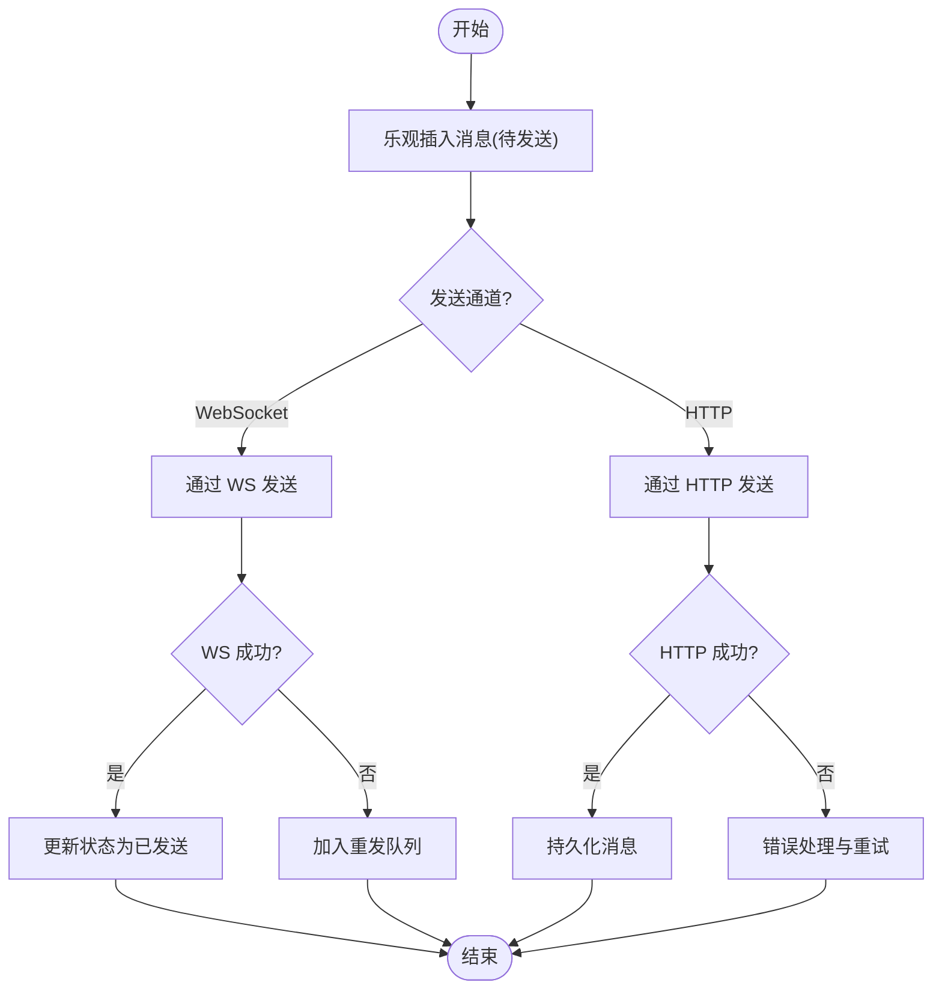
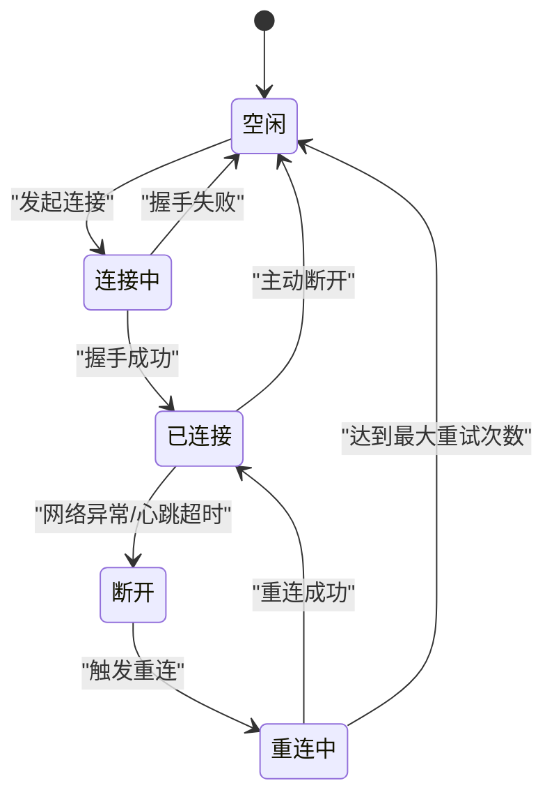
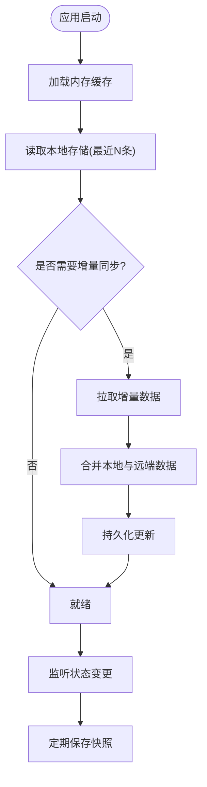
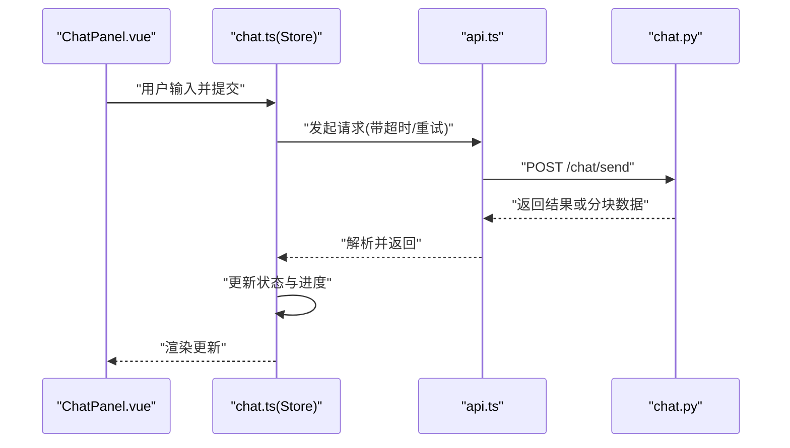
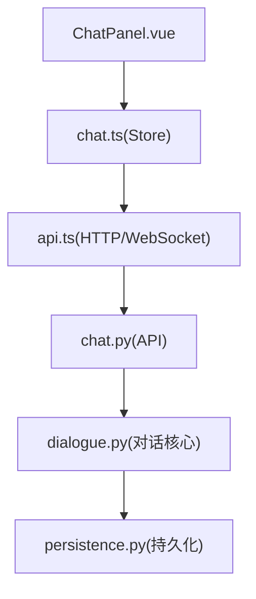

# 聊天状态管理

<cite>
**本文引用的文件**   
- [frontend/tourist-app/src/stores/chat.ts](file://frontend/tourist-app/src/stores/chat.ts)
- [frontend/tourist-app/src/services/api.ts](file://frontend/tourist-app/src/services/api.ts)
- [frontend/tourist-app/src/components/ChatPanel/ChatPanel.vue](file://frontend/tourist-app/src/components/ChatPanel/ChatPanel.vue)
- [frontend/tourist-app/src/views/ChatView.vue](file://frontend/tourist-app/src/views/ChatView.vue)
- [backend/app/api/chat.py](file://backend/app/api/chat.py)
- [backend/app/core/dialogue.py](file://backend/app/core/dialogue.py)
- [backend/app/services/persistence.py](file://backend/app/services/persistence.py)
</cite>

## 目录
1. [简介](#简介)
2. [项目结构](#项目结构)
3. [核心组件](#核心组件)
4. [架构总览](#架构总览)
5. [详细组件分析](#详细组件分析)
6. [依赖分析](#依赖分析)
7. [性能考虑](#性能考虑)
8. [故障排查指南](#故障排查指南)
9. [结论](#结论)
10. [附录](#附录)

## 简介
本文件聚焦于前端聊天状态管理的实现与最佳实践，围绕以下目标展开：
- 深入解析聊天 store 的状态结构设计：消息数组、会话状态、用户输入状态、加载状态等。
- 详细说明消息的增删改查（CRUD）与批量操作在状态层的设计与调用路径。
- 解释 WebSocket 连接状态管理：建立、断线重连、消息队列与错误恢复。
- 阐述消息持久化策略：本地存储、缓存机制与数据同步。
- 说明异步操作处理：API 调用、错误重试、超时处理与进度反馈。
- 提供状态订阅模式、性能优化技巧与调试方法，帮助开发者高效管理与维护复杂的聊天状态逻辑。

## 项目结构
本项目采用前后端分离架构，聊天功能涉及前端状态管理、UI 交互与后端 API 服务。关键文件如下：
- 前端状态层：stores/chat.ts
- 前端 UI 层：components/ChatPanel/ChatPanel.vue、views/ChatView.vue
- 前端网络层：services/api.ts
- 后端接口：app/api/chat.py
- 后端对话核心：app/core/dialogue.py
- 后端持久化：app/services/persistence.py

图表来源
- [frontend/tourist-app/src/components/ChatPanel/ChatPanel.vue](file://frontend/tourist-app/src/components/ChatPanel/ChatPanel.vue)
- [frontend/tourist-app/src/stores/chat.ts](file://frontend/tourist-app/src/stores/chat.ts)
- [frontend/tourist-app/src/services/api.ts](file://frontend/tourist-app/src/services/api.ts)
- [backend/app/api/chat.py](file://backend/app/api/chat.py)
- [backend/app/core/dialogue.py](file://backend/app/core/dialogue.py)
- [backend/app/services/persistence.py](file://backend/app/services/persistence.py)

章节来源
- [frontend/tourist-app/src/stores/chat.ts](file://frontend/tourist-app/src/stores/chat.ts)
- [frontend/tourist-app/src/services/api.ts](file://frontend/tourist-app/src/services/api.ts)
- [frontend/tourist-app/src/components/ChatPanel/ChatPanel.vue](file://frontend/tourist-app/src/components/ChatPanel/ChatPanel.vue)
- [frontend/tourist-app/src/views/ChatView.vue](file://frontend/tourist-app/src/views/ChatView.vue)
- [backend/app/api/chat.py](file://backend/app/api/chat.py)
- [backend/app/core/dialogue.py](file://backend/app/core/dialogue.py)
- [backend/app/services/persistence.py](file://backend/app/services/persistence.py)

## 核心组件
本节从状态设计、消息 CRUD、WebSocket 管理、持久化与异步处理五个维度进行拆解。

- 状态结构设计
  - 消息数组：用于承载当前会话的消息列表，支持追加、删除、更新与批量操作。
  - 会话状态：记录当前会话标识、历史会话列表、会话切换与清理策略。
  - 用户输入状态：保存用户输入文本、光标位置、语音转写临时内容等。
  - 加载状态：区分发送中、接收中、初始化加载、分页加载等状态位，便于 UI 展示与防抖。
  - 连接状态：记录 WebSocket 连接状态（空闲、连接中、已连接、断开、重连中）、错误码与最后心跳时间。
  - 队列与缓冲：未发送消息队列、重发队列、分片缓冲，保障弱网下的可靠性。

- 消息 CRUD 与批量操作
  - 添加：本地乐观插入，随后通过 API 或 WS 推送；失败时回滚并提示。
  - 删除：按 ID 移除单条或批量移除；必要时触发服务端同步。
  - 更新：编辑用户消息或标记系统消息为“完成”、“失败”等。
  - 批量：批量导入历史消息、批量标记已读、批量清理过期消息。

- WebSocket 连接管理
  - 建立：自动握手、鉴权参数注入、初始拉取历史消息。
  - 断线重连：指数退避、最大重试次数、抖动随机化避免雪崩。
  - 消息队列：离线消息入队，在线后顺序消费；保证幂等与去重。
  - 错误恢复：心跳检测、异常捕获、降级到 HTTP 轮询。

- 消息持久化策略
  - 本地存储：IndexedDB/LocalStorage 缓存最近 N 条消息与会话元信息。
  - 缓存机制：内存 LRU 缓存热点会话，减少重复请求。
  - 数据同步：增量同步（基于时间戳或游标），冲突解决策略（客户端优先或服务端权威）。

- 异步操作处理
  - API 调用：统一封装，带超时、重试、取消令牌。
  - 错误重试：可配置的重试策略与退避算法。
  - 进度反馈：长任务分块返回，实时更新 UI 进度。
  - 取消与节流：滚动加载节流、输入防抖、页面卸载取消请求。

章节来源
- [frontend/tourist-app/src/stores/chat.ts](file://frontend/tourist-app/src/stores/chat.ts)
- [frontend/tourist-app/src/services/api.ts](file://frontend/tourist-app/src/services/api.ts)
- [backend/app/api/chat.py](file://backend/app/api/chat.py)
- [backend/app/core/dialogue.py](file://backend/app/core/dialogue.py)
- [backend/app/services/persistence.py](file://backend/app/services/persistence.py)

## 架构总览
下图展示了从 UI 到 Store、网络层再到后端服务的完整链路，以及 WebSocket 与 HTTP 的协作关系。

图表来源
- [frontend/tourist-app/src/components/ChatPanel/ChatPanel.vue](file://frontend/tourist-app/src/components/ChatPanel/ChatPanel.vue)
- [frontend/tourist-app/src/stores/chat.ts](file://frontend/tourist-app/src/stores/chat.ts)
- [frontend/tourist-app/src/services/api.ts](file://frontend/tourist-app/src/services/api.ts)
- [backend/app/api/chat.py](file://backend/app/api/chat.py)
- [backend/app/core/dialogue.py](file://backend/app/core/dialogue.py)
- [backend/app/services/persistence.py](file://backend/app/services/persistence.py)

## 详细组件分析

### Store 状态模型与生命周期
- 状态字段建议
  - messages: 消息数组，包含 id、role、content、timestamp、status、sessionId 等。
  - session: 当前会话对象，含 sessionId、title、createdAt、updatedAt、lastMessageId。
  - input: 用户输入文本、光标位置、是否语音转写进行中。
  - loading: 发送中、接收中、初始化、分页加载等布尔位或枚举。
  - ws: 连接状态、错误码、心跳间隔、重连计数、队列长度。
  - cache: 内存缓存键值对，如会话摘要、最近消息索引。
  - persistence: 本地存储版本、同步游标、冲突标记。
- 生命周期钩子
  - onInit：拉取会话与历史消息，初始化 WebSocket。
  - onUnmount：关闭连接、清理定时器、持久化快照。
  - onSessionChange：切换会话时加载对应历史，清空输入与加载态。
  - onWsEvent：根据事件类型分发到不同处理器（新增、更新、删除、错误）。

图表来源
- [frontend/tourist-app/src/stores/chat.ts](file://frontend/tourist-app/src/stores/chat.ts)

章节来源
- [frontend/tourist-app/src/stores/chat.ts](file://frontend/tourist-app/src/stores/chat.ts)

### 消息 CRUB 与批量操作
- 添加消息
  - 乐观插入：立即将消息加入 messages 并设置 status=“pending”。
  - 发送：优先走 WebSocket；若不可用则降级到 HTTP。
  - 成功回调：更新 status=“sent”，同步持久化。
  - 失败回调：更新 status=“failed”，进入重发队列。
- 删除消息
  - 单条删除：按 id 过滤，必要时通知服务端删除。
  - 批量删除：按条件筛选（如会话内全部、过期消息），执行后同步。
- 更新消息
  - 编辑用户消息：限制仅允许特定角色与时限内编辑。
  - 系统消息状态更新：如“生成中”→“完成”或“失败”。
- 批量操作
  - 批量导入历史：分片上传，逐批落库，完成后合并排序。
  - 批量标记已读：减少 UI 闪烁，合并为一次持久化。

图表来源
- [frontend/tourist-app/src/stores/chat.ts](file://frontend/tourist-app/src/stores/chat.ts)
- [frontend/tourist-app/src/services/api.ts](file://frontend/tourist-app/src/services/api.ts)

章节来源
- [frontend/tourist-app/src/stores/chat.ts](file://frontend/tourist-app/src/stores/chat.ts)
- [frontend/tourist-app/src/services/api.ts](file://frontend/tourist-app/src/services/api.ts)

### WebSocket 连接状态管理
- 连接建立
  - 鉴权参数注入（token、会话标识）。
  - 监听 open、message、close、error 事件。
  - 初始化拉取历史消息（游标或时间范围）。
- 断线重连
  - 指数退避：基础间隔 × 2^重试次数 + 随机抖动。
  - 最大重试次数与上限保护，避免无限循环。
  - 心跳保活：定时 ping/pong，超时判定断开。
- 消息队列
  - 离线消息入队，按时间戳排序。
  - 在线后顺序消费，失败消息进入重发队列。
- 错误恢复
  - 捕获网络异常与服务端错误，分类处理。
  - 降级策略：当 WS 不可用时切换到 HTTP 轮询。

图表来源
- [frontend/tourist-app/src/stores/chat.ts](file://frontend/tourist-app/src/stores/chat.ts)
- [frontend/tourist-app/src/services/api.ts](file://frontend/tourist-app/src/services/api.ts)

章节来源
- [frontend/tourist-app/src/stores/chat.ts](file://frontend/tourist-app/src/stores/chat.ts)
- [frontend/tourist-app/src/services/api.ts](file://frontend/tourist-app/src/services/api.ts)

### 消息持久化策略
- 本地存储
  - IndexedDB 存储大消息与历史会话，LocalStorage 存储轻量元信息。
  - 版本控制与迁移脚本，确保数据结构演进兼容。
- 缓存机制
  - 内存 LRU 缓存最近会话与消息片段，提升渲染性能。
  - 失效策略：会话切换、内存压力、超时清理。
- 数据同步
  - 增量同步：基于游标或时间戳，避免全量拉取。
  - 冲突解决：以服务端为准，客户端合并差异。
  - 快照与恢复：定期保存快照，崩溃后可快速恢复。

图表来源
- [frontend/tourist-app/src/stores/chat.ts](file://frontend/tourist-app/src/stores/chat.ts)
- [backend/app/services/persistence.py](file://backend/app/services/persistence.py)

章节来源
- [frontend/tourist-app/src/stores/chat.ts](file://frontend/tourist-app/src/stores/chat.ts)
- [backend/app/services/persistence.py](file://backend/app/services/persistence.py)

### 异步操作处理
- API 调用封装
  - 统一拦截器：请求头注入、响应码处理、错误格式化。
  - 超时控制：默认超时时间与可配置项。
  - 取消令牌：页面卸载或路由切换时取消未完成请求。
- 错误重试
  - 可配置重试次数与退避策略。
  - 针对特定错误码（如 429、5xx）差异化处理。
- 进度反馈
  - 流式响应分块处理，逐步渲染。
  - 长任务进度上报，UI 显示百分比或步骤。
- 节流与防抖
  - 输入框防抖，减少频繁请求。
  - 滚动加载节流，避免过度渲染。

图表来源
- [frontend/tourist-app/src/components/ChatPanel/ChatPanel.vue](file://frontend/tourist-app/src/components/ChatPanel/ChatPanel.vue)
- [frontend/tourist-app/src/stores/chat.ts](file://frontend/tourist-app/src/stores/chat.ts)
- [frontend/tourist-app/src/services/api.ts](file://frontend/tourist-app/src/services/api.ts)
- [backend/app/api/chat.py](file://backend/app/api/chat.py)

章节来源
- [frontend/tourist-app/src/stores/chat.ts](file://frontend/tourist-app/src/stores/chat.ts)
- [frontend/tourist-app/src/services/api.ts](file://frontend/tourist-app/src/services/api.ts)
- [backend/app/api/chat.py](file://backend/app/api/chat.py)

## 依赖分析
- 组件耦合
  - ChatPanel 与 Store 解耦：通过 actions 与 computed 属性交互，降低视图与状态耦合度。
  - Store 与 api.ts 解耦：网络细节封装在 api.ts，Store 只关注业务语义。
- 外部依赖
  - WebSocket 客户端与 HTTP 客户端抽象，便于替换与测试。
  - 持久化模块抽象，支持多后端（IndexedDB、LocalStorage、服务端同步）。
- 潜在循环依赖
  - 避免 Store 直接引用 UI 组件，防止循环依赖。
  - 使用事件总线或中间件解耦跨模块通信。

图表来源
- [frontend/tourist-app/src/components/ChatPanel/ChatPanel.vue](file://frontend/tourist-app/src/components/ChatPanel/ChatPanel.vue)
- [frontend/tourist-app/src/stores/chat.ts](file://frontend/tourist-app/src/stores/chat.ts)
- [frontend/tourist-app/src/services/api.ts](file://frontend/tourist-app/src/services/api.ts)
- [backend/app/api/chat.py](file://backend/app/api/chat.py)
- [backend/app/core/dialogue.py](file://backend/app/core/dialogue.py)
- [backend/app/services/persistence.py](file://backend/app/services/persistence.py)

章节来源
- [frontend/tourist-app/src/stores/chat.ts](file://frontend/tourist-app/src/stores/chat.ts)
- [frontend/tourist-app/src/services/api.ts](file://frontend/tourist-app/src/services/api.ts)
- [backend/app/api/chat.py](file://backend/app/api/chat.py)
- [backend/app/core/dialogue.py](file://backend/app/core/dialogue.py)
- [backend/app/services/persistence.py](file://backend/app/services/persistence.py)

## 性能考虑
- 虚拟列表渲染：对长消息列表启用虚拟化，减少 DOM 节点数量。
- 增量更新：仅更新变化消息，避免整表重渲染。
- 批量操作合并：将多次小更新合并为一次批量更新。
- 懒加载历史：按需加载更早消息，避免一次性加载过多数据。
- 缓存热点数据：会话摘要、最近消息片段缓存，减少重复计算。
- 资源释放：页面卸载时关闭 WebSocket、清理定时器与监听器。

[本节为通用指导，不直接分析具体文件]

## 故障排查指南
- 常见问题定位
  - 连接失败：检查鉴权参数、网络可达性与服务端证书。
  - 消息丢失：核对本地存储版本与游标一致性，确认增量同步是否成功。
  - 重复消息：检查去重键（如 id 或签名），确认幂等性。
  - 性能问题：观察虚拟列表是否启用、是否存在整表重渲染。
- 日志与监控
  - 记录关键状态变更与网络事件，便于回溯。
  - 上报错误堆栈与上下文（会话 ID、时间戳、设备信息）。
- 调试技巧
  - 使用浏览器 DevTools 的 Network 与 Console 面板。
  - 模拟弱网与断网场景，验证重连与降级逻辑。
  - 打印状态快照，对比前后差异定位问题。

章节来源
- [frontend/tourist-app/src/stores/chat.ts](file://frontend/tourist-app/src/stores/chat.ts)
- [frontend/tourist-app/src/services/api.ts](file://frontend/tourist-app/src/services/api.ts)

## 结论
通过清晰的状态分层、可靠的 WebSocket 管理、完善的持久化策略与健壮的异步处理，聊天状态管理能够在复杂交互与弱网环境下保持稳定与高性能。建议持续优化虚拟列表、增量同步与缓存策略，并结合日志与监控完善可观测性，以提升用户体验与开发效率。

[本节为总结性内容，不直接分析具体文件]

## 附录
- 术语表
  - 乐观更新：先更新本地状态再等待服务端确认的策略。
  - 游标同步：基于游标的增量数据拉取方式。
  - 指数退避：重试间隔随重试次数呈指数增长的策略。
- 参考实现路径
  - 状态定义与操作方法：[frontend/tourist-app/src/stores/chat.ts](file://frontend/tourist-app/src/stores/chat.ts)
  - 网络封装与事件处理：[frontend/tourist-app/src/services/api.ts](file://frontend/tourist-app/src/services/api.ts)
  - 后端接口与对话核心：[backend/app/api/chat.py](file://backend/app/api/chat.py)、[backend/app/core/dialogue.py](file://backend/app/core/dialogue.py)
  - 持久化服务：[backend/app/services/persistence.py](file://backend/app/services/persistence.py)