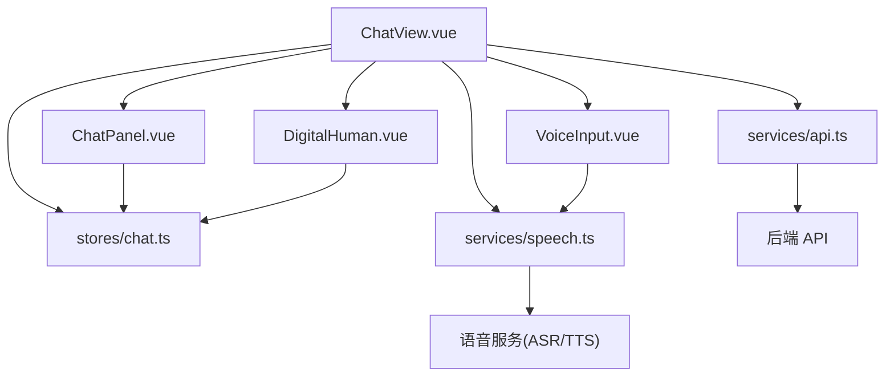
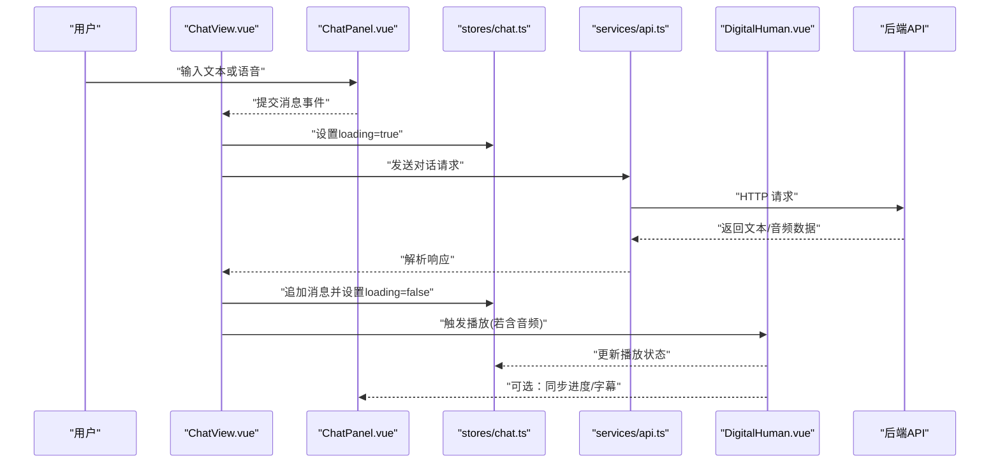
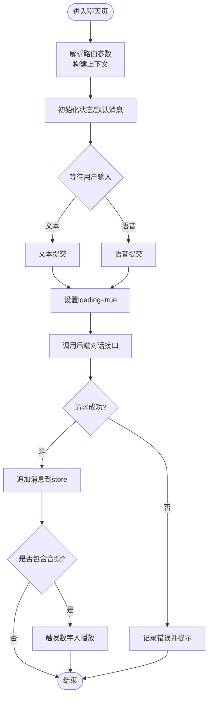
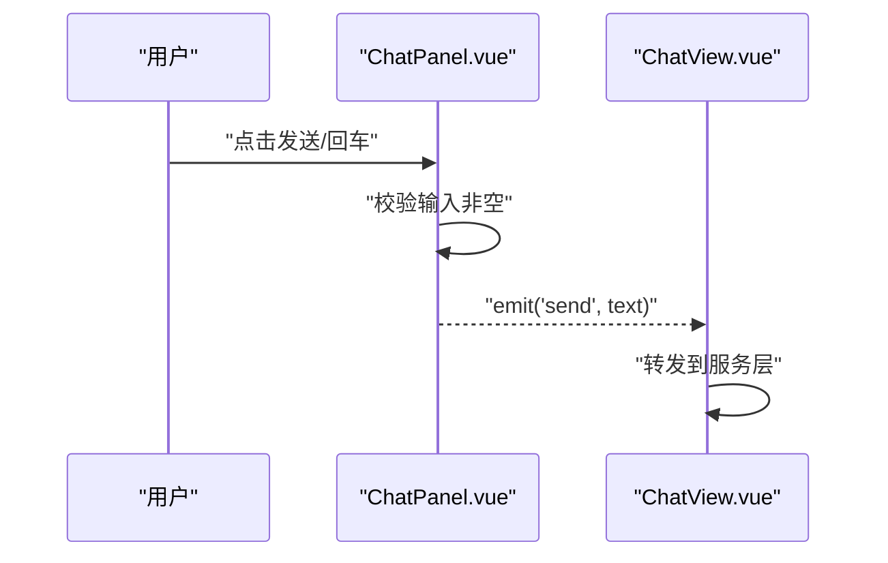
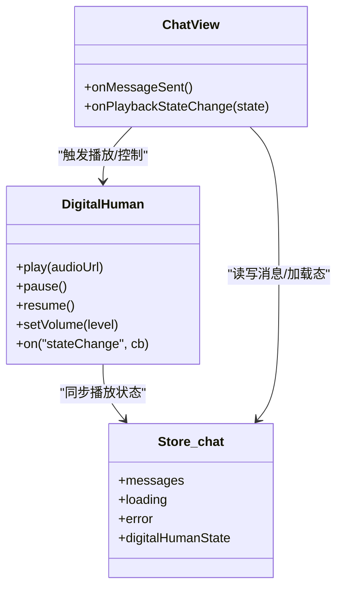
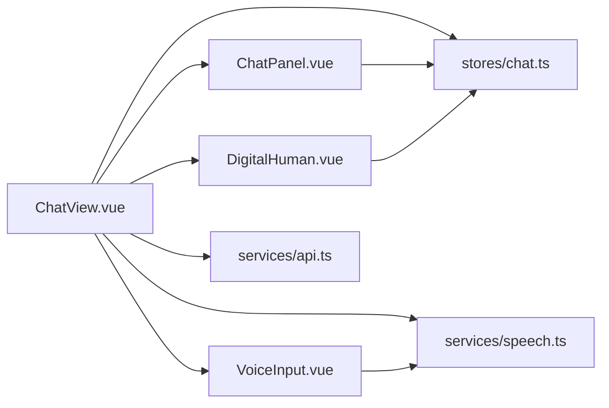

# 聊天视图组件 (ChatView)

<cite>
**本文引用的文件**   
- [ChatView.vue](file://frontend/tourist-app/src/views/ChatView.vue)
- [ChatPanel.vue](file://frontend/tourist-app/src/components/ChatPanel/ChatPanel.vue)
- [DigitalHuman.vue](file://frontend/tourist-app/src/components/DigitalHuman/DigitalHuman.vue)
- [VoiceInput.vue](file://frontend/tourist-app/src/components/VoiceInput/VoiceInput.vue)
- [chat.ts](file://frontend/tourist-app/src/stores/chat.ts)
- [api.ts](file://frontend/tourist-app/src/services/api.ts)
- [speech.ts](file://frontend/tourist-app/src/services/speech.ts)
</cite>

## 目录
1. [简介](#简介)
2. [项目结构](#项目结构)
3. [核心组件](#核心组件)
4. [架构总览](#架构总览)
5. [详细组件分析](#详细组件分析)
6. [依赖分析](#依赖分析)
7. [性能考虑](#性能考虑)
8. [故障排查指南](#故障排查指南)
9. [结论](#结论)
10. [附录](#附录)

## 简介
本文件面向开发者，系统化阐述前端“游客端”应用中的聊天视图组件 ChatView.vue 的架构与实现。内容覆盖：
- 页面布局与响应式适配
- 生命周期管理与路由参数处理
- 消息输入区域交互（文本、语音、发送）
- 数字人组件集成（音频播放控制、动画同步、状态同步）
- 错误处理策略、加载状态管理
- 使用示例与可配置项，便于扩展与二次开发

## 项目结构
ChatView 位于游客端前端应用中，围绕“对话面板 + 数字人展示 + 语音输入”三大模块组织。其关键文件如下：
- 视图层：ChatView.vue
- 子组件：ChatPanel.vue（消息列表与输入区）、DigitalHuman.vue（数字人渲染与播放控制）、VoiceInput.vue（语音采集与识别）
- 状态管理：stores/chat.ts（会话消息、加载态、错误等）
- 服务层：services/api.ts（后端接口调用）、services/speech.ts（语音识别/合成封装）

图表来源
- [ChatView.vue](file://frontend/tourist-app/src/views/ChatView.vue)
- [ChatPanel.vue](file://frontend/tourist-app/src/components/ChatPanel/ChatPanel.vue)
- [DigitalHuman.vue](file://frontend/tourist-app/src/components/DigitalHuman/DigitalHuman.vue)
- [VoiceInput.vue](file://frontend/tourist-app/src/components/VoiceInput/VoiceInput.vue)
- [chat.ts](file://frontend/tourist-app/src/stores/chat.ts)
- [api.ts](file://frontend/tourist-app/src/services/api.ts)
- [speech.ts](file://frontend/tourist-app/src/services/speech.ts)

章节来源
- [ChatView.vue](file://frontend/tourist-app/src/views/ChatView.vue)
- [ChatPanel.vue](file://frontend/tourist-app/src/components/ChatPanel/ChatPanel.vue)
- [DigitalHuman.vue](file://frontend/tourist-app/src/components/DigitalHuman/DigitalHuman.vue)
- [VoiceInput.vue](file://frontend/tourist-app/src/components/VoiceInput/VoiceInput.vue)
- [chat.ts](file://frontend/tourist-app/src/stores/chat.ts)
- [api.ts](file://frontend/tourist-app/src/services/api.ts)
- [speech.ts](file://frontend/tourist-app/src/services/speech.ts)

## 核心组件
- ChatView.vue：页面容器，负责整体布局、路由参数解析、全局加载与错误状态、子组件编排与事件分发。
- ChatPanel.vue：消息列表与输入区域，包含文本输入框、语音输入按钮、发送按钮；维护滚动到底部、消息气泡样式与交互反馈。
- DigitalHuman.vue：数字人渲染与播放控制，对接 TTS 音频流，驱动口型/表情动画，提供播放状态同步。
- VoiceInput.vue：语音采集与识别，支持录音权限、降噪、转写回调，将识别结果回传给 ChatView。
- stores/chat.ts：集中管理会话消息、加载态、错误信息、当前数字人状态等。
- services/api.ts：统一封装后端对话、知识检索、推荐等接口。
- services/speech.ts：封装 ASR/TTS 能力，提供识别与合成的 Promise 化接口。

章节来源
- [ChatView.vue](file://frontend/tourist-app/src/views/ChatView.vue)
- [ChatPanel.vue](file://frontend/tourist-app/src/components/ChatPanel/ChatPanel.vue)
- [DigitalHuman.vue](file://frontend/tourist-app/src/components/DigitalHuman/DigitalHuman.vue)
- [VoiceInput.vue](file://frontend/tourist-app/src/components/VoiceInput/VoiceInput.vue)
- [chat.ts](file://frontend/tourist-app/src/stores/chat.ts)
- [api.ts](file://frontend/tourist-app/src/services/api.ts)
- [speech.ts](file://frontend/tourist-app/src/services/speech.ts)

## 架构总览
ChatView 作为顶层视图，协调消息流与媒体流：
- 用户输入（文本/语音）→ ChatPanel → ChatView → chat.ts 状态更新 → api.ts 调用后端 → 返回回复 → 更新 chat.ts → ChatPanel 渲染新消息
- 数字人播放：TTS 音频 → DigitalHuman.vue 播放控制 → 动画同步 → 状态回写至 chat.ts
- 错误与加载：全局 loading/error 状态由 chat.ts 统一管理，UI 通过 watch/computed 响应式更新

图表来源
- [ChatView.vue](file://frontend/tourist-app/src/views/ChatView.vue)
- [ChatPanel.vue](file://frontend/tourist-app/src/components/ChatPanel/ChatPanel.vue)
- [DigitalHuman.vue](file://frontend/tourist-app/src/components/DigitalHuman/DigitalHuman.vue)
- [chat.ts](file://frontend/tourist-app/src/stores/chat.ts)
- [api.ts](file://frontend/tourist-app/src/services/api.ts)

## 详细组件分析

### ChatView.vue 组件分析
职责与边界
- 页面布局：左右分栏（移动端堆叠），左侧为消息面板，右侧为数字人展示区
- 生命周期：在挂载时初始化必要资源（如权限检查、默认数字人配置），在卸载时释放资源（停止播放、清理监听）
- 路由参数：从路由查询中读取场景/目的地/偏好等参数，用于构造初始上下文或发起首轮对话
- 状态编排：订阅 chat.ts 的状态变化，驱动 UI 更新与数字人行为
- 事件分发：聚合来自 ChatPanel 与 VoiceInput 的事件，统一调度到服务层与状态层

交互流程（发送消息）

图表来源
- [ChatView.vue](file://frontend/tourist-app/src/views/ChatView.vue)
- [chat.ts](file://frontend/tourist-app/src/stores/chat.ts)
- [api.ts](file://frontend/tourist-app/src/services/api.ts)

章节来源
- [ChatView.vue](file://frontend/tourist-app/src/views/ChatView.vue)
- [chat.ts](file://frontend/tourist-app/src/stores/chat.ts)
- [api.ts](file://frontend/tourist-app/src/services/api.ts)

### 消息输入区域设计（ChatPanel.vue）
功能要点
- 文本输入框：支持多行自适应高度、回车发送、禁用态（loading 时）
- 语音输入按钮：长按录音、松开识别、权限检测与引导
- 发送按钮：点击发送文本，禁用态与反馈（旋转图标/文案）
- 用户反馈：输入为空校验、网络异常提示、发送中骨架屏

交互时序

图表来源
- [ChatPanel.vue](file://frontend/tourist-app/src/components/ChatPanel/ChatPanel.vue)
- [ChatView.vue](file://frontend/tourist-app/src/views/ChatView.vue)

章节来源
- [ChatPanel.vue](file://frontend/tourist-app/src/components/ChatPanel/ChatPanel.vue)
- [ChatView.vue](file://frontend/tourist-app/src/views/ChatView.vue)

### 语音输入（VoiceInput.vue）
能力说明
- 录音权限检测与授权引导
- 录音时长限制与防抖
- 实时波形可视化（可选）
- 识别结果回调与错误重试

与 ChatView 协作
- 识别完成后，将文本回传至 ChatView，走与文本相同的发送流程
- 失败时上报错误，ChatView 统一提示

章节来源
- [VoiceInput.vue](file://frontend/tourist-app/src/components/VoiceInput/VoiceInput.vue)
- [speech.ts](file://frontend/tourist-app/src/services/speech.ts)
- [ChatView.vue](file://frontend/tourist-app/src/views/ChatView.vue)

### 数字人集成（DigitalHuman.vue）
集成方式
- 接收 ChatView 下发的音频数据或 URL，进行播放控制
- 播放状态（playing/paused/ended）同步至 chat.ts，供 UI 显示
- 动画与音频节拍联动（基于时间轴或 Web Audio API 分析）
- 支持暂停/继续、音量调节、字幕/高亮词（可选）

状态同步

图表来源
- [DigitalHuman.vue](file://frontend/tourist-app/src/components/DigitalHuman/DigitalHuman.vue)
- [chat.ts](file://frontend/tourist-app/src/stores/chat.ts)
- [ChatView.vue](file://frontend/tourist-app/src/views/ChatView.vue)

章节来源
- [DigitalHuman.vue](file://frontend/tourist-app/src/components/DigitalHuman/DigitalHuman.vue)
- [chat.ts](file://frontend/tourist-app/src/stores/chat.ts)
- [ChatView.vue](file://frontend/tourist-app/src/views/ChatView.vue)

### 状态管理（stores/chat.ts）
职责
- 消息列表：按角色分类存储，支持追加、清空、分页加载
- 加载与错误：统一的 loading/error 标志位，避免重复请求
- 数字人状态：播放、暂停、结束、音量等
- 副作用：在消息变更时自动滚动到底部、触发数字人播放

章节来源
- [chat.ts](file://frontend/tourist-app/src/stores/chat.ts)

### 服务层（services/api.ts / services/speech.ts）
职责
- api.ts：封装 HTTP 请求，统一错误码映射、超时与重试策略
- speech.ts：封装 ASR/TTS 调用，提供 Promise 化接口与错误降级

章节来源
- [api.ts](file://frontend/tourist-app/src/services/api.ts)
- [speech.ts](file://frontend/tourist-app/src/services/speech.ts)

## 依赖分析
组件间依赖关系清晰，遵循单向数据流与事件总线模式：
- ChatView 依赖 ChatPanel、DigitalHuman、VoiceInput、chat.ts、api.ts、speech.ts
- ChatPanel 依赖 chat.ts（读/写消息）
- DigitalHuman 依赖 chat.ts（写播放状态）
- VoiceInput 依赖 speech.ts（识别）

图表来源
- [ChatView.vue](file://frontend/tourist-app/src/views/ChatView.vue)
- [ChatPanel.vue](file://frontend/tourist-app/src/components/ChatPanel/ChatPanel.vue)
- [DigitalHuman.vue](file://frontend/tourist-app/src/components/DigitalHuman/DigitalHuman.vue)
- [VoiceInput.vue](file://frontend/tourist-app/src/components/VoiceInput/VoiceInput.vue)
- [chat.ts](file://frontend/tourist-app/src/stores/chat.ts)
- [api.ts](file://frontend/tourist-app/src/services/api.ts)
- [speech.ts](file://frontend/tourist-app/src/services/speech.ts)

章节来源
- [ChatView.vue](file://frontend/tourist-app/src/views/ChatView.vue)
- [ChatPanel.vue](file://frontend/tourist-app/src/components/ChatPanel/ChatPanel.vue)
- [DigitalHuman.vue](file://frontend/tourist-app/src/components/DigitalHuman/DigitalHuman.vue)
- [VoiceInput.vue](file://frontend/tourist-app/src/components/VoiceInput/VoiceInput.vue)
- [chat.ts](file://frontend/tourist-app/src/stores/chat.ts)
- [api.ts](file://frontend/tourist-app/src/services/api.ts)
- [speech.ts](file://frontend/tourist-app/src/services/speech.ts)

## 性能考虑
- 消息列表虚拟化：当消息量较大时，采用虚拟滚动减少 DOM 节点数量
- 图片/模型懒加载：数字人模型与头像按需加载，首屏更快
- 音频流式播放：优先使用流式传输，降低首包延迟
- 防抖与节流：输入框与滚动事件去抖，避免频繁重排
- 并发控制：同一时刻仅允许一次对话请求，避免竞态条件

[本节为通用指导，不直接分析具体文件]

## 故障排查指南
常见问题与定位步骤
- 无法发送消息
  - 检查 loading 状态是否被阻塞
  - 查看 api.ts 的错误码映射与重试逻辑
  - 确认路由参数是否正确传入上下文
- 语音识别失败
  - 检查浏览器麦克风权限与 HTTPS 环境
  - 查看 speech.ts 的错误分支与降级策略
- 数字人不播放或不同步
  - 确认音频数据格式与 URL 可达性
  - 检查 DigitalHuman 的播放状态是否与 store 同步
  - 观察控制台是否有跨域或解码错误

章节来源
- [api.ts](file://frontend/tourist-app/src/services/api.ts)
- [speech.ts](file://frontend/tourist-app/src/services/speech.ts)
- [chat.ts](file://frontend/tourist-app/src/stores/chat.ts)
- [DigitalHuman.vue](file://frontend/tourist-app/src/components/DigitalHuman/DigitalHuman.vue)
- [ChatView.vue](file://frontend/tourist-app/src/views/ChatView.vue)

## 结论
ChatView 以清晰的职责划分与良好的状态管理，实现了“文本/语音输入 + 数字人播报”的完整聊天体验。通过模块化设计与响应式布局，既保证了桌面端的沉浸感，也兼顾了移动端的可用性。建议后续在消息虚拟化、流式播放与错误自愈方面持续优化，以提升大规模对话场景下的稳定性与流畅度。

[本节为总结性内容，不直接分析具体文件]

## 附录

### 使用示例与自定义配置
- 基本用法
  - 在路由中携带场景参数，例如：?scene=city_guide&dest=西湖
  - 首次进入页面会自动根据参数生成开场白
- 自定义数字人
  - 通过 props 或环境变量切换数字人模型与皮肤
  - 调整音量、字幕开关、动画强度等
- 接入新的语音服务
  - 在 speech.ts 中新增适配器，保持对外接口一致
  - 在 VoiceInput.vue 中替换识别入口
- 扩展输入控件
  - 在 ChatPanel.vue 中增加快捷短语或图片上传
  - 通过事件机制与 ChatView 解耦

章节来源
- [ChatView.vue](file://frontend/tourist-app/src/views/ChatView.vue)
- [ChatPanel.vue](file://frontend/tourist-app/src/components/ChatPanel/ChatPanel.vue)
- [DigitalHuman.vue](file://frontend/tourist-app/src/components/DigitalHuman/DigitalHuman.vue)
- [VoiceInput.vue](file://frontend/tourist-app/src/components/VoiceInput/VoiceInput.vue)
- [speech.ts](file://frontend/tourist-app/src/services/speech.ts)