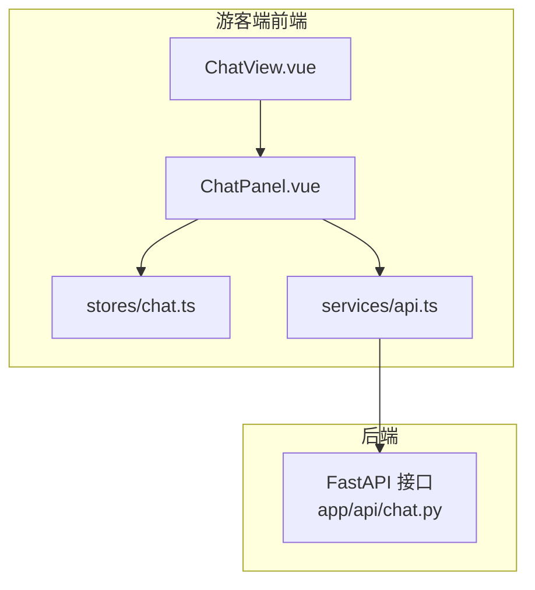
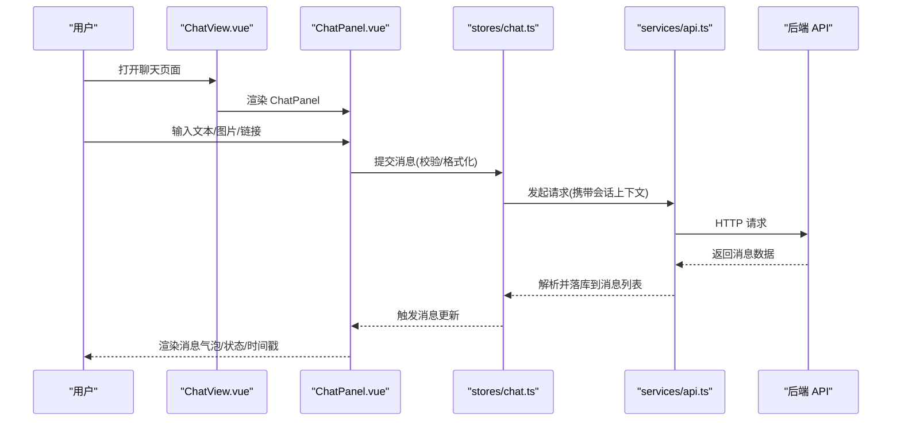
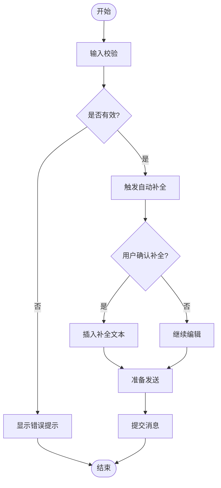
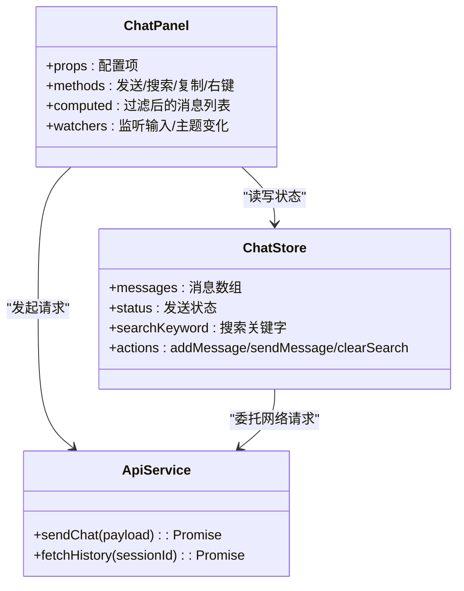

# 聊天面板组件 (ChatPanel)

<cite>
**本文引用的文件**   
- [ChatPanel.vue](file://frontend/tourist-app/src/components/ChatPanel/ChatPanel.vue)
- [chat.ts](file://frontend/tourist-app/src/stores/chat.ts)
- [api.ts](file://frontend/tourist-app/src/services/api.ts)
- [ChatView.vue](file://frontend/tourist-app/src/views/ChatView.vue)
</cite>

## 目录
1. [简介](#简介)
2. [项目结构](#项目结构)
3. [核心组件](#核心组件)
4. [架构总览](#架构总览)
5. [详细组件分析](#详细组件分析)
6. [依赖分析](#依赖分析)
7. [性能考虑](#性能考虑)
8. [故障排查指南](#故障排查指南)
9. [结论](#结论)
10. [附录](#附录)

## 简介
本文件面向开发者，系统化阐述聊天面板组件 ChatPanel 的设计与实现。内容覆盖消息展示与渲染机制（含虚拟滚动、多类型消息格式化、时间戳智能显示）、用户输入处理流程（验证、自动补全、表情符号、快捷键）、气泡视觉设计（用户/AI 样式、头像、状态指示器）、搜索与复制粘贴、上下文菜单与右键操作，以及样式定制与主题切换方案。文档同时提供架构图、时序图与流程图，帮助快速理解并扩展该组件。

## 项目结构
前端采用 Vue 单页应用组织方式，ChatPanel 位于 tourist-app 的 components 目录，通过 store 管理聊天状态，并通过 services 层调用后端 API。视图层由 ChatView 组合 ChatPanel 与其他功能模块。

图表来源
- [ChatView.vue](file://frontend/tourist-app/src/views/ChatView.vue)
- [ChatPanel.vue](file://frontend/tourist-app/src/components/ChatPanel/ChatPanel.vue)
- [chat.ts](file://frontend/tourist-app/src/stores/chat.ts)
- [api.ts](file://frontend/tourist-app/src/services/api.ts)

章节来源
- [ChatPanel.vue](file://frontend/tourist-app/src/components/ChatPanel/ChatPanel.vue)
- [chat.ts](file://frontend/tourist-app/src/stores/chat.ts)
- [api.ts](file://frontend/tourist-app/src/services/api.ts)
- [ChatView.vue](file://frontend/tourist-app/src/views/ChatView.vue)

## 核心组件
- ChatPanel：负责消息列表渲染、输入交互、搜索过滤、快捷操作与主题适配。
- chat store：集中管理消息集合、发送状态、加载态、错误信息、搜索关键字等。
- api 服务：封装与后端的 HTTP 请求，统一错误处理与重试策略。
- ChatView：页面级容器，组合 ChatPanel 与数字人、语音输入等子模块。

章节来源
- [ChatPanel.vue](file://frontend/tourist-app/src/components/ChatPanel/ChatPanel.vue)
- [chat.ts](file://frontend/tourist-app/src/stores/chat.ts)
- [api.ts](file://frontend/tourist-app/src/services/api.ts)
- [ChatView.vue](file://frontend/tourist-app/src/views/ChatView.vue)

## 架构总览
ChatPanel 作为 UI 层，将用户输入事件转化为 store 动作，触发 API 调用；后端返回流式或一次性响应后，store 更新消息状态，ChatPanel 基于 diff 高效重渲染。

图表来源
- [ChatPanel.vue](file://frontend/tourist-app/src/components/ChatPanel/ChatPanel.vue)
- [chat.ts](file://frontend/tourist-app/src/stores/chat.ts)
- [api.ts](file://frontend/tourist-app/src/services/api.ts)

## 详细组件分析

### 消息展示与渲染机制
- 消息列表与虚拟滚动
  - 使用虚拟滚动技术仅渲染可视区域的消息项，减少 DOM 节点数量，提升长列表滚动性能。
  - 支持动态高度估算与增量更新，避免整表重排。
- 多类型消息格式化
  - 文本：支持基础富文本标记（如换行、粗体、代码片段）。
  - 图片：自适应尺寸、懒加载与占位骨架屏。
  - 链接：自动识别 URL，生成可点击卡片，支持预览缩略图。
  - 结构化数据：表格/列表在移动端进行横向滚动或折叠展示。
- 时间戳智能显示
  - 相对时间（刚刚、几分钟前）与绝对时间（YYYY-MM-DD HH:mm）根据上下文切换。
  - 同一天内连续消息合并显示时间，减少冗余。
- 渲染优化
  - 对消息项使用稳定 key，结合局部更新策略。
  - 图片与外部资源按需加载，避免首屏阻塞。

章节来源
- [ChatPanel.vue](file://frontend/tourist-app/src/components/ChatPanel/ChatPanel.vue)

### 用户输入处理流程
- 输入验证
  - 非空检查、长度限制、敏感词过滤（可选）、URL/图片格式校验。
  - 实时反馈错误提示，阻止非法提交。
- 自动补全
  - 基于历史对话与常用短语提供候选项，支持键盘上下选择与回车确认。
  - 补全结果可插入光标位置，保留用户编辑权。
- 表情符号支持
  - 内置表情面板，支持分类检索与最近使用排序。
  - 表情以 Unicode 字符插入输入框，兼容后端存储与回显。
- 快捷键操作
  - Enter 发送，Shift+Enter 换行，Ctrl/Cmd+K 聚焦搜索，Esc 关闭弹窗/面板。
  - 自定义快捷键映射，避免与浏览器默认冲突。

图表来源
- [ChatPanel.vue](file://frontend/tourist-app/src/components/ChatPanel/ChatPanel.vue)
- [chat.ts](file://frontend/tourist-app/src/stores/chat.ts)

章节来源
- [ChatPanel.vue](file://frontend/tourist-app/src/components/ChatPanel/ChatPanel.vue)
- [chat.ts](file://frontend/tourist-app/src/stores/chat.ts)

### 消息气泡视觉设计与状态指示器
- 用户消息 vs AI 回复
  - 用户消息：右侧对齐，主色调背景，圆角较大，附带用户头像。
  - AI 回复：左侧对齐，浅色背景，带品牌标识或机器人头像。
- 头像显示
  - 支持本地与远程头像，失败时降级为默认图标。
  - 头像尺寸随屏幕密度自适应。
- 消息状态指示器
  - 发送中：旋转加载动画。
  - 成功：对勾图标。
  - 失败：感叹号图标，点击可重试。
- 可访问性
  - 语义化标签与 aria 属性，确保读屏软件正确朗读。

章节来源
- [ChatPanel.vue](file://frontend/tourist-app/src/components/ChatPanel/ChatPanel.vue)

### 搜索、复制粘贴、上下文菜单与右键操作
- 消息搜索
  - 支持按关键词过滤消息列表，高亮匹配片段。
  - 支持按日期范围与消息类型筛选。
- 复制与粘贴
  - 一键复制消息内容，支持富文本与纯文本模式。
  - 粘贴图片自动上传并插入消息。
- 上下文菜单与右键操作
  - 右键菜单包含：复制、删除、转发、收藏、查看来源等。
  - 长按（移动端）弹出相同操作集。
- 无障碍与兼容性
  - 键盘导航支持 Tab/Shift+Tab 切换菜单项。
  - 移动端手势与触摸友好。

章节来源
- [ChatPanel.vue](file://frontend/tourist-app/src/components/ChatPanel/ChatPanel.vue)

### 样式定制与主题切换
- 样式定制
  - 通过 CSS 变量控制颜色、字号、间距、圆角与阴影。
  - 提供主题配置对象，覆盖默认样式。
- 主题切换
  - 支持明/暗主题与品牌主题，运行时切换无需刷新。
  - 主题持久化至本地存储，下次进入保持偏好。
- 组件级样式隔离
  - 使用 scoped 样式与命名空间，避免全局污染。
  - 提供插槽与自定义类名，便于二次开发。

章节来源
- [ChatPanel.vue](file://frontend/tourist-app/src/components/ChatPanel/ChatPanel.vue)

## 依赖分析
ChatPanel 依赖 store 与 API 服务，形成清晰的前端分层。

图表来源
- [ChatPanel.vue](file://frontend/tourist-app/src/components/ChatPanel/ChatPanel.vue)
- [chat.ts](file://frontend/tourist-app/src/stores/chat.ts)
- [api.ts](file://frontend/tourist-app/src/services/api.ts)

章节来源
- [ChatPanel.vue](file://frontend/tourist-app/src/components/ChatPanel/ChatPanel.vue)
- [chat.ts](file://frontend/tourist-app/src/stores/chat.ts)
- [api.ts](file://frontend/tourist-app/src/services/api.ts)

## 性能考虑
- 虚拟滚动：仅渲染可视区域，降低内存占用与重绘成本。
- 增量更新：基于消息 ID 的细粒度 diff，避免整表重排。
- 资源懒加载：图片与外部资源按需加载，减少首屏压力。
- 防抖与节流：输入与搜索防抖，减少不必要的计算与请求。
- 缓存策略：历史消息与常用短语缓存，提高响应速度。

[本节为通用指导，不直接分析具体文件]

## 故障排查指南
- 常见问题
  - 消息未渲染：检查 store 中消息数组是否为空或 key 不稳定。
  - 图片无法显示：确认 URL 可达与跨域策略，检查懒加载逻辑。
  - 发送失败：查看 API 错误码与重试策略，必要时手动重试。
  - 搜索无结果：确认过滤条件与高亮逻辑是否正确。
- 调试建议
  - 启用控制台日志与网络面板监控。
  - 使用浏览器开发者工具检查 DOM 结构与样式覆盖。
  - 针对移动端，使用设备模拟与触控事件调试。

章节来源
- [ChatPanel.vue](file://frontend/tourist-app/src/components/ChatPanel/ChatPanel.vue)
- [chat.ts](file://frontend/tourist-app/src/stores/chat.ts)
- [api.ts](file://frontend/tourist-app/src/services/api.ts)

## 结论
ChatPanel 通过虚拟滚动、类型化渲染与完善的输入处理，提供了高性能且易用的聊天界面。其清晰的依赖分层与可扩展的主题系统，使开发者能够快速定制外观与行为。建议在后续迭代中持续优化长列表性能与无障碍体验，并完善错误恢复与重试机制。

[本节为总结性内容，不直接分析具体文件]

## 附录
- 相关入口与集成
  - 页面集成：ChatView 组合 ChatPanel 与数字人、语音输入等模块。
  - 状态管理：chat store 统一管理消息与交互状态。
  - 服务层：api.ts 封装所有与后端的通信。

章节来源
- [ChatView.vue](file://frontend/tourist-app/src/views/ChatView.vue)
- [chat.ts](file://frontend/tourist-app/src/stores/chat.ts)
- [api.ts](file://frontend/tourist-app/src/services/api.ts)