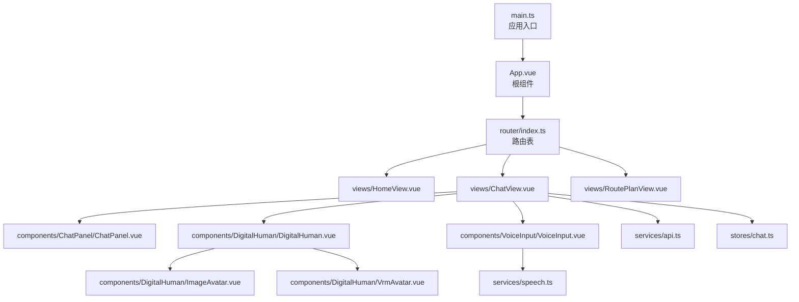
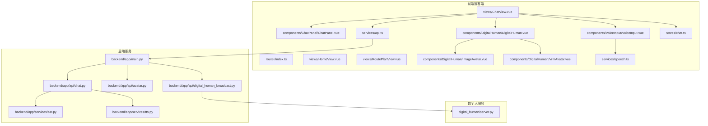
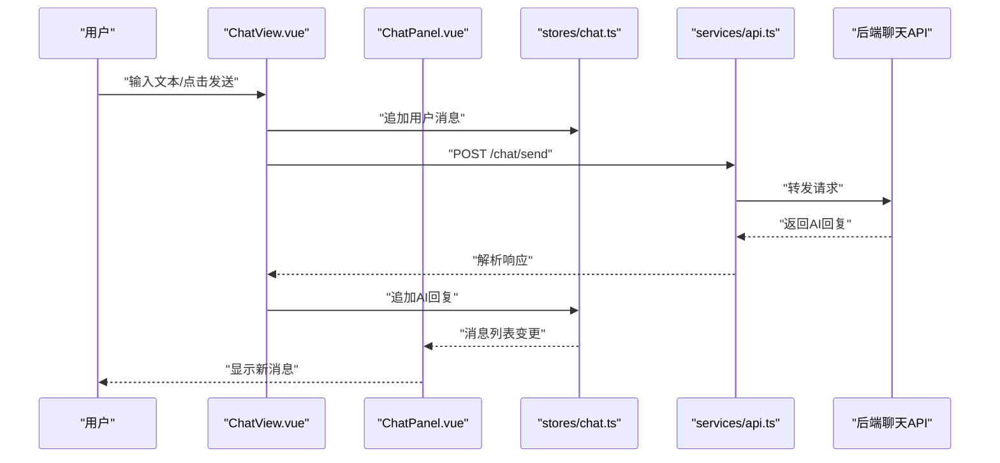
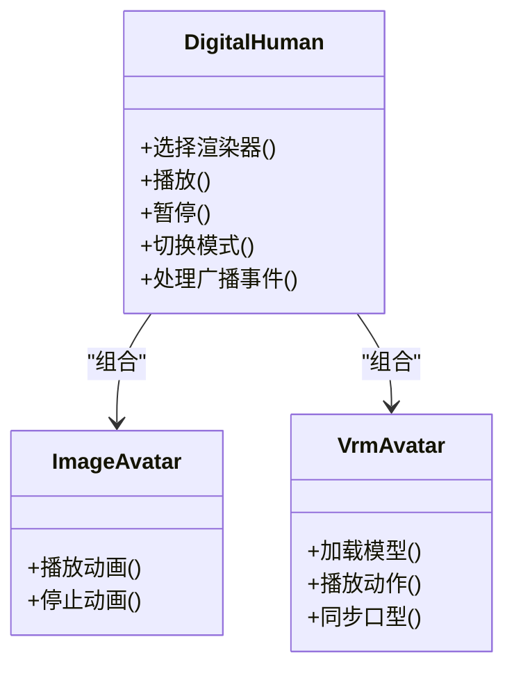
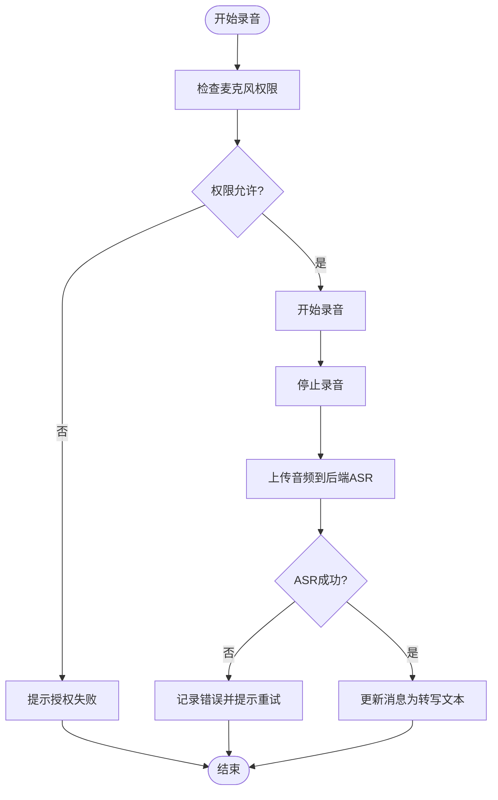
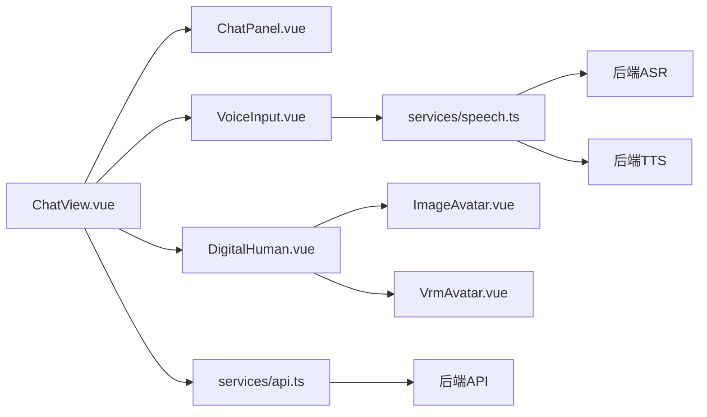

# 游客端应用 (Tourist App)

<cite>
**本文引用的文件**   
- [frontend/tourist-app/src/main.ts](file://frontend/tourist-app/src/main.ts)
- [frontend/tourist-app/src/App.vue](file://frontend/tourist-app/src/App.vue)
- [frontend/tourist-app/src/router/index.ts](file://frontend/tourist-app/src/router/index.ts)
- [frontend/tourist-app/src/views/HomeView.vue](file://frontend/tourist-app/src/views/HomeView.vue)
- [frontend/tourist-app/src/views/ChatView.vue](file://frontend/tourist-app/src/views/ChatView.vue)
- [frontend/tourist-app/src/views/RoutePlanView.vue](file://frontend/tourist-app/src/views/RoutePlanView.vue)
- [frontend/tourist-app/src/components/ChatPanel/ChatPanel.vue](file://frontend/tourist-app/src/components/ChatPanel/ChatPanel.vue)
- [frontend/tourist-app/src/components/DigitalHuman/DigitalHuman.vue](file://frontend/tourist-app/src/components/DigitalHuman/DigitalHuman.vue)
- [frontend/tourist-app/src/components/DigitalHuman/ImageAvatar.vue](file://frontend/tourist-app/src/components/DigitalHuman/ImageAvatar.vue)
- [frontend/tourist-app/src/components/DigitalHuman/VrmAvatar.vue](file://frontend/tourist-app/src/components/DigitalHuman/VrmAvatar.vue)
- [frontend/tourist-app/src/components/VoiceInput/VoiceInput.vue](file://frontend/tourist-app/src/components/VoiceInput/VoiceInput.vue)
- [frontend/tourist-app/src/services/api.ts](file://frontend/tourist-app/src/services/api.ts)
- [frontend/tourist-app/src/services/speech.ts](file://frontend/tourist-app/src/services/speech.ts)
- [frontend/tourist-app/src/stores/chat.ts](file://frontend/tourist-app/src/stores/chat.ts)
- [backend/app/main.py](file://backend/app/main.py)
- [backend/app/api/chat.py](file://backend/app/api/chat.py)
- [backend/app/api/avatar.py](file://backend/app/api/avatar.py)
- [backend/app/api/digital_human_broadcast.py](file://backend/app/app/api/digital_human_broadcast.py)
- [backend/app/services/asr.py](file://backend/app/services/asr.py)
- [backend/app/services/tts.py](file://backend/app/services/tts.py)
- [digital_human/server.py](file://digital_human/server.py)
</cite>

## 目录
1. [简介](#简介)
2. [项目结构](#项目结构)
3. [核心组件](#核心组件)
4. [架构总览](#架构总览)
5. [详细组件分析](#详细组件分析)
6. [依赖关系分析](#依赖关系分析)
7. [性能考虑](#性能考虑)
8. [故障排查指南](#故障排查指南)
9. [结论](#结论)
10. [附录](#附录)

## 简介
本文件面向SmartTour游客端应用的开发者与实施人员，系统性阐述基于Vue 3 + TypeScript的前端实现。文档覆盖应用初始化、路由设计、页面与组件架构、状态管理、智能对话界面、数字人交互、语音输入处理、路线规划展示、前后端API集成、实时通信机制（WebSocket）、错误处理与用户反馈、响应式设计与移动端适配、性能优化与用户体验增强等主题，并提供可追溯的代码片段路径与可视化图示，帮助快速理解与扩展功能。

## 项目结构
游客端位于 frontend/tourist-app 目录下，采用按功能域组织的目录结构：
- src/main.ts：应用入口，负责创建Vue应用实例、挂载根组件、注册插件与全局配置
- src/App.vue：根组件，承载全局布局与路由出口
- src/router/index.ts：路由定义，包含首页、聊天页、路线规划页等
- src/views：页面级视图组件，如 HomeView、ChatView、RoutePlanView
- src/components：通用业务组件，包括 ChatPanel、DigitalHuman（含 ImageAvatar、VrmAvatar）、VoiceInput
- src/services：网络与能力服务封装，api.ts 提供HTTP请求封装，speech.ts 封装语音识别与合成
- src/stores：状态管理模块，chat.ts 管理对话消息与相关状态
- public：静态资源，如 avatars、models 等

图表来源
- [frontend/tourist-app/src/main.ts](file://frontend/tourist-app/src/main.ts)
- [frontend/tourist-app/src/App.vue](file://frontend/tourist-app/src/App.vue)
- [frontend/tourist-app/src/router/index.ts](file://frontend/tourist-app/src/router/index.ts)
- [frontend/tourist-app/src/views/ChatView.vue](file://frontend/tourist-app/src/views/ChatView.vue)
- [frontend/tourist-app/src/components/ChatPanel/ChatPanel.vue](file://frontend/tourist-app/src/components/ChatPanel/ChatPanel.vue)
- [frontend/tourist-app/src/components/DigitalHuman/DigitalHuman.vue](file://frontend/tourist-app/src/components/DigitalHuman/DigitalHuman.vue)
- [frontend/tourist-app/src/components/DigitalHuman/ImageAvatar.vue](file://frontend/tourist-app/src/components/DigitalHuman/ImageAvatar.vue)
- [frontend/tourist-app/src/components/DigitalHuman/VrmAvatar.vue](file://frontend/tourist-app/src/components/DigitalHuman/VrmAvatar.vue)
- [frontend/tourist-app/src/components/VoiceInput/VoiceInput.vue](file://frontend/tourist-app/src/components/VoiceInput/VoiceInput.vue)
- [frontend/tourist-app/src/services/api.ts](file://frontend/tourist-app/src/services/api.ts)
- [frontend/tourist-app/src/services/speech.ts](file://frontend/tourist-app/src/services/speech.ts)
- [frontend/tourist-app/src/stores/chat.ts](file://frontend/tourist-app/src/stores/chat.ts)

章节来源
- [frontend/tourist-app/src/main.ts](file://frontend/tourist-app/src/main.ts)
- [frontend/tourist-app/src/App.vue](file://frontend/tourist-app/src/App.vue)
- [frontend/tourist-app/src/router/index.ts](file://frontend/tourist-app/src/router/index.ts)

## 核心组件
本节聚焦游客端的关键组件及其职责边界与交互方式。

- 应用入口与根组件
  - main.ts：创建并启动Vue应用，挂载到DOM，加载全局样式与插件
  - App.vue：作为布局容器，提供导航栏、侧边栏或底部Tab等框架，并通过 <router-view/> 渲染当前路由对应的页面

- 路由系统
  - router/index.ts：集中定义路由映射，包括首页、聊天、路线规划等；支持懒加载与路由守卫（如需权限控制）

- 页面视图
  - HomeView.vue：欢迎页或功能入口，引导用户进入聊天或路线规划
  - ChatView.vue：智能对话主界面，聚合聊天面板、数字人与语音输入
  - RoutePlanView.vue：路线规划展示页，呈现推荐路线、节点信息与交互操作

- 通用组件
  - ChatPanel.vue：消息列表、气泡样式、滚动定位、发送与接收消息的UI
  - DigitalHuman.vue：数字人容器，协调图像/VRM两种渲染模式与播放控制
  - ImageAvatar.vue：基于图片的数字人展示
  - VrmAvatar.vue：基于VRM模型的3D数字人展示
  - VoiceInput.vue：语音输入控件，封装录音、转写与结果回传

- 服务层
  - api.ts：统一HTTP请求封装，处理基础URL、拦截器、错误码与重试策略
  - speech.ts：语音能力封装，调用后端ASR/TTS接口，管理媒体流与音频播放

- 状态管理
  - stores/chat.ts：使用Pinia或类似方案管理对话消息、会话上下文、加载态与错误信息

章节来源
- [frontend/tourist-app/src/main.ts](file://frontend/tourist-app/src/main.ts)
- [frontend/tourist-app/src/App.vue](file://frontend/tourist-app/src/App.vue)
- [frontend/tourist-app/src/router/index.ts](file://frontend/tourist-app/src/router/index.ts)
- [frontend/tourist-app/src/views/HomeView.vue](file://frontend/tourist-app/src/views/HomeView.vue)
- [frontend/tourist-app/src/views/ChatView.vue](file://frontend/tourist-app/src/views/ChatView.vue)
- [frontend/tourist-app/src/views/RoutePlanView.vue](file://frontend/tourist-app/src/views/RoutePlanView.vue)
- [frontend/tourist-app/src/components/ChatPanel/ChatPanel.vue](file://frontend/tourist-app/src/components/ChatPanel/ChatPanel.vue)
- [frontend/tourist-app/src/components/DigitalHuman/DigitalHuman.vue](file://frontend/tourist-app/src/components/DigitalHuman/DigitalHuman.vue)
- [frontend/tourist-app/src/components/DigitalHuman/ImageAvatar.vue](file://frontend/tourist-app/src/components/DigitalHuman/ImageAvatar.vue)
- [frontend/tourist-app/src/components/DigitalHuman/VrmAvatar.vue](file://frontend/tourist-app/src/components/DigitalHuman/VrmAvatar.vue)
- [frontend/tourist-app/src/components/VoiceInput/VoiceInput.vue](file://frontend/tourist-app/src/components/VoiceInput/VoiceInput.vue)
- [frontend/tourist-app/src/services/api.ts](file://frontend/tourist-app/src/services/api.ts)
- [frontend/tourist-app/src/services/speech.ts](file://frontend/tourist-app/src/services/speech.ts)
- [frontend/tourist-app/src/stores/chat.ts](file://frontend/tourist-app/src/stores/chat.ts)

## 架构总览
游客端采用“视图-组件-服务-状态”的分层架构，结合后端REST API与数字人服务，形成端到端的智能导览体验。

图表来源
- [frontend/tourist-app/src/router/index.ts](file://frontend/tourist-app/src/router/index.ts)
- [frontend/tourist-app/src/views/ChatView.vue](file://frontend/tourist-app/src/views/ChatView.vue)
- [frontend/tourist-app/src/components/ChatPanel/ChatPanel.vue](file://frontend/tourist-app/src/components/ChatPanel/ChatPanel.vue)
- [frontend/tourist-app/src/components/DigitalHuman/DigitalHuman.vue](file://frontend/tourist-app/src/components/DigitalHuman/DigitalHuman.vue)
- [frontend/tourist-app/src/components/DigitalHuman/ImageAvatar.vue](file://frontend/tourist-app/src/components/DigitalHuman/ImageAvatar.vue)
- [frontend/tourist-app/src/components/DigitalHuman/VrmAvatar.vue](file://frontend/tourist-app/src/components/DigitalHuman/VrmAvatar.vue)
- [frontend/tourist-app/src/components/VoiceInput/VoiceInput.vue](file://frontend/tourist-app/src/components/VoiceInput/VoiceInput.vue)
- [frontend/tourist-app/src/services/api.ts](file://frontend/tourist-app/src/services/api.ts)
- [frontend/tourist-app/src/services/speech.ts](file://frontend/tourist-app/src/services/speech.ts)
- [frontend/tourist-app/src/stores/chat.ts](file://frontend/tourist-app/src/stores/chat.ts)
- [backend/app/main.py](file://backend/app/main.py)
- [backend/app/api/chat.py](file://backend/app/api/chat.py)
- [backend/app/api/avatar.py](file://backend/app/api/avatar.py)
- [backend/app/api/digital_human_broadcast.py](file://backend/app/app/api/digital_human_broadcast.py)
- [backend/app/services/asr.py](file://backend/app/services/asr.py)
- [backend/app/services/tts.py](file://backend/app/services/tts.py)
- [digital_human/server.py](file://digital_human/server.py)

## 详细组件分析

### 智能对话界面（ChatView + ChatPanel）
- 职责划分
  - ChatView：编排对话流程，连接Store与组件，处理用户输入、发送消息、接收回复、错误提示
  - ChatPanel：纯展示与交互，渲染消息列表、自动滚动到底部、支持复制/展开等
- 数据流
  - 用户在ChatView中输入文本或触发语音输入
  - ChatView通过api.ts调用后端聊天接口
  - 后端返回AI回复，ChatView更新stores/chat.ts中的消息列表
  - ChatPanel监听消息变化并渲染
- 关键交互序列

图表来源
- [frontend/tourist-app/src/views/ChatView.vue](file://frontend/tourist-app/src/views/ChatView.vue)
- [frontend/tourist-app/src/components/ChatPanel/ChatPanel.vue](file://frontend/tourist-app/src/components/ChatPanel/ChatPanel.vue)
- [frontend/tourist-app/src/stores/chat.ts](file://frontend/tourist-app/src/stores/chat.ts)
- [frontend/tourist-app/src/services/api.ts](file://frontend/tourist-app/src/services/api.ts)
- [backend/app/api/chat.py](file://backend/app/api/chat.py)

章节来源
- [frontend/tourist-app/src/views/ChatView.vue](file://frontend/tourist-app/src/views/ChatView.vue)
- [frontend/tourist-app/src/components/ChatPanel/ChatPanel.vue](file://frontend/tourist-app/src/components/ChatPanel/ChatPanel.vue)
- [frontend/tourist-app/src/stores/chat.ts](file://frontend/tourist-app/src/stores/chat.ts)
- [frontend/tourist-app/src/services/api.ts](file://frontend/tourist-app/src/services/api.ts)
- [backend/app/api/chat.py](file://backend/app/api/chat.py)

### 数字人交互（DigitalHuman + ImageAvatar + VrmAvatar）
- 职责划分
  - DigitalHuman：数字人容器，根据配置选择ImageAvatar或VrmAvatar，管理播放、暂停、切换与事件回调
  - ImageAvatar：图片数字人，支持表情帧动画或简单动效
  - VrmAvatar：VRM模型渲染，支持骨骼动画与交互动作
- 数据与控制流
  - 后端数字人广播接口推送动作/口型同步数据
  - DigitalHuman解析指令并驱动对应渲染器
  - 与TTS联动，实现音画同步

图表来源
- [frontend/tourist-app/src/components/DigitalHuman/DigitalHuman.vue](file://frontend/tourist-app/src/components/DigitalHuman/DigitalHuman.vue)
- [frontend/tourist-app/src/components/DigitalHuman/ImageAvatar.vue](file://frontend/tourist-app/src/components/DigitalHuman/ImageAvatar.vue)
- [frontend/tourist-app/src/components/DigitalHuman/VrmAvatar.vue](file://frontend/tourist-app/src/components/DigitalHuman/VrmAvatar.vue)
- [backend/app/api/digital_human_broadcast.py](file://backend/app/app/api/digital_human_broadcast.py)
- [digital_human/server.py](file://digital_human/server.py)

章节来源
- [frontend/tourist-app/src/components/DigitalHuman/DigitalHuman.vue](file://frontend/tourist-app/src/components/DigitalHuman/DigitalHuman.vue)
- [frontend/tourist-app/src/components/DigitalHuman/ImageAvatar.vue](file://frontend/tourist-app/src/components/DigitalHuman/ImageAvatar.vue)
- [frontend/tourist-app/src/components/DigitalHuman/VrmAvatar.vue](file://frontend/tourist-app/src/components/DigitalHuman/VrmAvatar.vue)
- [backend/app/api/digital_human_broadcast.py](file://backend/app/app/api/digital_human_broadcast.py)
- [digital_human/server.py](file://digital_human/server.py)

### 语音输入处理（VoiceInput + speech.ts）
- 职责划分
  - VoiceInput：录音按钮、权限提示、录制状态、转写结果展示
  - speech.ts：封装Web Speech API或自定义采集逻辑，上传音频至后端ASR，处理TTS播放
- 算法流程

图表来源
- [frontend/tourist-app/src/components/VoiceInput/VoiceInput.vue](file://frontend/tourist-app/src/components/VoiceInput/VoiceInput.vue)
- [frontend/tourist-app/src/services/speech.ts](file://frontend/tourist-app/src/services/speech.ts)
- [backend/app/services/asr.py](file://backend/app/services/asr.py)
- [backend/app/services/tts.py](file://backend/app/services/tts.py)

章节来源
- [frontend/tourist-app/src/components/VoiceInput/VoiceInput.vue](file://frontend/tourist-app/src/components/VoiceInput/VoiceInput.vue)
- [frontend/tourist-app/src/services/speech.ts](file://frontend/tourist-app/src/services/speech.ts)
- [backend/app/services/asr.py](file://backend/app/services/asr.py)
- [backend/app/services/tts.py](file://backend/app/services/tts.py)

### 路线规划展示（RoutePlanView）
- 职责划分
  - RoutePlanView：展示推荐路线、节点详情、地图或图文信息，支持交互操作（如收藏、分享）
- 数据流
  - 从后端获取路线数据，本地缓存提升首屏速度
  - 与聊天联动，支持在对话中直接打开路线详情

章节来源
- [frontend/tourist-app/src/views/RoutePlanView.vue](file://frontend/tourist-app/src/views/RoutePlanView.vue)

## 依赖关系分析
- 前端内部依赖
  - views依赖components与services，stores为共享状态源
  - components之间通过props/events或组合式函数进行解耦
- 前后端集成
  - services/api.ts统一对接后端REST API
  - digital_human/server.py提供数字人动作与媒体流服务
- 潜在耦合点
  - ChatView对stores/chat.ts的强依赖，需避免过度耦合导致测试困难
  - DigitalHuman对后端广播接口的协议约定需保持稳定

图表来源
- [frontend/tourist-app/src/views/ChatView.vue](file://frontend/tourist-app/src/views/ChatView.vue)
- [frontend/tourist-app/src/components/ChatPanel/ChatPanel.vue](file://frontend/tourist-app/src/components/ChatPanel/ChatPanel.vue)
- [frontend/tourist-app/src/components/DigitalHuman/DigitalHuman.vue](file://frontend/tourist-app/src/components/DigitalHuman/DigitalHuman.vue)
- [frontend/tourist-app/src/components/DigitalHuman/ImageAvatar.vue](file://frontend/tourist-app/src/components/DigitalHuman/ImageAvatar.vue)
- [frontend/tourist-app/src/components/DigitalHuman/VrmAvatar.vue](file://frontend/tourist-app/src/components/DigitalHuman/VrmAvatar.vue)
- [frontend/tourist-app/src/components/VoiceInput/VoiceInput.vue](file://frontend/tourist-app/src/components/VoiceInput/VoiceInput.vue)
- [frontend/tourist-app/src/services/api.ts](file://frontend/tourist-app/src/services/api.ts)
- [frontend/tourist-app/src/services/speech.ts](file://frontend/tourist-app/src/services/speech.ts)
- [backend/app/api/chat.py](file://backend/app/api/chat.py)
- [backend/app/services/asr.py](file://backend/app/services/asr.py)
- [backend/app/services/tts.py](file://backend/app/services/tts.py)

章节来源
- [frontend/tourist-app/src/views/ChatView.vue](file://frontend/tourist-app/src/views/ChatView.vue)
- [frontend/tourist-app/src/services/api.ts](file://frontend/tourist-app/src/services/api.ts)
- [frontend/tourist-app/src/services/speech.ts](file://frontend/tourist-app/src/services/speech.ts)
- [backend/app/api/chat.py](file://backend/app/api/chat.py)
- [backend/app/services/asr.py](file://backend/app/services/asr.py)
- [backend/app/services/tts.py](file://backend/app/services/tts.py)

## 性能考虑
- 路由懒加载：将各页面组件按需加载，减少首屏体积
- 组件拆分与虚拟滚动：长列表消息使用虚拟滚动，降低渲染压力
- 资源预取与缓存：对常用图片与模型进行预加载与缓存策略
- 音频流优化：分片上传与增量转写，降低延迟
- 数字人渲染优化：按需加载VRM模型，启用LOD与纹理压缩
- 错误降级：在网络异常时提供离线提示与重试机制

[本节为通用指导，不直接分析具体文件]

## 故障排查指南
- 常见问题定位
  - 网络请求失败：检查api.ts拦截器日志与后端状态码
  - 语音权限问题：确认浏览器权限弹窗与麦克风可用性
  - 数字人不同步：核对广播接口协议与时间戳对齐
  - 消息未更新：检查stores/chat.ts的状态变更与组件订阅
- 建议的调试手段
  - 在关键函数入口输出结构化日志
  - 使用浏览器开发者工具监控网络与媒体流
  - 对异步链路增加超时与重试上限

章节来源
- [frontend/tourist-app/src/services/api.ts](file://frontend/tourist-app/src/services/api.ts)
- [frontend/tourist-app/src/services/speech.ts](file://frontend/tourist-app/src/services/speech.ts)
- [frontend/tourist-app/src/stores/chat.ts](file://frontend/tourist-app/src/stores/chat.ts)

## 结论
游客端以清晰的层次化架构与模块化组件设计，实现了智能对话、数字人交互与语音输入等核心能力。通过统一的服务封装与状态管理，提升了可维护性与可扩展性。配合后端的ASR/TTS与数字人服务，形成完整的智能导览闭环。建议在后续迭代中持续完善错误处理、性能优化与用户体验细节，确保在多端环境下的稳定表现。

[本节为总结性内容，不直接分析具体文件]

## 附录
- 代码片段路径参考
  - 应用初始化：[frontend/tourist-app/src/main.ts](file://frontend/tourist-app/src/main.ts)
  - 根布局与路由出口：[frontend/tourist-app/src/App.vue](file://frontend/tourist-app/src/App.vue)
  - 路由定义：[frontend/tourist-app/src/router/index.ts](file://frontend/tourist-app/src/router/index.ts)
  - 聊天主界面：[frontend/tourist-app/src/views/ChatView.vue](file://frontend/tourist-app/src/views/ChatView.vue)
  - 聊天面板组件：[frontend/tourist-app/src/components/ChatPanel/ChatPanel.vue](file://frontend/tourist-app/src/components/ChatPanel/ChatPanel.vue)
  - 数字人容器：[frontend/tourist-app/src/components/DigitalHuman/DigitalHuman.vue](file://frontend/tourist-app/src/components/DigitalHuman/DigitalHuman.vue)
  - 图片数字人：[frontend/tourist-app/src/components/DigitalHuman/ImageAvatar.vue](file://frontend/tourist-app/src/components/DigitalHuman/ImageAvatar.vue)
  - VRM数字人：[frontend/tourist-app/src/components/DigitalHuman/VrmAvatar.vue](file://frontend/tourist-app/src/components/DigitalHuman/VrmAvatar.vue)
  - 语音输入控件：[frontend/tourist-app/src/components/VoiceInput/VoiceInput.vue](file://frontend/tourist-app/src/components/VoiceInput/VoiceInput.vue)
  - HTTP服务封装：[frontend/tourist-app/src/services/api.ts](file://frontend/tourist-app/src/services/api.ts)
  - 语音服务封装：[frontend/tourist-app/src/services/speech.ts](file://frontend/tourist-app/src/services/speech.ts)
  - 对话状态管理：[frontend/tourist-app/src/stores/chat.ts](file://frontend/tourist-app/src/stores/chat.ts)
  - 后端入口与聊天API：[backend/app/main.py](file://backend/app/main.py)、[backend/app/api/chat.py](file://backend/app/api/chat.py)
  - 数字人广播与服务器：[backend/app/api/digital_human_broadcast.py](file://backend/app/app/api/digital_human_broadcast.py)、[digital_human/server.py](file://digital_human/server.py)
  - ASR/TTS服务：[backend/app/services/asr.py](file://backend/app/services/asr.py)、[backend/app/services/tts.py](file://backend/app/services/tts.py)