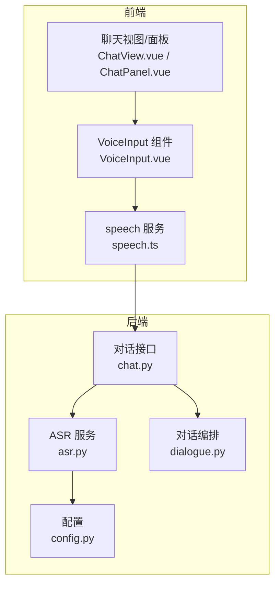
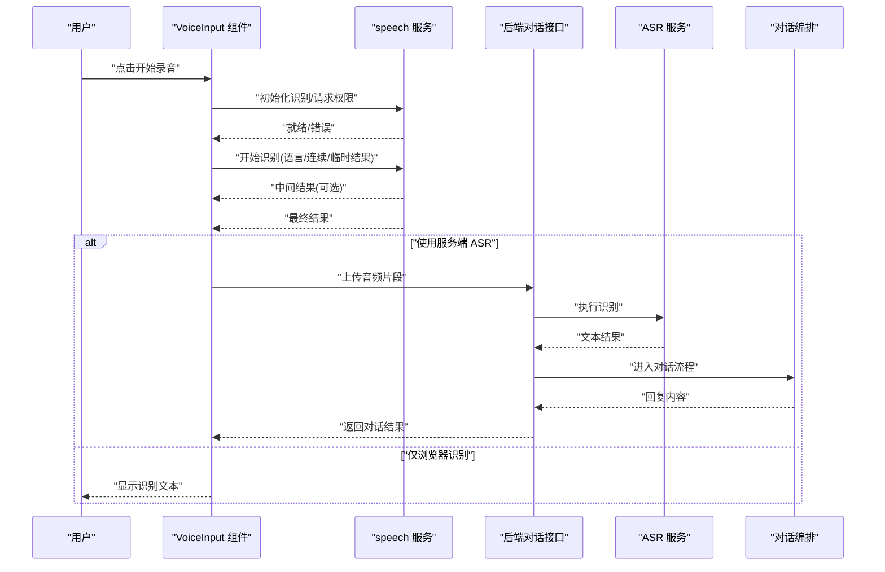
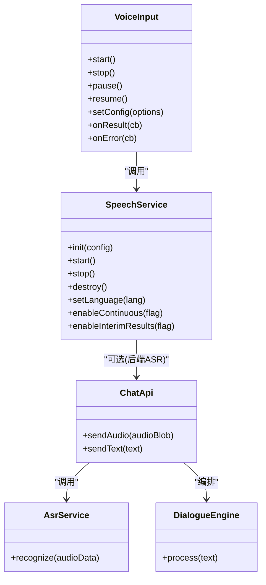
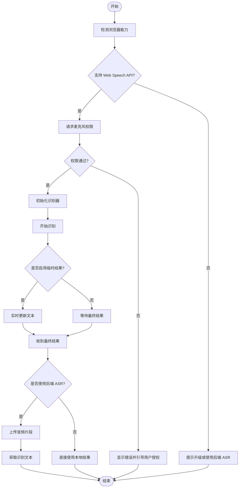

# 语音输入系统

<cite>
**本文引用的文件**   
- [frontend/tourist-app/src/components/VoiceInput/VoiceInput.vue](file://frontend/tourist-app/src/components/VoiceInput/VoiceInput.vue)
- [frontend/tourist-app/src/services/speech.ts](file://frontend/tourist-app/src/services/speech.ts)
- [backend/app/services/asr.py](file://backend/app/services/asr.py)
- [backend/app/api/chat.py](file://backend/app/api/chat.py)
- [backend/app/core/dialogue.py](file://backend/app/core/dialogue.py)
- [backend/app/config.py](file://backend/app/config.py)
</cite>

## 目录
1. [简介](#简介)
2. [项目结构](#项目结构)
3. [核心组件](#核心组件)
4. [架构总览](#架构总览)
5. [详细组件分析](#详细组件分析)
6. [依赖关系分析](#依赖关系分析)
7. [性能考虑](#性能考虑)
8. [故障排查指南](#故障排查指南)
9. [结论](#结论)
10. [附录](#附录)

## 简介
本文件面向开发者，系统化阐述前端“语音输入系统”的实现与集成方式，重点覆盖以下方面：
- VoiceInput 组件的语音识别能力：麦克风权限、音频录制、语音转文本、实时反馈
- speech 服务模块对 Web Speech API 的封装：识别配置、错误处理、兼容性策略
- 与对话系统的集成链路：语音指令解析、多语言支持、离线识别方案
- 音频格式转换、噪声过滤、音量检测与用户体验优化
- 具体调用示例与自定义配置，帮助快速落地完整的语音交互体验

## 项目结构
本项目采用前后端分离架构。语音输入相关的前端实现位于 tourist-app 中，后端提供 ASR（自动语音识别）与对话编排能力。

图表来源
- [frontend/tourist-app/src/components/VoiceInput/VoiceInput.vue](file://frontend/tourist-app/src/components/VoiceInput/VoiceInput.vue)
- [frontend/tourist-app/src/services/speech.ts](file://frontend/tourist-app/src/services/speech.ts)
- [backend/app/api/chat.py](file://backend/app/api/chat.py)
- [backend/app/services/asr.py](file://backend/app/services/asr.py)
- [backend/app/core/dialogue.py](file://backend/app/core/dialogue.py)
- [backend/app/config.py](file://backend/app/config.py)

章节来源
- [frontend/tourist-app/src/components/VoiceInput/VoiceInput.vue](file://frontend/tourist-app/src/components/VoiceInput/VoiceInput.vue)
- [frontend/tourist-app/src/services/speech.ts](file://frontend/tourist-app/src/services/speech.ts)
- [backend/app/api/chat.py](file://backend/app/api/chat.py)
- [backend/app/services/asr.py](file://backend/app/services/asr.py)
- [backend/app/core/dialogue.py](file://backend/app/core/dialogue.py)
- [backend/app/config.py](file://backend/app/config.py)

## 核心组件
本节聚焦两个关键前端组件与服务：
- VoiceInput 组件：负责用户交互、权限申请、录音控制、UI 状态与事件派发
- speech 服务：封装浏览器 Web Speech API，统一识别配置、错误处理与兼容层

章节来源
- [frontend/tourist-app/src/components/VoiceInput/VoiceInput.vue](file://frontend/tourist-app/src/components/VoiceInput/VoiceInput.vue)
- [frontend/tourist-app/src/services/speech.ts](file://frontend/tourist-app/src/services/speech.ts)

## 架构总览
语音输入端到端流程如下：
- 用户在界面触发录音，VoiceInput 组件通过 speech 服务调用浏览器语音识别
- 识别结果以流式或最终形式返回，组件进行实时展示与后续发送
- 若启用服务端 ASR，则可将音频片段上传至后端 asr 服务，再由对话编排处理并返回响应

图表来源
- [frontend/tourist-app/src/components/VoiceInput/VoiceInput.vue](file://frontend/tourist-app/src/components/VoiceInput/VoiceInput.vue)
- [frontend/tourist-app/src/services/speech.ts](file://frontend/tourist-app/src/services/speech.ts)
- [backend/app/api/chat.py](file://backend/app/api/chat.py)
- [backend/app/services/asr.py](file://backend/app/services/asr.py)
- [backend/app/core/dialogue.py](file://backend/app/core/dialogue.py)

## 详细组件分析

### VoiceInput 组件
职责与要点：
- 麦克风权限获取：在首次启动时向浏览器申请媒体设备访问权限，失败时给出明确提示与引导
- 录音生命周期管理：开始/暂停/停止，结合 UI 状态（如“正在听”、“已静音”等）
- 与 speech 服务对接：根据配置选择浏览器识别或服务端 ASR；支持临时结果实时更新
- 事件与回调：对外暴露开始、结束、错误、结果等事件，供父级页面消费
- 用户体验优化：防抖、超时重试、网络异常降级到本地识别、空输入提示

建议的对外接口（概念性说明）：
- start()：开始录音与识别
- stop()：停止录音与识别
- pause()/resume()：暂停/恢复
- onResult(callback)：注册结果回调
- onError(callback)：注册错误回调
- setConfig(options)：动态更新识别配置（语言、是否连续、是否临时结果等）

章节来源
- [frontend/tourist-app/src/components/VoiceInput/VoiceInput.vue](file://frontend/tourist-app/src/components/VoiceInput/VoiceInput.vue)

### speech 服务（Web Speech API 集成）
职责与要点：
- 浏览器能力探测：检测 SpeechRecognition 是否存在，不存在时抛出友好错误并提供替代路径
- 识别配置：设置语言、是否连续识别、是否返回临时结果、最大监听时长等
- 事件处理：onresult/onerror/onstart/onend 的统一封装，标准化错误码与消息
- 兼容性处理：不同浏览器的命名差异、HTTPS 要求、权限弹窗拦截等
- 可插拔后端：当检测到后端 ASR 可用时，将音频流切片上传，由后端完成识别

典型方法（概念性说明）：
- init(config)：初始化识别器与全局配置
- start()：开始识别
- stop()：停止识别
- destroy()：释放资源
- on(event, handler)：事件订阅
- setLanguage(lang)：切换识别语言
- enableContinuous(bool)：开启/关闭连续识别
- enableInterimResults(bool)：开启/关闭临时结果

章节来源
- [frontend/tourist-app/src/services/speech.ts](file://frontend/tourist-app/src/services/speech.ts)

### 后端 ASR 与对话集成
职责与要点：
- chat 接口：接收前端音频或文本，路由到 ASR 服务或直接进入对话编排
- asr 服务：调用外部语音识别引擎（或本地模型），返回文本
- dialogue 编排：基于文本进行意图理解、检索增强生成（RAG）、回复构造
- config：集中管理 ASR 服务地址、鉴权、超时、重试等参数

章节来源
- [backend/app/api/chat.py](file://backend/app/api/chat.py)
- [backend/app/services/asr.py](file://backend/app/services/asr.py)
- [backend/app/core/dialogue.py](file://backend/app/core/dialogue.py)
- [backend/app/config.py](file://backend/app/config.py)

## 依赖关系分析
前端组件与服务之间的耦合关系如下：
- VoiceInput 组件依赖 speech 服务进行识别
- speech 服务可选择性地依赖后端 ASR 接口
- 后端 chat 接口作为统一入口，协调 ASR 与对话编排

图表来源
- [frontend/tourist-app/src/components/VoiceInput/VoiceInput.vue](file://frontend/tourist-app/src/components/VoiceInput/VoiceInput.vue)
- [frontend/tourist-app/src/services/speech.ts](file://frontend/tourist-app/src/services/speech.ts)
- [backend/app/api/chat.py](file://backend/app/api/chat.py)
- [backend/app/services/asr.py](file://backend/app/services/asr.py)
- [backend/app/core/dialogue.py](file://backend/app/core/dialogue.py)

章节来源
- [frontend/tourist-app/src/components/VoiceInput/VoiceInput.vue](file://frontend/tourist-app/src/components/VoiceInput/VoiceInput.vue)
- [frontend/tourist-app/src/services/speech.ts](file://frontend/tourist-app/src/services/speech.ts)
- [backend/app/api/chat.py](file://backend/app/api/chat.py)
- [backend/app/services/asr.py](file://backend/app/services/asr.py)
- [backend/app/core/dialogue.py](file://backend/app/core/dialogue.py)

## 性能考虑
- 识别延迟优化
  - 优先使用浏览器原生识别以减少网络往返
  - 合理设置连续识别与临时结果，降低首字延迟
- 带宽与存储
  - 仅在需要时使用服务端 ASR，避免不必要的音频上传
  - 对音频进行轻量压缩与分片上传
- 稳定性
  - 增加超时与重试机制，网络抖动时自动降级
  - 对长时间会话进行周期性重连与状态同步
- 资源占用
  - 及时释放识别器与媒体流，避免内存泄漏
  - 在非活跃时段关闭后台任务

[本节为通用指导，不直接分析具体文件]

## 故障排查指南
常见问题与定位思路：
- 无法获取麦克风权限
  - 检查 HTTPS 环境、浏览器安全策略与用户授权弹窗
  - 捕获权限拒绝错误，提示用户手动允许
- 识别结果为空或不稳定
  - 确认语言设置与口音匹配
  - 调整连续识别与临时结果开关
  - 在网络不稳定时切换到本地识别
- 后端 ASR 不可用
  - 校验服务地址、鉴权与超时配置
  - 查看后端日志与错误码，必要时回退到前端识别
- 用户体验问题
  - 增加加载态与错误提示
  - 对误触与空输入做防护

章节来源
- [frontend/tourist-app/src/services/speech.ts](file://frontend/tourist-app/src/services/speech.ts)
- [backend/app/api/chat.py](file://backend/app/api/chat.py)
- [backend/app/services/asr.py](file://backend/app/services/asr.py)

## 结论
本语音输入系统通过前端 VoiceInput 组件与 speech 服务的协作，实现了从权限管理、录音控制到识别结果的完整链路，并在需要时无缝接入后端 ASR 与对话编排。通过合理的配置与错误处理策略，可在不同环境与设备上获得稳定且流畅的语音交互体验。

[本节为总结性内容，不直接分析具体文件]

## 附录

### 配置项参考（概念性）
- 语言：zh-CN、en-US 等
- 连续识别：true/false
- 临时结果：true/false
- 最大监听时长：秒
- 后端 ASR 地址与鉴权信息
- 超时与重试次数

章节来源
- [frontend/tourist-app/src/services/speech.ts](file://frontend/tourist-app/src/services/speech.ts)
- [backend/app/config.py](file://backend/app/config.py)

### 调用示例（步骤化）
- 初始化
  - 创建 VoiceInput 实例并传入基础配置
  - 注册结果与错误回调
- 开始识别
  - 调用 start()，等待 onResult 回调
  - 如需服务端识别，确保后端 ASR 可达
- 停止识别
  - 调用 stop()，清理资源
- 动态调整
  - 运行时通过 setConfig() 调整语言、连续识别等

章节来源
- [frontend/tourist-app/src/components/VoiceInput/VoiceInput.vue](file://frontend/tourist-app/src/components/VoiceInput/VoiceInput.vue)
- [frontend/tourist-app/src/services/speech.ts](file://frontend/tourist-app/src/services/speech.ts)

### 流程图：识别主流程

图表来源
- [frontend/tourist-app/src/services/speech.ts](file://frontend/tourist-app/src/services/speech.ts)
- [backend/app/api/chat.py](file://backend/app/api/chat.py)
- [backend/app/services/asr.py](file://backend/app/services/asr.py)