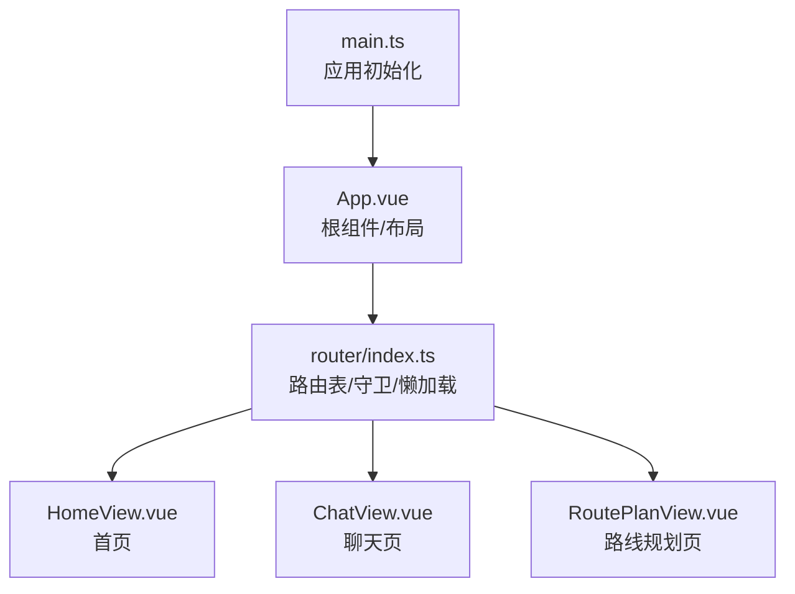
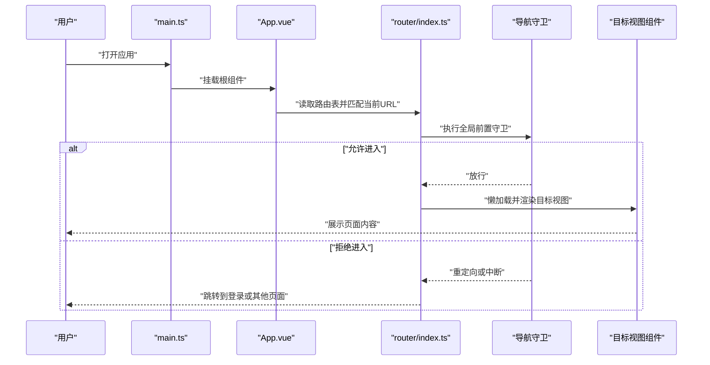
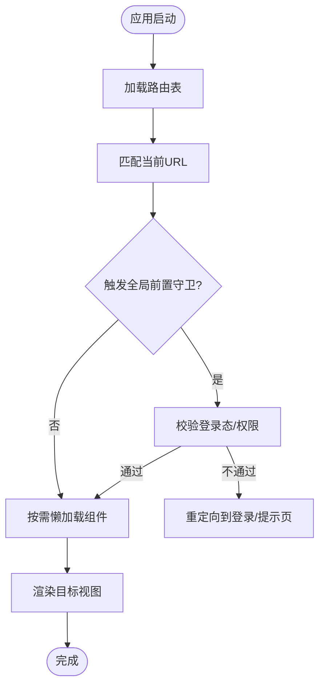
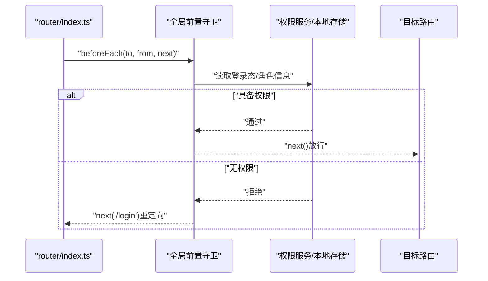
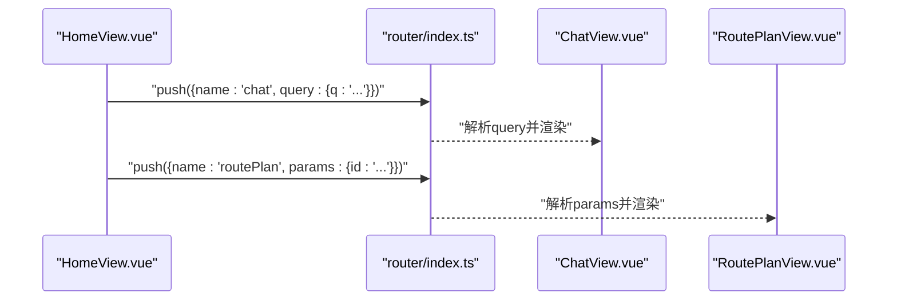
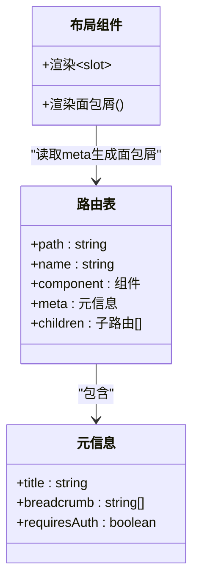
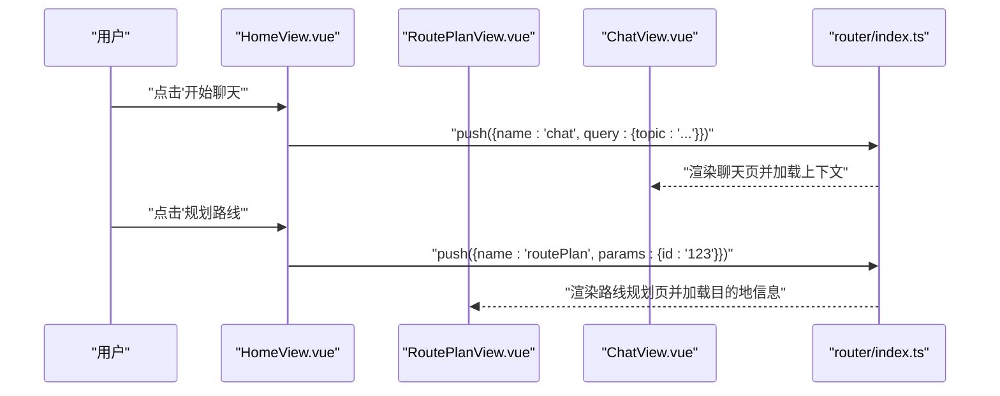
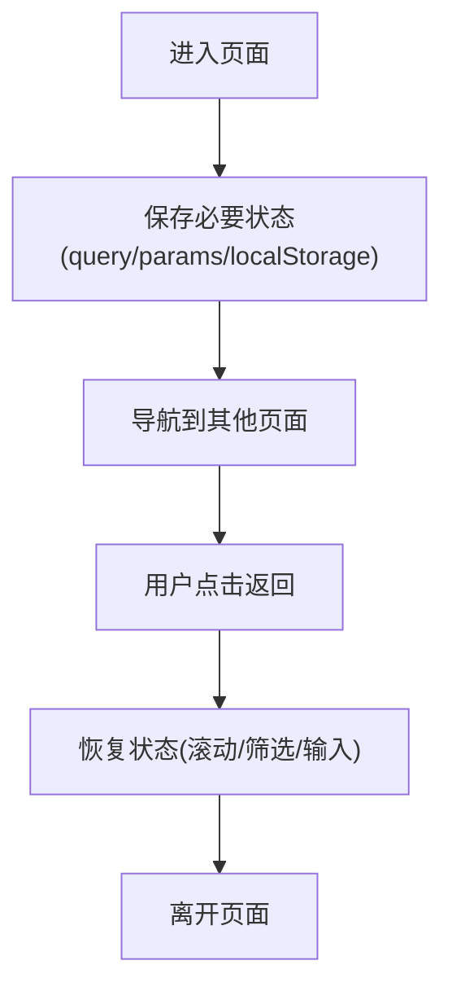
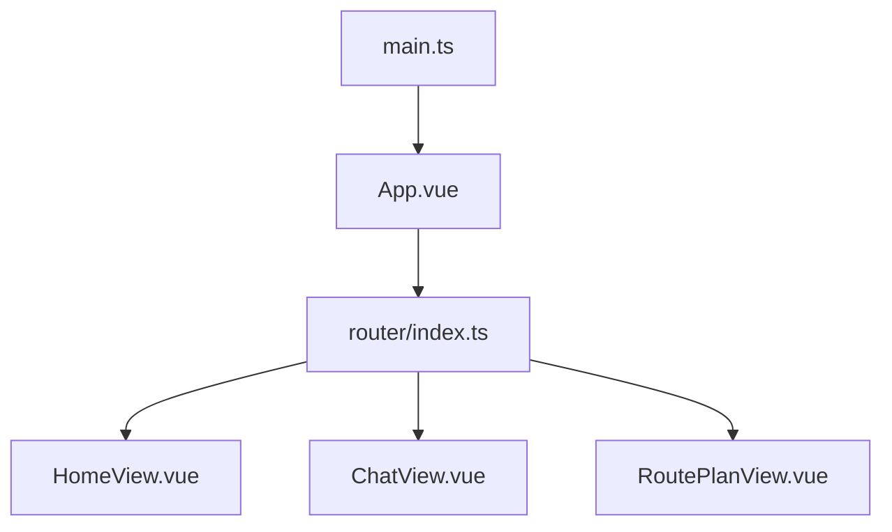

# 路由系统设计

<cite>
**本文引用的文件**   
- [frontend/tourist-app/src/router/index.ts](file://frontend/tourist-app/src/router/index.ts)
- [frontend/tourist-app/src/views/HomeView.vue](file://frontend/tourist-app/src/views/HomeView.vue)
- [frontend/tourist-app/src/views/ChatView.vue](file://frontend/tourist-app/src/views/ChatView.vue)
- [frontend/tourist-app/src/views/RoutePlanView.vue](file://frontend/tourist-app/src/views/RoutePlanView.vue)
- [frontend/tourist-app/src/App.vue](file://frontend/tourist-app/src/App.vue)
- [frontend/tourist-app/src/main.ts](file://frontend/tourist-app/src/main.ts)
</cite>

## 目录
1. [简介](#简介)
2. [项目结构](#项目结构)
3. [核心组件](#核心组件)
4. [架构总览](#架构总览)
5. [详细组件分析](#详细组件分析)
6. [依赖分析](#依赖分析)
7. [性能考虑](#性能考虑)
8. [故障排查指南](#故障排查指南)
9. [结论](#结论)
10. [附录](#附录)

## 简介
本文件聚焦游客端应用的路由系统设计与实现，围绕基于 Vue Router 的架构展开，涵盖路由配置、导航守卫、动态与嵌套路由、懒加载、权限控制、元信息与面包屑、状态管理、历史记录处理以及移动端适配策略。文档同时给出首页、聊天页面、路线规划页面的路由定义与参数传递机制说明，并提供可操作的配置示例与导航模式建议，帮助开发者高效管理与维护多页面跳转逻辑。

## 项目结构
游客端前端位于 frontend/tourist-app 目录，路由相关代码集中在 router 目录，视图页面位于 views 目录，应用入口在 main.ts，根组件为 App.vue。整体采用“按功能域组织”的结构：router 负责路由注册与全局守卫；views 承载页面级组件；App.vue 提供全局布局与占位渲染。

图表来源
- [frontend/tourist-app/src/main.ts](file://frontend/tourist-app/src/main.ts)
- [frontend/tourist-app/src/App.vue](file://frontend/tourist-app/src/App.vue)
- [frontend/tourist-app/src/router/index.ts](file://frontend/tourist-app/src/router/index.ts)
- [frontend/tourist-app/src/views/HomeView.vue](file://frontend/tourist-app/src/views/HomeView.vue)
- [frontend/tourist-app/src/views/ChatView.vue](file://frontend/tourist-app/src/views/ChatView.vue)
- [frontend/tourist-app/src/views/RoutePlanView.vue](file://frontend/tourist-app/src/views/RoutePlanView.vue)

章节来源
- [frontend/tourist-app/src/main.ts](file://frontend/tourist-app/src/main.ts)
- [frontend/tourist-app/src/App.vue](file://frontend/tourist-app/src/App.vue)
- [frontend/tourist-app/src/router/index.ts](file://frontend/tourist-app/src/router/index.ts)

## 核心组件
- 路由表与懒加载：通过异步组件方式按需加载页面，减少首屏体积并提升启动速度。
- 导航守卫：用于权限校验、登录态检查、访问统计等前置拦截。
- 元信息与面包屑：在路由 meta 中声明页面标题、是否需要登录、面包屑层级等，配合全局逻辑生成导航信息。
- 动态路由与查询参数：支持路径参数与查询参数的组合使用，便于在不同页面间传递上下文。
- 嵌套路由：在父路由下定义子路由，形成模块化页面结构（如“设置”下的“个人资料”、“通知”）。
- 移动端适配：结合响应式布局与手势返回、URL 同步等策略优化移动端体验。

章节来源
- [frontend/tourist-app/src/router/index.ts](file://frontend/tourist-app/src/router/index.ts)
- [frontend/tourist-app/src/App.vue](file://frontend/tourist-app/src/App.vue)

## 架构总览
下图展示了游客端应用从入口到路由分发再到页面渲染的整体流程，包括懒加载与守卫的执行顺序。

图表来源
- [frontend/tourist-app/src/main.ts](file://frontend/tourist-app/src/main.ts)
- [frontend/tourist-app/src/App.vue](file://frontend/tourist-app/src/App.vue)
- [frontend/tourist-app/src/router/index.ts](file://frontend/tourist-app/src/router/index.ts)

## 详细组件分析

### 路由表与懒加载
- 路由表集中管理所有页面路径、组件引用、元信息与子路由。
- 使用异步组件进行懒加载，避免一次性加载全部页面资源。
- 建议在 meta 中声明页面标题、是否需登录、面包屑层级等，供全局逻辑统一消费。

图表来源
- [frontend/tourist-app/src/router/index.ts](file://frontend/tourist-app/src/router/index.ts)

章节来源
- [frontend/tourist-app/src/router/index.ts](file://frontend/tourist-app/src/router/index.ts)

### 导航守卫与权限控制
- 全局前置守卫可用于：
  - 登录态校验：未登录时重定向至登录页。
  - 角色/权限校验：根据 meta.roles 或自定义字段判断是否允许访问。
  - 访问统计：记录页面访问事件。
- 路由独享守卫适合针对特定页面的细粒度控制。
- 后置守卫可用于埋点、更新页面标题等副作用操作。

图表来源
- [frontend/tourist-app/src/router/index.ts](file://frontend/tourist-app/src/router/index.ts)

章节来源
- [frontend/tourist-app/src/router/index.ts](file://frontend/tourist-app/src/router/index.ts)

### 动态路由与参数传递
- 路径参数：在路由定义中使用占位符，并在目标页面通过路由对象获取。
- 查询参数：通过 URL 的 query 部分传递键值对，适合筛选条件、搜索词等场景。
- 命名路由：以 name 标识路由，便于在代码中以语义化方式导航。
- 编程式导航：使用 router.push/replace 等方法进行跳转，支持携带 params/query。

图表来源
- [frontend/tourist-app/src/views/HomeView.vue](file://frontend/tourist-app/src/views/HomeView.vue)
- [frontend/tourist-app/src/views/ChatView.vue](file://frontend/tourist-app/src/views/ChatView.vue)
- [frontend/tourist-app/src/views/RoutePlanView.vue](file://frontend/tourist-app/src/views/RoutePlanView.vue)
- [frontend/tourist-app/src/router/index.ts](file://frontend/tourist-app/src/router/index.ts)

章节来源
- [frontend/tourist-app/src/views/HomeView.vue](file://frontend/tourist-app/src/views/HomeView.vue)
- [frontend/tourist-app/src/views/ChatView.vue](file://frontend/tourist-app/src/views/ChatView.vue)
- [frontend/tourist-app/src/views/RoutePlanView.vue](file://frontend/tourist-app/src/views/RoutePlanView.vue)
- [frontend/tourist-app/src/router/index.ts](file://frontend/tourist-app/src/router/index.ts)

### 嵌套路由与面包屑导航
- 嵌套路由：在父路由下定义 children，形成模块化的页面结构，例如“设置”包含“个人资料”、“通知”等子页面。
- 面包屑导航：基于路由层级与 meta.title 自动生成面包屑数据，结合 App.vue 中的布局组件渲染。
- 建议将面包屑所需信息统一放在 meta 中，便于集中维护。

图表来源
- [frontend/tourist-app/src/router/index.ts](file://frontend/tourist-app/src/router/index.ts)
- [frontend/tourist-app/src/App.vue](file://frontend/tourist-app/src/App.vue)

章节来源
- [frontend/tourist-app/src/router/index.ts](file://frontend/tourist-app/src/router/index.ts)
- [frontend/tourist-app/src/App.vue](file://frontend/tourist-app/src/App.vue)

### 首页、聊天页、路线规划页的路由定义与交互
- 首页：作为入口，通常提供快速导航到聊天与路线规划等功能。
- 聊天页：支持通过查询参数传入初始话题或上下文，便于分享链接后直接恢复对话。
- 路线规划页：可通过路径参数接收目的地 ID 或名称，以便预填充表单或地图标记。

图表来源
- [frontend/tourist-app/src/views/HomeView.vue](file://frontend/tourist-app/src/views/HomeView.vue)
- [frontend/tourist-app/src/views/ChatView.vue](file://frontend/tourist-app/src/views/ChatView.vue)
- [frontend/tourist-app/src/views/RoutePlanView.vue](file://frontend/tourist-app/src/views/RoutePlanView.vue)
- [frontend/tourist-app/src/router/index.ts](file://frontend/tourist-app/src/router/index.ts)

章节来源
- [frontend/tourist-app/src/views/HomeView.vue](file://frontend/tourist-app/src/views/HomeView.vue)
- [frontend/tourist-app/src/views/ChatView.vue](file://frontend/tourist-app/src/views/ChatView.vue)
- [frontend/tourist-app/src/views/RoutePlanView.vue](file://frontend/tourist-app/src/views/RoutePlanView.vue)
- [frontend/tourist-app/src/router/index.ts](file://frontend/tourist-app/src/router/index.ts)

### 路由状态管理与历史记录处理
- 路由状态：利用路由的 query 与 params 保持页面间的轻量状态，必要时结合持久化存储（如 localStorage）保存关键上下文。
- 历史记录：合理使用 push/replace 控制浏览器历史栈，避免过多无用条目；在返回列表页时尽量保留滚动位置与筛选条件。
- 移动端适配：结合 history API 与手势返回，确保后退行为符合预期；在深链直达时自动恢复页面状态。

[此图为概念性流程图，无需图表来源]

章节来源
- [frontend/tourist-app/src/router/index.ts](file://frontend/tourist-app/src/router/index.ts)
- [frontend/tourist-app/src/App.vue](file://frontend/tourist-app/src/App.vue)

### 移动端路由适配策略
- 响应式布局：在 App.vue 与页面组件中采用弹性布局与媒体查询，适配不同屏幕尺寸。
- 手势返回：监听硬件返回键与滑动返回，结合路由历史栈进行合理跳转。
- 深链直达：在首次加载时解析 URL 参数，自动定位到对应页面并恢复上下文。
- 性能优化：优先懒加载大体积页面，减少首屏资源；对图片与模型资源进行压缩与缓存。

[本节为通用指导，不涉及具体文件分析]

## 依赖分析
- 入口依赖：main.ts 负责创建应用实例并挂载根组件 App.vue。
- 路由依赖：App.vue 引入并使用 router，router/index.ts 集中管理路由表、守卫与懒加载。
- 页面依赖：各视图组件按需被路由懒加载，避免不必要的耦合。

图表来源
- [frontend/tourist-app/src/main.ts](file://frontend/tourist-app/src/main.ts)
- [frontend/tourist-app/src/App.vue](file://frontend/tourist-app/src/App.vue)
- [frontend/tourist-app/src/router/index.ts](file://frontend/tourist-app/src/router/index.ts)
- [frontend/tourist-app/src/views/HomeView.vue](file://frontend/tourist-app/src/views/HomeView.vue)
- [frontend/tourist-app/src/views/ChatView.vue](file://frontend/tourist-app/src/views/ChatView.vue)
- [frontend/tourist-app/src/views/RoutePlanView.vue](file://frontend/tourist-app/src/views/RoutePlanView.vue)

章节来源
- [frontend/tourist-app/src/main.ts](file://frontend/tourist-app/src/main.ts)
- [frontend/tourist-app/src/App.vue](file://frontend/tourist-app/src/App.vue)
- [frontend/tourist-app/src/router/index.ts](file://frontend/tourist-app/src/router/index.ts)

## 性能考虑
- 懒加载：仅当路由被访问时才加载对应组件，显著降低首屏时间。
- 路由级拆分：将大页面拆分为多个子路由，按需加载子模块。
- 资源优化：对图片、模型等资源进行压缩与 CDN 加速，启用浏览器缓存。
- 防抖与节流：在频繁导航或搜索场景中，对请求与状态更新进行节流，避免重复计算。
- 预取与预加载：对高频访问页面进行预取，提升二次访问速度。

[本节为通用指导，不涉及具体文件分析]

## 故障排查指南
- 路由无法匹配：检查 path 与 name 是否正确，确认是否存在通配符或大小写问题。
- 参数丢失：确认使用 params 还是 query，并确保在目标页面正确读取。
- 权限拦截异常：检查全局前置守卫逻辑与元信息配置，确认登录态与角色校验是否生效。
- 面包屑不正确：核对 meta.title 与 breadcrumb 层级是否与路由结构一致。
- 移动端返回异常：检查 history API 使用与手势返回逻辑，确保不会破坏路由栈。

章节来源
- [frontend/tourist-app/src/router/index.ts](file://frontend/tourist-app/src/router/index.ts)
- [frontend/tourist-app/src/App.vue](file://frontend/tourist-app/src/App.vue)

## 结论
本设计围绕 Vue Router 构建了一套可扩展、易维护的游客端路由系统。通过懒加载、导航守卫、元信息与面包屑、动态与嵌套路由、状态管理与移动端适配等能力，实现了高性能与良好用户体验的多页面跳转逻辑。建议在实际项目中持续完善权限体系与埋点统计，并结合业务需求扩展更多元信息与子路由模块。

## 附录
- 常用导航模式
  - 命名路由跳转：使用 name 与 params/query 组合，保证语义化与可维护性。
  - 编程式导航：在组件内通过 router.push/replace 进行跳转，注意区分 push 与 replace 的历史行为。
  - 声明式导航：在模板中使用 router-link，简化静态链接与高亮状态管理。
- 最佳实践
  - 将页面元信息集中管理，避免分散在各组件中。
  - 对敏感页面增加路由独享守卫，细化权限控制。
  - 在移动端优先使用 query 传递筛选条件，便于分享与回退。

[本节为通用指导，不涉及具体文件分析]