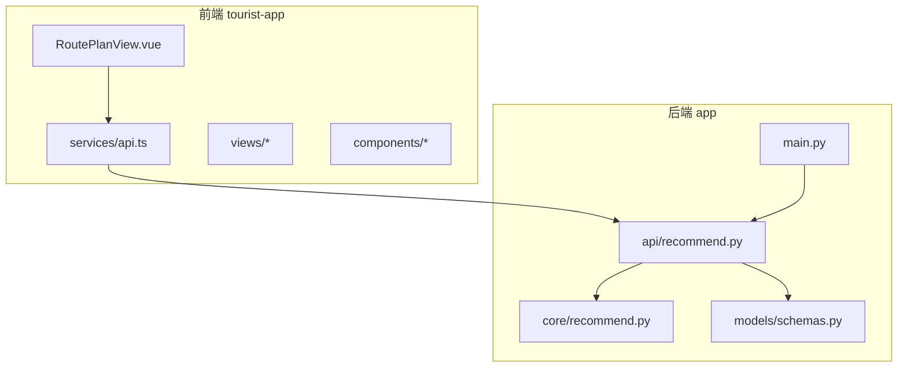
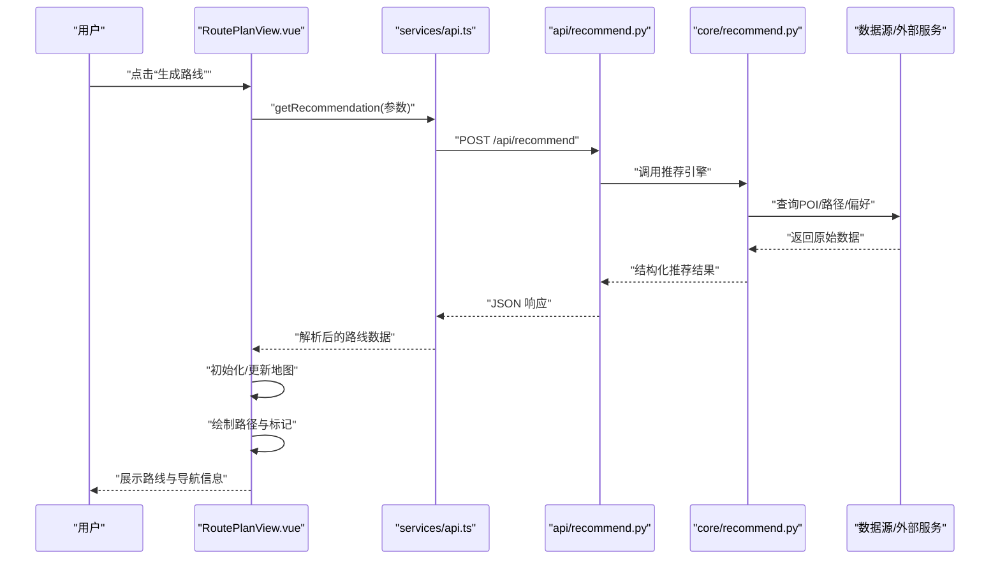
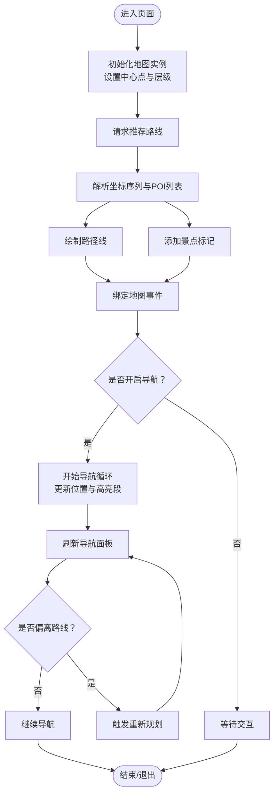
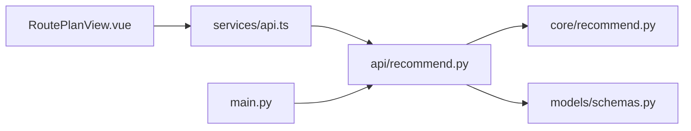

# 路线规划展示

<cite>
**本文引用的文件**   
- [RoutePlanView.vue](file://frontend/tourist-app/src/views/RoutePlanView.vue)
- [api.ts](file://frontend/tourist-app/src/services/api.ts)
- [recommend.py](file://backend/app/api/recommend.py)
- [core/recommend.py](file://backend/app/core/recommend.py)
- [models/schemas.py](file://backend/app/models/schemas.py)
- [main.py](file://backend/app/main.py)
</cite>

## 目录
1. [简介](#简介)
2. [项目结构](#项目结构)
3. [核心组件](#核心组件)
4. [架构总览](#架构总览)
5. [详细组件分析](#详细组件分析)
6. [依赖关系分析](#依赖关系分析)
7. [性能与体验优化](#性能与体验优化)
8. [故障排查指南](#故障排查指南)
9. [结论](#结论)
10. [附录：配置与扩展示例](#附录配置与扩展示例)

## 简介
本文件围绕“路线规划展示”功能，系统性梳理前端 RoutePlanView 组件与后端推荐服务之间的协作方式，覆盖地图集成、路线可视化、景点标记、导航信息展示、数据获取与渲染流程、个性化推荐、实时位置更新与导航引导等主题。同时提供移动端适配、离线地图支持与用户体验增强建议，并给出可操作的地图配置与自定义标记方法，帮助开发者快速扩展旅游路线规划能力。

## 项目结构
本项目采用前后端分离架构：
- 前端（tourist-app）包含路由、视图、服务层与状态管理，其中 RoutePlanView 负责地图与路线的交互展示。
- 后端（app）提供 REST API，包括推荐接口、模型定义与主应用入口。

图表来源
- [RoutePlanView.vue](file://frontend/tourist-app/src/views/RoutePlanView.vue)
- [api.ts](file://frontend/tourist-app/src/services/api.ts)
- [main.py](file://backend/app/main.py)
- [recommend.py](file://backend/app/api/recommend.py)
- [core/recommend.py](file://backend/app/core/recommend.py)
- [models/schemas.py](file://backend/app/models/schemas.py)

章节来源
- [RoutePlanView.vue](file://frontend/tourist-app/src/views/RoutePlanView.vue)
- [api.ts](file://frontend/tourist-app/src/services/api.ts)
- [main.py](file://backend/app/main.py)
- [recommend.py](file://backend/app/api/recommend.py)
- [core/recommend.py](file://backend/app/core/recommend.py)
- [models/schemas.py](file://backend/app/models/schemas.py)

## 核心组件
- RoutePlanView 组件
  - 职责：承载地图容器、加载地图实例、绘制路线与标记、处理用户交互（缩放、拖拽、点击）、展示导航信息与步骤列表、响应实时位置更新。
  - 关键流程：初始化地图 -> 请求推荐路线 -> 解析坐标序列 -> 绘制路径与标记 -> 绑定事件 -> 可选开启导航模式。
- 前端服务 api.ts
  - 职责：封装对后端的 HTTP 调用，统一错误处理、重试策略与超时控制，暴露 getRecommendation 等方法供视图调用。
- 后端推荐接口 recommend.py
  - 职责：接收前端参数（如起点、偏好、时间窗口），调用核心推荐逻辑，返回标准化路线数据结构。
- 核心推荐 core/recommend.py
  - 职责：实现个性化推荐算法或规则，生成候选 POI 序列与路径点，输出符合 schemas 的数据。
- 数据模型 models/schemas.py
  - 职责：定义推荐结果的结构（如坐标数组、POI 列表、导航步骤等），保证前后端契约一致。
- 应用入口 main.py
  - 职责：注册路由、挂载中间件、启动服务，将 /api/recommend 等接口暴露给前端。

章节来源
- [RoutePlanView.vue](file://frontend/tourist-app/src/views/RoutePlanView.vue)
- [api.ts](file://frontend/tourist-app/src/services/api.ts)
- [recommend.py](file://backend/app/api/recommend.py)
- [core/recommend.py](file://backend/app/core/recommend.py)
- [models/schemas.py](file://backend/app/models/schemas.py)
- [main.py](file://backend/app/main.py)

## 架构总览
以下时序图展示了从用户触发到地图渲染的关键调用链。

图表来源
- [RoutePlanView.vue](file://frontend/tourist-app/src/views/RoutePlanView.vue)
- [api.ts](file://frontend/tourist-app/src/services/api.ts)
- [recommend.py](file://backend/app/api/recommend.py)
- [core/recommend.py](file://backend/app/core/recommend.py)

## 详细组件分析

### RoutePlanView 组件
- 地图集成
  - 在组件生命周期中创建地图实例，设置中心点、缩放级别与图层配置。
  - 监听地图事件（移动、缩放、点击）以驱动 UI 与导航状态。
- 路线可视化
  - 将后端返回的坐标序列转换为地图路径对象，设置样式（颜色、宽度、透明度）。
  - 为每个 POI 添加标记，支持点击弹出详情（名称、评分、简介、图片等）。
- 导航信息展示
  - 根据路线步骤渲染侧边栏或底部面板，显示距离、预计时长、转向提示。
  - 支持“开始导航”、“暂停”、“结束”等操作，并在地图上高亮当前段。
- 实时位置更新
  - 使用浏览器定位或设备传感器，周期性更新当前位置，计算与下一航点的距离与方向。
  - 当偏离路线超过阈值时，触发重新规划或提醒。
- 交互设计
  - 支持双击放大、长按查看详情、手势滑动切换视角。
  - 提供“回到起点”、“居中当前”、“导出路线”等快捷操作。

图表来源
- [RoutePlanView.vue](file://frontend/tourist-app/src/views/RoutePlanView.vue)

章节来源
- [RoutePlanView.vue](file://frontend/tourist-app/src/views/RoutePlanView.vue)

### 前端服务 api.ts
- 接口封装
  - 提供 getRecommendation(params) 方法，将前端参数序列化后发送至后端。
  - 统一处理网络异常、超时与重试，返回标准化的 Promise 结果。
- 错误处理
  - 对非 2xx 响应进行拦截，抛出可读的错误信息，便于上层组件提示用户。
- 缓存与去抖
  - 可对相同参数的请求做短期缓存，减少重复请求；对频繁触发的搜索进行去抖。

章节来源
- [api.ts](file://frontend/tourist-app/src/services/api.ts)

### 后端推荐接口 recommend.py
- 路由定义
  - 注册 POST /api/recommend，接收 JSON 参数（如起点经纬度、偏好标签、时间预算）。
- 参数校验
  - 基于 models/schemas.py 的模型定义进行入参校验，返回明确的错误码与消息。
- 调用核心推荐
  - 将校验后的参数传递给 core/recommend.py，获取推荐结果。
- 响应格式
  - 返回包含坐标序列、POI 列表、导航步骤等字段的 JSON，确保前端可直接渲染。

章节来源
- [recommend.py](file://backend/app/api/recommend.py)
- [models/schemas.py](file://backend/app/models/schemas.py)

### 核心推荐 core/recommend.py
- 输入
  - 起点坐标、用户偏好（兴趣、体力、时间）、历史行为（可选）。
- 处理逻辑
  - 筛选候选 POI，按相关性打分排序。
  - 结合道路网络或近似路径估算，生成顺序合理的路线点列。
  - 生成导航步骤（转向、距离、预计耗时）。
- 输出
  - 遵循 schemas 定义的推荐结果结构，便于前后端稳定对接。

章节来源
- [core/recommend.py](file://backend/app/core/recommend.py)
- [models/schemas.py](file://backend/app/models/schemas.py)

### 数据模型 models/schemas.py
- 关键字段
  - 坐标序列：用于绘制路径。
  - POI 列表：包含名称、描述、坐标、图片等元数据。
  - 导航步骤：每步的指令、距离、累计时间等。
- 约束与默认值
  - 必填字段校验、枚举值限制、数值范围检查。

章节来源
- [models/schemas.py](file://backend/app/models/schemas.py)

### 应用入口 main.py
- 路由挂载
  - 将 api/recommend.py 中的路由注册到应用根路径下。
- 中间件与配置
  - 跨域、日志、限流等通用中间件的启用。
- 服务启动
  - 指定端口与调试模式，对外暴露 REST API。

章节来源
- [main.py](file://backend/app/main.py)
- [recommend.py](file://backend/app/api/recommend.py)

## 依赖关系分析
- 组件耦合
  - RoutePlanView 依赖 services/api.ts 获取数据，依赖地图 SDK 渲染。
  - 后端 recommend.py 依赖 core/recommend.py 与 models/schemas.py。
- 外部依赖
  - 地图服务（在线瓦片、路径规划、地理编码）。
  - 定位服务（浏览器 Geolocation 或设备传感器）。
  - 可选：离线地图包与本地缓存。

图表来源
- [RoutePlanView.vue](file://frontend/tourist-app/src/views/RoutePlanView.vue)
- [api.ts](file://frontend/tourist-app/src/services/api.ts)
- [recommend.py](file://backend/app/api/recommend.py)
- [core/recommend.py](file://backend/app/core/recommend.py)
- [models/schemas.py](file://backend/app/models/schemas.py)
- [main.py](file://backend/app/main.py)

章节来源
- [RoutePlanView.vue](file://frontend/tourist-app/src/views/RoutePlanView.vue)
- [api.ts](file://frontend/tourist-app/src/services/api.ts)
- [recommend.py](file://backend/app/api/recommend.py)
- [core/recommend.py](file://backend/app/core/recommend.py)
- [models/schemas.py](file://backend/app/models/schemas.py)
- [main.py](file://backend/app/main.py)

## 性能与体验优化
- 地图性能
  - 按需加载瓦片与矢量数据，合理设置最大缩放级别与视口裁剪。
  - 批量绘制路径与标记，避免频繁重绘；使用图层合并与离屏渲染。
  - 大数据量时使用聚合标记与分块加载。
- 移动端适配
  - 触摸手势优化、全屏地图、安全区域适配。
  - 小屏幕下的导航面板折叠与滚动优化。
- 离线地图支持
  - 预下载瓦片与路径数据，本地缓存策略（LRU/TTL）。
  - 离线状态下降级展示静态地图与基础导航信息。
- 用户体验增强
  - 骨架屏与渐进式加载，错误边界与友好提示。
  - 语音播报与震动反馈，夜间模式与高对比度主题。
  - 路线分享与导出（图片/PDF/GPX）。

[本节为通用指导，不直接分析具体文件]

## 故障排查指南
- 常见问题
  - 地图无法加载：检查地图密钥、网络连通性与跨域配置。
  - 路线未渲染：确认后端返回的坐标序列是否为空或格式不符。
  - 定位失败：检查浏览器权限与设备 GPS 可用性。
  - 导航不更新：确认定位回调频率与偏差阈值设置。
- 定位与重试
  - 在前端增加定位重试与降级策略（IP 定位或上次已知位置）。
  - 在后端对推荐请求增加幂等与缓存键，避免重复计算。
- 日志与监控
  - 记录关键节点耗时（请求、渲染、定位），上报错误堆栈与用户操作上下文。

章节来源
- [api.ts](file://frontend/tourist-app/src/services/api.ts)
- [recommend.py](file://backend/app/api/recommend.py)
- [RoutePlanView.vue](file://frontend/tourist-app/src/views/RoutePlanView.vue)

## 结论
通过 RoutePlanView 与后端推荐服务的协同，系统实现了从个性化路线生成到地图可视化与导航引导的完整闭环。建议在后续迭代中持续优化地图渲染性能、完善离线能力与多端适配，并通过更丰富的用户偏好与实时数据提升推荐质量与导航体验。

[本节为总结性内容，不直接分析具体文件]

## 附录：配置与扩展示例
- 地图配置要点
  - 初始化参数：中心点、初始缩放、图层类型（卫星/街道/地形）。
  - 交互开关：双击缩放、右键菜单、测距工具。
  - 主题与语言：暗色模式、本地化文案。
- 自定义标记
  - 为不同 POI 类型设置图标与气泡模板。
  - 支持动态更新标记状态（已访问、收藏、警告）。
- 扩展推荐维度
  - 引入天气、交通拥堵、节假日人流等外部信号。
  - 支持多人同行与差异化偏好融合。
- 导航增强
  - 多模态导航（步行/骑行/驾车）与多目标串联。
  - 语音播报、AR 指引与离线导航包。

[本节为概念性指导，不直接分析具体文件]