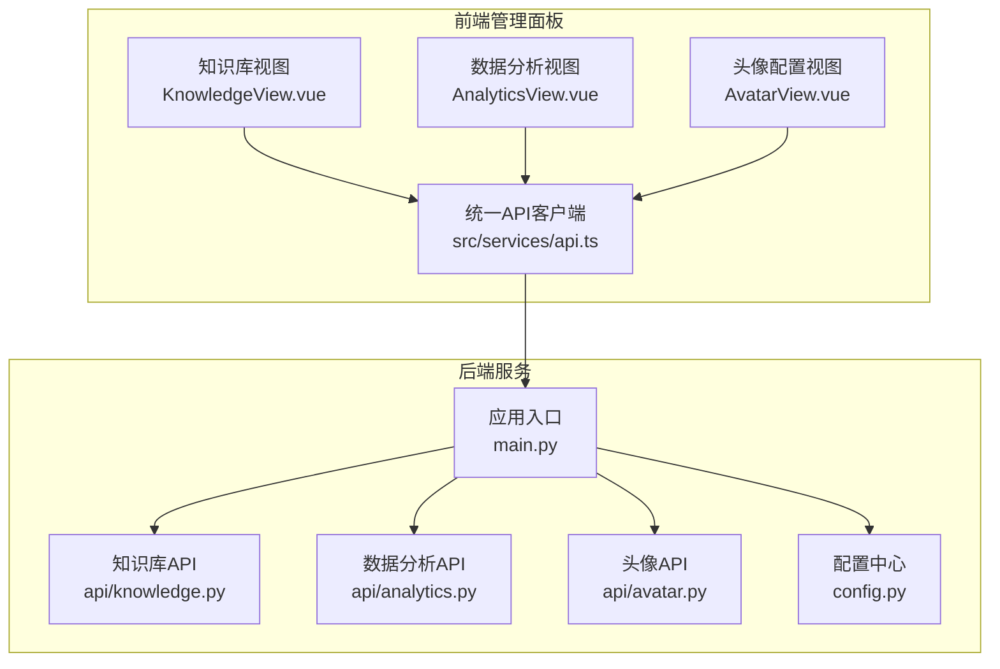
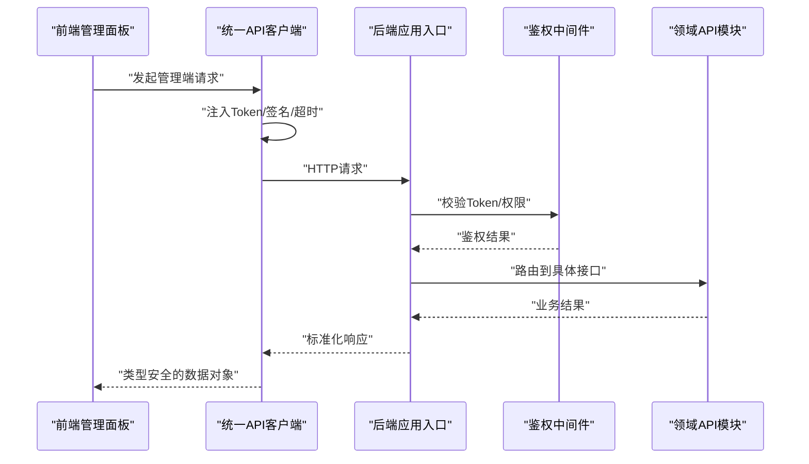
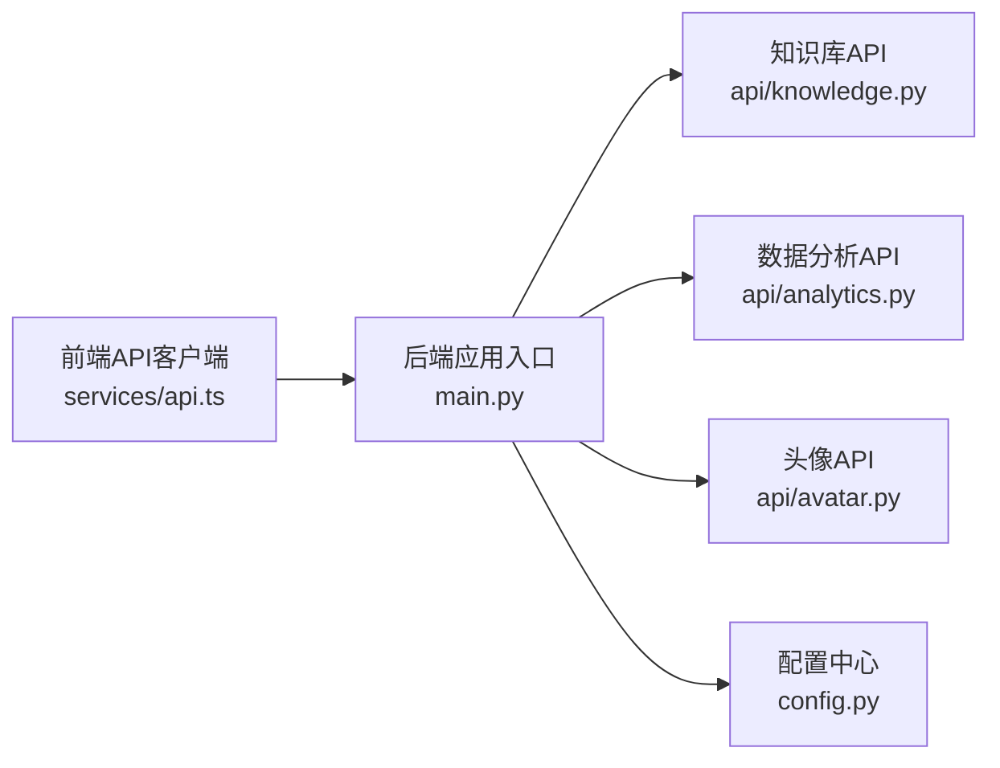

# API集成与服务通信

<cite>
**本文引用的文件**   
- [backend/app/main.py](file://backend/app/main.py)
- [backend/app/api/knowledge.py](file://backend/app/api/knowledge.py)
- [backend/app/api/analytics.py](file://backend/app/api/analytics.py)
- [backend/app/api/avatar.py](file://backend/app/api/avatar.py)
- [backend/app/config.py](file://backend/app/config.py)
- [frontend/admin-panel/src/services/api.ts](file://frontend/admin-panel/src/services/api.ts)
- [frontend/admin-panel/src/views/KnowledgeBase/KnowledgeView.vue](file://frontend/admin-panel/src/views/KnowledgeBase/KnowledgeView.vue)
- [frontend/admin-panel/src/views/Analytics/AnalyticsView.vue](file://frontend/admin-panel/src/views/Analytics/AnalyticsView.vue)
- [frontend/admin-panel/src/views/AvatarConfig/AvatarView.vue](file://frontend/admin-panel/src/views/AvatarConfig/AvatarView.vue)
</cite>

## 目录
1. [简介](#简介)
2. [项目结构](#项目结构)
3. [核心组件](#核心组件)
4. [架构总览](#架构总览)
5. [详细组件分析](#详细组件分析)
6. [依赖关系分析](#依赖关系分析)
7. [性能考虑](#性能考虑)
8. [故障排查指南](#故障排查指南)
9. [结论](#结论)
10. [附录](#附录)

## 简介
本技术文档聚焦于管理端的前后端API集成，覆盖HTTP请求封装、拦截器配置与错误处理策略；认证授权流程、Token管理与会话保持方案；请求参数校验、响应数据转换与类型安全保障；各管理模块（知识库管理、数据分析、头像配置）的完整调用示例；异步请求处理、并发控制与请求取消机制；以及API版本管理、向后兼容性与接口文档自动生成方案。文档旨在帮助开发者快速理解并稳定集成管理端API。

## 项目结构
本项目采用前后端分离架构：
- 后端基于Python服务，提供RESTful API，包含知识库、数据分析、头像等管理接口。
- 前端管理面板基于Vue工程，通过统一的HTTP客户端访问后端API，并在视图层进行业务编排。

图表来源
- [frontend/admin-panel/src/services/api.ts](file://frontend/admin-panel/src/services/api.ts)
- [frontend/admin-panel/src/views/KnowledgeBase/KnowledgeView.vue](file://frontend/admin-panel/src/views/KnowledgeBase/KnowledgeView.vue)
- [frontend/admin-panel/src/views/Analytics/AnalyticsView.vue](file://frontend/admin-panel/src/views/Analytics/AnalyticsView.vue)
- [frontend/admin-panel/src/views/AvatarConfig/AvatarView.vue](file://frontend/admin-panel/src/views/AvatarConfig/AvatarView.vue)
- [backend/app/main.py](file://backend/app/main.py)
- [backend/app/api/knowledge.py](file://backend/app/api/knowledge.py)
- [backend/app/api/analytics.py](file://backend/app/api/analytics.py)
- [backend/app/api/avatar.py](file://backend/app/api/avatar.py)
- [backend/app/config.py](file://backend/app/config.py)

章节来源
- [backend/app/main.py](file://backend/app/main.py)
- [backend/app/api/knowledge.py](file://backend/app/api/knowledge.py)
- [backend/app/api/analytics.py](file://backend/app/api/analytics.py)
- [backend/app/api/avatar.py](file://backend/app/api/avatar.py)
- [backend/app/config.py](file://backend/app/config.py)
- [frontend/admin-panel/src/services/api.ts](file://frontend/admin-panel/src/services/api.ts)
- [frontend/admin-panel/src/views/KnowledgeBase/KnowledgeView.vue](file://frontend/admin-panel/src/views/KnowledgeBase/KnowledgeView.vue)
- [frontend/admin-panel/src/views/Analytics/AnalyticsView.vue](file://frontend/admin-panel/src/views/Analytics/AnalyticsView.vue)
- [frontend/admin-panel/src/views/AvatarConfig/AvatarView.vue](file://frontend/admin-panel/src/views/AvatarConfig/AvatarView.vue)

## 核心组件
- 统一API客户端（前端）
  - 负责基础URL、超时、重试、拦截器（请求头注入、响应码处理）、错误分类与提示。
  - 提供类型安全的请求方法封装，确保入参与出参的类型约束。
- 路由与应用入口（后端）
  - 集中注册API路由，挂载中间件（如鉴权、限流、日志）。
  - 暴露版本化路径前缀，支持向后兼容。
- 领域API模块
  - 知识库管理：上传、检索、更新、删除知识条目。
  - 数据分析：统计指标查询、趋势聚合、导出。
  - 头像配置：上传头像、设置默认头像、获取头像列表。
- 配置中心（后端）
  - 管理跨域、端口、鉴权开关、Token有效期、限流阈值等。

章节来源
- [frontend/admin-panel/src/services/api.ts](file://frontend/admin-panel/src/services/api.ts)
- [backend/app/main.py](file://backend/app/main.py)
- [backend/app/api/knowledge.py](file://backend/app/api/knowledge.py)
- [backend/app/api/analytics.py](file://backend/app/api/analytics.py)
- [backend/app/api/avatar.py](file://backend/app/api/avatar.py)
- [backend/app/config.py](file://backend/app/config.py)

## 架构总览
管理端API通信的关键链路如下：
- 前端发起HTTP请求，经统一客户端拦截器处理（注入Token、签名、超时控制）。
- 后端接收请求，进入路由分发，执行鉴权中间件与业务逻辑。
- 返回结构化响应，前端根据状态码与数据类型进行转换与展示。

图表来源
- [frontend/admin-panel/src/services/api.ts](file://frontend/admin-panel/src/services/api.ts)
- [backend/app/main.py](file://backend/app/main.py)
- [backend/app/api/knowledge.py](file://backend/app/api/knowledge.py)
- [backend/app/api/analytics.py](file://backend/app/api/analytics.py)
- [backend/app/api/avatar.py](file://backend/app/api/avatar.py)

## 详细组件分析

### 统一API客户端（前端）
职责与能力
- 基础配置：基础URL、超时时间、重试次数、并发限制。
- 拦截器：
  - 请求拦截：自动附加Authorization头、请求ID、内容类型。
  - 响应拦截：统一错误码映射、网络异常捕获、Token过期刷新。
- 类型保障：对入参与出参进行类型定义与校验，避免运行时错误。
- 取消与并发：提供AbortController用于取消请求；使用队列或信号量控制并发度。

典型用法要点
- 为每个模块创建命名空间方法（如knowledge、analytics、avatar），减少重复代码。
- 将业务错误转换为可诊断的错误对象，便于UI提示与埋点上报。
- 对大文件上传与下载进行分片与进度回调。

章节来源
- [frontend/admin-panel/src/services/api.ts](file://frontend/admin-panel/src/services/api.ts)

### 知识库管理API
功能范围
- 上传知识条目：支持文本、文档解析后的结构化数据。
- 检索与过滤：按标签、时间、作者筛选。
- 更新与删除：幂等更新、软删除标记。
- 批量操作：批量导入/导出，带进度反馈。

请求与响应约定
- 路径前缀：/api/v1/knowledge
- 常用方法：POST /items、GET /items、PUT /items/{id}、DELETE /items/{id}
- 分页参数：page、size、sort、filter
- 响应体：统一包装{code, message, data}

调用示例（以视图为例）
- 在知识库视图中调用上传接口，显示进度条与成功提示。
- 在列表页调用分页查询接口，渲染表格与筛选条件。

章节来源
- [backend/app/api/knowledge.py](file://backend/app/api/knowledge.py)
- [frontend/admin-panel/src/views/KnowledgeBase/KnowledgeView.vue](file://frontend/admin-panel/src/views/KnowledgeBase/KnowledgeView.vue)

### 数据分析API
功能范围
- 指标查询：访问量、转化率、用户活跃度等。
- 趋势聚合：按日/周/月聚合，支持多指标对比。
- 导出：CSV/Excel导出，异步任务与回调通知。

请求与响应约定
- 路径前缀：/api/v1/analytics
- 常用方法：GET /metrics、GET /trends、POST /export
- 时间窗口：start_time、end_time、granularity
- 响应体：统一包装{code, message, data}

调用示例（以视图为例）
- 在数据分析视图中选择时间范围与指标，渲染折线图与柱状图。
- 触发导出任务后轮询任务状态，完成后下载文件。

章节来源
- [backend/app/api/analytics.py](file://backend/app/api/analytics.py)
- [frontend/admin-panel/src/views/Analytics/AnalyticsView.vue](file://frontend/admin-panel/src/views/Analytics/AnalyticsView.vue)

### 头像配置API
功能范围
- 上传头像：支持图片格式校验、尺寸限制、压缩。
- 设置默认头像：全局默认与角色默认。
- 头像列表：分页获取可用头像资源。

请求与响应约定
- 路径前缀：/api/v1/avatar
- 常用方法：POST /upload、PUT /default、GET /list
- 文件字段：multipart/form-data，字段名avatar
- 响应体：统一包装{code, message, data}

调用示例（以视图为例）
- 在头像配置视图中选择图片上传，预览并设置为默认。
- 失败时给出明确错误原因（格式不支持、尺寸过大等）。

章节来源
- [backend/app/api/avatar.py](file://backend/app/api/avatar.py)
- [frontend/admin-panel/src/views/AvatarConfig/AvatarView.vue](file://frontend/admin-panel/src/views/AvatarConfig/AvatarView.vue)

### 认证授权与Token管理
流程说明
- 登录成功后，服务端签发Token（含过期时间与权限声明）。
- 前端在每次请求中携带Authorization头，值为Bearer Token。
- 若Token过期，前端尝试刷新Token；刷新失败则跳转登录页。
- 鉴权中间件校验Token有效性及权限范围，拒绝无权限访问。

实现要点
- 前端拦截器统一注入Token，并提供刷新逻辑。
- 后端中间件集中校验，避免在每个接口重复实现。
- 敏感操作需二次确认或额外签名。

章节来源
- [backend/app/main.py](file://backend/app/main.py)
- [backend/app/config.py](file://backend/app/config.py)
- [frontend/admin-panel/src/services/api.ts](file://frontend/admin-panel/src/services/api.ts)

### 请求参数验证与响应转换
前端
- 使用类型定义与表单校验库，确保必填项、格式、范围正确。
- 对复杂对象进行深拷贝与规范化，避免引用污染。
- 响应数据转换：将后端统一包装解包为业务对象，补充默认值。

后端
- 使用Pydantic模型进行入参校验，返回清晰的错误信息。
- 响应序列化：统一输出格式，隐藏内部字段，保证稳定性。

章节来源
- [backend/app/api/knowledge.py](file://backend/app/api/knowledge.py)
- [backend/app/api/analytics.py](file://backend/app/api/analytics.py)
- [backend/app/api/avatar.py](file://backend/app/api/avatar.py)
- [frontend/admin-panel/src/services/api.ts](file://frontend/admin-panel/src/services/api.ts)

### 异步请求、并发控制与取消
前端
- 使用AbortController取消长时间等待的请求（如导出任务）。
- 使用并发队列限制同时进行的请求数，避免雪崩。
- 对长轮询或SSE进行连接管理与重连。

后端
- 对耗时任务采用异步处理与任务队列，返回任务ID供前端轮询。
- 限流与熔断保护关键接口，防止过载。

章节来源
- [frontend/admin-panel/src/services/api.ts](file://frontend/admin-panel/src/services/api.ts)
- [backend/app/main.py](file://backend/app/main.py)

### API版本管理与兼容性
策略建议
- 路径前缀版本化：/api/v1、/api/v2，逐步迁移旧接口。
- 字段级向后兼容：新增可选字段，保留旧字段至少两个大版本。
- 废弃策略：在响应头或文档中标注废弃字段，提供迁移指南。

章节来源
- [backend/app/main.py](file://backend/app/main.py)
- [backend/app/config.py](file://backend/app/config.py)

### 接口文档自动生成
方案建议
- 后端使用OpenAPI/Swagger生成文档，结合版本前缀与鉴权注解。
- 前端在开发环境加载在线文档，联调时对照契约。
- CI中校验接口变更，确保文档与实现一致。

章节来源
- [backend/app/main.py](file://backend/app/main.py)
- [backend/app/config.py](file://backend/app/config.py)

## 依赖关系分析

图表来源
- [frontend/admin-panel/src/services/api.ts](file://frontend/admin-panel/src/services/api.ts)
- [backend/app/main.py](file://backend/app/main.py)
- [backend/app/api/knowledge.py](file://backend/app/api/knowledge.py)
- [backend/app/api/analytics.py](file://backend/app/api/analytics.py)
- [backend/app/api/avatar.py](file://backend/app/api/avatar.py)
- [backend/app/config.py](file://backend/app/config.py)

章节来源
- [frontend/admin-panel/src/services/api.ts](file://frontend/admin-panel/src/services/api.ts)
- [backend/app/main.py](file://backend/app/main.py)
- [backend/app/api/knowledge.py](file://backend/app/api/knowledge.py)
- [backend/app/api/analytics.py](file://backend/app/api/analytics.py)
- [backend/app/api/avatar.py](file://backend/app/api/avatar.py)
- [backend/app/config.py](file://backend/app/config.py)

## 性能考虑
- 前端
  - 合理设置超时与重试，避免频繁无效请求。
  - 使用缓存策略（如最近查询结果）减少重复请求。
  - 对大数据集分页加载与虚拟滚动，降低渲染压力。
- 后端
  - 数据库查询优化：索引、分页、只取必要字段。
  - 接口限流与熔断，保护系统稳定性。
  - 静态资源与头像文件走CDN，减轻主服务负载。

[本节为通用指导，不直接分析具体文件]

## 故障排查指南
常见问题与定位步骤
- 401未授权：检查Token是否过期或丢失，确认拦截器是否正确注入Authorization头。
- 403权限不足：核对用户角色与接口权限声明，必要时申请更高权限。
- 422参数校验失败：查看后端返回的错误详情，修正前端表单校验规则。
- 500服务器错误：查看后端日志，定位异常堆栈与输入数据。
- 网络超时：调整前端超时时间，检查后端耗时任务与队列堆积情况。

章节来源
- [frontend/admin-panel/src/services/api.ts](file://frontend/admin-panel/src/services/api.ts)
- [backend/app/main.py](file://backend/app/main.py)

## 结论
通过统一的API客户端与标准化的后端响应，管理端实现了高内聚、低耦合的API集成。配合完善的鉴权、校验、错误处理与版本管理策略，系统在易用性、稳定性与可维护性方面具备良好基础。建议在后续迭代中持续完善文档自动化与监控告警，进一步提升交付质量与运维效率。

[本节为总结性内容，不直接分析具体文件]

## 附录
- 术语表
  - Token：身份令牌，用于鉴权与授权。
  - 拦截器：在请求发送前或响应返回后进行处理的中间件。
  - 幂等：多次执行同一请求产生相同效果。
- 最佳实践清单
  - 所有管理端接口必须经过鉴权中间件。
  - 统一错误码与消息格式，便于前端统一处理。
  - 对敏感操作增加二次确认与审计日志。
  - 接口变更遵循版本化与向后兼容原则。

[本节为概念性内容，不直接分析具体文件]