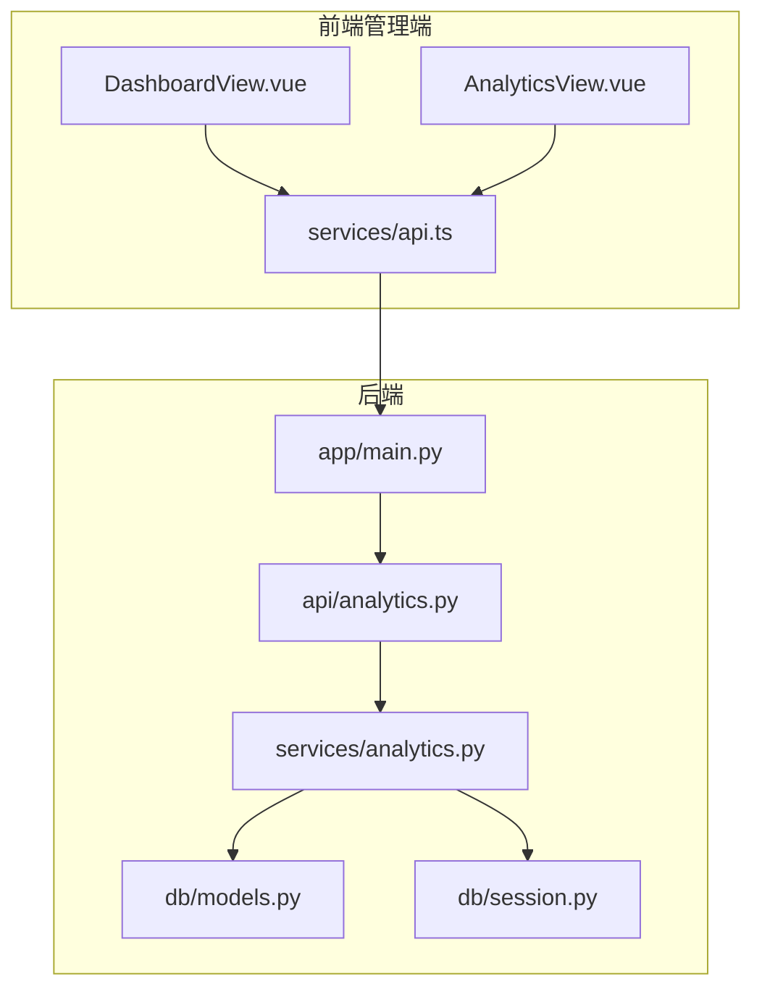
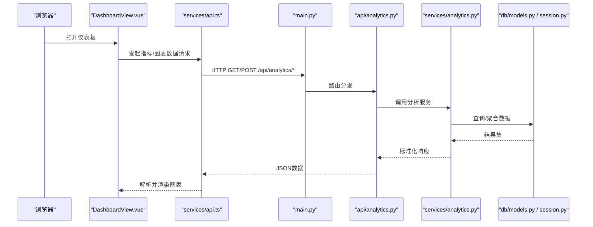
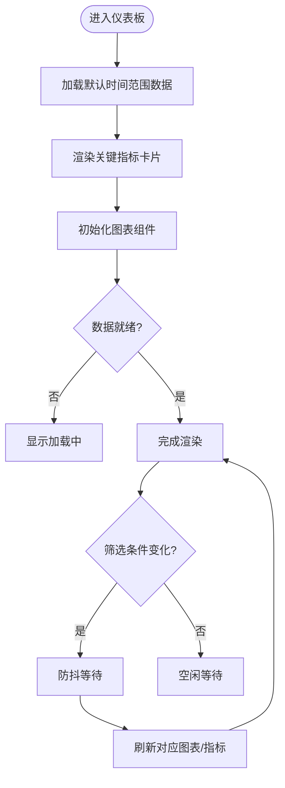
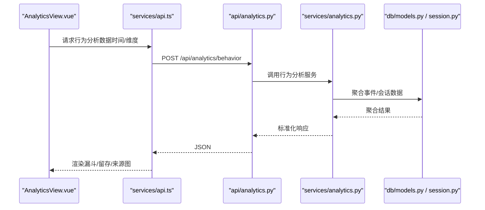
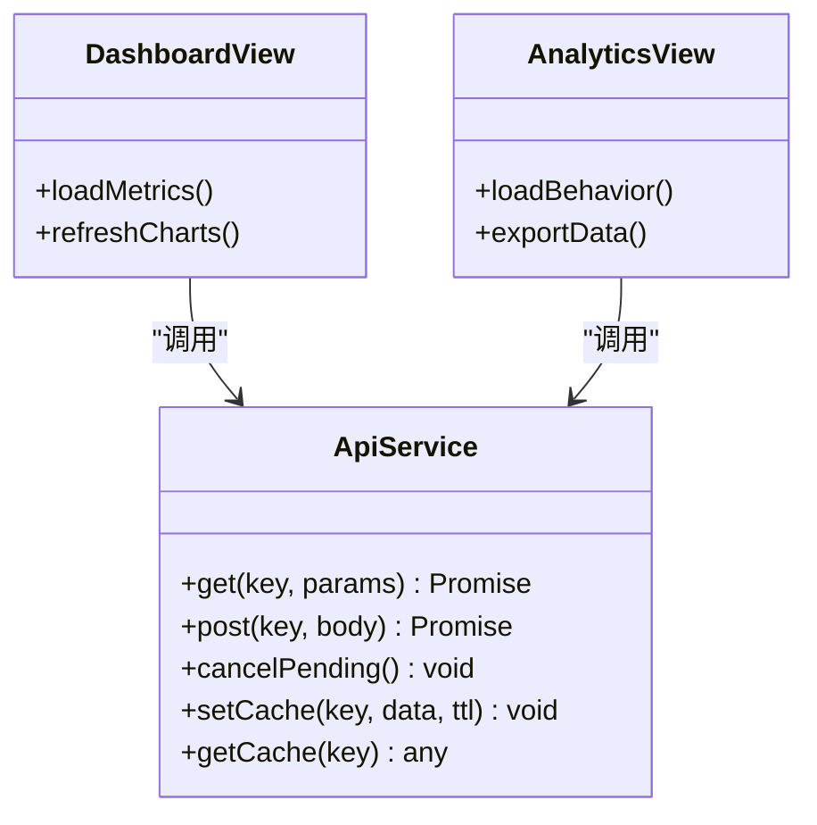
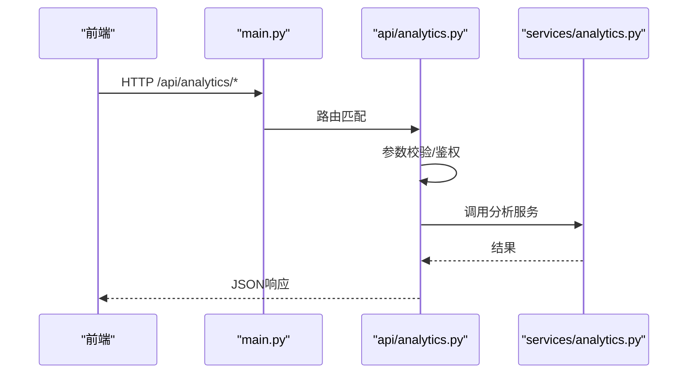
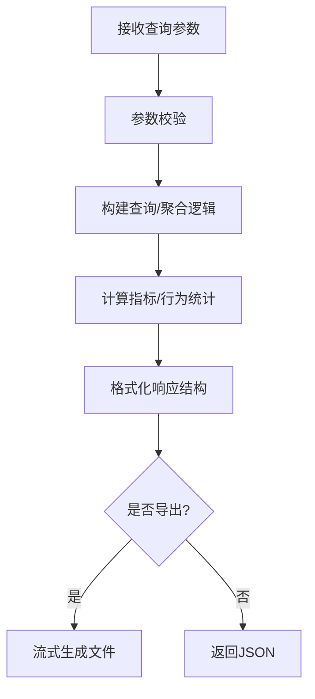
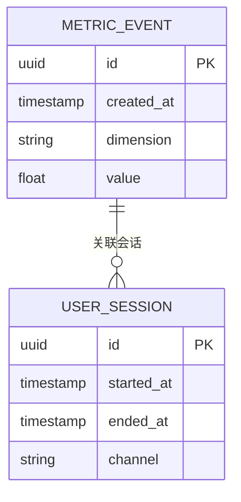
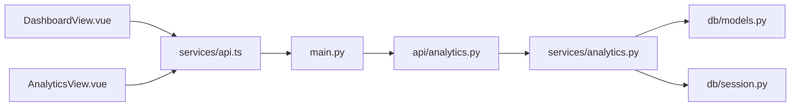

# 仪表盘模块

<cite>
**本文引用的文件**   
- [DashboardView.vue](file://frontend/admin-panel/src/views/Dashboard/DashboardView.vue)
- [AnalyticsView.vue](file://frontend/admin-panel/src/views/Analytics/AnalyticsView.vue)
- [api.ts（管理端）](file://frontend/admin-panel/src/services/api.ts)
- [analytics.py（后端API）](file://backend/app/api/analytics.py)
- [analytics.py（后端服务）](file://backend/app/services/analytics.py)
- [models.py（数据库模型）](file://backend/app/db/models.py)
- [session.py（数据库会话）](file://backend/app/db/session.py)
- [main.py（后端入口）](file://backend/app/main.py)
</cite>

## 目录
1. [简介](#简介)
2. [项目结构](#项目结构)
3. [核心组件](#核心组件)
4. [架构总览](#架构总览)
5. [详细组件分析](#详细组件分析)
6. [依赖关系分析](#依赖关系分析)
7. [性能考虑](#性能考虑)
8. [故障排查指南](#故障排查指南)
9. [结论](#结论)
10. [附录](#附录)

## 简介
本文件面向“系统概览仪表板”的实现与使用，覆盖关键指标展示、实时数据统计、图表可视化组件、用户行为分析面板等能力。文档从前端到后端完整梳理数据获取机制、图表渲染策略、刷新方案与性能优化方法，并提供配置项说明、自定义指标扩展方式、数据导出实现路径以及常见问题排查建议。

## 项目结构
仪表板功能横跨前后端：
- 前端管理端包含仪表板与分析视图，负责指标卡片、图表渲染、交互与响应式布局。
- 后端提供分析相关API与服务层，聚合业务数据并返回给前端。
- 数据库模型与会话用于持久化查询支撑。

**图示来源** 
- [DashboardView.vue](file://frontend/admin-panel/src/views/Dashboard/DashboardView.vue)
- [AnalyticsView.vue](file://frontend/admin-panel/src/views/Analytics/AnalyticsView.vue)
- [api.ts（管理端）](file://frontend/admin-panel/src/services/api.ts)
- [main.py（后端入口）](file://backend/app/main.py)
- [analytics.py（后端API）](file://backend/app/api/analytics.py)
- [analytics.py（后端服务）](file://backend/app/services/analytics.py)
- [models.py（数据库模型）](file://backend/app/db/models.py)
- [session.py（数据库会话）](file://backend/app/db/session.py)

**章节来源**
- [DashboardView.vue](file://frontend/admin-panel/src/views/Dashboard/DashboardView.vue)
- [AnalyticsView.vue](file://frontend/admin-panel/src/views/Analytics/AnalyticsView.vue)
- [api.ts（管理端）](file://frontend/admin-panel/src/services/api.ts)
- [main.py（后端入口）](file://backend/app/main.py)
- [analytics.py（后端API）](file://backend/app/api/analytics.py)
- [analytics.py（后端服务）](file://backend/app/services/analytics.py)
- [models.py（数据库模型）](file://backend/app/db/models.py)
- [session.py（数据库会话）](file://backend/app/db/session.py)

## 核心组件
- 仪表板视图：承载关键指标卡片、趋势图、分布图等，支持时间范围筛选与联动。
- 分析视图：聚焦用户行为分析，如访问来源、渠道转化、留存曲线等。
- 前端API服务：封装统一请求、错误处理、重试与缓存策略。
- 后端分析API：定义REST接口，接收查询参数，调用服务层聚合数据。
- 分析服务：组合多源数据，执行统计计算，输出标准化JSON。
- 数据模型与会话：提供ORM映射与连接管理，支撑高效查询。

**章节来源**
- [DashboardView.vue](file://frontend/admin-panel/src/views/Dashboard/DashboardView.vue)
- [AnalyticsView.vue](file://frontend/admin-panel/src/views/Analytics/AnalyticsView.vue)
- [api.ts（管理端）](file://frontend/admin-panel/src/services/api.ts)
- [analytics.py（后端API）](file://backend/app/api/analytics.py)
- [analytics.py（后端服务）](file://backend/app/services/analytics.py)
- [models.py（数据库模型）](file://backend/app/db/models.py)
- [session.py（数据库会话）](file://backend/app/db/session.py)

## 架构总览
仪表板采用前后端分离架构，前端通过HTTP调用后端分析接口，后端基于数据库模型进行聚合计算后返回结构化数据。

**图示来源** 
- [DashboardView.vue](file://frontend/admin-panel/src/views/Dashboard/DashboardView.vue)
- [api.ts（管理端）](file://frontend/admin-panel/src/services/api.ts)
- [main.py（后端入口）](file://backend/app/main.py)
- [analytics.py（后端API）](file://backend/app/api/analytics.py)
- [analytics.py（后端服务）](file://backend/app/services/analytics.py)
- [models.py（数据库模型）](file://backend/app/db/models.py)
- [session.py（数据库会话）](file://backend/app/db/session.py)

## 详细组件分析

### 仪表板视图（DashboardView.vue）
- 职责：组织指标卡片、图表容器、筛选器；协调数据加载与刷新；处理响应式布局与移动端适配。
- 关键流程：
  - 初始化时按默认时间范围拉取关键指标与图表数据。
  - 监听筛选条件变化，触发增量更新或全量刷新。
  - 对图表实例进行销毁重建或数据更新，避免内存泄漏。
- 交互体验：
  - 提供时间范围选择、维度切换、图表联动。
  - 空状态与错误态提示，提升可用性。
- 性能优化：
  - 防抖/节流减少频繁刷新。
  - 按需加载图表库，延迟初始化非首屏图表。
  - 大数据集采样与分页渲染。

**图示来源** 
- [DashboardView.vue](file://frontend/admin-panel/src/views/Dashboard/DashboardView.vue)
- [api.ts（管理端）](file://frontend/admin-panel/src/services/api.ts)

**章节来源**
- [DashboardView.vue](file://frontend/admin-panel/src/views/Dashboard/DashboardView.vue)
- [api.ts（管理端）](file://frontend/admin-panel/src/services/api.ts)

### 分析视图（AnalyticsView.vue）
- 职责：呈现用户行为分析面板，包括来源分布、渠道转化漏斗、留存曲线等。
- 关键流程：
  - 根据选择的日期区间与维度聚合行为事件。
  - 将聚合结果转换为图表所需数据结构。
  - 支持导出为CSV/Excel，便于离线分析。
- 交互体验：
  - 多维筛选、下钻查看明细。
  - 图表缩放、图例点击过滤。
- 性能优化：
  - 服务端分页与限流。
  - 客户端缓存最近一次查询结果。

**图示来源** 
- [AnalyticsView.vue](file://frontend/admin-panel/src/views/Analytics/AnalyticsView.vue)
- [api.ts（管理端）](file://frontend/admin-panel/src/services/api.ts)
- [analytics.py（后端API）](file://backend/app/api/analytics.py)
- [analytics.py（后端服务）](file://backend/app/services/analytics.py)
- [models.py（数据库模型）](file://backend/app/db/models.py)
- [session.py（数据库会话）](file://backend/app/db/session.py)

**章节来源**
- [AnalyticsView.vue](file://frontend/admin-panel/src/views/Analytics/AnalyticsView.vue)
- [api.ts（管理端）](file://frontend/admin-panel/src/services/api.ts)
- [analytics.py（后端API）](file://backend/app/api/analytics.py)
- [analytics.py（后端服务）](file://backend/app/services/analytics.py)
- [models.py（数据库模型）](file://backend/app/db/models.py)
- [session.py（数据库会话）](file://backend/app/db/session.py)

### 前端API服务（services/api.ts）
- 职责：统一封装HTTP请求、错误处理、重试与缓存；提供指标与分析数据的获取方法。
- 关键点：
  - 请求拦截：附加认证头、超时控制、重试策略。
  - 响应拦截：统一错误码处理、降级策略。
  - 缓存策略：针对只读指标设置短期缓存，减少重复请求。
  - 取消请求：页面切换或筛选变更时取消未完成的请求。

**图示来源** 
- [api.ts（管理端）](file://frontend/admin-panel/src/services/api.ts)
- [DashboardView.vue](file://frontend/admin-panel/src/views/Dashboard/DashboardView.vue)
- [AnalyticsView.vue](file://frontend/admin-panel/src/views/Analytics/AnalyticsView.vue)

**章节来源**
- [api.ts（管理端）](file://frontend/admin-panel/src/services/api.ts)

### 后端分析API（api/analytics.py）
- 职责：定义REST接口，接收查询参数，校验输入，调用服务层并返回标准JSON。
- 关键点：
  - 参数校验：时间范围、维度枚举、分页大小限制。
  - 权限控制：管理员鉴权。
  - 错误处理：统一异常捕获与错误码。

**图示来源** 
- [main.py（后端入口）](file://backend/app/main.py)
- [analytics.py（后端API）](file://backend/app/api/analytics.py)
- [analytics.py（后端服务）](file://backend/app/services/analytics.py)

**章节来源**
- [analytics.py（后端API）](file://backend/app/api/analytics.py)
- [main.py（后端入口）](file://backend/app/main.py)

### 后端分析服务（services/analytics.py）
- 职责：聚合业务数据，计算关键指标与行为分析结果，输出稳定结构。
- 关键点：
  - 数据聚合：按时间窗口、维度分组统计。
  - 指标计算：转化率、留存率、活跃数等。
  - 数据导出：生成CSV/Excel流式响应。

**图示来源** 
- [analytics.py（后端服务）](file://backend/app/services/analytics.py)
- [models.py（数据库模型）](file://backend/app/db/models.py)
- [session.py（数据库会话）](file://backend/app/db/session.py)

**章节来源**
- [analytics.py（后端服务）](file://backend/app/services/analytics.py)
- [models.py（数据库模型）](file://backend/app/db/models.py)
- [session.py（数据库会话）](file://backend/app/db/session.py)

### 数据模型与会话（db/models.py / db/session.py）
- 职责：定义实体表结构与字段约束，提供数据库连接与会话管理。
- 关键点：
  - 索引设计：对常用查询字段建立索引以提升聚合性能。
  - 连接池：合理配置最大连接数与超时。
  - 事务管理：保证写入一致性。

**图示来源** 
- [models.py（数据库模型）](file://backend/app/db/models.py)
- [session.py（数据库会话）](file://backend/app/db/session.py)

**章节来源**
- [models.py（数据库模型）](file://backend/app/db/models.py)
- [session.py（数据库会话）](file://backend/app/db/session.py)

## 依赖关系分析
- 前端依赖：
  - 视图组件依赖API服务进行数据获取。
  - 图表渲染可基于ECharts或Chart.js（具体选择取决于前端工程配置）。
- 后端依赖：
  - API路由依赖主应用入口注册。
  - 服务层依赖数据库模型与会话进行数据访问。

**图示来源** 
- [DashboardView.vue](file://frontend/admin-panel/src/views/Dashboard/DashboardView.vue)
- [AnalyticsView.vue](file://frontend/admin-panel/src/views/Analytics/AnalyticsView.vue)
- [api.ts（管理端）](file://frontend/admin-panel/src/services/api.ts)
- [main.py（后端入口）](file://backend/app/main.py)
- [analytics.py（后端API）](file://backend/app/api/analytics.py)
- [analytics.py（后端服务）](file://backend/app/services/analytics.py)
- [models.py（数据库模型）](file://backend/app/db/models.py)
- [session.py（数据库会话）](file://backend/app/db/session.py)

**章节来源**
- [DashboardView.vue](file://frontend/admin-panel/src/views/Dashboard/DashboardView.vue)
- [AnalyticsView.vue](file://frontend/admin-panel/src/views/Analytics/AnalyticsView.vue)
- [api.ts（管理端）](file://frontend/admin-panel/src/services/api.ts)
- [main.py（后端入口）](file://backend/app/main.py)
- [analytics.py（后端API）](file://backend/app/api/analytics.py)
- [analytics.py（后端服务）](file://backend/app/services/analytics.py)
- [models.py（数据库模型）](file://backend/app/db/models.py)
- [session.py（数据库会话）](file://backend/app/db/session.py)

## 性能考虑
- 前端优化
  - 图表按需加载与懒初始化，避免首屏阻塞。
  - 大数据集采样、虚拟滚动与分页渲染。
  - 防抖/节流减少高频刷新；取消过期请求。
  - 本地缓存只读指标，缩短二次访问延迟。
- 后端优化
  - 聚合查询加索引，避免全表扫描。
  - 分页与限流，防止大查询导致资源耗尽。
  - 流式导出，降低内存峰值。
  - 连接池与超时配置，提高并发稳定性。
- 网络优化
  - 压缩响应体，启用Gzip/Brotli。
  - CDN缓存静态资源，减少带宽占用。

[本节为通用指导，不直接分析具体文件]

## 故障排查指南
- 前端问题
  - 图表不渲染：检查图表实例生命周期与DOM挂载时机。
  - 数据为空：确认API返回结构与字段名一致。
  - 请求失败：查看网络面板错误码与后端日志。
- 后端问题
  - 接口报错：核对参数校验与鉴权逻辑。
  - 查询缓慢：检查SQL执行计划与索引命中。
  - 导出失败：确认文件流写入权限与磁盘空间。
- 数据库问题
  - 连接池耗尽：调整最大连接数与超时。
  - 死锁：分析事务边界与锁竞争点。

**章节来源**
- [api.ts（管理端）](file://frontend/admin-panel/src/services/api.ts)
- [analytics.py（后端API）](file://backend/app/api/analytics.py)
- [analytics.py（后端服务）](file://backend/app/services/analytics.py)
- [models.py（数据库模型）](file://backend/app/db/models.py)
- [session.py（数据库会话）](file://backend/app/db/session.py)

## 结论
仪表板模块通过清晰的前后端分层与稳定的数据流转，实现了关键指标展示、实时统计与用户行为分析。结合合理的刷新策略、图表渲染优化与后端聚合性能调优，可在高并发场景下保持良好用户体验。后续可扩展更多自定义指标与导出格式，进一步提升数据分析能力。

[本节为总结性内容，不直接分析具体文件]

## 附录

### 仪表盘配置选项
- 时间范围：默认/自定义起止时间，支持快捷模板。
- 维度选择：地区、渠道、设备类型等。
- 刷新策略：手动刷新、定时轮询、WebSocket推送（可选）。
- 图表主题：明暗主题、颜色方案、字体大小。
- 导出格式：CSV、Excel、PDF（可选）。

[本节为概念性说明，不直接分析具体文件]

### 自定义指标添加方法
- 前端
  - 在API服务中新增指标获取方法。
  - 在仪表板视图中增加指标卡片与图表渲染逻辑。
- 后端
  - 在服务层新增指标计算逻辑。
  - 在API层暴露新接口，完善参数校验与错误处理。
  - 在数据模型中补充必要字段与索引。

**章节来源**
- [api.ts（管理端）](file://frontend/admin-panel/src/services/api.ts)
- [DashboardView.vue](file://frontend/admin-panel/src/views/Dashboard/DashboardView.vue)
- [analytics.py（后端服务）](file://backend/app/services/analytics.py)
- [analytics.py（后端API）](file://backend/app/api/analytics.py)
- [models.py（数据库模型）](file://backend/app/db/models.py)

### 数据导出功能实现指南
- 前端
  - 调用导出接口，处理二进制流下载。
  - 提供文件名与格式选择。
- 后端
  - 在服务层生成数据文件流。
  - 在API层设置正确的Content-Type与Content-Disposition。
  - 支持断点续传与进度反馈（可选）。

**章节来源**
- [api.ts（管理端）](file://frontend/admin-panel/src/services/api.ts)
- [analytics.py（后端服务）](file://backend/app/services/analytics.py)
- [analytics.py（后端API）](file://backend/app/api/analytics.py)

### 图表渲染引擎选择
- ECharts：适合复杂图表与大数据量，生态丰富。
- Chart.js：轻量易用，适合基础图表与快速集成。
- 选择建议：根据图表复杂度、性能需求与团队技术栈决定。

[本节为概念性说明，不直接分析具体文件]

### 数据刷新策略
- 轮询：固定间隔拉取最新数据，简单可靠。
- 长轮询：服务端挂起直到有新数据，降低无效请求。
- WebSocket：双向通信，实时推送，适合高频更新场景。
- 事件驱动：基于业务事件触发刷新，精准高效。

[本节为概念性说明，不直接分析具体文件]

### 响应式布局与移动端适配
- 栅格系统：按屏幕宽度动态调整列数与间距。
- 图表自适应：监听容器尺寸变化，重绘图表。
- 触控优化：放大缩小、滑动切换、长按详情。
- 性能优先：移动端减少同时渲染的图表数量。

[本节为概念性说明，不直接分析具体文件]