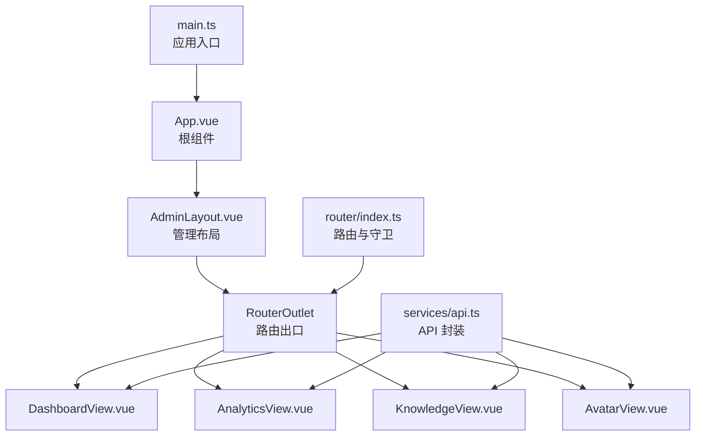
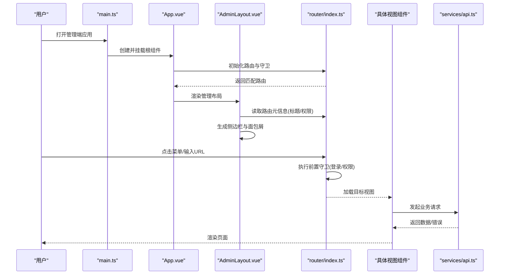
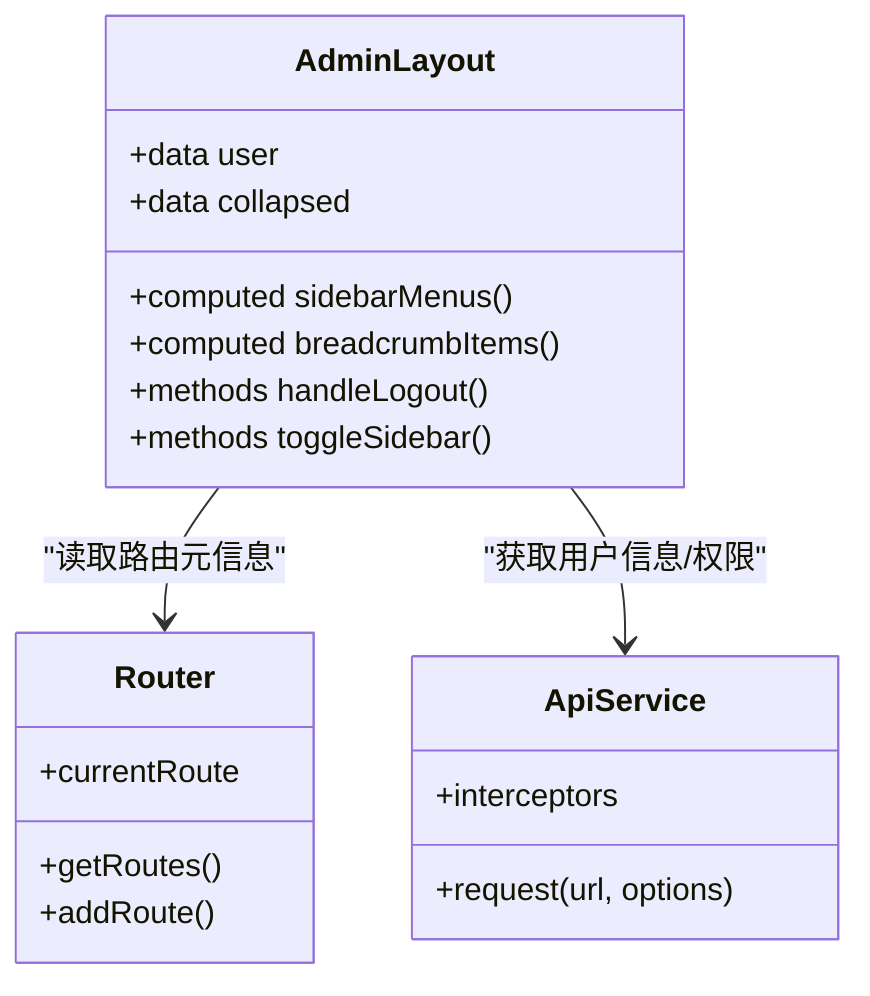
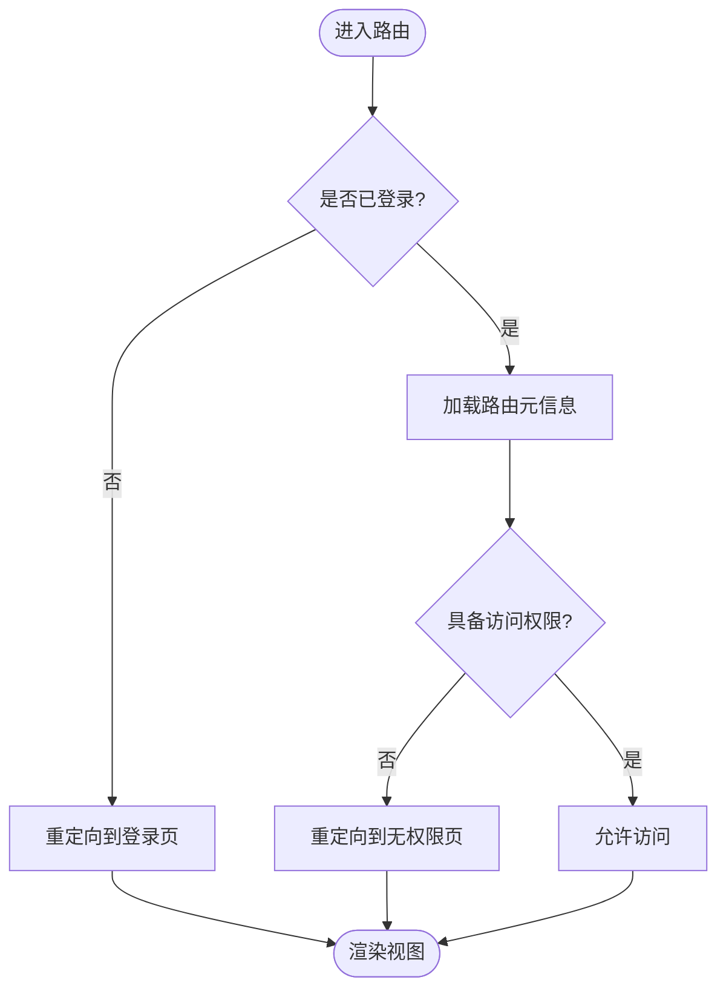
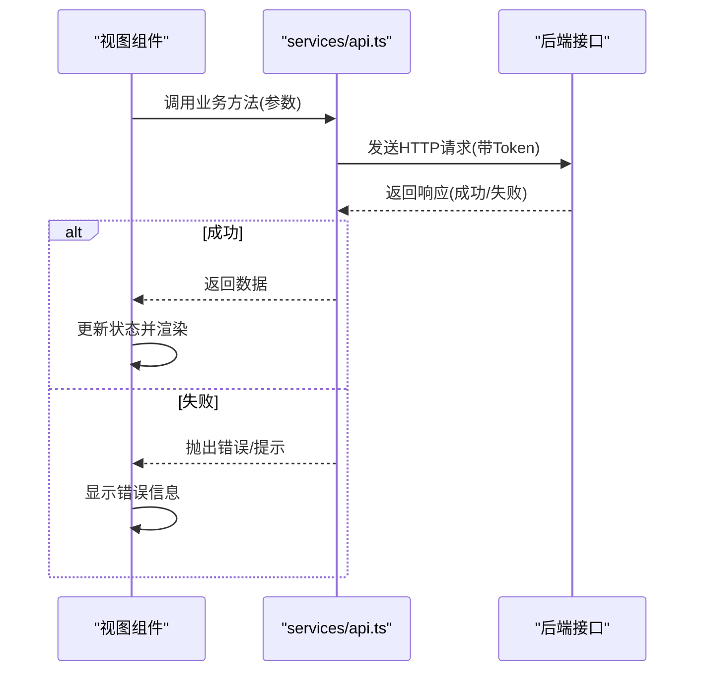
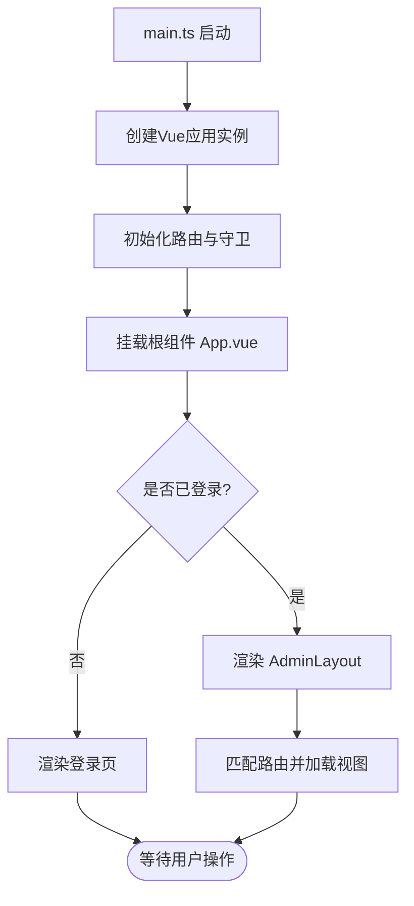
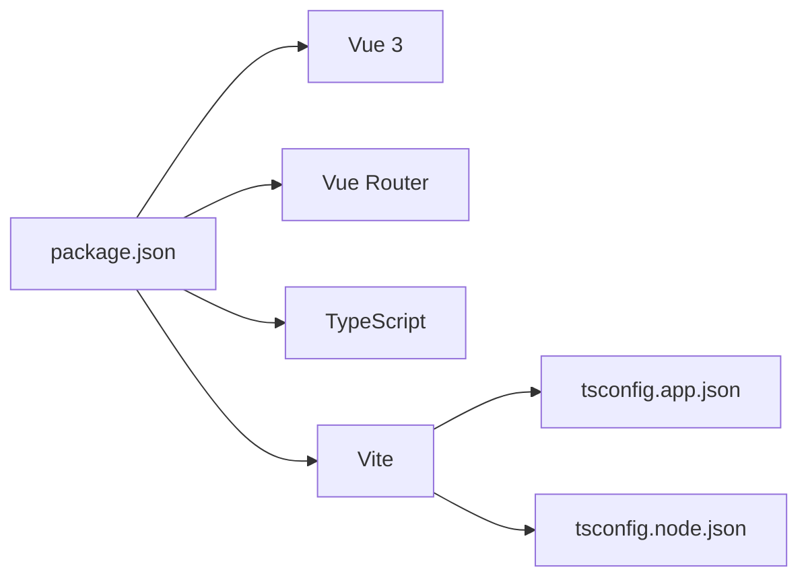

# 应用架构与路由设计

<cite>
**本文引用的文件**   
- [frontend/admin-panel/src/main.ts](file://frontend/admin-panel/src/main.ts)
- [frontend/admin-panel/src/App.vue](file://frontend/admin-panel/src/App.vue)
- [frontend/admin-panel/src/layout/AdminLayout.vue](file://frontend/admin-panel/src/layout/AdminLayout.vue)
- [frontend/admin-panel/src/router/index.ts](file://frontend/admin-panel/src/router/index.ts)
- [frontend/admin-panel/src/services/api.ts](file://frontend/admin-panel/src/services/api.ts)
- [frontend/admin-panel/src/views/Dashboard/DashboardView.vue](file://frontend/admin-panel/src/views/Dashboard/DashboardView.vue)
- [frontend/admin-panel/src/views/Analytics/AnalyticsView.vue](file://frontend/admin-panel/src/views/Analytics/AnalyticsView.vue)
- [frontend/admin-panel/src/views/KnowledgeBase/KnowledgeView.vue](file://frontend/admin-panel/src/views/KnowledgeBase/KnowledgeView.vue)
- [frontend/admin-panel/src/views/AvatarConfig/AvatarView.vue](file://frontend/admin-panel/src/views/AvatarConfig/AvatarView.vue)
- [frontend/admin-panel/vite.config.ts](file://frontend/admin-panel/vite.config.ts)
- [frontend/admin-panel/package.json](file://frontend/admin-panel/package.json)
- [frontend/admin-panel/tsconfig.app.json](file://frontend/admin-panel/tsconfig.app.json)
- [frontend/admin-panel/tsconfig.node.json](file://frontend/admin-panel/tsconfig.node.json)
- [frontend/admin-panel/Dockerfile](file://frontend/admin-panel/Dockerfile)
- [frontend/admin-panel/nginx.conf](file://frontend/admin-panel/nginx.conf)
</cite>

## 目录
1. [简介](#简介)
2. [项目结构](#项目结构)
3. [核心组件](#核心组件)
4. [架构总览](#架构总览)
5. [详细组件分析](#详细组件分析)
6. [依赖关系分析](#依赖关系分析)
7. [性能考虑](#性能考虑)
8. [故障排查指南](#故障排查指南)
9. [结论](#结论)
10. [附录](#附录)

## 简介
本文件聚焦于管理端应用（admin-panel）的架构设计与实现，围绕 Vue 3 + TypeScript 技术栈，系统阐述应用初始化流程、路由配置策略、布局组件设计与状态管理模式。重点解析 AdminLayout 布局组件的实现原理（侧边栏导航、面包屑导航、用户信息展示与权限控制），并说明路由守卫、动态路由加载与页面级权限验证机制。文档同时提供应用启动流程图、组件层次结构与数据流向图，以及开发环境配置、构建优化与部署策略的技术细节。

## 项目结构
管理端应用位于 frontend/admin-panel 目录下，采用按功能域与职责分层组织：
- src/main.ts：应用入口，负责创建 Vue 实例、挂载根组件、注册插件与全局配置。
- src/App.vue：根组件，承载路由出口与全局样式/容器。
- src/layout/AdminLayout.vue：管理后台主布局，包含侧边栏、顶部栏、面包屑与内容区。
- src/router/index.ts：路由定义与守卫逻辑，集中管理静态/动态路由与权限校验。
- src/services/api.ts：HTTP 客户端封装，统一请求拦截、错误处理与基础地址配置。
- src/views/*：页面视图组件，按业务模块划分（Dashboard、Analytics、KnowledgeBase、AvatarConfig）。
- vite.config.ts：Vite 构建配置，含代理、别名、插件等。
- package.json：依赖与脚本定义。
- tsconfig.*：TypeScript 编译配置。
- Dockerfile 与 nginx.conf：容器化与反向代理配置。

图表来源
- [frontend/admin-panel/src/main.ts](file://frontend/admin-panel/src/main.ts)
- [frontend/admin-panel/src/App.vue](file://frontend/admin-panel/src/App.vue)
- [frontend/admin-panel/src/layout/AdminLayout.vue](file://frontend/admin-panel/src/layout/AdminLayout.vue)
- [frontend/admin-panel/src/router/index.ts](file://frontend/admin-panel/src/router/index.ts)
- [frontend/admin-panel/src/services/api.ts](file://frontend/admin-panel/src/services/api.ts)
- [frontend/admin-panel/src/views/Dashboard/DashboardView.vue](file://frontend/admin-panel/src/views/Dashboard/DashboardView.vue)
- [frontend/admin-panel/src/views/Analytics/AnalyticsView.vue](file://frontend/admin-panel/src/views/Analytics/AnalyticsView.vue)
- [frontend/admin-panel/src/views/KnowledgeBase/KnowledgeView.vue](file://frontend/admin-panel/src/views/KnowledgeBase/KnowledgeView.vue)
- [frontend/admin-panel/src/views/AvatarConfig/AvatarView.vue](file://frontend/admin-panel/src/views/AvatarConfig/AvatarView.vue)

章节来源
- [frontend/admin-panel/src/main.ts](file://frontend/admin-panel/src/main.ts)
- [frontend/admin-panel/src/App.vue](file://frontend/admin-panel/src/App.vue)
- [frontend/admin-panel/src/layout/AdminLayout.vue](file://frontend/admin-panel/src/layout/AdminLayout.vue)
- [frontend/admin-panel/src/router/index.ts](file://frontend/admin-panel/src/router/index.ts)
- [frontend/admin-panel/src/services/api.ts](file://frontend/admin-panel/src/services/api.ts)
- [frontend/admin-panel/src/views/Dashboard/DashboardView.vue](file://frontend/admin-panel/src/views/Dashboard/DashboardView.vue)
- [frontend/admin-panel/src/views/Analytics/AnalyticsView.vue](file://frontend/admin-panel/src/views/Analytics/AnalyticsView.vue)
- [frontend/admin-panel/src/views/KnowledgeBase/KnowledgeView.vue](file://frontend/admin-panel/src/views/KnowledgeBase/KnowledgeView.vue)
- [frontend/admin-panel/src/views/AvatarConfig/AvatarView.vue](file://frontend/admin-panel/src/views/AvatarConfig/AvatarView.vue)

## 核心组件
- 应用入口 main.ts
  - 职责：创建 Vue 应用实例、安装必要插件、挂载到 DOM、注入全局配置（如 API 基础地址、主题等）。
  - 关键点：确保在挂载前完成路由、全局状态与拦截器的初始化。
- 根组件 App.vue
  - 职责：作为应用外壳，渲染 RouterOutlet 或根据登录态切换布局。
  - 关键点：可在此处设置全局样式、错误边界与全局提示。
- 管理布局 AdminLayout.vue
  - 职责：提供统一的后台界面骨架，包括侧边栏导航、顶部栏（用户信息与操作）、面包屑导航与主内容区。
  - 关键点：
    - 侧边栏：基于路由元信息生成菜单项，支持折叠与高亮当前路径。
    - 面包屑：根据路由层级自动计算并显示。
    - 用户信息：从全局状态或本地存储读取，支持退出与切换。
    - 权限控制：结合路由元信息与用户角色进行可见性过滤与按钮级权限控制。
- 路由 router/index.ts
  - 职责：集中定义静态路由与动态路由，配置路由元信息（标题、图标、权限标识），实现前置守卫与异步路由加载。
  - 关键点：
    - 静态路由：登录页、404、公共页面。
    - 动态路由：根据用户角色/权限在服务端或本地配置中拉取后合并。
    - 路由守卫：校验登录态、权限、刷新令牌；未授权跳转至登录或无权限页。
- API 服务 services/api.ts
  - 职责：封装 HTTP 请求，统一处理鉴权头、错误码、重试与超时。
  - 关键点：请求拦截器附加 Token，响应拦截器处理 401/403 与业务错误码。

章节来源
- [frontend/admin-panel/src/main.ts](file://frontend/admin-panel/src/main.ts)
- [frontend/admin-panel/src/App.vue](file://frontend/admin-panel/src/App.vue)
- [frontend/admin-panel/src/layout/AdminLayout.vue](file://frontend/admin-panel/src/layout/AdminLayout.vue)
- [frontend/admin-panel/src/router/index.ts](file://frontend/admin-panel/src/router/index.ts)
- [frontend/admin-panel/src/services/api.ts](file://frontend/admin-panel/src/services/api.ts)

## 架构总览
管理端应用采用“布局驱动 + 路由中心”的架构模式：
- 入口层：main.ts 初始化应用与全局依赖。
- 壳层：App.vue 决定渲染哪个布局（如登录后使用 AdminLayout）。
- 布局层：AdminLayout 提供通用 UI 框架与上下文（用户信息、面包屑、侧边栏）。
- 路由层：router/index.ts 管理页面映射、元信息与访问控制。
- 视图层：各业务 View 组件通过 API 服务获取数据并渲染。
- 服务层：api.ts 统一网络通信与错误处理。

图表来源
- [frontend/admin-panel/src/main.ts](file://frontend/admin-panel/src/main.ts)
- [frontend/admin-panel/src/App.vue](file://frontend/admin-panel/src/App.vue)
- [frontend/admin-panel/src/layout/AdminLayout.vue](file://frontend/admin-panel/src/layout/AdminLayout.vue)
- [frontend/admin-panel/src/router/index.ts](file://frontend/admin-panel/src/router/index.ts)
- [frontend/admin-panel/src/services/api.ts](file://frontend/admin-panel/src/services/api.ts)

## 详细组件分析

### AdminLayout 布局组件
AdminLayout 是管理后台的核心容器，承担以下职责：
- 侧边栏导航
  - 数据来源：路由元信息（如 title、icon、roles/permissions）。
  - 行为：根据用户权限过滤菜单项，支持多级展开与高亮当前路径。
- 面包屑导航
  - 数据来源：当前路由历史与 meta.title。
  - 行为：自动生成层级路径，支持点击跳转。
- 用户信息展示
  - 数据来源：全局状态或本地持久化（用户名、头像、角色）。
  - 行为：下拉菜单包含个人信息、设置、退出登录等。
- 权限控制机制
  - 菜单级：根据用户角色/权限集合过滤路由表。
  - 按钮级：指令或组合式函数对特定操作进行显隐控制。
  - 路由级：前置守卫校验访问权限，未授权跳转。

图表来源
- [frontend/admin-panel/src/layout/AdminLayout.vue](file://frontend/admin-panel/src/layout/AdminLayout.vue)
- [frontend/admin-panel/src/router/index.ts](file://frontend/admin-panel/src/router/index.ts)
- [frontend/admin-panel/src/services/api.ts](file://frontend/admin-panel/src/services/api.ts)

章节来源
- [frontend/admin-panel/src/layout/AdminLayout.vue](file://frontend/admin-panel/src/layout/AdminLayout.vue)

### 路由配置与守卫
路由配置策略：
- 静态路由：登录、注册、404、公共帮助页等。
- 动态路由：根据用户角色/权限在服务端或本地配置中拉取，合并到路由表中。
- 路由元信息：每个路由携带 title、icon、roles/permissions 等元数据，供布局与守卫使用。
- 路由守卫：
  - 前置守卫：检查登录态、Token 有效性、权限匹配。
  - 后置钩子：更新页面标题、记录访问日志。
  - 异常处理：401 重定向登录，403 重定向无权限页，网络错误统一提示。

图表来源
- [frontend/admin-panel/src/router/index.ts](file://frontend/admin-panel/src/router/index.ts)

章节来源
- [frontend/admin-panel/src/router/index.ts](file://frontend/admin-panel/src/router/index.ts)

### 页面视图与数据流
典型页面（如 Dashboard、Analytics、KnowledgeBase、AvatarConfig）的数据流：
- 页面组件在生命周期内调用 api.ts 发起请求。
- api.ts 统一附加鉴权头、处理错误码与重试。
- 成功时更新组件内部状态并渲染；失败时展示错误提示或引导用户重新登录。

图表来源
- [frontend/admin-panel/src/services/api.ts](file://frontend/admin-panel/src/services/api.ts)
- [frontend/admin-panel/src/views/Dashboard/DashboardView.vue](file://frontend/admin-panel/src/views/Dashboard/DashboardView.vue)
- [frontend/admin-panel/src/views/Analytics/AnalyticsView.vue](file://frontend/admin-panel/src/views/Analytics/AnalyticsView.vue)
- [frontend/admin-panel/src/views/KnowledgeBase/KnowledgeView.vue](file://frontend/admin-panel/src/views/KnowledgeBase/KnowledgeView.vue)
- [frontend/admin-panel/src/views/AvatarConfig/AvatarView.vue](file://frontend/admin-panel/src/views/AvatarConfig/AvatarView.vue)

章节来源
- [frontend/admin-panel/src/services/api.ts](file://frontend/admin-panel/src/services/api.ts)
- [frontend/admin-panel/src/views/Dashboard/DashboardView.vue](file://frontend/admin-panel/src/views/Dashboard/DashboardView.vue)
- [frontend/admin-panel/src/views/Analytics/AnalyticsView.vue](file://frontend/admin-panel/src/views/Analytics/AnalyticsView.vue)
- [frontend/admin-panel/src/views/KnowledgeBase/KnowledgeView.vue](file://frontend/admin-panel/src/views/KnowledgeBase/KnowledgeView.vue)
- [frontend/admin-panel/src/views/AvatarConfig/AvatarView.vue](file://frontend/admin-panel/src/views/AvatarConfig/AvatarView.vue)

### 应用启动流程
应用启动的关键步骤：
- main.ts 创建 Vue 应用实例并安装插件。
- 初始化路由与全局状态（如有）。
- 挂载根组件 App.vue。
- App.vue 根据登录态选择布局（AdminLayout 或登录页）。
- 路由触发视图加载与数据请求。

图表来源
- [frontend/admin-panel/src/main.ts](file://frontend/admin-panel/src/main.ts)
- [frontend/admin-panel/src/App.vue](file://frontend/admin-panel/src/App.vue)
- [frontend/admin-panel/src/layout/AdminLayout.vue](file://frontend/admin-panel/src/layout/AdminLayout.vue)
- [frontend/admin-panel/src/router/index.ts](file://frontend/admin-panel/src/router/index.ts)

章节来源
- [frontend/admin-panel/src/main.ts](file://frontend/admin-panel/src/main.ts)
- [frontend/admin-panel/src/App.vue](file://frontend/admin-panel/src/App.vue)
- [frontend/admin-panel/src/layout/AdminLayout.vue](file://frontend/admin-panel/src/layout/AdminLayout.vue)
- [frontend/admin-panel/src/router/index.ts](file://frontend/admin-panel/src/router/index.ts)

## 依赖关系分析
前端依赖与工具链：
- 运行时依赖：Vue 3、Vue Router、TypeScript、Vite。
- 构建与开发：Vite 插件、ESLint/Prettier（可选）、Docker 镜像。
- 包管理与脚本：package.json 定义依赖版本与构建/开发命令。
- TypeScript 配置：tsconfig.app.json 与 tsconfig.node.json 分别用于应用与 Node 环境。

图表来源
- [frontend/admin-panel/package.json](file://frontend/admin-panel/package.json)
- [frontend/admin-panel/tsconfig.app.json](file://frontend/admin-panel/tsconfig.app.json)
- [frontend/admin-panel/tsconfig.node.json](file://frontend/admin-panel/tsconfig.node.json)
- [frontend/admin-panel/vite.config.ts](file://frontend/admin-panel/vite.config.ts)

章节来源
- [frontend/admin-panel/package.json](file://frontend/admin-panel/package.json)
- [frontend/admin-panel/tsconfig.app.json](file://frontend/admin-panel/tsconfig.app.json)
- [frontend/admin-panel/tsconfig.node.json](file://frontend/admin-panel/tsconfig.node.json)
- [frontend/admin-panel/vite.config.ts](file://frontend/admin-panel/vite.config.ts)

## 性能考虑
- 路由懒加载：将视图组件按需加载，减少首屏体积。
- 代码分割：利用 Vite 的分块能力，合理拆分第三方库与业务模块。
- 资源优化：图片压缩、字体按需加载、CDN 加速静态资源。
- 缓存策略：浏览器缓存与 Service Worker（可选）提升重复访问速度。
- 请求优化：防抖/节流、分页与增量更新、错误重试与退避。
- 构建优化：Tree Shaking、移除调试代码、生产环境 Source Map 控制。

[本节为通用指导，不直接分析具体文件]

## 故障排查指南
常见问题与定位思路：
- 路由无法匹配或白屏
  - 检查路由定义与守卫逻辑是否正确，确认动态路由是否加载完成。
  - 查看浏览器控制台与 Network 面板的错误信息。
- 权限不足导致跳转
  - 核对用户角色/权限与路由元信息是否一致。
  - 确认前置守卫中的判断条件与重定向路径。
- API 请求失败
  - 检查 api.ts 的请求拦截器与响应拦截器逻辑。
  - 确认 Token 是否有效、跨域与后端接口是否正常。
- 构建与部署问题
  - 检查 vite.config.ts 的代理与输出目录配置。
  - 确认 Dockerfile 与 nginx.conf 的反向代理与静态资源路径。

章节来源
- [frontend/admin-panel/src/router/index.ts](file://frontend/admin-panel/src/router/index.ts)
- [frontend/admin-panel/src/services/api.ts](file://frontend/admin-panel/src/services/api.ts)
- [frontend/admin-panel/vite.config.ts](file://frontend/admin-panel/vite.config.ts)
- [frontend/admin-panel/Dockerfile](file://frontend/admin-panel/Dockerfile)
- [frontend/admin-panel/nginx.conf](file://frontend/admin-panel/nginx.conf)

## 结论
管理端应用以 AdminLayout 为核心布局，配合集中化的路由与 API 服务，形成清晰的分层架构。通过路由元信息与前置守卫实现细粒度的权限控制，结合 Vite 与 TypeScript 提升开发与构建体验。建议在后续迭代中完善状态管理方案（如 Pinia）、增强错误监控与埋点，并持续优化构建与部署流程以提升稳定性与性能。

[本节为总结性内容，不直接分析具体文件]

## 附录
- 开发环境配置
  - 使用 Vite 提供的开发服务器与热重载，便于快速迭代。
  - 配置环境变量区分开发与生产环境（如 API 基础地址）。
- 构建优化
  - 启用生产模式下的代码压缩与 Tree Shaking。
  - 按需引入第三方库，减少打包体积。
- 部署策略
  - 使用 Docker 容器化前端应用，结合 Nginx 提供静态资源服务与反向代理。
  - 配置 HTTPS 与缓存策略，提升安全性与访问性能。

章节来源
- [frontend/admin-panel/vite.config.ts](file://frontend/admin-panel/vite.config.ts)
- [frontend/admin-panel/Dockerfile](file://frontend/admin-panel/Dockerfile)
- [frontend/admin-panel/nginx.conf](file://frontend/admin-panel/nginx.conf)