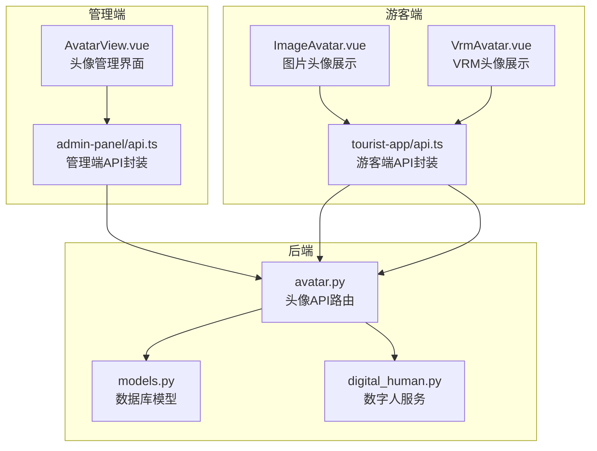
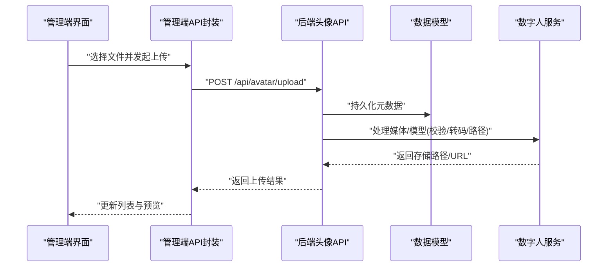
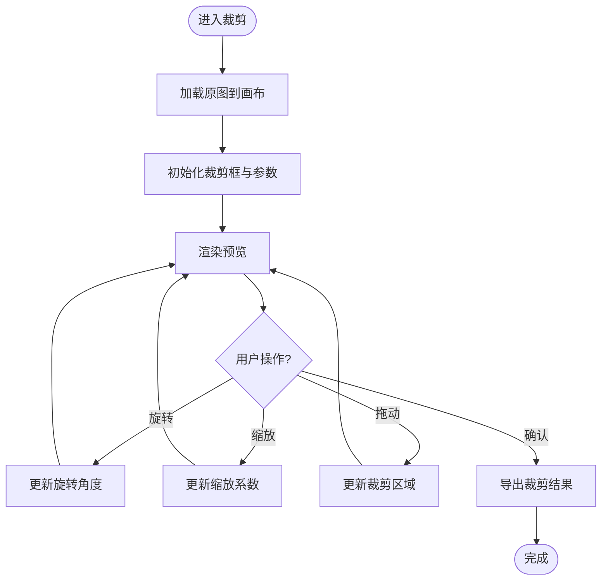
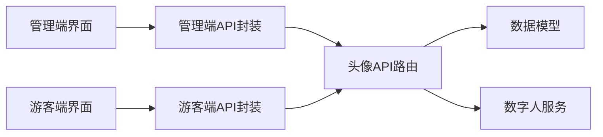

# 数字人头像配置模块

<cite>
**本文引用的文件**   
- [backend/app/api/avatar.py](file://backend/app/api/avatar.py)
- [backend/app/db/models.py](file://backend/app/db/models.py)
- [backend/app/services/digital_human.py](file://backend/app/services/digital_human.py)
- [frontend/admin-panel/src/views/AvatarConfig/AvatarView.vue](file://frontend/admin-panel/src/views/AvatarConfig/AvatarView.vue)
- [frontend/tourist-app/src/components/DigitalHuman/ImageAvatar.vue](file://frontend/tourist-app/src/components/DigitalHuman/ImageAvatar.vue)
- [frontend/tourist-app/src/components/DigitalHuman/VrmAvatar.vue](file://frontend/tourist-app/src/components/DigitalHuman/VrmAvatar.vue)
- [frontend/tourist-app/src/services/api.ts](file://frontend/tourist-app/src/services/api.ts)
- [frontend/admin-panel/src/services/api.ts](file://frontend/admin-panel/src/services/api.ts)
</cite>

## 目录
1. [简介](#简介)
2. [项目结构](#项目结构)
3. [核心组件](#核心组件)
4. [架构总览](#架构总览)
5. [详细组件分析](#详细组件分析)
6. [依赖分析](#依赖分析)
7. [性能考虑](#性能考虑)
8. [故障排查指南](#故障排查指南)
9. [结论](#结论)
10. [附录](#附录)

## 简介
本模块面向“数字人头像”的完整生命周期管理，覆盖上传、预览、编辑与管理。支持常见图片格式（PNG、JPG）与 VRM 模型；提供裁剪、旋转、缩放与实时预览能力；实现分类管理与标签体系，并支持批量操作。后端提供统一的头像 API，前端在管理端与游客端分别承载上传/管理与展示/交互。文档同时给出缓存策略、CDN 加速与访问权限控制方案建议。

## 项目结构
围绕头像功能的关键代码分布如下：
- 后端 API：头像上传、查询、删除等接口定义
- 数据模型：头像实体字段与关系
- 服务层：数字人相关处理逻辑（如 VRM 渲染或资源路径解析）
- 管理端前端：头像上传、预览、编辑、分类与标签管理界面
- 游客端前端：头像展示（图片/VRM）、交互与加载状态
- 前端服务层：统一封装 API 调用、进度监听与错误重试

图表来源
- [backend/app/api/avatar.py](file://backend/app/api/avatar.py)
- [backend/app/db/models.py](file://backend/app/db/models.py)
- [backend/app/services/digital_human.py](file://backend/app/services/digital_human.py)
- [frontend/admin-panel/src/views/AvatarConfig/AvatarView.vue](file://frontend/admin-panel/src/views/AvatarConfig/AvatarView.vue)
- [frontend/tourist-app/src/components/DigitalHuman/ImageAvatar.vue](file://frontend/tourist-app/src/components/DigitalHuman/ImageAvatar.vue)
- [frontend/tourist-app/src/components/DigitalHuman/VrmAvatar.vue](file://frontend/tourist-app/src/components/DigitalHuman/VrmAvatar.vue)
- [frontend/tourist-app/src/services/api.ts](file://frontend/tourist-app/src/services/api.ts)
- [frontend/admin-panel/src/services/api.ts](file://frontend/admin-panel/src/services/api.ts)

章节来源
- [backend/app/api/avatar.py](file://backend/app/api/avatar.py)
- [backend/app/db/models.py](file://backend/app/db/models.py)
- [backend/app/services/digital_human.py](file://backend/app/services/digital_human.py)
- [frontend/admin-panel/src/views/AvatarConfig/AvatarView.vue](file://frontend/admin-panel/src/views/AvatarConfig/AvatarView.vue)
- [frontend/tourist-app/src/components/DigitalHuman/ImageAvatar.vue](file://frontend/tourist-app/src/components/DigitalHuman/ImageAvatar.vue)
- [frontend/tourist-app/src/components/DigitalHuman/VrmAvatar.vue](file://frontend/tourist-app/src/components/DigitalHuman/VrmAvatar.vue)
- [frontend/tourist-app/src/services/api.ts](file://frontend/tourist-app/src/services/api.ts)
- [frontend/admin-panel/src/services/api.ts](file://frontend/admin-panel/src/services/api.ts)

## 核心组件
- 头像上传与存储
  - 支持 PNG、JPG 与 VRM 模型上传
  - 校验文件格式、尺寸与质量阈值
  - 生成唯一标识与规范化存储路径
- 头像预览与编辑
  - 图片：裁剪、旋转、缩放与实时预览
  - VRM：基础查看与占位图显示
- 分类与标签
  - 分类：按业务维度组织头像
  - 标签：细粒度检索与筛选
- 批量操作
  - 批量移动分类、批量打标签、批量删除
- 管理端与游客端
  - 管理端：上传、编辑、分类与标签管理
  - 游客端：头像展示与交互

章节来源
- [backend/app/api/avatar.py](file://backend/app/api/avatar.py)
- [backend/app/db/models.py](file://backend/app/db/models.py)
- [backend/app/services/digital_human.py](file://backend/app/services/digital_human.py)
- [frontend/admin-panel/src/views/AvatarConfig/AvatarView.vue](file://frontend/admin-panel/src/views/AvatarConfig/AvatarView.vue)
- [frontend/tourist-app/src/components/DigitalHuman/ImageAvatar.vue](file://frontend/tourist-app/src/components/DigitalHuman/ImageAvatar.vue)
- [frontend/tourist-app/src/components/DigitalHuman/VrmAvatar.vue](file://frontend/tourist-app/src/components/DigitalHuman/VrmAvatar.vue)
- [frontend/tourist-app/src/services/api.ts](file://frontend/tourist-app/src/services/api.ts)
- [frontend/admin-panel/src/services/api.ts](file://frontend/admin-panel/src/services/api.ts)

## 架构总览
整体采用前后端分离架构：管理端与游客端通过各自的服务层调用后端头像 API；后端基于路由层、服务层与数据模型分层设计，确保职责清晰与可扩展性。

图表来源
- [backend/app/api/avatar.py](file://backend/app/api/avatar.py)
- [backend/app/db/models.py](file://backend/app/db/models.py)
- [backend/app/services/digital_human.py](file://backend/app/services/digital_human.py)
- [frontend/admin-panel/src/services/api.ts](file://frontend/admin-panel/src/services/api.ts)
- [frontend/admin-panel/src/views/AvatarConfig/AvatarView.vue](file://frontend/admin-panel/src/views/AvatarConfig/AvatarView.vue)

## 详细组件分析

### 后端头像 API（路由与服务）
- 职责
  - 接收上传请求，校验文件类型、大小与分辨率
  - 生成唯一 ID 与规范化存储路径
  - 调用服务层进行媒体处理与索引
  - 返回可访问的 URL 或资源信息
- 关键流程
  - 上传：校验 -> 落盘/对象存储 -> 生成缩略图/封面 -> 写入元数据
  - 查询：按分类/标签/ID 检索
  - 更新：修改分类、标签、主图标记
  - 删除：级联清理缩略图与索引
- 错误处理
  - 非法格式/过大文件/损坏文件 -> 明确错误码与提示
  - 存储失败 -> 重试与告警
  - 并发冲突 -> 幂等键与去重

章节来源
- [backend/app/api/avatar.py](file://backend/app/api/avatar.py)
- [backend/app/services/digital_human.py](file://backend/app/services/digital_human.py)

### 数据模型（头像实体）
- 字段建议
  - 唯一标识、文件名、原始名称、扩展名
  - 存储路径、访问 URL、缩略图路径
  - 分类、标签数组、是否主图、创建/更新时间
  - 宽高、文件大小、哈希指纹
- 关系
  - 与用户/场景关联（可选）
  - 与 VRM 模型资源关联（可选）

章节来源
- [backend/app/db/models.py](file://backend/app/db/models.py)

### 管理端头像视图（上传/预览/编辑/管理）
- 功能点
  - 文件选择与拖拽上传
  - 上传进度条与断点续传（可选）
  - 图片裁剪、旋转、缩放与实时预览
  - 分类选择与多标签输入
  - 批量选择、批量移动/打标签/删除
  - 列表分页与搜索过滤
- 交互细节
  - 上传中禁用重复提交
  - 失败自动重试与降级提示
  - 预览区即时反馈裁剪/旋转/缩放效果

章节来源
- [frontend/admin-panel/src/views/AvatarConfig/AvatarView.vue](file://frontend/admin-panel/src/views/AvatarConfig/AvatarView.vue)
- [frontend/admin-panel/src/services/api.ts](file://frontend/admin-panel/src/services/api.ts)

### 游客端头像展示（图片/VRM）
- 图片头像
  - 懒加载与占位图
  - 自适应容器尺寸
  - 点击放大预览（可选）
- VRM 头像
  - 模型加载与基础动画播放
  - 低配设备降级为静态封面
  - 错误兜底与重试

章节来源
- [frontend/tourist-app/src/components/DigitalHuman/ImageAvatar.vue](file://frontend/tourist-app/src/components/DigitalHuman/ImageAvatar.vue)
- [frontend/tourist-app/src/components/DigitalHuman/VrmAvatar.vue](file://frontend/tourist-app/src/components/DigitalHuman/VrmAvatar.vue)
- [frontend/tourist-app/src/services/api.ts](file://frontend/tourist-app/src/services/api.ts)

### 头像裁剪工具（算法与交互）
- 能力
  - 矩形/圆形裁剪区域
  - 旋转角度步进与自由旋转
  - 缩放范围限制与比例锁定
  - 实时预览与导出
- 实现要点
  - Canvas/WebGL 绘制与事件绑定
  - 变换矩阵计算与边界约束
  - 防抖节流优化渲染频率
  - 导出前压缩与格式转换

[此图为概念流程图，不直接映射具体源码文件]

### 分类与标签系统
- 分类
  - 树形/扁平结构，支持层级与排序
  - 默认分类与不可删除保护
- 标签
  - 自由输入与候选池
  - 组合筛选与计数统计
- 批量操作
  - 多选后统一变更分类/标签
  - 批量删除二次确认与回滚

章节来源
- [backend/app/db/models.py](file://backend/app/db/models.py)
- [frontend/admin-panel/src/views/AvatarConfig/AvatarView.vue](file://frontend/admin-panel/src/views/AvatarConfig/AvatarView.vue)

### 批量操作与事务
- 设计原则
  - 原子性：同一批次的操作要么全部成功，要么全部回滚
  - 幂等：重复提交不会产生副作用
  - 可观测：记录操作日志与审计轨迹
- 实现建议
  - 服务端使用事务包裹批量更新
  - 客户端合并请求减少网络往返
  - 失败项明细返回以便局部重试

章节来源
- [backend/app/api/avatar.py](file://backend/app/api/avatar.py)
- [backend/app/db/models.py](file://backend/app/db/models.py)

## 依赖分析
- 模块耦合
  - 管理端与游客端均依赖各自 API 封装，再调用后端头像路由
  - 后端路由依赖数据模型与数字人服务
- 外部依赖
  - 对象存储/文件系统（用于存放头像与缩略图）
  - CDN（静态资源分发）
  - 鉴权中间件（访问控制）

图表来源
- [frontend/admin-panel/src/views/AvatarConfig/AvatarView.vue](file://frontend/admin-panel/src/views/AvatarConfig/AvatarView.vue)
- [frontend/admin-panel/src/services/api.ts](file://frontend/admin-panel/src/services/api.ts)
- [frontend/tourist-app/src/components/DigitalHuman/ImageAvatar.vue](file://frontend/tourist-app/src/components/DigitalHuman/ImageAvatar.vue)
- [frontend/tourist-app/src/components/DigitalHuman/VrmAvatar.vue](file://frontend/tourist-app/src/components/DigitalHuman/VrmAvatar.vue)
- [frontend/tourist-app/src/services/api.ts](file://frontend/tourist-app/src/services/api.ts)
- [backend/app/api/avatar.py](file://backend/app/api/avatar.py)
- [backend/app/db/models.py](file://backend/app/db/models.py)
- [backend/app/services/digital_human.py](file://backend/app/services/digital_human.py)

章节来源
- [backend/app/api/avatar.py](file://backend/app/api/avatar.py)
- [backend/app/db/models.py](file://backend/app/db/models.py)
- [backend/app/services/digital_human.py](file://backend/app/services/digital_human.py)
- [frontend/admin-panel/src/views/AvatarConfig/AvatarView.vue](file://frontend/admin-panel/src/views/AvatarConfig/AvatarView.vue)
- [frontend/tourist-app/src/components/DigitalHuman/ImageAvatar.vue](file://frontend/tourist-app/src/components/DigitalHuman/ImageAvatar.vue)
- [frontend/tourist-app/src/components/DigitalHuman/VrmAvatar.vue](file://frontend/tourist-app/src/components/DigitalHuman/VrmAvatar.vue)
- [frontend/tourist-app/src/services/api.ts](file://frontend/tourist-app/src/services/api.ts)
- [frontend/admin-panel/src/services/api.ts](file://frontend/admin-panel/src/services/api.ts)

## 性能考虑
- 上传优化
  - 分片上传与并发控制
  - 断点续传与进度上报
  - 客户端预压缩与格式转换
- 渲染优化
  - 图片懒加载与按需加载
  - VRM 模型异步加载与资源池复用
  - 缩略图与不同分辨率适配
- 缓存与 CDN
  - 浏览器缓存头与版本化 URL
  - CDN 边缘缓存与预热
  - 热点资源优先加载
- 存储与 I/O
  - 缩略图/封面异步生成
  - 冷热分层存储策略
  - 定期清理无效资源

[本节为通用指导，不直接分析具体文件]

## 故障排查指南
- 上传失败
  - 检查文件格式、大小与分辨率是否符合要求
  - 观察网络错误与超时，启用重试与退避
  - 核对存储路径与权限
- 预览异常
  - 图片裁剪区域越界或比例异常
  - VRM 模型加载失败或资源缺失
- 批量操作不一致
  - 检查事务回滚与部分失败项
  - 核对并发冲突与幂等键
- 访问受限
  - 鉴权令牌是否有效
  - 跨域与白名单配置是否正确

章节来源
- [backend/app/api/avatar.py](file://backend/app/api/avatar.py)
- [frontend/admin-panel/src/views/AvatarConfig/AvatarView.vue](file://frontend/admin-panel/src/views/AvatarConfig/AvatarView.vue)
- [frontend/tourist-app/src/components/DigitalHuman/ImageAvatar.vue](file://frontend/tourist-app/src/components/DigitalHuman/ImageAvatar.vue)
- [frontend/tourist-app/src/components/DigitalHuman/VrmAvatar.vue](file://frontend/tourist-app/src/components/DigitalHuman/VrmAvatar.vue)

## 结论
本模块以清晰的层次划分与完善的交互体验，实现了数字人头像从上传到展示的全链路能力。通过分类与标签体系、批量操作与健壮的错误处理，兼顾了易用性与可维护性。结合缓存与 CDN 策略，可在大规模场景下保障性能与稳定性。

[本节为总结性内容，不直接分析具体文件]

## 附录

### 头像文件格式与规范
- 支持格式
  - 图片：PNG、JPG
  - 模型：VRM
- 尺寸与质量
  - 图片最小边建议不低于 512px，推荐 1024px 以上
  - JPG 质量建议 80% 以上，PNG 无损
  - VRM 模型面数与贴图大小需符合运行时限制
- 命名与路径
  - 使用唯一 ID 作为文件名主体，避免中文与特殊字符
  - 按日期/分类建立子目录，便于归档与清理

[本节为通用规范说明，不直接分析具体文件]

### 头像 API 参考（示例）
- 上传头像
  - 方法：POST
  - 路径：/api/avatar/upload
  - 请求体：multipart/form-data，包含文件与元数据（分类、标签等）
  - 响应：{ id, url, thumbnail_url, message }
  - 错误：400 格式/大小不符，500 存储失败
- 获取头像详情
  - 方法：GET
  - 路径：/api/avatar/{id}
  - 响应：头像元数据与访问链接
- 更新分类/标签
  - 方法：PUT
  - 路径：/api/avatar/{id}
  - 请求体：{ category, tags }
- 删除头像
  - 方法：DELETE
  - 路径：/api/avatar/{id}
- 批量操作
  - 方法：POST
  - 路径：/api/avatar/batch
  - 请求体：{ actions: [{ op, ids, params }] }
  - 响应：{ success_count, failed_items }

章节来源
- [backend/app/api/avatar.py](file://backend/app/api/avatar.py)

### 上传进度监听与错误重试
- 进度监听
  - 使用 XMLHttpRequest.upload.onprogress 或 Fetch + ReadableStream 分段上报
  - 管理端显示百分比与剩余时间估算
- 错误重试
  - 指数退避与最大重试次数
  - 网络抖动时自动切换备用节点
- 存储路径管理
  - 服务端生成稳定路径与短链
  - 版本化 URL 配合缓存失效

章节来源
- [frontend/admin-panel/src/services/api.ts](file://frontend/admin-panel/src/services/api.ts)
- [frontend/tourist-app/src/services/api.ts](file://frontend/tourist-app/src/services/api.ts)
- [backend/app/api/avatar.py](file://backend/app/api/avatar.py)

### 缓存策略与 CDN 加速
- 浏览器缓存
  - 设置 Cache-Control 与 ETag
  - 资源版本化（文件名或查询参数）
- CDN 配置
  - 源站回源规则与缓存命中策略
  - 预热热门头像与缩略图
- 访问控制
  - 私有资源签名 URL 与时效控制
  - 白名单域名与 Referer 校验

[本节为通用方案建议，不直接分析具体文件]

### 访问权限控制
- 鉴权
  - 管理端：管理员角色校验
  - 游客端：公开或受限访问策略
- 授权
  - 按分类/标签的资源可见性控制
  - 临时访问令牌与 IP 白名单

[本节为通用方案建议，不直接分析具体文件]