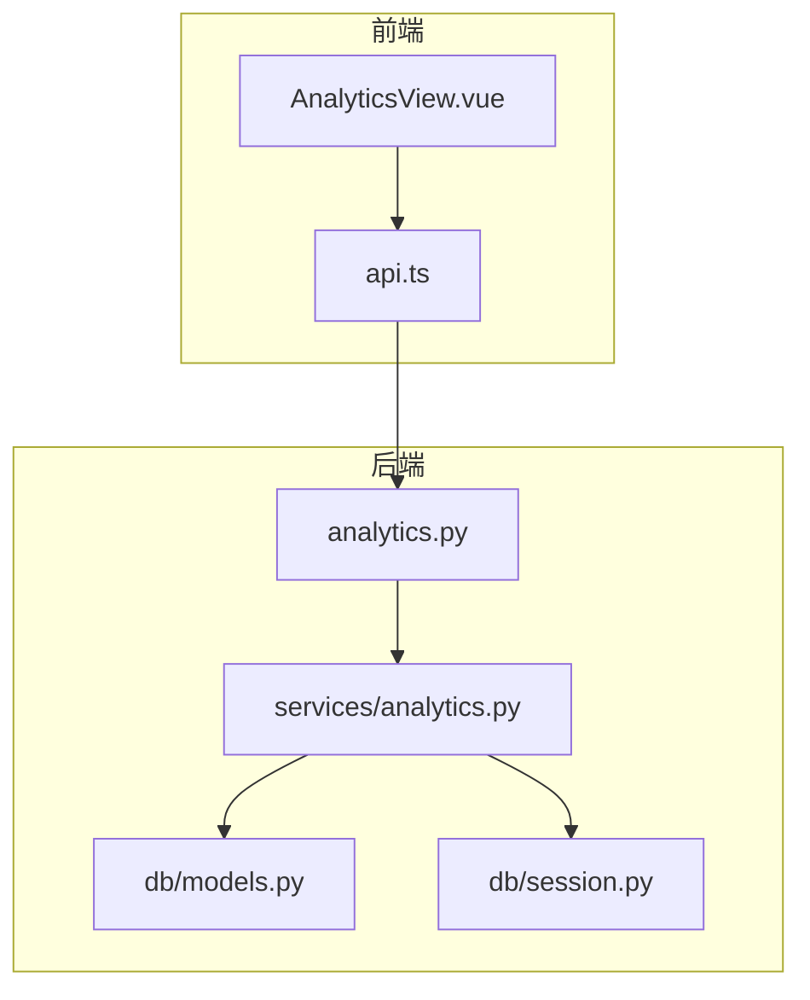
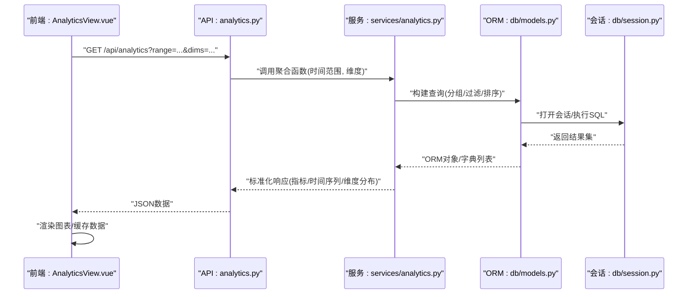
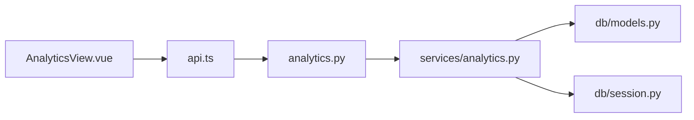

# 数据分析模块

<cite>
**本文引用的文件**   
- [backend/app/api/analytics.py](file://backend/app/api/analytics.py)
- [backend/app/services/analytics.py](file://backend/app/services/analytics.py)
- [backend/app/db/models.py](file://backend/app/db/models.py)
- [backend/app/db/session.py](file://backend/app/db/session.py)
- [frontend/admin-panel/src/views/Analytics/AnalyticsView.vue](file://frontend/admin-panel/src/views/Analytics/AnalyticsView.vue)
- [frontend/admin-panel/src/services/api.ts](file://frontend/admin-panel/src/services/api.ts)
</cite>

## 目录
1. [简介](#简介)
2. [项目结构](#项目结构)
3. [核心组件](#核心组件)
4. [架构总览](#架构总览)
5. [详细组件分析](#详细组件分析)
6. [依赖关系分析](#依赖关系分析)
7. [性能考虑](#性能考虑)
8. [故障排查指南](#故障排查指南)
9. [结论](#结论)
10. [附录](#附录)

## 简介
本技术文档聚焦于“数据分析模块”，覆盖用户行为分析、系统使用统计与性能监控数据的可视化展示。文档将详细说明折线图、柱状图、饼图与热力图的使用场景与实现要点，解释时间范围筛选、数据分组聚合与多维度分析能力；并阐述实时数据更新机制（WebSocket）、连接管理与数据缓存策略。此外，提供自定义报表生成、导出为 Excel/PDF 以及定时报告发送的实现方案，并给出大数据量处理的性能优化技巧与内存管理策略。

## 项目结构
后端采用分层设计：API 层暴露 REST 接口，服务层封装业务逻辑与聚合计算，数据访问层通过 ORM 模型与数据库会话进行读写。前端在管理后台提供“分析”页面，负责图表渲染与交互控制，并通过 API 服务调用后端接口获取数据。

图示来源
- [frontend/admin-panel/src/views/Analytics/AnalyticsView.vue](file://frontend/admin-panel/src/views/Analytics/AnalyticsView.vue)
- [frontend/admin-panel/src/services/api.ts](file://frontend/admin-panel/src/services/api.ts)
- [backend/app/api/analytics.py](file://backend/app/api/analytics.py)
- [backend/app/services/analytics.py](file://backend/app/services/analytics.py)
- [backend/app/db/models.py](file://backend/app/db/models.py)
- [backend/app/db/session.py](file://backend/app/db/session.py)

章节来源
- [backend/app/api/analytics.py](file://backend/app/api/analytics.py)
- [backend/app/services/analytics.py](file://backend/app/services/analytics.py)
- [backend/app/db/models.py](file://backend/app/db/models.py)
- [backend/app/db/session.py](file://backend/app/db/session.py)
- [frontend/admin-panel/src/views/Analytics/AnalyticsView.vue](file://frontend/admin-panel/src/views/Analytics/AnalyticsView.vue)
- [frontend/admin-panel/src/services/api.ts](file://frontend/admin-panel/src/services/api.ts)

## 核心组件
- 分析 API 控制器：定义 REST 端点，接收查询参数（如时间范围、维度），调用服务层完成聚合与汇总，返回结构化数据供前端渲染。
- 分析服务层：封装用户行为指标、系统使用统计与性能监控的聚合逻辑，支持按时间粒度、渠道、设备等多维度分组。
- 数据模型与会话：基于 ORM 的数据模型定义与数据库会话管理，确保高效读取与事务一致性。
- 前端分析视图：提供时间选择器、维度切换、图表类型切换与导出操作，负责本地缓存与增量刷新。
- 前端 API 服务：统一封装 HTTP 请求，处理分页、重试与错误码映射。

章节来源
- [backend/app/api/analytics.py](file://backend/app/api/analytics.py)
- [backend/app/services/analytics.py](file://backend/app/services/analytics.py)
- [backend/app/db/models.py](file://backend/app/db/models.py)
- [backend/app/db/session.py](file://backend/app/db/session.py)
- [frontend/admin-panel/src/views/Analytics/AnalyticsView.vue](file://frontend/admin-panel/src/views/Analytics/AnalyticsView.vue)
- [frontend/admin-panel/src/services/api.ts](file://frontend/admin-panel/src/services/api.ts)

## 架构总览
整体数据流从前端发起请求开始，经 API 路由进入服务层执行聚合计算，再经由 ORM 模型访问数据库，最终将结果返回给前端进行可视化渲染。

图示来源
- [backend/app/api/analytics.py](file://backend/app/api/analytics.py)
- [backend/app/services/analytics.py](file://backend/app/services/analytics.py)
- [backend/app/db/models.py](file://backend/app/db/models.py)
- [backend/app/db/session.py](file://backend/app/db/session.py)
- [frontend/admin-panel/src/views/Analytics/AnalyticsView.vue](file://frontend/admin-panel/src/views/Analytics/AnalyticsView.vue)

## 详细组件分析

### 分析 API 控制器
- 职责：解析查询参数（时间范围、维度、分页等），校验输入，调用服务层，格式化响应体，处理异常与状态码。
- 关键流程：
  - 参数校验与默认值填充
  - 调用服务层聚合方法
  - 结果标准化（时间序列、分类分布、汇总指标）
  - 错误处理（无效参数、数据库异常、超时）
- 扩展点：新增维度或指标时，仅需在服务层添加聚合逻辑并在 API 中暴露对应端点。

章节来源
- [backend/app/api/analytics.py](file://backend/app/api/analytics.py)

### 分析服务层
- 职责：实现用户行为分析、系统使用统计与性能监控的核心聚合算法，支持多维度分组与时间粒度聚合。
- 典型功能：
  - 用户行为：活跃用户数、会话时长、点击/浏览事件计数、转化漏斗
  - 系统使用：功能使用频次、渠道来源分布、设备类型占比
  - 性能监控：接口耗时分位、错误率、资源占用趋势
- 聚合策略：
  - 时间分组：按小时/天/周/月聚合
  - 维度分组：按渠道、设备、地区、版本等维度切片
  - 指标计算：计数、求和、均值、分位数、去重计数
- 输出格式：统一的结构化 JSON，便于前端直接渲染各类图表。

章节来源
- [backend/app/services/analytics.py](file://backend/app/services/analytics.py)

### 数据模型与会话
- 数据模型：定义用户行为日志、系统使用记录、性能指标表等实体字段与索引，支撑高效查询。
- 会话管理：统一数据库连接与事务边界，避免连接泄漏，支持批量读取与分页游标。
- 查询优化：利用索引、预聚合表、物化视图等手段降低复杂查询开销。

章节来源
- [backend/app/db/models.py](file://backend/app/db/models.py)
- [backend/app/db/session.py](file://backend/app/db/session.py)

### 前端分析视图
- 职责：提供时间范围选择、维度切换、图表类型选择（折线/柱状/饼图/热力图）、导出与刷新操作。
- 交互流程：
  - 用户选择时间与维度后，调用 API 服务获取数据
  - 根据返回数据结构动态渲染图表
  - 本地缓存最近一次查询结果，减少重复请求
  - 支持增量刷新与断线重连（若启用 WebSocket）
- 图表适配：
  - 折线图：时间序列趋势（如日活、接口耗时）
  - 柱状图：分类对比（如渠道使用次数）
  - 饼图：占比分布（如设备类型占比）
  - 热力图：二维密度（如时段×渠道活跃度）

章节来源
- [frontend/admin-panel/src/views/Analytics/AnalyticsView.vue](file://frontend/admin-panel/src/views/Analytics/AnalyticsView.vue)
- [frontend/admin-panel/src/services/api.ts](file://frontend/admin-panel/src/services/api.ts)

### 前端 API 服务
- 职责：封装 HTTP 请求，统一处理分页、重试、错误码映射与超时配置。
- 关键点：
  - 请求拦截：附加认证头、追踪 ID
  - 响应拦截：统一错误提示、数据解包
  - 缓存策略：对只读查询做短期缓存，避免抖动

章节来源
- [frontend/admin-panel/src/services/api.ts](file://frontend/admin-panel/src/services/api.ts)

### 实时数据更新机制（WebSocket）
- 目标：对高频更新的指标（如在线人数、实时错误率）提供低延迟推送。
- 连接管理：
  - 自动重连与退避策略
  - 心跳保活与断线检测
  - 订阅主题与消息去抖
- 数据缓存：
  - 客户端内存缓存最新快照
  - 增量更新合并策略，避免全量重绘
- 降级策略：
  - WebSocket 不可用时回退到轮询
  - 限流与采样，防止前端过载

章节来源
- [frontend/admin-panel/src/views/Analytics/AnalyticsView.vue](file://frontend/admin-panel/src/views/Analytics/AnalyticsView.vue)
- [frontend/admin-panel/src/services/api.ts](file://frontend/admin-panel/src/services/api.ts)

### 自定义报表生成与导出
- 自定义报表：
  - 前端提供模板选择与字段拖拽
  - 后端按模板组装数据，支持分页与异步生成
- 导出格式：
  - Excel：列式数据、样式与多工作表
  - PDF：固定布局、图表转图片嵌入
- 任务队列：
  - 大报表异步生成，进度回调
  - 失败重试与告警通知

章节来源
- [backend/app/services/analytics.py](file://backend/app/services/analytics.py)
- [frontend/admin-panel/src/views/Analytics/AnalyticsView.vue](file://frontend/admin-panel/src/views/Analytics/AnalyticsView.vue)

### 定时报告发送
- 调度策略：
  - 每日/每周/每月定时任务
  - 可配置收件人与附件格式
- 内容组装：
  - 摘要指标 + 关键图表截图
  - 链接到在线报表详情
- 可靠性：
  - 失败重试与邮件网关健康检查
  - 发送日志与审计

章节来源
- [backend/app/services/analytics.py](file://backend/app/services/analytics.py)

## 依赖关系分析
前后端通过 REST API 耦合，服务层依赖 ORM 模型与数据库会话；前端依赖 API 服务与图表库。

图示来源
- [frontend/admin-panel/src/views/Analytics/AnalyticsView.vue](file://frontend/admin-panel/src/views/Analytics/AnalyticsView.vue)
- [frontend/admin-panel/src/services/api.ts](file://frontend/admin-panel/src/services/api.ts)
- [backend/app/api/analytics.py](file://backend/app/api/analytics.py)
- [backend/app/services/analytics.py](file://backend/app/services/analytics.py)
- [backend/app/db/models.py](file://backend/app/db/models.py)
- [backend/app/db/session.py](file://backend/app/db/db/session.py)

章节来源
- [backend/app/api/analytics.py](file://backend/app/api/analytics.py)
- [backend/app/services/analytics.py](file://backend/app/services/analytics.py)
- [backend/app/db/models.py](file://backend/app/db/models.py)
- [backend/app/db/session.py](file://backend/app/db/session.py)
- [frontend/admin-panel/src/views/Analytics/AnalyticsView.vue](file://frontend/admin-panel/src/views/Analytics/AnalyticsView.vue)
- [frontend/admin-panel/src/services/api.ts](file://frontend/admin-panel/src/services/api.ts)

## 性能考虑
- 查询优化
  - 合理索引：时间戳、维度字段建立复合索引
  - 预聚合：热点指标维护汇总表，减少实时计算
  - 分页与游标：避免一次性加载大量数据
- 缓存策略
  - 服务端：Redis 缓存常用聚合结果，设置过期与失效策略
  - 客户端：短期缓存与增量更新，避免频繁重绘
- 传输优化
  - 压缩响应体，按需返回字段
  - 使用增量接口与差异更新
- 内存管理
  - 流式处理与分批读取，避免大对象驻留
  - 及时释放数据库会话与临时变量引用
- 并发与限流
  - 接口级限流与熔断
  - 异步任务队列处理重型导出与报表生成

[本节为通用性能建议，不直接分析具体文件]

## 故障排查指南
- 常见问题
  - 参数校验失败：检查时间范围、维度枚举是否合法
  - 数据库慢查询：查看执行计划与索引命中情况
  - WebSocket 断连：检查心跳、网络稳定性与重连策略
  - 导出失败：确认模板可用性与存储配额
- 诊断手段
  - 增加结构化日志与追踪 ID
  - 监控关键指标（QPS、P95 耗时、错误率）
  - 前端错误上报与图表渲染异常定位

章节来源
- [backend/app/api/analytics.py](file://backend/app/api/analytics.py)
- [backend/app/services/analytics.py](file://backend/app/services/analytics.py)
- [backend/app/db/session.py](file://backend/app/db/session.py)
- [frontend/admin-panel/src/services/api.ts](file://frontend/admin-panel/src/services/api.ts)

## 结论
本模块以清晰的分层架构与标准化的数据协议，实现了用户行为分析、系统使用统计与性能监控的多维可视化。通过时间范围筛选、分组聚合与多维度分析，结合折线、柱状、饼图与热力图等图表类型，满足多样化分析需求。实时推送、缓存与导出能力进一步提升了用户体验与运维效率。针对大数据量场景，采用索引、预聚合、缓存与异步任务等策略保障性能与稳定性。

[本节为总结性内容，不直接分析具体文件]

## 附录

### 图表类型与使用场景
- 折线图：适合时间序列趋势分析（如日活、接口耗时）
- 柱状图：适合分类对比（如渠道使用次数、功能使用频次）
- 饼图：适合占比分布（如设备类型、来源渠道占比）
- 热力图：适合二维密度（如时段×渠道活跃度、页面×区域点击密度）

[本节为概念性说明，不直接分析具体文件]

### 数据模型概览（概念）
- 用户行为日志：包含用户标识、事件类型、时间戳、渠道、设备等字段
- 系统使用记录：包含功能标识、调用次数、耗时、错误码等
- 性能指标：包含接口路径、耗时分位、错误率、资源占用等

[本节为概念性说明，不直接分析具体文件]