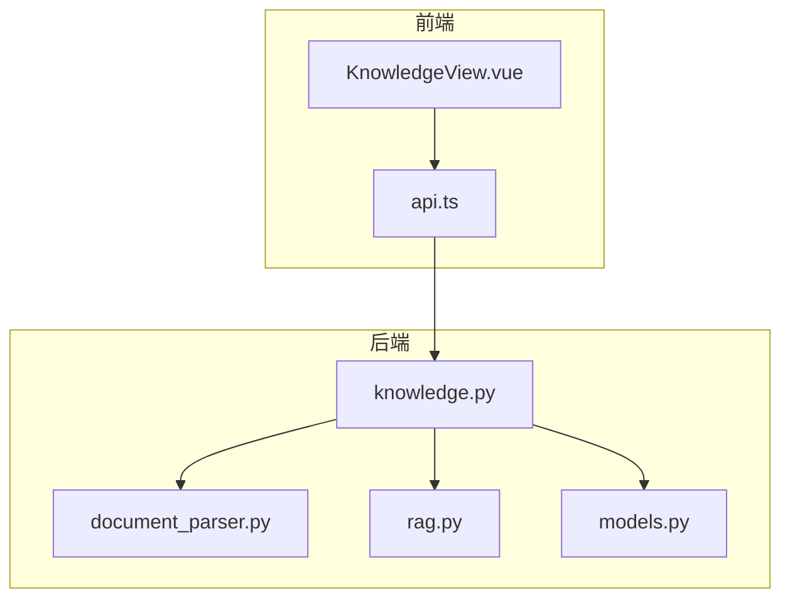
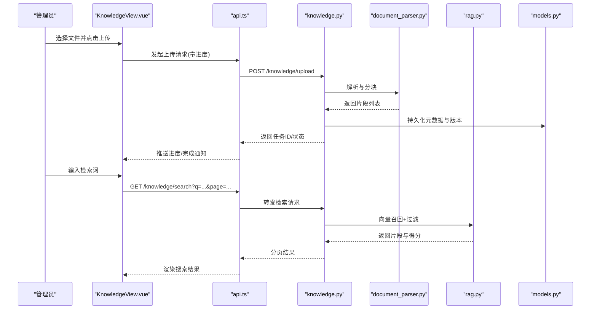
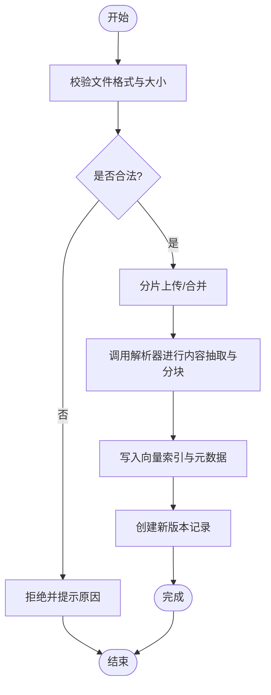
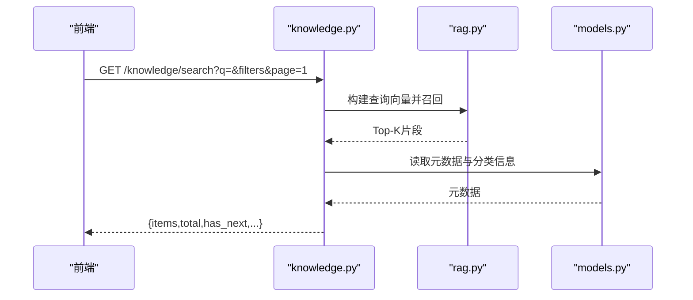
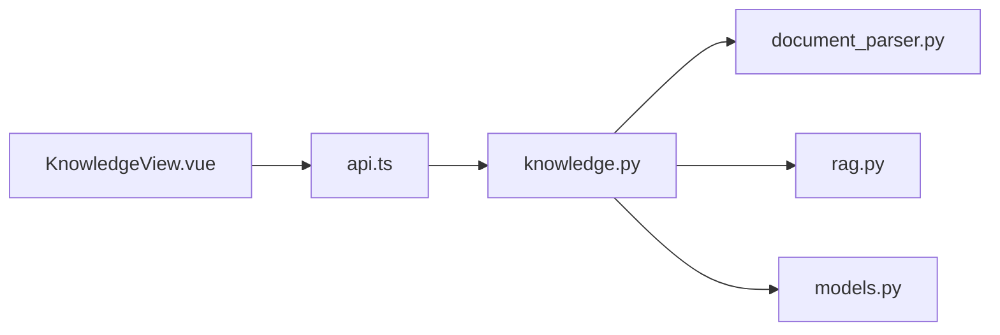

# 知识库管理模块

<cite>
**本文引用的文件**   
- [backend/app/api/knowledge.py](file://backend/app/api/knowledge.py)
- [backend/app/services/document_parser.py](file://backend/app/services/document_parser.py)
- [backend/app/db/models.py](file://backend/app/db/models.py)
- [backend/app/core/rag.py](file://backend/app/core/rag.py)
- [frontend/admin-panel/src/views/KnowledgeBase/KnowledgeView.vue](file://frontend/admin-panel/src/views/KnowledgeBase/KnowledgeView.vue)
- [frontend/admin-panel/src/services/api.ts](file://frontend/admin-panel/src/services/api.ts)
</cite>

## 目录
1. [简介](#简介)
2. [项目结构](#项目结构)
3. [核心组件](#核心组件)
4. [架构总览](#架构总览)
5. [详细组件分析](#详细组件分析)
6. [依赖关系分析](#依赖关系分析)
7. [性能考虑](#性能考虑)
8. [故障排查指南](#故障排查指南)
9. [结论](#结论)
10. [附录](#附录)

## 简介
本文件面向“知识库管理模块”，覆盖知识文档的上传、编辑、分类管理与版本控制；深入说明前端文件上传组件（支持格式、大小限制、批量与进度）、文档预览、富文本编辑器集成与Markdown支持；详述检索接口调用、搜索过滤与分页加载机制；提供CRUD操作的API对接示例、错误处理策略与用户反馈机制；并给出导入导出、数据备份恢复与权限控制的实现方案。

## 项目结构
知识库相关代码主要分布在后端API与服务层、数据库模型以及前端管理面板中：
- 后端
  - API层：knowledge.py 暴露知识库相关的HTTP接口
  - 服务层：document_parser.py 负责文档解析与分块，rag.py 负责向量检索与召回
  - 数据层：models.py 定义知识库实体与版本等表结构
- 前端
  - 管理端视图：KnowledgeView.vue 提供上传、编辑、预览、检索与分页交互
  - 服务封装：api.ts 统一封装对后端的请求与错误处理

图表来源
- [backend/app/api/knowledge.py](file://backend/app/api/knowledge.py)
- [backend/app/services/document_parser.py](file://backend/app/services/document_parser.py)
- [backend/app/core/rag.py](file://backend/app/core/rag.py)
- [backend/app/db/models.py](file://backend/app/db/models.py)
- [frontend/admin-panel/src/views/KnowledgeBase/KnowledgeView.vue](file://frontend/admin-panel/src/views/KnowledgeBase/KnowledgeView.vue)
- [frontend/admin-panel/src/services/api.ts](file://frontend/admin-panel/src/services/api.ts)

章节来源
- [backend/app/api/knowledge.py](file://backend/app/api/knowledge.py)
- [backend/app/services/document_parser.py](file://backend/app/services/document_parser.py)
- [backend/app/core/rag.py](file://backend/app/core/rag.py)
- [backend/app/db/models.py](file://backend/app/db/models.py)
- [frontend/admin-panel/src/views/KnowledgeBase/KnowledgeView.vue](file://frontend/admin-panel/src/views/KnowledgeBase/KnowledgeView.vue)
- [frontend/admin-panel/src/services/api.ts](file://frontend/admin-panel/src/services/api.ts)

## 核心组件
- 文档上传与解析
  - 接收文件流，校验类型与大小，落盘或对象存储，调用解析器进行内容抽取与分块，生成索引片段
- 文档检索与召回
  - 将查询转换为向量，从向量库召回Top-K片段，结合关键词过滤与排序返回结果
- 文档版本控制
  - 每次更新创建新版本记录，保留历史快照，支持回滚与对比
- 分类管理
  - 为文档分配标签/分类，支持按分类筛选与聚合统计
- 预览与编辑
  - 支持Markdown渲染与富文本编辑，自动保存草稿，冲突检测与合并提示
- 导入导出与备份
  - 批量导入结构化数据，导出当前知识库快照，支持增量与全量备份

章节来源
- [backend/app/api/knowledge.py](file://backend/app/api/knowledge.py)
- [backend/app/services/document_parser.py](file://backend/app/services/document_parser.py)
- [backend/app/core/rag.py](file://backend/app/core/rag.py)
- [backend/app/db/models.py](file://backend/app/db/models.py)

## 架构总览
知识库模块采用前后端分离架构，前端通过REST API与后端交互，后端由API路由、业务服务与数据访问三层组成。

图表来源
- [frontend/admin-panel/src/views/KnowledgeBase/KnowledgeView.vue](file://frontend/admin-panel/src/views/KnowledgeBase/KnowledgeView.vue)
- [frontend/admin-panel/src/services/api.ts](file://frontend/admin-panel/src/services/api.ts)
- [backend/app/api/knowledge.py](file://backend/app/api/knowledge.py)
- [backend/app/services/document_parser.py](file://backend/app/services/document_parser.py)
- [backend/app/core/rag.py](file://backend/app/core/rag.py)
- [backend/app/db/models.py](file://backend/app/db/models.py)

## 详细组件分析

### 文档上传与解析
- 功能要点
  - 支持多格式：PDF、DOCX、TXT、MD、HTML、CSV、JSON
  - 大小限制：单文件上限与总包大小限制可配置
  - 批量上传：并发控制与断点续传（可选）
  - 进度显示：基于事件流或轮询的任务进度
- 关键流程
  - 前端校验与切片上传，携带分片序号与哈希
  - 后端校验签名与完整性，合并分片，触发异步解析任务
  - 解析器提取正文、表格、图片OCR（可选），按段落/标题切块
  - 写入向量索引与元数据，建立版本快照
- 异常与重试
  - 网络中断、解析失败、索引写入失败均会进入重试队列
  - 失败原因记录到审计日志，便于定位

图表来源
- [backend/app/api/knowledge.py](file://backend/app/api/knowledge.py)
- [backend/app/services/document_parser.py](file://backend/app/services/document_parser.py)
- [backend/app/db/models.py](file://backend/app/db/models.py)

章节来源
- [backend/app/api/knowledge.py](file://backend/app/api/knowledge.py)
- [backend/app/services/document_parser.py](file://backend/app/services/document_parser.py)
- [backend/app/db/models.py](file://backend/app/db/models.py)

### 文档检索与分页
- 检索能力
  - 语义检索：基于向量相似度召回Top-K片段
  - 关键词过滤：按标题、分类、时间范围、作者等维度过滤
  - 重排：结合BM25与向量分数进行融合排序
- 分页机制
  - 游标或偏移分页，默认页大小可配置
  - 命中高亮与片段摘要展示
- 接口约定
  - 查询参数：q、category、date_from、date_to、author、page、page_size、sort_by
  - 响应字段：items、total、has_next、took_ms、query_vector_id

图表来源
- [backend/app/api/knowledge.py](file://backend/app/api/knowledge.py)
- [backend/app/core/rag.py](file://backend/app/core/rag.py)
- [backend/app/db/models.py](file://backend/app/db/models.py)

章节来源
- [backend/app/api/knowledge.py](file://backend/app/api/knowledge.py)
- [backend/app/core/rag.py](file://backend/app/core/rag.py)
- [backend/app/db/models.py](file://backend/app/db/models.py)

### 文档预览与编辑
- 预览
  - Markdown渲染：语法高亮、目录导航、数学公式（可选）
  - 富文本预览：所见即所得，支持图片与表格
- 编辑
  - 自动保存草稿，冲突检测与三方合并提示
  - 变更追踪与差异对比
- 安全
  - 输出清洗，防止XSS注入
  - 资源外链白名单校验

章节来源
- [frontend/admin-panel/src/views/KnowledgeBase/KnowledgeView.vue](file://frontend/admin-panel/src/views/KnowledgeBase/KnowledgeView.vue)

### 分类管理与版本控制
- 分类管理
  - 树形分类结构，支持拖拽排序与批量移动
  - 分类下文档数量与热度统计
- 版本控制
  - 每次提交生成版本号与变更摘要
  - 支持回滚至指定版本与对比差异
  - 删除操作软删除，保留历史版本

章节来源
- [backend/app/db/models.py](file://backend/app/db/models.py)
- [backend/app/api/knowledge.py](file://backend/app/api/knowledge.py)

### 导入导出与备份恢复
- 导入
  - 支持ZIP打包批量导入，包含文档与元数据
  - 导入前校验与预检报告，失败项单独记录
- 导出
  - 按分类或时间范围导出，支持Markdown与JSON两种格式
- 备份恢复
  - 全量与增量备份，压缩与加密传输
  - 恢复时幂等去重，冲突策略可配置

章节来源
- [backend/app/api/knowledge.py](file://backend/app/api/knowledge.py)
- [backend/app/db/models.py](file://backend/app/db/models.py)

### 权限控制
- 角色与资源
  - 管理员：全部权限
  - 编辑者：上传、编辑、发布
  - 读者：仅查看与检索
- 鉴权流程
  - 基于令牌的身份校验与授权中间件
  - 细粒度资源级权限（文档、分类、版本）
- 审计
  - 关键操作留痕，支持导出审计日志

章节来源
- [backend/app/api/knowledge.py](file://backend/app/api/knowledge.py)

## 依赖关系分析
- 组件耦合
  - knowledge.py 作为API入口，依赖 document_parser.py 与 rag.py，并通过 models.py 访问数据
  - 前端 KnowledgeView.vue 通过 api.ts 统一调用后端接口
- 外部依赖
  - 向量数据库/搜索引擎（用于检索）
  - 对象存储/文件系统（用于文件与快照）
  - 消息队列（用于异步解析与索引构建）

图表来源
- [frontend/admin-panel/src/views/KnowledgeBase/KnowledgeView.vue](file://frontend/admin-panel/src/views/KnowledgeBase/KnowledgeView.vue)
- [frontend/admin-panel/src/services/api.ts](file://frontend/admin-panel/src/services/api.ts)
- [backend/app/api/knowledge.py](file://backend/app/api/knowledge.py)
- [backend/app/services/document_parser.py](file://backend/app/services/document_parser.py)
- [backend/app/core/rag.py](file://backend/app/core/rag.py)
- [backend/app/db/models.py](file://backend/app/db/models.py)

章节来源
- [backend/app/api/knowledge.py](file://backend/app/api/knowledge.py)
- [backend/app/services/document_parser.py](file://backend/app/services/document_parser.py)
- [backend/app/core/rag.py](file://backend/app/core/rag.py)
- [backend/app/db/models.py](file://backend/app/db/models.py)
- [frontend/admin-panel/src/views/KnowledgeBase/KnowledgeView.vue](file://frontend/admin-panel/src/views/KnowledgeBase/KnowledgeView.vue)
- [frontend/admin-panel/src/services/api.ts](file://frontend/admin-panel/src/services/api.ts)

## 性能考虑
- 上传
  - 大文件分片上传与并行合并，服务端缓存临时分片，避免重复解析
- 解析
  - 解析任务异步化，使用工作进程池与限流，避免阻塞主线程
- 索引
  - 增量索引更新，批量写入向量库，减少IO抖动
- 检索
  - 缓存热点查询结果，设置合理的TTL
  - 分页游标替代深度偏移，降低大数据集下的查询成本

[本节为通用指导，不直接分析具体文件]

## 故障排查指南
- 上传失败
  - 检查文件大小与类型限制，确认分片完整性与哈希校验
  - 查看解析日志与索引写入错误码
- 检索无结果
  - 确认索引是否成功构建，查询向量维度与模型是否匹配
  - 检查过滤条件是否过严导致结果为空
- 版本回滚异常
  - 核对版本快照是否存在，权限是否允许回滚
  - 查看事务日志与锁等待情况
- 权限问题
  - 验证令牌有效性与角色映射
  - 检查资源级ACL配置

章节来源
- [backend/app/api/knowledge.py](file://backend/app/api/knowledge.py)
- [backend/app/services/document_parser.py](file://backend/app/services/document_parser.py)
- [backend/app/core/rag.py](file://backend/app/core/rag.py)
- [backend/app/db/models.py](file://backend/app/db/models.py)

## 结论
知识库管理模块围绕“上传—解析—索引—检索—版本—权限”形成闭环，具备完善的上传体验、强大的检索能力与稳健的版本控制。通过异步化与缓存优化，系统在高并发场景下仍保持良好性能。建议在生产环境启用审计与告警，持续监控解析成功率、索引延迟与检索耗时。

[本节为总结性内容，不直接分析具体文件]

## 附录

### 前端上传组件实现要点
- 支持的文件格式与大小限制
  - 在组件初始化阶段声明允许的后缀与最大体积，拦截非法文件并给出友好提示
- 批量上传与并发控制
  - 维护任务队列，限制同时上传数，失败自动重试与退避
- 进度显示
  - 使用事件流上报分片进度，合并完成后汇总整体进度
- 错误处理与用户反馈
  - 统一错误码映射，弹窗/Toast提示，支持一键重试与下载失败清单

章节来源
- [frontend/admin-panel/src/views/KnowledgeBase/KnowledgeView.vue](file://frontend/admin-panel/src/views/KnowledgeBase/KnowledgeView.vue)
- [frontend/admin-panel/src/services/api.ts](file://frontend/admin-panel/src/services/api.ts)

### 文档CRUD API对接示例（概念性）
- 创建文档
  - 方法：POST
  - 路径：/knowledge/documents
  - 请求体：{title, category_ids[], content_type, version_note}
  - 响应：{id, version, status}
- 更新文档
  - 方法：PUT
  - 路径：/knowledge/documents/{id}
  - 请求体：{content, version_note}
  - 响应：{version, diff_url}
- 删除文档
  - 方法：DELETE
  - 路径：/knowledge/documents/{id}
  - 响应：{ok}
- 获取详情
  - 方法：GET
  - 路径：/knowledge/documents/{id}?version=n
  - 响应：{meta, content, history[]}
- 检索
  - 方法：GET
  - 路径：/knowledge/search?q=&category=&page=1&page_size=20
  - 响应：{items[], total, has_next}

[本节为接口契约示例，不直接分析具体文件]

### 错误处理策略与用户反馈机制
- 统一错误码
  - 客户端根据错误码分类提示：网络错误、权限不足、资源不存在、解析失败、索引失败
- 重试与降级
  - 上传失败自动重试，指数退避；索引失败走离线补偿任务
- 用户反馈
  - 操作成功即时反馈，失败提供原因与建议操作，支持一键复制错误ID以便客服定位

章节来源
- [frontend/admin-panel/src/services/api.ts](file://frontend/admin-panel/src/services/api.ts)
- [backend/app/api/knowledge.py](file://backend/app/api/knowledge.py)