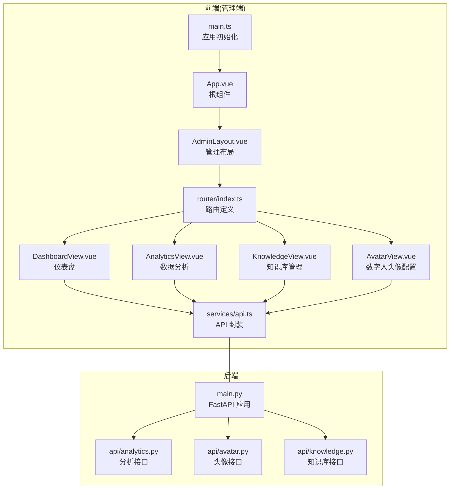
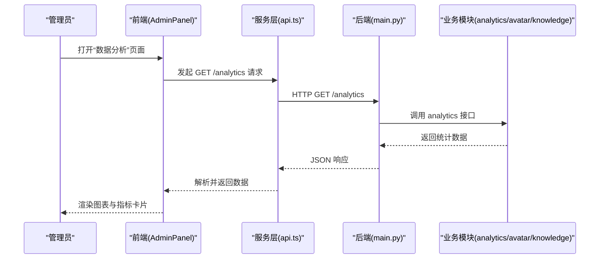
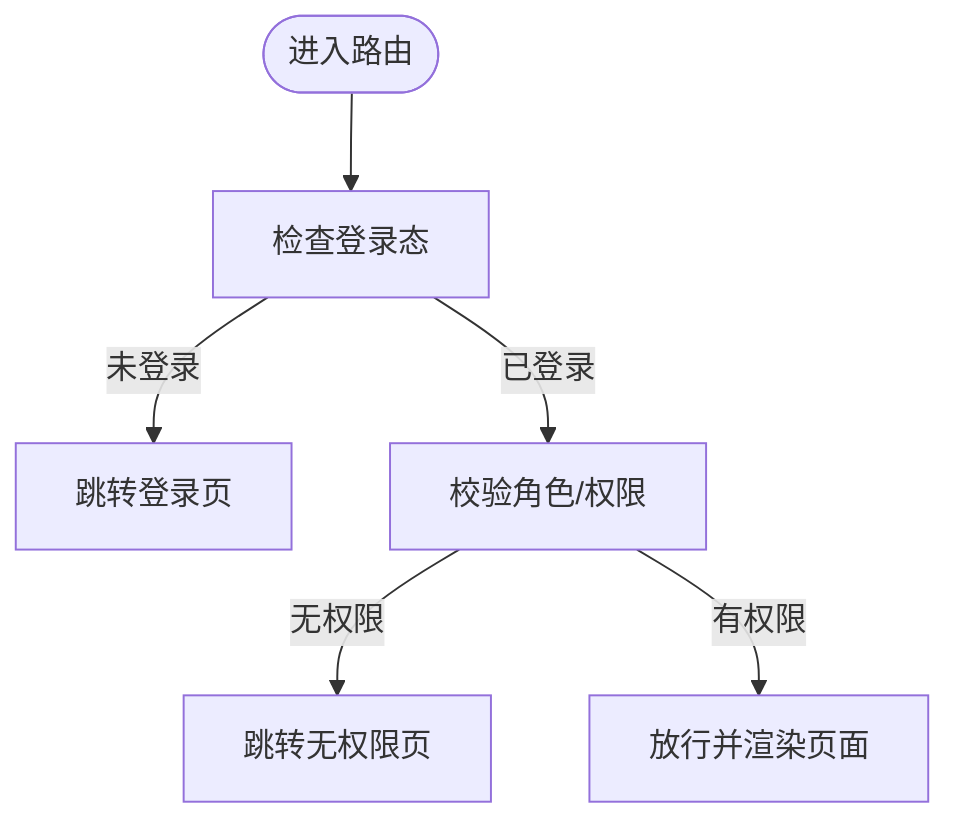
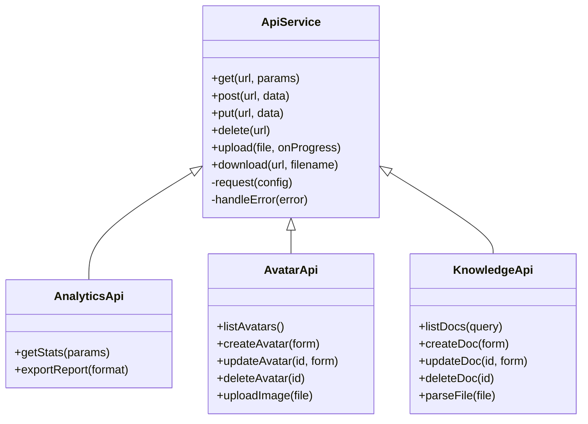
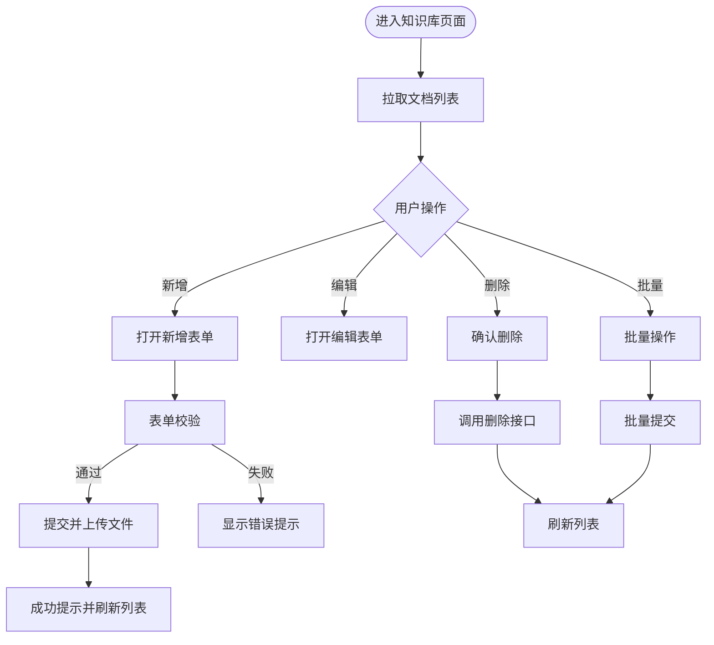
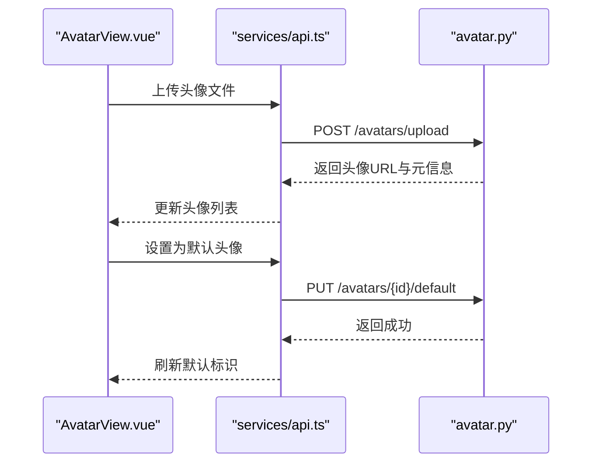
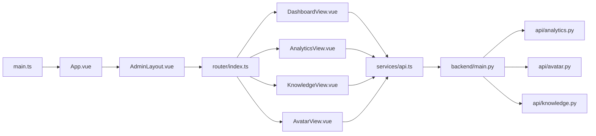

# 管理端应用 (Admin Panel)

<cite>
**本文引用的文件**   
- [frontend/admin-panel/src/main.ts](file://frontend/admin-panel/src/main.ts)
- [frontend/admin-panel/src/App.vue](file://frontend/admin-panel/src/App.vue)
- [frontend/admin-panel/src/layout/AdminLayout.vue](file://frontend/admin-panel/src/layout/AdminLayout.vue)
- [frontend/admin-panel/src/router/index.ts](file://frontend/admin-panel/src/router/index.ts)
- [frontend/admin-panel/src/services/api.ts](file://frontend/admin-panel/src/services/api.ts)
- [frontend/admin-panel/src/views/Dashboard/DashboardView.vue](file://frontend/admin-panel/src/views/Dashboard/DashboardView.vue)
- [frontend/admin-panel/src/views/Analytics/AnalyticsView.vue](file://frontend/admin-panel/src/views/Analytics/AnalyticsView.vue)
- [frontend/admin-panel/src/views/KnowledgeBase/KnowledgeView.vue](file://frontend/admin-panel/src/views/KnowledgeBase/KnowledgeView.vue)
- [frontend/admin-panel/src/views/AvatarConfig/AvatarView.vue](file://frontend/admin-panel/src/views/AvatarConfig/AvatarView.vue)
- [backend/app/main.py](file://backend/app/main.py)
- [backend/app/api/analytics.py](file://backend/app/api/analytics.py)
- [backend/app/api/avatar.py](file://backend/app/api/avatar.py)
- [backend/app/api/knowledge.py](file://backend/app/api/knowledge.py)
</cite>

## 目录
1. [简介](#简介)
2. [项目结构](#项目结构)
3. [核心组件](#核心组件)
4. [架构总览](#架构总览)
5. [详细组件分析](#详细组件分析)
6. [依赖分析](#依赖分析)
7. [性能考虑](#性能考虑)
8. [故障排查指南](#故障排查指南)
9. [结论](#结论)
10. [附录](#附录)

## 简介
本文件为 SmartTour 管理端应用的完整架构文档，聚焦于基于 Vue 3 + TypeScript 的管理后台设计。内容覆盖管理员权限控制、数据可视化展示、知识库管理系统、数据分析仪表板与数字人头像配置等模块；阐述管理界面的组件化架构、表单处理、数据表格操作、文件上传管理与实时数据更新机制；说明与管理后端 API 的集成方式、数据验证规则、错误处理策略与用户操作反馈系统；并提供响应式设计、数据导出、批量操作支持与系统监控面板的实现方案，以及使用指南与扩展开发建议。

## 项目结构
管理端应用位于 frontend/admin-panel 目录，采用典型的前端工程组织：入口脚本、根组件、布局、路由、视图页面与服务层（API 封装）清晰分层。后端提供 RESTful 接口，涵盖分析、头像、知识库等能力。

图表来源
- [frontend/admin-panel/src/main.ts](file://frontend/admin-panel/src/main.ts)
- [frontend/admin-panel/src/App.vue](file://frontend/admin-panel/src/App.vue)
- [frontend/admin-panel/src/layout/AdminLayout.vue](file://frontend/admin-panel/src/layout/AdminLayout.vue)
- [frontend/admin-panel/src/router/index.ts](file://frontend/admin-panel/src/router/index.ts)
- [frontend/admin-panel/src/views/Dashboard/DashboardView.vue](file://frontend/admin-panel/src/views/Dashboard/DashboardView.vue)
- [frontend/admin-panel/src/views/Analytics/AnalyticsView.vue](file://frontend/admin-panel/src/views/Analytics/AnalyticsView.vue)
- [frontend/admin-panel/src/views/KnowledgeBase/KnowledgeView.vue](file://frontend/admin-panel/src/views/KnowledgeBase/KnowledgeView.vue)
- [frontend/admin-panel/src/views/AvatarConfig/AvatarView.vue](file://frontend/admin-panel/src/views/AvatarConfig/AvatarView.vue)
- [frontend/admin-panel/src/services/api.ts](file://frontend/admin-panel/src/services/api.ts)
- [backend/app/main.py](file://backend/app/main.py)
- [backend/app/api/analytics.py](file://backend/app/api/analytics.py)
- [backend/app/api/avatar.py](file://backend/app/api/avatar.py)
- [backend/app/api/knowledge.py](file://backend/app/api/knowledge.py)

章节来源
- [frontend/admin-panel/src/main.ts](file://frontend/admin-panel/src/main.ts)
- [frontend/admin-panel/src/App.vue](file://frontend/admin-panel/src/App.vue)
- [frontend/admin-panel/src/layout/AdminLayout.vue](file://frontend/admin-panel/src/layout/AdminLayout.vue)
- [frontend/admin-panel/src/router/index.ts](file://frontend/admin-panel/src/router/index.ts)
- [frontend/admin-panel/src/services/api.ts](file://frontend/admin-panel/src/services/api.ts)
- [backend/app/main.py](file://backend/app/main.py)

## 核心组件
- 应用初始化与挂载：负责创建 Vue 应用实例、注册插件、挂载到 DOM。
- 根组件：承载全局状态与主题、国际化等基础能力。
- 管理布局：侧边导航、顶部栏、面包屑、主内容区与页脚。
- 路由：按功能域划分页面路由，支持嵌套与守卫。
- 服务层：统一 HTTP 客户端封装、请求拦截、错误处理、重试与取消。
- 视图页面：仪表盘、数据分析、知识库、头像配置等业务页面。

章节来源
- [frontend/admin-panel/src/main.ts](file://frontend/admin-panel/src/main.ts)
- [frontend/admin-panel/src/App.vue](file://frontend/admin-panel/src/App.vue)
- [frontend/admin-panel/src/layout/AdminLayout.vue](file://frontend/admin-panel/src/layout/AdminLayout.vue)
- [frontend/admin-panel/src/router/index.ts](file://frontend/admin-panel/src/router/index.ts)
- [frontend/admin-panel/src/services/api.ts](file://frontend/admin-panel/src/services/api.ts)

## 架构总览
管理端采用前后端分离架构。前端通过服务层调用后端 FastAPI 提供的 REST 接口，实现数据获取、提交与文件上传。页面以组件化方式组织，路由驱动视图切换，布局组件复用通用 UI 框架元素。

图表来源
- [frontend/admin-panel/src/views/Analytics/AnalyticsView.vue](file://frontend/admin-panel/src/views/Analytics/AnalyticsView.vue)
- [frontend/admin-panel/src/services/api.ts](file://frontend/admin-panel/src/services/api.ts)
- [backend/app/main.py](file://backend/app/main.py)
- [backend/app/api/analytics.py](file://backend/app/api/analytics.py)

## 详细组件分析

### 应用初始化与根组件
- 职责：创建应用实例、注入依赖、挂载根组件、设置全局样式与插件。
- 关键点：确保在挂载前完成路由与服务层的初始化；暴露必要的配置项供后续模块使用。

章节来源
- [frontend/admin-panel/src/main.ts](file://frontend/admin-panel/src/main.ts)
- [frontend/admin-panel/src/App.vue](file://frontend/admin-panel/src/App.vue)

### 管理布局组件
- 职责：提供统一的侧边导航、顶部信息区、主内容区域与页脚；承载全局通知与消息提示容器。
- 关键点：根据当前路由高亮菜单项；支持折叠与展开；适配移动端侧边抽屉。

章节来源
- [frontend/admin-panel/src/layout/AdminLayout.vue](file://frontend/admin-panel/src/layout/AdminLayout.vue)

### 路由与权限控制
- 职责：定义页面路由、嵌套路由与路由元信息；实现访问守卫与角色校验。
- 关键点：
  - 路由元信息包含标题、图标、所需角色与是否缓存。
  - 全局前置守卫检查登录态与角色，未授权跳转至登录或无权限页。
  - 动态路由可根据管理员权限加载子菜单。

章节来源
- [frontend/admin-panel/src/router/index.ts](file://frontend/admin-panel/src/router/index.ts)

### 服务层与 API 集成
- 职责：封装 HTTP 客户端、统一请求/响应拦截、错误分类与重试、取消重复请求、进度上报。
- 关键点：
  - 请求拦截：附加鉴权头、追踪 ID、超时控制。
  - 响应拦截：统一错误码映射、业务异常抛出、成功数据解包。
  - 文件上传：分片上传、断点续传、进度回调。
  - 数据导出：流式下载、大文件分块读取与合并。

图表来源
- [frontend/admin-panel/src/services/api.ts](file://frontend/admin-panel/src/services/api.ts)

章节来源
- [frontend/admin-panel/src/services/api.ts](file://frontend/admin-panel/src/services/api.ts)

### 仪表盘视图
- 职责：聚合关键指标、展示趋势图与分布图、提供快捷入口。
- 关键点：
  - 数据来自分析接口，支持时间范围筛选与刷新策略。
  - 图表组件按需懒加载，避免首屏过大。
  - 错误边界与降级展示，网络异常时显示占位与重试按钮。

章节来源
- [frontend/admin-panel/src/views/Dashboard/DashboardView.vue](file://frontend/admin-panel/src/views/Dashboard/DashboardView.vue)

### 数据分析视图
- 职责：多维度数据分析、对比筛选、导出报表。
- 关键点：
  - 查询参数组合校验，防抖搜索。
  - 分页与虚拟滚动优化大数据量列表。
  - 导出任务异步执行，完成后通知下载。

章节来源
- [frontend/admin-panel/src/views/Analytics/AnalyticsView.vue](file://frontend/admin-panel/src/views/Analytics/AnalyticsView.vue)

### 知识库管理视图
- 职责：文档列表、新增/编辑/删除、解析与索引、检索预览。
- 关键点：
  - 表单校验：标题、作者、标签、正文必填与长度限制。
  - 文件上传：类型白名单、大小限制、并发上传控制。
  - 批量操作：全选、批量删除、批量打标签。
  - 实时反馈：操作结果 Toast 提示与撤销能力。

图表来源
- [frontend/admin-panel/src/views/KnowledgeBase/KnowledgeView.vue](file://frontend/admin-panel/src/views/KnowledgeBase/KnowledgeView.vue)
- [frontend/admin-panel/src/services/api.ts](file://frontend/admin-panel/src/services/api.ts)

章节来源
- [frontend/admin-panel/src/views/KnowledgeBase/KnowledgeView.vue](file://frontend/admin-panel/src/views/KnowledgeBase/KnowledgeView.vue)

### 数字人头像配置视图
- 职责：头像列表、上传新头像、设置默认头像、预览与删除。
- 关键点：
  - 上传校验：格式、尺寸、分辨率与文件大小。
  - 预览：本地预览与在线预览切换。
  - 默认头像：一键设为默认并即时生效。

图表来源
- [frontend/admin-panel/src/views/AvatarConfig/AvatarView.vue](file://frontend/admin-panel/src/views/AvatarConfig/AvatarView.vue)
- [frontend/admin-panel/src/services/api.ts](file://frontend/admin-panel/src/services/api.ts)
- [backend/app/api/avatar.py](file://backend/app/api/avatar.py)

章节来源
- [frontend/admin-panel/src/views/AvatarConfig/AvatarView.vue](file://frontend/admin-panel/src/views/AvatarConfig/AvatarView.vue)

## 依赖分析
- 前端内部依赖：
  - main.ts 初始化 App.vue，App.vue 引入 AdminLayout 与路由。
  - 路由驱动各视图组件，视图组件依赖 services/api.ts 进行数据交互。
- 前后端依赖：
  - 前端通过 api.ts 调用后端 main.py 注册的接口，具体逻辑由 analytics.py、avatar.py、knowledge.py 实现。

图表来源
- [frontend/admin-panel/src/main.ts](file://frontend/admin-panel/src/main.ts)
- [frontend/admin-panel/src/App.vue](file://frontend/admin-panel/src/App.vue)
- [frontend/admin-panel/src/layout/AdminLayout.vue](file://frontend/admin-panel/src/layout/AdminLayout.vue)
- [frontend/admin-panel/src/router/index.ts](file://frontend/admin-panel/src/router/index.ts)
- [frontend/admin-panel/src/views/Dashboard/DashboardView.vue](file://frontend/admin-panel/src/views/Dashboard/DashboardView.vue)
- [frontend/admin-panel/src/views/Analytics/AnalyticsView.vue](file://frontend/admin-panel/src/views/Analytics/AnalyticsView.vue)
- [frontend/admin-panel/src/views/KnowledgeBase/KnowledgeView.vue](file://frontend/admin-panel/src/views/KnowledgeBase/KnowledgeView.vue)
- [frontend/admin-panel/src/views/AvatarConfig/AvatarView.vue](file://frontend/admin-panel/src/views/AvatarConfig/AvatarView.vue)
- [frontend/admin-panel/src/services/api.ts](file://frontend/admin-panel/src/services/api.ts)
- [backend/app/main.py](file://backend/app/main.py)
- [backend/app/api/analytics.py](file://backend/app/api/analytics.py)
- [backend/app/api/avatar.py](file://backend/app/api/avatar.py)
- [backend/app/api/knowledge.py](file://backend/app/api/knowledge.py)

章节来源
- [frontend/admin-panel/src/router/index.ts](file://frontend/admin-panel/src/router/index.ts)
- [frontend/admin-panel/src/services/api.ts](file://frontend/admin-panel/src/services/api.ts)
- [backend/app/main.py](file://backend/app/main.py)

## 性能考虑
- 首屏优化：路由懒加载、组件按需引入、静态资源压缩与 CDN。
- 列表与图表：分页、虚拟滚动、增量更新与去抖节流。
- 网络优化：请求合并、缓存策略、断点续传与并发控制。
- 内存管理：及时销毁监听器与定时器，避免长驻对象泄漏。

## 故障排查指南
- 常见问题定位：
  - 网络错误：检查代理、跨域、鉴权头与超时配置。
  - 表单校验失败：查看字段规则与提示信息映射。
  - 文件上传失败：核对类型、大小与服务器存储路径。
  - 权限拒绝：检查路由守卫与角色配置。
- 调试建议：
  - 启用请求日志与追踪 ID，便于前后端联调。
  - 对关键流程添加埋点与错误上报。
  - 使用浏览器开发者工具与网络面板定位问题。

## 结论
本管理端应用以清晰的组件化与分层架构为基础，结合完善的 API 封装与错误处理机制，实现了仪表盘、数据分析、知识库与头像配置等核心管理能力。通过权限控制、响应式设计与用户体验优化，满足多角色管理员的日常运维与分析需求。建议在后续迭代中持续完善监控告警、审计日志与可观测性能力，进一步提升系统的稳定性与可维护性。

## 附录
- 使用指南：
  - 首次登录：使用管理员账号登录，进入仪表盘查看关键指标。
  - 数据分析：选择时间范围与维度，点击导出生成报表。
  - 知识库管理：上传文档并等待解析完成，进行检索与预览。
  - 头像配置：上传新头像并设置为默认，观察前端生效。
- 扩展开发建议：
  - 新增页面：在路由中注册，并在布局中补充菜单项。
  - 新增 API：在服务层封装方法，统一错误处理与重试策略。
  - 权限扩展：在路由元信息与守卫中增加角色判断。
  - 监控增强：接入前端监控 SDK，采集性能与错误指标。