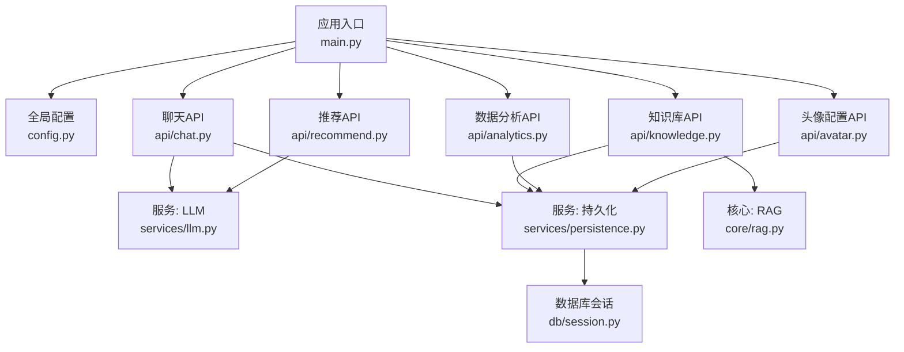
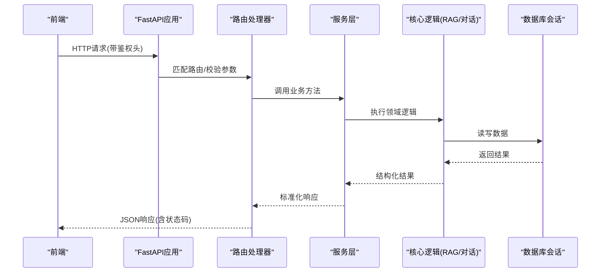
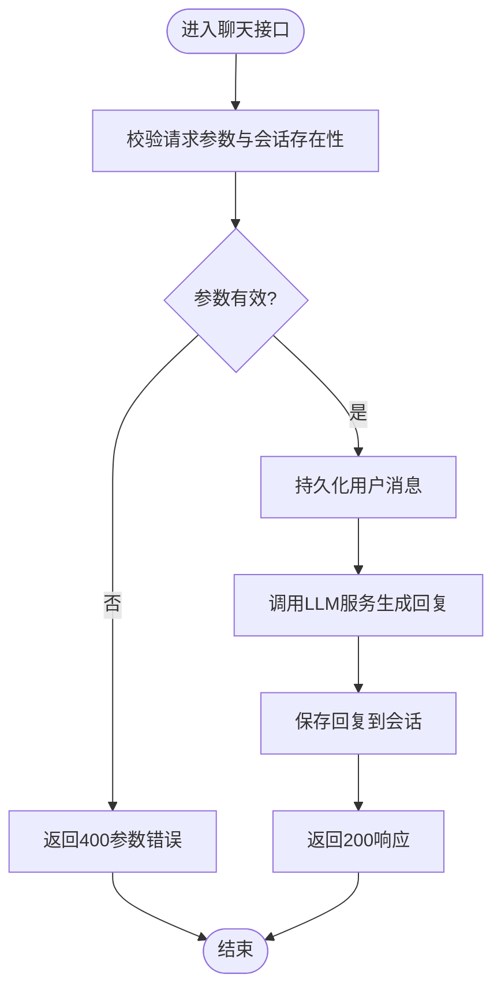
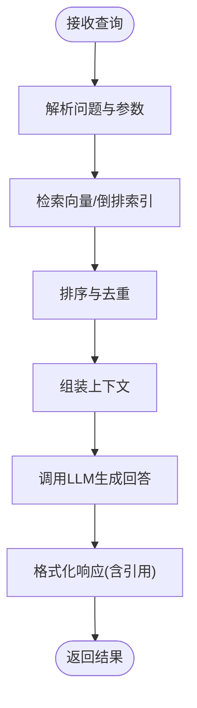
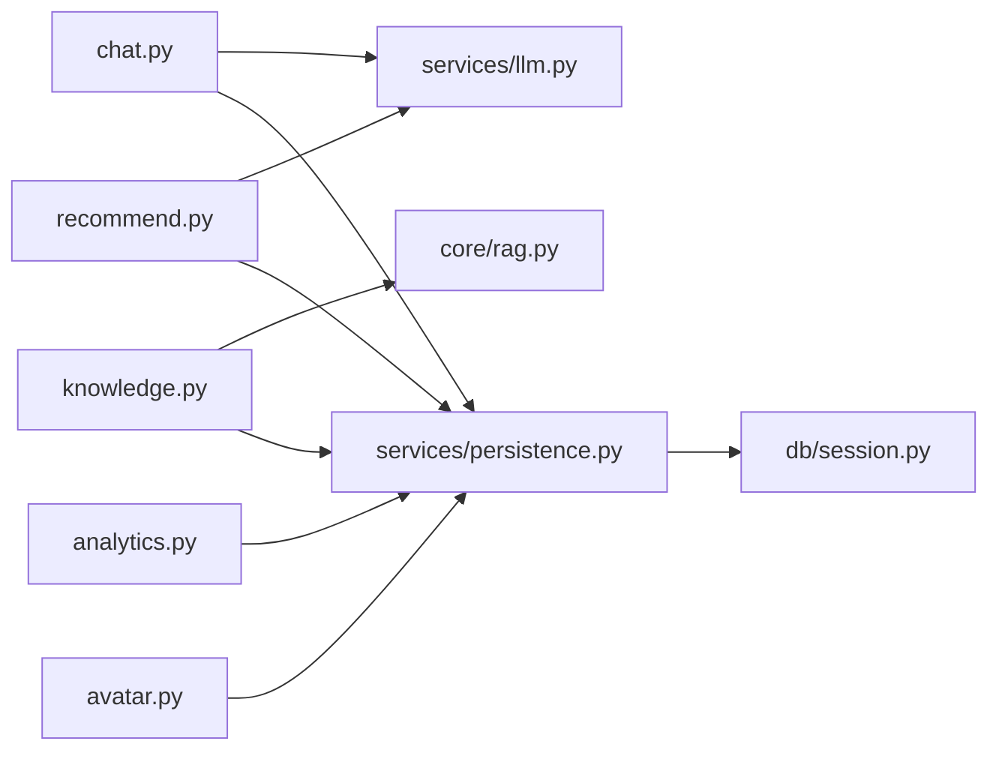

# API接口层

<cite>
**本文引用的文件**   
- [backend/app/main.py](file://backend/app/main.py)
- [backend/app/api/chat.py](file://backend/app/api/chat.py)
- [backend/app/api/knowledge.py](file://backend/app/api/knowledge.py)
- [backend/app/api/recommend.py](file://backend/app/api/recommend.py)
- [backend/app/api/analytics.py](file://backend/app/api/analytics.py)
- [backend/app/api/avatar.py](file://backend/app/api/avatar.py)
- [backend/app/models/schemas.py](file://backend/app/models/schemas.py)
- [backend/app/services/llm.py](file://backend/app/services/llm.py)
- [backend/app/services/persistence.py](file://backend/app/services/persistence.py)
- [backend/app/core/rag.py](file://backend/app/core/rag.py)
- [backend/app/db/session.py](file://backend/app/db/session.py)
- [backend/app/config.py](file://backend/app/config.py)
</cite>

## 目录
1. [简介](#简介)
2. [项目结构](#项目结构)
3. [核心组件](#核心组件)
4. [架构总览](#架构总览)
5. [详细组件分析](#详细组件分析)
6. [依赖分析](#依赖分析)
7. [性能考虑](#性能考虑)
8. [故障排查指南](#故障排查指南)
9. [结论](#结论)
10. [附录](#附录)

## 简介
本文件聚焦SmartTour后端API接口层，基于FastAPI构建RESTful服务。文档覆盖路由组织、请求参数验证、响应格式标准化与错误处理机制；并对各业务模块（聊天对话、知识库管理、推荐系统、数据分析、头像配置）的职责划分进行说明。同时给出中间件使用、CORS配置、速率限制与安全防护建议，以及API版本管理与向后兼容策略，为前端集成提供清晰指引与最佳实践。

## 项目结构
后端采用按“功能域”划分的模块化组织方式：
- 应用入口与全局配置：main.py、config.py
- API路由层：api/ 下按领域拆分 chat.py、knowledge.py、recommend.py、analytics.py、avatar.py
- 数据模型与Schema：models/schemas.py
- 服务层：services/ 封装LLM、持久化等外部能力
- 核心逻辑：core/ 包含RAG、对话管理等
- 数据库会话：db/session.py

图表来源
- [backend/app/main.py](file://backend/app/main.py)
- [backend/app/config.py](file://backend/app/config.py)
- [backend/app/api/chat.py](file://backend/app/api/chat.py)
- [backend/app/api/knowledge.py](file://backend/app/api/knowledge.py)
- [backend/app/api/recommend.py](file://backend/app/api/recommend.py)
- [backend/app/api/analytics.py](file://backend/app/api/analytics.py)
- [backend/app/api/avatar.py](file://backend/app/api/avatar.py)
- [backend/app/services/llm.py](file://backend/app/services/llm.py)
- [backend/app/services/persistence.py](file://backend/app/services/persistence.py)
- [backend/app/core/rag.py](file://backend/app/core/rag.py)
- [backend/app/db/session.py](file://backend/app/db/session.py)

章节来源
- [backend/app/main.py](file://backend/app/main.py)
- [backend/app/config.py](file://backend/app/config.py)

## 核心组件
- 应用入口与挂载
  - 创建FastAPI实例并注册各子路由，统一前缀与版本控制
  - 挂载全局中间件（CORS、请求日志、异常转换等）
  - 定义根路径与健康检查端点
- 全局配置
  - 读取环境变量，集中管理跨域白名单、密钥、限流阈值、数据库连接等
- 数据模型与校验
  - 使用Pydantic Schema对请求体与响应体进行强类型校验与序列化
- 服务层
  - LLM调用封装、持久化存储封装，屏蔽外部依赖细节
- 核心逻辑
  - RAG检索增强生成流程编排
- 数据库会话
  - 提供统一的DB会话生命周期管理

章节来源
- [backend/app/main.py](file://backend/app/main.py)
- [backend/app/config.py](file://backend/app/config.py)
- [backend/app/models/schemas.py](file://backend/app/models/schemas.py)
- [backend/app/services/llm.py](file://backend/app/services/llm.py)
- [backend/app/services/persistence.py](file://backend/app/services/persistence.py)
- [backend/app/core/rag.py](file://backend/app/core/rag.py)
- [backend/app/db/session.py](file://backend/app/db/session.py)

## 架构总览
整体遵循分层架构：API路由层负责协议与校验，服务层封装业务与外部依赖，核心层实现领域算法，数据访问层通过会话对象与数据库交互。

图表来源
- [backend/app/main.py](file://backend/app/main.py)
- [backend/app/api/chat.py](file://backend/app/api/chat.py)
- [backend/app/api/knowledge.py](file://backend/app/api/knowledge.py)
- [backend/app/api/recommend.py](file://backend/app/api/recommend.py)
- [backend/app/api/analytics.py](file://backend/app/api/analytics.py)
- [backend/app/api/avatar.py](file://backend/app/api/avatar.py)
- [backend/app/core/rag.py](file://backend/app/core/rag.py)
- [backend/app/services/persistence.py](file://backend/app/services/persistence.py)
- [backend/app/db/session.py](file://backend/app/db/session.py)

## 详细组件分析

### 聊天对话API（Chat）
职责
- 提供多轮对话、上下文管理、消息历史查询与清理
- 与LLM服务交互，结合会话持久化

主要接口
- POST /api/v1/chat/messages
  - 认证：需要鉴权头（如Authorization）
  - 请求体：消息内容、会话ID、可选的上下文参数
  - 响应：生成的回复、会话元信息
  - 状态码：200成功、400参数错误、401未授权、429限流、500服务异常
- GET /api/v1/chat/sessions/{session_id}
  - 认证：需要鉴权头
  - 响应：会话详情与消息列表
  - 状态码：200、404不存在、401
- DELETE /api/v1/chat/sessions/{session_id}
  - 认证：需要鉴权头
  - 响应：删除确认
  - 状态码：204无内容、404、401

流程图（消息发送与生成）

图表来源
- [backend/app/api/chat.py](file://backend/app/api/chat.py)
- [backend/app/services/llm.py](file://backend/app/services/llm.py)
- [backend/app/services/persistence.py](file://backend/app/services/persistence.py)
- [backend/app/models/schemas.py](file://backend/app/models/schemas.py)

章节来源
- [backend/app/api/chat.py](file://backend/app/api/chat.py)
- [backend/app/services/llm.py](file://backend/app/services/llm.py)
- [backend/app/services/persistence.py](file://backend/app/services/persistence.py)
- [backend/app/models/schemas.py](file://backend/app/models/schemas.py)

### 知识库管理API（Knowledge）
职责
- 文档上传、解析、索引与检索
- 基于RAG的知识问答与片段溯源

主要接口
- POST /api/v1/knowledge/documents
  - 认证：管理员或具备写权限
  - 请求体：文件二进制或多部分表单字段
  - 响应：任务ID或解析结果摘要
  - 状态码：201创建、400参数错误、401、413过大、500
- GET /api/v1/knowledge/documents
  - 认证：需要鉴权头
  - 查询参数：分页、过滤条件
  - 响应：文档列表与元信息
  - 状态码：200、401
- GET /api/v1/knowledge/documents/{doc_id}
  - 认证：需要鉴权头
  - 响应：文档详情与片段列表
  - 状态码：200、404
- DELETE /api/v1/knowledge/documents/{doc_id}
  - 认证：管理员或具备写权限
  - 响应：删除确认
  - 状态码：204、404、401
- POST /api/v1/knowledge/query
  - 认证：需要鉴权头
  - 请求体：问题文本、可选top_k、过滤条件
  - 响应：答案与引用片段
  - 状态码：200、400、401、500

RAG检索流程

图表来源
- [backend/app/api/knowledge.py](file://backend/app/api/knowledge.py)
- [backend/app/core/rag.py](file://backend/app/core/rag.py)
- [backend/app/services/persistence.py](file://backend/app/services/persistence.py)
- [backend/app/models/schemas.py](file://backend/app/models/schemas.py)

章节来源
- [backend/app/api/knowledge.py](file://backend/app/api/knowledge.py)
- [backend/app/core/rag.py](file://backend/app/core/rag.py)
- [backend/app/services/persistence.py](file://backend/app/services/persistence.py)
- [backend/app/models/schemas.py](file://backend/app/models/schemas.py)

### 推荐系统API（Recommend）
职责
- 基于用户画像、上下文与知识内容的个性化推荐
- 支持多种策略（协同过滤、规则、LLM辅助）

主要接口
- GET /api/v1/recommend/routes
  - 认证：需要鉴权头
  - 查询参数：用户ID、时间窗口、偏好标签、数量上限
  - 响应：推荐路线列表与评分
  - 状态码：200、400、401、500
- GET /api/v1/recommend/places
  - 认证：需要鉴权头
  - 查询参数：位置、半径、兴趣类别、数量上限
  - 响应：推荐地点列表
  - 状态码：200、400、401、500

章节来源
- [backend/app/api/recommend.py](file://backend/app/api/recommend.py)
- [backend/app/services/llm.py](file://backend/app/services/llm.py)
- [backend/app/services/persistence.py](file://backend/app/services/persistence.py)
- [backend/app/models/schemas.py](file://backend/app/models/schemas.py)

### 数据分析API（Analytics）
职责
- 聚合统计、趋势分析、会话与知识库使用指标
- 提供可视化所需的数据集

主要接口
- GET /api/v1/analytics/dashboard
  - 认证：管理员
  - 查询参数：时间范围、维度分组
  - 响应：关键指标汇总
  - 状态码：200、400、401、500
- GET /api/v1/analytics/conversations
  - 认证：管理员
  - 查询参数：会话ID、时间范围、分页
  - 响应：会话统计明细
  - 状态码：200、400、401、500
- GET /api/v1/analytics/knowledge_usage
  - 认证：管理员
  - 查询参数：文档ID、时间范围
  - 响应：文档被引用次数与热度
  - 状态码：200、400、401、500

章节来源
- [backend/app/api/analytics.py](file://backend/app/api/analytics.py)
- [backend/app/services/persistence.py](file://backend/app/services/persistence.py)
- [backend/app/models/schemas.py](file://backend/app/models/schemas.py)

### 头像配置API（Avatar）
职责
- 头像图片上传、预览、替换与删除
- 支持多种头像类型（图像、VRM模型等）

主要接口
- POST /api/v1/avatar/upload
  - 认证：需要鉴权头
  - 请求体：多部分表单，包含头像文件与类型
  - 响应：头像URL与元信息
  - 状态码：201、400、401、413、500
- GET /api/v1/avatar/{user_id}
  - 认证：需要鉴权头
  - 响应：当前头像URL与类型
  - 状态码：200、404、401
- PUT /api/v1/avatar/{user_id}
  - 认证：需要鉴权头
  - 请求体：新头像文件与类型
  - 响应：更新后的头像URL
  - 状态码：200、400、401、413、500
- DELETE /api/v1/avatar/{user_id}
  - 认证：需要鉴权头
  - 响应：删除确认
  - 状态码：204、404、401

章节来源
- [backend/app/api/avatar.py](file://backend/app/api/avatar.py)
- [backend/app/services/persistence.py](file://backend/app/services/persistence.py)
- [backend/app/models/schemas.py](file://backend/app/models/schemas.py)

## 依赖分析
API层与服务层、核心层、数据层的依赖关系如下：

图表来源
- [backend/app/api/chat.py](file://backend/app/api/chat.py)
- [backend/app/api/knowledge.py](file://backend/app/api/knowledge.py)
- [backend/app/api/recommend.py](file://backend/app/api/recommend.py)
- [backend/app/api/analytics.py](file://backend/app/api/analytics.py)
- [backend/app/api/avatar.py](file://backend/app/api/avatar.py)
- [backend/app/services/llm.py](file://backend/app/services/llm.py)
- [backend/app/services/persistence.py](file://backend/app/services/persistence.py)
- [backend/app/core/rag.py](file://backend/app/core/rag.py)
- [backend/app/db/session.py](file://backend/app/db/session.py)

章节来源
- [backend/app/api/chat.py](file://backend/app/api/chat.py)
- [backend/app/api/knowledge.py](file://backend/app/api/knowledge.py)
- [backend/app/api/recommend.py](file://backend/app/api/recommend.py)
- [backend/app/api/analytics.py](file://backend/app/api/analytics.py)
- [backend/app/api/avatar.py](file://backend/app/api/avatar.py)
- [backend/app/services/llm.py](file://backend/app/services/llm.py)
- [backend/app/services/persistence.py](file://backend/app/services/persistence.py)
- [backend/app/core/rag.py](file://backend/app/core/rag.py)
- [backend/app/db/session.py](file://backend/app/db/session.py)

## 性能考虑
- 异步I/O：优先使用异步路由与服务调用，减少阻塞
- 批量操作：对知识库导入与分析聚合提供批量接口，降低往返开销
- 缓存策略：热点问答与推荐结果可引入短期缓存（需结合一致性要求）
- 分页与过滤：所有列表接口默认分页，避免大结果集传输
- 资源限制：对上传文件大小、并发请求数进行限制，防止资源耗尽
- 数据库优化：合理索引与查询计划，避免N+1查询

[本节为通用指导，不直接分析具体文件]

## 故障排查指南
- 常见状态码
  - 400：请求参数校验失败，检查Schema约束与必填字段
  - 401：未携带或无效鉴权头，确认令牌签发与传递
  - 403：权限不足，检查角色与资源访问策略
  - 404：资源不存在，核对ID与路径
  - 413：上传文件过大，调整服务端限制或客户端压缩
  - 429：触发速率限制，实施退避重试
  - 500：内部异常，查看服务日志与堆栈
- 日志与追踪
  - 在中间件中记录请求ID、耗时与关键步骤
  - 将异常转换为标准错误响应体，便于前端统一处理
- 健康检查
  - 提供健康检查端点用于探针与自恢复

章节来源
- [backend/app/main.py](file://backend/app/main.py)
- [backend/app/models/schemas.py](file://backend/app/models/schemas.py)

## 结论
本接口层以FastAPI为核心，围绕聊天、知识库、推荐、分析与头像五大模块构建了清晰的RESTful边界。通过统一的Schema校验、标准化的响应结构与完善的错误处理，提升了前后端协作效率与系统稳定性。建议在后续迭代中持续完善鉴权、限流与监控能力，确保可扩展性与安全性。

[本节为总结性内容，不直接分析具体文件]

## 附录

### 设计原则与规范
- REST风格
  - 资源名词化、HTTP语义明确、幂等性遵循
- 版本管理
  - URL前缀包含版本号（如/api/v1），重大变更升级至v2，保持向后兼容
- 请求/响应
  - 统一JSON结构，包含code、message、data字段
  - 使用Pydantic Schema进行强类型校验与序列化
- 认证与授权
  - 基于Bearer Token的鉴权，敏感操作需管理员角色
- 安全与合规
  - CORS白名单最小化、输入校验严格、输出脱敏
  - 上传文件类型与大小限制、防注入与XSS防护

### 中间件与全局配置
- CORS
  - 仅允许受信任的前端域名
- 速率限制
  - 基于IP或用户标识的滑动窗口限流
- 请求日志
  - 记录请求ID、方法、路径、耗时、状态码
- 异常转换
  - 将业务异常与系统异常映射为标准错误响应

章节来源
- [backend/app/main.py](file://backend/app/main.py)
- [backend/app/config.py](file://backend/app/config.py)

### 前端集成指南与最佳实践
- 基础设置
  - 统一BaseURL包含版本前缀
  - 自动附加鉴权头（Authorization: Bearer <token>）
- 错误处理
  - 根据状态码分支处理，提示用户友好信息
  - 对429实施指数退避重试
- 文件上传
  - 使用multipart/form-data，限制最大体积与类型
  - 显示上传进度与失败重试
- 分页与搜索
  - 默认加载第一页，提供加载更多与搜索过滤
- 缓存与离线
  - 对静态资源与只读数据进行本地缓存
  - 网络不可用时降级展示

[本节为通用指导，不直接分析具体文件]